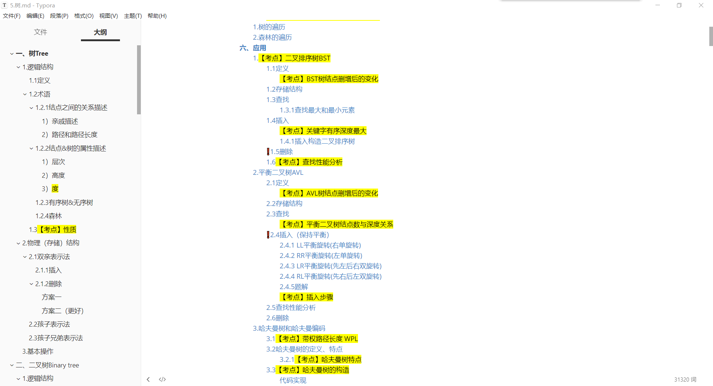
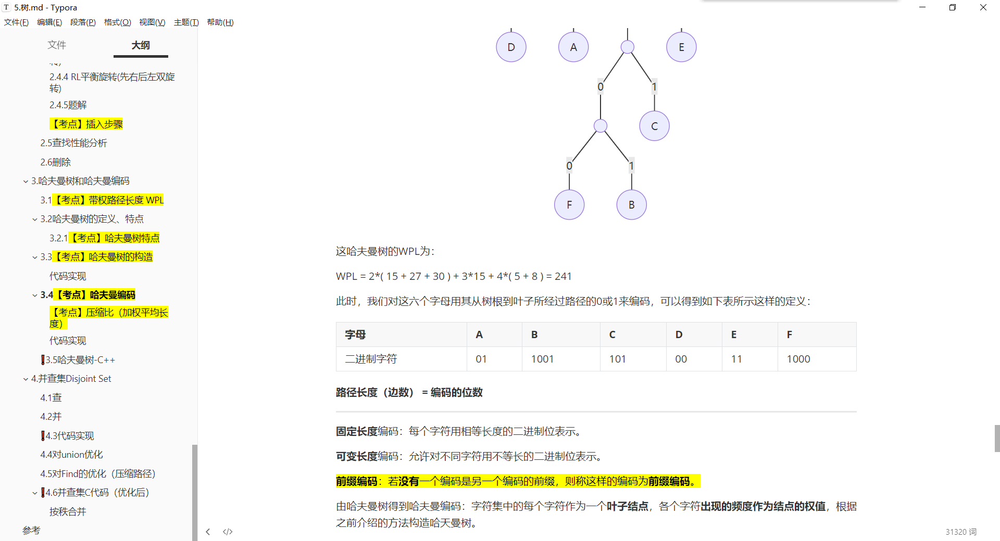
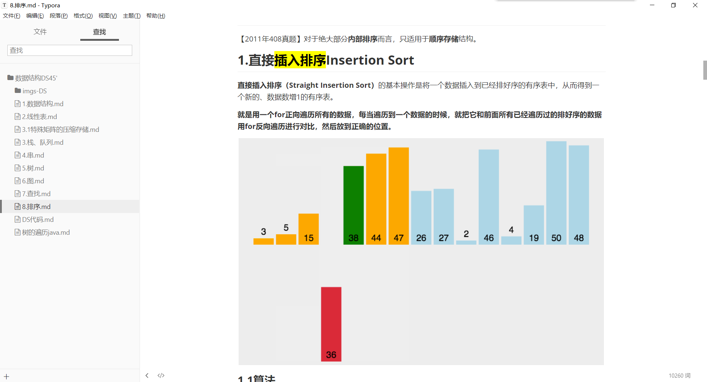
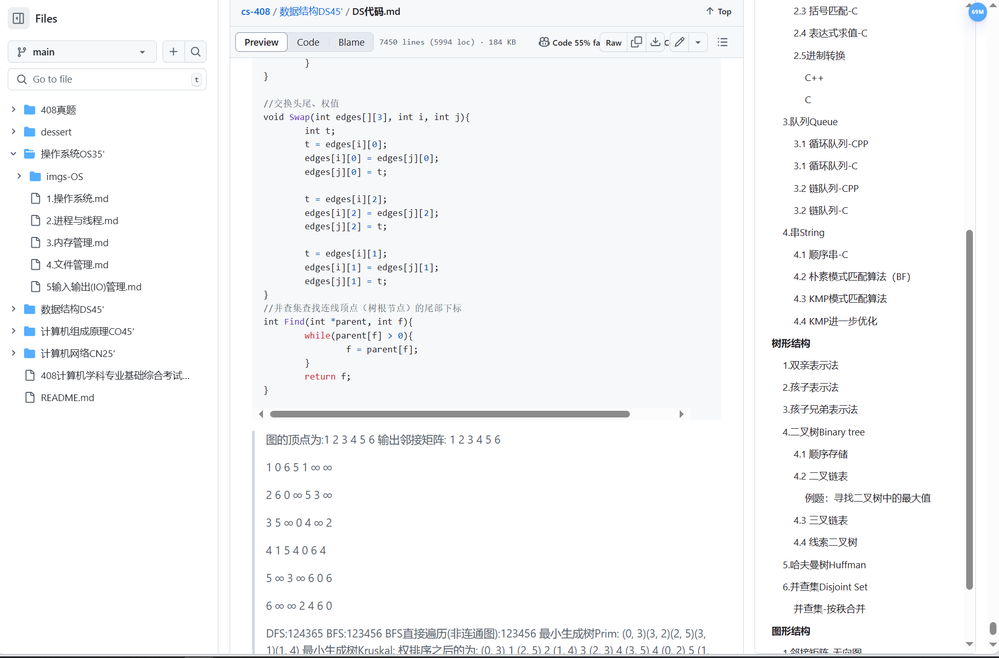

<h1 align="center">CS-408</h1>

	

        
        
        
	

	

        
        
        
    

---

计算机考研专业课程408相关的复习经验，笔记，资源，真题

## 目录

> 每个专题的目录不进行细节章节展示，可以去里面看每个章节的目录。

- 408计算机学科专业基础综合考试大纲.pdf

- **数据结构**

  - [1.数据结构](https://github.com/suhan42/cs-408/blob/main/数据结构DS45'/1.数据结构.md)

  - [2.线性表](https://github.com/suhan42/cs-408/blob/main/数据结构DS45'/2.线性表.md)

  - [3.栈、队列](https://github.com/suhan42/cs-408/blob/main/数据结构DS45'/3.栈、队列.md)

  - [3.1特殊矩阵的压缩存储](https://github.com/suhan42/cs-408/blob/main/数据结构DS45'/3.1特殊矩阵的压缩存储.md)

  - [4.串](https://github.com/suhan42/cs-408/blob/main/数据结构DS45'/4.串.md)

  - [5.树](https://github.com/suhan42/cs-408/blob/main/数据结构DS45'/5.树.md)

  - [6.图](https://github.com/suhan42/cs-408/blob/main/数据结构DS45'/6.图.md)

  - [7.查找](https://github.com/suhan42/cs-408/blob/main/数据结构DS45'/7.查找.md)

  - [8.排序](https://github.com/suhan42/cs-408/blob/main/数据结构DS45'/8.排序.md)

  - [✨DS代码](https://github.com/suhan42/cs-408/blob/main/数据结构DS45'/DS代码.md)

    几乎包含所有会用到的数据结构代码

- **计算机组成原理**

  - [1.计算机系统](https://github.com/suhan42/cs-408/blob/main/计算机组成原理CO45'/1.计算机系统.md)
  - [2.数据的表示和运算](https://github.com/suhan42/cs-408/blob/main/计算机组成原理CO45'/2.数据的表示和运算.md)
  - [3.存储系统](https://github.com/suhan42/cs-408/blob/main/计算机组成原理CO45'/3.存储系统.md)
  - [4.指令系统](https://github.com/suhan42/cs-408/blob/main/计算机组成原理CO45'/4.指令系统.md)
  - [5.中央处理器](https://github.com/suhan42/cs-408/blob/main/计算机组成原理CO45'/5.中央处理器.md)
  - [6.总线](https://github.com/suhan42/cs-408/blob/main/计算机组成原理CO45'/6.总线.md)
  - [7.输入输出(I/O)系统](https://github.com/suhan42/cs-408/blob/main/计算机组成原理CO45'/7.输入输出系统.md)

- **操作系统**

  - [1.操作系统](https://github.com/suhan42/cs-408/blob/main/操作系统OS35'/1.操作系统.md)
  - [2.进程与线程](https://github.com/suhan42/cs-408/blob/main/操作系统OS35'/2.进程与线程.md)
  - [3.内存管理](https://github.com/suhan42/cs-408/blob/main/操作系统OS35'/3.内存管理.md)
  - [4.文件管理](https://github.com/suhan42/cs-408/blob/main/操作系统OS35'/4.文件管理.md)
  - [5.输入输出(I/O)管理](https://github.com/suhan42/cs-408/blob/main/操作系统OS35'/5.输入输出(IO)管理.md)

- **计算机网络**

  - [计算机网络总结 - 408考研重点](https://github.com/suhan42/cs-408/blob/main/计算机网络CN25'/计算机网络-408考研重点.md)
  - [划分子网例子](https://github.com/suhan42/cs-408/blob/main/计算机网络CN25'/划分子网.md)

- 408真题

  - 2009-2016真题&答案
  - 2009-2023真题&答案分开版
  - 2009-2013年计算机408真题完美打印版.pdf

- dessert

  - [数学题型&考点](https://github.com/suhan42/cs-408/blob/main/dessert/数学题型%26考点.md)
  - The-Art-of-Linear-Algebra-zh-CN.pdf
  - [英语语法](https://github.com/suhan42/cs-408/blob/main/dessert/英语语法.md)

## CSDN链接

不想下载的可以看CSDN，但是CSDN更新不如GitHub及时，只能说是聊胜于无了。

[数据结构_Suhan42的博客](https://blog.csdn.net/weixin_51350847/category_12593927.html)

[计算机组成原理_Suhan42的博客](https://blog.csdn.net/weixin_51350847/category_12596653.html)

[操作系统_Suhan42的博客](https://blog.csdn.net/weixin_51350847/category_12759078.html)

[考研_Suhan42的博客](https://blog.csdn.net/weixin_51350847/category_12853039.html)

[计算机相关_Suhan42的博客](https://blog.csdn.net/weixin_51350847/category_12773871.html)

## 其他

suhan用的markdown编辑器是 Typora。因为不同的markdown编辑器渲染不同，所以会有些微的差距。如：

==高亮==，下~标~，上^标^，还有数学公式的展示等。

所以也推荐使用Typora来阅读。

---

suhan今天找到以前看的blog发现已经看不了，因为收费了😢。所以码字不易，希望大家点点**⭐Star**，suhan会继续更新的！

## 部分展示

在线：

