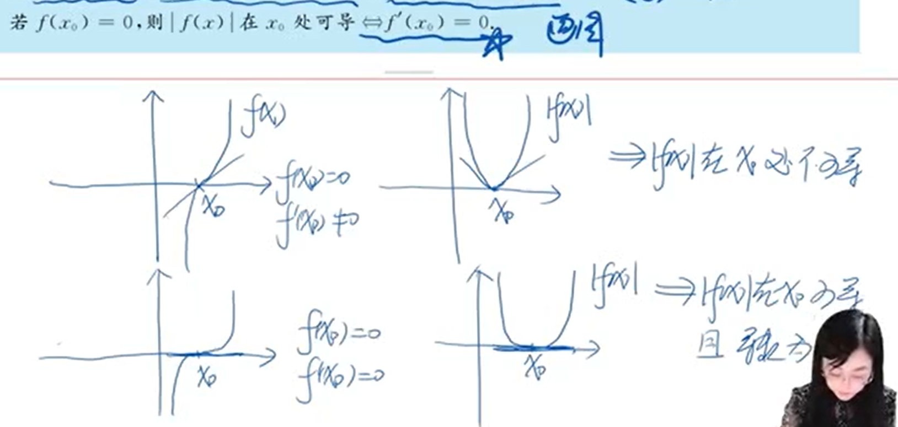

# 数学二

suhan, 2024.10

考研数学必吃榜：数二题型，考点

[toc]

# 一、函数

## ❗1.极限

可用方法：

1. 两个**基本极限**
2. **洛必达**法则
3. **等价无穷小**（x→0）
4. 上下同除**最大变量(无穷大)**（x→∞）
5. **泰勒公式**
6. 拉格朗日中值定理 p21
7. 夹逼法则
8. 定积分定义 p19（可爱因子）
8. 单调有界准则

【注意】从负方向趋近于1，那么实际上就是比1小；从正方向趋近于1，那么实际上就是比1大。

$$
\lim_{x \rightarrow1^+} \frac1{x-1} = +\infty \\
\lim_{x \rightarrow1^-} \frac1{x-1} = -\infty \\
$$
$e^{\infty} ≠ \infty$ 因为：
$$
e^{+\infty} = +\infty \\
e^{-\infty} = 0
$$
同理：
$$
\arctan(+\infty) = \frac \pi 2 \\
\arctan(-\infty) = -\frac \pi 2
$$

### 1.1常见极限

1. 首先，运用极限的运算法则（四则运算，连续函数的极限，复合函数的极限），确定极限是不是未定式极限。
2. 两种基本的未定式极限是 $\cfrac 00$ 型 和 $\cfrac ∞∞$ 型，这两种情形一般可以用洛必达法则来求。
3. 其它未定式极限（$0⋅∞，∞−∞，1^∞，0^0，∞^0$），要先化成上面的两种基本情形来求，然后用洛必达法则或者其它方法来求。

【补充技巧】

- 当 $x→∞$，可以想到 令 $t=\cfrac1x$，那么 $t→0$.
- 当出现函数作为次幂时，可以提取一个同类型的到括号外面，构建出 $(a^{\psi}-a^\phi) = a^{\phi}(a^{\psi-\phi}-1)$. 例如p20

例子：如 $e^a-e^b$，把 $e^b$ 提到外面
$$
\begin{split} 
e^a-e^b
&=e^b(e^{a-b}-1) \qquad 因\ &e^x-1 \sim x\quad (a^x-1 \sim x\ln a)\\[1em]
&=e^b(a-b)\\ 
\end{split}
$$

- 当有 $\ln (a+b+c)$，拿出里面幂最大的到外面（但不是ln外）

$$
\begin{split} 
&\quad \ln (a+b+c) \\
&=\ln (a[1+\frac ba + \frac ca]) \\
&=\ln a + \ln (1+\frac ba + \frac ca) \qquad 上下同除\ln a\\
&=1 + \cfrac 1{\ln a} · \ln (1+\frac ba + \frac ca)
\end{split}
$$

因为 a 是幂最大的，所以 $\cfrac 1{\ln a}=0$。

#### 1.1.1两个基本极限

$$
\lim_{n→∞} \frac{\sin x}x = 1 \\[2em]
\color{red} \lim_{n→∞} (1+\frac 1x)^x = e
$$

后者就是 $1^∞$ 型，也可以理解为 $(1+0)^∞=e$。

优先用下面这个方法，其次再考虑对数求导法。
$$
设为:\ \lim_{n→∞} (1+α)^β \\
A = \lim_{n→∞} α·β \\
则:\ \lim_{n→∞} (1+α)^β = e^A
$$

#### 1.1.2洛必达法则

因为 $(C)'=0$，所以当有常数出现，最好可以使用洛必达。

#### 1.1.3拉格朗日中值定理

形式是：$f(b)-f(a)$.

步骤：

1. 找到这个相减的函数；
2. 根据 $f(b)-f(a)=f'(ξ)(b-a)$；
3. 确定 ξ 的区间：$ξ∈(a,b)$；
4. 夹逼定理求 ξ；
5. 得到解。

#### 1.1.4定积分定义

**

### 1.2数列极限

数列不连续，所有不可以直接使用洛必达法则，要先把不连续的数列变成连续的函数，使其可导。

一般可以理解为：

- 极限存在：$\lim_{n→∞}a_n = a$ 一个确定的值。
- 极限不存在：$\lim_{n→∞}a_n = ∞$.

【技巧】可以把**最大无穷大**的拿到括号外面来，让括号里面出现 $\cfrac 1 ∞$ 的形式。

---

【数列 子列极限的关系】：
$$
\lim_{n→∞}a_n = \lim_{n→∞}a_{2n} = \lim_{n→∞}a_{3n} = a\\[1em]
⇔\lim_{n→∞}a_{2n} = \lim_{n→∞}a_{2n+1} = a\\[1em]
⇔\lim_{n→∞}a_{3n} = \lim_{n→∞}a_{3n+1} = \lim_{n→∞}a_{3n+2} = a\\[2em]
⇔\lim_{n→∞}a_{kn} = \lim_{n→∞}a_{kn+1} = ... = \lim_{n→∞}a_{kn+(k-1)} = a\\[1em]
$$
如果是 kn，那就要加到 kn+(k-1) 个a。

---

$$
\lim_{n→∞} \sqrt[n]{a_1^n+a_2^n+...+a_n^n} = MAX\{a_i\}
$$

#### 1.2.1 n项和数列极限

1. 夹逼法则

2. 定积分定义 p19

   前两者也会先用夹逼法则，再用定积分定义。

3. 级数求和（数一三）

#### 1.2.2 n项连乘数列极限

p33（《辅导讲义》）

#### 1.2.3 递推关系定义的数列极限

p34

### 1.3确定极限式中的参数

可提出非零极限因子。分别先求a，再求b。

【技巧】当有$x→-∞$那么要提$-x$；不想提$-x$，就要令$x=-t$，改变符号。

p38

### 1.4无穷小量阶的比较

比较两个无穷小等于 $\cfrac 00$ 型的极限。所以常用方法：

1. 洛必达法则
2. **等价无穷小**
3. **泰勒公式**
4. 变化率

当然，最重要的是背的**等价无穷小**转换。

【技巧】只要有 x 在幂次方，例如：
$$
(1+m)^x-1
$$
那么就可以使用 $e^x - 1 \sim x$ 和 $\ln(1+x) \sim x$：
$$
e^{x\ln(1+m)}-1 \sim e^{x·m}-1 \sim xm
$$

## 2.连续

连续：左右连续且相等，则函数连续。四则运算不影响连续性。

不连续那么中断：4类间断点。

初等函数在定义域都连续。

复合函数：

- 内外都连续，则复合函数连续；
- 内外都间断，则复合函数间断；
- 内外不一样，那么复合函数不一定。

### 2.1判断是否连续，不连续则判断间断点类型

把疑似间断点带进去，求**极限**。

### 2.2证明题

1. 有界性定理
2. 介值定理
3. 最值定理
4. 零点定理

# 二、一元函数微分学

## 1.导数、微分的定义

常考3种形式：

### 1.1导数定义求极限

$$
\begin{split} 
f'(x_0)
&\stackrel{增量}=\lim_{\Delta x\rightarrow 0} \frac{f(x_0 + \Delta x) \color{blue}-\\ f(x_0)}{\Delta x}
\\\\
&= \frac{\Delta y}{\Delta x}
= \lim_{x\rightarrow x_0} \frac{f(x) \color{blue}-\\ f(x_0)}{x \color{blue}-\\ x_0}
\end{split}
$$

特别的，**当 $f(0)=0$**，则：
$$
\lim_{x\rightarrow 0} \frac{f(x)}x=f'(0)
$$

求$f'(x_0)$：
$$
\lim_{\Delta x\rightarrow0} \frac{f(x_0 + \color{red}a\\ \Delta x) \color{blue}-\\ f(x_0 + \color{red}b\\\Delta x)}{\color{red}c\\\Delta x} = \frac{a\color{blue}-\\b}c · f'(x_0)
$$
【技巧】

1. 极限（可导）存在，那么**如果 Δx→0，则 Δy→0 才可以连续**。
2. 如果导数在一个区间有界，那么原函数也在这个区间有界.

### 1.2导数定义求导数

连乘的导数，可以设后面一段有规律的连乘为 g(x).

### 1.3导数定义判定可导性

【频繁考点】

- 1.3.1

$$
f'(0) = \lim_{x\rightarrow 0} \frac{f(x) -f(0)}{x}
$$

判断是否可导，就是判断这个极限是否存在.

就是看两个方向的极限是否相等：
$$
f'_+(0) = \lim_{x\rightarrow 0^+} \frac{f(0+x) -f(0)}{x}
\\\\
f'_-(0) = \lim_{x\rightarrow 0^-} \frac{f(0) -f(0-x)}{x}
$$

---

- 1.3.2极限（可导）存在，那么**如果 Δx→0，则 Δy→0 才可以连续**.

判断下面这个类型是否可导：
$$
\lim_{x\rightarrow 0} \frac{f(\phi(x))}{\psi(x)}
$$
两个条件：

1. $\phi(x)$ 要满足2点：
   1. $\phi(x) → 0\ (是正负0都趋近)$
   2. $\phi(x) \ne 0$
2. $\phi(x)$ 与 $\psi(x)$ 同阶.

---

- 1.3.3

当出现 $f(x)=g(x)|x-a|$ 类型，问 $f(x)$ 可导？

因为左导=右导，那么 $f(a)$ 可导的充要条件就是：

$g(a)=-g(a)$，即为$\color{red} g(a)=0$.

p57

---

- 1.3.4

若 $f(x)\ne 0$，则 $|f(x)|$ 在 $x_0$ 可导 <=>  $f(x)$ 在 $x_0$ 可导.

若 $f(x)=0$，则 $|f(x)|$ 在 $x_0$ 可导 <=>  $f'(x)=0$.

必须为 0，如果 $f'(x)\ne 0$ 那么 $|f(x)|$ 就不可导.

## 2.导数几何意义

几何意义：导数 $f'(x_0)$ 表示该点的斜率，切线。可导就说明有切线。

**切线** $f'(x_0)$：$y-y_0 = f'(x_0)(x-x_0)$

**法线** $k$：因为 <u>切线×法线 = -1</u>，$k= -\cfrac1{f'(x_0)}$

特殊：两个函数在切点处有公共切线（相切）满足两个条件：

1. 过同一个点，所以y相等（或x相等）；
2. 切线斜率相等。

## ❗3.求导

### 3.1复合函数

原函数是偶函数，那导函数是奇函数；原函数是奇函数，那导函数是偶函数。

**奇函数 $f'(0)=0$.**

### 3.2隐函数

$$
F(x,y)=0
$$

有两种方法：

1. 等式两边同时对自变量x求导.

   【注意】这种方法，y 是关于 x 的中间变量，所以 y 也要作为复合函数求导.

   【技巧】使用对数求导法简化乘除为加减形式（因为加减求导比乘除简单）.

2. 多元函数微分学，隐函数求导法：

   【注意】这种方法，y 和 x 就是独立变量了，所以在 Fx 与 Fy 中单独求导。
   $$
   \frac{dy}{dx} = -\frac{F'x}{F'y}
   $$

### 3.3参数方程

$\begin{cases}
x=\phi(t)\\
y=\psi(t)
\end{cases}$.一阶导：
$$
\frac{dy}{dx}
=\frac{\psi'(t)}{\phi'(t)}
=\cfrac{ \cfrac{dy}{dt} }{\cfrac{dx}{dt}}
$$
二阶导：
$$
\frac{d^2y}{dx^2}
=\frac d{dt} ·(\frac{dy}{dx})·\cfrac{1}{\cfrac{dx}{dt}}
$$

### 3.4反函数

反函数 $x=f^{-1}(y)$ 的导数  =  直接函数 $y=f(x)$ 的导数的**倒数**。
$$
令x=f^{-1}(y) = \phi(x)\\
\phi'(x) = \frac 1 {f'(x)}
$$

### 3.5对数求导法

两边同时取对数，适用于**幂指函数**、**连乘除**、**开方**、**乘方**。

> e.g: 
> $$
> y=x^{2x} \\
> \ln y = 2x \ln x \\
> \frac 1yy' = 2\ln x+2 \\
> y' = x^{2x}(2\ln x+2)
> $$

### 3.6高阶导数

1. 公式
2. 归纳
3. 泰勒级数

一些公式：
$$
(u·v)^{(n)}=\sum^n_{k=0}C^k_n·u^{(k)}·v^{(n-k)} \\
(u+v)^{(n)}=u^{(n)}+v^{(n)}
$$

## 4.导数应用

1. 罗尔定理

   

2. 拉格朗日中值定理

   

3. 柯西定理

   

### 4.1单调性、极值、最值

**驻点**：$f'(x)=0$

$f'(x)>0$，原函数单增 $f(x)↑$

驻点就是临界点，**极值点**不一定是驻点，驻点不一定是极值点，eg. $y=x^3$

极值点也可能是**不可导点**，eg. $y=|x|$

**拐点**：$f''(x)=0$，且在两侧 $f''$变号。

如果驻点有二阶导数，那么：0

$f''(x)>0$，**凹**函数，有极**小**值；

$f''(x)<0$，凸函数，有极大值。

---

#### 4.1.1求极值

步骤：

1. 确定定义域；

2. 求导找驻点、不可导点；

3. 判断极大值、极小值；

   - 根据左右单调性判断，可以画图。

   - 根据：

      $f''(x)>0$，**凹**函数，有极**小**值；

      $f''(x)<0$，凸函数，有极大值。

#### 4.1.2求最值

步骤：

1. 求出极值；
2. 求两个端点的值；
3. 比较极值和端点值。

### 4.2曲线凹凸性、拐点、渐近线、曲率

#### 4.2.1渐近线

- 水平渐近线

  有2条，趋近 $+∞$ 和 $-∞$
  $$
  \lim_{x→∞}f(x)=A \\
  水平渐近线:y=A
  $$

- 垂直渐近线
  $$
  \lim_{x→x_0}f(x)=∞ \\
  垂直渐近线:x=x_0
  $$

- 斜渐近线
  $$
  \lim_{x→∞}\frac{f(x)}x=a\ ,\ \lim_{x→∞}(f(x)-ax)=b\\[1em]
  斜渐近线:y=ax+b
  $$

【技巧】快速求斜渐近线：只要用**泰勒公式**凑出 y = ax+b 的形式，那么这个就是斜渐近线。

---

【注意】水平渐近线和斜渐近线，不能共存，因为前者斜率为0，后者斜率为a.

- **找渐近线顺序**：垂直，水平，斜。

  > 吹水协

#### 4.2.2曲率

- 直角坐标系 $y=y(x)$.
  $$
  曲率K=\frac{|y''|}{(1+y'^2)^{\frac 32}}
  $$

- 参数方程 $\begin{cases}
  x=x(t)\\
  y=y(t)
  \end{cases}$.
  $$
  曲率K=\frac{|y''x'-y'x''|}{(x'^2+y'^2)^{\frac 32}}
  $$

但是计算参数方程也可以使用上面的直角坐标系的公式，只是此时的 $y'$或$y''$ 就是参数方程的导数 $\cfrac{dy}{dx},\cfrac{d^2y}{dx^2}$.

- 曲率半径R

得到曲率之后，可以求曲率半径R
$$
曲率半径R=\frac 1K
$$
- 曲率圆方程

$$
(x-x_0)^2+(y-y_0)^2 = R^2
$$

通过：

1. 圆心在法线上（切线×法线 = -1）
2. 圆心（x0,y0）满足：$x_0^2+y_0^2=R^2$.

得到圆心位置，求得曲率圆。

特点：谁不是参数，把半径放到谁那里。

eg.通过 **关于x** 的方程$f(x)$得到$R=\cfrac12$，曲率圆方程：$x^2+(y-\cfrac12)^2=\cfrac14,也就是=R^2$.

### 4.3方程的==根==的存在性和个数

类型：

1. 存在性。讨论有没有零点（根）
   - 零点定理
   - 罗尔定理
2. 根的个数
   - 单调性
   - **罗尔定理推论**：在区间$I$上$f^{(n)}(x) \ne 0$，则方程 $f(x)$ 在该区间最多有 n 个实根。

---

【技巧】当有参数（例如a），把参数分离出来。p77

### 4.4证明：不等式

- **步骤**：

1. 用大的函数减去小的函数，定义为新函数
2. 证明这个函数大于0成立，就是证明不等式

---

常用方法：

1. **单调性**
2. 最大最小值
3. 拉格朗日中值定理
4. 泰勒公式
5. 凹凸性

---

【技巧】当不等式有两个参数 a, b，那么可以把一个参数令为 $x$，把问题转化成一个未知数、一个参数的函数不等式。

#### ==常见不等式==

$$
{\color{red} \sin x<x<\tan x} (0<x<\cfrac\pi2) \\
\frac x {1+x} < \ln(1+x) < x (x>0)
$$

### 4.5证明：微分中值定理

（重难点）

【技巧】

1. 题干给出的条件要都用上，少用一般缺点。
2. 证明在（0，1）上存在，那么如果有c∈(0, 1)，那么在（0，c）上存在也可以。

#### 4.5.1证明∃ξ∈(a,b)，使得F[ξ, f(ξ), f'(ξ)]=0成立

p81

---

- **步骤**：

1. 构造辅助函数
   - 分析法（还原法）
   - **微分方程法**：一般是解一个一阶微分方程
2. **罗尔定理**

---

另一种变式：$F[ξ, f(ξ), f'(ξ)]=0$ 中没有导数：$F[ξ, f(ξ)]=0$

1. **零点定理**，异号之间，存在 $F(ξ)=0$.
2. **拉格朗日中值定理**
3. **罗尔定理推论**

#### 4.5.2证明存在两个中值点η,ξ∈(a,b)，使得F[ξ, f(ξ), f'(ξ), η, f(η), f'(η)]=0成立

p86

函数里面的 $f'(ξ),f'(η)$ 必须**同时**出现，才是双中值点。

---

- **步骤**：

1. 把含有的 $f'(ξ),f'(η)$ 分别放到两端

2. 分为2种情况：

   1. **不要求 $ξ \ne η$**，在同一区间 $[a,b]$ 中，根据两端的导数，分别使用两次中值定理：

      - **拉格朗日中值定理**
      - **柯西中值定理**

   2. **要求 $ξ \ne η$（两个不同的点）**，把区间 $[a,b]$ 分成两个子区间 $[a,ξ],[ξ,b]$，根据两端的导数，分别在两个子区间内使用两次拉格朗日中值定理.

      其中，关键点在于$ξ$的选取，使用“逆推法”。（**介值定理**）p88

---

#### 4.5.3证明∃ξ∈(a,b)，使得F[ξ, f^(n)^(ξ)]≥0成立

含有n阶导数。使用：

1. 带拉格朗日余项的**泰勒公式；**
2. $x_0$ 选择题目中提供函数值、导数值信息多的点。

# 三、一元函数积分学

## 1.不定积分

【注意】同一个不定积分，得到的结果不一定相同。

方法：

1. 公式（包括常用二级公式）

2. 一类换元（凑微分法）

3. 二类换元（去根号）

4. **分部积分法**：用于两类不同函数的相乘
   $$
   \int udv = uv - \int vdu
   $$
   优先放到 d 后面的函数类型（优先级高到低）：

   - **三指幂对反**
   - 其中 $e^x$ 和三角函数一样优

   分部积分的作用：

   1. **消幂**（通过放在 $d$ 后面进行求导降幂）
   2. **循环**（通常会在计算中得到**原方程**，把原方程都移到左边再计算）
   3. 去分母
   4. 抵消
   5. 递推，就是递归（ $\displaystyle \int \sec^nxdx$ ）

   

5. 变量代换

6. 三角函数代换

   1. 遇到 $\sin^2x / \cos^2x$ 就降幂。

   2. 遇到 $\sin^3x / \cos^3x / \sec^3x$，奇数次幂就可以拿一个到 $d$ 的后面。

   3. 线性组合特殊方法 $\displaystyle \int \frac{a\sin x+b\cos x}{c\sin x+d\cos x}dx$.

      设：**分子 = A分母 + B（分母的导数）**

      求出 A, B

      结果就是 = **A x + B ln(分母) + C**

   4.  $\displaystyle \int \frac{1}{a\sin^2 x+b\cos^2 x}dx$.

      就把 $\cos^x$ 拿到外面去，变成 $\displaystyle \int \frac{1}{\cos^2 x(a\tan^2 x+b)}dx = \int \frac{1}{a\tan^2 x+b}d(\tan x)$.

   5.  $\displaystyle \int \frac{1}{\sin^n x · \cos^m x}dx$.

      利用 $\sin^2x + \cos^2x = 1$ 替换分子的 1，然后展开，不断重复降幂。

   

7. 有理函数的积分《三大计算 3.4》

   - 通分，然后求分子

## ❗2.定积分

【注意】定积分 就是 常数。

方法：

1. 积分中值定理（微分中值定理）p114
   $$
   \int_a^b f(x)dx = f(ξ)(b-a) = F'(ξ)(b-a) = F(b)-F(a)
   $$
   
   
   延伸：
   $$
   \int_a^b f(x)g(x) dx = 
   f(ξ)\int_a^b g(x)dx
   $$
   
1. 牛顿-莱布尼茨公式

2. 换元积分法

4. 分部积分法

   常搭配换元。p108

4. **奇偶性**
   $$
   \int^a_{-a} f(x)dx=
   \begin{cases}
   0,					&f(x)是奇函数\\[2ex]
   2\displaystyle \int^a_0 f(x)dx, &f(x)是偶函数
   \end{cases}
   $$

5. 周期性
   $$
   \int_{a}^{a+T} f(x)dx=
   \int_{0}^{T} f(x)dx \\[2ex]
   \int_{0}^{kT} f(x)dx=
   k\int_{0}^{T} f(x)dx \\
   $$

7. 华里士公式（**点火公式**）

倒计时从**下面**开始。
$$
\int_{0}^{\displaystyle\frac \pi 2} \sin^{\color{red}n} x dx=
\int_{0}^{\displaystyle\frac \pi 2} \cos^{\color{red}n} x dx=\\[2ex]
\begin{cases}
\cfrac{n-1}n · \cfrac{n-3}{n-2}...\cfrac 12 · \cfrac {\pi}2 , & n为偶数  \\[2ex]
\cfrac{n-1}n · \cfrac{n-3}{n-2}...\cfrac 23 · 1, & n为大于1的奇数  \\[2ex]
\end{cases}
$$

1. 其他公式
   $$
   \int_{0}^{\pi} f(\sin x)dx =
   2\int_{0}^{\displaystyle\frac \pi 2} f(\sin x)dx \\[2ex]
   \int_{0}^{\pi} {\color{red}x} f(\sin x)dx =
   \frac {\pi}2 \int_{0}^{\pi} f(\sin x)dx
   $$

### 2.1定积分概念、性质、几何意义

$$
\begin{split} 
\int_0^1f(x)dx 
&= \lim_{n→∞}\frac1n\sum_{k=1}^n f(\frac kn) \\[1em]
&= \lim_{n→∞}\frac1n\sum_{k=1}^n f(\frac {2k-1}{2n}) \\[1em]
\end{split}
$$

方法：

1. 积分中值定理（微分中值定理）
2. 对数求导法
3. 夹逼定理（放大放小）

### 2.2定积分计算

1. 定积分几何意义

   - 华里士公式

   

2. $\displaystyle \int_a^b f(x)dx \stackrel{x=a+b-t}= \int_a^b f(a+b-t)dt$

   上下限相加，减去t。p110

   

3. 定积分，看作常数，求导 = 0。p111

### 2.3变限积分

1. 变上限积分**求导**：

$$
[\ \int _{\phi(x)}^{\psi(x)} f(t)dt\ ]' = 
f(\psi)·\psi'(x)\ - \ f(\phi)·\phi'(x)
$$

2. 导函数 $f(x)$ **可积**，原函数 $\int f(x)$ **连续**。
3. 导函数 $f(x)$ **连续**，原函数 $\int f(x)$ **可导**（$F'(x)=f(x)$）
4. 奇偶性：进行微分、积分后，则奇偶性改变。

$f(x)$ 是导函数，$F(x)$ 是原函数：

- $F(x)→f(x)$：
  1. $F(x)$ 为偶，$f(x)$ 为奇；
  2. $F(x)$ 为奇，$f(x)$ 为偶；
  3. $F(x)$ 为周期，$f(x)$ 为周期。
- $f(x)→F(x)$：**推原函数只有一个**
  1. $f(x)$ 为奇，$F(x)$ 为**偶**。

5. 导数=0，原函数是**常数**。

### 2.4积分不等式

题型：

1. 比较积分大小顺序

   3种方法：

   1. 基本不等式
   2. 带点进去，比较大小
   3. 使 $x→0$，然后使用等价无穷小

2. 证明不等式（难）

   1. 令 $F(x) = 大的 - 小的$，即证 $F(x)>0$，变成 二、4.4函数不等式。
   2. 变上限积分

---

方法：

1. **定积分不等式**性质

   1. $x$ 在 [a,b] 上有 $f(x)≤g(x)$，则：

      $\displaystyle \int_a^b f(x)dx ≤ \int_a^b g(x)dx$

   2. （**估值定理**）$f(x)$ 在 [a,b] 上连续，其中有 $M,m$ 是 [a,b] 上的最大值、最小值，则：

      $m(b-a)≤ \displaystyle\int_a^b f(x)dx ≤M(b-a)$

   3. $\displaystyle \int_a^b f(x)dx ≤ | \int_a^b f(x)dx| ≤ \int_a^b |f(x)|dx$

   

2. 变量代换

3. 积分中值定理

   $\displaystyle \int_a^b f(x)dx = f(ξ)(b-a)$

4. **变上限积分**（出现函数单调时常用）p121

   通常会给出 $f(0)=0$，例如证明里面有一个 $\int_0^1 f(x)$，根据积分中值定理，则：
   $$
   \int_0^x f'(x)dx =f(x)-f(0) \\
   f(x) =  \int_0^x f'(x)dx
   $$

5. 柯西积分不等式（出现**平方**）p121
   $$
   [\int_a^b f(x)\ g(x)dx]^2 ≤
   \int_a^b f^2(x)dx · \int_a^bg^2(x)dx
   $$

## 3.反常积分

分为两类：

1. **无穷区间**上的反常积分
   $$
   \int_a^{+∞}f(x)dx = \lim_{b→+∞} \int_a^b f(x)dx \\
   $$
   当此时极限存在，那么**收敛**；若不存在（极限积分是无穷or不是常数），则**发散**。
   $$
   \int_{-∞}^{+∞}f(x)dx = \int_{-∞}^{0}f(x)dx + \int_{0}^{+∞}f(x)dx
   \tag{3-3}
   $$
   当上下限都是无穷，那么拆成两个同时都收敛，原积分才收敛。
   
   
   
2. **无界函数**的反常积

   若 a 为函数的**瑕点**（无界点），无界函数的反常积分也称为瑕积分。
   $$
   \int_a^b f(x)dx = \lim_{t→a} \int_t^b f(x)dx \\
   $$
   其余同 无穷区间上的反常积分 完全对应。

---

### 3.1反常积分敛散性

方法（级数）：

1. 比较判别法：**大收小收**
2. 比较判别法极限形式
3. P级数（无穷区间、无界函数两种不一样）
   1. 趋近$∞$，$\displaystyle\int_a^{+∞} \cfrac 1{x^p}dx$，==$p>1$收敛==；
   2. 趋近一个点，$\displaystyle\int_a^b \cfrac 1{(x-a)^p}dx$，==$p<1$收敛==。（这里x-a是趋近b，也可以b-x趋近a）

一些总结：
$$
\begin{split}
\int_0^1 \cfrac 1{x^a(1-x)^b}dx, &\quad a<1,b<1\quad收敛 \\\\
因为\ln x \sim x-1, 除下来, &所以下面就变成了b-1\\
\int_0^1 \cfrac {\ln x}{x^a(1-x)^b}dx, &\quad a<1,b<2\quad收敛 \\\\
因为\ln (1-x) \sim x, 除下来, &所以下面就变成了a-1\\
\int_0^1 \cfrac {\ln (1-x)}{x^a(1-x)^b}dx, &\quad a<2,b<1\quad收敛 \\\\
\int_a^{+∞} \cfrac {\ln x}{x^p}dx,&\quad p>1\quad收敛
\end{split}
$$
【技巧】一般求极限都是一个极限，也就是积分上下有一个无界、一个有界的，但是如果上下都无界，那么就需要把它们**分成两个积分极限**。如公式3-3。

### 3.2反常积分计算

方法：

1. 换元
2. **分部积分**

## 4.定积分应用

### 4.1求面积 S

**二重积分**

1. 直角坐标
2. 参数方程
3. 极坐标

### 4.2求体积 V

1. 旋转体 的体积 p127

   - **二重积分** 

     （**p130例题3**）

     - 两个公式
     - 

   - 微元法

2. 已知横截面S 的体积
   $$
   V = \int S(x)\ dx
   $$

### 4.3弧长 s

> 配合“曲率”记住

1. 直角坐标

   $s=\int \sqrt{1+y'^2(x)}dx$

2. **参数方程**
   $$
   s=\int \sqrt{x'^2(t)+y'^2(t)}dt
   $$

3. 极坐标

   $s=\int \sqrt{r^2(θ)+r'^2(θ)}dθ$

### 4.4旋转体的侧面积 S

$$
S=2 \pi \int_a^b f(x) ds \\
也就是\\
S=2 \pi \int_a^b f(x) (弧长s)\ dx \\[2em]
e.g.\ S=2 \pi \int_a^b f(x) \sqrt{1+y'^2(x)}dx
$$

### 4.5物理问题

1. 液体**压力**

   压强$P=ρgh$

   压强$P=\cfrac {压力F}{面积S}$

2. 变力沿直线所作的**功**

   功$W=Fx$

### 4.6平均值

$$
平均值 = \cfrac{\int_a^b f(x)dx}{b-a}
$$

# 四、常微分方程

## 1.微分方程

1. **可分离**变量的微分方程
   $$
   g(y)dy=f(x)dx
   $$
   当出现 $y^2$ 时，一般考虑可分离。
   
2. **齐次** 微分方程
   $$
   y' = \frac{dy}{dx} = f(\frac yx)
   $$

3. **一阶 线性** 微分方程
   $$
   y'+P(x)y = Q(x)\\[2em]
   解:y = [\int Q·e^{\int Pdx}dx+C]·e^{-\int Pdx}
   $$

---

【常见题型、技巧】

1. **上下对调**。当如 $y'=\cfrac 1{xy+y^3}$，式子在分母。对调之后，$\cfrac{dy}{dx}变\cfrac{dx}{dy}$，原本关于x的方程变为关于y的。
2. **变量代换**。当出现如 $cos(x+y)或\, (x+y)^2$，这种没法分离的，设 $u=x+y$，利用齐次微分方程的思想。

## 2.高阶方程降阶

令 $y'=p$

p138

## 3.高阶微分方程

> 联系：线性代数 - 线性方程组

1. **二阶 常系数 齐次** 微分方程
   $$
   y'' + py' + qy = 0
   $$
   根据特征方程求特征根r1, r2
   
   | 特征方程的根             | 微分方程的通解                     |
   | ------------------------ | ---------------------------------- |
   | r1,r2不同                | $y=C_1e^{r_1x}+C_2e^{r_2x}$.       |
   | r1=r2                    | $y=(C_1+C_2x)e^{rx}$.              |
   | 共轭复根r1=α+βi, r2=α-βi | $y=e^{αx}(C_1\cos βx+C_2\sin βx)$. |
   
   
   
2. **二阶 常系数 非齐次** 微分方程
   $$
   y'' + py' + qy = f(x)
   $$

---

【常见题型、技巧】p143

1. $y'' + py' + qy = f(x)$ 中的 $f(x)$ 是有多个 $P_m·e^{λx}·\sinβx$，把这几部分拆开来看，最后再加起来。

   - 【注意】**相互之间系数不相同**。例如一参数方程特征根是 λ，$f(x)=e^{λx}+e^{-λx}$，则设特解形式为：$y^*=xAe^{λx}+xBe^{-λx}$

2. （q4）齐次、非齐次的特解、通解：

   齐次解：有多个

   1. **齐次解 = 非齐次特解 - 非齐次特解**
   2. **非齐次通解 = 齐次解 + 齐次解 + 非齐次特解**
   3. **非齐次通解 = 齐次解 + 非齐次特解**

3. （q5）已知非齐次**特解**，求非齐次方程：

   （步骤）

   1. 用<u>非齐次特解</u>，求两个<u>齐次解</u>，得到**特征根 r**；

      特征方程：$(r-r_1)(r-r_2)=0$

   2. 根据特征根得到**齐次方程**；

   3. 把一个<u>非齐次特解</u>带入齐次方程，得到 $f(x)$，得到非齐次方程。

4. （q6）已知非齐次方程（方程给出，但又未知量）**一个通解**，求方程里面的未知量、非齐次方程通解：

   1. 分析已知的这个“一个解”，根据**非齐次通解 = 齐次解 + 齐次解 + 非齐次特解**，找出那个是齐次解，找出**特征根 r**；
   2. 根据特征根得到**齐次方程**；
   3. 把一个<u>非齐次特解</u>带入齐次方程，得到 $f(x)$，得到非齐次方程；

---

## 4.综合题

### 4.1积分方程

题目给出一个积分方程：

1. 当有积分号 $\int$，存在式子中，使用两边**同时求导**，来消去积分，变成微分方程。

   - 当积分不能直接求导时，考虑**变量代换**。

     一般是 $\int f(u)$，但是这个u不是单个 x，这个时候就把里面内容设为 u，目的是删去 t。

2. 求这个微分方程的**通解**（含有常数 $C$）。

3. 然后通过上面原式子or求导过程中的式子，带入特殊点，求得通解里面的**常数 $C$**。

【字眼】

- **具有二导数**：一阶导 ≠ 0。

### 4.2函数方程

1. 导数定义

   $f'(x)=\lim \cfrac {f(x+\Delta x)-f(x)}{\Delta x}$

2. 转换成微分方程

# 五、多元函数微分学

- 重极限
- 连续
- 偏导数
- **❗全微分**

## 1.重极限、连续

二重极限：$\displaystyle \lim_{(x,y)→(x_0,y_0)}f(x,y)=A$.

### 1.1求极限

常用的方法（原理）：

1. 利用极限性质（四则运算法则，**夹逼原理**）；
2. 消去分母中极限为零的因子（有理化，等价无穷小代换）；
3. 局部有界性
   - 可以在函数中，找到一部分是**有界量**，那么需要求极限的就是另一部分。p151
   - 无穷小量与有界变量之积仍为无穷小量

### 1.2证明极限不存在

$$
二重极限:\lim_{(x,y)→(x_0,y_0)} \frac{x^p·y^q}{x^m+y^n}
$$

1. m、n 不全是偶数，极限不存在。
2. 计算 $\cfrac pm + \cfrac qn$
   - **$\cfrac pm + \cfrac qn >1$，则极限 = 0**.（连续）
   - $\cfrac pm + \cfrac qn ≤1$，则极限不存在.（不连续）

## 2.偏导数、全微分

### 2.1偏导数

#### 2.1.1偏导数定义

某一点偏导存在：左右导存在且相等
$$
\lim_{Δx→0} \frac {f(x_0+Δx, y_0) - f(x_0, y_0)}{Δx} \\
=\lim_{Δx→0} \frac {f(x_0, y_0+Δy) - f(x_0, y_0)}{Δy} 
$$
==**【技巧】**先代后算==（但是在求多阶偏导慎用）

**先代后求**：实际求偏导数时候，通常给出两个变量，然后求一个偏导。那么就可以把不是所求偏导的那个变量先代进去再求，如求 x的偏导 $f_x(0,1)$，可以先把y的值代进去：
$$
\frac{∂f}{∂x} = f'_x(0,1) = \frac d{dx} [f(x,1)] |_{x=0}
$$

#### 2.1.2高阶偏导数

如对 x 求两次偏导：
$$
\frac{∂}{∂x}(\frac{∂z}{∂x}) = \frac{∂^2z}{∂x^2} = f_{xx}(x,y)
$$

- **顺序**很重要

如：**先对x求导，再对y求导**。那么合并起来写就是 $∂x∂y$，是从左到右依次的。
$$
\frac{∂}{∂y}(\frac{∂z}{∂x}) = \frac{∂^2z}{∂x∂y} = f_{xy}(x,y)
$$

### 2.2.全微分

#### 2.2.1全微分判断

全微分存在的条件：

1. $f_x、f_y$两个偏导存在；
2. $f_x、f_y$两个偏导在 $(x_0,y_0)$连续；
   - 可以使用重极限：p155

$$
\lim_{(Δx,Δy)→(x_0,y_0)} 
\frac {Δz - f'_xΔx - f'_yΔy} 
{\sqrt{(Δx)^2+(Δy)^2}} =0
$$

 Δz 则是 z 的变化量，即全增量：$dz= f(x+Δx, y+ Δy)-f(x,y)$.
$$
\lim_{(Δx,Δy)→(x_0,y_0)} 
\frac {f(x_0+Δx, y_0+Δy)-f(x_0,y_0) - f'_xΔx - f'_yΔy} 
{\sqrt{(Δx)^2+(Δy)^2}} =0
$$

#### 2.2.1全微分计算

$$
dz = \frac {∂z}{∂x}dx + \frac{∂z}{∂y}dy
$$

### 2.3复合函数

1. **复合函数求导法** u、v
   $$
   \frac {dz}{dx} = \frac {∂z}{∂u} \frac {du}{dx} + \frac{∂z}{∂v}\frac {dv}{dx}
   $$

2. **全微分**形式的**不变性**
  
   （当已经给出了 $dz$  时候好用）
   $$
   dz = \frac{∂z}{∂x}dx + \frac{∂z}{∂y}dy \\
   =\frac{∂z}{∂u}du + \frac{∂z}{∂v}dv
   $$
   
3. 复合函数**二阶微分**

### 2.4隐函数

隐函数求导的方法：

1. **公式**：隐函数 $F(x,y)=0$：（$F'_x$ 是指关于 x 的偏导）
   $$
   \frac{dy}{dx} = - \frac{F'_x}{F'_y}
   $$

2. 微分形式不变性：

   - 在 $F(x,y,z)=0$ 下：

   $$
   F'_xdx + F'_ydy + F'_zdz = 0
   $$

   - 在 $F(x,y,z)=u$ 下：
      $$
      \frac{∂F}{∂x}dx + \frac{∂F}{∂y}dy + \frac{∂F}{∂z}dz = du
      $$

3. （取对数）**等式两边同时求导**

---

### 题型（求偏导数与全微分）

#### 1）求一点处，的偏导数与全微分

1. 分段函数的分界点，偏导一般用**定义**；
2. **先代后求**。

#### 2）具体表达式函数，的偏导数与全微分

**复合函数**求偏导法

#### 3）已知偏导，求原函数（反问题，倒推）

p161，p162

对 $f'_x$ 进行积分，就是 $f+\phi(y)$，再利用给出的条件，计算出这个 $\phi(y)$.

#### 4）含有抽象函数的复合函数，的偏导数与全微分

1. ==**抽象复合** $f(f_1,f_2)$ 的导数==：

   【注意】题干中有时候也会给出 f~x~ 就是 f~1~，f~y~ 就是 f~2~

$$
df = f_1'·(f_1里面的函数的关于变量的导数) + 
f_2'·(f_2里面的函数的关于变量的导数)
$$

- 例1：$df(x+1,e^x) = f_1'(x+1,e^x)+f_2'(x+1,e^x)e^x$，或者简写：$df(x+1,e^x) = f_1'+e^xf_2'$.

- 例2：$f(yx,x^2+y^2)$ 的：

  $\displaystyle \frac{∂z}{∂x}= yf_1'+2xf_2'$.

  - 复合函数**二阶微分**：可以把 $yf_1'$ 再看作一个复合函数，而其中的 $f_1'$也是一个 $f_1'(yx,x^2+y^2)$，所以：

    $\displaystyle \frac{∂^2z}{∂x∂y}= f_1'+y(xf_{11}''+2yf_{12}'') + 2x(xf_{21}''+2yf_{22}'')$.

2. 当遇到要求的二阶偏导是其他非x,y变量，那么**直奔主题**求目标。p166

#### 5）隐函数，的偏导数与全微分

隐函数求导看2.4

1. 当给出**多个**抽象函数关系，然后求一个偏导（且函数之间变量关系不好找清楚），可以使用**微分形式不变性**。p170

   步骤：

   1. 把给出的函数关系转换成全微分形式；
   2. 消去不需要的变量。OK

## 4.极值、最值

多元函数极值、最值

### 4.1求无条件极值

无条件极值就对应一元函数的极值。

步骤：

1. 确定定义域；
2. 求导找驻点，**偏导数**为0：$$\begin{cases}
   \cfrac{∂z}{∂x}=0 \\[1em]
   \cfrac{∂z}{∂y}=0
   \end{cases}$$，得到可能多个驻点的（x~0~，y~0~）。
3. 把（x~0~，y~0~）带入二次偏导，判断极大值、极小值。

令 $f_{xx}''=A$，

$f_{xy}''=f_{yx}''=B$，

$f_{yy}''=C$，

- **AC - B^2^ ==>== 0：有极值**，A ==>== 0：是极==小==值；A < 0：是极大值。（A>0开口向上）
- AC - B^2^ < 0：无极值；
- AC - B^2^ = 0：不一定，需要讨论。

---

1. **隐函数**求导，当偏导数式子里面有**多个变量**，先令其他变量为0或者什么值，求出x，y，然后把x，y**代回原方程**，得到z（可能有多个z）。p174

### 4.2条件最值（拉格朗日乘数法）

求最大最小值

1. 只有x,y两个变量，可以使用**线性代数**求解拉格朗日函数。
2. 目标函数简化。p179
3. 画图找几何解法，例如是一个圆。

# 六、二重积分

## 1.计算二重积分

1. **直角坐标**

2. **极坐标**（圆）

3. **奇偶性** p183

   - x

     - 是**奇函数**，看区域D是否关于**y轴**对称，是则S=0；（$f(-x)=-f(x)$）
     - 是偶函数，看区域D是否关于**y轴**对称，是则S=2 × 一半。（$f(-x)=f(x)$）

   - y

     - 是**奇函数**，看区域D是否关于**x轴**对称，是则S=0；
     - 是偶函数，看区域D是否关于**x轴**对称，是则S=2 × 一半。

   - 奇偶性的**平移**

     p187方法三、p188方法三

4. **对称性**：D关于 $y=x$ 斜线对称。p184

   - y 和 x 可以对调：$\iint f(x,y)dσ = \iint f(y,x)dσ$.

   - 所以就有：
      $$
      \iint f(x,y)dσ = \frac12 \iint [f(x,y) + f(y,x)]dσ
      $$
   
   - 适合简化极坐标，然后在使用极坐标
   

【技巧】

1. 画辅助线，分成多个区域，利用奇偶性，使得积分=0.
2. 当极坐标圆心（a,b）不在xy坐标轴上，考虑使用新的$$\begin{cases}
   x-a=r\cos θ \\[0.5em]
   y-b=r\sin θ
   \end{cases}$$.

【特殊考点】

1. 摆线

## 2.累次积分：交换次序&计算

就是画出图形，看图形的特点，分区域求积分然后加和。

## 3.综合、证明

技巧：

1. 先积分x，还是先积分y，可以交换顺序。
