# 进程管理

[toc]

# 二、进程与线程

**程序**是**静态**的。一个指令序，就是个存放在磁盘里的可执行文件，就是一系列的指令集合。

**进程**是**动态**的。程序的一次执行过，同一个程序多次执行，也会有多个进程。

## 1.程序

### 1.1顺序执行的特征

1. 顺序性
2. 封闭性
3. 可再现性

### 1.2并发执行的特征

1. 间断性
2. 失去封闭性
3. 不可再现性


### 1.3 C语言编写的程序

C语言编写的程序在使用内存时候，一般分三个段：

- **正文段**：
  - 代码：二进制代码
  - 赋值数据段：常量、全局变量
- 数据**堆**段：
  - 动态分配的存储区
- 数据**栈**段：临时使用的变量：
  - 未赋值的局部变量
  - 实参传递


## 2.进程Process

### 2.1定义（组织）

为了使程序可以并发执行，并且可以对并发的程序进行描述和控制。

当进程被创建，操作系统会为该进程分配一个唯一的、不重复的“身份证号”**PID**（Process ID，进程ID）。PID存放在内存中，所以一个计算机中**进程数**的最大数受**内存大小**的影响。

3个定义：

1. 进程是程序的依次执行。

2. 进程是一个程序及其数据在处理机上的顺序执行时发生的**活动**。

   **【注意】**并发进程的运行结果具有不可再现性（每次都不一样）。

3. 进程是具有独立功能的程序在一个数据集上的执行过程，它是系统进行资源分配和调度的一个**独立的单位**。


进程是动态的；
进程实体（进程映像）是静态的。

一个**进程实体**（**进程映像**）由**PCB**、**程序段**、**数据段**组成。进程实体反应了进程在**某一时刻的状态**。进程实体可以看作进程在某一时刻的快照。

进程是进程实体的运行过程，是系统进行**资源分配**和**调度**的一个独立单位。


PCB是给操作系统用的。程序段、数据段是给进程自己用的，与进程自身的运行逻辑有关。

#### 2.1.1程序段

程序的代码，静态的（指令序列）。

#### 2.1.2数据段

运行过程中产生的各种数据（如:程序中定义的变量）


#### ❗2.1.3进程控制块PCB

process control block，PCB

创建进程实质上就是**创建PCB**，撤销进程就是撤销PCB。它**是进程存在的==唯一标志==**。

##### 1）内容

1. **进程描述**

   基本的进程描述信息，可以让操作系统区分各个进程。

   - 进程标识符PID
   - 用户标识符UID

2. **进程调度（资源分配）信息**

   给进程分配了哪些资源，可用于实现操作系统对资源的管理。

   - 在使用哪些内存区域（分配了多少内存）
   - 正在使用哪些I/O设备
   - 正在使用哪些文件
   - 代码段、数据段、堆栈段指针
   - 文件描述符

3. **进程控制和管理信息**

   - 进程当前状态
     - 就绪态
     - 阻塞态
     - 稳定态

   - 进程优先级
   - 代码运行入口地址
   - 程序外存地址
   - 进入内存时间
   - CPU、磁盘、网络使用情况
   - 信号量使用

4. **处理机状态**

   进程的运行情况，可用于实现操作系统对进程的控制、调度、进程切换。

   - 通用寄存器、地址寄存器、控制寄存器PC、标志寄存器PSW
   - 状态字

> 可以查看Linux源码中的`task struct`：Linux的进程控制块。

##### 2）作用

使一个在多道程序环境下不能独立运行的程序（含数据），成为一个能够独立运行的基本单位，即一个能与其他进程并发执行的进程。

##### 3）进程组织方式

- 线性
- 链接
- 索引

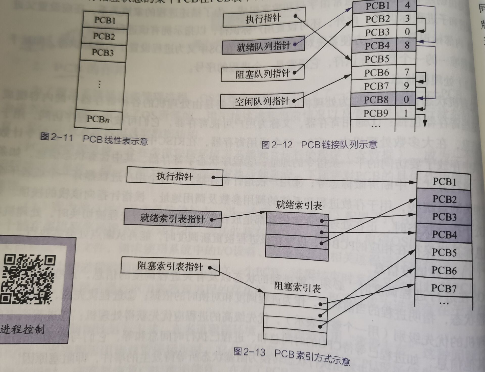


> 为什么OS引入进程的概念？
>
> 为了使程序可以并发执行，并且可以对并发的程序进行描述和控制。

### 2.2特征

1. **动态性**：（进程基本特征）
   - 进程是程序的一次执行过程，是动态地产生、变化和消亡的。
2. 并发性：
   - 内存中有多个进程实体，各进程可并发执行。
3. 独立性：
   - 进程是能独立运行、独立获得资源、独立接受调度的基本单位。
4. **异步性**：
   - 各进程按各自独立的、不可预知的速度向前推进，会导致并发程序执行结果的不确定性。操作系统要提供"进程同步机制"来解决异步问题。
5. 结构性：
   - 每个进程都会配置一个PCB。结构上看，进程由程序段、数据段、PCB组成。


### 2.3进程的状态与转换

3种基本状态：

- **就绪态**（ready）- 就绪队列。

- **执行态**（running，运行态）：单核的活就只能同时有一个在执行。

- **阻塞态**（blocked/waiting，等待态）- 阻塞队列。

  阻塞态是进程为了I/O或其他资源**主动发起**的。

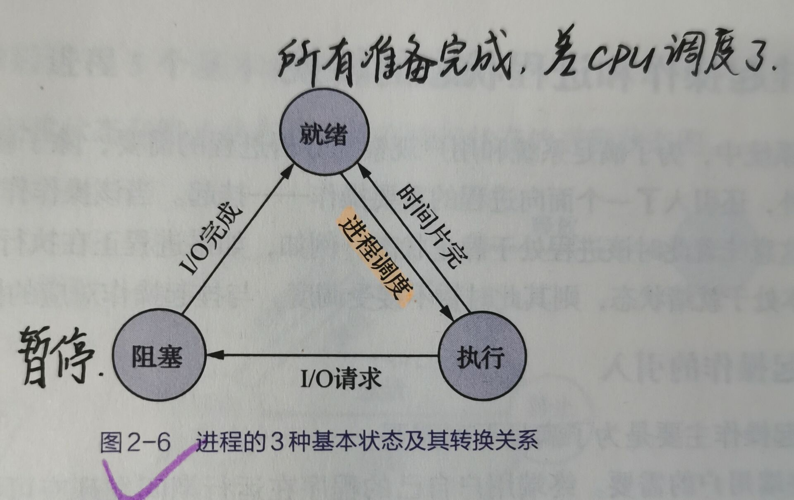

加入创建终止：

- **创建态**（new，新建态）：分配资源、初始化PCB。

【注意】进程**创建态→就绪态**的工作是由**高级调度（作业调度）**完成的。

- **终止态**（terminated，结束态）：一个进程可以执行exit系统调用，请求操作系统终止该进程。此时该进程会进入“终止态”，OS会让该进程下CPU，并回收内存空间、PCB等资源。终止工作完成进程彻底消失。

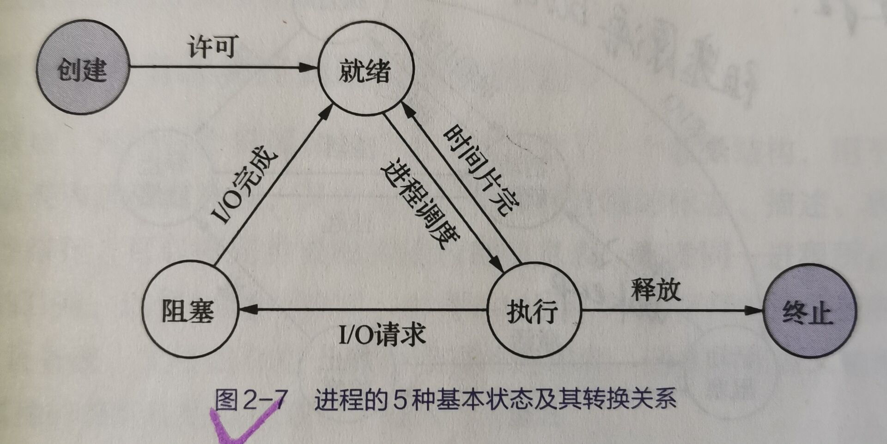

**【考点】**

1. 如果系统中没有运行的进程，那么就**一定**没有就绪的进程。
2. 如果系统中没有运行的进程，也没有就绪的进程，那么也**不一定**就说明系统没有进程。因为可能发生“**死锁**”，所有进程都在阻塞等待。
3. 采用优先级系统调度时，运行的进程**不一定**是系统中优先级最高的。因为高优先级的进程可能在等待队列（阻塞）。


#### 2.3.1挂起（7状态模型）

挂起：将内存中的进程放入外存。

- **挂起**原语suspend

- **激活**原语active


加入创建终止：

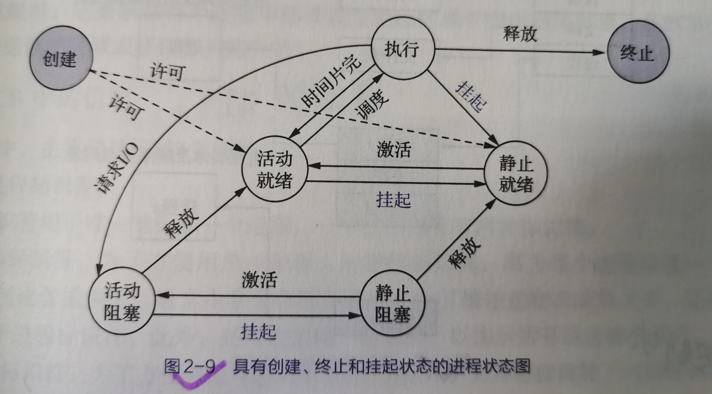

### 2.4进程控制

进程控制的主要功能是对系统中的所有进程实施有效的管理，它具有创建新进程、撤销已有进程、实现进程状态转换等功能。

【简化理解】进程控制就是要实现进程状态转换。

- 如何实现进程控制？

使用“原语”实现。

##### 原语

原语具有**原子性**，在执行期间不允许中断，一气呵成。采用**关中断**和**开中断**这两个特权指令实现原子性。


#### 2.4.1创建（创建新进程）

创建步骤（**创建原语**）：

1. 申请空白PCB；
2. 申请资源。运行所需要的物理、逻辑资源；
3. 初始化PCB。把资源分配给PCB；
4. 如果进程就绪队列能够接纳新进程，就把新进程插入就绪队列。

引起创建的事件：

1. **用户登录**：分时系统中，用户登录成功，系统会建立为其建立一个新的进程。

2. **作业调度（高级调度）**：多道批处理系统中，有新的作业放入内存时，会为其建立一个新的进程。
3. **提供服务**：用户向操作系统提出某些请求，**系统会处理用户的请求**，会新建一个进程处理该请求。
4. **应用请求**：由用户进程主动请求创建一个子进程。


#### 2.4.2终止

终止过程（撤销原语）：

1. 根据被终止进程的**标识符PID**，从PCB集合中检索出该进程的PCB，从该进程PCB中读出该进程的状态；
2. 若进程是running，则立即终止进程执行。调度标志为真，指示该进程被终止后应该重新调度；
3. 若有子进程，应终止所有子进程，防止它们变成不可控进程；
4. 被终止的进程拥有的所有资源，全部归还给父进程或者系统；
5. 将被终止的进程的PCB从队列或链表中移除。

引起终止的事件：

1. **正常结束**：进程自己请求终止（exit系统调用）。
2. **异常结束**：整数除以0、非法使用特权指令，然后被操作系统强行杀掉。
3. **外界干预**：Ctrl+Alt+delete，用户选择杀掉进程。


#### 2.4.3阻塞、唤醒

阻塞、唤醒就是一正一反，必须成对使用。

阻塞原语：

1. 找到要阻塞的进程对应的PCB；
2. 保护进程运行现场，将PCB状态信息设置为“阻塞态"，暂时停止进程运行；
3. 将PCB插入相应事件的等待队列。

唤醒原语：

1. 在事件等待队列中找到PCB；

2. 将PCB从等待队列移除，设置进程为就绪态；
3. 将PCB插入就绪队列，等待被调度。

引起的事件：

1. 向系统**请求共享资源**失败（如：缺页异常）
2. **等待**某种操作的完成
3. **等待**新数据到达
4. **等待**新任务到达

/

#### 2.4.4切换

把运行态的进程进行切换。

切换原语：

1. 将**运行环境**（寄存器存放的内容环境）信息存入PCB1；
2. PCB1移入相应队列；
3. 选择另一个进程执行，并更新其PCB2；
4. 根据PCB2恢复新进程所需的**运行环境**。

引起的事件：

1. 当前进程**时间片到**
2. 有更**高优先级**的进程到达
3. 当前进程**主动阻塞**
4. 当前**进程终止**


### 2.5进程间通信IPC

进程间通信（Inter-Process Communication，IPC）是指两个进程之间产生数据交互。**进程之间**的信息交换（通信），通常有低级、高级之分。

**一个进程不被允许直接访问其他进程的地址空间**。

#### 2.5.1共享存储器

shared-memory system

**速度最快的进程间通信。**

两个进程有一个共享空间。两者对其的访问是**互斥**的（如PV操作）。

注：通过“增加页表项/段表项”即可将同一片共享内存区映射到各个进程的地址空间中（第三章内容）。

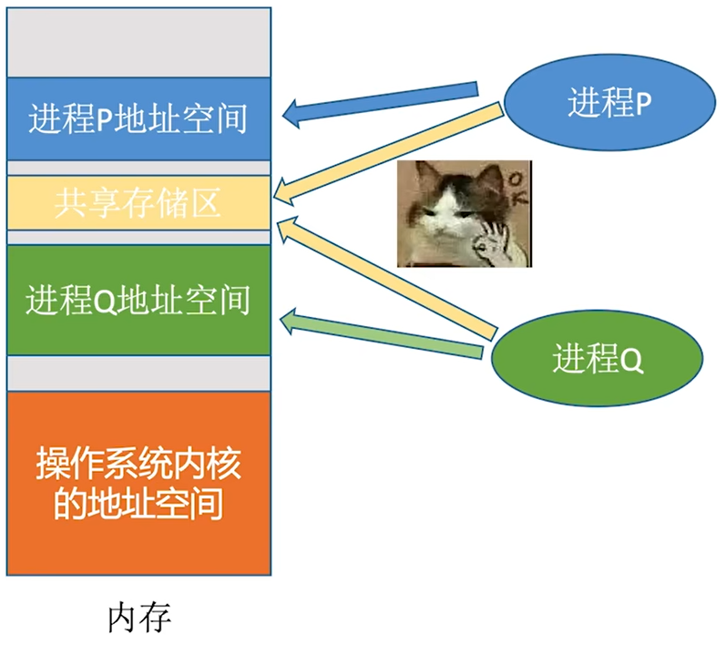

- 基于**数据结构**共享

  比如共享空间里只能放一个长度为10的数组。这种共享方式速度慢、限制多，是一种低级通信方式

  - **低级通信**

  - 在这个空间只能固定存储一种数据结构，速度慢。


- 基于**存储区**共享

  操作系统在内存中划出一块共享存储区，数据的形式、存放位置都由**通信进程控制**，而不是操作系统。这种共享方式速度很快，是一种高级通信方式。

  - **高级通信**
  - 存储更自由，**速度更快**。


#### 2.5.2管道通信（共享文件系统）

“**管道**”是一个特殊的**共享文件**，又名**pipe**文件。

- 管道是一种存储在内存中的、大小固定的**内存缓冲区**，管道的大小通常是内存的一页，和磁盘大小没有关系。（2014年408真题）
- 管道只能采用**半双工通信**，某一时间段内只能实现**单向的传输**。如果要实现**双向同时通信（全双工）**，则需要设置**两个管道**。（2014年408真题）

- 各进程要**互斥**地访问管道。
- 数据以字符流的形式写入管道，读操作写操作都可能会被阻塞。（2014年408真题）
  - 当**管道写满**时，**写进程**的write()系统调用将被**阻塞**，等待读进程将数据取走。
  - 当读进程将数据全部取走后，**管道变空**，此时**读进程**的read()系统调用将被**阻塞**。
- 管道中的数据一旦被读出，就彻底消失。因此，当多个进程读同一个管道时，可能会错乱。对此，通常有两种解决方案：
  1. 一个管道允许**多个写进程，一个读进程**（2014年408真题高教社官方答案）；
  2. 允许有多个写进程，多个读进程，但系统会让各个读进程**轮流**从管道中读数据（Linux的方案）。

**【注意】只要没满，就可以写；只要没空，就可以读。**

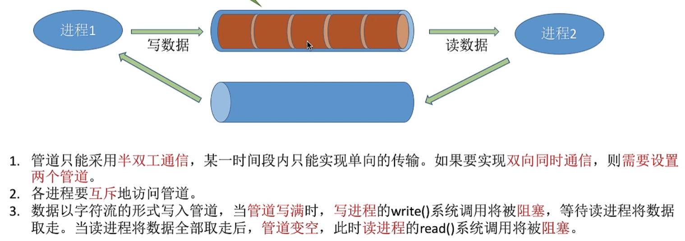


#### 2.5.3消息传递

进程间的数据交换以**格式化的消息**（Message）为单位。进程通过操作系统提供的“**发送**消息send / **接收**消息receive”两个**原语**进行数据交换。

- 直接通信方式

  发送进程利用OS所提供的发送原语，直接把消息发送给目标进程。

- **间接通信**方式：**信箱通信**

  发送进程、接收进程都通过**共享中间体（信箱）**的方式进行消息的发送、接收，完成进程间通信。


## 3.线程thread

线程（thread）是操作系统能够进行运算调度的最小单位。用于处理**相同程序**的不同片段的**并发**执行。

它被包含在进程之中，是进程中的实际运作单位。一条线程指的是进程中一个单一顺序的控制流，一个进程中可以并发多个线程，每条线程并行执行不同的任务。

> 在Unix System V及SunOS中也被称为**轻量进程**（lightweight processes），但轻量进程更多指内核线程（kernel thread），而把用户线程（user thread）称为线程。

**父进程**可以打开**子进程**或者线程，**使用线程共享的数据更多，占用空间更小**。（2020年408真题）

- 父进程、子进程可以并发执行。
- 父进程、子进程共享一部分资源，但是**不能共享虚拟地址空间**。
  父进程创建子进程时，会为子进程分配资源，就如虚拟存储空间。
- 父进程、子进程有不同的PCB。
- 父进程、子进程也不能同时访问临界资源。


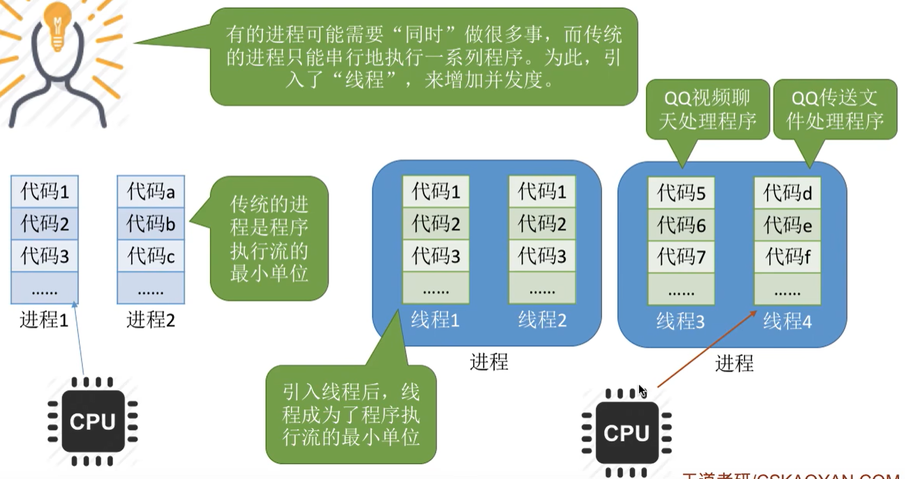

**【注意】线程没有**自己独立的**地址空间**，它共享其所属的**进程的地址空间**。所以也就不可能各自拥有不同的地址空间（2021年408真题）。

进程的PCB、打开的文件、全局变量都是线程共享的，但是唯有进程中线程的栈指针（在TCB中）是属于线程的，是线程独享的，不共享。（2011年408真题）


引入**线程**之后变化：

- 资源分配、调度
  - 传统进程机制，进程是资源分配、调度的基本单位。
  - 引入线程之后，
    - **线程**是**资源分配、调度**的基本单位，**线程**成为了一个**基本的CPU执行单元**，程序**执行流的最小单位**。
    - **进程**成为了除CPU外系统**资源的分配单元**（如打印机、内存地址空间等都是分配给进程的）。
- 并发性
  - 传统进程机制，只能**进程间**并发。
  - 引入线程之后，各**线程间**也能并发，**提高了系统并发度**。
- 系统开销
  - 传统的**进程间并发**，需要**切换进程的运行环境**，系统开销很大。
  - 引入线程之后，**线程间并发**，如果是同一进程内的线程切换，则不需要切换进程环境，节约系统资源，**系统开销小**。
- 系统进程通信
  - 由于所有**线程共享同一地址空间**，**线程间的通信**可以通过直接读写**共享内存**区域来实现，无需经过操作系统的中介，便于线程通信。（有时写“进程通信”）


- 线程的属性：

1. 线程是处理机调度的单位
2. 多CPU计算机中，各个线程可占用不同的CPU
3. 每个线程都有一个线程ID、线程控制块（TCB)
4. 线程也有就绪、阻塞、运行三种基本状态
5. 线程几乎**不拥有系统资源**
6. 同一进程的不同线程间共享进程的资源
7. 由于共享内存地址空间，同一进程中的线程间通信甚至无需系统干预
8. 同一进程中的线程切换，不会引起进程切换
9. 不同进程中的线程切换，会引起进程切换
10. 切换同进程内的线程，系统开销很小
11. 切换进程，系统开销较大


### 3.1组织与控制

线程的组织和进程一样。进程有进程控制块PCB，线程有**线程控制块**（**TCB**，thread control block）。

#### 3.1.1线程控制块TCB

包含的内容：

其中**程序计数器PC、其他寄存器、堆栈指针**是线程切换时要保存/恢复。

1. 线程标识符：TID，与PID类似
2. 程序计数器PC：线程目前执行到哪里
3. 其他寄存器：线程运行的中间结果
4. 堆栈指针：堆栈保存函数调用信息、局部变量等
5. 线程运行状态：运行/就绪/阻塞
6. 优先级：线程调度、资源分配的参考


多个TCB（线程）组织成一张线程表（thread table），构成进程。

---

控制就是不同**线程间的状态转换**，也是就绪态、运行态、阻塞态之间的转换，和进程一样。


### 3.2实现方式

#### 3.2.1用户级线程ULT

用户级线程（User-Level thread，ULT）

历史背景：早期的操作系统（如:早期Unix）只支持进程，不支持线程。当时的“线程”是由**线程库**实现的。

**用户可以看到**的线程。

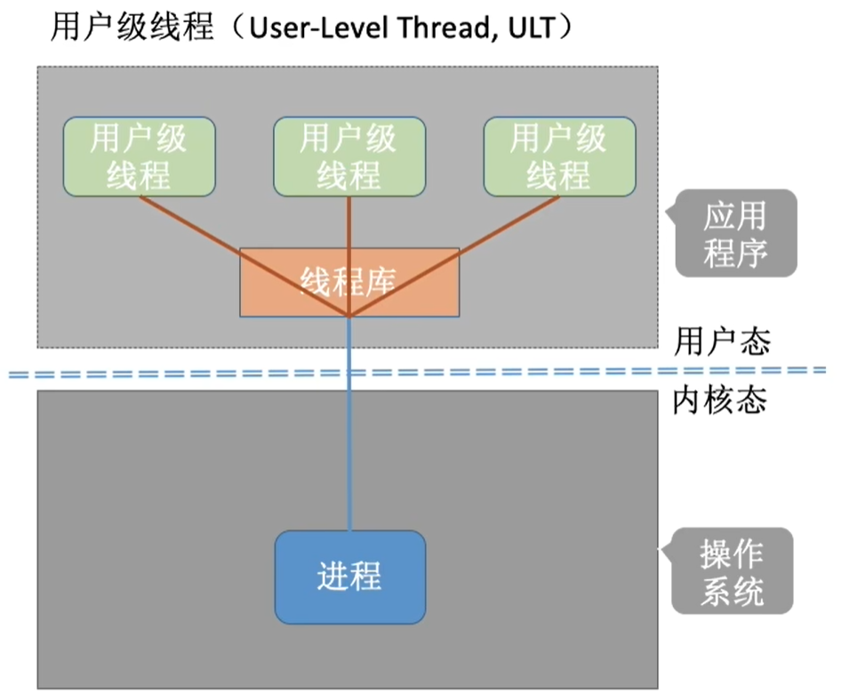

- 线程的管理工作由谁来完成？

应用程序通过**线程库**完成，不是操作系统。所以没有OS创建的线程控制块TCB。

用户级线程ULT的控制块一般是用户空间的**线程库**进行维护，数据结构格式一般是**链表或数组**。

- 线程切换是否需要CPU变态（用户态→内核态）？

不需要。因为应用程序是在用户态的，没有涉及内核态的操作系统。

- 操作系统是否能意识到用户级线程的存在？

不能。操作系统不知道用户级线程的存在，只能看到进程。

- **优点**：
  1. 用户级线程的切换在用户空间即可完成，不需要切换到核心态，线程管理的**系统开销小，效率高**。
  2. 允许每个**进程定制**自己的**调度算法**，不同的应用程序使用不同的调度算法，**线程管理灵活**。（**KLT不具有**）
  3. 在不同的操作系统上，不经修改就可以直接运行。

- **缺点**：**当一个用户级线程被阻塞后，整个进程都会被阻塞**，**并发度不高**。多个线程**不可**在多核处理机上并行运行。


#### 3.2.2内核级线程KLT

内核级线程（Kernel-Level thread，KLT）也叫**内核级支持线程**（kernel supported thread，KST）

如现在的Windows、Linux。

在核心态完成，**==内核级线程==才是处理机分配的单位**（多线程情况下也是）。

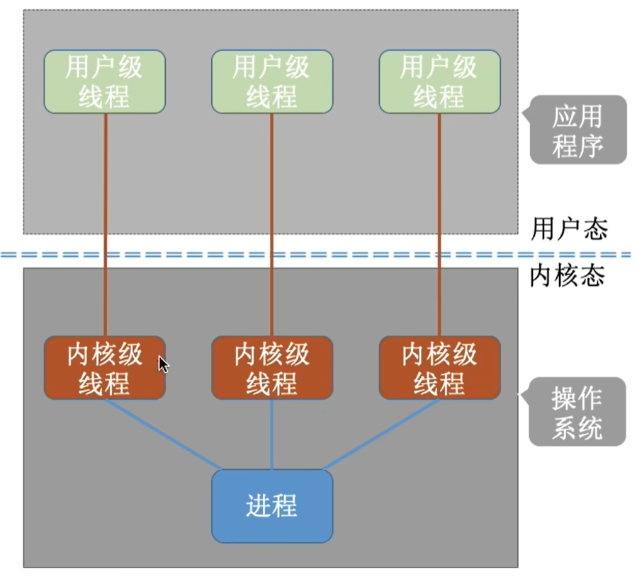

内核级线程在内核态，OS可见，所以OS会创建线程控制块TCB，而用户级线程就不会。

- **优点**：当一个线程被阻塞后，别的线程还可以继续执行，**并发能力强**。多线程可在多核处理机上并行执行。
- **缺点**：一个用户进程会占用多个内核级线程，线程切换由操作系统内核完成，需要切换到核心态，因此线程管理的成本高，**开销大，效率低**。


在支持内核级线程的系统中，根据用户级线程和内核级线程的映射关系（**将ULT和KLT结合**），可以划分为几种**多线程模型**。

### 3.3多线程模型

- **多对一**

多个ULT映射到1个KLT中，但看一个KLT就是**普通的ULT**。

1. 系统开销小，效率高。ULT的切换只需要在用户空间就可以实现，不需要切换到核心态。

2. **并发度不高**。一个ULT阻塞，整个KLT也会被阻塞。


- **一对一**

变成了纯粹的内核级线程

1. 线程管理成本高，开销大。一个用户进程会占用一个KLT，每次都要切换到操作系统内核完成。
2. 并发性高。


- **多对多**

克服了并发度不高，解决了开销太大。


> 有3个用户级线程，映射到了2个内核级线程（KLT），那么就是2个线程单位，4核处理机最多分配它2核。


###### 【题】什么是多线程？多线程与多任务有什么区别？

> 多线程是指：在一个程序中可以定义**多个线程**并同时运行它们，每个线程可以执行不同的任务。
>
> 多线程和多任务的区别：
>
> **多任务是针对操作系统而言的**，代表操作系统可以同时执行的程序个数；
>
> **线程是针对一个程序而言的**，代表一个程序可以同时执行的线程的个数，每个线程完成不同的任务。


## 4.上下文

**上下文 context**：就是一个**环境**。

上下文简单说来就是一个环境，相对于进程而言，就是**进程执行时的环境**。
具体来说就是**各个变量和数据，包括所有的寄存器变量、进程打开的文件、内存信息**等。


### 4.1进程上下文

**进程上下文**：当一个进程在执行时，**CPU的所有寄存器中的值**、**进程的状态**、**堆栈中的内容**被称为该**进程的上下文**。

也可以说：所谓的“进程上下文”，可以看作是用户进程传递给内核的这些参数以及内核要保存的那一整套的变量和寄存器值和当时的环境等。

- 进程上文：其是指进程由用户态切换到内核态是需要保存用户态时**CPU寄存器中的值**、**进程状态**、**堆栈上的内容**，即保存当前进程的进程上下文，以便再次执行该进程时，能够恢复切换时的状态，继续执行。

- 进程下文：其是指切换到内核态后执行的程序，即进程运行在内核空间的部分。

进程上下文有三个部分：用户级上下文、寄存器上下文、系统级上下文。

- **用户级上下文**：正文、数据、用户堆栈以及共享存储区；
- **寄存器上下文**：通用寄存器、程序寄存器(IP)、处理器状态寄存器(EFLAGS)、栈指针(ESP)；
- **系统级上下文**：进程控制块task_struct、内存管理信息(mm_struct、vm_area_struct、pgd、pte)、内核栈。


#### 4.1.1进程上下文切换

- **进程切换**：

当内核需要切换到另一个进程时，它需要保存当前进程的所有状态，即**保存当前进程的上下文**，以便在再次执行该进程时，能够必得到切换时的状态执行下去。

- **上下文切换**：

当发生进程调度时，进行进程切换就是上下文切换（context switch）。
操作系统必须对上面提到的全部信息进行切换，新调度的进程才能运行。


#### 4.1.2CPU内核态的三种状态

程序在执行过程中通常有**用户态**和**内核态**两种状态，CPU对处于内核态根据上下文环境进一步细分，因此有了下面三种状态：

1. 内核态，运行于进程上下文，内核代表进程运行于内核空间；
2. 内核态，运行于中断上下文，内核代表硬件运行于内核空间；
3. 用户态，运行于用户空间。


### 4.2中断上下文

硬件通过触发信号，导致内核调用中断处理程序，进入内核空间。这个过程中，硬件的一些变量和参数也要传递给内核，内核通过这些参数进行中断处理。

**中断上下文**：就是硬件传递过来的这些参数和内核需要保存的一些其他环境（主要是当前被打断执行的进程环境）。

特点：中断上下文也称**原子上下文**，该上下文中执行的**代码不可阻塞**。

- 中断上文：硬件通过中断触发信号，导致内核调用中断处理程序，进入内核空间。这个过程中，硬件的一些变量和参数也要传递给内核，内核通过这些参数进行中断处理。中断上文可以看作就是硬件传递过来的这些参数和内核需要保存的一些其他环境（主要是当前被中断的进程环境。
- 中断下文：执行在内核空间的中断服务程序。


#### 4.2.1中断上下文切换

在发生中断时，内核就在被中断进程的上下文中，在内核态下执行中断服务例程。但同时会保留所有需要用到的资源，以便中继服务结束时能恢复被中断进程的执行。

#### 4.2.2中断上下文代码中注意事项

运行于进程上下文的内核代码是可抢占的，但中断上下文则会一直运行至结束，不会被抢占。所以中断处理程序代码要受到一些限制，在中断代码中不能出现实现下面功能的代码：

1. 不能-睡眠或者放弃CPU。
   因为内核在进入中断之前会关闭进程调度，一旦睡眠或者放弃CPU，这时内核无法调度别的进程来执行，系统就会死掉。牢记：中断服务子程序一定不能睡眠（或者阻塞）。

2. 不能-尝试获得信号量
   如果获得不到信号量，代码就会睡眠，导致（1）中的结果。
3. 不能-执行耗时的任务
   中断处理应该尽可能快，因为如果一个处理程序是IRQF_DISABLED类型，他执行的时候会禁止所有本地中断线，而内核要响应大量服务和请求，中断上下文占用CPU时间太长会严重影响系统功能。中断处理程序的任务尽可能放在中断下半部执行。
4. 不能-访问用户空间的虚拟地址
   因为中断运行在内核空间。


### 4.3上下文切换（内核角度看）

#### 为什么要进行不同之间状态的切换？

在现在操作系统中，内核功能模块运行在内核空间，而应用程序运行在用户空间。现代的CPU都具有不同的操作模式，代表不同的级别，不同的级别具有不同的功能，其所拥有的资源也不同；在较低的级别中将禁止使用某些处理器的资源。Linux系统设计时利用了这种硬件特性，使用了两个级别，最高级别和最低级别，内核运行在最高级别（内核态），这个级别几乎可以使用处理器的所有资源，而应用程序运行在较低级别（用户态），在这个级别的用户不能对硬件进行直接访问以及对内存的非授权访问。内核态和用户态有自己的内存映射，即自己的地址空间。

当工作在用户态的进程想访问某些内核才能访问的资源时，必须通过**系统调用**或者**中断**切换到内核态，由内核代替其执行。**进程上下文**和**中断上下文**就是完成这两种状态切换所进行的**操作总称**。我将其理解为**保存用户空间状态**是上文，**切换后在内核态执行的程序**是下文。

---

具体Linux的函数接口：

上下文切换定义：上下文切换，即从一个可执行进程切换到另一个可执行进程。由 context_switch() 函数负责处理。

上下文切换过程：每当一个新的进程被选出来准备投入运行的时候， schedule() 就会调用该函数，它完成两项基本的工作。

- 切换虚拟内存：调用 switch_mm()，把虚拟内存从上一个进程映射切换到新进程中

- 切换处理器：调用 switch_to()，从上一个进程的处理器状态切换到新进程的处理器状态。包括保存、恢复栈信息和寄存器信息，以及其他任何与体系结构相关的状态信息。


# 三、处理机调度

进程调度是有代价的，频繁进行进程调度就会把时间用在进程的调度上，而真正用户数据的处理的时间就变少了，就使整个系统的效率下降。

**【注意】处于临界区的进程**，**也可**能因为中断、抢占而**被调度**。


## 1.三个调度层次

### 1.1高级调度/作业调度

长程调度、**作业调度**

调度的对象是**作业**，外存**静态**的作业。

过程：外存有很多个作业（程序），按一定的原则从外存的作业后备队列中挑选一个作业调入内存，并创建进程。每个作业只调入一次，调出一次。作业调入时会建立PCB，调出时撤销PCB。

用户向系统提交一个作业 = 用户让操作系统启动一个程序（来处理一个具体的任务）。

### 1.2中级调度/内存调度

中程调度、**内存调度**

调度的对象是**挂起的进程**。

目的：提高内存利用率和系统的吞吐量。

暂时调到外存等待的进程状态，就是**挂起**。但是PCB还是会在内存。

### 1.3低级调度/进程调度

短程调度、**进程调度、处理机调度**

调度的对象是**进程**、LWP。

进程调度是操作系统中最**基本的**一种调度，在一般的操作系统中都必须配置进程调度。

进程调度的频率很高，一般几十毫秒一次。


|                  | 作业调度（高级调度） | 内存调度（中级调度） | 进程调度（低级调度） |
| ---------------- | -------------------- | -------------------- | -------------------- |
| 发生频率         | 低                   | 中                   | 高                   |
| 发生方式         | 外存->内存（作业）   | 外存->内存（进程）   | 内存->CPU            |
| 对进程状态的影响 | 无->创建态->就绪态   | 挂起态->就绪态       | 就绪态->运行态       |


## 2.何时进行进程调度

- 可以进行调度
  - 进程**主动放弃**处理机（有的系统中只允许主动放弃处理机）
    - 进程**正常终止**
    - 进程发生**异常终止**
    - 进程主动**请求阻塞**（如等待I/O）
  - 进程**被动放弃**处理机
    - 进程**时间片用完**
    - **有更紧急的处理**（如I/O中断）
    - 有**更高优先级**的进程进入就绪队列
- 不可以进行调度
  - 在处理**中断**的过程。中断处理很复杂，与硬件密切相关，很难进行进程切换。
  - 进程在操作系统**内核程序临界区**。（但是普通临界区可以调度、切换）
  - 在进行**原语**操作。

---

**临界资源**：一个时间段内只允许一个进程使用的资源。各进程需要互斥地访问临界资源。

**临界区**：访问临界资源的那段代码。

**内核程序临界区**：一般是用来访问某种内核数据结构的，比如进程的就绪队列（由各就绪进程的PCB组成）。

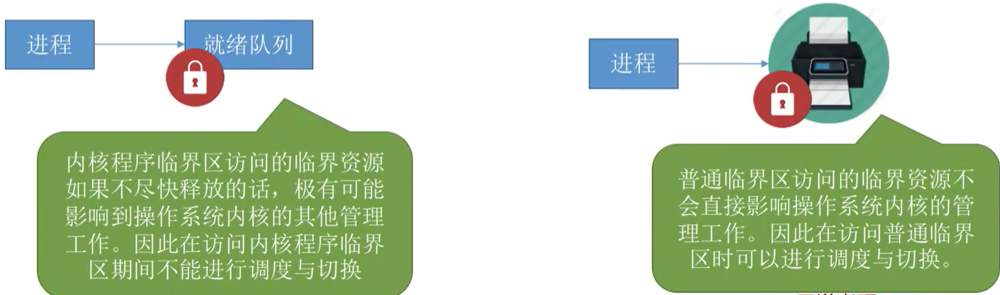

> （2012联考）进程处于**临界区**时不能进行处理机调度（×）
>
> 这里的临界区时**普通的临界区**，他不会影响操作系统内核的工作，所以可以进行进程调度。


## 3.进程调度方式

### 3.1非抢占调度方式

非抢占方式、非剥夺调度方式。

只允许进程主动放弃处理机。在运行过程中即便有更紧迫的任务到达，当前进程依然会继续使用处理机，直到该进程终止或主动要求进入阻塞态。

引起它调度的原因有：

1. 进程运行完毕
2. 主动放弃CPU进行阻塞（I/O请求）
3. 在进程通信、同步的过程中执行了某种原语。

特点：实现简单，系统开销小但是无法及时处理紧急任务，适合于早期的批处理系统。

### 3.2抢占调度方式

抢占方式、剥夺调度方式。

当一个进程正在处理机上执行时，如果有一个更重要或更紧迫的进程需要使用处理机，则立即暂停正在执行的进程，将处理机分配给更重要紧迫的那个进程。

原则：

1. 优先级原则
2. 短进程优先原则
3. 时间片原则

特点：可以优先处理更紧急的进程，也可实现让各进程按时间片轮流执行的功能（通过时钟中断）。适合于分时操作系统、实时操作系统。


## 4.进程调度、切换

- “广义的进程调度”、“狭义的进程调度”、“进程切换”的区别：

**进程切换**：指一个进程让出处理机，由另一个进程占用处理机的过程。

**狭义的进程调度**：指的是从就绪队列中选中一个要运行的进程。（这个进程可以是刚刚被暂停执行的进程，也可能是另一个进程，后一种情况就需要进程切换）

**广义的进程调度**：包含了选择一个进程和进程切换两个步骤。

进程切换的过程主要完成了：

1. 对原来进程保存CPU现场信息（给PCB）；
2. 对新的进程各种数据进行恢复。

（如:程序计数器PC、程序状态字PSW、各种数据寄存器等处理机现场信息，这些信息一般保存在**进程控制块PCB**）

【注意】**进程切换是有代价的**，因此如果过于频繁的进行进程调度、切换，必然会使整个系统的效率降低，使系统大部分时间都花在了进程切换上，而真正用于执行进程的时间减少。


## 5.调度器、闲逛进程

### 5.1调度器/调度程序 scheduler

**调度程序**：控制让哪个程序运行，运行多久。

调度时机――什么事件会触发“调度程序”？

1. **创建新进程。**
2. **进程退出。**
3. 运行**进程阻塞。**
4. **I/O中断**发生（可能唤醒某些阻塞进程）。
5. 非抢占式调度策略，只有运行**进程阻塞**或**退出**才触发调度程序工作。
6. 抢占式调度策略，每个时钟中断或k个**时钟中断**会触发调度程序工。

### 5.2闲逛进程 idle

CPU不会彻底闲下来，调度程序永远的备胎，没有其他就绪进程时，运行**闲逛进程（idle）**。

闲逛进程的特性：

1. 优先级最低
2. 可以是0地址指令，占一个完整的指令周期（指令周期末尾例行检查中断）
3. 能耗低


## 6.调度算法目标

处理机调度算法的共同目标：

1. 资源利用率
2. 公平性
3. 平衡性
4. 策略强制执行

批处理系统的目标：

1. 平均作业周转时间短
2. 系统吞吐量高
3. 处理机利用率高

分时操作系统目标：

1. 保证响应时间快
2. 保证均衡性

实时操作系统目标：

1. 保证满足截止时间要求
2. 保证可预测性


## 7.调度算法的==评价指标==

**CPU利用率**
$$
CPU利用率=\frac{有效工作时间}{总工作时间（有效+空闲等待）}
$$
**系统吞吐量**：单位时间完成的作业数量。
$$
系统吞吐量=\frac{总共完成的作业数}{总共花费的时间}
$$
**周转时间**：作业从提交的系统到作业完成是时间（越小越好）。
$$
\color{red}（作业）周转时间=作业完成时间刻-作业提交时间刻 \\
=等待时间+运行时间（理解，但这个不常用）
$$
**平均**周转时间：
$$
\color{red} 平均周转时间=\frac{周转时间之和}{作业数}
$$

**带权周转时间**一定是**>=1**的。（越小越好）。
$$
带权周转时间=\frac{周转时间}{作业实际运行的时间}
$$

**等待时间**：在等待处理机的时间。调度算法一般影响的就是等待时间。

**响应时间**：用户从提交请求到首次产生响应的时间。

相应比：
$$
相应比 = \cfrac{等待时间+要求服务时间}{要求服务时间}
$$


## ❗8.==调度算法==

### 8.1非抢占式

这几种算法主要关心对用户的公平性、平均周转时间、平均等待时间等评价系统整体性能的指标，但是不关心“响应时间”，也并不区分任务的紧急程度，因此对于用户来说，交互性很糟糕，不适合用于现在**交互式系统**的调度算法。

因此这三种算法一般适合用于**早期的批处理系统**，当然，FCFS算法也常结合其他的算法使用，在现在也扮演着很重要的角色。

#### 8.1.1先来先服务FCFS

first come first server

按照作业/进程到达的先后顺序进行服务。

用于作业、进程调度。

优点：公平，算法实现简单，**系统开销小**。

缺点：排在长作业后面的短作业的带权周转时间大。**对长作业有利，对短作业不利**。

长作业是占用很长时间CPU，少用I/O的进程，可以理解成**CPU繁忙型**。

不会造成饥饿。

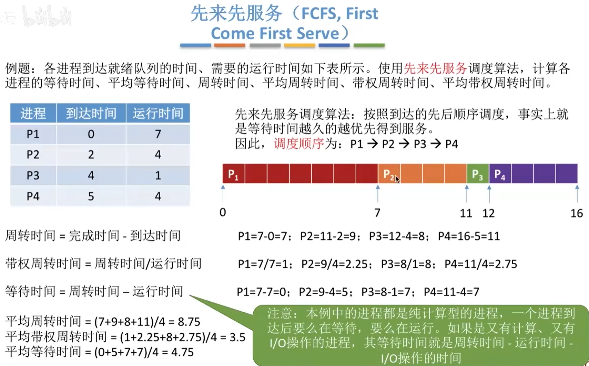


#### 8.1.2短作业优先SJF

short job first

短作业优先级高（先运行）：先来的作业先进行，进行完了之后，使用SJF挑选最短的作业放入后面。

用于进程时叫**短进程优先SPF**。SJF和SPF都是非抢占式的，但是**最短剩余时间优先（SRTN）**是抢占式的。

**最短剩余时间优先（SRTN）**：每次进入一个新的作业（进程），会重新计算每一个作业剩余的时间有多少，重新规划下一个剩余时间最短的作业放入后面。

优点：**==最短的平均等待时间==**。

缺点：对短作业有利，对长作业不利。

**可能会导致长作业饥饿**

【注意】

1. 如果题目中**未特别说明**，所提到的“短作业/进程优先算法”**默认是非抢占式**的。
2. 在所有**进程都几乎同时到达**时，采用SJF调度算法的平均等待时间、平均周转时间最少（可以抢占的话那就SRTN，所有实际是不一定）。


#### 8.1.3高响应比优先HRRN

highest response ratio next

第一个进程先进行，完成之后主动放弃，这时候计算作业的响应比（**等待时间**是：不同的进程此时**已经等待**的时间）。**响应比**（response ratio）**大**的优先。

相应比一定>=1。
$$
相应比(>=1)=\frac{已经等待时间+要求服务时间(运行时间)}{要求服务时间}
$$
用于作业、进程调度。

优点：综合考虑了等待时间和运行时间，从而避免了长作业饥饿的问题。

不会造成饥饿。


### 8.2抢占式

交互式系统

#### 8.2.1时间片轮转RR

round robin

用于**分时**操作系统。

将就绪进程按照FCFS排成一个就绪队列，设置一个**时间片**（分割为大小相同的时间片），一个进程在时间片内未执行完，剥夺处理机（**时钟中断**），并把它重新放到队尾。

**仅用于进程**调度。

优点：公平、响应快，适合**分时操作系统，人机交互**。

缺点：高频率进程切换，开销太大。不区分任务紧急程度。

不会造成饥饿。


【2010年408真题】进程时间片用完是**降低进程优先级**的合理时机。

---

如果时间片太大，使得每个进程都可以在一个时间片内就完成，则时间片轮转调度RR算法退化为先来先服务FCFS调度算法，并且会增大进程响应时间。因此**时间片不能太大**。

另一方面，进程调度、切换是有时间代价的（保存、恢复运行环境)，因此如果时间片太小，会导致进程切换过于频繁，系统会花大量的时间来处理进程切换，从而导致实际用于进程执行的时间比例减少。可见**时间片也不能太小**。

一般来说，设许时间片时要让切换进程的开销占比不超过1%。


#### 8.2.2优先级调度算法

priority-scheduling algorithm

可以抢占也可以不抢占。

**实时系统**的进程调度是**抢占式优先级高优先**算法。

用于作业、进程调度。

根据优先级是否可以动态改变，可将优先级分为静态优先级和动态优先级两种：

- 静态优先级：优先级在创建进程时确定，保持不变。
- 动态优先级：在进程创建初赋予一个优先级，后续会随着进程或时间改变而改变。

优点：用优先级区分紧急程度，可以灵活地调整进程。

缺点：如果一直有高优先级的进程进入，那么低优先级就饥饿。

低优先级可能会造成**饥饿**。

---

【注意】就绪队列未必只有一个，可以按照不同优先级来组织。也可以把优先级高的进程排在更靠近队头的位置。

- 如何设置优先级：

**系统**进程**优先级高于**用户进程

**前台**进程**优先级高于**后台进程

**I/O型**进程（I/O繁忙型进程）**优先级高于**计算型进程（CPU繁忙型进程）

> 因为I/O尽早的开始工作，资源利用率、系统吞吐量越高

- 如何调整动态优先级：

可以从追求公平、提升资源利用率等角度考虑：

1. 如果某进程在就绪队列中等待了很长时间，则可以适当提升其优先级
2. 如果某进程占用处理机运行了很长时间，则可适当降低其优先级
3. 如果发现一个进程频繁地进行l/O操作，则可适当提升其优先级


#### 8.2.3多级反馈队列MLFQ

multilevel feedback queue

> FCFS算法的优点是公平。
> SJF算法的优点是能尽快处理完短作业，平均等待/周转时间等参数很优秀。
> RR算法可以让各个进程得到及时的响应。
> 优先级调度算法可以灵活地调整各种进程被服务的机会。

综合上述5种算法，得到综合表现最好的算法：**多级反馈队列调度算法MLFQ**。

设计多级反馈队列调度算法，需要考虑的是：（2020年408真题）

1. 就绪队列的数量；
2. 就绪队列的优先级；
3. 各级就绪队列的调度算法；
4. 进程在就绪队列的迁移时间。

---

流程：划分多个队列，每个队列内部采用FCFS，队列1的进程执行完成之后进入队列2的队尾。**当队列1有进程时，队列2内进程无法进行，上一级队列空，下一级队列开始进行**。

当发生更高优先级进程进入，会剥夺当前进程的处理机，放入它当前出发的队列（而不是下一级队列），然后进程新来的优先级高的进程。

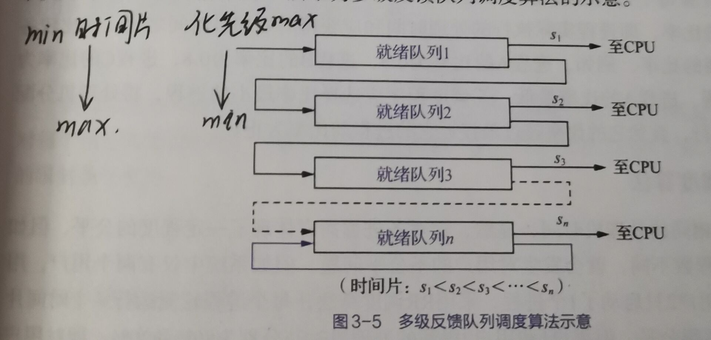

**时间片越往下越大，优先级越往下越小。**

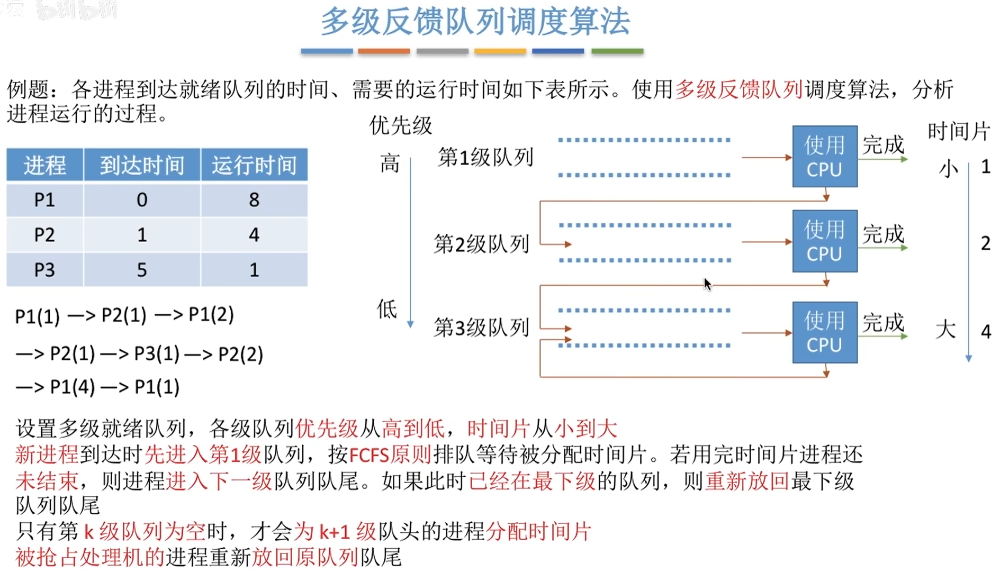

用于进程调度。目前公认最好。

可能会造成**饥饿**。

缺点：**系统开销大**。

---

【注意】各队列可采用不同的调度策略，如：

- 系统进程队列采用优先级调度
- 交互式队列采用RR
- 批处理队列采用FCFS


# 四、进程同步、互斥

## 1.进程同步

进程具有特征**异步性**：各进程按各自独立的、不可预知的速度向前推进，会导致并发程序执行结果的不确定性。

**进程同步**：在异步环境下，一组并发进程因**直接制约（协调）**而互相发送消息、互相合作、互相等待，使得各进程按一定的速度执行的过程，称为**进程同步**。（同步也称**直接制约关系**）

一般有2种形式的制约关系：**同步关系**、**互斥关系**。


### 1.1原语

一般是指由若干条指令组成的程序段，用来实现某个特定功能，在执行过程中不可被中断。（原语一旦开始执行，就要连续执行完，不允许中断。）

### 1.2忙等

所谓“忙等”，是指“**不让权”的等待**，也就是说，进程因为某事件的发生而无法继续执行，仍然不释放处理器，并通过不断执行循环检测指令来等待该事件的完成以便能够继续执行。


## 2.★临界资源

如打印机等，进程在使用它们时需要采用互斥的方式，这样的资源称为**临界资源**（critical resource），它们可以是硬件也可以是软件，比如文件。

不论软硬件临界资源，多个进程必须互斥地对他们进行访问。人们把在每个进程中**访问临界资源**的那段**代码**称为**临界区**。

### 2.1临界区4原则

1. **空闲让进**
2. **忙则等待**
3. **有限等待**：对要求访问的进程，保证它在有限的时间内进入临界区，防止“**死等**”（饥饿）。
4. **让权等待**（原则遵循，不一定）：当进程不能进入临界区，应该立即释放处理机，防止进程“**忙等**”。

```c
do{
	entry section 		//进入区(上锁)
	critical section 	//临界区(访问资源)
	exit section 		//退出区(解锁)
	remainder section 	//剩余区
} while(true)
```


下面两个方面（软件、硬件）实现进程互斥

### 2.2软件实现方案

#### 2.2.1 单标志法

两个进程访问完临界区后，把临界区交给另一个进程。即进程进入临界区的权限是被另一个进程赋予的。

```c
int turn = 0; //当前允许进入的进程号
P0 进程：                        P1 进程：
while (turn != 0);              while (turn != 1); // 进入区，这里使用的就是死等，一直等直到turn==1才结束循环
critical section;               critical section;  // 临界区
turn = 1;                       turn = 0;		   // 退出区
remainder section;              remainder section; // 剩余区
```

违背了**空闲让进**的原则。p1必须在p0结束后才能进入临界区，但是p0如果一直不进入临界区，那么虽然临界区空闲，但是p1仍然不被允许访问。

> **比如**：现在是桌上只有一双筷子，有A跟B两个人，一开始先把筷子给A，A吃完后直接就把筷子洗干净给B了，然后说你吃完再把筷子洗干净给我，结果B无语了，他也没说要用筷子吃东西，然后A就是说不管，你必须吃完过后再把筷子给我，结果A自己又想吃的时候结果没有筷子用，因为筷子还在B那里呢，B还在纳闷A怕不是有什么大病。


#### 2.2.2 双标志检查法

设置一个数组flag[2]，这里与前面不同之处就是，先设置自己的标志位，再检测对方的标志状态，若对方的标志位为true则等待。

```c
//双标志先检查法
bool flag[2]= {false,false}; //表示想要进去临界区的组数，这里开始都不想

P0 进程：                        P1 进程：
while (flag[1]);    			while (flag[0]);    // 进入区，检查对方是否想使用，不想(false)则可以不用
flag[0] = true;                 flag[1] = true; 	// 进入区
critical section;               critical section;	// 临界区
flag[0] = false;                flag[1] = false;	// 退出区
remainder section;              remainder section;  // 剩余区


//双标志后检查法
bool flag[2]= {false,false}; //表示想要进去临界区的组数，这里开始都不想

P0 进程：                        P1 进程：
flag[0] = true;   			    flag[1] = true;		// 进入区
while (flag[1]);                while (flag[0]); 	// 进入区
critical section;               critical section;	// 临界区
flag[0] = false;                flag[1] = false;	// 退出区
remainder section;              remainder section;  // 剩余区
```

违背了**忙则等待**和**空闲让进**、**有限等待**。可能两个进程同时进入临界区，也可能两个进程都进入不了临界区的"饥饿"现象。

原因在于，进入区的“检查”和“上锁”两个处理**不是一气呵成**的。“检查”后，“上锁”前可能发生进程切换。

> **比如**：现在还是桌上只有一双筷子，但是现在就不是A跟B了，换成孔融1号和孔融2号，为什么给他们这样取名字呢，后面就知道啦！现在这两个人呢，在想用筷子的时候都会先说出来表明自己的态度，然后再看对方会不会想要先用筷子，然后再判断下一步是使用筷子还是接着等待。如果一开始两个人同时表明自己想要筷子的话，对方都会考虑到礼仪问题，谦让给对方用，毕竟谁叫他们叫孔融呢，但是这样出现的问题就是明明有筷子可以用但是因为谦让而僵持住。结果两个人就只能饿着了，在操作系统里面这里就出现了"死等"，即会存在进程产生"饥饿"。


#### 2.2.3 Peterson算法

设置一个数组flag[2]，这里与前面不同之处就是，先设置自己的标志位，再检测对方的标志状态，若对方的标志位为true则等待呗。

Peterson 算法实际上同时结合了单标志法和双标志后检查法。

它的核心就是：在一开始还是和后检查法一样，抢先进行“上锁”，但是上锁之后又将 turn 置为对方线程，表示自己虽然想要进入临界区，但是不介意“将这个机会让给对方”（所以**turn是保存了最后一个谦让**）。尽管如此，由于 while 的限制条件增加了，而 turn 又是公用的，所以保证了最后只会有一方的 while 满足条件。既做到了互斥访问资源，也避免了双方都访问不到资源。

```c
int turn; //当前允许进入的进程
bool flag[2]; //谁是true，表示谁想进入临界区


P0 进程：                        P1 进程：
    //下面turn = 1是允许对方先进入临界区的谦让
flag[0] = true;					flag[1] = true;     		 // 进入区
turn = 1;                       turn = 0;
while (flag[1] && turn == 1);   while (flag[0] && turn == 0);// 进入区
critical section;               critical section;	// 临界区
flag[0] = false;                flag[1] = false;	// 退出区
remainder section;              remainder section;	// 剩余区
```

不遵循"**让权等待**"原则，会发生“忙等"。


### 2.3硬件实现方案

#### 2.3.1 关中断（中断屏蔽方法）

关中断就是禁止处理机响应中断源的请求，与原语类似。

```
关中断;
临界区;
开中断;
```

优点：关中断是最简单、高效的实现互斥的方法之一。

缺点：不适用于多处理机。只适用于操作系统内核进程，不适用于用户进程。因为开、关中断的指令只能运行在内核态，允许用户随意使用会很危险。


#### 2.3.2 Test-and-Set（TS，TSL指令）

**TS指令**（也称Test-And-Set-Lock，**TSL指令**，测试并建立）是用硬件实现的，在执行的过程中不允许被中断。

若刚开始lock是false，则TSL返回的old值为false，while循环条件不满足，直接跳过循环，进入临界区。若刚开始lock是true，则执行TLS后old返回的值为true，while循环条件满足，会一直循环，直到当前访问临界区的进程在退出区进行“解锁”。

相比软件实现方法，TSL指令把“上锁”和“检查”操作用硬件的方式变成了一气呵成的原子操作。

```c
//布尔型共享变量lock表示当前临界区是否加锁
//true表示已加锁. false表示未加锁
bool TS(bool *lock){
    bool old;
    old = *lock;	//存放原来的lock值
    *lock = true;	//资源正在被使用，上锁，关闭临界区
    return old;		//返回lock原来的值
}

do{
    while( TS(&lock) );	//忙等,检查上锁
    critical section;
    lock = false;		//解锁
    remainder section;
}while(true);
```

`*lock=false`表示资源空闲。

优点：实现简单，无需像软件实现方法那样严格检查是否会有逻辑漏洞；适用于多处理机环境。

缺点：不满足“**让权等待**”原则，暂时无法进入临界区的进程会占用CPU并循环执行TSL指令，从而导致“**忙等**”。


#### 2.3.3 SWAP指令（XCHG指令）

有的地方叫exchange指令，在Intel 80x86中叫**XCHG指令**，所有它是交换指令。

逻辑上来看Swap和TSL并无太大区别，都是先记录下此时临界区是否已经被上锁（记录在old变量上），再将上锁标记lock设置为true，最后检查old，如果old为 false则说明之前没有别的进程对临界区上锁，则可跳出循环，进入临界区。

```c
bool lock;	//lock是全局变量

void swap(bool *a, bool *b){
    bool temp;
    temp = *a;
    *a = *b;
    *b = temp;
}

do{
    bool old = true;		//局部变量old
    do{
		swap(&lock, &old);	//把lock的值放到old中判断是否上锁
    }while(old == true);	//上锁true就一直忙等
    critical section;
    lock = false;
    remainder section;
}while(true);
```

`lock=false`表示资源空闲，没有被上锁。

`old=false`表示之前没有被上锁。


优点：实现简单，无需像软件实现方法那样严格检查是否会有逻辑漏洞；适用于多处理机环境。

缺点：不满足“让权等待”原则，暂时无法进入临界区的进程会占用CPU并循环执行TSL指令，从而导致“忙等”。


## 3.信号量机制PV

1965年荷兰学者迪杰斯特拉特出信号量（semaphores）机制。利用**一对原语**解决**检查**和**上锁**这两个操作无法同时进行的问题。

一对原语**wait(S)**和**signal(S)**，它们可以简写成**P(S)**，**V(S)**，源于荷兰语（proberen，verhogen）。

信号量其实就是一个**变量**（可以是一个整数，也可以是更复杂的记录型变量)，可以用一个信号量来**表示系统中某种资源的数量**，比如:系统中只有一台打印机，就可以设置一个初值为1的信号量。


### 3.1 整型信号量

```c
int S = 1;	//表示有一个资源
```

- **S>0：有资源**
- **S<0：有|S|个等待队列进程**
- **S=0：无资源**

```c
void wait(int S){	//wait原语,相当于进入区
    while(S <= 0);	//如果资源不够,就一直循环等待
    S--;			//资源够了,就占用一个资源
}
void signal(int S){	//signal原语,退出区
    S++;			//释放资源
}

进程：
...
wait(S);			//进入区,申请资源
critical section;	//临界区,使用资源
signal(S);			//退出区,释放资源
...
```


### 3.2 ==记录型信号量==

整型信号量的缺陷是存在“**忙等**”问题，因此人们又提出了“记录型信号量”，即用记录型数据结构表示的信号量。

有缓冲区（等待队列）

```c
/*定义记录型信号量 结构体*/
typedef struct {
    int value;			//剩余资源数量
    struct process *L;	//等待队列
} semaphore;

void wait(semaphore S){
    S.value--;
    //如果剩余资源不足，就使用block原语（阻塞）使进程主动放弃处理机，并把S放到阻塞队列中
    if(S.value < 0){
        block(S.L);
    }
}

void signal(semaphore S){
    S.value++;
    //释放资源后，如果阻塞队列中还有进程，就用wakeup原语（唤醒）队列中的进程，使其进入就绪态
    if(S.value <=0){
        wakeup(S.L);
    }
}
```


### 3.3 AND型信号量

可以避免“死锁”。

为了解决**一次分配多种资源**，每种资源每次分配一个，一次获得进程所需要的所有资源(每种个1个)，否则进程阻塞，是记录型信号量上的进一步延伸。

AND型信号量的阻塞队列机制，为每种资源设置一个阻塞队列，当最先出现资源不足的资源种类为Ri时，那么进程就被阻塞在Ri资源对应的阻塞队列中。

```c
void wait(S1, S2, …, Sn){
	if (S1 >= 1 && … && Sn >= 1 ){	//所有资源足够
        for(i=1; i<=n; i++) 
            Si--;
    }
    else{将该进程放入与发现的第一个si < 1相关联的等待队列中，并将该进程的进度计数设置为等待操作的开始。}
}

void signal(S1, S2, …, Sn){
	for (i=1; i<=n; i++) {
        Si++;
        将与si关联的队列中等待的所有进程移到就绪队列中。
    }
}
```

S1到Sn都表示所需资源，资源数都大于1，对每个资源进行--表示资源被占用，分配好资源之后跳出循环，wait操作结束。如果其中某个资源Si得不到满足，会执行else中的内容：把进程放进Si关联的阻塞队列中，然后程序计数器把指针移向wait操作开始。（wait操作是原语，遵循要执行都执行，执行不了就从头重新执行）

----

AND型信号量满足了“多种资源，数量为1”的使用情景，但是实际上还会有多种资源数量不固定的情景，AND型信号量显然处理不了这种情况的进程调度。

为了解决多资源多数量的情况，出现了**信号量集**。


### 3.4 信号量集

AND的进一步延伸，设置一个最低资源数目>=1，和进程需要的资源数目>=0。

现在的使用情景是多资源多数量， 就是一个进程需要申请多个资源，每个资源数量又要求多个。描述资源的结构体做出了改动：

申请n类资源，每类资源最低t个，每类申请d个资源。

```c
typedef  struct{
    int value;
    int d;
    int t;
    struct process_control_block * list;
} semaphore;

void wait(S1, t1, d1; …; Sn, tn, dn){
    if (S1>= t1 && … && Sn>=tn){
        for (i=1; i<=n; i++) {
           Si = Si - di;
        }
    }
    else{
        将正在执行的进程放在第一个具有si <的等待队列中，并将其程序计数器设置为等待操作的开始.
    }    
}

void signal(S1, d1, …, Sn, dn){
    for (i=1; i<=n; i++) {
        Si = Si - di;
        将与si关联的队列中等待(process waiting)的所有进程移到ready queue中.
    }
}
```

原有的value和list阻塞队列保留，新增属性t和d。

d表示**进程需要的某类资源的数量**，t表示**进程能执行需要某类资源数量的最小值**，value表示当前某类资源个数。

这里的d、t必须满足关系t>=d才能保证进程可以执行。解释一下：假设d=5，也就是进程本身需要5个A资源；t=7，也就是进程最小需要7个A类资源才能执行，多出来的两个是分给操作系统使用的，因为控制进程执行的指令也需要操作系统分配资源。当然当前i资源数S也必须大于7才能保证进程整体可以执行。

---

信号量集是由整形信号量一步步演变而来，每次演变都继承了上次的工作机制并且进行了缺点的改造。信号量集的已经可以适用较多的情景了。

如果wait(S,1,1)那么就是需要1种资源，需要的资源数量为1，如果S>=1这就退化成了记录型信号量；如果S=1就退化成了互斥信号量（整型信号量）。


### 3.5 信号量的应用

#### 3.5.1实现进程互斥

设置**互斥信号量mutex**，初始值为1，取值范围为（-1，0，1）

- **mutex= 1：两个进程都没有进入互斥访问的临界区**
- **mutex= 0：有一个进程在临界区运行**
- **mutex= -1：有一个进程在临界区运行，另一个因等待而阻塞在信号量队列中**

在记录型信号量的基础之上，进程访问临界区就可以直接写：

```c
semaphore mutex = 1;	//初始化信号量（记录型信号量）
P1(){
	...
    P(mutex);
    critical section;
    V(mutex);
    ...
}
```

【注意】对不同的临界资源需要设置不同的互斥信号量。


#### 3.5.2实现进程同步（前驱关系）

进程同步：要让各并发进程按要求有序地推进。

比如：代码4需要在代码1和代码2完成之后才能开始，那么就需要调度到1->2->4实现同步关系。保证一前一后地执行。

```c
semaphore s=0;

P1(){				P2(){
    code1;				P(s);
    code2;				code4;
    V(s);				code5;
    code3;				code6;
}					}
```

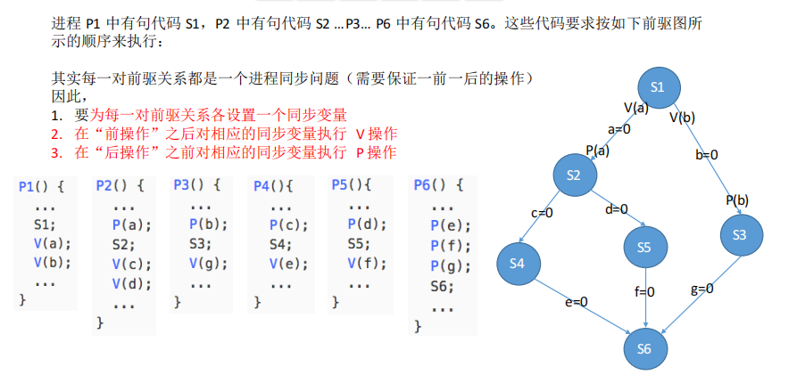

## 4.管程机制

信号量机制在编写的时候，编写程序困难、易出错，所以引入**管程（monitor）**的概念。

> 1973年，Brinch Hansen首次在程序设计语言（Pascal）中引入了“管程”成分——一种高级同步机制。

定义：管程是一种高级的同步机制，本质上也是用于实现进程的同步互斥。OS资源管理模块。

由编译器负责实现各进程互斥地进入管程中的过程，程序员不需要再手动实现”互斥“，直接调用方法，就已经互斥的进行的。

### 4.1 组成

管程是一种特殊的软件模块（有点像类）

1. 局部于管程的**共享数据结构**（结构体）
2. 对该数据结构进行操作的一组**过程**（函数）
3. 对局部于管程的共享数据设置初始值的语句
4. 管程有一个名字

### 4.2 特征

1. 局部于管程的数据只能被局部与管程的过程（函数、方法）所访问；
2. 一个进程只能通过调用管程内的过程才能进入管程访问共享数据

3. **每次仅允许一个进程在管程内**执行某个内部过程。

1、2就是**管程里面的数据结构，只能被管程里面的函数修改，调用这个函数来修改**。

### 4.3 Java中的管程

Java中用`synchronized`来描述一个函数，那么这个函数同一时间内仅能被一个线程调用。

```java
public synchronized void insert(bool lock){
	...
}

//每次只能有一个线程进入insert 函数，如果多个线程同时调用 insert 函数，则后来者需要排队等待。
static class monitor {
    private Item buffer[] = new Item[N];
    private int count = 0;
    
    public synchronized void insert (Item item) {
        ...
    }
}
```


## 5.经典进程同步问题

### 5.1 PV操作问题解决思路

1. 关系分析。找出各进程、进程之间的**互斥、同步关系**。
2. 整理思路。根据各进程的操作流程，确定**P、V操作的大致顺序**。
3. 设置信号量。根据题目条件确定**信号量的初值**。（互斥信号量一般初值为1，同步信号量要看对应的资源的数量）

设置信号量，要考虑的是**临界区事件的前后关系**，而不是进程的关系，后者联系会变多，信号量多。


### 5.2 生产者-消费者

producer-consumer

生产者-消费者问题，在两者之间设立**n个缓冲池**，生产者进程将它的所有产品放入一个缓冲区（就是临界资源），消费者从缓冲池中取出产品。这过程中，两者进程是以**异步的方式**（取时不能放，放时不能取）运行的，但是它们之间需要**保持同步**（一前一后），即：

**不允许消费者去空缓冲区去产品，不允许生产者去已经装满了产品的缓冲区放产品**。

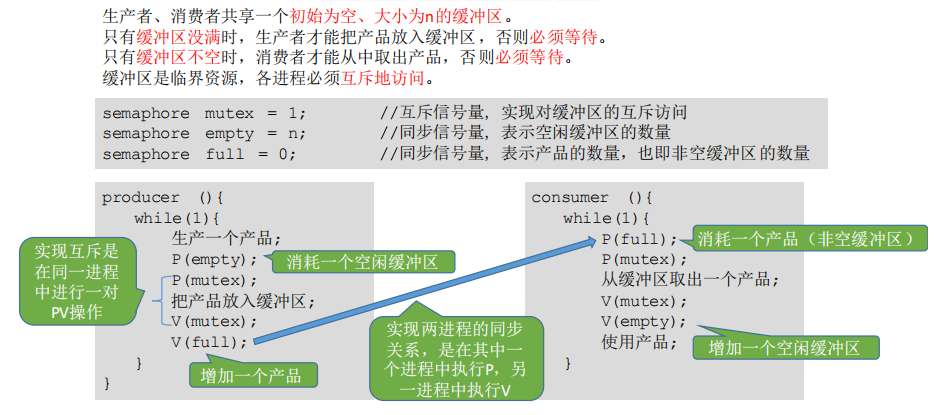

- 多生产者-消费者问题：


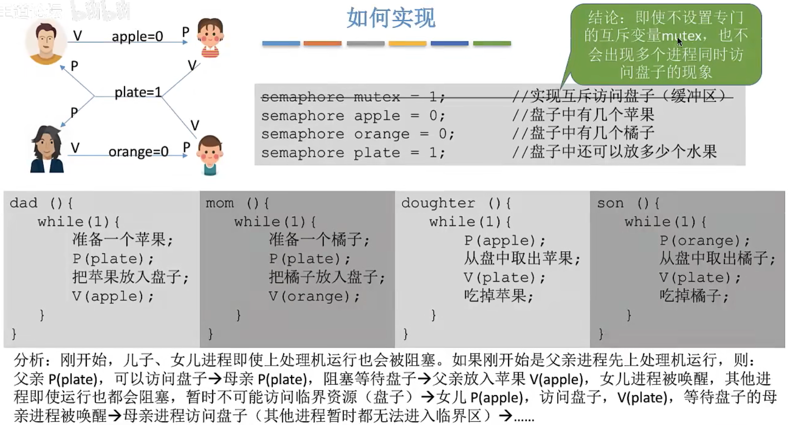

【技巧】可以删去互斥变量mutex的原因在于：本题中的**缓冲区大小为1**，在任何时刻，apple、 orange、 plate三个同步信号量中最多只有一个是1。因此在任何时刻，最多只有一个进程的P操作不会被阻塞，并顺利地进入临界区。


### 5.3 读者-写者

reader-writer problem

有一个写者很多读者。**多个读者可以同时读文件，但写者在写文件时不允许有读者在读文件，同样有读者在读文件时写者也不去能写文件**。

要求：

1. 允许多个读者可以同时对文件执行读操作；
2. 只允许一个写者往文件中写信息；
3. 任一写者在完成写操作之前不允许其他读者或写者工作；
4. 写者执行写操作前，应让已有的读者和写者全部退出。

#### 5.3.1读者优先算法


潜在的问题：只要有读进程还在读，写进程就要一直阻塞等待，可能“饿死”。因此，这种算法中，读进程是优先的。

#### 5.3.2写者优先算法

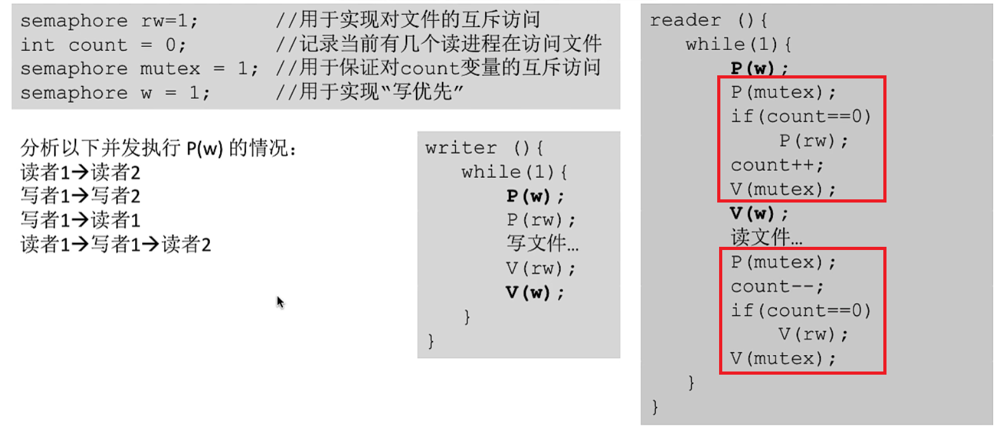

读者想要执行count++（读者数量+1），需要在没有写者准备的情况下才能进行。

当有写者P(w)，想要写，那么这样写者会阻塞在P(rw)，那么新的读者就不能再进入临界区，当所有读者读完之后，执行V(rw)，那么写者就可以直接开始写了。直到写完V(w)，才可以有新的读者进入。

---

【重点】读者-写者问题为我们解决复杂的互斥问题提供了一个参考思路。

其核心思想在于设置了一个**计数器count**用来记录当前正在访问共享文件的**读进程数**。我们可以用count的值来判断当前进入的进程是否是第一个/最后一个读进程，从而做出不同的处理。

另外，对**count变量的检查和赋值需要实现“一气呵成”**，自然应该想到用**互斥信号量**。


### 5.4 哲学家进餐

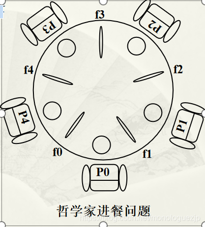

1. 关系分析。系统中有5个哲学家进程，5位哲学家与左右邻居对其中间筷子的访问是互斥关系。
2. 整理思路。这个问题中只有互斥关系，但与之前遇到的问题不同的事，每个哲学家进程需要同时持有两个临界资源才能开始吃饭。如何**避免**临界资源分配不当造成的**死锁现象**，是哲学家问题的精髓。
3. 信号量设置。定义互斥信号量数组chopstick[5]={1,1,1,1,1}用于实现对5个筷子的互斥访问。并对哲学家按0~4编号，哲学家i左边的筷子编号为i，右边的筷子编号为(i+1)%5。

---

当5个哲学家进程并发执行时，某个时刻恰好每个哲学家进程都执行申请筷子，并且成功申请到第i支筷子（相当于5个哲学家同时拿起他左边的筷子）， 接着他们又都执行申请右边筷子， 申请第i+1支筷子。此时每个哲学家仅拿到一支筷子， 另外一支只得无限等待下去， 引起死锁。在给出几种有效阻止死锁的方案之前，首先给出两个断言：

（1）系统中有N个并发进程。 若规定每个进程需要申请2个某类资源， 则当系统提供N+1个同类资源时，无论采用何种方式申请资源， 一定不会发生死锁。分析：N+1个资源被N 个进程竞争， 由抽屉原理可知， 则至少存在一个进程获2个以上的同类资源。这就是前面提到的哲学家就餐问题中5个哲学家提供6支筷子时一定不会发生死锁的原因。

（2）系统中有N个并发进程。 若规定每个进程需要申请R个某类资源， 则当系统提供K＝N\*（R-1）+1个同类资源时，无论采用何种方式申请使用，一定不会发生死锁。

分析：在最坏的情况下，每个进程都申请到R-1个同类资源， 此时它们均阻塞。 试想若系统再追加一个同类资源， 则 N 个进程中必有一个进程获得R个资源，死锁解除。

结合以上分析，哲学家就餐问题可以被抽象描述为：系统中有5个并发进程， 规定每个进程需要申请2个某类资源。 若系统提供5个该类资源， 在保证一定不会产生死锁的前提下，最多允许多少个进程并发执行？假设允许N个进程， 将R=2，K=5带入上述公式， 有N\*(2-1)+1=5所以 N=4。也就意味着，如果在任何时刻系统最多允许4个进程并发执行， 则一定不会发生死锁。 大多数哲学家就餐问题死锁阻止算法都是基于这个结论。


解法：

#### 5.4.1方案一

可以对哲学家进程施加一些限制条件，比如**最多允许四个哲学家同时进餐**。这样可以保证至少有一个哲学家是可以拿到左右两只筷子的。

#### 5.4.2方案二

规定**奇数号哲学家先拿他左边的筷子**，然后在去拿右边的筷子；而偶数号哲学家则相反。按此规定，将是1、2号哲学家竞争1号筷子；3、4号哲学家竞争3号筷子。

即5位哲学家都先竞争奇数号筷子，获得后，再去竞争偶数号筷子，最后总会有一位哲学家能够获得两只筷子而进餐。

#### 5.4.3方案三

采用**AND型信号量**机制来解决，当一个哲学家左右两边的筷子都可用时，才允许他抓起筷子。即要求每个哲学家先获得两个临界资源（筷子）后方能进餐。


# 五、死锁

**死锁**：**资源在对方手中，它要的资源在我手中，谁也不给谁**。**至少有两个或以上的进程同时发“死锁”**。

【规范】在并发环境下（多道程序环境中），各进程因竞争有限的资源而造成的一种互相等待对方手里的资源，导致各进程都阻塞，都无法向前推进的现象，就是“死锁”。发生死锁后若无外力干涉，这些进程都将无法向前推进。

**饥饿**：**长期得不到想要的资源，这个资源不一定在哪里**。可能是只有一个进程“饥饿”。

【规范】由于长期得不到想要的资源，某进程无法向前推进的现象。比如：在短进程优先(SPF)算法中，若有源源不断的短进程到来，则长进程将一直得不到处理机，从而发生长进程“饥饿”。

**死循环**：某进程执行过程中一直跳不出某个循环的现象。有时是因为程序逻辑bug导致的，有时是程序员故意设计的。

死锁、饥饿是操作系统分配资源不合理的问题，死循环是程序员代码逻辑错误的问题。


## 1.产生

### 1.1产生情况

对不可剥夺资源的不合理分配就可能导致死锁。

- **竞争不可抢占资源**。

各进程对不可剥夺的资源(如打印机)的竞争可能引起死锁，对可剥夺的资源(CPU)的竞争是不会引起死锁的。

- **竞争可消耗资源**。

- **进程推进顺序不当**。

请求和释放资源的顺序不当，也同样会导致死锁。

> 例如：并发执行的进程P1、P2分别申请并占有了资源R1、R2，之后进程P1又紧接着申请资源R2，而进程P2又申请资源R1，两者会因为申请的资源被对方占有而阻塞，从而发生死锁。

- **信号量使用不当**。

> 例如：生产者-消费者问题中，如果实现互斥的P操作在实现同步的P操作之前，就有可能导致死锁。(可以把互斥信号量、同步信号量也看做是一种抽象的系统资源）。


### 1.2产生的==4个必要条件==

产生死锁必须同时满足一下四个条件，只要其中任一条件不成立，死锁就不会发生。

1. **互斥条件**：只有对必须互斥使用的资源的争抢才会导致死锁（如哲学家的筷子、打印机设备)。像内存、扬声器这样可以同时让多个进程使用的资源是不会导致死锁的（因为进程不用阻塞等待这种资源）。
2. **请求和保持条件**：**进程已经保持了至少一个资源**，但又提出了新的资源请求，而该资源又被其他进程占有，此时请求进程被阻塞，但又对自己己有的资源保持不放。
3. **不可抢占条件**（不可剥夺）：进程所获得的资源在未使用完之前，不能由其他进程强行夺走，只能主动释放。
4. **循环等待条件**：存在一种进程资源的**循环等待链**，链中的每一个进程已获得的资源同时被下一个进程所请求。


【注意】发生死锁时一定有循环等待，但是发生循环等待时未必死锁（循环等待是死锁的必要不充分条件）。


## 2.处理方式

- 不允许发生死锁
  - 静态策略：**预防死锁**：破坏死锁产生的四个必要条件中的一个或几个。
  - 动态策略：**避免死锁**：用某种方法防止系统进入不安全状态，从而避免死锁(银行家算法)。
- 允许发生死锁
  - **检测死锁**
  - **解除死锁**


### 2.1预防死锁

破坏四个条件就可以预防死锁。所以有4个策略：


#### 2.1.1破坏互斥条件

**SPOOLing技术**

操作系统可以采用SPOOLing技术把独占设备在逻辑上改造成**共享设备**。

> 例如：用SPOOLing技术将打印机改造为共享设备。使用了SPOOLing技术，在进程和设备之间，添加一个中转站可以直接接受请求，然后自己再后续操作打印机。那么在各进程看来，自己对打印机资源的使用请求立即就被接收处理了，不需要再阻塞等待。

缺点：并不是所有的资源都可以改造成可共享使用的资源。并且为了系统安全，很多地方还必须保护这种互斥性。因此，很多时候都无法破坏互斥条件。


#### 2.1.2破坏请求和保持条件

**一次性分配策略（静态分配策略）**：一次性申请其在运行过程中的所需的所有资源，在它的资源未满足前，不让它投入运行。

该策略实现起来简单，但也有明显的缺点：

1. 有些资源可能只需要用很短的时间，因此如果进程的整个运行期间都一直保持着所有资源，就会造成严重的资源浪费，**资源利用率极低**。
2. 资源被释放就会马上被分配，那么某一个进程需要的两种资源不能同时获得，就需要一直等待，可能**导致饥饿**。


#### 2.1.3破坏不可抢占条件

**可剥夺资源**：当它请求不到新资源的时候，就要放弃所有的资源。

> 方案一：当某个进程请求新的资源得不到满足时，它必须立即释放保持的所有资源，待以后需要时再重新申请。也就是说，即使某些资源尚未使用完，也需要主动释放，从而破坏了不可剥夺条件。
>
> 方案二：当某个进程需要的资源被其他进程所占有的时候，可以由操作系统协助，将想要的资源强行剥夺。这种方式一般需要考虑各进程的优先级（比如：剥夺调度方式，就是将处理机资源强行剥夺给优先级更高的进程使用）

缺点：

1. 实现起来比较复杂；
2. 释放已获得的资源可能造成前一阶段工作的失效。因此这种方法一般只适用于易保存和恢复状态的资源，如CPU；
3. 反复地申请和释放资源会增加系统开销，**降低系统吞吐量**；
4. 若采用方案一，意味着只要暂时得不到某个资源，之前获得的那些资源就都需要放弃，以后再重新申请。如果一直发生这样的情况，就会**导致进程饥饿**。


#### 2.1.4破坏循环等待条件

**资源有序分配法（顺序资源分配法）**：系统**给每类资源一个编号**，每一个进程按编号递增的顺序请求资源，同类资源(即编号相同的资源)一次申请完，释放则相反。

原理分析：一个进程只有已占有小编号的资源时，才有资格申请更大编号的资源。按此规则，已持有大编号资源的进程不可能逆向地回来申请小编号的资源，从而就不会产生“循环等待链”，循环等待的现象。所以在任何一个时刻，总有一个进程拥有的资源编号是最大的，那这个进程申请之后的资源必然畅通无阻。因此，不可能出现所有进程都阻塞的死锁现象。

缺点：

1. 不方便增加新的设备，因为可能需要重新分配所有的编号；
2. 进程实际使用资源的顺序可能和编号递增顺序不一致，会导致资源浪费；
3. 必须按规定次序申请资源，用户编程麻烦。


### 2.2避免死锁

#### 2.2.1系统安全状态

所谓**安全序列**，就是指如果系统按照这种序列分配资源，则每个进程都能顺利完成。只要能找出一个安全序列，系统就是**安全状态**。当然，**安全序列可能有多个**。

如果分配了资源之后，系统中找不出任何一个安全序列，系统就进入了**不安全状态**。这就意味着之后可能所有进程都无法顺利的执行下去。当然，如果有进程提前归还了一些资源，那系统也有可能重新回到安全状态，不过我们在分配资源之前总是要考虑到最坏的情况。

如果系统处于安全状态，就一定不会发生死锁。如果系统进入不安全状态，就可能发生死锁（处于**不安全状态未必就是发生了死锁，但发生死锁时一定是在不安全状态**）。

因此可以**在资源分配之前预先判断这次分配是否会导致系统进入不安全状态**，以此决定是否答应资源分配请求。这也是“**银行家算法**”的核心思想。

#### 2.2.2银行家算法

核心思想：在进程提出资源申请时，先预判此次分配是否会导致系统进入不安全状态。如果会进入不安全状态，就暂时不答应这次请求，让该进程先阻塞等待。


### 2.3检测死锁

**死锁定理**：如果某时刻系统的资源分配图是不可完全简化的，那么此时系统死锁。

1. 用**某种数据结构**来保存资源的请求和分配信息；
2. 提供**一种算法**，利用上述信息来检测系统是否已进入死锁状态。

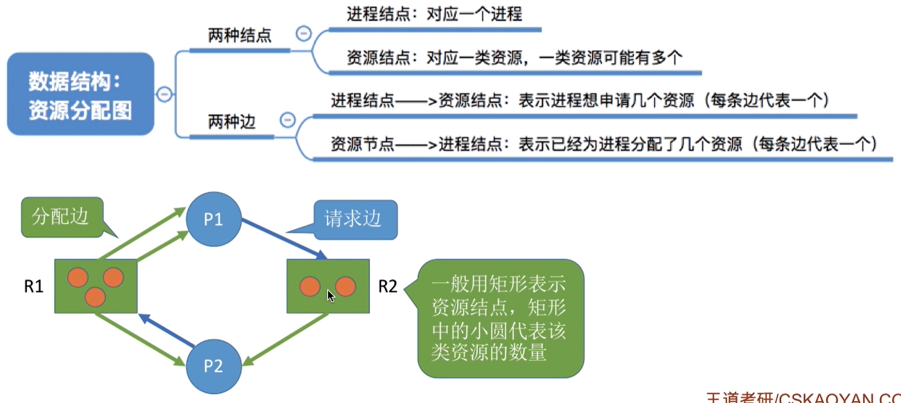

- 如果系统中剩余的可用资源数足够满足进程的需求，那么这个进程暂时是不会阻塞的，可以顺利地执行下去。
- 如果这个进程执行结束了把资源归还系统，就可能使某些正在等待资源的进程被激活，并顺利地执行下去。

如果按上述过程分析，最终能**消除所有边**，就称这个图是**可完全简化**的。此时一定没有发生死锁（相当于能**找到一个安全序列**）。

**如果最终不能消除所有边，那么此时就是发生了死锁**。最终还连着边的那些进程就是处于死锁状态的进程。


### 2.4解除死锁

三种方法

1. 终止所有死锁进程。

2. 逐个终止死锁进程。

   又分为三类。

3. 付出代价最小的死锁解除算法。

---

1. **资源剥夺法**。挂起（暂时放到外存上）某些死锁进程，并抢占它的资源，将这些资源分配给其他的死锁进程。但是应防止被挂起的进程长时间得不到资源而饥饿。
2. **撤销进程法**（或称终止进程法）。强制撤销**部分**、甚至**全部**死锁进程，并剥夺这些进程的资源。这种方式的优点是实现简单，但所付出的代价可能会很大。因为有些进程可能已经运行了很长时间，已经接近结束了，一旦被终止可谓功亏一篑，以后还得从头再来。
3. **进程回退法**。让一个或多个死锁进程回退到足以避免死锁的地步。这就要求系统要记录进程的历史信息，设置还原点，所以也难以实现。


根据下面，选择进程：

- 进程优先级。
- 进程执行了多少时间，还需要多少时间。选择使用(执行)**时间少**的。
- 进程使用了多少资源，还需要多少资源。选择使用**资源多**的。
- 进程是交互式的，还是批处理式的。选择**批处理式**的。

