# 文件管理

[toc]

# 八、文件系统基础

**文件**：就是一组有意义的信息/数据集合。

用户可以自己创建一层一层的目录，各层目录中存放相应的文件。系统中的各个文件就通过一层一层的目录合理有序的组织起来。

UNIX系统中，**输入输出设备**视为：**特殊文件**。

所谓的“**目录**”其实就是我们熟悉的“**文件夹**”。是一种特殊的有结构文件，由**记录**组成，称为：**目录文件**。


- 文件系统：

一个文件系统可以存放的文件的数量受限于**文件控制块FCB**的数量。


## 1.文件的属性

**文件名**：由创建文件的用户决定文件名，主要是为了方便用户找到文件，同一目录下不允许有重名文件。

**标识符**：一个系统内的各文件标识符唯一，对用户来说毫无可读性，因此标识符只是操作系统用于区分各个文件的一种内部名称。

**类型**：指明文件的类型。

**位置**：文件存放的路径（让用户使用）、在外存中的地址（操作系统使用，对用户不可见）。

除了上面信息外，还有：**创建时间**、**上次修改时间**、**文件所有者信息**。

**保护信息**：对文件进行保护的访问控制信息。

---

下面主要讨论的是文件的两个结构：

**逻辑结构**：就是指在用户看来，文件内部的数据应该是如何组织起来的。

**物理结构**：就是在操作系统看来，文件的数据是如何存放在外存中的。


## 2.文件的==逻辑==结构

**逻辑结构**：就是指在**用户**看来，文件内部的数据应该是如何组织起来的。

所以，文件的逻辑结构是为了方便**用户**才设计的。

分类：

- **无结构文件**（如文本文件`.txt`）

  由一些二进制或字符流组成，又称“**流式文件**”。

- **有结构文件**（如**数据库**表）

  由一组相似的**记录**组成，又称“**记录式文件**”。

  每条记录由若干数据项组成，并且有数据项是关键字（**主键**）。

  - 根据各条记录的长度（占用的存储空间）是否相等，又可分为2种：
    - **定长记录**
    - **可变长记录**

  - **顺序文件**
  - **索引文件**
  - **索引顺序文件**

逻辑结构的功能：

1. 文件按名存取（要和后面 “文件描述符” 作区分）；
2. 文件目录组织管理；
3. 把文件名转换为文件描述符or文件句柄；
4. 进行存储保护。


### 2.1顺序文件

**顺序文件**：文件中的记录一个接一个地顺序排列（逻辑上），记录可以是**定长**的或**可变长**的。各个记录在物理上可以**顺序存储**或**链式存储**。

- **链式存储**

  无论是定长/可变长记录，都无法实现随机存取。每次只能从第一个记录开始依次往后查找。

- **顺序存储**

  - **可变长记录**

    无法实现随机存取。每次只能从第一个记录开始依次往后查找。

  - **定长记录**（可实现**随机存取**）

    可实现随机存取。记录长度为L，则第i个记录存放的相对位置是i\*L。

    - **串结构**：记录之间的顺序与关键字无关。（通常按照记录存入的时间决定记录的顺序）。

      若采用串结构，无法快速找到某关键字对应的记录。

    - **顺序结构**：记录之间的顺序**按关键字顺序**排列。

      若采用顺序结构，可以快速找到某关键字对应的记录（如折半查找）。

**【注意】**一般来说，考试题目中所说的“**顺序文件**”指的是物理上**顺序存储**的顺序文件。之后的讲解中提到的顺序文件也默认如此。


**缺点**：增加/删除一个记录比较困难（如果是串结构则相对简单）。


### 2.2索引文件

对于**可变长**记录文件，要找到第i个记录，必须先顺序第查找前i -1个记录，但是很多应用场景中又必须使用可变长记录。如何解决这个问题？

建立一张**索引表**以加快文件检索速度。每条记录对应一个索引项。文件中的这些记录在物理上可以离散地存放。

---

**索引表**本身是**定长**记录的顺序文件。因此可以快速找到第 i 个记录对应的索引项。

可将关键字作为索引号内容，若按关键字顺序排列，则还可以支持按照关键字折半查找。

每当要增加/删除一个记录时，需要对索引表进行修改。由于索引文件有很快的检索速度，因此主要用于**对信息处理的及时性要求比较高的场合**。

另外，可以用不同的数据项建立多个索引表。

> 比如：学生信息表中，可用关键字“学号”建立一张索引表。也可用“姓名”建立一张索引表。这样就可以根据“姓名”快速地检索文件了。
>
> （Eg： SQL就支持根据某个数据项建立索引的功能）


**缺点**：每个记录对应一个索引表项，因此索引表可能会很大。

> 比如：文件的每个记录平均只占8B，而每个索引表项占32个字节，那么索引表都要比文件内容本身大4倍，这样对存储空间的利用率就太低了。

【考点】

1. 文件系统为每个文件创建一张**索引表**，存放文件数据块的磁盘存放位置。
2. 对索引文件进行存取时候，必须先查找**索引表**。


### 2.3索引顺序文件

**索引顺序文件**：是索引文件和顺序文件思想的结合。（**先分组，再给分组进行索引**）

索引顺序文件中，同样会为文件建立一张索引表，但不同的是——并不是每个记录对应一个索引表项，而是**一组记录对应一个索引表项**。

此时在进行检索的时候，只需要先索引检索目标在哪个分组，然后在分组中进行顺序查找。


### 2.4多级索引顺序文件

为了进一步提高检索效率，可以为顺序文件建立**多级索引表**。

> 例如，对于一个含106个记录的文件，可先为该文件建立一张低级索引表，每100个记录为一组，故低级索引表中共有10000个表项（即10000个定长记录），再把这10000个定长记录分组，每组100个，为其建立顶级索引表，故顶级索引表中共有100个表项。

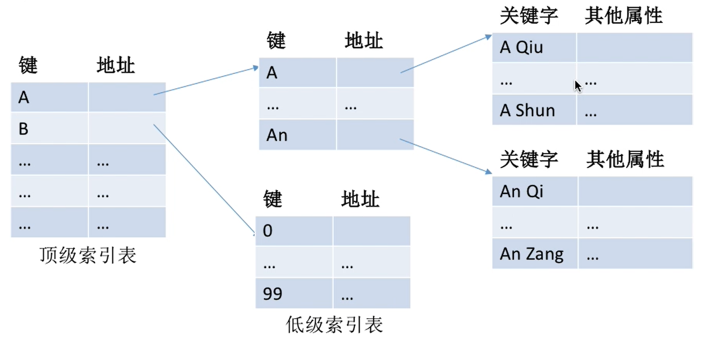


## 3.目录文件

用户可以自己创建一层一层的**目录**，各层目录中存放相应的文件。系统中的各个文件就通过一层一层的目录合理有序的组织起来。所谓的“**目录**”其实就是我们熟悉的“**文件夹**”。

**目录**：一种特殊的有结构**文件**，由记录组成。

**目录文件**存放的就是该目录下所有的**子目录**和**数据文件**。

---

### ❗3.1文件控制块FCB


**文件控制块（FCB，File Control Block）**：实现文件目录的关键**数据结构**。（可以类比进程的PCB）

> 如：一个文件夹下有一个文件夹、一个图片：

| 目录表 | 文件名 | 文件类型 | 存取权限 | ...  | 物理地址    |
| ------ | ------ | -------- | -------- | ---- | ----------- |
| FCB1   | 文件1  | 目录     | 读/写    | ...  | 外存25块号  |
| FCB2   | 照片   | PNG      | 只读     | ...  | 外存925块号 |


目录文件中的一条记录就是一个FCB。FCB的有序集合称为“**文件目录**”，==一个FCB就是一个**文件目录项**==。

FCB中包含了文件的**基本信息**（**文件名、物理地址**、逻辑结构、物理结构等），存取控制信息（是否可读/可写、禁止访问的用户名单等），使用信息（如文件的建立时间、修改时间等）。

【注意】最重要、最基本的还是**文件名**、文件存放的**物理地址**。

**作用**：FCB实现了**文件名**和**文件**之间的映射。使用户（用户程序）可以实现“按名存取”。


**创建一个新的文件**，其实就是创建一个当前目录表下的**FCB**，也就是创建一个**文件目录项**。

---

- 文件目录项、文件控制块FCB的区别？

目录项和FCB都是用于管理文件和目录的**数据结构**，但它们的作用不同。

**目录项**（Directory Control Block）是操作系统中用于管理目录的数据结构。每个**目录**都有一个目录项，它包含有关该目录的信息，例如目录名称、目录下文件的列表等。
通过目录项，用户可以浏览目录、查看目录下的文件列表，并对文件进行管理。

**FCB**（File Control Block）是操作系统中用于管理文件的数据结构。每个**文件**都有一个FCB，它包含有关该文件的信，例如文件名、文件类型、文件大小、文件位置等。
通过FCB，用户可以打开文件、读取文件、写入文件等操作。

总结：

- 文件目录项：
  - 用于管理**目录**的数据结构，
  - 目录项包含有关目录下文件的信息。
- 文件控制块FCB：
  - 用于管理**文件**的数据结构，
  - FCB包含有关文件本身的信息。

---


#### 3.1.1对目录进行的操作

- **搜索**：当用户要使用一个文件时，系统要根据文件名搜索目录，找到该文件对应的目录项。
- **创建文件**：创建一个新文件时，需要在其所属的目录中增加一个目录项。
- **删除文件**：当删除一个文件时，需要在目录中删除相应的目录项。
- **显示目录**：用户可以请求显示目录的内容，如显示该目录中的所有文件及相应属性。
- **修改目录**：某些文件属性保存在目录中，因此这些属性变化时需要修改相应的目录项（如：文件重命名）。


### 3.2目录结构

#### 3.2.1单级目录结构

早期操作系统并不支持多级目录，**整个系统**中只建立一张目录表，每个文件占一个目录项。

单级目录实现了“按名存取”，但是**不允许文件重名**。

**缺点**：单级目录结构不适用于**多用户操作系统**。


#### 3.2.2两级目录结构

早期的多用户操作系统，采用两级目录结构。分为**主文件目录**（**MFD**，Master File Directory）和**用户文件目录**（**UFD**，User File Directory）。

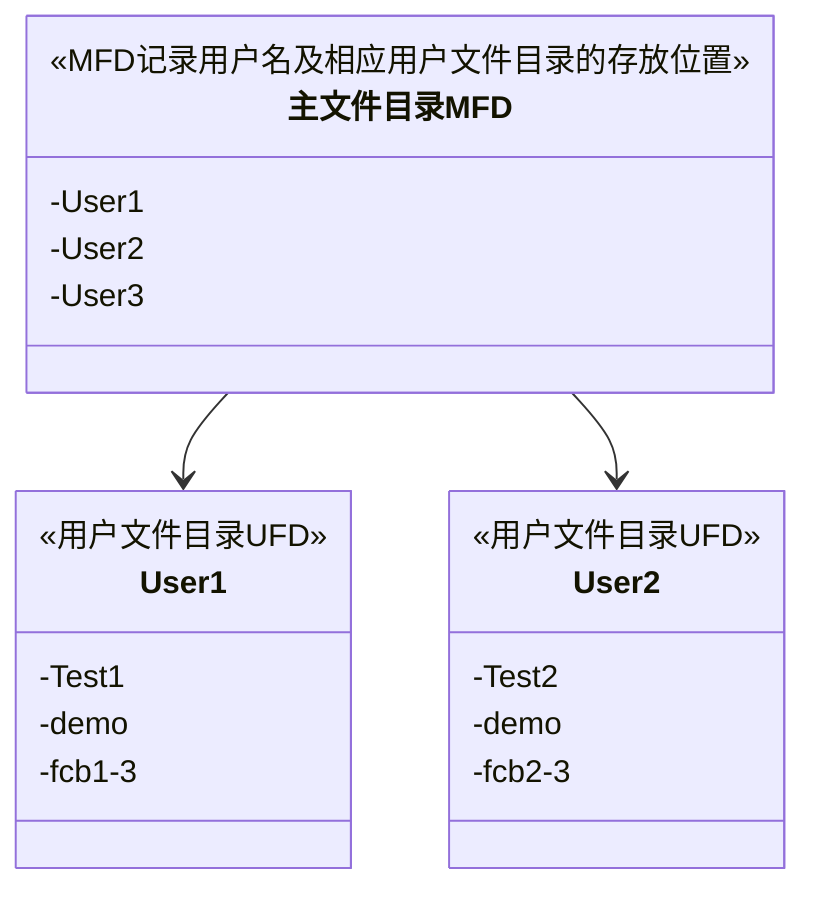
```mermaid
classDiagram

class 主文件目录MFD{
	<<MFD记录用户名及相应用户文件目录的存放位置>>
	-User1
	-User2
	-User3
}
class User1{
	<<用户文件目录UFD>>
	-Test1
	-demo
	-fcb1-3
}
class User2{
	<<用户文件目录UFD>>
	-Test2
	-demo
	-fcb2-3
}

主文件目录MFD --> User1
主文件目录MFD --> User2
```

可以看到在UFD中，存在不同用户的文件重名dome。

**优点**：两级目录结构允许不同用户的文件重名，也可以在目录上实现实现访问限制（检查此时登录的用户名是否匹配）。

**缺点**：两级目录结构依然缺乏灵活性，用户不能对自己的文件进行分类。


#### 3.2.3多级目录结构（树形目录结构）

多级目录结构解决了文件**命名冲突**的问题。

用户（或用户进程）要访问某个文件时要用文件路径名标识文件，文件**路径名**是个**字符串**。

各级目录之间用`/`隔开。从**根目录**出发的路径称为**绝对路径**。

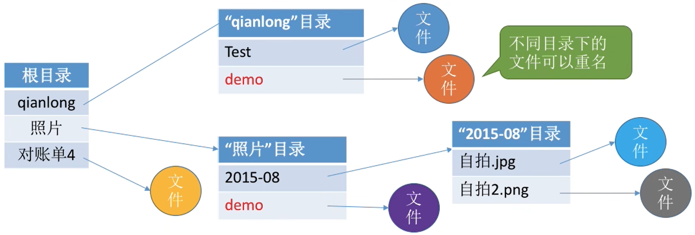

例如：“自拍.jpg”的绝对路径是 “/照片/2015-08/自拍.jpg”

系统根据绝对路径一层一层地找到下一级目录：

1. 刚开始从外存读入根目录的目录表；
2. “照片”目录的存放位置后，从外存读入对应的目录表；
3. 再找到“2015-08”目录的存放位置，再从外存读入对应目录表；
4. 最后才找到文件“自拍.jpg”的存放位置。

整个过程需要3次读磁盘I/O操作。

---

很多时候，用户会连续访问同一目录内的多个文件，因此也可以设置一个**当前目录**。

例如，此时已经打开了 “照片” 的目录文件，也就是说，这张目录表已调入内存，那么可以把它设置为 “**当前目录**”。当用户想要访问某个文件时，可以使用从当前目录出发的“**相对路径**”。

如果 “照片” 是当前目录，那么 “/照片/2015-08/自拍.jpg” 的相对路径就是 “./2015-08/自拍.jpg”。

从当前路径出发，只需要查询内存中的 “照片” 目录表，即可知道 “2015-08” 目录表的存放位置，从外存调入该目录，即可知道 “自拍.jpg” 存放的位置了。

**优点**：树形目录结构可以很方便地对文件进行分类，层次结构清晰，也能够更有效地进行文件的管理和保护。

**缺点**：树形结构不便于实现文件的共享。
为此，提出了“无环图目录结构”。


#### 3.2.4有/无环图目录结构

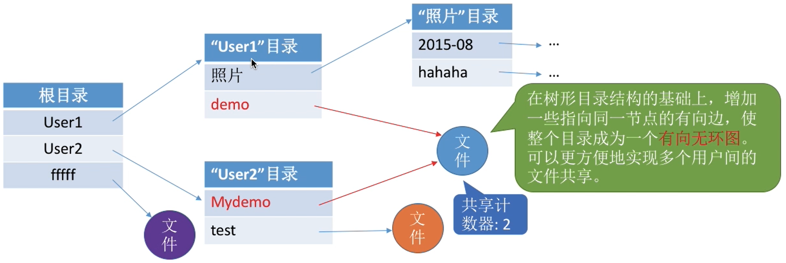

可以用**不同的文件名**指向**同一个文件**，甚至可以指向同一个目录（共享同一目录下的所有内容）。

因为一个文件现在被多个文件名指引，所以需要为每个**共享结点**设置一个**共享计数器count**，用于记录此时有多少个地方在共享该结点。用户提出删除结点的请求时，只是删除该用户的FCB、并使共享计数器减1（count--），并不会直接删除共享结点。

只有共享计数器减为0（count==0）时，才删除结点。

**【注意】**共享文件不同于复制文件。在共享文件中，由于各用户指向的是同一个文件，因此只要其中一个用户修改了文件数据，那么所有用户都可以看到文件数据的变化。


### ❗3.3索引结点

**索引结点**：对文件控制块（FCB）的优化。

其实在查找各级目录的过程中只需要用到 “文件名” 这个信息，只有文件名匹配时，才需要读出文件的其他信息。因此可以考虑**简化目录表**来提升效率。

除了文件名之外的文件描述信息都放到“**索引结点**”。

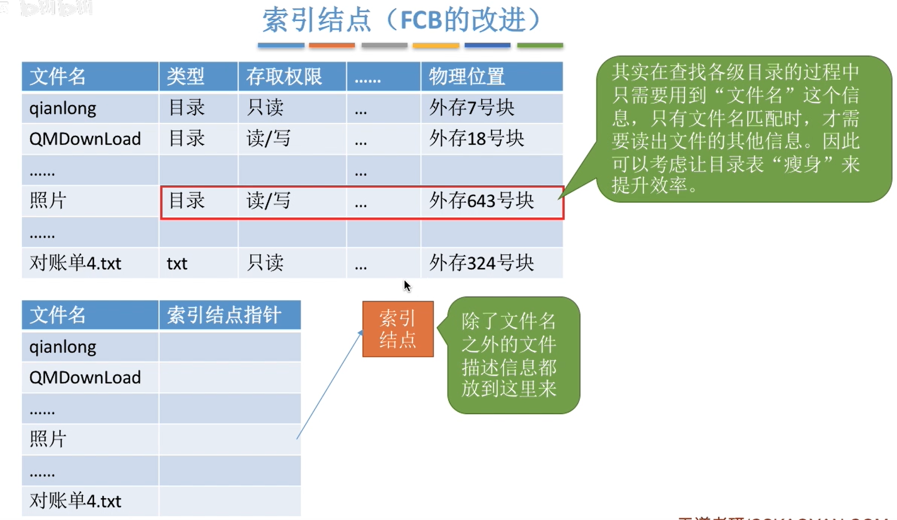

> 假设一个FCB是64B，磁盘块的大小为1KB，则每个盘块中只能存放16个FCB。若一个文件目录中共有640个目录项，则共需要占用640/16=40个盘块。因此按照某文件名检索该目录，**平均需要查询320个目录项，平均需要启动磁盘20次（每次磁盘I/O读入一块）**。
>
> 若使用**索引结点**机制，文件名占14B，索引结点指针站2B，则每企盘块可存放64个目录项，那么按文件名检索目录**平均只需要读入320/64 =5个磁盘块**。显然，这将大大提升文件检索速度。

存放在外存中的索引结点称为“**磁盘索引结点**”，当索引结点放入内存后称为“**内存索引结点**”。

相比之下内存索引结点中需要增加一些信息（**内存索引特有**），比如：**访问计数值**（此时有几个进程正在访问该文件）、文件是否被修改等。


### 3.4目录检索

访问一个文件，操作系统需要通过路径找到目录项，实现这种操作的方式一般有两种：线性列表、哈希表。

1. **线性表：线性查找：顺序检索法。**
   - 使用顺序检索法，只要路径名的一个分量名没有找到，就应停止查找。
   - 查找到之后，得到的是文件的**逻辑结构**。
2. **哈希表：散列查找：散列法。**

散列法不适用于所有的目录结构，而且有冲突和溢出的缺点，解决的开销较大，因此通常更多采用**顺序检索法**。


## 4.文件的==物理==结构

**物理结构**：就是在操作系统看来，文件的数据是如何存放在外存中的。操作系统需要对磁盘块进行管理。（**文件分配方式**）

物理文件的组织方式是由**操作系统**决定的。

逻辑文件放到存储介质上，采用的组织形式和**存储介质特性**有关。

当**磁带**做文件存储介质时，文件组成只能是**顺序文件**。

---

- 对**非空闲**磁盘块的管理（存放了文件数据的磁盘块）
  - “文件的**物理结构**/文件**分配方式**” 要探讨的问题
- 对**空闲**磁盘块的管理
  - “6.**文件存储空间管理**” 要探讨的问题

---

文件的物理结构（文件分配方式）：

- **连续分配**
  1. 产生磁盘碎片；
  2. 磁盘I/O次数最多；
  2. 磁盘寻道时间短，文件随机访问效率高。
- **链接分配**
  - 隐式链接
  - 显式链接
- **索引分配**
  - 链接方案
  - 多层索引
  - 混合索引


---

### 4.1文件块、磁盘块

在内存管理中，内存分页，进程的逻辑地址空间被分为一个一个页面。同样的，在外存管理中，为了方便对文件数据的管理，文件的逻辑地址空间也被分为了一个一个的文件“**块**”。磁盘中的存储单元也会被分为一个个“块/磁盘块/物理块”。很多操作系统中，**磁盘块的大小与内存块、页面的大小相同**。

内存与磁盘之间的数据交换（即读/写操作、磁盘I/O）都是以“块”为单位进行的。即每次读入一块，或每次写出一块。

于是文件的逻辑地址也可以表示为**（逻辑块号，块内地址）**的形式。

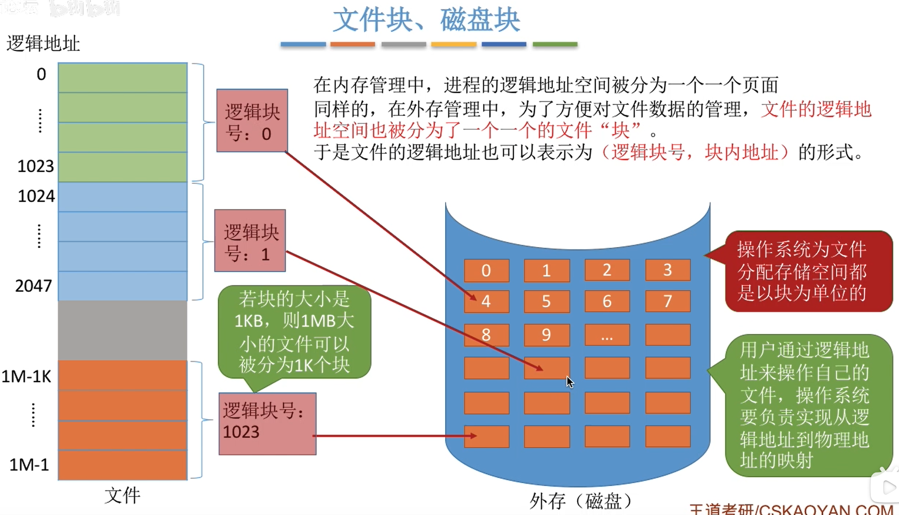

而操作系统要负责实现**从逻地址到物理地址的映射**。这个**映射**就是**文件分配方式（文件的物理结构）**。


### 4.2物理结构（分配方式）

【2013年408真题】连续结构是最**快**的。

#### 4.2.1连续分配

**连续分配**：要求每个文件在磁盘上**占有一组连续的块**。

(**逻辑**块号，块内地址）→（**物理**块号，块内地址）。只需转换块号就行，块内地址保持不变。

用户给出要访问的逻辑块号，操作系统找到该文件对应的目录项（FCB）。**物理块号 = 起始块号＋逻辑块号**。

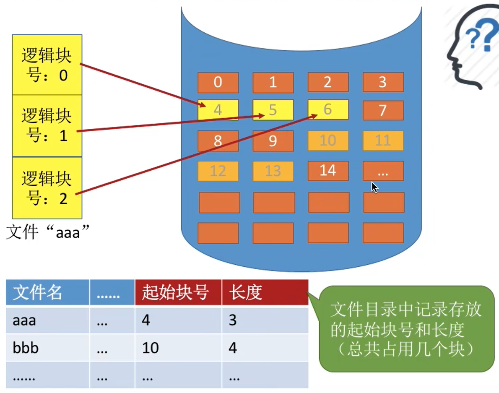

**优点**：

1. 可以直接算出逻辑块号对应的物理块号，因此连续分配支持顺序访问和直接访间（即**随机访问**）。

2. 连续分配的文件在**顺序读/写时速度最快**。

   读取某个磁盘块时，需要移动磁头。访问的两个磁盘块相隔越远，移动磁头所需时间就越长。

**缺点**：

1. 连续分配的文件**不方便拓展**。

   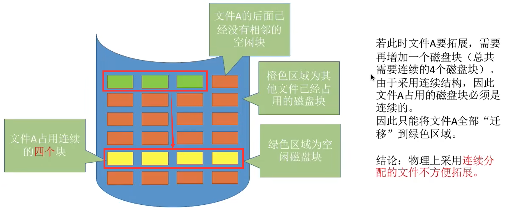

2. **存储空间利用率低**，会产生难以利用的**磁盘碎片**。

   可以用**紧凑**来处理碎片，但是需要耗费很大的时间代价。

   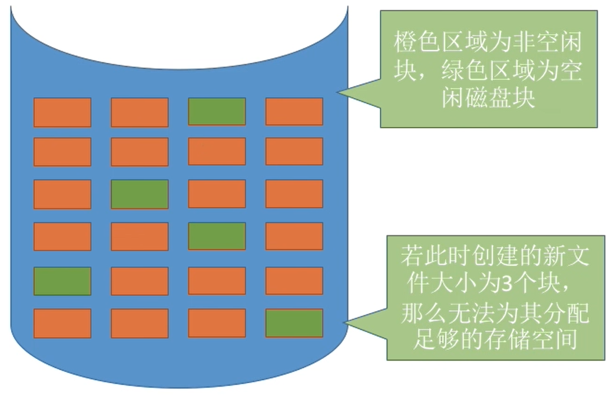


#### 4.2.2链接分配

链接分配采取离散分配的方式，可以为文件分配离散的磁盘块。分为隐式链接和显式链接两种。

**【注意】**考试题目中遇到未指明隐式/显式的“链接分配”，**默认是隐式链接**的链接分配。

##### 1）隐式链接

用户给出要访问的逻辑块号 i，操作系统找到该文件对应的目录项（FCB）。从目录项中找到起始块号（即0号块），将0号逻辑块读入内存，由此知道1号逻辑块存放的物理块号，于是读入1号逻辑块，再找到2号逻辑块的存放位置.......以此类推。

因此，读入 i 号逻辑块，总共需要 i+1 次磁盘l/O。

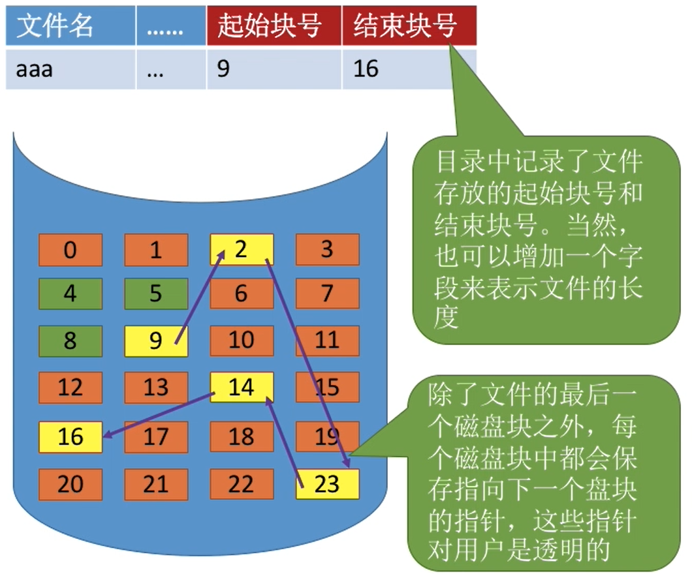

**缺点**：

1. 采用链式分配（隐式链接）方式的文件，**只支持顺序访问，不支持随机访问，查找效率低**。
2. 指向下一个盘块的指针也需要**耗费少量的存储空间**。

**优点**：很方便文件拓展另外，所有的空闲磁盘块都可以被利用，不会有碎片问题，外存利用率高。

【技巧】优缺点正好和连续分配相反。


##### 2）显式链接

把用于链接文件各物理块的指针显式地存放在一张表中。即**文件分配表**（**FAT**，File Allocation Table）。

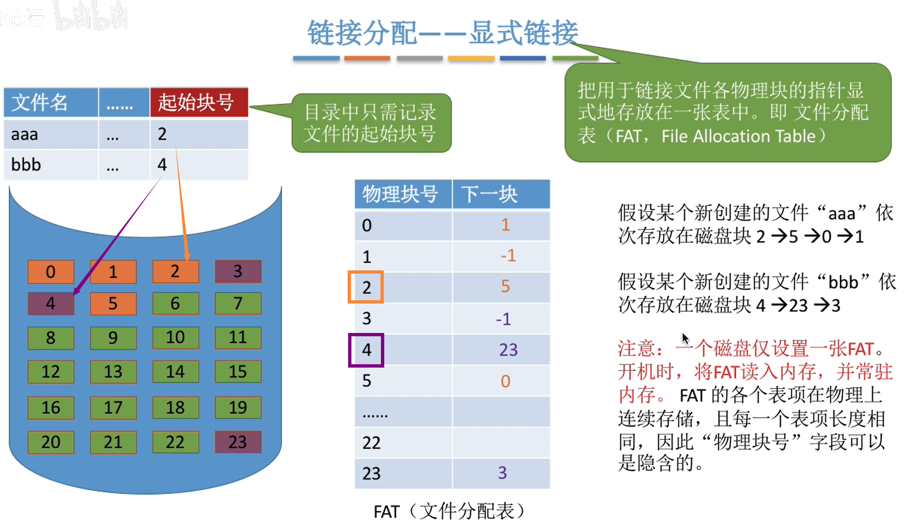

**特点**：采用链式分配（显式链接）方式的文件，**支持顺序访问，也支持随机访问**（想访问i号逻辑块时，并不需要依次访问之前的0~ i-1号逻辑块），由于块号转换的过程不需要访问磁盘，因此相比于隐式链接来说，访问速度快很多。显然，显式链接也**不会产生外部碎片**，外存利用率高，也可以很方便地对文件进行拓展。

【说明】就是可以先查FAT，查FAT不需要I/O，所以快速顺序查到要访问的磁盘块后再I/O，约等于随机访问。

**缺点**：文件分配表的需要占用一定的存储空间。


#### ❗4.2.3索引分配

**索引分配**：允许文件离散地分配在各个磁盘块中，系统会为**每个文件建立一张索引表**，索引表中记录了文件的各个逻辑块对应的物理块（索引表的功能类似于内存管理中的**页表**――建立逻辑页面到物理页之间的映射关系）。

**索引表**存放的磁盘块称为**索引块**。文件数据存放的磁盘块称为**数据块**。

【2022年408真题】一个**索引节点号**对应一个**磁盘块号**。如果索引节点号一样（共享文件），那么磁盘块号也一样。

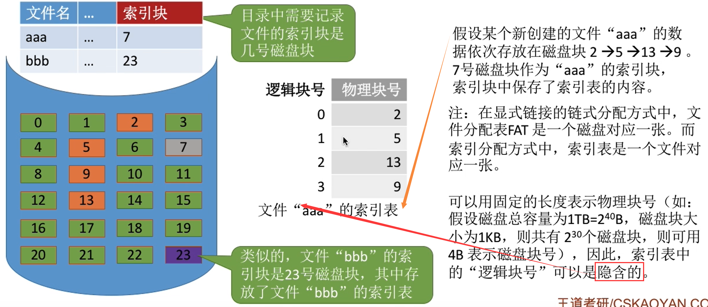

【对比】
显式链接的链式分配方式中，**文件分配表FAT**是**一个磁盘对应一张**。
而索引分配方式中，索引表是**一个文件对应一张**。

**优点**：支持**随机访问**。文件拓展也很容易实现（只需要给文件分配一个空闲块，并增加一个索引表项即可）。

**缺点**：但是索引表需要占用一定的存储空间。

---

- 若每个磁盘块1KB，一个索引表项4B，则一个磁盘块只能存放256个索引项。如果一个文件的大小超过了256块，那么一个磁盘块是装不下文件的整张索引表的，如何解决这个问题？

有3个方案解决：

##### 1）链接方案

链接方案：如果索引表太大，一个索引块装不下，那么可以**将多个索引块链接**起来存放。

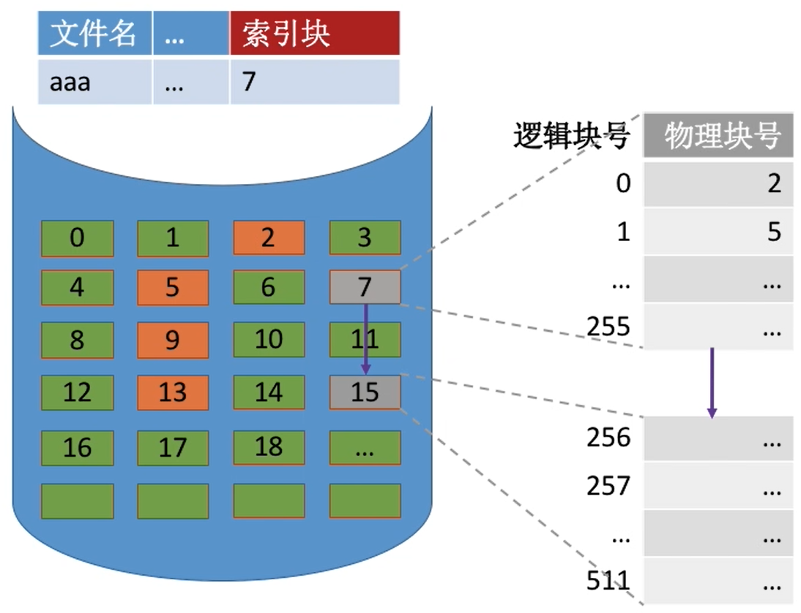

>假设磁盘块大小为1KB，一个索引表项占4B，则一个磁盘块只能存放256个索引项。
>
>若一个文件大小为256\*256KB =65,536 KB = 64MB
>该文件共有256\*256个块，也就对应256\*256个索引项，也就需要256个索引块来存储，这些索引块用链接方案连起来。
>
>若想要访问文件的最后一个逻辑块，就必须找到最后一个索引块（第256个索引块），而各个索引块之间是用指针链接起来的，因此必须先顺序地读入前255个索引块。

这显然是很低效的。如何解决呢?


##### 2）多层索引

**多层索引**：建立多层索引（原理类似于多级页表)。使第一层索引块指向第二层的索引块。还可根据文件大小的要求再建立第三层、第四层索引块。

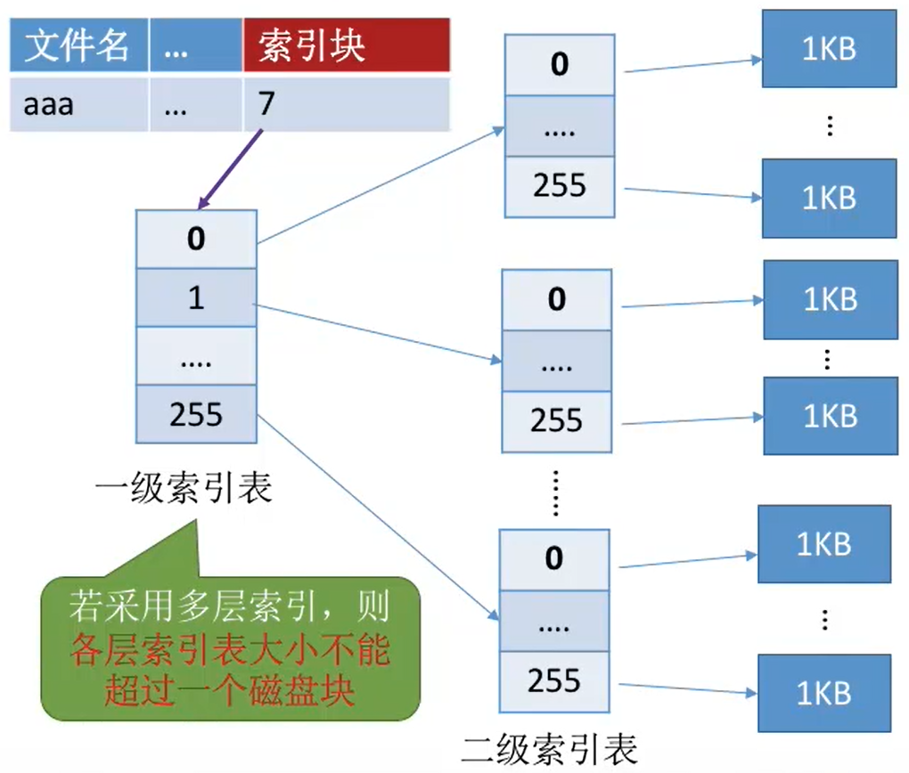

若某文件采用**两层索引（一级间接）**，则该文件的**最大长度**可以到256\*256\*1KB = 65,536 KB = 64MB。

可根据逻辑块号算出应该查找索引表中的哪个表项。

>如：要访问1026号逻辑块，则1026/256=4，1026%256 = 2
>
>因此可以先将一级索引表调入内存，查询4号表项，将其对应的二级索引表调入内存，再查询二级索引表的2号表项即可知道1026号逻辑块存放的磁盘块号了。

访问目标数据块，需要**3次磁盘I/O**。

同理：若采用**三层索引（二级间接）**，则文件的最大长度为256\*256\*256\*1KB = 16GB。那么访问目标数据块，需要**4次磁盘I/O**。

【总结】采用K层**索引结构**，且**顶级索引表未调入内存**，则访问一个数据块只需要K+1次读磁盘操作。

【注意】在UNIX中，文件的索引结构放在**索引节点**。

**缺点**：如果文件很小，但是因为分层索引，索引依然需要分多层进行多次I/O。所以有了**混合索引**。


##### ❗3）混合索引

 **混合索引**：多种索引分配方式的结合。例如，一个文件的顶级索引表中，既包含**直接地址索引**（直接指向数据块），又包含**一级间接索引**（指向单层索引表)、还包含**两级间接索引**（指向两层索引表）。

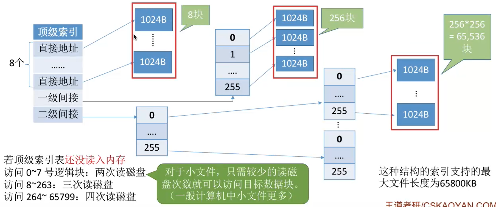


上图的顶级索引表那里，一级间接、二级间接就是**索引节点**。引出来的是**磁盘块**。要注意说法，因为磁盘块还可以根据能否继续往下引分为：**索引块**，没有索引能力了就是**地址块**。

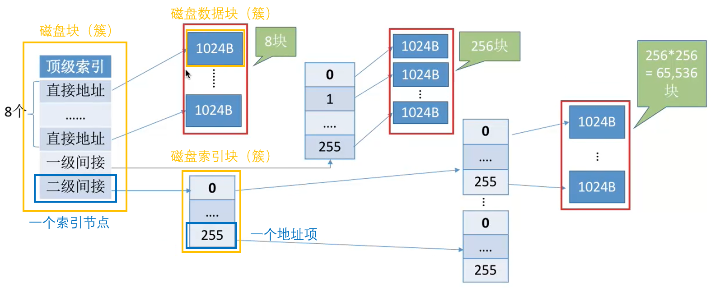

---

==【考点1】要会根据多层索引、混合索引的结构计算出**文件的最大长度**==

Key：**各级索引表最大不能超过一个块**。

如：2010年408真题

==【考点2】要能自己分析访问某个数据块所需要的**读磁盘次数**==

Key： FCB中会存有指向顶级索引块的指针，因此可以根据FCB读入顶级索引块。每次读入下一级的索引块都需要一次读磁盘操作。

==【注意】题目条件：**顶级索引块**是否已调入内存？==


==【考点3】==存储空间，索引表中的**索引项**（块号、指针），如用4B来存放。那么也就是 **4B（字节）=32bit（位）**，即可寻址**2^32^**个**存储块**。

如：2012、2014年408真题大题


## 5.扩展：C语言文件操作

### 5.1无结构文件（流式文件）

```c
FILE *fp = fopen( "test.txt", "w"); //打开文件
if( fp == NULL ){
	printf("打开文件失败!");
    exit(0);
}

//写入10个Hello world
for (int i=0; i<10; i++)
	fputs ("Hello world!", fp);
fclose(fp);		//关闭文件
```

如果没有创建文件，调用`fopen`会自动创建文件。

在逻辑结构中（用户来看），每个字符1B，都是连续存放的，如果要寻找第16个字符(编号从0开始)：

```c
FILE*fp = fopen( "test.txt", "r");	//以"读"方式打开文件
if( fp == NULL ){
    puts("Fail to open file!");
    exit(0) ;
}

fseek(fp, 16，SEEK_SET);		//把文件的 读写指针 指向16
char c = fgetc(fp);			//从读写指针所指位置 之后 读出1个字符
printf("字符:%c", c);			//打印从文件读出的字符
fclose(fp);					//关闭文件
```

使用c语言库函数`fseek`，将文件读写指针指向位置n。

使用c语言库函数`fgetc`，从读写指针所指位置读出1B内容。

用户用**逻辑地址**访问又件，不关心在磁盘中是如何存储的。

`fgetc`底层使用了`Read系统调用`，操作系统将（逻辑块号，块内偏移量）转换为（物理块号，块内偏移量）。


### 5.2有结构文件（记录式文件）

c语言创建顺序文件：

```c
typedef struct {
    int number;		//学号4B
    char name [30];	//姓名30B
    char major[30];	//专业30B
} Student_info;

//以"写"方式打开文件
FILE *fp = fopen("students.info", "w");
if(fp == NULL) {
	printf("打开文件失败!");
    exit(0);
}

Student_info student[N];	//用数组保存N个学生信息
for(int i=0; i<N; i++) {	//生成N个学生信息
    student[i].number=i;
    student[i].name[0]='?';
    student[i].major[0]='?';
}

//将N个学生的信息写入文件
fwrite(student, sizeof (Student_info), N, fp);
fclose(fp);
```

读出第五个同学的信息：

```c
//以"读"方式打开文件
FILE *fp = fopen("students.info", "r");
if(fp == NULL) {
	printf("打开文件失败!");
    exit(0) ;
}

//文件读写指针指向编号为5的学生记录
fseek(fp, 5*sizeof(Student_info), SEEK_SET);
student_info stu;

//从文件读出1条记录，记录大小为sizeof(Student_info)
fread(&stu, sizeof( Student_info), 1, fp);
printf("学生编号:%d\n", stu.number) ;
fclose(fp);
```


## 6.文件==存储空间==管理

对外存**空闲**磁盘块的管理。

目的：提高**存储空间的利用率**。

【2019年408真题】可以用于文件系统，管理空闲磁盘块的数据结构有：位图、空闲磁盘链、文件分配表（FAT）。

### 6.1存储空间的划分与初始化

安装Windows操作系统的时候，一个必经步骤是――为磁盘分区（C:盘、D:盘、E:盘等）。

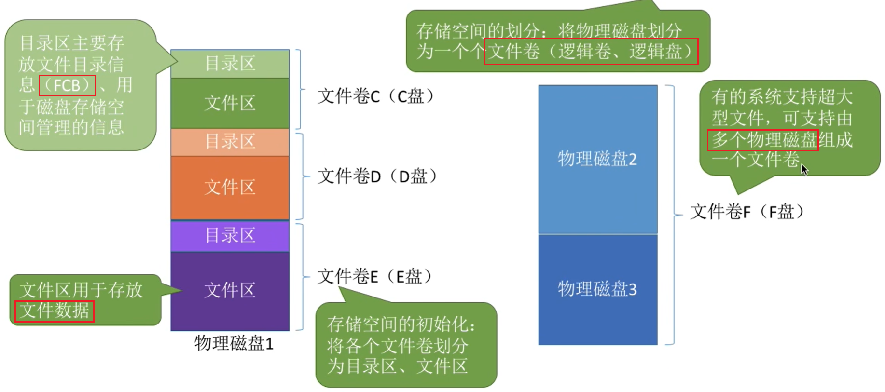

存储空间管理的方法：

### 6.2空闲表法

适用于“**连续分配**”。

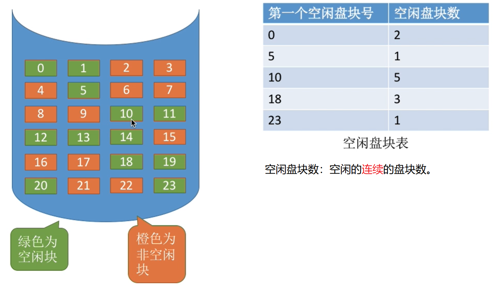

如何**分配磁盘块**：与内存管理中的动态分区分配很类似，为一个文件分配连续的存储空间。同样可采用**首次适应、最佳适应、最坏适应等算法**来决定要为文件分配哪个区间。

如何**回收磁盘块**：与内存管理中的动态分区分配很类似，当回收某个存储区时需要有四种情况：

1. 回收区的前后都没有相邻空闲区；
2. 回收区的前后都是空闲区；
   - 把前后两个表项合二为一。
3. 回收区前面是空闲区；
4. 回收区后面是空闲区。

总之，回收时需要注意**表项的合并**问题。


### 6.3空闲链表法

- **空闲盘块链**：以**盘块**为单位组成一条空闲链。
- **空闲盘区链**：以**盘区**为单位组成一条空闲链。

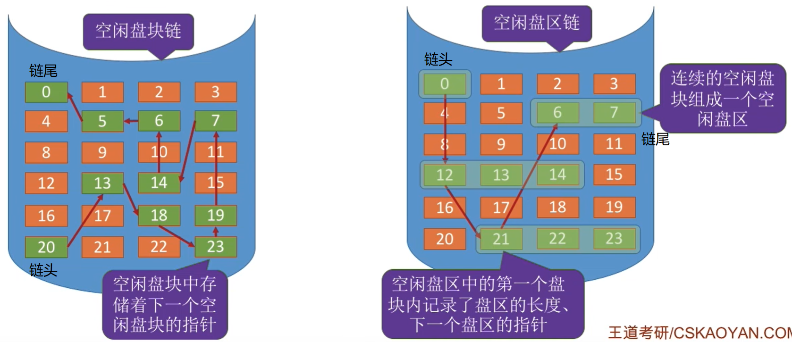

#### 6.3.1空闲盘块链

适用于**离散分配**的物理结构。为文件分配多个盘块时可能要重复多次操作。

操作系统保存着**链头、链尾**指针。

**如何分配**：若某文件申请K个盘块，则从链头开始依次摘下K个盘块分配，并修改空闲链的链头指针。

**如何回收**：回收的盘块依次挂到链尾，并修改空闲链的链尾指针。

#### 6.3.2空闲盘区链

**离散分配、连续分配**都适用。为一个文件分配多个盘块时效率更高

操作系统保存着**链头、链尾**指针。

**如何分配**：若某文件申请K个盘块，则可以采用首次适应、最佳适应等算法，从链头开始检索，按照算法规则找到一个大小符合要求的空闲盘区，分配给文件。若没有合适的连续空闲块，也可以将不同盘区的盘块同时分配给一个文件，注意分配后可能要修改相应的链指针、盘区大小等数据。

**如何回收**：若回收区和某个空闲盘区相邻，则需要将回收区合并到空闲盘区中。若回收区没有和任何空闲区相邻，将回收区作为单独的一个空闲盘区挂到链尾。


### ❗6.4位示图法

连续分配、离散分配都适用。

**位示图**：每个二进制位对应一个盘块。在本例中，**“0”代表盘块空闲，“1”代表盘块已分配**。

位示图一般用连续的“字”来表示，如本例下图中一个字的字长是16位，字中的**每一位对应一个盘块**。因此可以用**（字号，位号）**对应一个盘块号。当然有的题目中也描述为**（行号，列号）**。

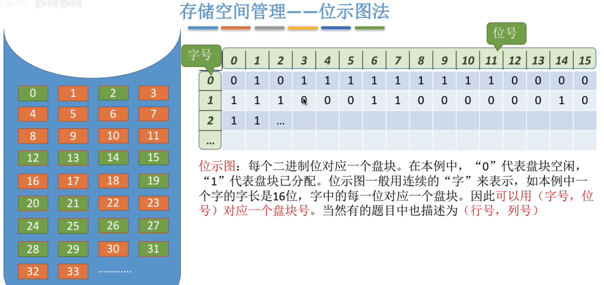

---

==【考点】推出**盘块号**与**（字号，位号）**相互转换的公式。==

注意题目条件：**盘块号、字号、位号**到底是从0开始还是从1开始如本例中盘块号、字号、位号从0开始，若**n表示字长**，则：
$$
若:(字号，位号)=(i，j) \\
则二进制盘块号 b= ni+j
$$
例如上图**位号是0~15**所以**字长n是16位**。

> （0，1）是 16\*0+1 = 1号盘块
>
> b=13，则 i = 13/16 = 0，j = 13%16 = 13，所以（字号，位号）是（0，13）。

---

**如何分配**：若文件需要k个块，

1. 顺序扫描位示图，找到K个相邻或者不相邻的“0”；
2. 根据字号、位号算出对应的盘块号，将相应盘块分配给文件；
3. 将相应位设置为“1”。

**如何回收**：

1. 根据回收的盘块号计算出对应的字号、位号；
2. 将相应二进制位设为“0”。


### 6.5成组链接法

空闲表法、空闲链表法不适用于**大型文件系统**，因为空闲表或空闲链表可能过大。UNIX系统中采用了**成组链接法**对磁盘空闲块进行管理。

文件卷的目录区中专门用一个磁盘块作为“**超级块**”，当系统启动时就需要将超级块读入内存。并且要保证内存与外存中的“超级块”数据一致。

- **超级块**：是文件系统中的一个数据结构，它包含了文件系统的全局信息，如文件系统的类型、大小、状态、空闲盘块的数量以及文件系统中的数据块和inode的分配情况等。超级块对于文件系统的正确运行至关重要，因为它提供了文件系统布局的必要信息。

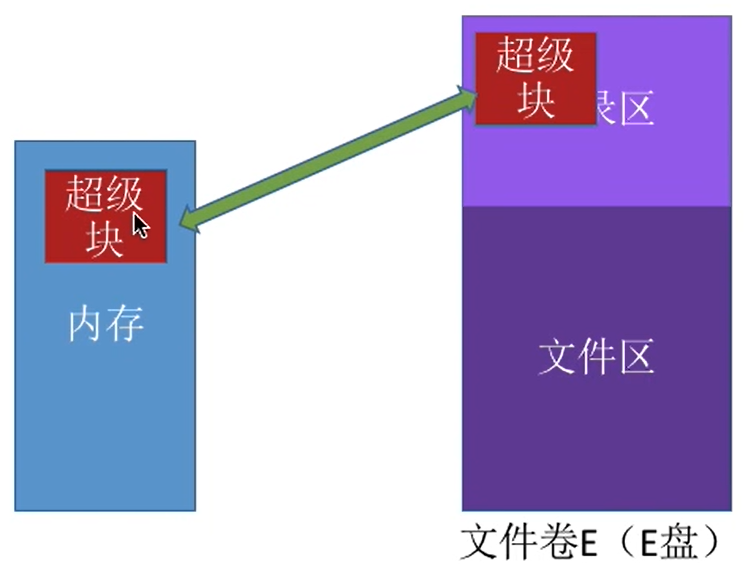

当文件系统被格式化时，**超级块**会被创建并初始化，其中包括初始化**空闲盘块号栈**。超级块会记录空闲盘块的总数以及空闲盘块号栈的起始位置。

- **空闲盘块号栈**：这是一个用来管理空闲磁盘块的数据结构。在文件系统中，当文件被删除或者截断时，其占用的磁盘块会被释放，并返回到空闲盘块号栈中。当需要分配新的磁盘块时，文件系统可以从这个栈中获取空闲的磁盘块号。这样的管理方式可以提高磁盘空间分配的效率。

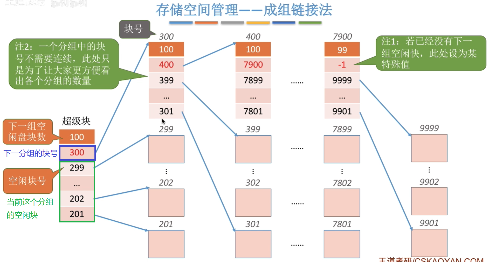

**【注意】**指向下一个分组块号的那个也算空闲块。

只有超级块显示是下一个组空闲块数，其余都是本身的空闲块数。

如何分配？

> Eg:需要100个空闲块
>
> ①检查第一个分组（第一个“下一个分组”）的块数是否足够。100=100，是足够的。
>
> ②分配第一个分组中的100个空闲块。但是由于300号块内存放了再下一组的信息，因此300号块的数据需要复制到超级块中。

就是相当于**超级块是链头**，一个结点填满了之后，把原本这个结点指向下一个结点的数据放入上一个结点里。

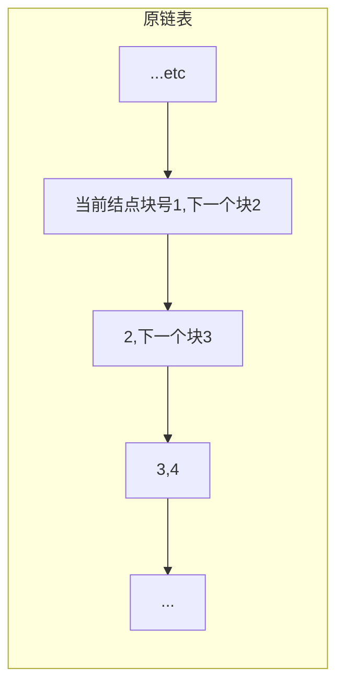
```mermaid
graph LR
    subgraph 原链表
        ...etc-->当前结点块号1,下一个块2-->2,下一个块3-->3,4-->...
    end
```

当2号块被填满之后，把指向3的指针放到1：

```mermaid
graph LR
	subgraph 原链表
        ...etc-->1,2--删.->2,3--删.->3,4-->...
    end
    1,2--直接.->3,4
```

变成：

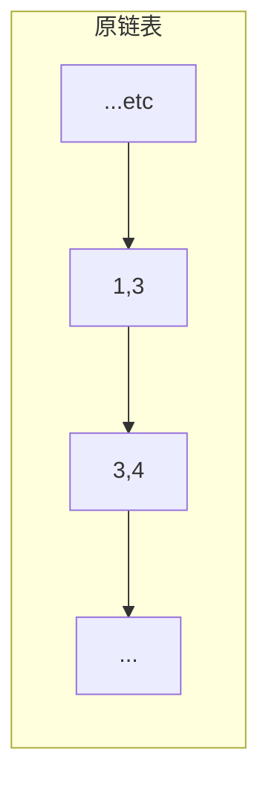
```mermaid
graph LR
	subgraph 原链表
        ...etc-->1,3-->3,4-->...
    end
```

## 7.文件的基本操作

【注意】系统调用都会导致CPU从用户态切换成核心态。

就是操作系统提供的功能：

1. **创建文件**（create系统调用）

   - 分配外存空间，创建目录项。

2. **删除文件**（delete系统调用）

   - 回收外存空间，删除目录项。

3. ❗**打开文件**（**open**系统调用）

   - open调用**参数含有**需要打开的文件的**文件名**。

   - 将**目录项**中的信息复制到**内存**中的打开文件表中，并将打开文件表的**索引号**返回给用户。

     打开文件时并**不会把文件数据直接读入内存**。“索引号”也称“**==文件描述符==**”。

   - 打开文件之后，对文件的操作不再需要每次都查询目录，可以根据内存中的打开文件表进行操作。

   - 每个进程有自己的**==打开文件表==**，系统中也有一张总的打开文件表。

     - **进程打开文件表**中特有的属性：读写指针、访问权限（(只读?读写? )。

     - **系统打开文件表**中特有的属性：打开计数器(有多少个进程打开了该文件)。

       系统打开文件表只在文件实体第一次被打开时才增加一个表目，后面进程再打开该文件，只需要调用系统打开文件表就可以了。
       
       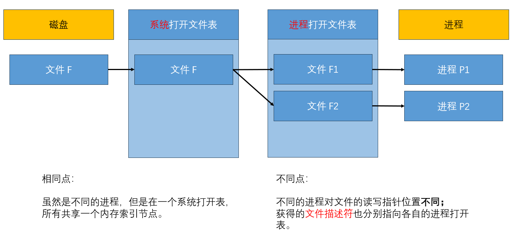
       
       

4. **关闭文件**（close系统调用）

   - 将文件的**控制信息**从内存写回外存**磁盘**。（注意和 写文件 区分）
   - 将**进程打开文件表**中的相应表项删除。
   - **系统打开文件表**的打开计数器减1，若打开计数器为0，则删除系统表的表项。

5. ❗**读文件**（**read**系统调用）

   - 根据读指针、读入数据量、内存位置将文件数据从**外存磁盘**读入**内存。**
   - （2012年408真题）若文件数据不在内存，则该进程阻塞进入睡眠等待。
   - “读/写文件”用“**==文件描述符==**”即可腾明文件，不再需要用到“文件名”。

6. **写文件**（write系统调用）

   - 根据写指针、写出数据量、内存位置，将**文件数据**从内存写回外存**磁盘**。

可用几个基本操作完成更复杂的操作，比如：“复制文件”：先创建一个新的空文件，再把源文件读入内存，再将内存中的数据写到新文件中。

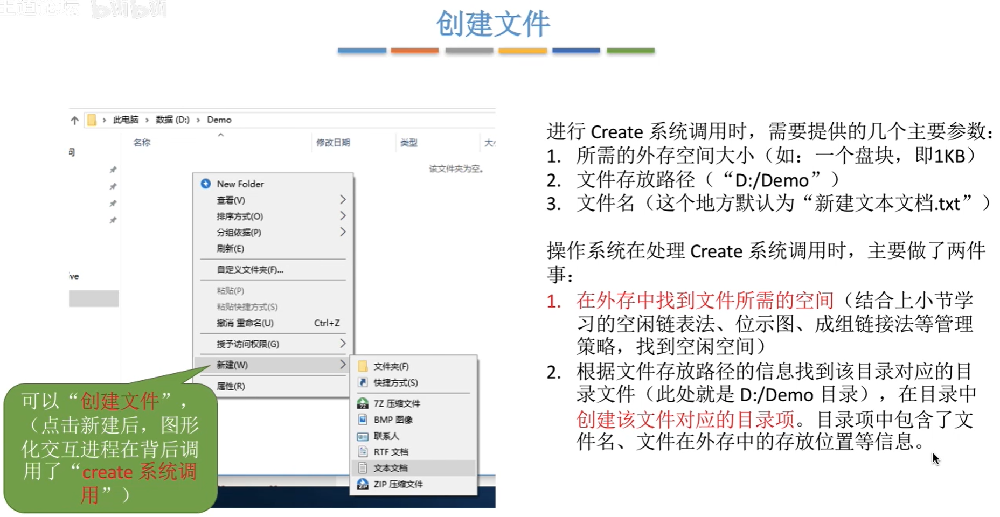

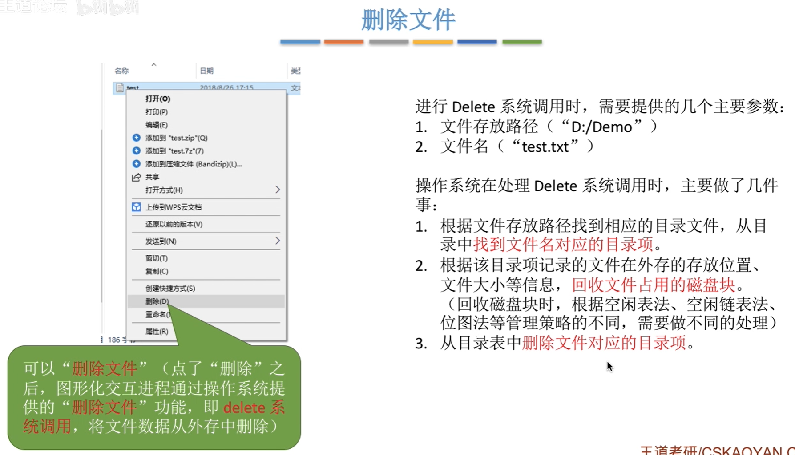

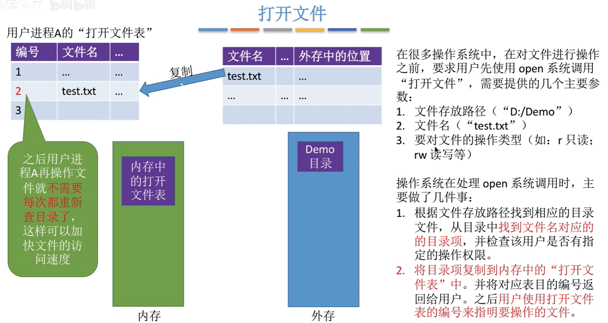

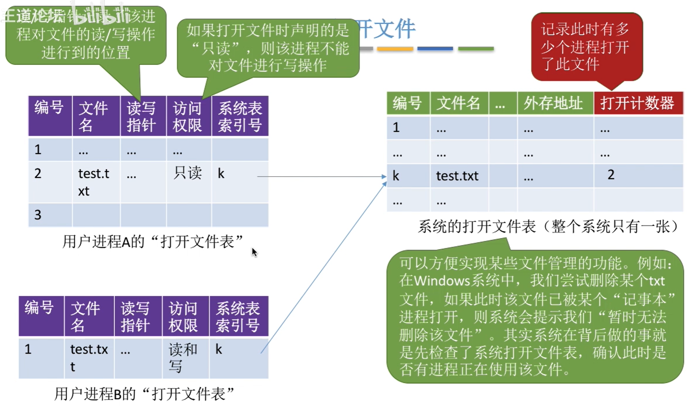

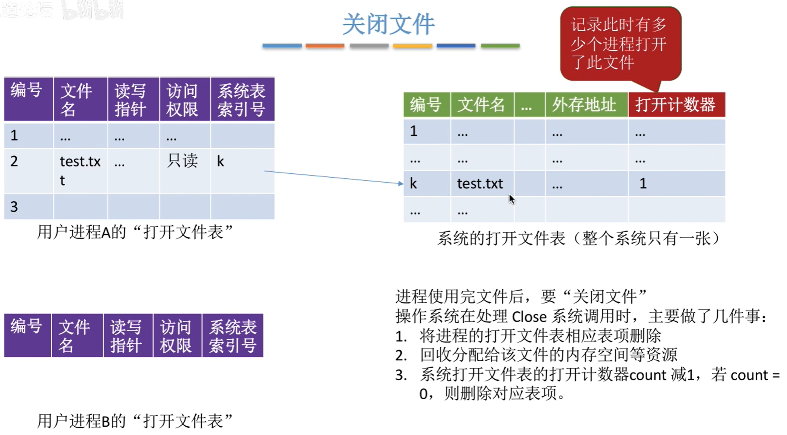

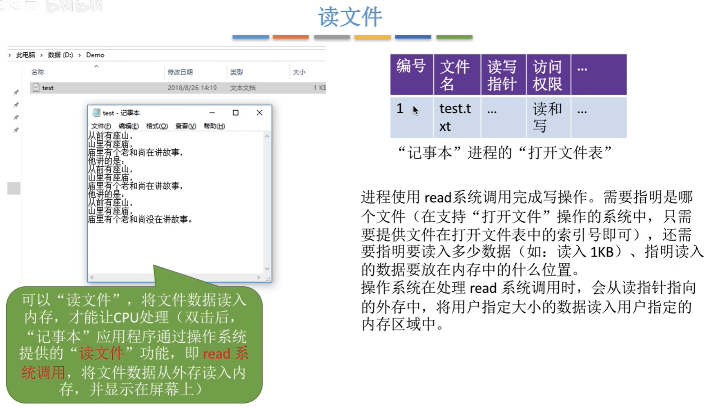

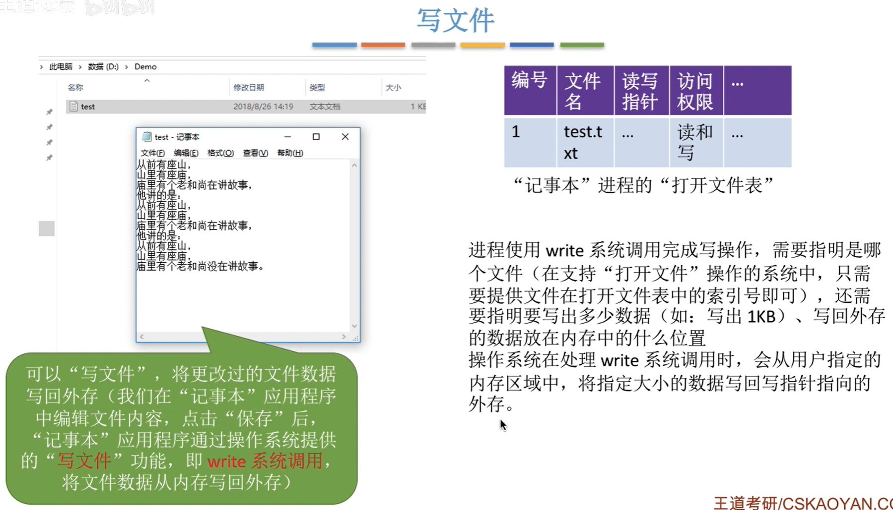

## 8.文件共享

- **共享与复制的区别**

多个用户**共享**同一个文件，意味着系统中只有“一份”文件数据。并且只要某个用户修改了该文件的数据，其他用户也可以看到文件数据的变化。

多个用户都“**复制**”了同一个文件，那么系统中会有“好几份”文件数据。其中一个用户修改了自己的那份文件数据，对其他用户的文件数据并没有影响。

---

分类：

- 基于**索引结点**的共享方式（硬链接）
- 基于**符号链**的共享方式（软链接）


### 8.1基于索引结点的共享方式（硬链接）

知识回顾：**索引结点**，是一种文件**目录**瘦身策略。由于检索文件时只需用到文件名，因此可以将除了文件名之外的其他信息放到索引结点中。这样目录项就只需要包含文件名、索引结点指针。

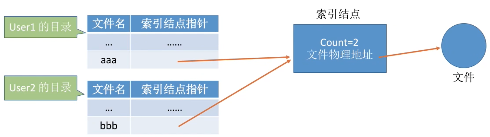

> 详见3.文件目录>3.2目录结>3.2.4有无环图目录结构

索引结点中设置一个**链接计数变量count**，用于表示链接到本索引结点上的用户目录项数。若count = 2，说明此时有两个用户目录项链接到该索引结点上，或者说是有两个用户在共享此文件。

若某个用户决定“删除”该文件，则只是要把用户目录中与该文件对应的目录项删除，且索引结点的count值减1。

- 若count > 0，说明还有别的用户要使用该文件，暂时不能把文件数据删除，否则会导致指针悬空。
- 当count = 0时系统负责删除文件。


### 8.2基于符号链的共享方式（软链接）

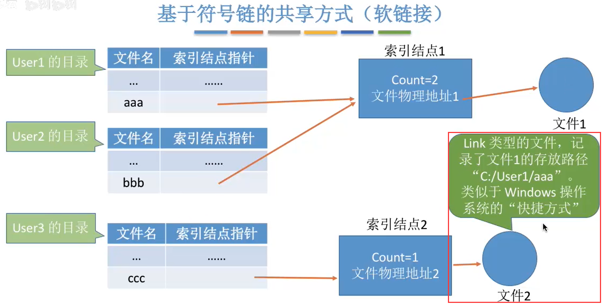

当User3访问“ccc”时，操作系统判断文件“ccc”属于**Link类型文件（快捷方式）**，于是会根据其中记录的路径层层查找目录，最终找到User1的目录表中的“aaa”表项，于是就找到了文件1的**索引结点**。

即使软链接指向的共享文件已被删除，Link 型文件依然存在，只是通过Link 型文件中的路径去查找共享文件会失败（(找不到对应目录项）。

由于用软链接的方式访问共享文件时要查询多级目录，会有**多次磁盘I/O**。


## 9.文件保护

保护文件数据的安全。

- **访问控制表**
- **存取控制表**

### 9.1口令保护

为文件设置一个“**口令**”(如: abc112233），用户请求访问该文件时必须提供“口令”。

**口令**一般存放在文件对应的**FCB**或**索引结点**中。

用户访问文件前需要先输入“口令”，操作系统会将用户提供的口令与FCB中存储的口令进行对比，如果正确，则允许该用户访问文件。

**优点**：保存口令的空间开销不多，验证口令的时间开销也很小。

**缺点**：正确的“口令”存放在系统内部，不够安全。


### 9.2加密保护

使用某个“**密码**”对文件进行加密，在访问文件时需要提供正确的“密码”才能对文件进行正确的解密。

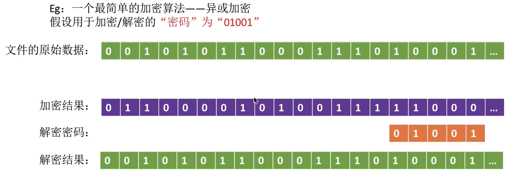

**优点**：保密性强，不需要在系统中存储“密码”。

**缺点**：编码/译码，或者说加密/解密要花费一定时间。


### 9.3访问控制

在每个文件的FCB（或索引结点）中增加一个**访问控制列表**（**ACL**，Access-Control List），该表中记录了各个用户可以对该文件执行哪些操作。

访问类型：

- 读：从文件中读数据
- 写：向文件中写数据
- 执行：将文件装入内存并执行
- 添加：将新信息添加到文件结尾部分
- 删除：删除文件，释放空间
- 列表清单：列出文件名和文件属性

有的计算机可能会有很多个用户，因此访问控制列表可能会很大，可以用**精简的访问列表**解决这个问题。

**精简的访问列表**：进行**分组**。以“**组**”为单位，标记各“组”用户可以对文件执行哪些操作。当某用户想要访问文件时，系统会检查该用户所属的分组是否有相应的访问权限。

> 如：分为系统管理员、文件主、文件主的伙伴、其他用户几个分组。


**优点**：实现灵活，可以实现复杂的文件保护功能。


## 10.文件系统的层次结构

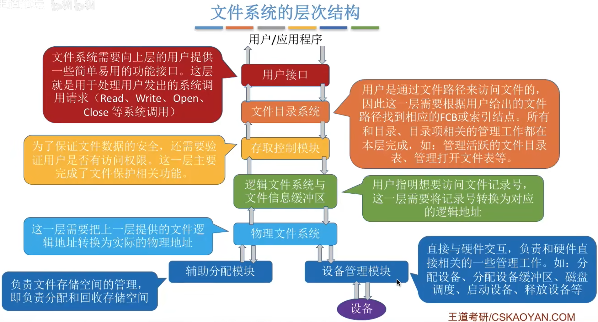

用一个例子来辅助记忆文件系统的层次结构：

假设某用户请求删除文件“D:/工作目录/学生信息..xlsx”的最后100条记录。

1. 用户需要通过操作系统提供的接口发出上述请求――**用户接口**
2. 由于用户提供的是文件的存放路径，因此需要操作系统一层一层地查找目录，找到对应的目录项――**文件目录系统**
3. 不同的用户对文件有不同的操作权限，因此为了保证安全，需要检查用户是否有访问权限——**存取控制模块**（存取控制验证层）
4. 验证了用户的访问权限之后，需要把用户提供的“记录号”转变为对应的逻辑地址――**逻辑件系统与文件信息缓冲**
5. 知道了目标记录对应的逻辑地址后，还需要转换成实际的物理地址――**物理文件系统**
6. 要删除这条记录，必定要对磁盘设备发出请求――**设备管理程序模块**
7. 删除这些记录后，会有一些盘块空闲，因此要将这些空闲盘块回收――**辅助分配模块**


# 九、磁盘组织与管理

> 详见 计算机组成原理 - 3.存储系统 - 7.磁盘存储器（机械）

计算机的外存储器又称为辅助存储器，目前主要使用**磁表面存储器**。

所谓“磁表面存储”，是指把某些磁性材料薄薄地涂在金属铝或塑料表面上作为载磁体来存储信息。磁盘存储器、磁带存储器和磁鼓存储器均属于磁表面存储器。

- 磁表面存储器的**优点**：

①存储容量太，位价格低；

②记录介质可以重复使用；

③记录信息可以长期保存而不丢失，甚至可以脱机存档；

④非破坏性读出，读出时不需要再生。

- 磁表面存储器的**缺点**：

①存取速度慢；

②机械结构复杂；

③对工作环境要求较高。

---

## 1.组成

**硬盘存储器**由磁盘驱动器，磁盘控制器和盘片组成。

- **磁盘驱动器**：核心部件是磁头组件和盘片组件，温彻斯特盘是一种可移动头固定盘片的硬盘存储器。

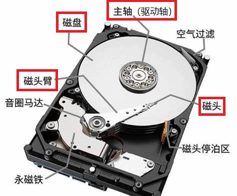


- **磁盘控制器**：是硬盘存储器和主机的接口（I/O控制器），主流的标准有IDE（ATA）、SCSI、SATA等。

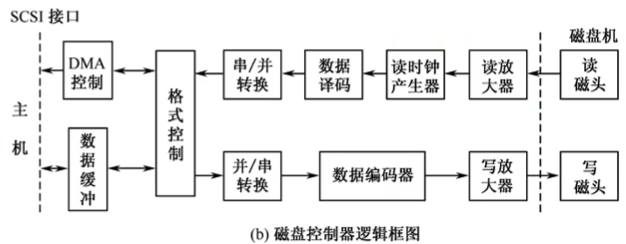


- **盘片**：磁盘存储区域

一块硬盘含有若干个记录面，每个**记录面**划分为若干条**磁道**，而每条磁道又划分为若干个**扇区**，**扇区（也称块）是磁盘读写的最小单位**，也就是说磁盘按块存取。

- 盘片
  - 磁道
    - 簇（几个扇区组合）
    - 扇区（读写最小单位）

【2017年408真题】为了改善磁盘的效率，操作系统把多个相邻的**扇区**组合成**簇**，这个时候，对文件的存储空间分配一簇为单位。所以文件所占的空间只能是**簇的整数倍**。

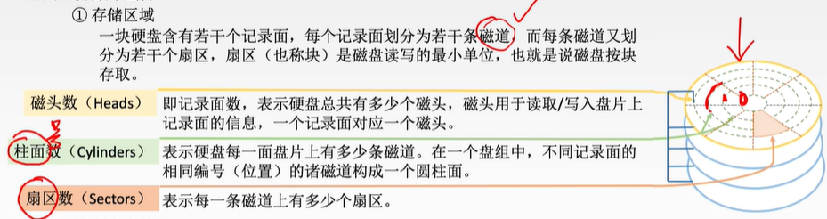

一个盘片的正面反面都可以涂上磁性材质：

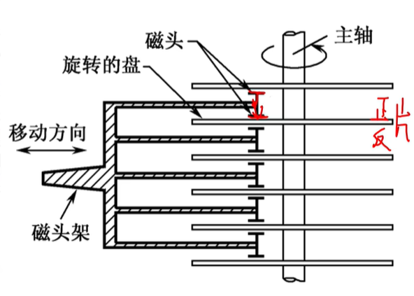


## 2.磁盘性能指标

### 2.1磁盘的容量

一个磁盘所能存储的字节总数称为磁盘容量。磁盘容量有非格式化容量和格式化容量之分。

1. **非格式化容量**：从物理上来看，磁盘可以记录的二进制bit位的上限。是指磁记录表面可以利用的磁化单元总数。
2. **格式化容量**：是指按照某种特定的记录格式所能存储信息的总量。进行格式化之后会预留下某些空间，等到使用的某些扇区坏了，那么备份的扇区就会出来顶替坏掉的扇区。

格式化容量 < 非格式化容量

### 2.2记录密度

记录密度是指盘片单位面积上记录的二进制的信息量，通常以道密度、位密度和面密度表示。

1. **道密度**：是沿磁盘半径方向单位长度上的磁道数；

   如：60道/cm：就是1cm上60个磁道。

2. **位密度**：是磁道单位长度上能记录的二进制代码位数；

   如：600bit/cm：就是在这个磁道上，1cm可以存储600bit二进制位。

   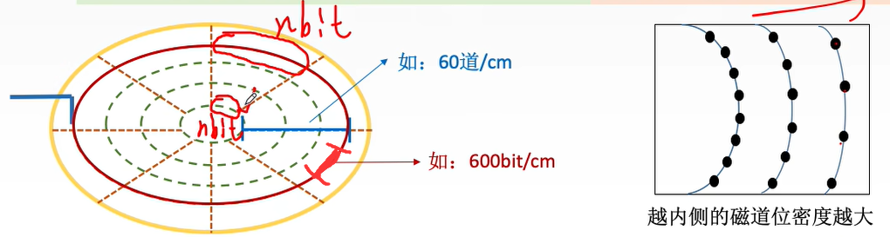

   **【注意】**虽然在扇区看起来，里层的更短，但是存储的数据量一样大，所以**越内侧的磁道位密度越大**。

3. **面密度**：是位密度和道密度的乘积。

### 2.3==平均存取时间==

**平均存取时间 =**

**寻道时间（寻找时间，磁头移动到目的磁道）+ **

**旋转延迟时间（磁头定位到所在扇区）+ **

**传输时间（传输数据所花费的时间）**。

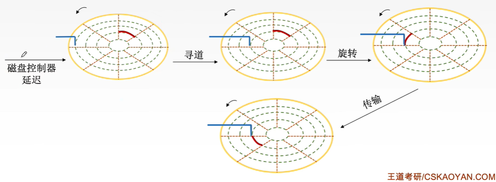

**【注意】**

1. 有的题目还会要求加上磁盘控制器延迟的时间。
2. 如果题目没有给出旋转延迟时间，那么就用**磁盘转半圈**的时间替代。

### 2.4数据传输率

磁盘存储器在单位时间内向主机传送数据的字节数，称为数据传输率。

因为每次都可以读入一整条的磁道的数据。

假设磁盘转数为 r(转/秒），每条磁道容量为 N 个字节，则数据传输率为：
$$
D_r = rN
$$


## 3.磁盘物理地址

磁盘的**物理地址**：可用**（柱面号，盘面号，扇区号）**来定位任意一个“磁盘块”。

在“文件的物理结构”小节中，我们经常提到文件数据存放在外存中的**几号块**，这个块号就可以转换成（柱面号，盘面号，扇区号）的地址形式。

当主机向磁盘控制器发送**寻址**信息，磁盘的地址一般如图所示：

| 驱动器号               | 柱面（磁道）号               | 盘面号       | 扇区号                         |
| ---------------------- | ---------------------------- | ------------ | ------------------------------ |
| 一台电脑可能有多个硬盘 | 一个盘面中内圈、外圈的第几圈 | 第几个盘面   | 一个盘面内的扇形区域           |
|                        | 移动磁头臂（寻道）           | 激活某个磁头 | 通过旋转将特定扇区划过磁头下方 |

- 为什么磁盘的物理地址是（柱面号，盘面号，扇区号）而不是（盘面号，柱面号，扇区号）。柱面号在盘面之前？

答：读取地址连续的磁盘块时，采用（柱面号，盘面号，扇区号）的地址结构，一开始就可以把所有的磁头移到对应的磁道上，可以减少磁头移动消耗的时间。


例题：

> 若系统中有4个驱动器，每个驱动器带一个磁盘，每个磁盘256个磁道、16个盘面，每个盘面划分为16个扇区，则每个扇区地址要18位二进制代码：
>
> 驱动器号 (2bit)
> 柱面(磁道)号 (8bit)
> 盘面号 (4bit)
> 扇区号 (4bit)


## 4.磁盘工作过程

硬盘的主要操作是寻址，读盘、写盘。每个操作都对应一个控制字，硬盘工作时，第一步是取控制字，第二步是执行控制字。

可根据该地址读取一个“块”：

1. 根据“**柱面**号”移动磁臂，让磁头指向指定柱面；
2. 激活指定**盘面**对应的磁头；
3. 磁盘旋转的过程中，指定的**扇区**会从磁头下面划过，这样就完成了对指定扇区的读/写。

【注意】硬盘属于机械式部件，其读写操作是**串行**的，**每次读写1bit，且读写不能同时进行**（不可能在同一时刻既读又写，也不可能在同一时刻读两组数据或写两组数据）。


## 5.分类

- 按照**磁头是否可以移动**分类：
  - 活动头磁盘
  - 固定头磁盘

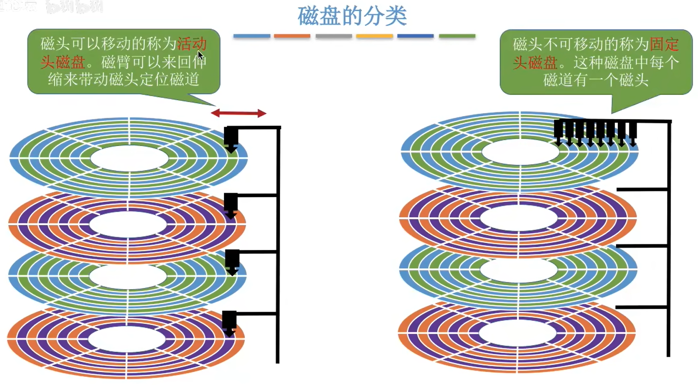

- 按照**磁头是否可以移动**分类：
  - 活动头磁盘
  - 固定头磁盘

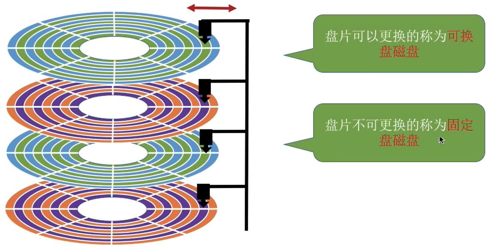


## 6.平均存取时间

一次磁盘读/写操作需要的时间。

**平均存取时间 =**

**==寻道时间==（寻找时间，磁头移动到目的磁道）+ **

**==旋转延迟时间==（磁头定位到所在扇区）+ **

**==传输时间==（传输数据所花费的时间）**。


**【注意】**

1. 有的题目还会要求加上磁盘控制器延迟的时间。
2. 如果题目没有给出旋转延迟时间，那么就用**磁盘转半圈**的时间替代。


### 6.1寻道时间

寻找时间（寻道时间）T~s~：在读/写数据前，将磁头移动到指定**磁道**所花的时间。

①**启动磁头臂**是需要时间的。设耗时为s；

②**移动磁头**也是需要时间的。设磁头匀速移动，每跨越一个磁道耗时为m，总共需要跨越n条磁道。则：
$$
寻道时间T_s = s + m*n
$$


### 6.2延迟时间

延迟时间T~R~：通过旋转磁盘，使磁头定位到目标**扇区**所需要的时间。

设磁盘转速为r（单位:转/秒，或转/分），则平均所需的延迟时间：
$$
延迟时间T_R=\frac 1 {2r}
$$
$\cfrac 1 r$ 就是转一圈需要的时间。**找到目标扇区平均需要转半圈**，因此再乘以$\cfrac 1 2$。


### 6.3传输时间

传输时间T~t~：从磁盘读出或向磁盘写入数据所经历的时间。

设磁盘转速为r，此次读/写的字节数为b，每个磁道上的字节数为N。则：
$$
传输时间T_t=\cfrac 1r * \cfrac bN = \cfrac b{rN}
$$
每个磁道要可存N字节的数据，因此b字节的数据需要b/N个磁道才能存储。

而读/写一个磁道所需的时间刚好又是转一圈所需要的时间1/r。


## 7.磁盘调度算法（-减少寻道时间）

延迟时间和传输时间都与磁盘转速r相关，且为线性相关。而转速是硬件的固有属性，因此操作系统也无法优化延迟时间和传输时间。

但是操作系统的磁盘调度算法会直接影响寻道时间。

[5.3_2_磁盘调度算法_哔哩哔哩_bilibili](https://www.bilibili.com/video/BV1YE411D7nH/?p=81)


### 7.1先来先服务(FCFS)

first come first server

根据进程请求访问磁盘的先后顺序进行调度。

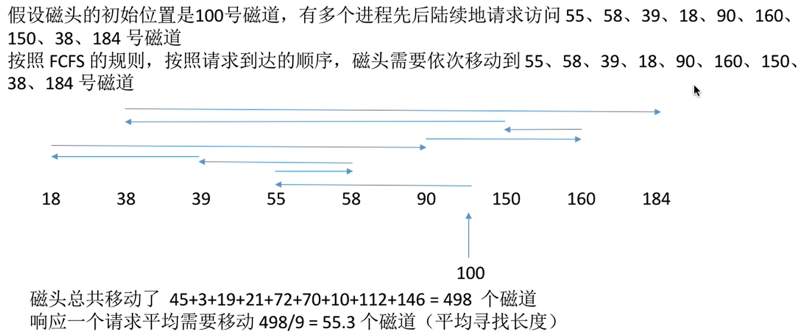

**优点**：公平；如果请求访问的磁道比较集中的话，算法性能还算过的去。

**缺点**：如果有大量进程竞争使用磁盘，请求访问的磁道很分散，则FCFS在性能上很差，寻道时间长。


### 7.2最短寻道时间优先(SSTF)

Shortest Seek Time First

SSTF算法会优先处理的磁道是与当前磁头最近的磁道。可以保证每次的寻道时间最短，但是并不能保证总的寻道时间最短。

【助记】其实就是贪心算法的思想，只是选择眼前最优，但是总体未必最优。

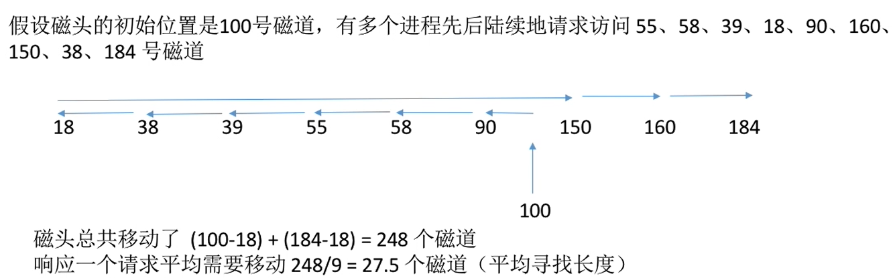

**优点**：性能较好，平均寻道时间短。

**缺点**：可能产生“**饥饿**”现象。


### 7.3扫描算法(SCAN)

SSTF算法会产生饥饿的原因在于：磁头有可能在一个小区域内来回来去地移动。为了防止这个问题，可以规定，**只有磁头移动到最外侧磁道的时候才能往内移动，移动到最内侧磁道的时候才能往外移动**。

这就是扫描算法（SCAN）的思想。由于磁头移动的方式很像电梯，因此也叫**电梯算法**。

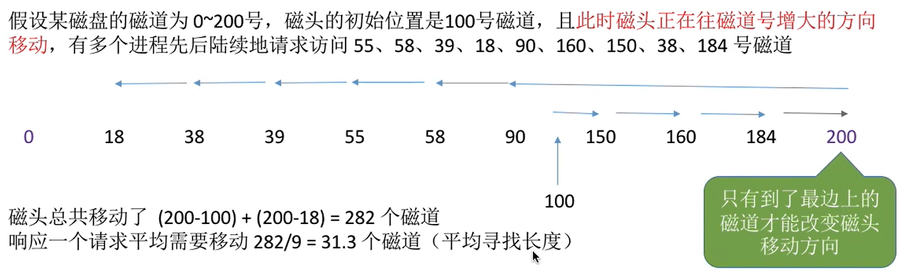

**优点**：性能较好，平均寻道时间较短，**不会产生饥饿**现象。

**缺点**：

1. **只有到达最边上**的磁道时**才能改变磁头移动方向**。

事实上，处理了184号磁道的访问请求之后就不需要再往右移动磁头了。

2. SCAN算法对于各个位置磁道的**响应频率不平均**。

如：假设此时磁头正在往右移动，且刚处理过90号磁道，那么下次处理90号磁道的请求就需要等磁头移动很长一段距离；而响应了184号磁道的请求之后，很快又可以再次响应184号磁道的请求了。


### 7.4 LOOK调度算法

> LOOK调度算法解决了扫描（SCAN）算法的第一个缺点。

扫描算法（SCAN）中，只有到达**最边上**的磁道时才能改变磁头移动方向，事实上，很多时候并不需要移动到最边上就可以回头进行扫描了。

**LOOK调度算法**就是为了解决这个问题，如果在磁头移动方向上已经没有别的请求，就可以立即改变磁头移动方向。

【助记】边移动边观察，因此叫LOOK。

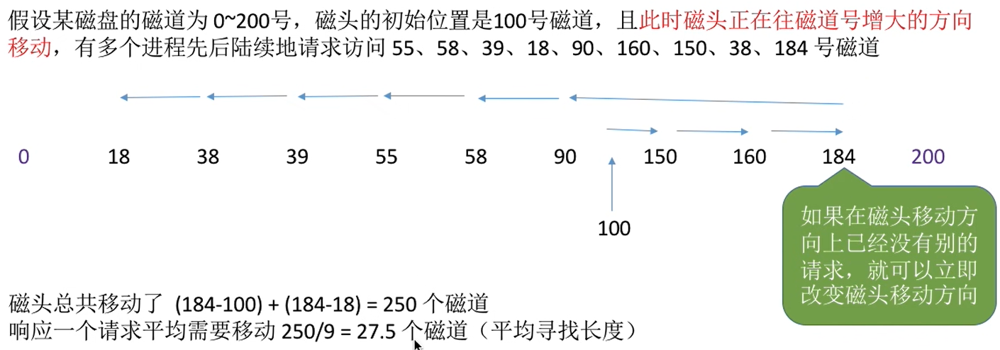


### 7.5循环扫描算法(C-SCAN)

> 循环扫描（C-SCAN）算法解决了扫描（SCAN）算法的第二个缺点。

SCAN算法对于各个位置磁道的响应频率不平均。

而C-SCAN算法规定只有磁头朝某个特定方向移动时才处理磁道访问请求，而**返回时直接快速移动至起始端而不处理任何请求**。

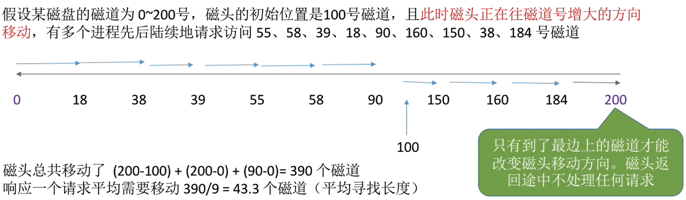

**优点**：比起SCAN来，对于各个位置磁道的响应频率很平均。

**缺点**：和SCAN一样，**只有到达最边上**的磁道时**才能改变磁头移动方向**。


### 7.6 C-LOOK算法

C-SCAN算法的主要缺点是只有到达最边上的磁道时才能改变磁头移动方向，并且磁头返回时不一定需要返回到最边缘的磁道上。C-LOOK算法就是为了解决这个问题。

C-LOOK算法规定：**如果磁头移动的方向上已经没有磁道访问请求了，就可以立即让磁头返陆，并且磁头只需要返回到有磁道访问请求的位置即可**。

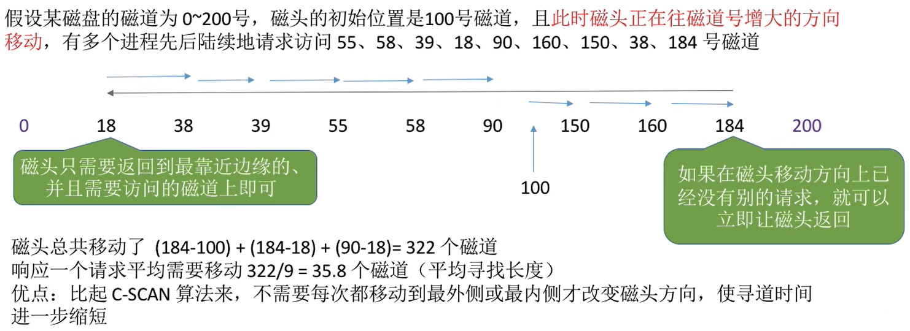


## 8.-减少延迟时间

假设要连续读取橙色区域的2、3、4扇区：

磁头读取一块的内容（也就是一个扇区的内容）后，需要一小段时间处理，而盘片又在不停地旋转。因此，如果2、3号扇区相邻着排列，则读完2号扇区后无法连续不断地读入3号扇区，因为2扇区进行处理的过程中，磁头已经划过磁头，必须等盘片继续旋转，3号扇区再次划过磁头，才能完成扇区读入。

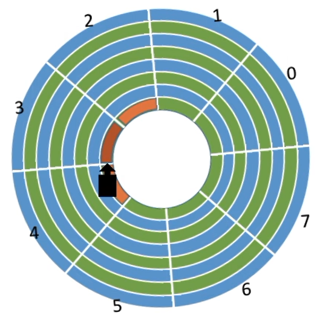

**总结**：**磁头读入一个扇区数据后需要一小段时间处理**，如果逻辑上相邻的扇区在物理上也相邻，则读入几个连续的逻辑扇区，可能需要很长的“延迟时间”。


### 8.1交替编号

若采用交替编号的策略，即让逻辑**上相邻的扇区在物理上有一定的间隔**，可以使读取连续的逻辑扇区所需要的延迟时间更小。

> 磁道：如果怕错过，那我们就迟点相遇。

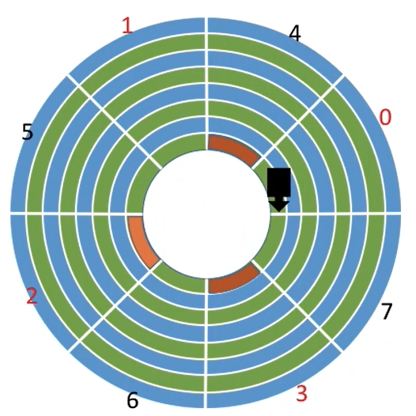


### 8.2错位命名

原本的磁盘上下对应的是一样的，0号扇区下面也还是0号扇区。但是因为上一个盘面的磁头工作完之后，启动下一个盘面的磁头也需要时间，所以把不同的盘面扇区错开，如下图4号扇区对应0号扇区。

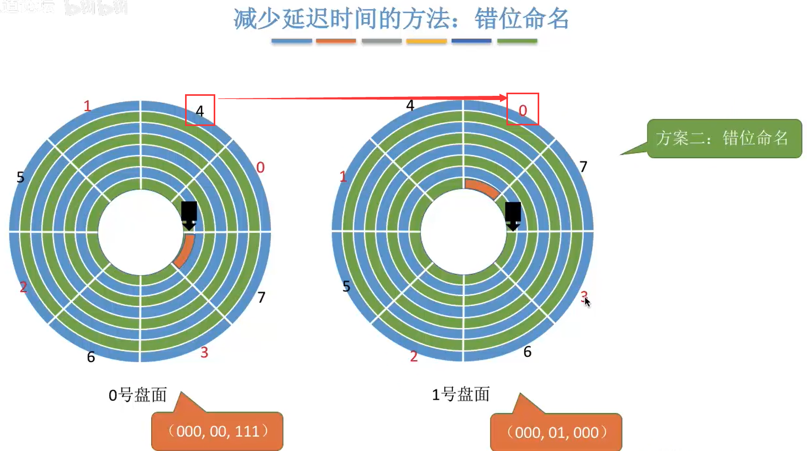


## 9.磁盘管理

### 9.1磁盘初始化

- **物理格式化**，即**低级**格式化：

**划分扇区，检测坏扇区，并用备用扇区替换坏扇区**。

一个扇区通常可分为头、数据区域（如512B大小）、尾三个部分组成。管理扇区所需要的各种数据结构一般存放在头、尾两个部分，包括扇区校验码（如奇偶校验、CRC循环冗余校验码等，校验码用于校验扇区中的数据是否发生错误）。


- **逻辑格式化**，即**高级**格式化：

磁盘**分区**（分卷Volume），创建文件系统，完成各分区的**文件系统**初始化注。


逻辑格式化后，灰色部分就有实际数据了，白色部分还没有数据。

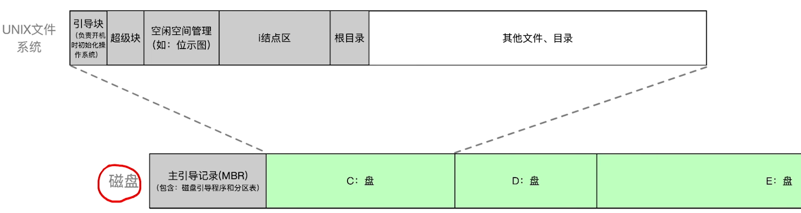

- **超级块**：6.5成组链接法
- 空闲空间管理(如:位示图)：6.4位示图法
- i 结点：3.3索引结点

---

计算机开机时需要进行一系列初始化的工作，这些初始化工作是通过执行**初始化程序（自举程序）**完成的。这部分初始化程序放在ROM，ROM中的数据在出厂时就写了，并且以后不能再修改，所以不适合写入全部的自举程序。

所以，现在的ROM中只存放很小的“**自举装入程序**”。

完整的**自举程序**放在磁盘的**启动块（引导块/启动分区）**上，启动块位于磁盘的固定位置。拥有**启动分区**的磁盘称为**启动磁盘**或**系统磁盘(C:盘)**。

开机时计算机先运行“自举装入程序”，通过执行该程序就可找到引导块，并将完整的“自举程序”读入内存，完成初始化。

> 计算机开机流程见操作系统 - 1.操作系统 - 7.操作系统的引导

==开机过程==：

1. 执行ROM中的引导(boot)程序（**JMP转跳到BIOS**）；
2. BIOS引导CPU将磁盘的**MBR（主引导记录）**放入内存RAM（MBR地址入口）；
3. **硬件自检**，构建**中断向量表**，检查硬件故障；
4. MBR中的**磁盘引导程序**会根据**分区表**来寻找C盘的位置，将**PBR（引导快）**放入内存；
5. 从根目录中找到**启动管理器**，进行操作系统初始化。


### 9.2坏块的管理

坏了、无法正常使用的扇区就是“**坏块**”。

这属于硬件故障，操作系统是无法修复的。应该将坏块标记出来，以免错误地使用到它。

- 对于简单的磁盘，

  可以在逻辑格式化时（建立文件系统时）对整个磁盘进行坏块检查，标明哪些扇区是坏扇区，比如：在FAT表上标明。（【注意】在这种方式中，**坏块对操作系统==不透明==**）。

- 对于复杂的磁盘，

  磁盘控制器（磁盘设备内部的一个硬件部件）会维护一个**坏块链表**。

  在磁盘出厂前进行低级格式化（物理格式化）时就将坏块链进行初始化。

  会保留一些“**备用扇区**”，用于**替换坏块**。这种方案称为扇区备用。且这种处理方式中，**坏块对操作系统==透明==**。


**【注意】**这里的**透明是看不见的意思**。在计算机中，从某个角度看不到的特性称该特性是透明的。这个意义上的“透明”与社会生活中的透明含义恰好相反。

例如计算机组织对程序员是透明的，就是说计算机组织对程序员来说是看不到的，也不需要看到的。


### 9.3系统调用后的磁盘管理

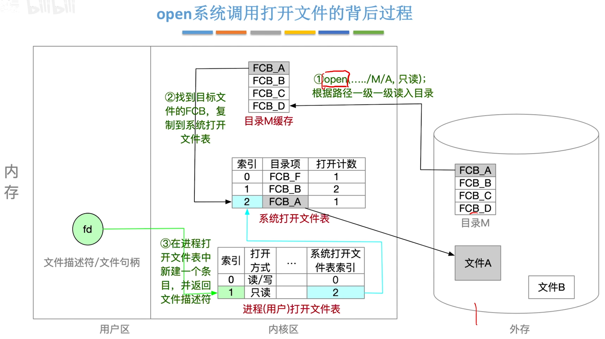


## 10.虚拟文件系统VFS

为了实现VFS，Linux主要抽象了4种对象类型：

超级块（superblock）对象

索引节点对象

目录项（inode）对象

文件（file）对象


普通文件系统中，不同文件系统的接口函数不一样，所以用户在使用时比较麻烦：

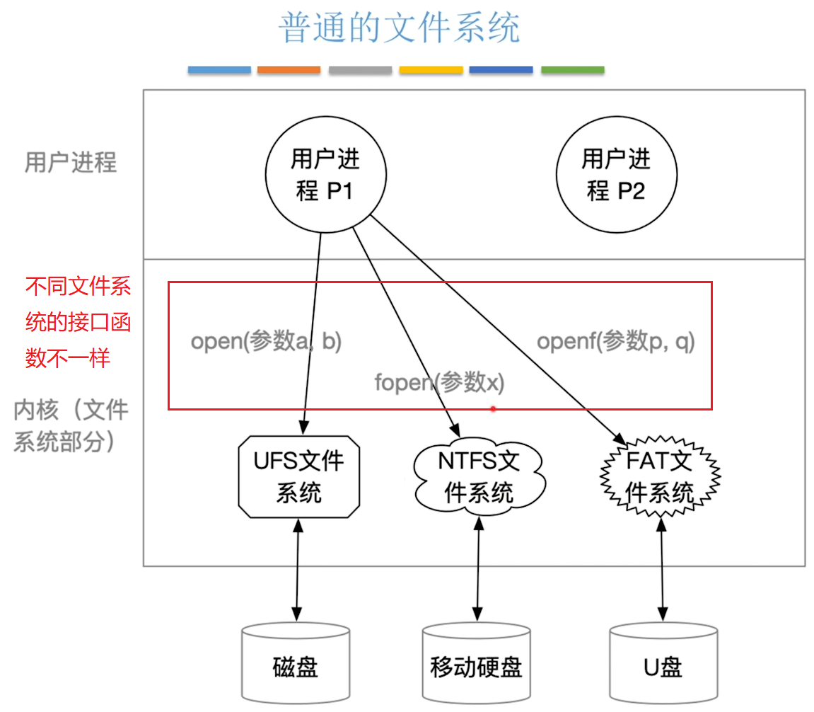

所以引出**虚拟文件系统**。

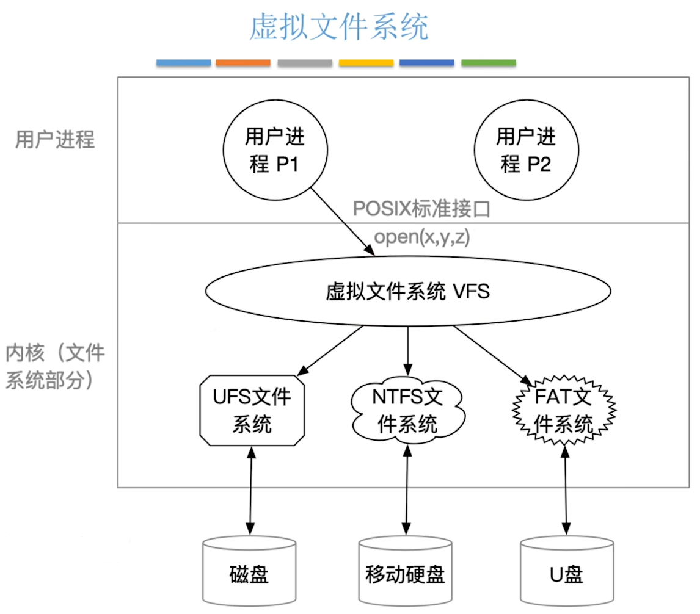

**虚拟文件系统（VFS）**的特点：

1. **向上层用户进程提供统一标准的系统调用接口**，屏蔽底层具体文件系统的实现差异。

2. VFS要求**下层的文件系统必须实现某些规定的函数**功能。
   如：open/read/write。一个新的文件系统想要在某操作系统上被使用，就必须满足该操作系统VFS的要求。

3. 每打开一个文件，VFS就在主存中新建一个**vnode（v结点）**，用**统一的数据结构**表示文件，无论该文件存储在哪个文件系统。

   【注意】vnode**只存在于主存**中；而inode（目录索引结点）既会被调入主存，也会在外存中存储。


## 11.文件系统挂载（安装）

文件系统**挂载（mounting）**，即文件系统安装/装载――如何将一个文件系统挂载到操作系统中？

文件系统挂载要做的事：

1. 在VFS中注册新挂载的文件系统。内存中的**挂载表（mount table）**包含每个文件系统的相关信息，包括文件系统类型、容量大小等。
2. 新挂载的文件系统，要向VFS提供一个**函数地址列表**。
3. 将新文件系统加到**挂载点（mount point）**，也就是将新文件系统挂载在某个父目录下。


# 番外、固态硬盘SSD

> 详见 计算机组成原理 - 3.存储系统 - 5.只读存储器ROM - 5.1固态硬盘SSD


**固态硬盘**（Solid State Drives，SSD）

## 1.原理

基于**闪存**的固态硬盘是用固态电子存储芯片阵列制成的硬盘。属于电可擦除ROM，即EEPROM

## 2.组成

由控制单元+存储单元（Flash芯片）组成。

闪存翻译层（控制单元）：负责翻译逻辑块号，找到对应页(Page)。

存储介质（存储单元）：多个闪存芯片(Flash Chip)，每个芯片包含多个块(block)，每个块包含多个页(page)。

- 闪存芯片(Flash Chip)
  - 块(block)
    - 页(page)：（读写最小单位）

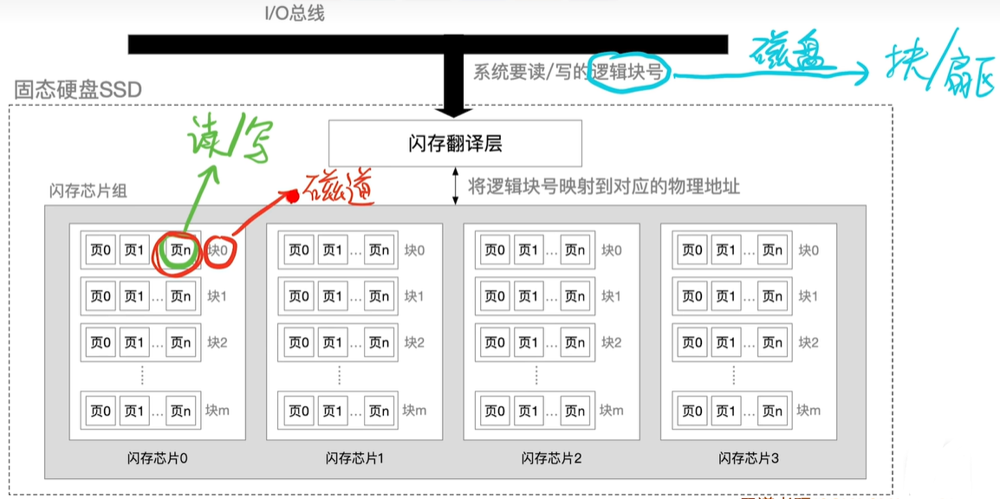

## 3.读写特性（OS考点）

1. 以**页(page)为单位读/写**。相当于磁盘的"扇区"。
2. 以**块(block)为单位"擦除"**，擦干净的块，其中的每页都可以写一次，读无限次。
3. 支持**随机访问**，系统给定一个逻辑地址，闪存翻译层可通过电路迅速定位到对应的物理地址。
4. **读快、写慢**。要写的页如果有数据，则不能写入，需要将块内其他页全部复制到一个新的（擦除过的）块中，再在新的块的那一页写入新的内容页。

## 4.与机械硬盘相比

1. SSD读写速度快，随机访问性能高，用电路控制访问位置。机械硬盘通过移动磁臂旋转磁盘控制访问位置，有寻道时间和旋转延迟。
2. SSD安静无噪音、耐摔抗震、能耗低、造价更贵。
3. SSD的一个**"块"被擦除次数过多（重复写同一个块）可能会坏掉**。而机械硬盘的扇区不会因为写的次数太多而坏掉。

## 5.磨损均衡技术（OS考点）

【思想】将"擦除"平均分布在各个块上，以提升使用寿命。

**动态磨损均衡**：写入数据时，优先选择累计擦除次数少的新闪存块

**静态磨损均衡**：SSD监测并自动进行数据分配、迁移，让老旧的闪仔块承担以读为主的储存任务，让较新的闪存块承担更多的写任务。

