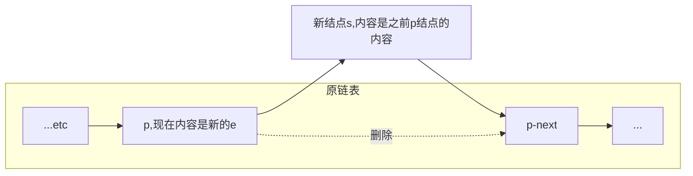
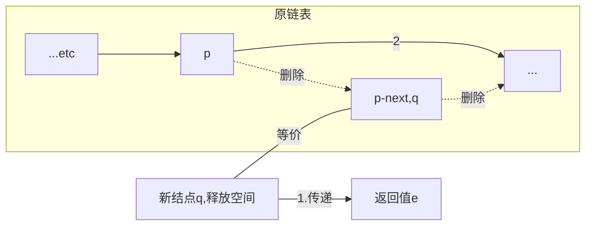
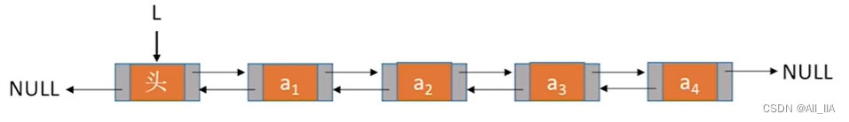
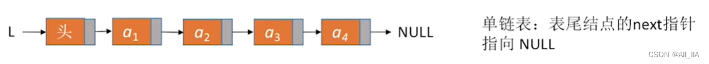
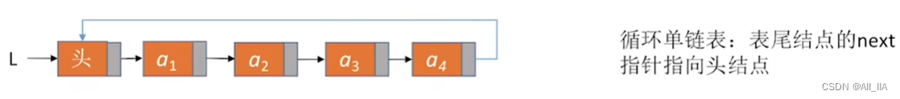
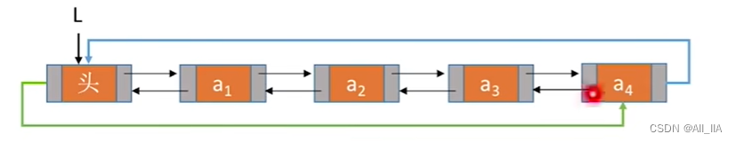
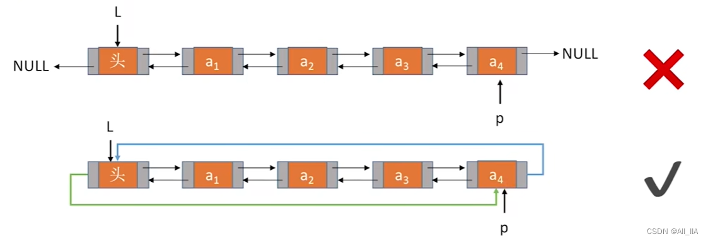
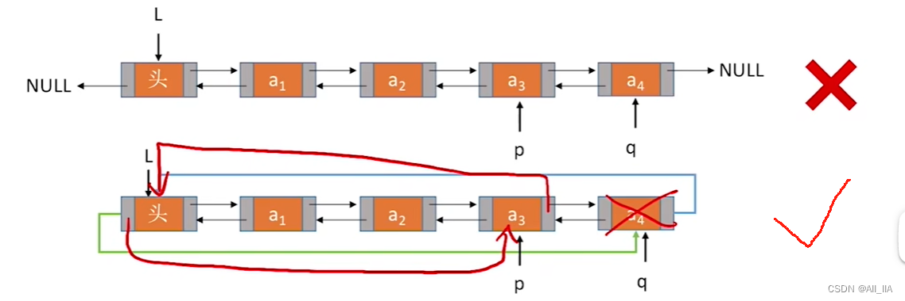
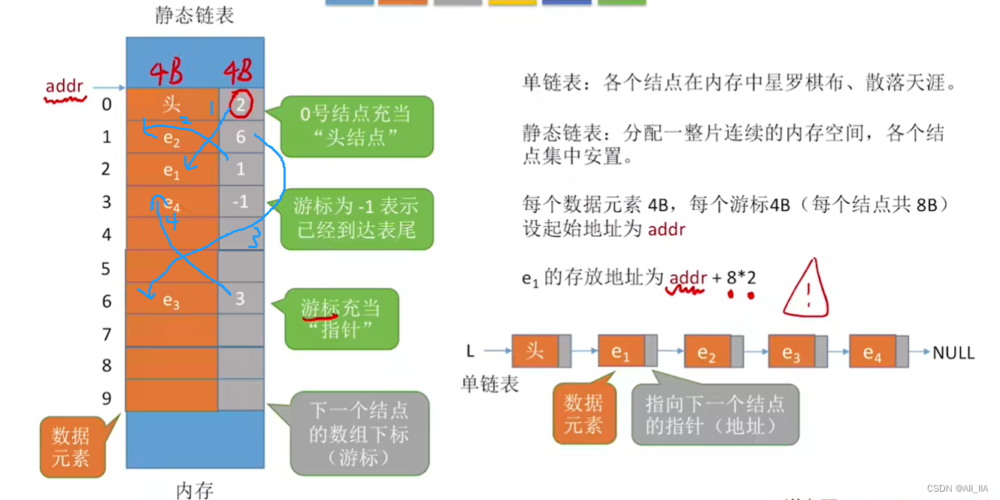
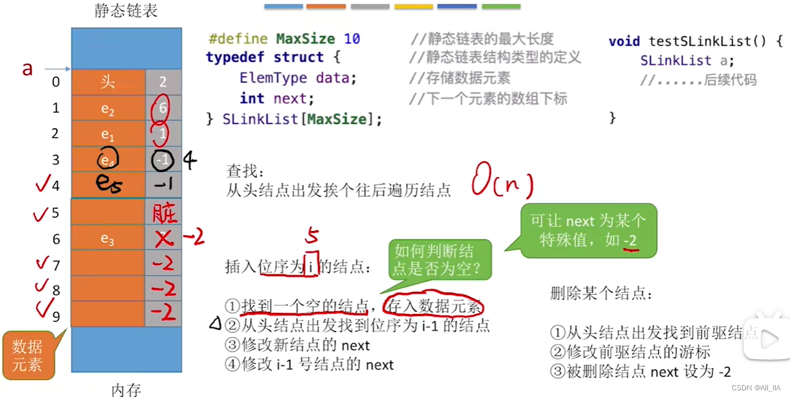

# 线性表linear list

[toc]


## 1.逻辑结构

线性表是具有**相同数据类型**的n (n≥0）个**数据元素**的**有限序列**，其中n为**表长**，当n=0时线性表是一个**空表**。

若用L命名线性表，则其一般表示为：
L = (a1, a2,..., ai, ai+1,..., an)

- ai是线性表中的“第i个”元素线性表中的**位序**。
- a1是**表头元素**；an是**表尾元素**。
- 线性表中的位序是**==从 1 开始==的**，而数组中元素的下标是从 0开始的。
  - 也就是用户输入的必须是从 1 开始，但是程序内部可以默认0开始。
- 除第一个元素外，每个元素有且仅有一个直接**前驱**；除最后一个元素外，每个元素有且仅有一个直接**后继**。
- 数据类型相同，每个数据元素所占空间一样大。

## 2.物理（存储）结构

1. 顺序表（顺序存储）
2. 链表（链式存储）
   - 单链表
   - 双链表
   - 循环链表
   - 静态链表

## 3.基本操作

InitList(&L)：**初始化**表。构造一个空的线性表L，分配内存空间。

DestroyList(&L)：**销毁**操作。销毁线性表，并**释放**线性表L所占用的**内存空间**。

Listinsert(&L,i,e)：**插入**操作。在表L中的第i个位置上插入指定元素e。

ListDelete(&L,i,&e)：**删除**操作。删除表L中第i个位置的元素，并用e返回删除元素的值。

LocateElem(L,e)：**按值查找**操作。在表L中查找具有给定关键字值的元素。

GetElem(L,i)：**按位查找**操作。获取表L中第i个位置的元素的值。

其他常用操作：

Length(L)：求表长。返回线性表L的长度，即L中数据元素的个数。

PrintList(L)：输出操作。按前后顺序输出线性表L的所有元素值。

Empty(L)：判空操作。若L为空表，则返回true，否则返回false。


# 一、顺序表

顺序表：用顺序存储的方式实现线性表。

顺序存储：把逻辑上相邻的元素存储在物理位置上也相邻的存储单元中，元素之间的关系由存储单元的邻接关系来体现。

所以，设线性表第一个元素的存放位置是LOC(L)，第一个元素称起始地址或基地址，简称**基址**。

> LOC 是 location 的缩写

那么，第二个元素就是 LOC(L)+数据元素 的大小；第三个元素就是 LOC(L)+数据元素 的大小*2

判断一个数据的大小：

```c
sizeof(int) = 4B
```

## 0.特点

优点：

1. 使用顺序存储，每个数据元素大小相同，所以**查找**可以**随机访问**，即可以在O(1)时间内找到第i个元素。
2. **存储密度高**，每个节点只存储数据元素。

缺点：

1. **拓展容量**不方便，使用大片连续的空间，即便采用动态分配的方式实现，拓展长度的时间复杂度也比较高。
2. **插入、删除**操作不方便，需要移动大量元素。


【注意】虽然顺序表可以使用一维数组来表示，但是顺序表是逻辑结构，一维数组是物理结构，栈、队列也可使用一维数组实现，所以**顺序表、一维数组在逻辑结构上并不相同**。


## 1.静态分配

静态分配的实现方式

```c
#define MaxSize 10             //定义最大长度 10
typedef struct{
    ElemType data[MaxSize];    //用静态的“数组”存放数据元素
    int length;             //顺序表的当前长度
}SqList;                    //顺序表的类型定义(静态分配方式)
```

具体代码：

```c
#include <stdio.h>
#define MaxSize 10        //定义最大长度

typedef struct{    
    int data[MaxSize];    //用静态的"数组"存放数据元素
    int length;           //顺序表的当前长度（总长度）
}SqList;                //顺序表的类型定义


//基本操作：初始化一个顺序表
void InitList(SqList &L){
    for(int i=0; i<MaxSize; i++) //MaxSize是顺序表的最大长度L.length
        L.data[i]=0;    //将所有数据元素设置为默认初始值0
    L.length=0;            //顺序表初始长度为0
}

int main() {
    SqList L;        //声明一个顺序表L
    InitList(L);    //初始化顺序表L
    //....未完待续，后续操作
    return 0;
}
```

### 1.1判空

Empty(L)：判空操作。若L为空表，则返回true，否则返回false。

## 2.动态分配

动态分配的实现方式

```c
#define InitSize 10     //顺序表的初始长度
typedef struct{
    ElemType *data;     //指示动态分配数组的指针
    int Maxsize;        //顺序表的最大容量
    int length;         //顺序表的当前长度
} SeqList;              //顺序表的类型定义(动态分配方式)
```

内存分配：

```c
#include<stdlib.h>
int *p = (int*)malloc(sizeof(int));    //让系统为p选择一个内存空间。
//因为int大小是4，所以也等于
int *p = (int*)malloc(4);

free(p);    //释放
```

具体代码：

```c
#include<stdlib.h>
#define InitSize 10 //默认的最大长度

typedef struct{
    int *data;        //指示动态分配数组的指针
    int MaxSize;    //顺序表的最大容量
    int length;        //顺序表的当前长度
}SeqList;

void InitList(SeqList &L){
    //用malloc函数申请一片连续的存储空间
    L.data=(int*)malloc(InitSize*sizeof(int));
    L.length=0;
    L.MaxSize=InitSize;
}

//增加动态数组的长度
void IncreaseSize(SeqList &L, int len){
    int *p = L.data;
    L.data = (int*)malloc((L.MaxSize+len)*sizeof(int));
    for(int i=0; i<L.length; i++){
        L.data[i] = p[i];        //将数据复制到新区域
    }
    L.MaxSize = L.MaxSize+len;    //顺序表最大长度增加len
    free(p);                    //释放原来的内存空间
}

int main(){
    SeqList L;//声明一个顺序表
    InitList(L);//初始化顺序表
    //...往顺序表中随便插入几个元素...
    IncreaseSize(L, 5);
    return 0;
}
```

## 3.插入

Listinsert(&L,i,e)：**插入**操作。在表L中的第i个位置上插入指定元素e。

把新的数据插入的目标位置之后，把目标位置后面的数据**依次后移**。

时间复杂度：O(n)

```c
// 插入：在表L中的第i个位置上插入指定元素e。
//把新的数据插入的目标位置之后，把目标位置后面的数据依次后移。O(n)
bool ListInsert(SqList &L,int i,int e){
    if(i<1 || i>L.length+1)    //判断i的范围是否有效
        return false;
    if(L.length >= MaxSize)    //当前存储空间已满，不能插入
        return false;

    for(int j=L.length; j>=i; j--) //将第i个元素及之后的元素后移
        L.data[j]=L.data[j-1];
    L.data[i-1]=e;        //在位置i处放入新的数据e
    L.length++;            //长度加1
    return true;
}

int main() {
    SqList Li;        //声明一个顺序表
    InitList(L);    //初始化顺序表
    //...此处省略一些代码，插入几个元素
    printf(ListInsert(L, 3, 3));    //在L的第3位插入3
    return 0;
}
```

时间复杂度：

最好情况：新元素插入到表尾，不需要移动元素
i=n+1，循环0次；最好时间复杂度 =O(1)；

最坏情况：新元素插入到表头，需要将原有的n个元素全都向后移动
i=1，循环n次：最坏时间复杂度=O(n)；

平均情况：假设新元素插入到任何一个位置的概率相同，即i=1,2,3, ..,length+1的概率都是p=1/(n+1)，循环n次；i=2时，循环 n-1 次； i=3，循环n-2次.. i=n+1时，循环0次.

平均循环次数=np+ (n-1)p+(n-2)p+......1·p = n/2
平均时间复杂度= O(n)

## 4.删除

ListDelete(&L,i,&e)：**删除**操作。删除表L中第i个位置的元素，并用e返回删除元素的值。

时间复杂度：O(n)

```c
// 删除。删除表L中第i个位置的元素，并用e返回删除元素的值。
//O(n)
bool ListDelete(SqList &L,int i,int &e){ 
    if(i<0 || i>L.length)//判断i的范围是否有效
        return false;
    e=L.data[i-1];		//将被删除的元素赋值给e
    for(int j=i; j<L.length; j++)//将第i个位置后的元素前移
        L.data[j-1]=L.data[j];
    L.length--;		//线性表长度减1
    return true;
}

int main() {
    SqList Li;//声明一个顺序表
    InitList(L);//初始化顺序表
    //...此处省略一些代码，插入几个元素
    int e=-1;     //用变量e把删除的元素“带回来”
    if(ListDelete(L, 3, e))
        printf("已删除第3个元素，删除元素值为=%d\n", e);
    else
        printf("位序i不合法，删除失败\n");
    return 0;
}
```

## 5.查找

### 5.1按位查找

GetElem(L,i)：按位查找操作。获取表L中第i个位置的元素的值。

时间复杂度：O(1)

```c
ElemType GetElem(SqList L, int i){
    if(i<0 || i>L.length)//判断i的范围是否有效
        return NULL;
    return L.data[i-1];
}
```

### 5.2按值查找

LocateElem(L,e)：按值查找操作。在表L中查找具有给定关键字值的元素。

时间复杂度：O(n)

```c
//按值查找操作。在表L中查找具有给定关键字值的元素。
int LocateElem(SqList L, ElemType e){
    for(int i=0; i<L.length; i++)
        if(L.data[i]==e)
            return i+1;    //数组下标为i的元素值等于e，返回其位序i+1
    return -1;//退出循环，说明查找失败
}
```

## 6.销毁

1. 修改Length = 0
2. 释放空间
   - 静态分配：静态数组，系统自动回收空间。
   - 动态分配：动态数组（malloc、 free），需要手动free。

## ❗7.顺序表c实例-静态分配

```c
#include <stdio.h>
#include<stdbool.h>		//引入bool数据类型
#define MaxSize 10        //定义最大长度
typedef int ElemType;    //定义数据元素类型为整型

//顺序表c
typedef struct
{    
    int data[MaxSize];    //用静态的"数组"存放数据元素
    int length;            //顺序表的当前长度（总长度）
}SqList;                //顺序表的类型定义


void InitList(SqList* L);
bool ListInsert(SqList* L,int i,int e);
bool ListDelete(SqList* L,int i,int* e);
ElemType GetElem(SqList L, int i);
int LocateElem(SqList L, ElemType e);
void TraverseList(SqList L);
/*关于销毁
- 静态分配：静态数组，系统自动回收空间。
- 动态分配：动态数组（malloc、 free），需要手动free。*/


int main() {
	SqList L;        //声明一个顺序表L
	int number; 		//number为元素个数
	ElemType value;  //value为查找的元素值

	InitList(&L);    //初始化顺序表L

	printf("请输入需要插入的元素个数:");
	scanf("%d",&number);
    printf("依次输入%d个元素:",number);
	for(int i=1; i<=number; i++){
		scanf("%d",&value);
		ListInsert(&L, i, value);  //在顺序表L的第1个位置插入元素value
	}
	TraverseList(L);  //输出顺序表L


	ListInsert(&L, 1, 11);  //在顺序表L的第1个位置插入元素11
	printf("插入之后的顺序表：");
	TraverseList(L);  //输出顺序表L

	printf("L的第1个位置的元素值：");
	printf("%d\n", GetElem(L, 1));  //获取顺序表L的第1个位置的元素值

	printf("查找元素值为11的元素的位序：");
	printf("%d\n", LocateElem(L, 11));  //查找元素值为11的元素，返回其位序

	ElemType e;
	ListDelete(&L, 1, &e);  //删除顺序表L的第1个位置的元素，并用e返回其值
	printf("返回刚删除的e的值：%d\n", e);
	TraverseList(L);  //输出顺序表L
    
	return 0;
}


//----------------------------------------------------
//基本操作：初始化一个顺序表
void InitList(SqList* L){
    for(int i=0; i<MaxSize; i++) //MaxSize是顺序表的最大长度L->length
        L->data[i]=0;    //将所有数据元素设置为默认初始值0
    L->length=0;            //顺序表初始长度为0
}

// 插入：在表L中的第i个位置上插入指定元素e。
//把新的数据插入的目标位置之后，把目标位置后面的数据依次向后进行移动。O(n)
bool ListInsert(SqList* L,int i,int e){
    if(i<1 || i>L->length+1)    //判断i的范围是否有效
        return false;
    if(L->length>=MaxSize)    //当前存储空间已满，不能插入
        return false;

    for(int j=L->length; j>=i; j--) //将第i个元素及之后的元素后移
        L->data[j]=L->data[j-1];
    L->data[i-1]=e;        //在位置i处放入新的数据e
    L->length++;            //长度加1
    return true;
} 

// 删除。删除表L中第i个位置的元素，并用e返回删除元素的值。
//O(n)
bool ListDelete(SqList* L,int i,int* e){ 
    if(i<0 || i>L->length)//判断i的范围是否有效
        return false;
    *e=L->data[i-1];//将被删除的元素赋值给e
    for(int j=i;j<L->length;j++)//将第i个位置后的元素前移
        L->data[j-1]=L->data[j];
    L->length--;//线性表长度减1
    return true;
}

// 按位查找操作。获取表L中第i个位置的元素的值。
//O(1)
ElemType GetElem(SqList L, int i){
    if(i<0 || i>L.length)//判断i的范围是否有效
        return NULL;
    return L.data[i-1];
}

// 按值查找操作。在表L中查找具有给定关键字值的元素。
//O(n)
int LocateElem(SqList L, ElemType e){
	for(int i=0;i<L.length;i++)
		if(L.data[i]==e)
			return i+1;    //数组下标为i的元素值等于e，返回其位序i+1
	return -1;//退出循环，说明查找失败
}

// 遍历
void TraverseList(SqList L){
	for(int i=0; i<L.length; i++)
		printf("%d  ", L.data[i]);
	printf("\n");
}
```

>请输入需要插入的元素个数:4
>依次输入4个元素:1
>2
>3
>4
>1  2  3  4 
>插入之后的顺序表：11  1  2  3  4 
>L的第1个位置的元素值：11
>查找元素值为11的元素的位序：1 
>返回刚删除的e的值：11
>1  2  3  4


# 二、单链表

单链表是一种常见的线性数据结构，由一个个节点组成，每个节点包含两个部分：数据部分和指针部分。

1. 与数组不同，**单链表的节点是通过指针来连接的，因此在插入、删除节点时不需要移动其他节点，只需要修改指针的指向即可，这是单链表的一个优势。**

2. 由于单链表每个节点只存储了指向下一个节点的指针，只能**顺序存储**，所以访问节点时**需要从头指针开始依次遍历访问，直到找到需要的节点**，或者到达链表的结尾。

单链表适用于需要频繁插入、删除节点的场景，但不适用于随机访问节点的场景，因为随机访问需要从头指针开始遍历整个链表。

在 C++ 中，可以使用结构体或类来定义单链表的节点，并通过指针来连接节点。这样就可以很方便地操作单链表的插入、删除和遍历等操作。

---

具体来说，单链表中的每个节点包含两个重要的成员变量：

1. **数据部分**：用于存储节点的数据。
2. **指针部分**：用于指示下一个节点的位置。

```c
struct LNode{    //定义单链表结点类型
    ElemType data;    //每个节点存放一个数据元素
    struct LNode *next;        //指针指向下一节点
};

typedef struct LNode LNode;
typedef struct LNode *LinkList;

//要表示一个单链表时，只需声明一个头指针L，指向单链表的第一个结点
LNode * L; //声明一个指向单链表第一个结点的指针
LinkList L;//同样声明一个指向单链表第一个结点的指针
```

`LNode *` 和`LinkList`同样声明一个指向单链表第一个结点的指针，但是在通常使用中，

用`LNode *` 强调这是一个**结点**，

用`LinkList`强调这是一个**单链表**。

上面的定义还可以写成：

```c
typedef struct LNode{    //定义单链表结点类型
    ElemType data;        //每个节点存放一个数据元素
    struct LNode *next;    //指针指向下一节点
}LNode, *LinkList;
```

单链表有两种实现方式：

- 带头结点；
- 不带头节点。

**头节点不存储数据，只是为了方便之后的一些操作。**有时候也存储一些附加信息，如链表的长度。

不带头结点，写代码更麻烦对第一个数据结点和后续数据结点的处理需要用不同的代码逻辑对空表和非空表的处理需要用不同的代码逻辑。


==【注意】==头结点 L 不能轻易`L=L->next`，如果重新赋值，那么此时的 L 就不是头结点了，因为已经后移了。


## 1.不带头结点的单链表

创建一个不带头结点的单链表

```c
typedef struct LNode{    //定义单链表结点类型
    ElemType data;        //每个结点存放一个数据元素
    struct LNode *next;    //指针指向下一个节点
}LNode, *LinkList;

//初始化一个空的单链表
bool InitList(LinkList &L){
    fL = NULL;        //空表，暂时还没有任何结点，防止脏数据
    return true;
}

void test(){
    LinkList L;        //声明一个指向单链表的指针，但是没有结点
    InitList(L);    //初始化一个空表
    //...后续代码...
}
```

判断非空：

```c
//判断单链表是否为空
bool Empty(LinkList L){
    if (L == NULL)
        return true;
    else
        return false;
}

//或者
bool Empty(LinkList L){
    return (L==NULL);
}
```

## 2.带头结点的单链表

创建一个带头结点的单链表

```c
typedef struct LNode{    //定义单链表结点类型
    ElemType data;        //每个结点存放一个数据元素
    struct LNode *next;    //指针指向下一个节点
}LNode, *LinkList;

//初始化一个单链表（带头结点）
bool InitList(LinkList &L){
    L = (LNode *)malloc(sizeof(LNode)); //分配一个头结点
    if (L==NULL)    //内存不足，分配失败
        return false;
    L->next = NULL;    //头结点之后暂时还没有节点
    return true;
}

void test(){
    LinkList L;//声明一个指向单链表的指针
    //初始化一个空表
    InitList(L);
    //...后续代码...
}
```

### 2.1判空（带头结点）

判断单链表是否为空（带头结点）：

```c
//判空（带头结点）
bool Empty(LinkList L){
    if (L->next == NULL)
        return true;
    else
        return false;
}


// 判断单链表是否为空（带头结点）
bool Empty(LinkList L){
    return L==NULL ? true : false;
}
```

## 3.插入

### 3.1按位序插入

ListInsert(&L,i,e)：插入操作。在表L中的第i个位置上插入指定元素e。

#### 3.1.1带头结点

**把头结点看作第0个结点**，在 i 位置插入e，相当于在 i 前面 i-1 位置后插入e。

在1位置插入相当于在头结点后插入，所以这里查询返回的是结点第 i-1。

步骤：

1. 判断插入的是不是头结点，如果是则false。
2. 循环找到第 i-1 个结点。
3. 判断 i-1 的合法性。
4. 在 i-1 之后插入新结点。

```c
//插入：在第i个位置插插入元素e(带头结点)
bool ListInsert(LinkList &L, int i, ElemType e){
    //step1判断插入的是不是头结点，如果是则false。
    if(i<1)        //位序0是头结点
        return false;
    
    LNode *p;    //指针p指向当前扫描到的结点
    int j=0;    //当前p指向的是第几个结点
    p = L;        //L指向头结点，头结点是第0个结点（不存数据）

    //step2循环找到第i-1个结点，这样p就是i前一个结点，插入p的后面
    while (p!=NULL && j<i-1) {
        p=p->next;
        j++;
    }
	
    //step3判断i-1的合法性。
    if(p==NULL)        //i-1值不合法
        return false;

    //step4在i-1之后插入新结点。
    LNode *s = (LNode *)malloc(sizeof(LNode));//新结点s
    
    s->data = e;
    s->next = p->next;
    p->next = s;    //将结点s连到p之后
    return true;    //插入成功
}
```


有一个while所以时间复杂度是O(n)

#### 3.1.2不带头结点

```c
bool ListInsert(LinkList &L, int i, ElemType e){ 
    if(i<1)
        return false;
    if(i==1){     //插入第1个结点的操作与其他结点操作不同
        LNode *s = (LNode *) malloc(sizeof(LNode));
        s->data = e;
        s->next = L;
        L=s;    //头指针指向新结点
        return true;
    }
    LNode *p;    //指针p指向当前扫描到的结点
    int j=1;    //当前p指向的是第几个结点
    p=L;        //p指向第1个结点(注意：不是头结点)

    //循环找到第 i-1 个結点，p是前一个结点，插入p的后面
    while (p!=NULL && j<i-1) { 
        p=p->next;
        j++;
    }

    if(p==NULL)    //i值不合法
        return false;
    LNode *s = (LNode *) malloc(sizeof(LNode));
    s->data = e;
    s->next = p->next;
    p->next = s;
    return true;//插入成功
}
```

### 3.2指定结点后插入

InsertNextNode(*p, e)：后插操作:在p结点之后插入元素e

时间复杂度O(1)

```c
//后插操作:在p结点之后插入元素e
bool InsertNextNode(LNode *p, ElemType e){
    if (p==NULL)
        return false;
    LNode *s = (LNode *)malloc(sizeof(LNode));
    if (s==NULL)    //内存分配失败
        return false;
    s->data = e;        //用结点s保存数据元素e
    s->next = p->next;
    p->next = s;        //将结点s连到p之后
    return true;
}
```

### 3.3指定结点前插入

InsertPriorNode(*p, e)：前插操作：在指定p结点之前插入元素e

```c
//前插操作：在p结点之前插入元素e
bool InsertPriorNode(LNode *p, ElemType e){
    if (p==NULL)
        return false;
    LNode *s = (LNode *)malloc(sizeof(LNode));
    if (s==NULL)    //内存分配失败
        return false;

    s->next = p->next;
    p->next = s;    	//新结点s连到p之后
    s->data = p->data;  //将p中元素复制到s中
    p->data = e;    	//p中元素覆盖为e
    return true;
}
```

转移p结点的内容到后面，在逻辑上实现在p结点前插入。



时间复杂度O(1)

前插操作：在p结点之前插入结点 s（王道书版本）

```c
//前插操作：在p结点之前插入结点s
bool InsertPriorNode(LNode *p, LNode *s){
    if (p==NULL || s==NULL)
        return false;
    s->next = p->next;
    p->next = s;    //s连到p之后
    //交换数据域部分
    ElemType temp = p->data;
    p->data = s->data;
    s->data = temp;
    return true;
}
```

但是当前插头结点0时候就会出bug，所以对头结点也进行判断之后再进行前插：

```c
//前插操作：在表L中的指定p结点之前插入元素e
bool InsertPriorNode(LinkList &L, LNode *p, ElemType e){
    if (Empty(p) || p==L)   //插入头结点or空结点前面
        return false;
    LNode *s = (LNode *)malloc(sizeof(LNode));
    if (s==NULL)    //内存分配失败
        return false;

    s->next = p->next;
    p->next = s;    	//新结点s连到p之后
    s->data = p->data;  //将p中元素复制到s中
    p->data = e;    	//p中元素覆盖为e
    return true;
}
```


## 4.删除

### 4.1按位序删除

ListDelete(&L,i,&e)：删除操作。删除表L中第i个位置的元素,并用e返回删除元素的值。

因为无法获取链表里面一个结点的上一个结点，所以这里直接获取 i-1 结点，来删除 i 结点。

时间复杂度：O(n)

```c
bool ListDelete(LinkList &L, int i, ElemType &e){
    if(i<1 || i>Length(L))
      	return false;

    //因为无法获取链表里面一个结点的上一个结点，所以这里直接获取 i-1 结点，来删除 i 结点。
    
    LNode *p;    //指针p指向当前扫描到的结点
    int j = 0;    //当前p指向的是第几个结点
    p = L;        //L指向头结点，头结点是第0个结点（不存数据）
    //循环找到第 i-1 个结点，删除i结点
    while(p!=NULL && j<i-1){
        p=p->next;
        j++;
    }

    if(p==NULL)    //i-1值不合法
        return false;
    
    
    LNode *q = p->next; //令q指向被删除结点（拿到结点），也就是p->next
    e = q->data;        //(1)用e返回元素的值
    p->next = q->next;  //(2)将*q结点从链中“断开”
    free(q);            //释放结点的存储空间
    return true;        //删除成功
}
```

例图：




### 4.2指定结点删除

DeleteNode(LNode * p)

时间复杂度：O(1)

```c
//指定结点删除：删除表L中指定的某一个结点p
bool DeleteNode(LinkList &L, LNode *p){
    if(p == NULL || p==L)        //若删除的节点为空结点或者头结点，操作无效
        return false;

    if(p->next != NULL){       //p是最后一个结点，则next=NULL，操作无效
        LNode *q = p->next;    //定义一个q指针，令q指向*p的后继结点
        p->data = q->data;     //和后继结点交换数据域，相当于将p节点的后一个结点的数据赋值到p结点中  
        p->next = q->next;  //将*q结点从链中“断开”
        free(q);            //释放结点的存储空间
        return true;        //删除成功
    }
    return false;
}
```

由于需删除结点的前驱结点未知，或者要删除的是第一个结点，且不带头结点。那么换个思路，创建一个q指针指向p结点的后继结点，将p结点的后继结点q中的数据覆盖到p结点数据域中，然后令p结点指向q结点的后继结点：` p->next = q->next;`再删掉“悬空”的q结点完成操作。

【解释】**等同于**：1->2->3->4。
若要删掉1，可以先令前两个数据交换，2->1->3->4，
再让1的指针链断开，令2指向3： 2->（1）-3->4，
把1断开，于是就是2->3->4。

**【注意】**如果要删除的p结点是**最后一个结点**，以上偷天换日法无法使用，我们只能从表头开始依次往后寻找p的前驱，时间复杂度为O(n)。所以上面的代码**只能删除第一个结点到倒数第二个结点**。如12345，那么只能删除1234，5是最后一个元素，无法使用`q->next`，所以要使用遍历的方法，这里无法删除。

### 4.3销毁链表

```c
//销毁一个双链表
void DestroyList(DLinkList &L){
    //循环释放各个数据结点
    while(L->next != NULL){    //判断头结点是否有后继结点，直到头结点后再无其他结点结束循环
        DeleteNextDNode(L);    //删除L结点的后继结点
    }
    free(L);                //释放头结点
    L = NULL;                //头指针指向NULL    
}
```


## 5.查找

### 5.1按位查找

GetElem(L,i)：按位查找操作。获取表L中第i个位置的元素的值。

时间复杂度：O(n)

单链表按位查找是指根据节点在链表中的位置（即节点序号或下标）来查找节点的操作。通常情况下，我们需要查找的节点序号是从1开始计数的，即第1个节点、第2个节点、第3个节点等。基本思路是从链表头节点开始，遍历链表，直到找到第k个节点，或者链表遍历结束。如果链表遍历结束仍未找到第k个节点，则返回空指针。

```c
//按位查找：获取表L中第i个位置的元素的值。
LNode* GetElem(LinkList L, int i)
{
    if(i<0)        //判断i是否合法，i<0，那么头结点也可以返回。
        return NULL;
    LNode *p;        //指针p指向当前扫描到的结点
    int j=0;        //当前p指向的是第几个结点
    p=L;            //L指向头结点,头结点是第0个结点（不存数据）

    while(p!=NULL && j<i){   //寻找第i个结点
        p=p->next;    //让p指针依次往后移
        j++;
    }
    return p;
}
```

王道书版：

```c
LNode* GetElem(LinkList L, int i){
    int j=1;
    LNode *p=L->next;

    if(i==0)    //特殊情况是头结点
        return L;
    if(i<1)        //小于1的结点不合法
        return NULL;

    while(p!=NULL && j<i){
        p=p->next;
        j++;
    }
    return p;
}
```


### 5.2按值查找

LocateElem(L,e)：按值查找操作。在表L中查找具有给定关键字值的元素。

时间复杂度为：O(n)

- 单链表查找需要遍历整个链表，时间复杂度为 O(n)，其中 n 是链表节点的个数。

- 当链表为空时，需要特别处理。

- 如果目标值在链表中不存在，可能需要额外处理，比如返回一个空指针，或者打印出 “Not Found” 等提示信息。

- 需要根据具体问题和代码实现，特别注意链表头节点指针的正确性，以及节点指针的移动和连接等操作。

```c
//按值查找：找到数据域 ==e 的结点
LNode* LocateElem(LinkList L, ElemType e) {
    LNode *p = L->next;
    //从第1个结点开始查找数据域为e的结点
    while(p != NULL && p->data != e)
        p = p->next;
    return p;    //找到后返回该结点指针，否则返回NULL
}
```

## 6.求表长度

Length(L)

时间复杂度为：O(n)

```c
//求表的长度(带头结点，但是统计的时候不带头结点的数量)
int Length(LinkList L){
    int len = 0;    //统计表长
    LNode *p=L;
    while (p->next != NULL){
        p = p->next;
        len++;
    }
    return len;
}
```

## 7.单链表的建立

如果要把很多个数据元素存到一个单链表中，如何操作？

1. 初始化一个单链表

2. 每次取一个数据元素，插入到表尾/表头

### 7.1尾插法

使用尾插法建立单链表的一个常见应用是在计算机科学中进行数据输入。通过将用户输入的数据逐个添加到链表的尾部，可以方便地保存输入的数据，并在后续处理中使用。

```pseudocode
void test(){
    LinkList L;        //声明一个指向单链表的指针
    InitList(L);    //初始化一个空表
    int length=0;    //设置变量length纪录链表长度
    While循环{
        每次取一个数据元素e;
        ListInsert(L, length+1, e)插到尾部;    //按位序插入
        length++;
    } 
```

当插入1个元素时，while需要循环一次，插入2个元素，while循环1此…插入n个元素，while循环n-1次。 每次都从开头开始之后遍历，循环次数为1+2+3+…+(n-1)。时间复杂度为：O(n^2)。这种操作，时间复杂度太大，并不是最佳方案。

其实根本没必要每次都从头开始往后寻找， **我们可以设置一个指针r（尾指针），指向表尾**，当要在尾部插入一个新的数据元素时，就只需要对r结点做一个后插操作就行了。

```c
//后插操作:在p结点之后插入元素e
bool InsertNode(LNode *p, ElemType e){
    if(p == NULL)
        return false;
    LNode *newNode = (LNode *) malloc(sizeof(LNode));
    if(newNode==NULL)        //内存分配失败
        return false;

    newNode->data = e;        //用结点newNode保存数据元素
    newNode->next = p->next;   
    p->next = newNode;         //将结点newNode连到p之后，完成后插操作
    return true;
}
```

时间复杂度：O(n)

#### 尾插法实例：

```c
#include <stdio.h>
#include <stdlib.h>

typedef int Elemtype;
//结构体的定义
struct LNode{
    Elemtype data;//数据域，存储数据
    struct LNode *next;//指针域，存储指针,存放后继节点信息
};
typedef struct LNode* LNodePtr;//定义结构体指针型变量，将结构体指针等价于Linklist
typedef struct LNode LNode;


//尾插法建立链表
LNodePtr CreateListTail(int n){//输入几个结点
    LNode *p;
    LNode *r;
    int i;

    //新建单链表L
    LNodePtr L = (LNode*)malloc(sizeof(LNode));
    L->next = NULL;//头结点
    L->data = 0;//防止脏数据
    r = L;//尾指针等于当前头结点

    for(i=0; i<n; i++){
        p = (LNode*)malloc(sizeof(LNode));//每次动态申请一个结构体空间存储
        p->data = i;
        r->next = p;
        r = p;//尾指针后移
    }
    r->next = NULL;
    return L;
}

//链表的遍历输出
void TraverseList(LNodePtr L){
    LNode *p, *x;
    p = L;//将头指针赋值给p
    while(p->next != NULL){
        x = p->next;
        printf("%d\n", x->data);
        p = p->next;
    }
}

int main()
{
    LNodePtr l1 = CreateListTail(5);
    TraverseList(l1);
    return 0;
}
```

> 0
> 1
> 2
> 3
> 4

### 7.2头插法

头插法建立单链表的特点是：新节点插入到链表的头部位置，因此建立完成的链表元素顺序是和输入数据集合的顺序相反的，即**倒序排列**。

对头结点的后插操作，如下所示：

1. 首先定义一个头节点，并将其初始化为空指针。
2. 遍历需要转化为链表的数据集合。
3. 对于数据集合中的每一个元素，创建一个新的节点，并设置其数据域为该元素的值。
4. 将新节点的指针域指向当前头节点，即将新节点插入到链表的头部。
5. 更新头节点为新节点。

```c
//后插操作：在p结点之后插入元素e
bool InsertNextNode(LNode *p, ElemType e){
    if(p == NULL)
        return false;
    LNode *s = (LNode *)malloc(sizeof(LNode));
    if(s == NULL)        //内存分配失败
        return false;    
    s->data = e;        //用结点s保存数据元素e
    s->next = p->next;
    p->next = s;        //将结点s连接到p之后
    return true；
}
```

## ❗8.单链表c++实例-带头结点

```c
#include<stdio.h>
#include<stdlib.h>
typedef int ElemType;    //定义数据元素类型为整型

//创建单链表cpp

typedef struct LNode{    //定义单链表结点类型
    ElemType data;        //每个结点存放一个数据元素
    struct LNode *next;    //指针指向下一个节点
}LNode, *LinkList;


bool InitList(LinkList &L);	//初始化
bool Empty(LinkList L);		//判空

bool ListInsert(LinkList &L, int i, ElemType e);//插入
bool InsertNextNode(LNode *p, ElemType e);		//后插
bool InsertPriorNode(LinkList &L, LNode *p, ElemType e);//前插

bool ListDelete(LinkList &L,int i,ElemType &e);	//按照位序删除元素
bool DeleteNode(LinkList &L,LNode *p);          //删除指定的某一个元素
void DestroyList(LinkList &L);					//销毁

LNode* GetElem(LinkList L, int i);		    //按照位序查找
LNode* LocateElem(LinkList L, ElemType e);//按照给定的值查找

int Length(LinkList L);		//链表长度
void TraverseList(LinkList L);//遍历输出链表的所有元素

LinkList CreateListTail(int n);//尾插法建立链表


int main()
{
	LinkList L;
	InitList(L);
	L = CreateListTail(5);
	printf("链表长度：%d\n", Length(L));

//------------------------测试代码--------------------
// 查找
    //查找第一个元素
    LNode *p = GetElem(L, 1);
    if(p){
        printf("查找第一个元素：%d\n", p->data);
    }else{
        printf("查找失败\n");
    }

    //查找3
    p = LocateElem(L, 3);
    if(p){
        printf("查找3成功：%d\n", p->data);
    }else{
        printf("查找3失败\n");
    }


// 插入
    printf("在第1个位置插入100：");
    ListInsert(L, 1, 100);
    TraverseList(L);

    printf("在第6个位置,后插入200：");
    if( InsertNextNode(GetElem(L, 6), 200) ){
        printf("后插成功\n");
    }
    else{
        printf("后插失败\n");
    }
    TraverseList(L);

    printf("在第1个位置,前插入300：");
    if( InsertPriorNode(L, GetElem(L, 1), 300) ){
        printf("前插成功\n");
    }
    else{
        printf("前插失败\n");
    }
    TraverseList(L);


// 删除
    ElemType e=0;
    printf("删除第8个位置的元素：");
    if( ListDelete(L, 8, e) ){
        printf("删除成功，删除的元素是：%d\n", e);
    }
    else{
        printf("删除失败\n");
    }
    TraverseList(L);

    printf("删除结点1：");
    if( DeleteNode(L, GetElem(L, 1))){
        printf("删除成功\n");
    }
    else{
        printf("删除失败\n");
    }
    TraverseList(L);

// 销毁
    printf("销毁链表：");
    DestroyList(L);
    TraverseList(L);
//---------------------------------------------------

	return 0;
}


//---------------------------------------------------
//初始化一个单链表（带头结点）
bool InitList(LinkList &L){
    L = (LNode *)malloc(sizeof(LNode)); //分配一个头结点
    if (L==NULL)    //内存不足，分配失败
        return false;
    L->next = NULL;    //头结点之后暂时还没有节点
    return true;
}

// 判断单链表是否为空（带头结点）
bool Empty(LinkList L){
    return L==NULL ? true : false;
}

/**
 * 
 * @brief 按位序插入(带头结点)：在表L中的第i个位置上插入指定元素e。
 * @details 在 i 位置插入e，相当于在 i 前面 i-1 位置后插入e，所以Get查找的是i-1。
 * 时间复杂度O(n)
 * @note step1.判断插入的是不是头结点，如果是则false;
 * step2.循环找到第i-1个结点;
 * step3.判断i-1的合法性;
 * step4.在i-1之后插入新结点。
 *
 * @param L 
 * @param i 
 * @param e 
 * @return true 
 * @return false
 * 
 */
bool ListInsert(LinkList &L, int i, ElemType e){
    //step1判断插入的是不是头结点，如果是则false。
    if(i<1)        //位序0是头结点
        return false;

    //step2循环找到第i-1个结点。
    //这样p就是i前一个结点，插入p的后面
    LNode *p = GetElem(L, i-1);
    
	//step3判断i-1的合法性。
    if(p==NULL)     //i-1值不合法
        return false;
    
	//step4在i-1之后插入新结点。
    LNode *s = (LNode *)malloc(sizeof(LNode));//新结点s
    s->data = e;
    s->next = p->next;
    p->next = s;    //将结点s连到p之后
    return true;    //插入成功
}

//后插操作：在p结点之后插入元素e
//时间复杂度O(1)
bool InsertNextNode(LNode *p, ElemType e){
    if (Empty(p))
        return false;
    LNode *s = (LNode *)malloc(sizeof(LNode));
    if (s==NULL)    //内存分配失败
        return false;

    s->data = e;        //用结点s保存数据元素e
    s->next = p->next;
    p->next = s;        //将结点s连到p之后
    return true;
}

//前插操作：在表L中的指定p结点之前插入元素e
//两种方法：
//	1是朴素的遍历一遍，然后在p-1后面插入e; 时间复杂度O(n)
//	2是在新建一个结点，存放p的内容，链接p->next，这样它就变成了p，这时候p就可以赋值为新的结点了。时间复杂度O(1)
bool InsertPriorNode(LinkList &L, LNode *p, ElemType e){
    if (Empty(p) || p==L)   //插入头结点or空结点前面
        return false;
    LNode *s = (LNode *)malloc(sizeof(LNode));
    if (s==NULL)    //内存分配失败
        return false;

    s->next = p->next;
    p->next = s;    	//新结点s连到p之后
    s->data = p->data;  //将p中元素复制到s中
    p->data = e;    	//p中元素覆盖为e
    return true;
}


/**
 * @brief 按位序删除元素(带头结点)：删除操作。删除表L中第i个位置的元素,并用e返回删除元素的值。
 * @details 因为无法获取链表里面一个结点的上一个结点，所以这里直接获取 i-1 结点，来删除 i 结点。
 * 时间复杂度O(n)
 * @note step1.新建节点q指向要删除的i结点;
 * step2.用e返回删除的结点内容;
 * step3.i-1结点直接指向i的下一个结点(q->next)，来断开i结点;
 * step4.释放i的空间(释放q)。
 *
 * @param L 
 * @param i 
 * @param e 
 * @return true 
 * @return false 
 */
bool ListDelete(LinkList &L, int i, ElemType &e){
    if(i<1 || i>Length(L))
      	return false;

    //因为无法获取链表里面一个结点的上一个结点，所以这里直接获取 i-1 结点，来删除 i 结点。
    LNode *p = GetElem(L, i-1);    //获取第i-1元素
    if(p==NULL)    //i-1值不合法
        return false;
		
    LNode *q = p->next; //令q指向被删除结点（拿到结点），也就是p->next
    e = q->data;        //用e返回元素的值
    p->next = q->next;  //将*q结点从链中“断开”
    free(q);            //释放结点的存储空间
    return true;        //删除成功
}


/**
 * @brief 指定结点删除：删除表L中指定的某一个结点p。
 * @details 时间复杂度O(1)
 * @note 解释：1->2->3->4。
 * 若要删掉1，可以先令前两个数据交换，2->1->3->4;
 * 再让1的指针链断开，令2指向3： 2->（1）-3->4;
 * 把1断开，于是就是2->3->4。
 * 
 *【注意】如果p结点是最后一个结点则无法使用这种，只能依次遍历。
 * 
 * @param L 
 * @param p 
 * @return true 
 * @return false 
 */
bool DeleteNode(LinkList &L, LNode *p){
    if(p == NULL || p==L)        //若删除的节点为空结点或者头结点，操作无效
        return false;

    if(p->next != NULL){       //p是最后一个结点，则next=NULL，操作无效
        LNode *q = p->next;    //定义一个q指针，令q指向*p的后继结点
        p->data = q->data;     //和后继结点交换数据域，相当于将p节点的后一个结点的数据赋值到p结点中  
        p->next = q->next;  //将*q结点从链中“断开”
        free(q);            //释放结点的存储空间
        return true;        //删除成功
    }
    return false;
}


//销毁一个单链表
//时间复杂度O(n)
void DestroyList(LinkList &L){
    //循环释放各个数据结点
    while(L->next != NULL){    //判断头结点是否有后继结点，直到头结点后再无其他结点结束循环
        LNode *q = L;    //令q指向被删除结点（拿到结点）
        L = q->next;    //将*q结点从链中“断开”
        free(q);            //释放结点的存储空间
    }
    free(L);                //释放头结点
    L = NULL;                //头指针指向NULL    
}


//按位查找：获取表L中第i个位置的元素的值。
//时间复杂度O(n)
LNode* GetElem(LinkList L, int i)
{
    if(i<0)        //判断i是否合法。i<0，那么头结点也可以返回。
        return NULL;
    LNode *p;       //指针p指向当前扫描到的结点
    int j=0;        //当前p指向的是第几个结点
    p=L;            //L指向头结点,头结点是第0个结点（不存数据）

    while(p!=NULL && j<i){   //寻找第i个结点
        p=p->next;    //让p指针依次往后移
        j++;
    }
    return p;
}

//按值查找：在表L中查找具有给定关键字值的元素。
//时间复杂度O(n)
LNode* LocateElem(LinkList L, ElemType e) {
    LNode *p = L->next;
    //从第1个结点开始查找数据域为e的结点
    while(p != NULL && p->data != e)
        p = p->next;
    return p;    //找到后返回该结点指针，否则返回NULL
}


//求表的长度(带头结点，但是统计的时候不带头结点的数量)
//时间复杂度O(n)
int Length(LinkList L){
    int len = 0;    //统计表长
    LNode *p=L;
    while (p->next != NULL){
        p = p->next;
        len++;
    }
    return len;
}

//链表的遍历输出
void TraverseList(LinkList L){
    if(!Empty(L)){
        LNode *p, *x;
        p = L;//将头指针赋值给p
        while(p->next != NULL){
            x = p->next;
            printf("%d ", x->data);
            p = p->next;
        }
        printf("\n");
    }
    else{
        printf("链表为空！\n");
    }    
}


//尾插法建立链表
//时间复杂度O(n)
LinkList CreateListTail(int n) {//输入几个结点
    LNode *p;
    LNode *r;
    int i;

    //新建单链表L
    LinkList L = (LNode*)malloc(sizeof(LNode));
    L->next = NULL;//头结点
    L->data = 0;//防止脏数据
    r = L;//尾指针等于当前头结点

    //放入0 1 2 3...n
    for(i=0; i<n; i++){
        p = (LNode*)malloc(sizeof(LNode));//每次动态申请一个结构体空间存储
        p->data = i;
        r->next = p;
        r = p;//尾指针后移
    }
    r->next = NULL;
    return L;
}
```

>链表长度：5
>查找第一个元素：0
>查找3成功：3
>在第1个位置插入100：100 0 1 2 3 4
>在第6个位置,后插入200：后插成功
>100 0 1 2 3 4 200
>在第1个位置,前插入300：前插成功
>300 100 0 1 2 3 4 200
>删除第8个位置的元素：删除成功，删除的元素是：200
>300 100 0 1 2 3 4
>删除结点1：删除成功
>100 0 1 2 3 4
>销毁链表：链表为空！


# 三、双链表

单链表（Singly Linked List）和双链表（Doubly Linked List）是两种常见的链表数据结构，它们在节点之间的连接方式上有所区别。

双链表：



- **单链表**
1. 单链表的每个节点包含两个部分：数据域和指针域。
2. 数据域存储节点的值或数据。
3. 指针域存储指向下一个节点的指针，即单链表的指针指向下一个节点。
4. 单链表只能从头节点开始顺序访问，通过指针域进行节点之间的连接。
5. 单链表只能单向遍历，即只能从头节点开始，沿着指针域逐个访问下一个节点。
6. 无法逆向检索，有时候不太方便
- **双链表**
1. 双链表的每个节点包含三个部分：数据域、指向前一个节点的指针前驱prior和指向下一个节点的指针后继next。
2. 数据域存储节点的值或数据。
3. 前驱指针指向前一个节点，后继指针指向下一个节点。
4. 双链表可以双向遍历，既能从头节点顺序遍历，也可以从尾节点逆序遍历。
5. 双链表相较于单链表需要额外存储指向前一个节点的指针，因此会在空间上占用更多的内存。
6. 可进可退，存储密度更低一点

单链表和双链表的选择取决于需要解决的问题和应用场景。对于只需要顺序遍历或仅从头部开始操作的情况，单链表可能是更简洁和高效的选择。但对于需要在两个方向上遍历或在任意位置插入或删除节点的情况，双链表就更有优势了。

```c
typedef struct DNode{
    Elemtype data;                      //数据域
    struct DNode *prior,*next;  //前驱和后继指针
}DNode, *DLinkList;
```

## 1.初始化

双链表与单链表一样，为了操作方便也可以加入**头结点**，那么初始化双链表其实就是定义一个头结点，然后将指针域置空。


```c
typedef struct DNode{            //定义双链表结点类型
    Elemtype data;                //数据域
    struct DNode *prior, *next;    //前驱和后继指针
}DNode, *DLinkList;    


//初始换双链表
bool InitDLinkList(DLinkList &L){
    L = (DNode *) malloc(sizeof(DNode));//分配一个头结点
    if(L == NULL)            //内存不足，分配失败
        return false;
    L->prior = NULL;        //头结点的前驱prior永远指向NULL
    L->next = NULL;            //头结点之后暂时还没有结点
    return true;    
}
void testDLinkList(){
    DLinkList L;             //初始化双链表
    InitDLinkList(L);
    //后续代码......
}
```

判断双链表是否为空

```c
//判断双链表是否为空（带头结点）
bool Empty(DLinkList L){    
    if(L->next == NULL)
        return true;
    else
        return false;
}


//求双链表的长度（带头结点）
int Length(DLinkList L){
    DNode *p = L->next;      //p指向第一个结点
    int j=0;                 //计数器
    while(p){
        j++;
        p = p->next;
    }
    return j;
}
```

## 2.插入

在双链表中插入节点需要更新前驱节点和后继节点的指针连接：

1. 首先，创建一个新节点，并设置它的数据值。

2. 找到要插入位置的前驱节点。

3. 将新节点的前驱指针指向前驱节点。

4. 将新节点的后继指针指向前驱节点的后继节点。

5. 更新前驱节点的后继指针指向新节点。

6. 如果新节点的后继节点**非空**，将后继节点的前驱指针指向新节点。

在p结点之后插入s结点：

```c
//在p结点之后插入s结点
bool InsertNextDNode(DNode *p, DNode *s){
    if (p == NULL || s == NULL) //非法参数
        return false;
    s->next = p->next;            //(1)
    if(p->next != NULL){        //如果p结点有后继结点才可以进去这个后继节点，如果p是最后一个结点，则后继为NULL
        p->next->prior = s;      //(2)
    }
    s->prior = p;                  //(3)
    p->next = s;                  //(4)
    return true;                //插入成功
}
```


注意：要注意代码中结点前驱后继的调整顺序，防止出现自己指向自己的情况。

## 3.删除

1. 首先，找到要删除的节点。
2. 如果要删除的节点是头节点，将头节点指针指向下一个节点，并更新下一个节点的前驱指针为 nullptr。
3. 如果要删除的节点是尾节点，将前一个节点的后继指针设为 nullptr，并更新尾节点指针为前一个节点。
4. 如果要删除的节点既不是头节点也不是尾节点，将前一个节点的后继指针指向要删除节点的后一个节点，将后一个节点的前驱指针指向要删除节点的前一个节点。
5. 释放要删除的节点的内存空间。

### 3.1删除p结点的后继结点

```c
//删除p结点的后继结点
bool DeleteNextDNode(DNode *p){
    if(p == NULL)
        return false;
    DNode *q = p->next;
    if(q == NULL)
        return false;        //p没有后继结点
    p->next = q->next;        //使原本指向q的p的后继指向q的后继
    if(q->next != NULL)        //q结点不是最后一个结点
        q->next->prior = p;    
    free(q);                //释放结点空间
    return true;            //删除成功    
}
```

### 3.2销毁一个双链表

```c
//销毁一个双链表
void DestroyDList(DLinkList &L){
    //循环释放各个数据结点
    while(L->next != NULL){    //判断头结点是否有后继结点，直到头结点后再无其他结点结束循环
        DeleteNextDNode(L);    //删除L结点的后继结点
    }
    free(L);                //释放头结点
    L = NULL;                //头指针指向NULL    
}
```

## 4.遍历

### 4.1后向遍历

```c
while(p != NULL){
    //对结点p做相应处理，如打印
    p = p->next;
}
```

这里的相应操作，

- 如果是**按位查找**，那么就在这里累加一个计数器，当计数器到查找的值就return。
- 如果是**按值查找**，那么就在这里做一个数据对比。

### 4.2前向遍历

```c
while(p != NULL){
    //对结点p做相应处理
    p = p->prior;
}
```

### 4.3前向遍历(跳过头结点)

有头结点，就用这个

```c
while(p->prior != NULL){  //当前驱为NULL时，此时遍历到第一个结点，退出循环，跳过了头结点。
    //对结点p做相应处理
    p = p->prior;
}
```

双链表不可随机存取，按位查找、按值查找操作都只能用遍历的方式实现，时间复杂度为**O(n)**。

## ❗5.双链表c++实例

```c
#include<stdio.h>
#include<stdlib.h>
typedef int ElemType;

// 创建双链表（Doubly Linked List）
typedef struct DNode{
    ElemType data;              //数据域
    struct DNode *prior, *next;  //前驱和后继指针
}DNode, *DLinkList;


bool InitDLinkList(DLinkList &L);
bool Empty(DLinkList L);
int Length(DLinkList L);
bool InsertNextDNode(DNode *p, DNode *s);
bool DeleteNextDNode(DNode *p);
void DestroyDList(DLinkList &L);
bool BackwardTraverseList(DLinkList L_head);
void ForwardTraverseList(DLinkList L_tail);


//主函数
int main(){
    DLinkList L;
    InitDLinkList(L);


    //插入
    int n=5;
    for(int i=1; i<n+1; i++){
        DNode * p = (DNode*)malloc(sizeof(DNode));//每次动态申请一个结构体空间存储
        DNode * tail=L;
        p->data = i;
        InsertNextDNode(tail,p);
        tail = p;   //尾指针后移
    }
    printf("Insert %d DNode: ",n);
    BackwardTraverseList(L);

    //删除L
    DeleteNextDNode(L);
    printf("DeleteNextDNode(L): ");
    BackwardTraverseList(L);

    //求双链表的长度
    printf("Length of DLinkList is %d\n",Length(L));

    //判断双链表是否为空
    if(Empty(L))
        printf("DLinkList is empty\n");
    else
        printf("DLinkList is not empty\n");
        
    //销毁双链表
    DestroyDList(L);

    //向后遍历
    printf("BackwardTraverseList: ");
    if(!BackwardTraverseList(L)){
        printf("DLinkList is empty\n");
    }

    return 0;
}


//------------------------------------------------------------------
//初始换双链表
bool InitDLinkList(DLinkList &L){
    L = (DNode *) malloc(sizeof(DNode));//分配一个头结点
    if(L == NULL)            //内存不足，分配失败
        return false;

    L->prior = NULL;        //头结点的前驱prior永远指向NULL
    L->next = NULL;            //头结点之后暂时还没有结点
    return true;    
}


//判断双链表是否为空（带头结点）
bool Empty(DLinkList L){    
    if(L->next == NULL)
        return true;
    else
        return false;
}


//求双链表的长度（带头结点）
int Length(DLinkList L){
    DNode *p = L->next;      //p指向第一个结点
    int j=0;                 //计数器
    while(p){
        j++;
        p = p->next;
    }
    return j;
}


//插入：在p结点之后插入s结点。
//就是更改前驱后继的指针，插入新结点。
bool InsertNextDNode(DNode *p, DNode *s){
    if (p == NULL || s == NULL) //非法参数
        return false;

    //和后继的联系
    s->next = p->next;
    if(p->next != NULL){     //如果p结点有后继结点才可以进去这个后继节点，如果p是最后一个结点，则后继为NULL
        p->next->prior = s;
    }

    //和前驱的联系
    s->prior = p;  
    p->next = s; 

    return true;//插入成功
}


//删除：删除p结点的后继结点
bool DeleteNextDNode(DNode *p){
    if(p == NULL)
        return false;
    DNode *q = p->next; //p的后继结点q
    if(q == NULL)
        return false;   //p没有后继结点

    p->next = q->next;  //使原本指向q的p的后继指向q的后继
    if(q->next != NULL) //q结点不是最后一个结点
        q->next->prior = p;    
    free(q);     //释放结点空间
    return true; //删除成功
}


//销毁一个双链表
void DestroyDList(DLinkList &L){
    //循环释放各个数据结点
    while(L->next != NULL){ //判断头结点是否有后继结点，直到头结点后再无其他结点结束循环
        DeleteNextDNode(L); //删除L结点的后继结点
    }
    free(L);                //释放头结点
    L = NULL;               //头指针指向NULL    
}


//向后遍历双链表
bool BackwardTraverseList(DLinkList L_head){
    if(L_head == NULL)
        return false;   //空链表
    DNode *p = L_head->next;
    while(p){
        printf("%d ",p->data);
        p = p->next;
    }
    printf("\n");
    return true;
}


//向前遍历
// 有bug
// void ForwardTraverseList(DLinkList L_tail){
//     DNode *p = L_tail->next;
//     while(p){
//         printf("%d ",p->data);
//         p = p->prior;
//     }
//     printf("\n");
// }


```

>Insert 5 DNode: 5 4 3 2 1
>DeleteNextDNode(L): 4 3 2 1
>Length of DLinkList is 4
>DLinkList is not empty
>BackwardTraverseList: DLinkList is empty


# 四、循环链表

## 1.循环单链表



**循环单链表**（Circular Singly Linked List）是一种特殊类型的单链表，其中最后一个节点的指针指向头节点，形成一个循环。



循环单链表与普通单链表的主要区别在于，循环单链表的尾节点的指针不是指向 nullptr，而是指向头节点，形成一个闭环。这意味着，在循环单链表中，可以通过尾节点的指针重新回到头节点。

循环单链表的特点和优势：

1. 尾节点的指针指向头节点，使得在遍历链表时不需要特别处理尾节点，方便实现循环遍历。
2. 可以更容易地进行环形操作，如判断链表是否形成环、寻找环的起始点等。
3. 循环单链表的插入和删除操作相对简单，因为不需要特别处理头部和尾部情况。
4. 在使用循环单链表时，我们需要额外关注以下几点：
5. 在插入和删除节点时，要确保更新指针的正确性，以避免死循环或链表中断。
6. 在循环单链表中遍历时要设置终止条件，防止进入无限循环。

### 1.1初始化

```c
typedef struct LNode{          //定义单链表结合类型
    ElemType data;            //每个结点存放一个一个数据元素
    struct LNode *next;     //指针指向下一个结点
}LNode, *LinkList;

//初始化一个循环单链表
bool InitList(LinkList &L){
    L=(LNode *)malloc(sizeof(LNode));    //分配一个头结点
    if(L == NULL)          //内存不足,分配失败
        return false;
    L->next = L;        //头结点next指向头结点
    return true;
}
```

### 1.2判空

判断循环单链表是否为空，检查头结点指针是否指向它自己就行

```c
bool Empty(LinkList L){
    if(L->next == L)  //检查头结点指针是否指向它自己
        return true;
    else 
        return false;
}
```

### 1.3判断p结点是否为循环单链表的表尾结点

```c
//判断 p 结点是否为循环单链表的表尾结点
bool isTail(LinkList L, LNode *p)
{
    if(p->next == L)
        return true;
    else
        return false;
}
```

### 1.4删除

【2021年408真题】删除链表第一个元素q。（h是头指针，p是为指针）

```c
q = h->next;
h->next = q->next;
if(p==q){	//判断第一个元素是不是最后一个元素
    p=h;
}
```


## 2.循环双链表


循环双链表（Circular Doubly Linked List）是一种特殊类型的双向链表，其中最后一个节点的下一个指针指向头节点，头节点的前一个指针指向最后一个节点，形成一个循环。



循环双链表与普通双链表的主要区别在于，循环双链表既具有双向链表的前驱和后继关系，也具有循环遍历的能力。

循环双链表的特点和优势：

1. 可以通过任意节点的前驱和后继指针方便地在双链表中进行插入和删除操作。
2. 最后一个节点的下一个指针指向头节点，使得在遍历链表时不需要特别处理尾节点，可以很方便地实现循环遍历。
3. 可以更容易地进行环形操作，如判断链表是否形成环、寻找环的起始点等。
4. 循环双链表的插入和删除操作相对简单，不需要特别处理头部和尾部情况。

注意：在插入和删除节点时，要确保更新前驱和后继指针的正确性，以避免链表中断或形成其他错误结构。在循环双链表中遍历时要设置终止条件，防止进入无限循环。

### 2.1初始化

当我们在初始化一个双链表时，需要让头结点的前指针和后指针都指向头结点自己（而普通的双链表指向NULL）

```c
typedef struct DNode{
    ElemType data;
    struct DNode *prior,*next;
}DNode, *DLinkList;

//初始化空的循环双链表
bool InitDLinkList(DlinkList &L){
    L = (DNode*) malloc(sizeof(DNode));    //分配一个头结点
    if(L ==　NULL)        //内存不足，分配失败
        return false;
    L->prior = L;        //头结点的prior指向头结点
    L->next = L;         //头结点的next指向头结点
    return true;        //初始化成功
}
```

### 2.2判空

检查头结点next指针是否指向它自己

```c
//判断循环链表是否为空
bool Empty(DLinkList L){
    if(L->next == L)
        return true;
    else
        return false;
}
```

### 2.3判断结点p是否为循环双链表的表尾结点

检查头结点next指针是否指向头结点

```c
bool isTail(DLinkList L, DNode  *p){
    if(p->next == L)
        return true;
    else
        return false;
}
```

### 2.4双链表的插入

```c
//在p结点之后插入s结点
bool InsertNextDNode(DNode *p, DNode *s){
    s->next = p->next;
    p->next->prior = s;//如果p没有后继结点，普通链表会出问题
    s->prior = p;
    p->next = s;
}
```



### 2.5双链表的删除

```c
//删除p的后继结点q
p->next = q->next;
q->next->prior = p;  //如果p没有后继结点，普通链表会出问题
free(q);
```



# 五、静态链表

**静态链表**是使用数组来模拟链表结构的一种数据结构，**用==数组==的方式实现的链表**。

它与传统链表的区别在于，静态链表使用数组保存节点，每个节点包括**数据域**和**游标**（指向下一个节点的位置）。

单链表与静态链表的区别：

单链表： 各个结点在内存中星罗棋布、散落天涯。

静态链表：分配一整片连续的内存空间， 各个结点集中安置。

静态链表的优点：

- 不需要像动态链表那样频繁地进行内存分配和释放，可以节省内存管理的开销。
- 可以提前分配一定大小的静态存储空间，避免了动态分配内存的不确定性和运行时开销。
- 实现简单，不需要使用指针，减少了指针操作的复杂性和内存占用。

静态链表的不足：

- 大小固定不可变，不支持动态扩展和缩小。
- 需要提前分配一定大小的存储空间，可能造成空间的浪费或不足。
- 插入和删除操作需要重建链表的链接关系，有一定的时间开销。
- 不能随机存取，只能从头结点依次向后遍历查找。

适用场景：

- 不支持指针的低级语言
- 数据元素数量固定不变的场景（如操作系统的文件分配表FAT）
  （FAT王道OS视频p51）



在静态链表中如果要表示，这个结点是最后一个结点，游标的值可以设为 **-1**, 表示之后已经没有其他结点了。

## 1.定义

```c
#define MaxSize 10       //静态链表的最大长度
//静态链表结构类型的定义,并且使用typedef进行重命名为SLinkList[MaxSize]
typedef struct Node{
    ElemType data;        //存储数据元素
    int next;             //下一个元素的数组下标
}SLinkList[MaxSize];


struct Node a[MaxSizze];//数组a作为静态链表
//等同于
SLinkList a;
```

链表定义形式，这样可以使用`StackLink`来创建静态链表的节点，使用`PtrStackLink`来创建指向静态链表节点的指针。

```c
typedef struct Stack{
    Elemtype data;  //数据域
    int cur;           //游标
}StackLink,*PtrStackLink;  


//例如，可以使用以下方式创建一个静态链表节点：
StackLink node;
node.data = 10;
node.cur = 1;

PtrStackLink p;
p = &node;
```

这段代码创建了一个指向静态链表节点的指针 p，然后将其指向 node。
可以通过 p 来访问和操作这个静态链表节点的成员变量。

例如，可以使用以下方式访问静态链表节点的 data 成员变量：

```c
p->data = 10;
p->cur = 1;
```

这样就可以通过指针 p 操作静态链表节点的数据和指针。

需要注意的是，如果对指针 p 进行重新赋值，则指向的节点也会相应改变。

## 2.初始化

```c
const int MAX_SIZE = 100;    //静态链表的最大容量

// 初始化静态链表
void initList(struct Node space){
    for(int i=0; i<MAX_SIZE-1; i++) {
        space[i].next = i+1;     //每个节点的 next 指向下一个节点
    }
    space[MAX_SIZE-1].next = 0;    //最后一个节点的 next 设置为0表示链表结束
}
```

## 3.插入

静态链表的节点插入的步骤：

1. 查找插入位置：

遍历静态链表，找到要插入位置的前一个节点。可以使用一个游标来遍历链表，初始时指向链表的头节点。

2. 分配新节点：

在静态链表的空闲位置上分配一个新节点，为新节点赋值。

3. 插入节点：

将新节点的下一个节点指向前一个节点的下一个节点，然后将前一个节点的下一个节点指向新节点的位置。

```c
// 在静态链表的头部插入节点
bool insertNode(int data) {
    int newNodeIndex = space[0].next;    //获取可用节点的索引(即可用数组空间的下标)
    if (newNodeIndex == 0) {              //判断备用链表的第一个结点下标是否为0
        return false;                     //下标为0，链表已满，插入失败
    }
// 若备用链表第一个结点空闲，则征用该结点，同时更新备用链表的头结点指向，将此被征用的空闲结点的下一空闲结点填补上来。
    space[0].next = space[newNodeIndex].next; 

    space[newNodeIndex].data = data;     //设置插入节点的数据
    space[newNodeIndex].next = space[1].next; //插入结点的 next 指向原先的头结点

    space[1].next = newNodeIndex;         //头节点指向插入节点
    return true;
}
```

## 4.查找

在静态链表中查找数据可以通过遍历链表的方式来完成。由于静态链表没有指针来直接跳转到下一个节点，所以需要**使用游标来遍历链表**。

以下是一种在静态链表中查找数据的示例算法：

1. 遍历链表，从链表头部开始，通过头节点的索引获取第一个节点的索引。
2. 遍历链表中的每个节点，判断节点的数据是否与目标数据相等。
3. 如果相等，找到了目标数据，返回节点的索引。
4. 如果不相等，获取当前节点的下一个节点，更新当前节点的索引为下一个节点的索引。
5. 若遍历完整个链表（即当前节点的索引为-1），仍未找到目标数据，则返回-1表示未找到。

### 4.1按值查找结点

```c
// 按值查找节点
int findNodeByValue(int value) {
    int curr = space[1].next;    //从头节点开始遍历
    while (curr != 0) {
        if (space[curr].data == value) {
            return curr;         //找到节点，返回索引
        }
        curr = space[curr].next;
    }
    return 0;                     //没找到节点，返回 0
}
```

这是一个简单的线性查找算法，时间复杂度为O(n)，其中n是链表中节点的数量。

### 4.2按索引查找结点

```c
// 按索引查找节点的值
int getNodeValueByIndex(int index) {
    if (index < 0 || index >= MAX_SIZE) {
        return -1;     //索引非法，返回 -1 
    }
    return space[index].data;
}
```

## 5.删除

静态链表的节点删除步骤：

1. 找到要删除结点的前一个结点的位置。
2. 将被删除结点的下一个结点的下标保存下来。
3. 修改被删除结点的前一个结点的指针域，使其指向被删除结点的下一个结点。
4. 将被删除结点的下标加入备用链表。

删除指定数据的节点：

```c
// 删除指定数据的节点
bool deleteNode(int data) {
    int prev = 1;                 //记录当前节点的前一个节点
    int curr = space[1].next;    //从头节点开始查找

    while (curr != 0) {
        if (space[curr].data == data) {
            break;                 //找到要删除的节点，跳出循环
        }
        prev = curr;             //未找到，则继续向下遍历
        curr = space[curr].next;
    }

    if (curr == 0) {
        return false;             //没有找到要删除的节点，删除失败
    }

    space[prev].next = space[curr].next;//前一个节点的 next 指向要删除节点的 next
    space[curr].next = space[0].next;     //被删除的节点的 next 指向当前可用节点
    space[0].next = curr;                 //更新可用节点的索引

    return true;
}
```



## 6.遍历

```c++
// 打印静态链表
void printList() {
    int curr = space[1].next; // 从头节点开始遍历
    while (curr != 0) {
        std::cout << space[curr].data << " ";
        curr = space[curr].next;
    }
    std::cout << std::endl;
}
```

## 7.长度

```c
// 获取静态链表长度
int getListLength() {
    int count = 0;
    int curr = space[1].next; // 从头节点开始遍历
    while (curr != 0) {
        count++;
        curr = space[curr].next;
    }
    return count;
}
```

## 8.特点

静态链表的优点：

- 相比于动态链表，静态链表的存储空间是预先分配好的，不需要频繁地进行内存申请和释放，因此在一些内存有限或者对内存分配效率有要求的场景下，静态链表可能更为适用。

- 静态链表在存储空间上是连续的，可以提高数据访问的效率，尤其是在对元素进行遍历、查找和索引访问等操作时，相对于动态链表具有一定的性能优势。

静态链表的缺点：

- 静态链表的长度是固定的，无法随意扩展或缩小，一旦达到最大长度，就无法再插入新节点。
- 静态链表在插入和删除节点时，需要进行额外的操作来维护节点间的连接关系，可能会增加一定的编程复杂性。
- 静态链表的每个节点需预先分配固定大小的存储空间，可能会造成空间的浪费，特别是在某些节点存储的数据量较小的情况下。

# 六、对比：顺序表&链表

## 1.逻辑结构

顺序表和链表都是线性结构。

## 2.物理结构（存储结构）

### 2.1顺序表

顺序存储


优点：

1. 使用顺序存储，每个数据元素大小相同，所以可以**随机访问**，即可以在O(1)时间内找到第i个元素。
2. **存储密度高**，每个节点只存储数据元素。

缺点：

1. **拓展容量不方便**，使用大片连续的空间，即便采用动态分配的方式实现，拓展长度的时间复杂度也比较高。
2. **插入、删除操作不方便，需要移动大量元素**。

### 2.2链表

链式存储


优点：

1. **离散分配空间**，分配方便，改变容量方便。
2. 单链表的节点是通过指针来连接的，因此在**插入、删除**节点时不需要移动其他节点，只需要修改指针的指向即可。

缺点：

1. 由于链表每个节点只存储了指向下一个节点的指针，只能**顺序存储**，不可随机存储，所以访问节点时**需要从头指针开始依次遍历访问，直到找到需要的节点**，或者到达链表的结尾。
2. **存储密度低**，每个结点除了存储数据元素，还存储了指针。

## 3.数据运算（基本操作）

6个基本操作：创销增删改查

|           | 顺序表 | 链表  |
| --------- | --- | --- |
| 数据弹性（可扩容） |     | √   |
| 增、删       |     | √   |
| 查找        | √   |     |

### 3.1初始化

顺序表：

需要预分配大片连续空间。若分配空间过小,则之后不方便拓展容量；若分配空间过大，则浪费内存资源。

- 静态分配：静态数组，容量不可以改变。
- 动态分配：动态数组（malloc、free）：容量可改变，但需要移动大量元素，时间代价高。

链表：

只需分配一个头结点(也可以不要头结点，只声明一个头指针），之后方便拓展。

### 3.2销毁表

顺序表：

1. 修改Length = 0
2. 释放空间
   - 静态分配：静态数组，系统自动回收空间。
   - 动态分配：动态数组（malloc、 free），需要手动free。

链表：

依次删除各个结点（free）。

### 3.3插入、删除

顺序表：

插入/删除元素要将后续元素都后移/前移。

时间复杂度O(n)，时间开销主要来自**移动元素**。

链表：

插入/删除元素只需修改指针即可。

时间复杂度O(n)，时间开销主要来自**查找目标元素**。

若元素占用空间很大，那么移动元素花费的时间要比查找元素花费是时间代价更大。

### 3.4查找

顺序表：

按位查找：使用顺序存储，每个数据元素大小相同，所以可以**随机访问**，即可以在**O(1)**时间内找到第i个元素。

按值查找：**O(n)**。若表内元素有序，可在 **O(log_2n)** 时间内找到。

链表：

按位查找：由于单链表每个节点只存储了指向下一个节点的指针，只能**顺序存储**，不可随机存储，所以访问节点时**需要从头指针开始依次遍历访问，直到找到需要的节点**O(n)。

按值查找：只能遍历O(n)
