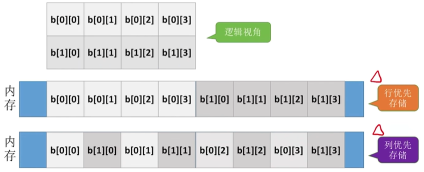
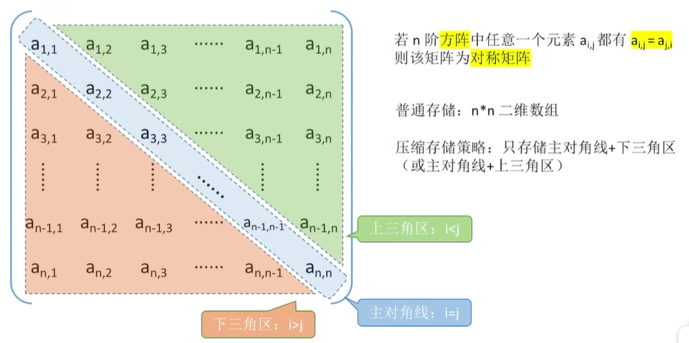
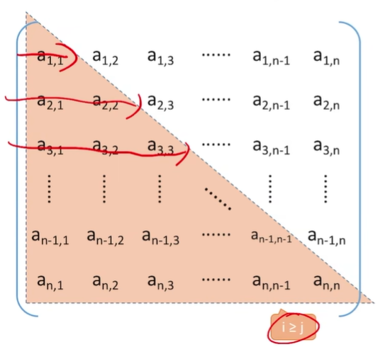
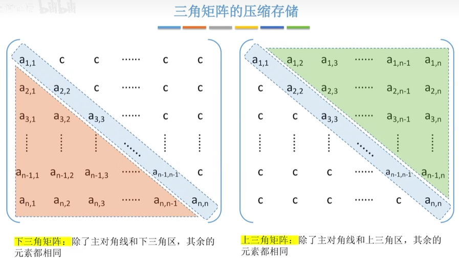
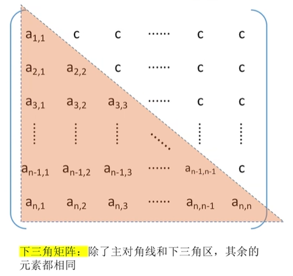
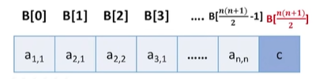
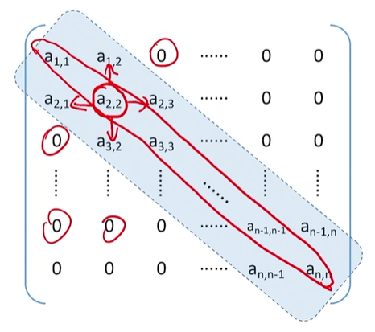
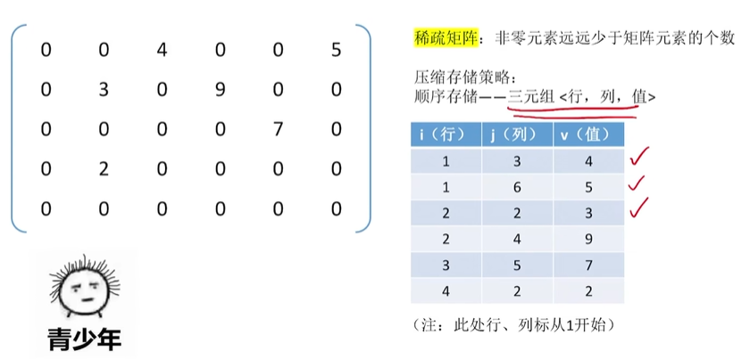
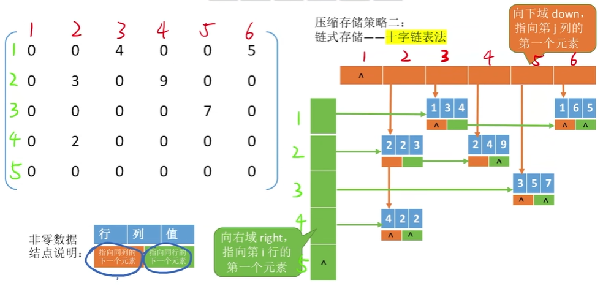

# 3-1特殊矩阵的压缩存储

[3.4_特殊矩阵的压缩存储_哔哩哔哩_bilibili](https://www.bilibili.com/video/BV1b7411N798/?p=32&spm_id_from=pageDriver&vd_source=9d3c5a863c7c6dbd5152dd7c4e9dc492)

[toc]

## 1.数组的存储结构

### 1.1一维数组

```c
ElemType A[n]; 
```

一维数组 A[0...n-1]，格数组元素大小相同，在物理上连续存放。其存储结构关系式为：
$$
LOC(a_i)=LOC+i*sizeof(ElemType)\ (0≤i≤n)
$$
其中，`LOC`是起始地址。数组下标默认从 0 开始。


### 1.2.二维数组

```c
ElemType b[2][4]; 		//2行4列的二维数组
```

二维数组在逻辑上是一个二维列表。在内存上，对于多维数组，有两种映射方法：**按行优先存储、按列优先存储**。



把非线性的二维数组拉成了一个**线性存储**的存储结构，那么它的好处就是可以实现像一维数组一样的**随机存储**，即只需要用LOC加上目标元素的位置。

#### 1.2.1行优先存储

设二维数组 b[M]\[N]，若按照行优先存储结构，先存储行号较小的元素，行号相等先存储列号较小的元素：
$$
b[i][j]=LOC+(i*N+j)*sizeof(ElemType)
$$
如果给出的是下标范围为 [0,n]，那么其实是有 n+1 个元素，即：
$$
b[i][j]=LOC+(i*(n+1)+j)*sizeof(ElemType)
$$


#### 1.2.2列优先存储

按列优先方式存储时，得出存储结构关系式为：
$$
b[i][j]=LOC+(j*M+i)*sizeof(ElemType)
$$


## 2.特殊矩阵

**压缩存储**：指为多个值相同的元素只分配一个存储空间，对零元素不分配存储空间。其目的是**节省存储空间**。

**特殊矩阵**：指具有许多相同矩阵元素或零元素，并且这些相同矩阵元素或零元素的分布有一定规律性的矩阵。常见的特殊矩阵有对称矩阵、上(下)三角矩阵、对角矩阵等。

**特殊矩阵的压缩存储方法**：找出特殊矩阵中值相同的矩阵元素的分布规律，把那些呈现规律性分布的、值相同的多个矩阵元素压缩存储到一个存储空间中。


### 2.1对称矩阵

**方阵**

若n阶方阵中任意一个元素 $a_{i,j}$ 都有 $a_{i,j}$ =  $a_{j,i}$ 则该矩阵为对称矩阵。



例如将下三角放入一维数组：



可以使用**行优先**的原则，把每行元素存入一维数组中。

1. 那么这个一维数组它的大小就是 1+2+3+...+n 为$\cfrac{(1+n)*n}2$。

那么在一维数组中，就有：0 ~ $\cfrac{(1+n)*n}2-1$个数。

2. 对称矩阵压缩之后，可以实现一个“映射”函数，矩阵下标->一维数组下标。

例如按**行优先**，通过上面的一维数组存储结构：

$a_{i,j}$ (**i≥j**) = A[k]，$a_{i,j}$ 是第 [1+2+...+(i-1)] + j 个元素（前面几行的元素+j所在那一行前面的几个），那么：
$$
k=\frac{(i-1)*i}2+j\\
数组下标是从0开始，那么\\
k=\frac{(i-1)*i}2+j-1
$$
如果是上三角矩阵，但是由于对阵矩阵 $a_{i,j}$ =  $a_{j,i}$ 的性质，所有可以转换成下三角矩阵。那么总映射为：
$$
k=\begin{cases}
\cfrac{(i-1)*i}2+j-1,\ i≥j,\text{下三角区和对角线元素}\\[3ex]
\cfrac{(j-1)*j}2+i-1,\ i<j,上三角区,但是a_{i,j}=  a_{j,i}\\
\end{cases}
$$


### 2.2三角矩阵



分为上三角矩阵、下三角矩阵。

#### 2.2.1下三角矩阵



和对称矩阵同样，那么在一维数组中，就有：0 ~ $\cfrac{(1+n)*n}2-1$个数，但是多在后面 $\cfrac{(1+n)*n}2$的位置存储C。



$a_{i,j}$ (**i≥j**) → B[k]
$$
k=\begin{cases}
\cfrac{(i-1)*i}2+j-1,&\ i≥j,下三角区和对角线元素\\[3ex]
\cfrac{(n+1)*n}2,&\ i<j,上三角区\\
\end{cases}
$$

#### 2.2.2上三角矩阵

$a_{i,j}$ (**i≤j**) → B[k]
$$
k=\begin{cases}
\cfrac{(i-1)*(2n-i+2)}2+j-i,&\ i≤j,上三角区和对角线元素\\[3ex]
\cfrac{(n+1)*n}2,&\ i＞j,下三角区\\
\end{cases}
$$


>例1、若将 n 阶上三角矩阵 A **按列优先**级压缩存放在一维数组 B[1...n(n+1)/2+1] 中， 则存放到B[k] 中的非零元素 $a_{i,j}$ (1 ≤ i, j ≤ n) 的下标 i, j 与 k 的对应关系是(    C   )。
>	A. i ( i + 1 ) / 2 + j
>	B. i ( i - 1 ) / 2 + j - 1
>	C. j ( j - 1 ) / 2 + i
>	D. j ( j - 1 ) / 2 + i - 1
>
>解：按列优先存储，故元素 $a_{i,j}$ 前面有 j - 1 列，
>
>共有 1 + 2 + 3 + ... +j -1 = j ( j - 1 ) / 2 个元素，元素  $a_{i,j}$  在第 j 列上是第 i 个元素，
>
>数组 B 的**下标是从 1 开始**，因此 k = j ( j - 1 ) / 2 + i。

>例2、若将 n 阶下三角矩阵 A 按列优先顺序压缩存放在一维数组 B[1...n(n+1)/2+1] 中，则存放到 B[k] 中的非零元素 $a_{i,j}$ (1 ≤ i, j ≤ n) 的下标 i, j 与 k 的对应关系是(     B     )。
>	A. (j - 1) (2n - j + 1) / 2 + i - j 
>	B. (j - 1) (2n - j + 2) / 2 + i - j + 1
>	C. (j - 1) (2n - j + 2) / 2 + i - j
>	D. (j - 1) (2n - j + 1) / 2 + i - j + 1
>
>解：按列优先存储，故元素 $a_{i,j}$ 之前有 j - 1 列，
>
>共有 n + (n - 1) + ... + (n - j + 2) = (j-1)(2n - j + 2) / 2 个元素，
>
>元素 $a_{i,j}$ 是第 j 列上第 i - j + 1 个元素，
>
>数组 B **下标从 1 开始**，k = (j - 1) (2n - j + 2) / 2 + i - j + 1。

>例3、【2018统考真题】设有一个 12*12 对称矩阵 M 的**上三角**部分的元素 $m_{i,j}$ (1 ≤ i ≤ j ≤ 10) 按**行优先**存入 C 语言的一维数组 N 中， 元素 $m_{6,6}$ 在 N 中的下标是(     A     )。
>	A. 50                            B. 51
>	C. 55                            D. 66
>
>解： 在 C 语言中，数组 N 的**下标从 0 开始**。
>
>第一个元素 $m_{1,1}$ 对应存入$n_0$，矩阵 M 的第一行有 12 元素，第二行有 11 个，第三行有 10 个，第四行有 9 个，第五行有 8 个，所以 $m_{6,6}$ 是第 12 + 11 + 10 + 9 + 8 + 1 = 51 个元素。
>
>下标应为 50。

>4、【2020统考真题】将一个10*10 对称矩阵 M 的**上三角**部分的元素 $m_{i,j}$ (1 ≤ i ≤ j ≤ 12) 按**列**优先存入 C 语言的一维数组 N 中， 元素 $m_{7,2}$ 在 N 中的下标是(     C     )。
>	A. 15                            B. 16
>	C. 22                            D. 23
>
>解： 因为是对称矩阵，要求元素 $m_{7,2}$ 在 N 中的下标，即求元素 $m_{2,7}$ 在 N 中的下标。
>
>在 C 语言中，数组 N 的下标从 0 开始。
>
>上三角矩阵按列优先存储，先存储只有 1 个元素的第一列， 再存储有 2 个元素的第二列，以此类推。在  $m_{2,7}$之前存有
>第 1 列: 1
>第 2 列: 2
>....
>第 6 列: 6
>第 7 列: 1
>
>前面共存储有 1 + 2 + 3 + 4 + 5 + 6 + 1 = 22 个元素 ( 数组下标范围为0 ~ 21 )，注意数组下标从 0 开始，故 $m_{2,7}$ 在数组N中的下标为 22，即 $m_{7,2}$ 在数组 N 中的下标为 22。


### 2.3三对角矩阵

三对角矩阵又称带状矩阵。



在三对角矩阵中，所有非零元素都集中在以主对角线为中心的 3 条对角线的区域，其他区域的元素都为零。
$$
\begin{bmatrix}
a_{1,1} & a_{1,2} \\
a_{2,1} & a_{2,2} & a_{2,3} &&&0\\
& a_{3,2} & a_{3,3} & a_{3,4} \\
		&	  &\ddots   &\ddots &\ddots\\
0&&& a_{n-1,n-2} & a_{n-1,n-1} & a_{n-1,n} \\
&&&& a_{n,n-1} & a_{n,n} \\
\end{bmatrix}
$$

采用压缩存储，将 3 条对角线上的元素，按**行优先**方式存放在一维数组 B 中，且 a_{1,1} 存放于 B[0]中，其存储形式如下所示：
$$
a_{1,1}|a_{1,2}|a_{2,1}|a_{2,2}|a_{2,3}|a_{3,1}...a_{n-1,n}|a_{n,n-1}|a_{n,n}
$$

1. 按照**行优先原则**， $a_{i,j}$ → B[k]。（1 ≤ i, j ≤ 100, |i - j| ≤ 1）

前 i-1 行共 3(i-1)-1 个元素。
$a_{i,j}$ 是 i 行第 j-i+2 个元素。

所以 $a_{i,j}$ 是第 2i+j-2 个元素，数组下标从 0 开始，所以：
$$
k=2i+j-3
$$

2. B[k] → $a_{i,j}$ 。已知 B[k] 是第 k+1 个元素，判断 i 和 j 的位置。

前 i-1 行共 3(i-1)-1 个元素。
前 i 行共有 3i-1 个元素。

所以（注意k+1 **≤** 3i-1）：
$$
3(i-1)-1 < k+1 ≤ 3i-1\\
那么在上式中\frac{k+2}3 ≤ i < \frac{k+5}3\\
 
i ≥ \frac{k+2}3\\
$$
通过向上取整即可满足“刚好”大于等于：
$$
i = \left\lceil
\frac{k+2}3
\right\rceil
$$
同理，也可以使得
$$
3(i-1)-1 ≤ k < 3i-1\\
i ≤ \frac{k+4}3\\
i ≤ \frac{k+1}3+1\\
$$
通过向下取整即可满足“刚好”小于等于：
$$
i=\left\lfloor 
\frac{k+1}3+1
\right\rfloor
$$
计算出 i 之后，通过前面计算的 k=2i+j-3 ，得：
$$
j=k-2i+3\\
$$

| 维数组 B下标  | 从 0 开始                    | 从 1 开始     |
| ------------ | ----------------------------- | --------------------- |
| i            | $\left \lfloor\frac{k+1}{3} +1\right \rfloor$ | $\left \lfloor\frac{k+1}{3} +1\right \rfloor$ |
| j            | k - 2i + 3                                    | k - 2i + 2                                    |
| k            | 2i + j - 3                                    | 2i + j - 2                                    |


[【考研】数据结构——特殊矩阵的压缩存储（含真题）-CSDN博客](https://blog.csdn.net/qq_34438969/article/details/126802860)

>例1、【2016统考真题】有一个 100 阶的三对角矩阵 M，其元素 $m_{i,j}$（1 ≤ i, j ≤ 100）按行优先依次压缩存入标从 0 开始的一维数组中 N。元素 $m_{30,30}$ 在 N 中的下标是（    B   ）
>
>A.  86                         B. 87                         C. 88                         D. 89
>解：三对角矩阵 A 如下所示：
>
>（在三对角矩阵中，所有非零元素都集中在以主对角线为中心的 3 条对角线的区域，其他区域的元素都为零。）
>$$
>\begin{bmatrix}
>a_{1,1} & a_{1,2} \\
>a_{2,1} & a_{2,2} & a_{2,3} &&&0\\
>   & a_{3,2} & a_{3,3} & a_{3,4} \\
>		&	  &\ddots   &\ddots &\ddots\\
>0&&& a_{n-1,n-2} & a_{n-1,n-1} & a_{n-1,n} \\
>&&&& a_{n,n-1} & a_{n,n} \\
>\end{bmatrix}
>$$
>
>采用压缩存储，将 3 条对角线上的元素，按**行优先**方式存放在一维数组 B 中，且 a_{1,1} 存放于 B[0]中，其存储形式如下所示：
>$$
>a_{1,1}|a_{1,2}|a_{2,1}|a_{2,2}|a_{2,3}|a_{3,1}...a_{n-1,n}|a_{n,n-1}|a_{n,n}
>$$
>可以计算矩阵 A 中 3 条对角线上的元素 $a_{i,j}$（1 ≤ i, j ≤ 100, |i - j| ≤ 1）在一维数组 B 中存放的下标为 **k = 2i + j - 3。（下标从 0 开始）**
>
>解法一：针对该题，仅需将数字逐一代入公式: k = 2 x 30 + 30 - 3 = 87，结果为87。
>
>解法二：观察上图的三对角矩阵不难发现，第一行有两个元素，剩下的在元素 $m_{30,30}$ 所在行之前的 28 行（注意下标 1 ≤ i，j ≤ 100）中，每行都有 3 个元素，而 $m_{30,30}$ 之前仅有一个元素 $m_{30,30}$ ， 不难发现元素 $m_{30,30}$ 在数组 N 中的下标是 2 + 28x3 + 2 - 1 = 87。
>
>（解法二中，减一是因为一维数组 B 的下标是从 0 开始。）
>
>【注意】
>
>解法一中的一维数组 B[k] 的下标是从 0 开始。若是从 1 开始，则公式应为 k = 2i + j - 2。
>
>反过来，求 i , j ，有表如下：(三对角矩阵 A 从 1 开始)
>
>| 维数组 B下标 | 从 0 开始                                     | 从 1 开始                                     |
>| ------------ | --------------------------------------------- | --------------------------------------------- |
>| i            | $\left \lfloor\frac{k+1}{3} +1\right \rfloor$ | $\left \lfloor\frac{k+1}{3} +1\right \rfloor$ |
>| j            | k - 2i + 3                                    | k - 2i + 2                                    |
>| k            | 2i + j - 3                                    | 2i + j - 2                                    |

> 例2、将三对角矩阵 A[1..100] 按行优先存入一维数组 B[1..298] 中，A 中元素 A[66]\[65] 在数组B 中的位置 k 为(      B     )
> 	A. 198                         		 B. 195 
> 	C.197                               	D.196 
>
> 解：一维数组 B[k] 的下标是从 1 开始。由公式 **k = 2i + j - 2**，得 k = 2*66 + 65 - 2 = 195。
>
> 【另】反过来推导：已知 k 为 195 , 求 i , j：
> $$
> i = \left\lfloor 
> \frac{195+1}{3}+1 
> \right\rfloor
> = \left\lfloor 65.3+1 \right\rfloor=66\\
> j=195-2*66 + 2 = 65
> $$


### 2.4稀疏矩阵

稀疏矩阵：矩阵中非零元素的个数 t，相对矩阵元素的个数 s 来说非常少，即 s >> t （s远大于t）的矩阵。



压缩存储策略

1. 顺序存储——**三元组**。非零元素及其相应的行和列构成个**三元组**（行标，列标，值），即三元组表的结点存储了行 row、列 col、值 value 三种信息，是主要用来存储稀疏矩阵的一种数据结构。

2. 链式存储——**十字链表**。将行单链表和列单链表结合起来存储稀疏矩阵。邻接矩阵空间复杂度达$O(n^2)$，不适合于存储稀疏矩阵。



3. 二叉链表又名左孩子右兄弟表示法，可用于表示树或森林。

> 例1、【2017统考真题】适用于压缩存储稀疏矩阵的两种存储结构是(     A     )。
> 	A. 三元组表和十字链表                 B. 三元组表和邻接矩阵
> 	C. 十字链表和二叉链表                 D. 邻接矩阵和十字链表
>
> 解：A正确。
>

