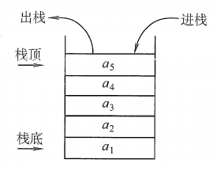
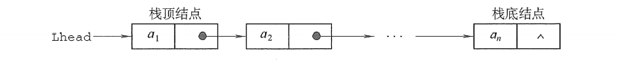
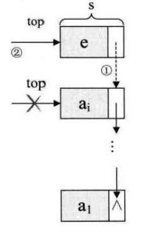
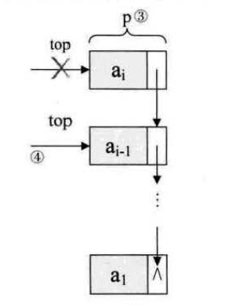
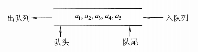
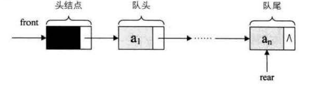
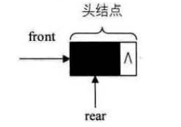
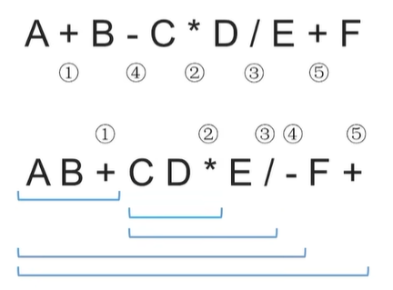
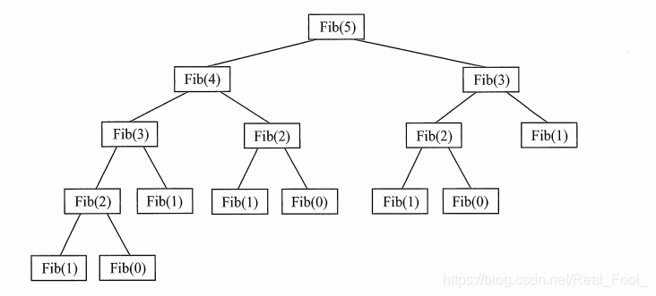
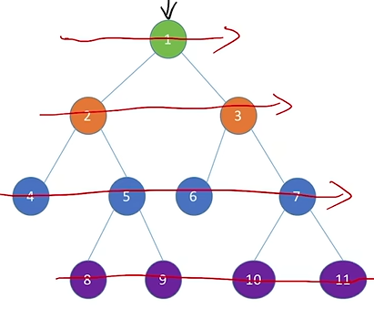

# 栈和队列


[toc]

# 一、栈Stack

## 逻辑结构

栈（Stack）是只允许在**一端**进行插入或删除操作的线性表，即是限制存取点的线性结构。



**特点**：**后进先出（last in first out, LIFO）**

**==逻辑结构==**：与普通线性表**相同**。==栈&队列的逻辑结构相同==。

数据的运算：插入、删除操作有区别。

### 术语

1. **栈顶top**（现在能放入的一段）；
2. **栈底bottom**（最早放入的元素的一段）；
3. **空栈**。


## 物理（存储）结构 

1. 顺序栈（顺序存储）
   - 单项栈
   - 共享栈
2. 链栈（链式存储）

## 基本操作

InitStack(&S)：**初始化栈**。构造一个空栈S，分配内存空间。

DestroyStack(&L)：**销毁栈**。销毁并释放栈 S 所占用的内存空间。

Push(&S,x)：**插入，进栈**。若栈S未满，则将x加入使之成为新**栈顶**。

Pop(&S,&x)：**删除，出栈**。若栈S非空，则弹出**栈顶**元素，并用x返回。

GetTop(S,&x)：**读取**栈顶元素。若栈S非空，则用x返回线顶元素。

其他常用操作：

StackEmpty(S)：**判**断一个栈S是否为**空**。若S为空，则返回true，否则返回false。


## ==【常考题型】==出栈顺序

进栈顺序：a->b->c->d->e

有哪些合法的出栈顺序？

全部进入后出栈：e->d->c->b->a（倒序）

进出栈穿插进行：

a->b->c->d->e（进一个出一个）

**卡特兰（Catalan）数**：n个不同元素进栈，出栈元素不同排列的个数为
$$
\frac 1{n+1}C_{2n}^n
$$
。上述公式称为卡特兰（Catalan）数，可采用数学归纳法证明（不要求掌握）。

所以，abcde 5个元素，有
$$
\frac 1{5+1}C_{10}^5=\frac1{6}*\frac{10*9*8*7*6}{5*4*3*2*1}=42
$$
种出栈可能。

## 1.顺序栈

用**顺序存储**实现的栈

顺序栈的缺点：栈的大小不可变。

```c
#define MaxSize 10			//定义栈中元素的最大个数
typedef struct{
    ElemType data[MaxSize];	//静态数组存放栈中元素
    int top;				//栈顶指针
} SqStack;				//Sq即sequence：顺序的意思
```

有的顺序栈结构还有栈的大小`stackSize`：

```c
typedef struct{
	ElemType* base;	//栈底指针:base指针不动、top往上移
	ElemType* top;	//栈顶指针
	int stackSize;	//当前已分配的存储空间大小,即顺序栈的大小
} SqStack;			//顺序栈的结构体定义
```

顺序存储：给各个数据元素分配连续的存储空间，大小为 MaxSize * sizeof(ElemType)。

### 1.1初始化

InitStack(&S)：**初始化栈**。构造一个空栈S，分配内存空间。

```c
#define MaxSize 10			//定义栈中元素的最大个数
typedef struct {
    ElemType data[MaxSize];	//静态数组存放栈中元素
    int top;				//栈顶指针
} SqStack;

//初始化
void InitStack(SqStack &S) {
	S.top = -1;				//初始化栈顶指针
}

void main() {
    SqStack S; 				//声明一个顺序栈(分配空间)
    InitStack(S);
    //后续操作...
}
```

#### ❗初始化有两种方式

栈顶指针`top`指向栈顶元素，一般存储的是数组的下标。（一般初始化时top = -1）

1. **初始化时`top=-1`，当前指向一个空的位置（元素从0开始）**。放入元素之后，就**指向那个元素**，所以每次入栈先+1。top当前指向的位置就是栈顶。

   如果有abcde，5个元素，那么满栈top=4。

   - 入栈：S.data[++S.top]=x;
   - 出栈：x=S.data[S.top--];
   - 获得栈顶元素：x=S.data[S.top];
   - 满栈：stack->top == MaxSize-1

2. **初始化时`top=0`**。top当前指向的位置是栈顶上面的一个**没有元素的空位置**。放入元素之后，**指向的是下一个空位置**。

   - 入栈：S.data[S.top++]=x;
   - 出栈：x=S.data[--S.top];
   - 获得栈顶元素：x=S.data[S.top-1];

### 1.2判空

StackEmpty(S)：**判**断一个栈S是否为**空**。若S为空，则返回true，否则返回false。

时间复杂度：O(1)

```c
//判断栈空
bool StackEmpty(SqStack S) {
    if(S.top == -1)	//栈空
        return true;
    else			//不空
        return false;
}
```

### 1.3进栈 push

Push(&S,x)：**插入，进栈**。若栈S未满，则将x加入使之成为新**栈顶**。

时间复杂度：O(1)

```c
//新元素入栈
bool Push(SqStack &S, ElemType x) {
    if (S.top == MaxSize-1)	//栈满，报错
        return false;
    
    S.top = S.top+1;		//指针先加1
    S.data[S.top] = x;		//新元素入栈
    
    return true;
}
```

上述代码中，指针+1，然后新元素入栈的两段代码可以等价于：

```c
S.data[++S.top] = x;
```

注意是`++S.top`先加再用，而不是`S.top++`先用再加。

### 1.4出栈 pop

Pop(&S,&x)：**删除，出栈**。若栈S非空，则弹出**栈顶**元素，并用x返回。

时间复杂度：O(1)

```c
//出栈操作
bool Pop(SqStack &S, ElemType &x) {
    if(S.top == -1)		//栈空，报错
        return false;
    
    x = S.data[S.top];	//栈顶元素先出栈
    S.top = S.top-1;	//指针再减1
    
    return true;
}
```

注意：这里`top-1`，数据其实还残留在内存中，只是逻辑上被删除了。

上述代码中也可以等价于：

```c
x = S.data[S.top--];
```

注意是`S.top--`先用再减，而不是`--S.top`先减再用。

### 1.5读取栈顶

GetTop(S,&x)：**读取**栈顶元素。若栈S非空，则用x返回线顶元素。

时间复杂度：O(1)

```c
//读栈顶元素
bool GetTop(SqStack S, ElemType &x) {
	if(S.top == -1)		//栈空，报错
        return false;
    x = S.data[S.top];	//×记录栈顶元素
    return true;
}
```

读取栈顶元素和出栈操作十分相似，唯一不同是不需要出栈之后top指针-1。

### 1.6销毁栈

顺序栈是在声明栈时直接分配内存，并没有使用`malloc`函数，所以不需要手动`free`，函数运行结束后系统自动回收空间。

但是如果使用了动态分配那么就需要手动释放空间：

```c++
//销毁栈、释放栈的内存
void DestroyStack(SqStack& stack){
	if(stack.base) {			//若栈底指针分配有地址,则释放
		delete stack.base;	//释放栈底指针的地址
		stack.top = -1;			//令栈顶位置为0
		stack.base = NULL;	//将栈底指针指向空
		cout << "栈已释放内存！" << endl; 
	}
}
```


### ❗1.7顺序栈c++实例

C++是一门面向对象的高级语言，在我们编写代码中，常常离不开对对象的创建和清理对象资源。而兼容过来的`malloc`和`free`并不能很好的满足我们的需求，从而C++将`malloc`和`free`封装起来并起了新的名字`new`和`delete`，这两个关键字的作用不仅比`malloc`和`free`的功能强大，用起来也非常的方便。

new和delete都是**运算符**，不是库函数，不需要单独添加头文件。

格式：

**new**

- 类型指针 指针变量名 = new 类型
- 类型指针 指针变量名 = new 类型(初始值)
- 类型指针 指针变量名 = new 类型[元素个数]

**delete**

- delete 指针变量名
- delete[] 指针变量名


```c++
#include<iostream>
#include<Windows.h>
using namespace std;

#define MaxSize 10				//栈最大可以存放的元素个数
typedef int ElemType;		//顺序栈存储的数据类型、用int代替ElemType

//创建顺序栈cpp

typedef struct
{
	ElemType* base;  //栈底指针
	int top;		 //栈顶的位置 如 0、1、2、3、4....MaxSize
} SqStack;			 //顺序栈的结构体定义


bool InitStack(SqStack& stack);	//初始化栈
bool StackEmpty(SqStack stack);//判断是否为空
bool StackFull(SqStack stack);	//判断是否已满
int GetStackSize(SqStack& stack);//获取顺序栈中元素个数

bool Push(SqStack& stack, ElemType value);//入栈
bool Pop(SqStack& stack, ElemType& value);//出栈
bool GetTop(SqStack& stack, ElemType& value);//获取栈顶的元素
void DestroyStack(SqStack& stack);//销毁栈、释放栈的内存


//--------------------------------------------------
void CreatStack(SqStack &stack){
    int number, value = 0;
    cout << "请输入需要插入的元素个数:";
	cin >> number;
	while (number > 0){
		cin >> value;
		Push(stack, value);	//放入栈
		number--;
        value++;
	}
}

int main()
{
	SqStack	stack;		//创建顺序栈
	InitStack(stack);	//初始化顺序栈
//例如插入
//这里在测试时候，使用了两种方法
    
	int value = 5;      //插入5个元素
    while (value > 0){
	Push(stack, value);	//放入栈
	value--;
	}
	//CreatStack(stack);

	
	//获取栈顶的元素
	GetTop(stack, value);
	cout << "当前栈顶的元素是：" << value << endl;

	//获取栈的元素个数
	cout << "当前栈的元素个数是：" << GetStackSize(stack) << endl;

	//出栈
	cout << "出栈顺序：" << endl;
	while (!StackEmpty(stack)){
		Pop(stack, value);
		cout << value << " "; 
	}
	cout << endl;
    
	//释放栈的内存
	DestroyStack(stack);
	//system("pause");
	return 0;
}


//-----------------------------------------------------------------------
//初始化顺序栈
bool InitStack(SqStack& stack){

	//注意:这里使用new进行空间分配,所以在后面摧毁栈的时候需要delete释放空间

	//动态分配一个ElemType类型MaxSize长度的空间，将地址给顺序栈Stack的栈底指针
	stack.base = new ElemType[MaxSize];
	//判断顺序栈的栈底指针(stack.base)是否为空，若无地址，则分配失败
	if(!stack.base){
		return false; 
	}
	stack.top = -1;		//初始化栈顶指针的位置为-1
	return true;
}

//判断栈空
bool StackEmpty(SqStack stack){
	if (stack.top == -1)
		return true;
	else
		return false; 
}

//判断栈满
bool StackFull(SqStack stack){
	if (stack.top == MaxSize-1)   //top的位置值等于MaxSize-1时栈满,因为是从0开始的
		return true; 
	else
		return false; 
}

//顺序栈中元素个数
int GetStackSize(SqStack& stack){
	return stack.top+1;  //栈顶位置即top的数值，就是栈中元素的个数
}

/**
 * @brief 顺序栈入栈:
 * 开辟一个新的空间,栈顶+1,然后将数据存入stack.base[stack.top]所在的位置.
 * 
 * @param stack 
 * @param value 
 * @return true 
 * @return false 
 */
bool Push(SqStack& stack, ElemType value){
	if (StackFull(stack)){
		cout<<"栈满"<<endl;
		return false;  
	}
	//若栈未满，执行入栈操作
	stack.top++;		//栈顶自增1
	stack.base[stack.top] = value;    //以栈顶位置作为下标存储数据
	return true;
}

/**
 * @brief 顺序栈出栈:
 * 读取栈顶stack.base[stack.top]的元素,然后使栈顶-1.
 * 
 * @param stack 
 * @param value 
 * @return true 
 * @return false 
 */
bool Pop(SqStack& stack, ElemType &value){
	if (StackEmpty(stack)){
		cout<<"栈为空"<<endl;
		return false;
	}
	value = stack.base[stack.top];	//以栈顶位置作为下标的值赋值给value返回
	stack.top--;	//栈顶自减1
	return true;
}

//读取栈顶元素
bool GetTop(SqStack& stack, ElemType &value){
	if (StackEmpty(stack)){
		cout<<"栈为空"<<endl;
		return false; 
	}
	value = stack.base[stack.top];
	return true; 
}

//销毁栈、释放栈的内存
void DestroyStack(SqStack& stack){
	if(stack.base) {			//若栈底指针分配有地址,则释放
		delete stack.base;	//释放栈底指针的地址
		stack.top = -1;			//令栈顶位置为0
		stack.base = NULL;	//将栈底指针指向空
		cout<<"栈已释放内存！"<<endl; 
	}
}
```

>当前栈顶的元素是：1 
>当前栈的元素个数是：5
>出栈顺序：
>1 2 3 4 5 
>栈已释放内存！ 


## 2.共享栈

因为顺序栈的缺点是栈的大小不可变，所以引出共享栈，两个栈共享一片空间。这片存储空间不单独属于任何一个栈，某个栈需要的多一点，它就可能得到更多的存储空间。两个栈的栈底在这片存储空间的两端，当元素入栈时，两个栈的栈顶指针相向而行。

所以，共享栈节省了空间，解决了**上溢（存储满）**的问题。


两个栈的栈顶指针都指向栈顶元素，`top0=-1`时0号栈为空，`top1=MaxSize`时1号栈为空；仅当两个栈顶指针相邻（`top0+1=top1`）时，判断为栈满。当0号栈进栈时top0先加1再赋值，1号栈进栈时top1先减一再赋值出栈时则刚好相反。


### 2.1初始化

```c
#define MaxSize 10			//定义栈中元素的最大个数
typedef struct {
    ElemType data [MaxSize];//静态数组存放栈中元素
    int top0;				//0号栈线顶指针
    int top1;				//1号栈线顶指针
} ShStack;


//初始化栈
void InitStack(ShStack &S) {
    S.top0 = -1;				//初始化栈顶指针
    S.top1 = MaxSize;
}
```

### 2.2判满

top0从-1开始，top1从MAX开始。那么放入元素后，top0逐渐增大，top1减小。当他们下一个指针的位置在一起时，说明这个栈已经放满元素。

```c
top0+1 == top1
```


## 3.链栈

链栈是运算受限的单链表，只能在链表头部进行操作的单链表。



1. 链表的**头指针就是栈顶**，链头为栈顶，**链尾为栈底**。
2. **栈的链式存储不需要附设头节点**。
3. 基本**不存在栈满的情况**，不需要判断栈满，但要判空。
4. 空栈相当于头指针指向空。
5. **插入（入栈）和删除（出栈）仅在栈顶处执行**。
6. 因为是动态分配空间，所以需要释放。

```c
#define MaxSize 100     //链栈的最大长度
typedef int SElemType;  //链栈的数据元素类型假设为int整型

//创建链栈结构
typedef struct StackNode 
{
	SElemType data;   				//结点数据域
	struct StackNode* next;			//结点指针域
}StackNode, *LinkStack;				//struct StackNode的结点形式、链栈形式别名

LinkStack stack;   //创建栈顶指针指向链栈的头结点
```

- **StackNode，*LinkStack的区别：**

```
LinkStack temp1 = new StackNode;
```

这里 LinkStack 是一个指针类型别名，实际上是 StackNode* 的别名。
所以 temp1 是一个指针变量，指向 StackNode 类型的结点。

```
StackNode* temp2 = new StackNode;
```

这里直接声明了一个 StackNode* 类型的指针变量 temp2，指向 StackNode 类型的结点。

这两种声明方式是等价的。两者都创建了一个动态分配的 StackNode 类型的结点，并将它的地址赋给相应的指针变量。两者都可以通过 temp1->data 或 temp2->data 来访问结点的数据成员，以及 temp1->next 或 temp2->next 来访问结点的下一个结点的指针成员。

因此，在功能上，temp1 和 temp2 没有区别。不同的只是它们的声明方式，temp1 是通过别名 LinkStack 来声明的指针变量，而 temp2 是直接以 StackNode* 类型来声明的指针变量。

### 3.1初始化

```c++
//链栈的初始化
bool InitStack(LinkStack& stack){
	//构造一个空栈、栈顶指针置为空
	stack = NULL;
	return true; 
}
```

### 3.2判空

```c++
//判断链栈是否为空
bool StackEmpty(LinkStack& stack){
	if (stack == NULL){
		return true;
	}
	return false;
}
```

### 3.3获取栈长度

```c++
/**
 * @brief 获取栈顶长度。
 * 因为链表的最后一个节点的next指针是nullptr（或者说是NULL），代表链表的终止，
 * 所以可以将链表的遍历条件设置为当前节点指针不等于nullptr，这样在遍历过程中，
 * 当指针指向最后一个节点时，其next指针就会指向nullptr，循环条件就不再成立，
 * 遍历结束，可以避免继续遍历下一个不合法的节点。
 * @param stack 
 * @return int 
 */
int StackLength(LinkStack& stack){
	int length = 0;
	StackNode* temp = stack;//创建临时指针temp与stack指向同一位置
	while (temp != nullptr){
		length++;  						//链栈长度即为栈中元素个数，循环一次，长度++
		temp = temp->next; 		//temp指针下移一位
	}
	return length; 					//返回链栈长度
}
```

### 3.4入栈

链栈的入栈相当于单链表的前插法。



```c++
//入栈（前插法）
bool PushStack(LinkStack& stack, SElemType value){   //不用判栈满
	StackNode* temp = new StackNode; 	//生成新结点temp
	temp->data = value; 	//将新节点数据域置为value
    
	temp->next = stack; 	//将新结点插入栈顶
	stack = temp; 			//更新栈顶指针
	return true;
}
```

### 3.5出栈



```c++
//出栈：首先判空
bool PopStack(LinkStack& stack, SElemType &value){
	if (StackEmpty(stack)){
		return false; 
	}
	value = stack->data;  		//将栈顶数据域元素赋值给value
	StackNode* temp = stack;	//创建一个temp指针，并将其指向 stack 指针所指向的内存地址，以便找到出栈位置并释放。
	stack = stack->next; 		//令栈顶指针指向下一位结点，即更新栈顶指针
	delete temp;   				//释放temp所指向的空间，即出栈元素所占的内存空间，temp本身会在函数结束后自动销毁。
	return true;
}
```

### 3.6销毁链栈

```c++
//销毁链栈，释放内存
void DestroyStack(LinkStack& stack){
	StackNode* temp = new StackNode;	//创建一个指针
	while (stack != nullptr){
		temp = stack;				//使该临时指针与stack指向同一位置
		stack = temp->next;	//更新栈顶指针
		delete temp;				//释放临时指针
	}
	stack = nullptr;
}
```

### 3.7读取栈顶

```c++
//读取栈顶：取栈顶元素
bool GetTop(LinkStack& stack, SElemType &value){
	if (!StackEmpty(stack)){  	//若栈不为空
		value = stack->data;  		//返回栈顶元素
		return true;
	}
	cout<<"栈为空"<<endl;
	return false; 
}
```

### 3.8遍历输出

```c++
//遍历输出栈元素
bool StackPrint(LinkStack& stack){
	if (stack != nullptr){
		StackNode* temp = stack;	//创建一个指针与stack指向同一位置
		cout<<"出栈顺序：";
		while (temp != nullptr){
			cout << temp->data <<" ";
			temp = temp->next;  		//temp向下移动一位
		}
		return true;
	}
	cout<<"栈为空！"<<endl;
	return false;
}
```


### ❗3.9链栈c++实例

```c++
#include<iostream>
using namespace std;

typedef int SElemType;  //链栈的数据元素类型假设为int整型

//创建链栈结构
// c++

typedef struct StackNode 
{
	SElemType data;   				//结点数据域
	struct StackNode* next;			//结点指针域
}StackNode, *LinkStack;				//struct StackNode的结点形式、链栈形式别名

bool InitStack(LinkStack& stack);					//初始化链栈
bool StackEmpty(LinkStack& stack);					//链栈判空
int StackLength(LinkStack& stack);					//计算链栈长度元素个数
bool PushStack(LinkStack& stack, SElemType value);	//入栈
bool PopStack(LinkStack& stack, SElemType& value);	//出栈
bool GetTop(LinkStack& stack, SElemType& value);	//获取栈顶元素
bool StackPrint(LinkStack& stack);					//遍历元素
void DestroyStack(LinkStack& stack);				//销毁链栈，释放内存


int main()
{
	//创建链栈
	LinkStack stack;
	SElemType value=1;

	InitStack(stack);
	cout << "检查栈是否为空？" << (StackEmpty(stack) ? "\t是" : "\t否") << endl;

	int number = 0;	//插入元素个数

	cout << "请输入需要插入的元素个数：";
	cin >> number;
	while ((number--) > 0) {
		PushStack(stack, value);//插入所输入元素
        value++;
	}

	cout << "当前栈的元素个数：" << StackLength(stack) << endl;

	GetTop(stack, value);
	cout << "栈顶元素：" << value << endl;
	StackPrint(stack);//遍历打印栈顶元素

	cout << endl;
	PopStack(stack, value);
	cout << "出栈一次,栈顶元素为：" << value << endl;
	StackPrint(stack);

	DestroyStack(stack);
	cout << endl << "栈已被销毁释放" << endl;
	cout << "销毁栈后遍历栈结果：" << " ";
	StackPrint(stack);

	// system("pause");
	return 0;
}


//链栈的初始化
bool InitStack(LinkStack& stack){
	//构造一个空栈、栈顶指针置为空
	stack = NULL;
	return true; 
}

//判断链栈是否为空
bool StackEmpty(LinkStack& stack){
	if (stack == NULL){
		return true;
	}
	return false;
}


/**
 * @brief 获取栈顶长度。
 * 因为链表的最后一个节点的next指针是nullptr（或者说是NULL），代表链表的终止，
 * 所以可以将链表的遍历条件设置为当前节点指针不等于nullptr，这样在遍历过程中，
 * 当指针指向最后一个节点时，其next指针就会指向nullptr，循环条件就不再成立，
 * 遍历结束，可以避免继续遍历下一个不合法的节点。
 * @param stack 
 * @return int 
 */
int StackLength(LinkStack& stack){
	int length = 0;
	StackNode* temp = stack;//创建临时指针temp与stack指向同一位置
	while (temp != nullptr){
		length++;  						//链栈长度即为栈中元素个数，循环一次，长度++
		temp = temp->next; 		//temp指针下移一位
	}
	return length; 					//返回链栈长度
}

//入栈（前插法）
bool PushStack(LinkStack& stack, SElemType value){   //不用判栈满
	StackNode* temp = new StackNode; 		//生成新结点temp
	temp->data = value; 		//将新节点数据域置为value
	temp->next = stack; 		//将新结点插入栈顶
	stack = temp; 					//更新栈顶指针
	return true;
}

//出栈：首先判空
bool PopStack(LinkStack& stack, SElemType &value){
	if (StackEmpty(stack)){
		return false; 
	}
	value = stack->data;  		//将栈顶数据域元素赋值给value
	StackNode* temp = stack;	//创建一个temp指针，并将其指向 stack 指针所指向的内存地址，以便找到出栈位置并释放。
	stack = stack->next; 			//令栈顶指针指向下一位结点，即更新栈顶指针
	delete temp;   						//释放temp所指向的空间，即出栈元素所占的内存空间，temp本身会在函数结束后自动销毁。
	return true;
}

//取栈顶元素
bool GetTop(LinkStack& stack, SElemType &value){
	if (!StackEmpty(stack)){  	//若栈不为空
		value = stack->data;  		//返回栈顶元素
		return true;
	}
	cout<<"栈为空"<<endl;
	return false; 
}


//遍历输出栈元素
bool StackPrint(LinkStack& stack){
	if (stack != nullptr){
		StackNode* temp = stack;	//创建一个指针与stack指向同一位置
		cout<<"出栈顺序：";
		while (temp != nullptr){
			cout << temp->data <<" ";
			temp = temp->next;  		//temp向下移动一位
		}
		return true;
	}
	cout<<"栈为空！"<<endl;
	return false;
}


//销毁链栈，释放内存
void DestroyStack(LinkStack& stack){
	StackNode* temp = new StackNode;	//创建一个指针
	while (stack != nullptr){
		temp = stack;				//使该临时指针与stack指向同一位置
		stack = temp->next;	//更新栈顶指针
		delete temp;				//释放临时指针
	}
	stack = nullptr;
}
```

>检查栈是否为空？        是
>请输入需要插入的元素个数：5
>当前栈的元素个数：5
>栈顶元素：5
>出栈顺序：5 4 3 2 1 
>出栈一次,栈顶元素为：5       
>出栈顺序：4 3 2 1 
>栈已被销毁释放
>销毁栈后遍历栈结果： 栈为空！


# 二、队列Queue

## 逻辑结构

队列（Queue）是只允许在**一端**进行插入，**另一端**进行删除操作的线性表。



**特点**：**先进先出（First in First out, FIFO）**

### 术语

1. **队头front**（可以出队（删除）的一段）；
2. **队尾rear**（放入（入队）的元素的一段）；
3. **空队列**。

## 物理（存储）结构 

1. 顺序队列（顺序存储）
2. 链队列（链式存储）

## 基本操作

InitQueue(&Q)：**初始化**队列，构造一个空队列Q。

DestroyQueue(&Q)：**销毁**队列。销毁并释放队列Q所占用的内存空间。

EnQueue(&Q,x)：**入队**。若队列Q未满，将x加入，使之成为新的队尾。

DeQueue(&Q,&x)：**出队**。若队列Q非空，删除队头元素，并用x返回。

GetHead(Q,&x)：**读队头元素**。若队列Q非空，则将队头元素赋值给x。

## ==【考点】==

1. 判空：`Q.rear == Q.front`.
2. 判满：`(Q.rear + 1)%MaxSize == Q.front.`. 队尾+1
3. 入队：`Q.rear = (Q.rear+1)%MaxSize.`.
4. 出队：`Q.front = (Q.front+1)%MaxSize`.
5. 长度：`(Q.rear + MaxSize - Q.front)%MaxSize`.


## 1.顺序队列（循环队列）

用**顺序存储**，连续空间实现队列

循环队列的特点：

1. **顺序存储**：循环队列使用数组作为底层数据结构，元素按顺序存储在数组中。这样可以简化队列的实现，并且通过使用循环来优化队列的操作。
2. **固定容量**：循环队列拥有固定的容量，即队列最多可以存储的元素数量是预先确定的。在使用数组作为底层数据结构时，需要初始化队列的最大容量。
3. **头尾相连**：循环队列将队列的头部和尾部连接起来形成一个环状结构，当队列的尾部指针达到数组的最末尾时，它将会绕回到数组的开头。这样可以充分利用数组的存储空间，避免浪费空间。
4. 队空和队满判断：循环队列通过队头指针和队尾指针的位置关系来判断队列的状态。当队头指针和队尾指针相等时，表示队列为空；当队尾指针的下一个位置是队头指针时，表示队列已满。

5. 入队和出队的复杂度：在循环队列中，入队和出队操作的时间复杂度都是O(1)，即常数时间复杂度。这是因为循环队列通过使用固定容量和记录队列元素个数的方式，避免了移动元素的成本。

```c
#define MaxSize 10			//定义队列中元素的最大个数
typedef struct{
    ElemType data[MaxSize];	//用静态数组存放队列元素
    int front,rear;			//front队头指针和rear队尾指针
} SqQueue;			//Sq即sequence：顺序的意思
```

### 1.1初始化

InitQueue(&Q)：**初始化**队列，构造一个空队列Q。

```c
//初始化队列
void InitQueue(SqQueue &Q){
    //初始时 队头、队尾指针指向0
    Q.rear=Q.front=0;
}
```

### 1.2判空&判满

#### 1.2.1判空

```c
//判断队列是否为空
bool QueueEmpty(SqQueue Q){
    if(Q.rear==Q.front)		//队空条件：队头指针==队尾指针
        return true;
    else 
        return false;
}
```

#### 1.2.2判满

**尾部rear+1**

##### 方案一

从队头结点开始插入，一直插入到MaxSize放满。但其实现在并不一定是满队列，因为队头还可以出队元素，这时候rear还在MaxSize，但是front不在data[0]。

队列己满的条件：队尾指针的再**下一个位置**是队。这里就必须空出一个元素的位置，不能让Q.rear==Q.front，因为这样，就和判空的条件一样了。


```c
//判断队列是否满
bool QueueFull(SqQueue Q){
    
    if( (Q.rear+1)%MaxSize==Q.front )	//队列将满
        
        return true;
    else
        return false;
}
```

##### 方案二

如果说**不能浪费判满的那一个存储空间**，就在定义的时候创建一个`size`表示队列的长度。

```c
#define MaxSize 10
typedef struct{
    ElemType data[MaxSize];
    int front,rear;
    int size;
} SqQueue;	
```

这样，初始化的时候，设置`size=0`。插入成功`size++;`删除成功`size--;`。

队满的条件就变成了`size==MaxSize`。

对空的条件：`size==0`。

##### 方案三

定义一个`tag`，用来存储最近进行了删除和插入的操作，每次删除操作成功时，都令`tag=0;`每次插入操作成功时，都令`tag=1;`。

```c
#define MaxSize 10
typedef struct{
    ElemType data[MaxSize];
    int front,rear;
    int tag;
} SqQueue;	
```

队满的条件就变成了`front==raer && tag==1`。

对空的条件：`front==raer && tag==0`。


### 1.3入队

EnQueue(&Q,x)：**入队**。若队列Q未满，将x加入，使之成为新的**队尾**。

修改**队尾 rear**。

```c
//入队
bool EnQueue(SqQueue &Q, ElemType x){
    if（队列已满）
        return false;		//队满则报错
    Q.data[Q.rear]=x;		//将×插入队尾
    
    Q.rear=(Q.rear+1)%MaxSize;		//队尾指针后移，但不能一直+1会溢出，所以这里需要模运算，取(Q.rear+1)%MaxSize的余数
    
    return true;
}
```

#### ❗循环队列

如果rear队尾一直+1，那么就会溢出，通过模运算，将无限的整数域映射到有限的整数集合 {0, 1, 2,..., MaxSize} 上，将存储空间在逻辑上变成**环状**。

如此实现的队列，称为**循环队列**。


### 1.4出队

DeQueue(&Q,&x)：**出队**。若队列Q非空，删除队头元素，并用x返回。

修改**队头 front**。

```c
//出队（删除一个队头元素，并用x返回)
bool DeQueue(SqQueue &Q, ElemType &x){ 
    if(Q.rear==Q.front)
        return false;	//队空则报错
    x=Q.data[Q.front];
    
    Q.front=(Q.front+1)%MaxSize;
    
    return true;
}
```

### 1.5获取队头元素

GetHead(Q,&x)：**读队头元素**。若队列Q非空，则将队头元素赋值给x。

```c
//获得队头元素的值，用x返回
bool GetHead(SqQueue Q, ElemType &x){ 
    if(Q.rear==Q.front)
        return false;	//队空则报错
    x=Q.data[Q.front];
    return true;
}
```

返回为元素类型

```c++
//取队头元素
QElemType GetHead(SqQueue Q){
	if (!QueueEmpty(Q)) //队列不为空
	{
		return Q.data[Q.front];  //返回队头指针元素
	}
	return false;
}
```

### ❗1.6队列元素个数

length= (Q.rear + MaxSize - Q.front)%MaxSize;

**（队尾 + 最大值 - 队首）取余 最大值**

```c
//获取队列元素个数
int QueueLength(SqQueue Q){
	int length=(Q.rear + MaxSize - Q.front)%MaxSize;
	return length;
}
```

### ❗1.7循环队列c++实例

```c++
#include<iostream>
using namespace std;

#define MaxSize 50  //最大队列长度
typedef int ElemType;

// 循环队列
// c++

typedef struct
{
	ElemType* data;	//初始化的动态分配存储空间
	int front;			//头指针，若队列不空，指向队列头元素
	int rear;			//尾指针，若队列不空，指向队列尾元素的下一个位置
}SqQueue;  				//普通类型用 '.' *SqQueue指针类型用 '->'

bool InitQueue(SqQueue& Q);		//循环队列初始化
int  QueueLength(SqQueue Q);	//循环队列长度
bool QueueEmpty(SqQueue Q);			//判断队列是否为空
bool QueueFull(SqQueue Q);			//判断队列是否已满
bool EnQueue(SqQueue& Q, ElemType value);	//循环队列入队
bool DeQueue(SqQueue& Q, ElemType& value);	//循环队列出队
bool QueuePrint(SqQueue Q);			//打印输出队列
ElemType GetHead(SqQueue Q);		//获取队头元素


int main()
{
	SqQueue Q;  //创建循环队列Q
	InitQueue(Q); //队列初始化
	ElemType value = -1;
	
	int number = 0; //入队的元素个数
	cout<<"请输入要入队的元素个数："<<" ";
	cin>>number;

	int num = 0; //入队的数据元素
	while( (number--) > 0){
		EnQueue(Q, num); 	//将num入队
		num++;
	}
	cout << "队列输出顺序：";
	QueuePrint(Q); //遍历输出队列元素

	cout << "队头元素为：" << GetHead(Q) << endl;
	cout << "队列长度为：" << QueueLength(Q) << endl;

	cout << "---出队一个元素后---" << endl;
	DeQueue(Q, value);
	cout << "出队元素为：" << value << endl;
	QueuePrint(Q);
	cout << "出队后队头元素为：" << GetHead(Q) << endl;
	cout << "出队后队列长度为：" << QueueLength(Q) << endl;

	delete Q.data; //释放存储空间
	return 0;
}


//初始化队列，构造一个空队列Q。
bool InitQueue(SqQueue& Q){
	Q.data = new ElemType[MaxSize]; //分配数组空间
	//Q.data = (ElemType*)MaxSize * sizeof(ElemType);  C语言语法
	if (!Q.data){
		return false;  //存储分配失败
	}
	Q.front = Q.rear = 0; //头指针尾指针置为0， 队列为空
	return true; 
}

//求循环队列的长度/元素个数
int QueueLength(SqQueue Q){
	//若rear指向大于队列长度后重新转一圈指向队头，假如rear=3，front= 4, 3-4=-1不合法。则通过（3-4+6)%6 = 5个元素
	return ((Q.rear - Q.front + MaxSize) % MaxSize);
}

//判断队列是否为空。队空条件：队头指针==队尾指针
bool QueueEmpty(SqQueue Q){
	return (Q.front == Q.rear);
}

//判断队列是否已满
bool QueueFull(SqQueue Q){
	return (Q.rear + 1) % MaxSize == Q.front;  //队列满
}

//入队：若循环队列Q未满，将value加入，使之成为新的队尾。
bool EnQueue(SqQueue& Q, ElemType value){
	if (!QueueFull(Q)){   		//如果队列没满
		Q.data[Q.rear] = value; //将入队元素放入Q.rear所指向的空间中,，插入队尾
		Q.rear = (Q.rear + 1) % MaxSize; //队尾指针+1.队尾指针后移，但不能一直+1会溢出，所以这里需要模运算，取(Q.rear+1)%MaxSize的余数
		return true;
	}
	return false; 	//队列已满，入队失败
}

//出队：若循环队列Q非空，删除队头元素，并用value返回。
bool DeQueue(SqQueue& Q, ElemType &value){
	if (!QueueEmpty(Q)){  			//如果队列非空
		value = Q.data[Q.front];	//将出栈元素保存到value中
		Q.front = (Q.front + 1) % MaxSize; //队头指针+1
		return true; 
	}
	return false; //队列为空，出队失败
}

//取队头元素
ElemType GetHead(SqQueue Q){
	if (!QueueEmpty(Q)){ 			//队列不为空
		return Q.data[Q.front];  //返回队头指针元素
	}
	return false;
}

//遍历打印队列元素
bool QueuePrint(SqQueue Q) {
	//这里注意！！！ 如果要用这种方法，参数列表一定不能用'SqQueue &value'引用，
	//因为使用&会修改真正的Q.front和Q.rear空间地址,影响原函数的指针位置，和后面的函数调用。
	if (Q.front == Q.rear)		//空队列
		return false;

	while (Q.front != Q.rear){
		cout << Q.data[Q.front] << "  ";
		Q.front = (Q.front + 1) % MaxSize;
	}
	cout<<endl;
	return true;

	//方案二，由于额外创建了临时变量用来遍历队列，不管用不用'&Q'都不会影响原队列中front与rear的位置
	//if (!QueueEmpty(Q))   //队列非空
	//{
	//	ElemType temp = Q.front; //创建临时变量，位置与队头相同
	//	while (temp != Q.rear)
	//	{
	//		cout << Q.data[temp] << " ";  //输出temp所处位置的元素
	//		temp = (temp + 1) % MaxSize; //temp位置上移加 1 
	//	}
	//	cout << endl;
	//	return true;
	//}
	//return false;
}
```

>请输入要入队的元素个数： 5
>队列输出顺序：0  1  2  3  4  
>队头元素为：0
>队列长度为：5
>---出队一个元素后---
>出队元素为：0
>1  2  3  4  
>出队后队头元素为：1
>出队后队列长度为：4
>Press any key to continue . . . 


## 2.链队列

**缺点**：不能像循环队列一样可以使用数学方法计算**长度**。

看适不适合作链队列，就看能不能满足队列的双端功能。

- 适合作为链队列的链表：**有队首队尾指针的不循环单链表**（循环有点画蛇添足）。


**链队列的front，rear不能存在data的结构体里面**，如果那样，每一个结点都有自己的front和raer。

```c
//单链表的结构
typedef struct LinkNode{	//链式队列结点
    ElemType data;
    struct LinkNode *next;
}LinkNode;

//链队列，队头，对尾结构
//因为队列只处理队头队尾，所以后面只操作这个结构体
typdef struct{				//链式队列
    LinkNode *front,*rear;	//队列的队头和队尾指针结点
}LinkQueue;
```


### 2.1初始化（带头结点）



```c
//初始化队列(带头结点)
void InitQueue(LinkQueue &Q){
    //初始时 front、rear 都指向头结点
    Q.front=Q.rear=(LinkNode*)malloc(sizeof(LinkNode));
    Q.front->next=NULL;
}
```

判空



```c
//判断队列是否为空
bool IsEmpty(LinkQueue Q){
    if(Q.front==Q.rear)
        return true;
    else
        return false;
}
```

#### 不带头结点

```c
//初始化队列(不带头结点）
void InitQueue(LinkQueue &Q){
    //初始时 front、rear 都指向NULL
    Q.front=NULL;
    Q.rear=NULL;
}
    
//判断队列是否为空（不带头结点）
bool IsEmpty(LinkQueue Q){
    if(Q.front==NULL)
        return true;
    else
        return false;
}
```

### 2.2入队（带头结点）


将元素x入队：

1. 创建新结点。
2. 判断内存是否分配成功。
3. 将元素x放入结点数据域、新节点next指针置空。
4. 队尾rear指向新结点、更新队尾结点。

```c
//新元素入队（带头结点）
void EnQueue(LinkQueue &Q, ElemType x){
    LinkNode *s=(LinkNode *)malloc(sizeof(LinkNode));
    if(!s){    //创建结点，分配内存要判断是否分配成功
		return false; //内存分配失败
	}
    
    s->data=x;
    s->next=NULL;
    
    Q.rear->next=s;//新结点插入到rear之后
    Q.rear=s;//修改队尾指针
}
```

### 2.3出队（带头结点）


步骤：

1. 判断链队列是否为空。
2. 创建temp指针指向要出栈的元素。
3. 用x返回该元素。
4. 删除该结点：将头结点指向删除结点的后继结点，更新队头。
5. 若删除的是队尾（**当只有一个元素时**），则队头队尾指针均指向队头结点。

```c
//队头元素出队（不带头结点）
bool DeQueue(LinkQueue &Q, ElemType &x){ 
    if(Q.front==0.rear)
        return false;		//空队
    LinkNode *temp = Q.front->next;
    
    x=temp->data;			//用变量x返回队头元素
    Q.front->next=p->next;	//修改头结点的 next 指针
    
    if (Q.rear==temp)		//此次是最后一个结点出队
        Q.rear=Q.front;		//修改 rear 指针
    
    free(temp);				//释放结点空间
    return true;
}
```


### ❗2.4链队列c++实例

```c++
#include<iostream>
using namespace std;

#define MaxSize 50 //最大队列长度
typedef int QElemType;

// 链队列（带头结点）
// C++

//结点结构
typedef struct LinkNode
{
	QElemType data;
	struct LinkNode* next; 
}LinkNode; //队列结点类型

//链队列，队头，对尾结构
//因为队列只处理队头、队尾，所以后面只操作这个结构体
typedef struct
{
	LinkNode  *front; //队头指针
	LinkNode  *rear;  //队尾指针
}LinkQueue; //链式队列定义


bool InitQueue(LinkQueue& Q);	//循环队列初始化
bool QueueEmpty(LinkQueue Q);	//判断队列是否为空
int  QueueLength(LinkQueue Q);	//循环队列长度

bool EnQueue(LinkQueue& Q, QElemType value);	//循环队列入队
bool DeQueue(LinkQueue& Q, QElemType& value);	//循环队列出队

QElemType GetHead(LinkQueue Q);		//获取队头元素
bool QueuePrint(LinkQueue Q);		//打印输出队列
void DestroyQueue(LinkQueue& Q); 	//销毁链队列


int main()
{
	LinkQueue Q;
	QElemType value;
	InitQueue(Q);

	int number = 0;		//入队的元素个数
	cout << "请输入要入队的元素个数：" << " ";
	cin >> number; 

	int num = 0;		//入队的数据元素
	while ((number--) > 0){
		EnQueue(Q, num); //将num入队
		num++;
	}
	cout << "队列输出顺序：";
	QueuePrint(Q); //遍历输出队列元素
	cout << "队头元素为：" << GetHead(Q) << endl;
	cout << "队列长度为：" << QueueLength(Q) << endl;

	DeQueue(Q, value); //出队
	cout << "出队元素为：" <<value<<endl;
	QueuePrint(Q); //遍历队列元素

	DestroyQueue(Q);//销毁链式队列，释放内存空间
	
	return 0;
}


//初始化链队列：front与rear都指向队头结点，队头结点next指针置空
bool InitQueue(LinkQueue& Q) {
	// 将队列的头尾指针都指向同一个节点，表示队列为空
	Q.front = Q.rear = new LinkNode;  
	//Q.front = Q.rear = (LinkNode *)malloc(sizeof(LinkNode));

	if(!Q.front){
		return false; //内存分配失败
	}

	// 带头结点
	Q.front->next = NULL; //将队列队头指针置空
	return true; //初始化完成
}

//链队列判空
bool QueueEmpty(LinkQueue Q) {
	//队头队尾指针指向同一位置(队头结点)，队列为空。
	return Q.front == Q.rear;
}

//入队
// 将元素value入队：创建新结点，将元素放入结点数据域、新节点next指针置空、队尾rear指向新结点、更新队尾结点。
bool EnQueue(LinkQueue& Q, QElemType value) {
	// step1创建指针型LinkNode结点，指针指向要插入的结点元素
	LinkNode* temp = new LinkNode; 
	// step2判断是否分配成功
	if (!temp) return false; 	//内存分配失败
	// step3构建新结点
	temp->data = value;    //将要插入的元素放入temp结点数据域
	temp->next = NULL;     //temp结点指针域置空
	// step4将新结点temp插入到队尾
	Q.rear->next = temp;   //将队尾指针接上temp结点
	Q.rear = temp;         //更新队尾结点
	return true; 
}

//出队：删除队头结点的下一位，头结点不存储数据元素。
// 判断链队列是否为空，创建temp指针指向要出栈的元素、删除该结点，将头结点指向删除结点的后继结点，更新队头，若删除的是队尾，则队头队尾指针均指向队头结点。
bool DeQueue(LinkQueue& Q, QElemType &value) {
	// step1判断链队列是否为空
	if (!QueueEmpty(Q))   //若链队列不为空
	{
		// step2创建temp指针指向要出栈的元素
		LinkNode* temp = Q.front->next;//temp指向队头结点下一位即第一位元素
		if (!temp)  return false;

		// step3删除该结点，将头结点指向删除结点的后继结点，更新队头
		value = temp->data;		//将temp所指结点的数据保存到value中
		Q.front->next = temp->next;//更新队头结点

		// step4若删除的是队尾，则队头队尾指针均指向队头结点
		if (Q.rear == temp)//如果删除的是最后一个结点(尾结点)，尾结点回移
		{
			Q.rear = Q.front;//rear、front均指向仅存的头结点
			Q.front->next = NULL;
		}
		// step5释放出元素所占结点空间
		delete temp;  //释放出栈元素所占结点空间
		return true;  //出栈成功
	}
	return false; //队列为空
}

//获取链队的队头元素
QElemType GetHead(LinkQueue Q) {
	if (!QueueEmpty(Q)){
		return Q.front->next->data;
	}
	return false; 
}

//链队列的长度/元素个数
// 这里Q不能用'&'引用型传递，否则下方队头指针front的移动会修改原队列front指针。不加引用，就会创建一个副本执行操作，故相比前者会多消耗些内存和时间。也可以创建一个临时指针temp对队列进行遍历，这样即使Q加了&, 也不会影响原链队列。
int QueueLength(LinkQueue Q) {
	if (!QueueEmpty(Q)){
		int count = 0;	     //元素个数/队列长度
		while (Q.front != Q.rear)//直到 == 队尾rear
		{
			Q.front = Q.front->next;//队头指针后移一位
			count++; //计数加一
		}
		return count; 
	}
	return false; //队列为空或不存在
}

//遍历输出链队元素
bool QueuePrint(LinkQueue Q)  {
	if (!QueueEmpty(Q))
	{
		while (Q.front != Q.rear)
		{
			Q.front = Q.front->next;	  //将链队头指针指向第一个元素结点
			cout << Q.front->data <<" ";  //输出该结点所指的结点数据
		}
		cout << endl;
		return true; 
	}
	cout << "队列为空或不存在！";
	return false;  
}

//链队列销毁：从队头结点开始，一次释放所有结点
void DestroyQueue(LinkQueue& Q) {
	LinkNode* temp;   //创建临时指针
	while (Q.front){ 
		//反正rear指针闲置无事，此处可以不额外创建temp，直接将下列temp替换成Q.rear效果一样。
		temp = Q.front->next; //temp指向队头结点的下一个结点
		delete Q.front;  //释放队头结点
		Q.front = temp;  //更新队头结点
	}
	Q.rear = NULL;
	cout << "队列销毁成功！" << endl;
}
```

>请输入要入队的元素个数： 5
>队列输出顺序：0 1 2 3 4 
>队头元素为：0
>队列长度为：5
>出队元素为：0
>1 2 3 4
>队列销毁成功！
>Press any key to continue . . . 


## 3.双端队列

按照输出种类从少到多：

**队列**：只允许从**一端插入、另一端删除**的线性表。

**栈**：只允许从**一端插入和删除**的线性表。

**双端队列**：允许从**两端插入、两端删除**的线性表。


**输入受限的双端队列**：只允许从**一端插入、两端删除**的线性表。


**输出受限的双端队列**：只允许从**两端插入、一端删除**的线性表。


### ==【考点】==输出序列合法性

若数据元素输入序列为1,2,3,4。则共有$A^4_4! =24$种顺序。

#### 栈

**卡特兰（Catalan）数**：n个不同元素进栈，出栈元素不同排列的个数为
$$
\frac 1{n+1}C_{2n}^n
$$
所以有
$$
\frac 1{4+1}C_{8}^4=\frac1{5}*\frac{8*7*6*5}{4*3*2*1}=14
$$
种出栈可能。

#### 双端队列

栈中合法的序列，双端队列中一定也合法。

输入受限的双端队列、输出受限的双端队列同样**包含栈合法的序列**。


# 栈、队列的应用:

# 三、栈的应用

## 1.括号匹配

判断括号是否是两两匹配的。

遇到左括号就入栈。遇到右括号就出栈一个左括号。


### 1.1三种错误情况

匹配失败：


空栈：


最后栈非空：


### 1.2流程图

1. 如果还有括号则扫描；
2. 如果是左括号，压入栈中；
3. 如果是右括号，则和现在栈内左括号比对：
   1. 成功，则当前左括号出栈；
   2. 失败，报错退出。
   3. 栈空，报错退出。
4. 如果没有括号了，则看栈是否空：
   1. 栈空，成功。
   2. 栈内还有左括号，说明有单身左括号，报错退出。


### ❗1.3算法c实例

```c
//栈：括号匹配
//但是要在cpp中运行

#include <stdio.h>
#include <stdlib.h>
#include <stdbool.h>
#include <string.h>
#define MaxSize 50 //定义栈中元素最大个数
typedef char ElemType;		//定义栈中元素类型为char

typedef struct{
	char data[MaxSize];
	int top;
}SqStack;

void InitStack(SqStack &S);
bool StackEmpty(SqStack S);
bool StackFull(SqStack S);
void Push(SqStack &S,ElemType x);
void Pop(SqStack &S,ElemType *x);


//匹配算法
bool bracketCheck(ElemType str[], int length){
	SqStack S;
	InitStack(S); //初始化栈

	for(int i=0; i<length; i++){
		//扫描到左括号就入栈
		if(str[i]=='('||str[i]=='{'||str[i]=='['){
			Push(S,str[i]); 
		}
		else{
			//扫描到右括号并且当前栈为空，即右括号单身情况
			if(StackEmpty(S)){ 
				return false; //匹配失败
			}

			ElemType topElem; //用来保存弹出栈的栈顶元素
			Pop(S, &topElem); //栈顶元素出栈
			if(str[i]==')' && topElem!='('){
				return false;
			}
			if(str[i]=='}' && topElem!='{'){
				return false;
			}
			if(str[i]==']' && topElem!='['){
				return false;
			}
		}
	}
	//扫描完整个字符串，如果栈不为空，说明左括号单身
	return StackEmpty(S);
}

int main(){
	char str[MaxSize];
	printf("请输入需要判断的括号：\n");
	scanf("%s",str);

	int len = strlen(str);
	printf("当前输入的括号个数为：%d\n",len);

	printf("--------现在开始进行判断--------\n");
	if(bracketCheck(str,len)){
		printf("匹配成功！");
	}else{
		printf("匹配失败！");
	}
	return 0;
}


//初始化栈
void InitStack(SqStack& S){
	S.top = -1;
}

//判断栈是否为空
bool StackEmpty(SqStack S){
	if(S.top == -1){
		return true;
	}
	return false;
}

//判断栈满
bool StackFull(SqStack S){
	if (S.top == MaxSize-1)   //top的位置值等于MaxSize-1时栈满,因为是从0开始的
		return true; 
	else
		return false; 
}

//入栈
void Push(SqStack &S,ElemType x){
	if(StackFull(S)){
		printf("栈已满"); //栈已满
		return;
	}
	S.top += 1;
	S.data[S.top] = x;
}

//出栈，用x返回
void Pop(SqStack &S,ElemType *x){
	if(StackEmpty(S)){
		printf("栈为空");
		return;
	}
	*x = S.data[S.top];
	S.top -= 1;
}
```

>请输入需要判断的括号：
>()
>当前输入的括号个数为：2
>--------现在开始进行判断--------
>匹配成功！

## ❗2.表达式求值

> evaluation of expression

- 三种算术表达式：
  - 中缀表达式
  - **后缀**表达式，又称**逆波兰式**（Reverse Polish Notation，RPN）
  - 前缀表达式，又称**波兰式**（Polish Notation）
- ❗后缀表达式の考点
  - 中缀表达式转后缀表达式
  - 后缀表达式求值
- 前缀表达式の考点
  - 中缀表达式转前缀表达式
  - 前缀表达式求值

---

**算术表达式**由三部分组成：操作数、运算符、界限符。
$$
(1+2)×4
$$

- **操作数**（运算数）：就是1、2、4这些进行运算的数字
- **运算符**：就是+、×这些运算
- **界限符**：就是符号 () 这种进行运算顺序的限制。反应运算的运算顺序。

而**不用界限符**也能无歧义地表达运算顺序，那就有：

- Reverse Polish notation (**逆波兰表达式 = 后缀表达式**)
- Polish notation (波兰表达式=前缀表达式)

| 中缀表达式                 | 后缀表达式                 | 前缀表达式                 |
| -------------------------- | -------------------------- | -------------------------- |
| **运算符在两个操作数中间** | **运算符在两个操作数后面** | **运算符在两个操作数前面** |
| a+b                        | ab+                        | +ab                        |
| a+b-c                      | ab+c-                      | -+abc                      |
| a+b-c（先算b-c）           | a bc- +                    | + a -bc                    |
| a+b-c*b                    | ab+ cd* -                  | - +ab \*cd                 |


### 2.1表达式求值

表达式求值要解决的问题一般是输入一个字符串表示的表达式，要求输出它的值。当然也有变种比如表达式中是否包含括号，指数运算，含多少变量，判断多个表达式是否等价，等等。

表达式一般需要先进行**语法分析**（grammer parsing）再求值，也可以边分析边求值，语法分析的作用是检查输入的字符串是否是一个合法的表达式，一般使用语法分析器（parser）解决。

表达式包含两类字符：**运算数**和**运算符**。对于长度为 n 的表达式，借助合适的分析方法，可以在 O(n) 的时间复杂度内完成分析与求值。


### 2.2中缀转后缀（手算）

中缀转后缀的手算方法：

1. 确定中缀表达式中各个运算符的**运算顺序**。
2. 选择下一个运算符,按照「**左操作数，右操作数，运算符**」的方式组合成一个新的操作数。
3. 如果还有运算符没被处理，就继续步骤②


一个中缀表达式中的运算，在逻辑上有多种顺序（运算顺序不唯一），但是在后缀表达式中只有一种表示。


所以，在算法中想要验证（手算）是否正确，**只能使用前面的那种后缀表达式逻辑**。（保证算法的确定性）

所以，在中缀转后缀中，要采用**“左优先”原则**：只要左边的运算符能先运算，那么就先优先计算左边的。

要注意下面这个例题：

A+B可以在不干扰 \* / 运算的情况下，先运算，所有算是**左边能先运算的运算符**。
$$
A+B-C*D/E+F\\
↓\\
AB+ CD*E/ - F+
$$

### ❗2.3后缀表达式计算结果

#### 2.3.1手算

从左往右扫描，每遇到一个运算符，就让运算符前面最近的两个操作数执行对应运算，合体为一个操作数。



#### ❗2.3.2机算

**【总结，记忆】数依次存放在栈，最后只有一个最终结果在栈内。**

1. 从左往右扫描下一个元素，直到处理完所有元素。
2. 若扫描到操作数则压入栈，并回到①；否则执行③。
3. 若扫描到运算符，则弹出两个栈顶元素，执行相应运算，运算结果压回栈顶，回到①。


### 2.4中缀转前缀（手算）

中缀转前缀的手算方法：

1. 确定中缀表达式中各个运算符的运算顺序。
2. 选择下一个运算符，按照「**运算符，左操作数，右操作数**」的方式组合成一个新的操作数。
3. 如果还有运算符没被处理，就继续②**右边**

**“右优先”原则**：只要右边的运算符能先计算，就优先算的。
$$
A+B*(C-D)-E/F\\
↓\\
+A- *B -CD /EF
$$

### ❗2.5中缀转后缀（机算）

**【总结，记忆】数直接放入后缀表达式，运算符暂存在栈。**

[3.3.2_栈在表达式求值中的应用(下)_哔哩哔哩_bilibili](https://www.bilibili.com/video/BV1b7411N798/?p=29)

中缀转后缀表达式的机算方法：

初始化一个栈，用于**保存暂时还不能确定运算顺序的运算符**。

**从左到右**处理各个元素，直到末尾。可能遇到三种情况：

1. 遇到**操作数**。（*不入栈*）直接加入后缀表达式。

2. 遇到**界限符**。

   1. 遇到`(`直接入栈；
   2. 遇到`)`则依次弹出栈内运算符并加入后缀表达式，直到弹出`(`为止。

   注意：`(`不加入后缀表达式。

3. 遇到**运算符**。（*需要入栈*）

   1. 依次弹出栈中**已存在**的**优先级高于或等于当前运算符**的所有运算符，并加入后缀表达式；
   2. 若碰到`(`或栈空则停止。之后再把当前运算符入栈。

按上述方法处理完所有字符后，将栈中剩余运算符依次弹出，并加入后缀表达式。

---

最后：

通过中缀表达式转后缀表达式的机算方法、后缀表达式的计算，这**两种方式的结合**，可以直接对中缀表达式进行运算，判断完一个运算符的优先性之后，直接进行运算。


### 2.5表达式树与逆波兰表达式

一种递归分析表达式的方法是，将表达式当成普通的语法规则进行分析，分析后拆分成如图所示的表达式树，然后在树结构上自底向上进行运算。


对这棵表达式树进行的：

**前序遍历 --> 前缀表达式**

**中序遍历 --> 中缀表达式（需要加界限符）**

**后序遍历 --> 后缀表达式**


### 2.6DAG描述表达式

详见 6.图：有向无环图(DAG)描述表达式


## 3.进制转换

对十进制数进行**取余**之后放入栈中，再出栈（倒序）就是目标结果。

```c++
//c++实现进制转换

#include<iostream>
using namespace std;

#define MaxSize 100				//栈最大可以存放的元素个数
typedef char ElemType;		//顺序栈存储的数据类型、代替ElemType

//创建顺序栈

typedef struct
{
	ElemType* data;  //栈底指针
	int top;		 //栈顶的位置 如 0、1、2、3、4....MaxSize
} SqStack;			 //顺序栈的结构体定义

bool InitStack(SqStack& stack);	//初始化栈
bool StackEmpty(SqStack stack);//判断是否为空
bool StackFull(SqStack stack);	//判断是否已满
int GetStackSize(SqStack& stack);//获取顺序栈中元素个数

bool Push(SqStack& stack, ElemType value);//入栈
bool Pop(SqStack& stack, ElemType& value);//出栈
bool Pop(SqStack& stack);				//出栈重载
bool GetTop(SqStack& stack, ElemType& value);//获取栈顶的元素
void DestroyStack(SqStack& stack);//销毁栈、释放栈的内存


//---------------------------------------------------------------------
// 十进制 -> 二进制
void DTB(int num, SqStack& Stack)
{
    char num_b[64];   //用来存放转换出来的二进制
    int i = 0;
    
    while(num) {                //2进制，入栈


        // ！！！注意：将余数转化为字符，用 +'0'

        Push(Stack, num%2+'0');    //余数放入栈
        num /= 2;
    }
    while(!StackEmpty(Stack)) { //出栈，直到栈为空  
        Pop(Stack, num_b[i++]);
    }
    cout<<"该数对应的二进制数为："<<num_b<<endl;
}


// 八进制
void DTO(int num, SqStack& Stack)
{
    char num_o[32];  //用来存放转换出来的八进制
    char* temp = num_o;
    while(num) {        //入栈
        Push(Stack, num%8+'0');
        num /= 8;
    }
    while(!StackEmpty(Stack)) {   //出栈 直到栈为空  
        Pop(Stack, *temp);
        temp++;     //下一个位置
    }
    *temp = '\0';
    printf("该数对应的八进制数为：%s\n",num_o);
}


// 十六进制
void DTH(int num, SqStack& Stack)
{
    char num_h[12] ;  //用来存放转换出来的16进制
    char* temp = num_h;
    char top_num;
    while(num)  //入栈
    {
        Push(Stack,num%16);
        num /= 16;
    }
    while(!StackEmpty(Stack))   //出栈 直到栈为空  
    {
        Pop(Stack, top_num);
        if((int)top_num > 9)
            *temp = top_num - 10 + 'A';
        else 
            *temp = top_num + '0';
        temp++; 
    }
    *temp = '\0';
    printf("该数对应的十六进制数为：%s\n",num_h);
}


int main()
{
	SqStack	stack;		//创建顺序栈
	InitStack(stack);	//初始化顺序栈
	int value = 12;

	printf("十进制数：%d\n",value);

    DTB(value,stack);
    DTO(value,stack);
    DTH(value,stack);

	//释放栈的内存
	DestroyStack(stack);
	return 0;
}


//---------------------------------------------------------------------
//初始化顺序栈
bool InitStack(SqStack& stack){

	//注意:这里使用new进行空间分配,所以在后面摧毁栈的时候需要delete释放空间

	//动态分配一个ElemType类型MaxSize长度的空间，将地址给顺序栈Stack的栈底指针
	stack.data = new ElemType[MaxSize];
	//判断顺序栈的栈底指针(stack.data)是否为空，若无地址，则分配失败
	if(!stack.data){
		return false; 
	}
	stack.top = -1;		//初始化栈顶指针的位置为-1
	return true;
}

//判断栈空
bool StackEmpty(SqStack stack){
	if (stack.top == -1)
		return true;
	else
		return false; 
}

//判断栈满
bool StackFull(SqStack stack){
	if (stack.top == MaxSize-1)   //top的位置值等于MaxSize-1时栈满,因为是从0开始的
		return true; 
	else
		return false; 
}

//顺序栈中元素个数
int GetStackSize(SqStack& stack){
	return stack.top+1;  //栈顶位置即top的数值，就是栈中元素的个数
}

/**
 * @brief 顺序栈入栈:
 * 开辟一个新的空间,栈顶+1,然后将数据存入stack.data
 [stack.top]所在的位置.
 * 
 * @param stack 
 * @param value 
 * @return true 
 * @return false 
 */
bool Push(SqStack& stack, ElemType value){
	if (StackFull(stack)){
		cout<<"栈满"<<endl;
		return false;  
	}
	//若栈未满，执行入栈操作
	stack.top++;		//栈顶自增1
	stack.data[stack.top] = value;    //以栈顶位置作为下标存储数据
	return true;
}

/**
 * @brief 顺序栈出栈:
 * 读取栈顶stack.data
 [stack.top]的元素,然后使栈顶-1.
 * 
 * @param stack 
 * @param value 
 * @return true 
 * @return false 
 */
bool Pop(SqStack& stack, ElemType &value){
	if (StackEmpty(stack)){
		cout<<"栈为空"<<endl;
		return false;
	}
	value = stack.data[stack.top];	//以栈顶位置作为下标的值赋值给value返回
	stack.top--;	//栈顶自减1
	return true;
}

// 重载
bool Pop(SqStack& stack){
	if (StackEmpty(stack)){
		cout<<"栈为空"<<endl;
		return false;
	}
	stack.top--;	//栈顶自减1
	return true;
}


//读取栈顶元素
bool GetTop(SqStack& stack, ElemType &value){
	if (StackEmpty(stack)){
		cout<<"栈为空"<<endl;
		return false; 
	}
	value = stack.data[stack.top];
	return true; 
}

//销毁栈、释放栈的内存
void DestroyStack(SqStack& stack){
	if(stack.data) {			//若栈底指针分配有地址,则释放
		delete stack.data;	//释放栈底指针的地址
		stack.top = -1;			//令栈顶位置为0
		stack.data= NULL;	//将栈底指针指向空
		cout<<"栈已释放内存！"<<endl; 
	}
}
```

>十进制数：12
>该数对应的二进制数为：1100
>该数对应的八进制数为：14  
>该数对应的十六进制数为：C 
>栈已释放内存！


## 4.递归

递归是一种重要的程序设计方法。简单地说，若在一个函数、过程或数据结构的定义中又应用了它自身，则这个**函数、过程**或**数据结构**称为是递归定义的，简称递归。

它通常把一个大型的复杂问题层层转化为一个与原问题相似的规模较小的问题来求解，递归策略只需少量的代码就可以描述岀解题过程所需要的多次重复计算，大大减少了程序的代码量但在通常情况下，**它的效率并不是太高**。

适合用“递归”算法解决：**可以把原始问题转换为属性相同，但规模较小的问题**。

---

必须注意递归模型不能是循环定义的，其必须满足下面的两个条件：

- 递归表达式（递归体）
- 边界条件（递归出口）

递归的精髓在于能否将原始问题转换为属性相同但规模较小的问题。

例如**斐波那契数列数列**有一个明显的特点，即：前面两项之和，构成了后一项。

```c
/*斐波那契数列的实现*/
int Fib(int n){
    if(n == 0){
        return 0;   //边界条件
    }else if(n == 1){
        return 1;	//边界条件
    }else{
        return Fib(n-1) + Fib(n-2); //递归表达式
    }
}

Fib(5);
```

下面以n=5为例，列出递归调用执行过程，如图所示：



如图可知，程序每往下递归一次，就会把运算结果放到栈中保存，直到程序执行到临界条件，然后便会把保存在栈中的值按照先进后出的顺序一个个返回，最终得出结果。


### 4.1函数调用（递归调用）

函数调用的特点：最后被调用的函数最先执行结束(**LIFO**)

函数调用时，需要用一个**栈**作为**递归工作栈**来进行数据存储，存储：

1. 调用返回地址（返回点）
2. 传入实参
3. 局部变量

适合用“递归”算法解决：**可以把原始问题转换为属性相同，但规模较小的问题**。

每进入一层递归，就将递归调用所需信息压入栈顶。每退出一层递归，就从栈顶弹出相应信息。

【注意】使用非递归算法重写递归程序时，**不一定**需要使用栈。

### 4.2递归缺点

1. 递归运算越多，空间复杂度越高。太多层递归可能会导致**栈溢出**。
2. 效率低。可能**包含很多重复计算**。

所以，**非递归算法**通常效率更高。


解决办法：

1. 可以自定义栈，将递归算法改成非递归算法。
2. 可以使用**带备忘录（memo）的递归**（**动态规划**）。


# 四、队列的应用

## 1.树的层次遍历

在“树”章节会详细学习。



## 2.图的广度优先遍历

在“图”章节会详细学习。


## 3.操作系统 - FCFS替换算法

多个进程争抢着使用有限的系统资源时，FCFS（First Come First Service，先来先服务）是一种常用策略。

eg.: CPU的资源分配。


# 补充：释放内存

在C语言中，动态分配内存用 malloc() 函数，释放内存用 free() 函数。如下所示：

1. `int *p = (int*) malloc( sizeof(int) * 10 );` //分配10个int型的内存空间
2. `free(p);` //释放内存

在C++中，这两个函数仍然可以使用，但是C++又新增了两个关键字，new 和 delete：new 用来动态分配内存，delete 用来释放内存。

用 new 和 delete 分配内存更加简单：

1. `int *p = new int;` //分配1个int型的内存空间
2. `delete p;` //释放内存

new 操作符会根据后面的数据类型来推断所需空间的大小。

如果希望分配一组连续的数据，可以使用 new[]：

1. `int *p = new int[10];` //分配10个int型的内存空间
2. `delete[] p;`

用 new[] 分配的内存需要用 delete[] 释放，它们是一一对应的。

和 malloc() 一样，new 也是在堆区分配内存，必须手动释放，否则只能等到程序运行结束由操作系统回收。为了避免内存泄露，通常 new 和 delete、new[] 和 delete[] 操作符应该成对出现，并且不要和C语言中 malloc()、free() 一起混用。

在C++中，建议使用 new 和 delete 来管理内存，它们可以使用C++的一些新特性，最明显的是可以自动调用构造函数和析构函数。

# 参考

[数据结构：栈和队列(Stack & Queue)【详解】-CSDN博客](https://blog.csdn.net/Real_Fool_/article/details/113852222)
