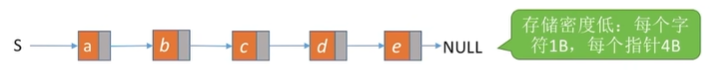
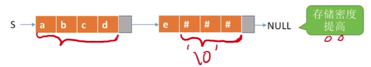
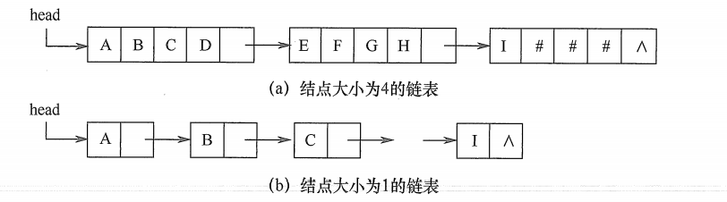
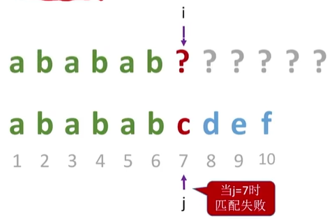
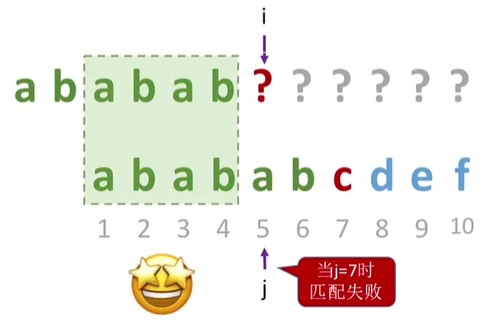
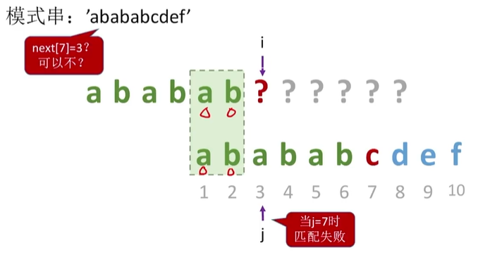

# 一、串String


[toc]

## 逻辑结构

串，即**字符串 ( String）**是由零个或多个**字符**组成的有限序列。一般记为：$S = 'a_1a_2……a_n'(n ≥ 0)$.

其中，
S 是**串名**，**单引号**括起来的**字符序列**是串的值。
ai 可以是字母、数字或其他字符。
串中字符的个数 n 称为**串的长度**。n = 0时的串称为**空串**（用 Ø 表示)。

例：（单双引号都有）

```c
S = "Helloworld!"
T = 'this is a string'
```

### 术语

- **子串**：串中**任意个**连续的字符组成的子序列。（任意个所以也可以是0个，即Ø）
  Eg: 'this'，'is a string' 是 串T 的子串。

- **主串**：包含子串的串。
  Eg: T是子串'this'的主串。

- **字符在主串中的位置**：字符在串中的序号（字符的编号是**从1开始**的）。
  Eg: 'a' 在 T 中的位置是9。（**第一次出现，空格也算**）

- **子串在主串中的位置**：子串的第一个字符在主串中的位置。
  Eg: 'a string' 在T中的位置为9（**使用第一个字符的位置**）


【注意】**空串** 不是 **空格串**

```C
M=''
N='   '
```

N是由三个空格字符组成的**空格串**，每个空格字符占1B。

M的n = 0，所以是**空串**。

### 和线性表的联系

串的逻辑结构和线性表极为相似，区别仅在于串的数据对象限定为字符集。

串是一种**特殊的线性表**，数据元素之间呈线性关系。

串的数据对象限定为**字符集**（如中文字符、英文字符、数字字符、标点字符等）

线性表的基本操作，是以某个元素为操作对象。
串的基本操作，如增删改查等通常**以==子串==为操作对象**。


## 物理（存储）结构 

1. 顺序存储
2. 链式存储

## 基本操作

基于顺序存储实现基本操作：

StrAssign(&T,chars)：**赋值**操作。把串T赋值为chars。

StrCopy(&T,S)：**复制**操作。由串S复制得到串T。

StrEmpty(S)：**判空**操作。若S为空串，则返回TRUE，否则返回FALSE。

StrLength(S)：求**串长**。返回串S的元素个数。

ClearString(&S)：**清空**操作。将S清为空串。（但是不回收内存，还可以再使用）

DestroyString(&S)：**销毁**串。将串S销毁。（回收存储空间）


Concat(&T,S1,S2)：**串联接**。用T返回由S1和S2联接而成的新串T。
【注意】串的联接有可能需要进行存储空间的扩展。

SubString(&sub,S,pos,len)：**求子串**。用sub返回串S的第pos个字符起长度为len的子串。

**Index(S,T)**：**定位子串**。若主串S中存在与串T值相同的子串，则返回它在主串S中第一次出现的位置，否则函数值为0。

StrCompare(S,T)：**比较操作**。若S>T，则返回值>0。若S=T，则返回值=0。若S<T，则返回值<0。
【方法】从第一个字符开始往后依次对比，**先出现更大**（ASCII码靠后的）字符的串就更大。

串赋值StrAssign、串比较 StrCompare、求串长 Strength、串联接 Concat及求子串 Substring五种操作构成串类型的最小操作子集。即这些操作不可能利用其他串操作来实现，反之，其他串操作(除串清除 Clearstring和串销毁 Destroystring外)均可在该最小操作子集上实现。


## 1.顺序存储

### 1.1存储结构的表示

#### 1.1.1定长顺序存储

静态数组实现**定长顺序**存储。

```c
#define MAXLEN 255	//预定义最大串长为255
typedef struct{
	char ch[MAXLEN];//每个分量存储一个字符
	int length;		//串的实际长度
}SString;
```

串的实际长度只能小于等于MAXLEN，超过预定义长度的串值会被舍去，称为截断。在一些串的操作（如插入、联接等）中，若串值序列的长度超过上界MAXLEN，约定用“截断”法处理，要克服这种弊端，只能不限定串长的最大长度，即采用动态分配的方式。

- **结构具体实现**：


方案三，用结束标记字符`\0`表示结尾，此时的串长为隐含值。那么需要从头开始遍历到`\0`，才统计串有多长。

方案二，优点是字符的位序和数组下标相同。但是由于数组是`char`型的数据，每一个元素占1B（字节），也就是8bit。那么如果`ch[0]`充当length，能表示的范围就是0~255，那么字符串长度就不能超过255。

最后选择方案四，来解决方案二的不足。

#### 1.1.2堆分配存储

动态数组实现**堆分配**存储。

```c
typedef struct{
	char *ch;	//按串长分配存储区，ch指向串的基地址
    int length;	//串的长度
}HString;

HString S;
S.ch = (char *) malloc(MAXLEN * sizeof(char));
S.length = 0;
```

用完之后需要手动`free`。


### 1.2求字串

SubString(&sub,S,pos,len)：**求子串**。用空串sub返回串S的第pos个字符起长度为len的子串。

```c
//求子串。用sub返回串S的第pos个字符起长度为len的子串。
bool SubString(SString &Sub, SString S, int pos, int len){
    //判断子串范围越界
    if (pos+len-1> S.length)
        return(false)
    //将i=pos是为了方便S获取字串
	for (int i=pos; i<pos+len; i++)
        Sub.ch[i-pos+1] = S.ch[i];
    Sub.length = len;
    return true;
}
```

### 1.3串的比较

StrCompare(S,T)：**比较操作**。

若S>T，则返回值>0。
若S=T，则返回值=0。
若S<T，则返回值<0。

从第一个字符开始往后依次对比，**先出现更大**（ASCII码靠后的）的字符的串就更大。并不一开始先比较长短。

```c
//比较操作。若S>T，则返回值>0。若S=T，则返回值=0。若S<T，则返回值<0。
int StrCompare(SString S, SString T) {
    for (int i=1; i<=S.length && i<=T.length; i++){
    	if (S.ch[i]!=T.ch[i])
            return S.ch[i]-T.ch[i];
    }
	//扫描过的所有字符都相同，则长度长的串更大
    return S.length-T.length;
}
```

### 1.4定位子串

**Index(S,T)**：**定位子串**。若主串S中存在与串T值相同的子串，则返回它在主串S中第一次出现的位置，否则函数值为0。

使用求字串的方式，截取每一段m长度（要匹配的串的长度）的子串，依次与目标字串进行比较。

```c
//定位子串。若主串S中存在与串T值相同的子串，则返回它在主串S中第一次出现的位置，否则函数值为0。
int Index(SString S, SString T){ 
    int i=1, n=StrLength(S), m=StrLength(T); 
    SString sub;//用于暂存子串
    while(i<=n-m+1){	//n-m+1表示最后剩下m长度子串就结束
        SubString(sub,S,i,m);
        if(strcompare(sub,T)!=0)
            ++i;
        else
            return i; 	//返回子串在主串中的位置
    }
	return 0;	//S中不存在与T相等的子串
}
```


## 2.块链存储

按照链表的数据结构，可以得到：

```c
//存储密度低
typedef struct StringNode{
	char ch;		//每个结点存储1个字符
    struct StringNode *next;
}StringNode, *String;
```

在这样一个结构里面，`ch`占1B，但是`*next`，占4B。也就是存储1B实际信息还要4B存储辅助信息（指针），**存储密度低**。



所以提高每个结点存储的字符数，提高存储密度：**块链存储**。

```c
typedef struct StringNode{
	char ch[4];		//每个结点存储4个字符
    struct StringNode *next;
}StringNode, *String;
```



类似于线性表的链式存储结构，也可采用链表方式存储串值。

由于串的特殊性（每个元素只有一个字），在具体实现时，每个结点既可以存放一个字符， 也可以存放多个字符。每个结点称为**块**，整个链表称为块链结构。



- 图(a)是结点大小为4（即每个结点存放4个字符）的链表，最后一个结点占不满时通常用`#`补上；
- 图(b)是结点大小为1的链表。


# 二、❗模式匹配

**模式串**：就是要查询的目标串。

字符串模式匹配：在**主串**中找到与**模式串**相同的子串，并返回其所在位置。

当然模式串不一定会在主串中找到。

**串的前缀**：**包含第一个字符**，且不包含最后一个字符的子串。

**串的后缀**：**包含最后一个字符**，且不包含第一个字符的子串。

## 1.朴素模式匹配算法（BF）

朴素模式匹配算法，简单的模式匹配算法，Brute-Force算法，简称BF算法。

主串长度n，模式串长度m。

【注意】很多时候，n >> m（主串长度 >> 模式串长度）

==将主串中**所有长度为m的子串**，依次与模式串对比，直到找到一个完全匹配的子串，或所有的子串都不匹配为止。==

最多对比n-m+1次。

最坏的情况，每个子串都要对比m个字符，共 **n-m+1**个子串。

**时间复杂度**= O((n-m+1)\*m) = **O(nm)**


不使用字符串的基本操作，直接通过数组下标实现朴素模式匹配算法：（**步骤**）

1. 定义指针i，j，分别表示主串和模式串的位置。
2. **第一轮**：i先从主串的第 1 位开始。
   1. **若相等**，则继续比较主串与模式串的第二个字符；
   2. **若不相等**，主串指针 i 指向下一个子串（主串中的字串）的第一个位置，模式串指针 j 回到模式串的第一个位置。进行第二轮比较；

3. **第二轮**：模式串中的第一个字符与主串中第 2 个字符进行比较。
4. **第N轮**：依次比较下去，直到全部匹配

图示：


### 1.1BF代码

```c
int Index(SString S, SString T){ 
    int n=S.length, m=T.length;
    int k=1;	//定义主串的起始位置
    int i=k, j=1;
    
    //主串比子串小，匹配失败
    if(n < m)
         return 0;
    
    while(i<=n && j<=m){
        //对应字符相等，指针后移
        if (S.ch[i] == T.ch[j]){
            i++;
            j++;
        }else {
            i = ++k;	//从主串下一个字符位置开始比对
            j = 0;
        }
    }
    if(j > m)		//全部对比完毕之后j++了
        return k; 	//返回子串在主串中的位置
    else
    	return 0;	//S中不存在与T相等的子串
}
```

或者写为（best）：

```c
int Index(SString S, SString T){
	int i = 1, j = 1;
//匹配逻辑    
	while(i <= S.length && j <= T.length){
		if(S.ch[i] == T.ch[j]){
			++i; ++j;	//继续比较后继字符
		}else{
			//指针后退重新开始匹配
			i = i-j+2;
			j = 1;
		}
	}
//匹配完成判断
	if(j > T.length){	//匹配成功
		return i-T.length;
	}else{
		return 0;
	}
}
```

### 1.2缺点

朴素模式匹配算法简单易懂，却存在着一个很大的缺点，那就是<u>主串指针 i 需要**多次回溯**，效率低下</u>，若主串为 000000000001 子串为00001，这就意味着每一轮都要比较到子串的最后一个字符才会匹配失败，有没有更好的办法呢？

下面的KMP模式匹配算法就很好的解决了这一问题。


## 2.KMP模式匹配算法

[4.2_2_KMP算法（新版）_哔哩哔哩_bilibili](https://www.bilibili.com/video/BV1b7411N798/?p=38)

KMP模式配算法是由 D.E.**K**nuth[1]，J.H.**M**orris[2]，V.R.**P**ratt 三位前辈提出的，它是一种**对朴素模式匹配算法的改进**。

朴素模式匹配算法需要**多次回溯**，每趟匹配失败都是主串后移一位再从头开始比较。而某趟已匹配相等的字符序列是模式的某个前缀，这种频繁的重复比较相当于模式串在不断地进行自我比较，这就是其低效率的根源。

所以我们可以从分析模式本身的结构着手，利用模式串的结构相似性，设计next数组。

如果<u>主串的已匹配过的**前缀**序列中有某个**后缀**正好是模式串的**前缀**，那么就可以将模式向后滑动到与这些相等字符对齐的位置。==主串 i 指针无须回溯==</u>，并继续从该位置开始进行比较。而模式向后滑动位数的计算仅与模式本身的结构有关，与主串无关。

即：==**主串**的已匹配过**的前缀**序列中**的一段后缀** == **模式串**的**前缀**==。

同样，因为是已经匹配过的，所以：

**主串**的已匹配过**的前缀**序列中**的一段后缀**也是：

**模式串**的已匹配过**的前缀**序列中**的一段后缀**。（这就是next[] 数组的计算原理）


KMP算法 **时间复杂度为 O(n+m)**，空间复杂度为 O(n)。

- 核心就是**利用匹配失败后的信息，尽量减少子主串的匹配次数。**
- 体现就是**主串指针 i 一直往后移动，只有模式串指针 j 回溯。**

图示：

当匹配失败时候：



将模式串向后滑动，<u>直到主串的已匹配过的**前缀**序列中有某个**后缀**正好是模式串的**前缀**。</u>对上：



所以 next[7] = 5;

所以当 j=7 匹配失败的时候，令模式串跳到next[j]再继续。

当然观察之后还发现，可以这样匹配：



**不可以！**

【注意】进行匹配时候，选择的是**最大的最长的匹配**。当有长的匹配存在，不能选短的匹配。


### ❗2.1计算next[]

**模式串的 next[] **数组

next[ j ]的含义是：在子串的第 j 个字符与主串发生失配时，则跳到子串的next[ j ]位置重新与主串当前位置进行比较。

---

当第 j 个字符匹配失败，由前 1\~j-1 个字符（**j 前面的==不包含当前字符本身==所有字符组成的串**）组成的串记为 **s1（模式前缀）**则：
$$
next[j] = s1本身的最长相等的'前后缀'长度+1
$$
特别地，**next[1]=0**。指向 0 之后，0点没有元素，又变回1。

科学的推导得出以下公式：
$$
next[j]= 
\begin{cases}
0, &\text{当j=1时} \\[2ex]
max\{k|1<k<j且'p_1...p_{k-1}'='p_{j-k+1}...p_{j-1}'\}, &\text{当此集合不为空} \\
即max\{k|1<k<j且模式串的前缀=后缀\}. \\[2ex]
1,&\text{其他情况(前后缀匹配失败，即} s_1=0)\\
\end{cases}
$$

> 例1：模式串S='abcac' 的next数组。
>
> | 编号j   | 1    | 2    | 3    | 4    | 5    |
> | ------- | ---- | ---- | ---- | ---- | ---- |
> | S       | a    | b    | c    | a    | c    |
> | next[j] | 0    | 1    | 1    | 1    | 2    |

> 例2：S='ababaa'
>
> 比如这里的4号b比对的是==不包含它本身==的前面的“aba”，前后缀是 1，所以 1+1=2。
>
> 比如这里的5号a比对的是==不包含它本身==的前面的“abab”，前后缀是 2，所以 2+1=3。
>
> | 编号j   | 1    | 2    | 3    | 4    | 5    | 6    |
> | ------- | ---- | ---- | ---- | ---- | ---- | ---- |
> | S       | a    | b    | a    | b    | a    | a    |
> | next[j] | 0    | 1    | 1    | 2    | 3    | 4    |
>

因为 j=2 时，s1 只有一个数，所以 **next[2] = 1** 是绝对的。

所以前面两个不用想：

- **next[1] = 0**
- **next[2] = 1**


### 2.2KMP代码

通过科学推论，我们可以写出求next数组的程序如下：

```c
void get_next(SString T, int *next){
	int i = 1, j = 0;
	next[1] = 0;
    
	while (i < T.length){
		if(j==0 || T.ch[i]==T.ch[j]){	//ch[i]表示后缀的单个字符，ch[j]表示前缀的单个字符
			++i; ++j;
			next[i] = j;	//若pi = pj， 则next[j+1] = next[j] + 1
		}else{
			j = next[j];	//否则令j = next[j]，j值回溯，循环继续
		}
	}
}
```

与next数组的求解相比，KMP算法就简单许多，和简单模式匹配算法很相似：

```c
int Index_KMP(SString S, SString T){
	int i=1, j=1;
	int next[255];	//定义next数组
    
	get_next(T, next);	//得到next数组
    
//匹配逻辑
	while(i<=S.length && j<=T.length){
		if(j==0 || S.ch[i] == T.ch[j]){	//字符相等则继续。next[1]=0使得j=0
			++i; ++j;
		}else{
			j = next[j];	//模式串向右移动，i不变
		}
	}
//匹配完成判断
	if(j>T.length){
		return i-T.length;	//匹配成功
	}else{
		return 0;
	}
}
```


### ❗2.3KMP进一步优化 nextval[]

KMP进一步优化，优化的是**next**数组为**nextval**数组。

[4.2_4_KMP算法的进一步优化_哔哩哔哩_bilibili](https://www.bilibili.com/video/BV1b7411N798/?p=40)

当 j 所在的**字符** == next[ j ]所在的**字符**，那么如果 j 所在的字符匹配失败，next[ j ]所在的字符必然也会匹配失败。

所以 **next[ j ] 可以直接等于next[ next[ j ] ]**，即直接等于 j 的next的next，减少了一次运算。更新后的数组命名为nextval。
$$
nextval[j]= 
\begin{cases}
next[next[j]], &if\ S[j]=S[next[j]] \\[2ex]
next[j] ,&if\ S[j]!=S[next[j]]\\
\end{cases}
$$
> 例：S='ababaa'
>
> > 关于如何求 next[] 看前面的解释。
>
> **比如这里的 3号a 比对失败之后，会使指针指向1，而1也是a，与3号字符是一样的，所以同样是a，既然3号失败了，1号必然会失败，所以直接使`next[3] = next[1]`，也就是0。**
>
> 同理，因为 next[4] = 2，而2=b=4，
> 所以 next[4] = next[2] = 1。
>
> | 编号j     | 1    | 2    | 3     | 4     | 5     | 6    |
> | --------- | ---- | ---- | ----- | ----- | ----- | ---- |
> | S         | a    | b    | a     | b     | a     | a    |
> | next[j]   | 0    | 1    | 1     | 2     | 3     | 4    |
> | nextval[] | 0    | 1    | **0** | **1** | **0** | 4    |


code:

```c
void get_nextval(String T, int *nextval){
	int i = 1, j = 0;
	nextval[1] = 0;
    
	while (i < T.length){
		if(j==0 || T.ch[i]==T.ch[j]){	//ch[i]表示后缀的单个字符，ch[j]表示前缀的单个字符
			++i; ++j;

			if(T.ch[i] != T.ch[j]){	//若当前字符与前缀字符不同
				nextval[i] = j;	//则当前的j为nextval在i位置的值
			}else{
				//如果与前缀字符相同
				//则将前缀字符的nextval值给nextval在i位置上的值
				nextval[i] = nextval[j];
			}
		}else{
			j = nextval[j];	//否则令j = next[j]，j值回溯，循环继续
		}
	}
}
```

总结：改进过的KMP算法，它是在计算出next值的同时，**如果a位字符与它next值指向的b位字符相等，则该a位的nextval就指向b位的nextval值，如果不等，则该a位的nextval值就是它自己a位的next的值**。

这块逻辑很简单，有了next数组，我们很容易就能推导出它的nextval数组了。


# 三、广义表

广义表（Lists，又称列表）是一种**非连续性**的数据结构，是线性表的一种推广。即广义表中放松对表元素的原子限制，容许它们具有其自身结构。

广义表Lists是n≥0个元素a0,a1,…an-1的序列，其中每一个a~i~或者是原子，或者是一个广义表。

广义表通常记作：LS=（a1,a2,…an）

其中：LS为表名，n为表的长度，每一个ai为表的元素（原子或子表）。习惯上，一般用大写字母表示广义表，小写字母表示原子。

- 表头：若 LS非空（n≥1），则其第一个元素 a1 就是表头。记作 head(LS) = a1。

【注意】表头可以是**原子**，也可以是**子表**。

- 表尾：除表头之外的**其它元素**组成的表。记作 tail(LS) = (a2,... ,an)。

【注意】表尾不是最后一个元素，而是（一定是）一个**子表**。


## 1.性质

1. 广义表中的数据元素有相对次序，一个直接前趋和一个直接后继。

2. 广义表的**长度**定义为最外层所包含的元素的个数，如：`C=(a,(b,c))`是长度为2的广义表。

3. 广义表的**深度**定义为该广义表展开后所包含括号的重数。

   > A=(b,d)的深度为1, B=(A,d)的深度为2, C=(f,B,h)的深度为 3。
   > 【注意】：“原子”的深度为 0；“空表” A=() 的深度为1。

4. 广义表可以为其他广义表共享，如：广义表B就共享表A。在B中不必列出A的值，而是通过名称来引用，B=(A)。

5. 广义表也可以是一个递归的表，注意：**递归表的深度是无穷**的值，长度是有限的值。如 F=(a,F)=(a,(a,(a,……)))。

6. 广义表是多层次的结构，广义表的元素可以是单元素，也可以是子表，而子表的元素还可以是子表。

   > 例：D=(E, A) 其中：E=(a, (b, d) F=(d, (e))
   >
   > 

## 2.广义表与线性表的区别？

1. 广义表是线性表的推广，是由0个或多个单元素或子表组成的有限序列。
2. 广义表与线性表的区别在于：线性表的元素都是结构上不可分的单元素，而广义表的元素既可以是单元素，也可以是有结构的表。
3. 广义表的长度是指广义表中元素的个数。广义表的深度是指广义表展开后所含的括号的最大层数。
4. 非空广义表的第一个元素称为表头，他可以是一个单元素，也可以是一个子表；除表头元素之外，由其余元素所构成的表称为表尾，非空广义表的表尾必定是一个表。

### 2.1存储结构

由于广义表中的元素本身又可以具有结构，它是一种带有层次的非线性结构，因此难以用顺序存储结构表示，通常采用链式存储结构。

若广义表不为空，则可分解为表头和表尾两部分。反之，一对确定的表头和表尾可唯一确定一个广义表。

广义表中的元素可以是原子也可以是子表，针对原子和子表可以分别设计不同的节点结构。表节点有标志域、指示表头的指针域和指示表尾的指针域；而原子只有标志域和值域。


例如广义表`LS=(a,(b,c,d))`,其链式存储结构如图所示：


### 2.2基本运算

求表头GetHea(L)：非空广义表的第一个元素，**1个元素或者1个子表**。

求表尾GetTail(L)：非空广义表除去表头元素以外其他元素所构成的表，**表尾一定是1个表**。


# 参考

[数据结构：串(String)【详解】_数据结构sstring-CSDN博客](https://blog.csdn.net/Real_Fool_/article/details/113877781)

[1]高德纳（Donald Ervin Knuth, D.E.Knuth），被誉为**现代计算机科学的鼻祖**。

《计算机程序设计的艺术》（The Art of Computer Programming）堪称计算机科学理论与技术的经典巨著，有评论认为其作用与地位可与数学史上欧几里得的《几何原本》相比。

计算机排版系统 TeX 和字型设计系统 Metafont 的发明者，他因这些成就和大量创造性的影响深远的著作而誉满全球。


[2] J. H. Morris的成就：

二叉树神级遍历的莫里斯（Morris）算法

这种方法由 J. H. Morris 在 1979 年的论文「Traversing Binary Trees Simply and Cheaply」中首次提出，因此被称为 Morris 遍历。

百度百科没有关于莫里斯算法的介绍，这句话还是复制于力扣。

