# 一、树Tree


[toc]

## 1.逻辑结构

### 1.1定义

树是n（n>=0）个**结点**的有限集。当n = 0时，称为**空树**。在任意一棵**非空树**中应满足：

1. 有且仅有一个特定的称为**根**的结点。

2. 当n>1时，其余节点可分为m（m>0）个**互不相交的有限集合**T1,T2,…,Tm，其中每个集合本身又是一棵树，并且称为根的**子树**。

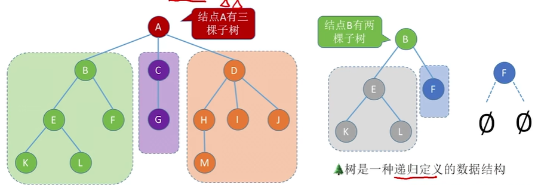

显然，树的定义是递归的，即在树的定义中又用到了自身，树是一种递归的数据结构。树作为一种逻辑结构，同时也是一种分层结构，具有以下两个特点：

1. 树的根结点没有前驱，除根结点外的所有结点有且**只有一个前驱**。
2. 树中所有结点可以有**零个或多个后继**。

因此**n个结点的树中有n-1条边**。


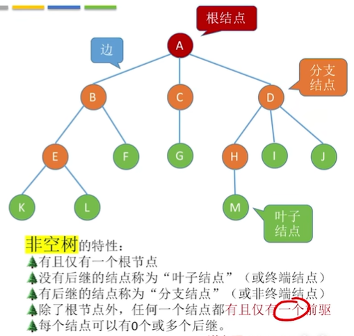

### 1.2术语

**空树**：结点数为0的树，用Ø表示。

**非空树**：树有且仅有一个根结点。


#### 1.2.1结点之间的关系描述

##### 1）亲戚描述

考虑结点K。
根A到结点K的唯一路径上的**任意结点**，都称为结点K的**祖先结点**。
如结点B是结点K的祖先，而结点K是结点B的**子孙结点**。

路径上与结点K**相邻**的**前驱**结点E称为K的**双亲结点（父节点）**，而K为结点E的**孩子结点**。
根A是树中唯一没有双亲的结点。

有同一个双亲的结点称为**兄弟结点**。
如结点K和结点L有相同的双亲E，即K和L为兄弟。

在同一层的结点，可以称为**堂兄弟结点**。
如K, L, M就是堂兄弟。


##### 2）路径和路径长度

树中两个结点之间的**路径**是由这两个结点之间所经过的结点序列构成的，而**路径长度**是路径上所经过的**边的个数**。

【注意】由于树中的分支是有向的，即从双亲指向孩子，所以树中的路径是**只能从上向下**的，同一双亲的两个孩子之间不存在路径。


#### 1.2.2结点&树的属性描述

##### 1）层次

**结点的层次**（深度）――从上往下数

如根A结点是第一层；

【注意】一般来说是默认从第一层开始，但是有的是默认从第0层开始。

B, C, D结点在第二层；
以此类推

子节点的层次 = 父节点层次 + 1

##### 2）高度

**结点的高度**――从下往上数

最低的叶子节点的高度是1，往上一层就+1.

如K, L, M高度是1
根A高度是4。

根A的高度（深度）表示了一共多少层，又称为**树的高度**。这里树的高度是4。

##### 3）==度==

树中一个结点的**孩子个数**称为该==**结点的度**==。
如结点B的度为2，结点D的度为3。

树中结点的最大度数称为**树的度**。
最大的结点的度就是A和D，所以树的度为3。


度大于0的结点称为**分支结点**（又称**非终端结点**）。

度为0(没有子女结点)的结点称为**叶子结点**（又称**终端结点**）。

在分支结点中，每个结点的分支数就是该结点的度。


#### 1.2.3有序树&无序树

树中结点的各子树从左到右是有次序的，不能互换，称该树为**有序树**，否则称为**无序树**。

假设图为有序树，若将子结点位置互换，则变成一棵不同的树。

具体看你用树存什么，是否需要用结点的左右位置反映某些逻辑关系。


#### 1.2.4森林

**森林**是m (m≥0)棵**互不相交的树的集合**。

森林的概念与树的概念十分相近，因为只要把树的根结点删去就成了森林。反之，只要给m棵独立的树加上一个结点，并把这m棵树作为该结点的子树，则森林就变成了树。


### 1.3==【考点】性质==

- **树中的结点数等于所有结点的度数加 1。**

因为度等于用上一层表示下一层的节点个数了，但是根节点还有一个，所以+1。

设非空二叉树中度数为0，1，2的结点的个数分别为$n_0,n_1,n_2$，总结点数为n。
$$
\color{red} 树的结点个数=所有结点的度数+1\\
n = n_1 + 2n_2 + 1
$$

当然不要忘了总结点数 = 不同度数节点数之和，可以利用这两个式子结合来求很多：
$$
n = n_1 + 2n_2 + 1 \\
n = \sum n_0 + \sum n_1 + \sum n_2
$$


- ❗**三度树** 和 **三叉树** 的区别：

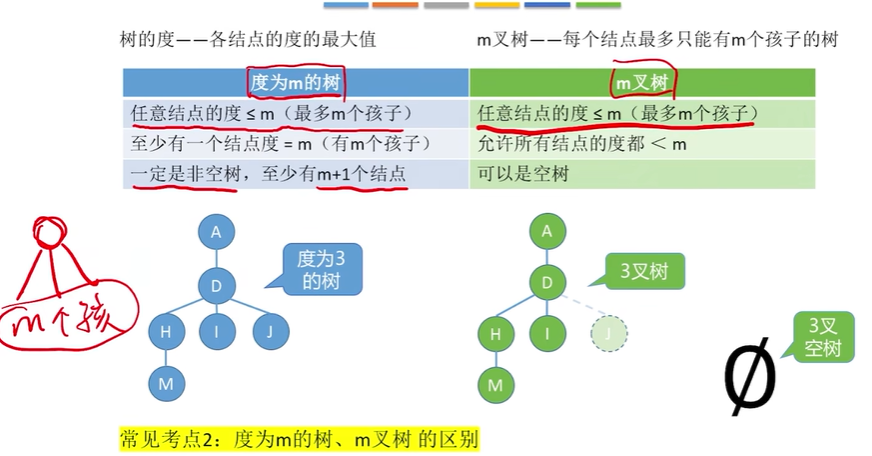

- **度为 m 的树（m叉树）中第 i 层上至多有 $m^{i-1}$ 个结点（i ≥ 1）。**

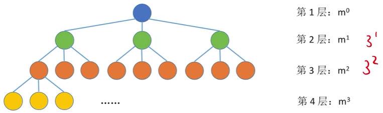

- **高度为 h 的 m叉树至多有$\cfrac {m^h-1}{m-1}$个结点。**

在③中我们得到了度为 m 的树中第 i 层上至多有多少个结点，那么把每层最多的结点加起来，等比数列求和：
$$
a+aq+aq^2+...+aq^{n-1}=\color{red} \frac {a(q^n-1)}{q-1}
$$
a是第一层的结点数为1。

- **高度为 h 的 m叉树至少有 h 个结点**。因为只有有h这么高度就行了。
- **高度为h、度为m的树至少有 h+m-1 个结点**。因为不仅高度需要h，还需要一个度为 m 的结点。

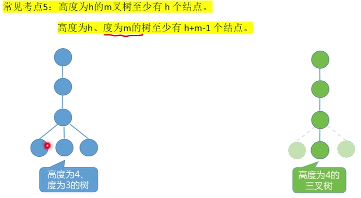

- **具有 n 个结点的 m叉树的最小高度为$\lceil log_m(n(m-1)+1) \rceil$。**

先设高度h，根据④
$$
\cfrac {m^{h-1}-1}{m-1}<n≤\cfrac {m^h-1}{m-1} \\
m^{h-1}<n(m-1)+1≤m^h \\
h-1 < log_m(n(m-1)+1) ≤ h
$$
所以向上取整，得到：
$$
h_{min}=\lceil log_m(n(m-1)+1) \rceil
$$


## 2.物理（存储）结构 

### 2.1双亲表示法

假设以一组连续空间存储树的结点，同时**在每个结点中，附设一个指示器指示其双亲结点到链表中的位置**。也就是说，每个结点除了知道自已是谁以外，还知道它的双亲在哪里。

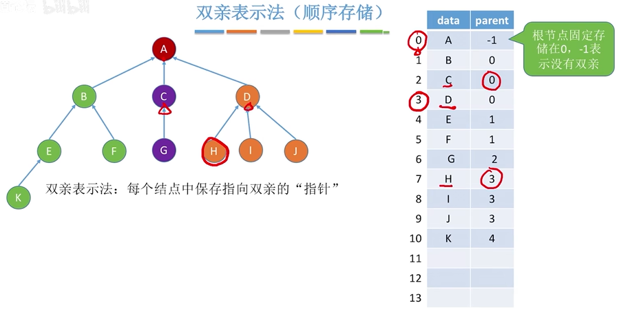

| data | parent |
| ---- | ------ |

其中：

- data是数据域，存储结点的数据信息。
- parent是指针域，存储该结点的双亲在数组中的下标。

双亲表示法的结点结构定义代码：

```c
//树的双亲表示法结点结构定义
#define MAX_TREE_SIZE 100
typedef int TElemType;	//树结点的数据类型，目前暂定为整型

//结点结构
typedef struct PTNode{
	TElemType data;	//结点数据
	int parent;	//双亲位置
}PTNode;

//树结构
typedef struct{
	PTNode nodes[MAX_TREE_SIZE];	//结点数组
	int n;	//结点数
}PTree;
```

这样的存储结构，可以根据结点的 parent 指针很容易找到它的双亲结点，所用的时间复杂度为O(1)，直到**parent为-1时，表示找到了树结点的根**。

可如果要知道结点的孩子是什么，只能遍历整个结构才行。

#### 2.1.1插入

只需要在数组中继续放入data和它的parent即可。无需按照逻辑结构的次序。

#### 2.1.2删除

##### 方案一

删除结点的data，并把parent设为-1，表示这个结点删除。

但是空间仍然占有，而且如果是分支节点，那么它的子孙也仍然占有空间，并且增加查询时间。

##### 方案二（更好）

直接将尾部的结点移上来覆盖要删除的结点，保证了存储结构的连续。


最后节点数-1。


### 2.2孩子表示法

具体办法是，**把每个结点的孩子结点排列起来，以单链表作存储结构，则n个结点有n个孩子链表**。如果是叶子结点则此单链表为空。然后n个头指针又组成一个线性表，采用顺序存储结构，存放进一个一维数组中，如图所示：


为此，设计两种结点结构，一个是孩子链表的孩子结点。

| child | next |
| ----- | ---- |

- child是数据域，用来存储某个结点在表头数组中的下标。
- next 是指针域，用来存储指向某结点的下一个孩子结点的指针。

另一个是表头数组的表头结点。

| data | firstchild |
| ---- | ---------- |

- data是数据域，存储某结点的数据信息。
- firstchild 是头指针域，存储该结点的孩子链表的头指针。

孩子表示法的结构定义代码：

```c
//树的孩子表示法结构定义
#define MAX_TREE_SIZE 100

/*孩子结点*/
typedef struct CTNode{
	int child;
	struct CTNode *next;
}*ChildPtr;

/*表头结点*/
typedef struct{
	TElemType data;
	ChildPtr firstchild;
}CTBox;

/*树结构*/
typedef struct{
	CTBox nodes[MAX_TREE_SIZE];	//结点数组
	int n;	//结点数
}
```

这样的结构对于要查找某个结点的某个孩子，或者找某个结点的兄弟，只需要查找这个结点的孩子单链表即可。对于遍历整棵树也是很方便的，对头结点的数组循环即可。

但是，这也存在着问题，我如何知道某个结点的双亲是谁呢？比较麻烦，需要整棵树遍历才行，难道就不可以把双亲表示法和孩子表示法综合一下吗？当然是可以，这个读者可自己尝试结合一下，在次不做赘述。


### 2.3孩子兄弟表示法

分别从双亲的角度和从孩子的角度研究树的存储结构，如果我们从树结点的兄弟的角度又会如何呢？当然，对于树这样的层级结构来说，只研究结点的兄弟是不行的，我们观察后发现，任意一棵树，它的结点的第一个孩子如果存在就是唯一的，它的右兄弟如果存在也是唯一的。 因此，我们设置两个指针，分别指向该结点的第一个孩子和此结点的右兄弟。

结点的结构如下：

| data | firstchild | rightsib |
| ---- | ---------- | -------- |

- data是数据域，
- firstchild 为指针域，存储该结点的第一个孩子结点的存储地址，
- rightsib 是指针域，存储该结点的右兄弟结点的存储地址。

这种表示法，给查找某个结点的某个孩子带来了方便。

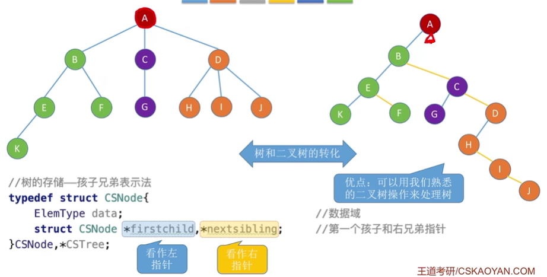

结构定义代码如下：

```c
/*树的孩子兄弟表示法结构定义*/
typedef struct CSNode{
	TElemtype data;
	struct CSNode *firstchild, *rightsib;
} CSNode, *CSTree;
```

于是通过这种结构，我们就把原来的树变成了这个样子：


这不就是个二叉树么？
没错，其实这个表示法的最大好处就是它把一棵复杂的树变成了一棵**二叉树**。

## 3.基本操作

每个存储结构都对应一套操作。


# 二、二叉树Binary tree

定义：

二叉树是一种特殊的树形结构，其特点是每个结点至多只有**两棵子树（度为2）**（即二叉树中不存在度大于2的结点），并且二叉树的子树有左右之分，其**次序不能任意颠倒**。

与树相似，二叉树也以递归的形式定义。二叉树是n (n≥0) 个结点的有限集合：

1. 或者为空二叉树，即n=0。
2. 或者由一个根结点和两个互不相交的被称为根的**左子树**和**右子树**组成。左子树和右子树又分别是一棵二叉树。

二叉树是**有序树**，若将其左、右子树颠倒，则成为另一棵不同的二叉树。即使树中结点只有一棵子树，也要区分它是左子树还是右子树。二叉树的5种基本形态如图所示。

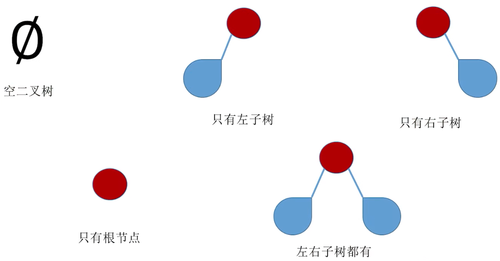


## 1.逻辑结构

### 1.1斜树

所有的结点都只有左子树的二叉树叫左斜树。所有结点都是只有右子树的二叉树叫右斜树。这两者统称为斜树。

### 1.2满二叉树

一棵高度为h，且含有$2^h-1$个结点的二叉树。即树中的每层都含有最多的结点。

1. 只有最后一层有叶子结点。

2. 除叶子结点之外的**每个结点度数均为 2**，不存在度为 1 的结点。

3. 可以对满二叉树按层序编号：约定编号从根结点（根结点编号为1）起，**自上而下，自左向右**。

   这样，每个结点对应一个编号，对于编号为 i 的结点，若有双亲，则其双亲为$\cfrac i 2$，若有左孩子，则**左孩子为 2i**；若有右孩子，则右孩子为 2i+1。

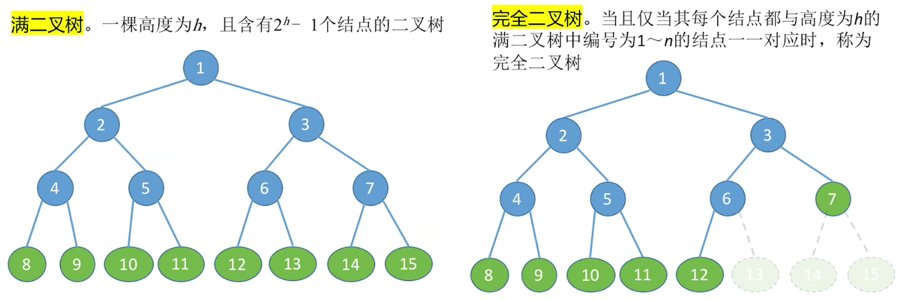

### ❗1.3==【考点】完全二叉树==

高度为h、有n个结点的二叉树，当且仅当其每个结点都与高度为h的满二叉树中编号为1~n的结点一一对应时，称为完全二叉树，如图所示。

如果像上图中红笔画的，因为缺失了一个结点而导致编号不吻合，那么就不是完全二叉树。


1. 若$i ≤ \cfrac n 2$，则结点 i 为分支结点，否则为叶子结点。

2. 叶子结点只可能在层次最大的两层（最下面两层）上出现。对于最大层次中的叶子结点，都依次排列在该层**最左边**的位置上。

3. **最多有 1 个度为 1 的结点，只能有一个，且该结点只有左孩子而无右孩子**。
   $$
   度为1的结点个数n_1=
   \begin{cases}
   1, &\color{red} n是偶数\\[1ex]
   0, &n是奇数\\
   \end{cases}
   $$
   
4. 按层序编号后，一旦出现某结点（编号为 i ）为叶子结点或只有左孩子，则编号大于 i 的结点均为叶子结点。

5. 若 n 为奇数，则每个分支结点都有左孩子和右孩子；
   若 n 为偶数，则编号最大的分支结点（编号为$\cfrac n 2$）只有左孩子，没有右孩子，其余分支结点左、右孩子都有。即：
$$
i结点是=
\begin{cases}
分支结点, & i≤ \lfloor \cfrac n 2\rfloor\\[1ex]
叶子结点, & i> \lfloor \cfrac n 2\rfloor\\
\end{cases}
\\\\
度为2的结点个数n_2=
\begin{cases}
\cfrac n 2 -1, &n是偶数\\[1ex]
\cfrac n 2, &n是奇数\\
\end{cases}
\\\\
n为偶数时候，n_1存在。
\\\\
\color{red} 叶子结点个数n_0=
\begin{cases}
\cfrac n 2, &n是偶数\\[1ex]
\cfrac n 2 +1, &n是奇数\\
\end{cases}
$$
同样，当叶子节点 $n_0$ 是偶数，那么总结点数是偶数为 $2n_0$；如果是奇数，那么总结点数是奇数为 $2(n_0-1)$。

向下取整，表示奇数时和 奇数-1 的偶数时情况一样。可以看上图，n=12时，即使变为13，还是不能影响7变为分支节点。

6. 同满二叉树按层序编号：约定编号从根结点（根结点编号为1）起，自上而下，自左向右。

   这样，每个结点对应一个编号，对于编号为 i 的结点，若有双亲，则其双亲为$\cfrac i 2$，若有左孩子，则**左孩子为 2i**；若有右孩子，则右孩子为 2i+1。


### 1.4排序二叉树BST

**二叉排序树**（Binary Sort Tree），又称**二叉查找树**（Binary Search Tree），二叉搜索树，排序二叉树。

它或者是一棵空二叉树，或者具有以下性质：

1. 左子树上所有结点的关键字**均小于根**结点的关键字；
2. 右子树上的所有结点的关键字**均大于根**结点的关键字；
3. 左子树和右子树又各是一棵二叉排序树。

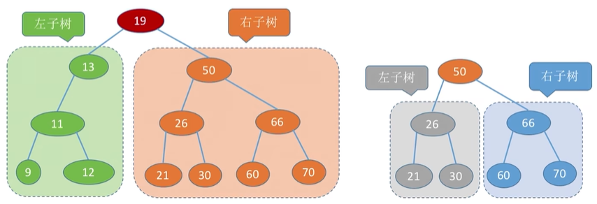


可以进行**中序遍历**，得到一个**递增的序列**。

适用于需要快速查找、插入和删除数据的场景。

插入和删除操作的时间复杂度为 O(log n)，其中 n 是树中节点的个数。

查找操作的时间复杂度也为 O(log n) 在平均情况下，但在最坏情况下可能为 O(n)。

### 1.5平衡二叉树AVL

平衡二叉树（AVL树），它是 "平衡二叉搜索树" 的简称，它是一种**二叉排序树**。

它或者是一颗空树，或者是具有以下性质的二叉排序树：

1. 它的左子树和左子树的高度之差（平衡因子）的绝对值不超过1；
2. 且它的左子树和右子树又都是一颗平衡二叉树。

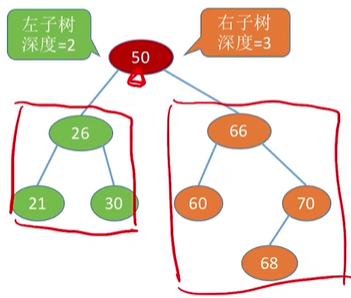

追求更好的平衡二叉树，可以得到更好的二叉排序树，**提高排序和查询的效率**，不至于让一边的树的深度太大。


### 1.6线索二叉树

每个节点除了左右子节点指针外，还包含两个线索指针：前驱指针和后继指针。可以通过线索指针进行前序、中序和后序遍历，而无需使用递归或栈等辅助工具。

左右子节点为空的指针指向相应的线索，而不是空指针。

适用于需要频繁进行遍历操作的场景，例如查找、排序等。


## ❗2.==【考点】性质==

【注意】在做任何计算时，一定要看题目所说的是**结点**还是**叶结点**。


- **任意一棵树，若结点数量为 n，则边的数量为 n−1。**

- **非空**二叉树上的**叶子结点**数$n_0$等于**度为 2 的结点**数加 1，即$n_0=n_2+1$。

我们设非空二叉树中度数为0，1，2的结点的个数分别为$n_0,n_1,n_2$，总结点数为n。
$$
\color{red}n=n_0+n_1+n_2\\
\color{red}n=n_1+2n_2+1(树的结点个数=所有结点的度数+1)\\
↓\\
n_0=n_2+1
$$

- **二叉树中第 i 层上至多有 $2^{i-1}$ 个结点（i≥1）。**

  **m叉树**中第 i 层上至多有 ==$m^{i-1}$== 个结点（i≥1）。

- **高度为 h 的 二叉树 至多有 $2^h-1$ 个结点（h≥1）**（就是满二叉树）。

  高度为 h 的 **m叉树**至多有==$\cfrac {m^h-1}{m-1}$==个结点。


可以使用等比求和算出总结点数：q就是q叉树，n是高度。
$$
a+aq+aq^2+...+aq^{n-1}=\color{red} \frac {a(q^n-1)}{q-1}
$$


---

关于完全二叉树：

- n（n>0）个结点的**完全二叉树**（也是二叉树**最小高度**）层次(深度)为  ==$\lceil log_2(n+1) \rceil$ 或 $\lfloor log_2n \rfloor +1$。==

高为h的满二叉树共有 $2^h-1$ 个结点，就是完全二叉树能表示的最大。
高为h-1的满二叉树共有 $2^{h-1}-1$ 个结点，就是完全二叉树能表示的最小。

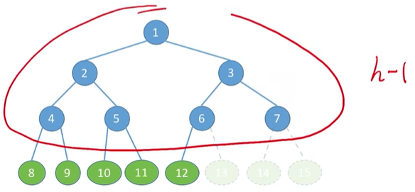

那么，结点个数应该在这两个范围之内：
$$
2^{h-1}-1 < n ≤ 2^h-1\\
2^{h-1} < n+1 ≤ 2^h\\
h-1 < log_2{n+1} ≤ h
$$
所以对中间的结果**向上取整**：
$$
h=\left\lceil log_2(n+1) \right\rceil
$$

**【注意】**在c语言中，默认是**向下取整**的，所以使用$\lfloor log_2n \rfloor +1$会更方便。

---


对**完全二叉树**按从上到下、从左到右的顺序依次编号1,2...,n则有以下关系：

- i>1 时，结点 i 的双亲的编号为$\cfrac i 2$。i 为**偶数**时，它是双亲的左孩子；当 i 为奇数时，它是双亲的右孩子。
- 当 2i ≤ n 时（就是小于最大分支节点的结点：$\lfloor \cfrac n 2\rfloor$），结点 i 的左孩子编号为 2i。否则无左孩子。
- 当 2i+1 ≤ n 时（就是小于最大分支节点的结点+1：$\lfloor \cfrac n 2\rfloor+1$），结点 i 的右孩子编号为 2i + 1 。否则无右孩子。
- 结点 i 所在层次(深度)为 ${log_2i}+ 1$。


## 3.存储结构

- 顺序存储
- 链式存储

### 3.1顺序存储

二叉树的顺序存储是指用一组地址连续的存储单元依次自上而下、自左至右存储**完全二叉树**上的结点元素，即将完全二叉树上编号为 i 的结点元素存储在一维数组下标为 i-1 的分量中。

```c
#define MaxSize 100
typedef char ElemType;
typedef struct
{
	ElemType data[MaxSize];	//	存储树结点的数组 
	int BiTreeNum;			//	二叉树的结点个数 
		
}SqBiTree;
```

**关于完全二叉树结点 i 总结**：

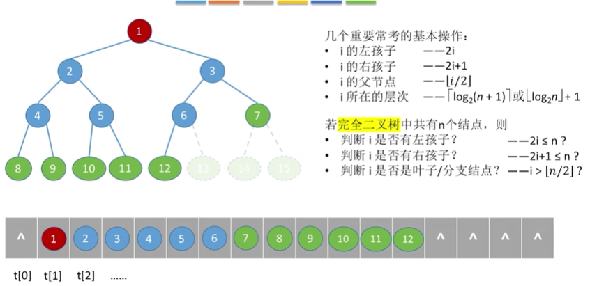

- 左孩子：2i。
- 右孩子：2i+1。
- 双亲：$\lfloor \cfrac i 2\rfloor$（因为右孩子是奇书，除以2有余数，余数取整的时候删去）。
- 结点所在层次：$\lceil log_2(n+1) \rceil$ 或 $\lfloor log_2n \rfloor +1$。

判断：

- i是否有左孩子：2i ≤ n？
- i是否有右孩子：2i+1 ≤ n？
- i是否是叶子结点：i > $\lfloor \cfrac i 2\rfloor$？

【注意】如果不是完全二叉树，是不同二叉树，则**不行**。

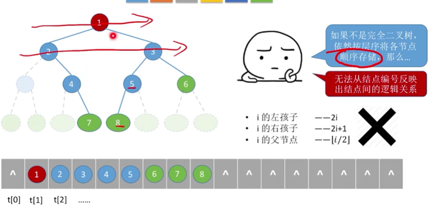

但是可以把原完全二叉树不存在的结点看作null，使得他们的编号对应起来。

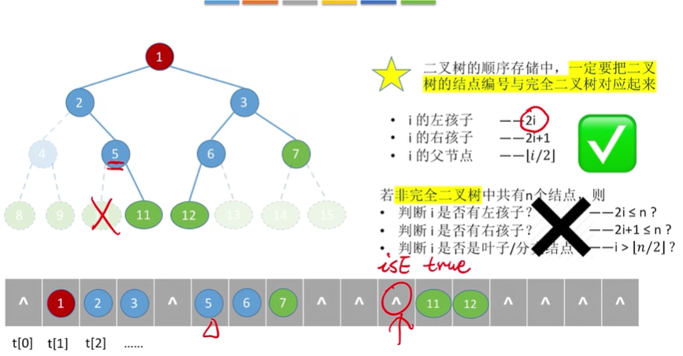

这时候判断结点有无，只能使用`isEmpty`来判断。


**缺点**：存储空间浪费。


所以依据二叉树的性质，完全二叉树和满二叉树采用顺序存储比较合适，树中结点的序号可以唯一地反映结点之间的逻辑关系，这样既能最大可能地节省存储空间，又能利用数组元素的下标值确定结点在二叉树中的位置，以及结点之间的关系。

但对于一般的二叉树，为了让数组下标能反映二叉树中结点之间的逻辑关系，只能添加一些并不存在的空结点，让其每个结点与完全二叉树上的结点相对照，再存储到一维数组的相应分量中。

最坏情况下，高度h且只有h个结点的单支树（所有结点只有右孩子)，也至少需要2h-1个存储单元

所以这种顺序存储结构**只适合完全二叉树**，这样空间才不浪费。


### 3.2链式存储

既然顺序存储适用性不强，我们就要考虑链式存储结构。

二叉树每个结点最多有两个孩子，所以为它设计一个数据域和两个指针域是比较自然的想法，我们称这样的链表叫做二叉链表。

| lchild | data | rchild |
| ------ | ---- | ------ |

数据结构：

```c
//二叉树的结点（二叉链表）
typedef struct BiTNode{
    ElemType data;	//数据域
    struct BiTNode *lchild,*rchild;	//左、右孩子指针
}BiTNode,*BiTree;
```

容易验证，在含有 n 个结点的二叉链表中，含有 **n+1** 个空域。

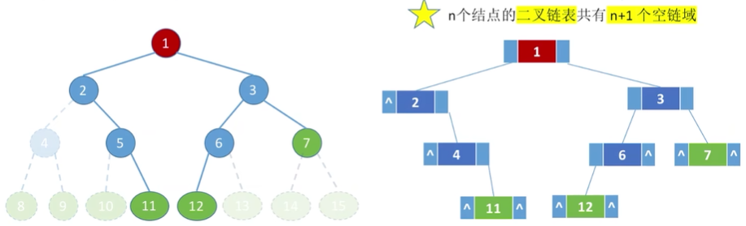

这里的 n+1个空指针域，其实可以利用起来，在后面用于构造**线索二叉树**。

```c
struct ElemType{
	int value;
};
//二叉树的结点（二叉链表）
typedef struct BiTNode{
    ElemType data;
    struct BiTNode *lchild, *rchild;
}BiTNode,*BiTree;

//定义一棵空树
BiTree root = NULL;

//插入根节点root
root = (BiTree)malloc(sizeof(BiTNode));
root->data = {1};
root->lchild = NULL;
root->rchild = NULL;

//插入新结点
BiTNode *p = (BiTNode*)malloc(sizeof(BiTNode));
p->data = {2};
p->lchild = NULL;
p->rchild = NULL;

root->lchild = p;//作为根节点的左孩子
```

前序遍历递归法建立二叉树算法：

```c
// 前序遍历递归法建立二叉树算法
BiTree CreatBiTree(){
    BiTree T;
    ElemType data;
    fflush(stdin);
    scanf("%c",&data);
 
 	if(data == '#')
		T = NULL;
    else{
        T = (BiTree)malloc(sizeof(BiNode));
        T->data = data;
		printf("%c的左子树：",data);
        T->lchild = CreatBiTree();
		printf("%c的右子树：",data);
        T->rchild = CreatBiTree();
    }
    return T;
}
```

**二叉链表**这样找孩子结点很简单，但是找父节点很麻烦。所以再添加父结点指针`*parent`构成**三叉链表**。

```c
//二叉树的结点（三叉链表）
typedef struct BiTNode{
    ElemType data;	//数据域
    struct BiTNode *lchild,*rchild;	//左、右孩子指针
    struct BiTNode *parent;	//父结点指针
}BiTNode,*BiTree;
```


## ❗4.==【考点】遍历==

先/中/后序遍历：根据二叉树的**递归**特性进行的遍历。

【总结】所谓先/中/后序遍历，就是**根**在前/中/后三个位置。

而无论什么遍历，**左子树**一定在**右子树**的**前面**。所以：

1. **当 X 一直在 Y 的左面，说明 X 在左子树，Y在右子树**。
2. **当在前序中是 XY，但是后序中是 YX，那么说明 X 是 Y 的父结点**。

【2012年408真题】通过前序与后序判断祖先关系。

一般来说分为如下三种：

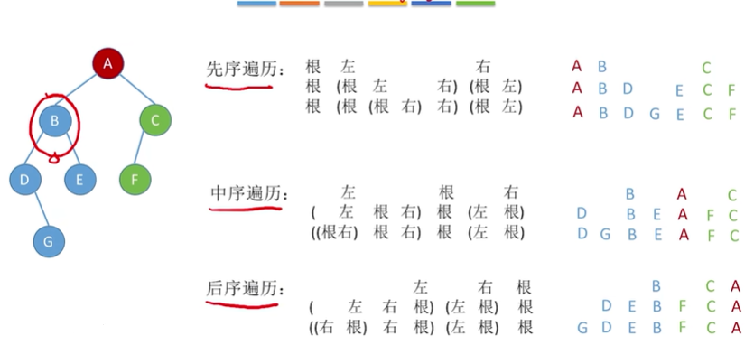

#### ==【考点】n 个结点能组成的树的个数==

一般会提问某个序列能组成的不同的二叉树的个数，但其实就是 n 个结点能组成的树的个数，因为组成二叉树之后，可以填上结点内容，一定可以有这个顺序。

**卡特兰数**：n 个不同元素进栈，出栈元素不同排列的个数为：
$$
\color{red} \frac 1{n+1}C_{2n}^n
$$

> abcde 5个结点，有 $\displaystyle \frac 1{5+1}C_{10}^5=\frac1{6}*\frac{10*9*8*7*6}{5*4*3*2*1}=42$.
>
> abcd 4个结点，有 $\displaystyle \frac 1{4+1}C_{8}^4=\frac1{5}*\frac{8*7*6*5}{4*3*2*1}=14$.


遍历以二叉链表为例：

### 4.1前序遍历

前序遍历，先序遍历（Pre-Order Traversal，**根** - 左 - 右，N-L-R）：指先访问根，然后访问子树的遍历方式

```c
//先序遍历
void Pre0rder(BiTree T){
    if(T!=NULL){
        visit(T)//访问根结点，比如打印
		PreOrder(T->lchild);//递归遍历左子树
        Pre0rder(T->rchild);//递归遍历右子树
	}
}
```

#### 4.1.1前序非递归方式

（先序遍历和中序遍历的基本思想是类似的，只需把访问结点操作放在入栈操作的前面。）

```c
void PreOrder2(BiTree T){
	InitStack(S);	//初始化栈S
	BiTNode* p = T;	//p是遍历指针
	while(p || !IsEmpty(S)){	//栈不空或p不空时循环
		if(p){
			visit(p);	//访问出栈结点
			Push(S, p);	//当前节点入栈
			p = p->lchild;	//左孩子不空，一直向左走
		}else{
			Pop(S, p);	//栈顶元素出栈
			p = p->rchild;	//向右子树走，p赋值为当前结点的右孩子
		}
	}
}
```

### 4.2中序遍历

中序遍历（In-Order Traversal， 左 - **根** - 右，LNR）：指先访问左（右）子树，然后访问根，最后访问右（左）子树的遍历方式。

中序遍历一般是用二叉树实现：

```c
//中序遍历
void In0rder(BiTree T){
    if(T!=NULL){
		InOrder(T->lchild);//递归遍历左子树
        visit(T)//访问根结点，比如打印
        In0rder(T->rchild);//递归遍历右子树
	}
}
```

#### 4.2.1中序非递归方式


借助栈，我们来分析中序遍历的访问过程:

1. 沿着根的左孩子，依次入栈，直到左孩子为空，说明已找到可以输出的结点，此时栈内元素依次为ABD。
2. 栈顶元素出栈并访问：
   1. 若其右孩子为空，继续执行步骤2；
   2. 若其右孩子不空,将右子树转执行步骤1。

栈顶D出栈并访问，它是中序序列的第一个结点。D右孩子为空，栈顶B出栈并访问。B右孩子不空，将其右孩子E入栈，E左孩子为空，栈顶E出栈并访问。E右孩子为空，栈顶A出栈并访问。A右孩子不空，将其右孩子C入栈，C左孩子为空，栈顶C出栈并访问。由此得到中序序列DBEAC。

根据分析可以写出中序遍历的非递归算法如下:

```c
void InOrder2(BiTree T){
	InitStack(S);	//初始化栈S
	BiTNode* p = T;	//p是遍历指针
	while(p || !IsEmpty(S)){	//栈不空或p不空时循环
		if(p){
			Push(S, p);	//当前节点入栈
			p = p->lchild;	//左孩子不空，一直向左走
		}else{
			Pop(S, p);	//栈顶元素出栈
			visit(p);	//访问出栈结点
			p = p->rchild;	//向右子树走，p赋值为当前结点的右孩子
		}
	}
}
```

### 4.3后序遍历

后序遍历（Post-Order Traversal， 左 - 右 - **根**，LRN）：指先访问子树，然后访问根的遍历方式

```c
//后序遍历
void Post0rder(BiTree T){
    if(T!=NULL){
		PostOrder(T->lchild);//递归遍历左子树
        Post0rder(T->rchild);//递归遍历右子树
        visit(T)//访问根结点，比如打印
	}
}
```

三种遍历算法中，递归遍历左、右子树的顺序都是固定的，只是访问根结点的顺序不同。不管采用哪种遍历算法，每个结点都访问一次且仅访问一次，故时间复杂度都是O(n)。

在递归遍历中，递归工作栈的栈深恰好为树的深度，所以在最坏情况下，二叉树是有n个结点且深度为n的单支树，遍历算法的空间复杂度为O(n)。

#### 4.3.1后序非递归方式

后序遍历的非递归实现是三种遍历方法中最难的。因为在后序遍历中，要保证左孩了和右孩子都已被访问并且左孩子在右孩子前访问才能访问根结点，这就为流程的控制带来了难题。

算法思想：后序非递归遍历二叉树是先访问左子树，再访问右子树，最后访问根结点。

1. 沿着根的左孩子，依次入栈，直到左孩子为空。此时栈内元素依次为ABD。
2. 读栈顶元素：
   1. 若其右孩子不空且未被访问过，将右子树转执行①；
   2. 否则，栈顶元素出栈并访问。

栈顶D的右孩子为空，出栈并访问，它是后序序列的第一个结点；栈顶B的右孩子不空且未被访问过，E入栈，栈顶E的左右孩子均为空，出栈并访问；栈顶B的右孩子不空但已被访问，B出栈并访问；栈项A的右孩子不空且未被访问过，C入栈,栈项C的左右孩子均为空，出栈并访问；栈顶A的右孩子不空但已被访问，A出栈并访问。由此得到后序序列DEBCA。

在上述思想的第②步中，必须分清返回时是从左子树返回的还是从右子树返回的，因此设定一个辅助指针r，指向最近访问过的结点。也可在结点中增加一个标志域，记录是否已被访问。

后序遍历的非递归算法如下:

```c
void PostOrder2(BiTree T){
	InitStack(S);
	BiTNode* p = T, r = NULL;
	while(p || !IsEmpty(S)){
		if(p){	//走到最左边
			push(S, p);
			p = p->lchild;
		}else{	//向右
			GetTop(S, p);	//读栈顶元素（非出栈）
			//若右子树存在，且未被访问过
			if(p->rchild && p->rchild != r){
				p = p->rchild;	//转向右
				push(S, p);	//压入栈
				p = p->lchild;	//再走到最左
			}else{	//否则，弹出结点并访问
				pop(S, p);	//将结点弹出
				visit(p->data);	//访问该结点
				r = p;	//记录最近访问过的结点
				p = NULL;
			}
		}
	}
}
```


### 4.4递归求树的深度

可以先测出左右子树的深度，然后+1，就是加上根节点，那么就是此树的高度，通过**递归**的方法，依次求出子树高度，然后得到最高的。

```c
int treeDepth(BiTree T){
    if (T ==NULL) {
        return 0;
    }else {
        int l=treeDepth(T->lchild);
        int r=treeDepth(T->rchild);
        //树的深度=Max(左子树深度，右子树深度)+1
        return l>r ? l+1 : r+1;
    }
}
```

### 4.5层序遍历

层次遍历，即按照箭头所指方向，按照1,2,3,4的层次顺序，一层一层地对二叉树进行遍历。

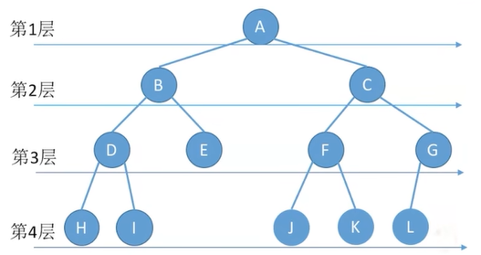


算法思想：

1. 初始化一个辅助**队列**；

2. 根结点入队；

3. 若队列非空，则队头结点出队，访问该结点。并将其左、右孩子插入队尾（**先左再右**，如果有的话）；

   即：**每出队一个结点，就把它的孩子放入结点。**

4. 重复③直至队列为空；

这里使用链队列。

```c
//按层遍历递归二叉树算法
// 每出队一个结点，就把它的孩子放入结点。
void Layer_order(BiTree T)
{
	LinkQueue Q;	//定义辅助队列
	InitQueue(&Q);	//初始化辅助队列
    
	// 注意判断是不是NULL
	if(T != NULL){
	    EnQueue(&Q, T);	//将根节点入队
	}

	while(!QueueEmpty(Q)){	//队列不空则循环
		BiNode* temp = DeQueue(&Q);
		printf("%3c", visit(temp));	//访问出队结点

		//两种判断是否为空结点 
		if(temp->lchild != NULL){
			EnQueue(&Q, temp->lchild);	//左子树不空，则左子树根节点入队
		}
		if(temp->rchild){
			EnQueue(&Q, temp->rchild);	//右子树不空，则右子树根节点入队
		}
	}
}
```

### 4.6==【考点】由遍历序列构造二叉树==

若只给出一棵二叉树的前/中/后/层序遍历序列中的一种，不能唯一确定一棵二叉树。

同一个中序遍历，因为不同根节点，可以有不同的二叉树实现。


所以使用前、后遍历确定**根节点**，使用中序遍历划分左右子树，来确定唯一的二叉树。

==【考点】由两个遍历序列构造二叉树==

【解法】一般来说，就是通过给出的<u>前序，后序，层序</u>不断找**根节点**的位置，然后通过<u>中序</u>里面，由于根节点的位置可区分**左右子树**，不断迭代找根，直到完成。

巧解：[无脑秒解！已知先/后序遍历与中序遍历，求后/先序遍历](https://www.bilibili.com/video/BV1Xu411d7qf)

因为先序是**根左右**（在左面竖着写），中序是**左根右**（中序横着写）。无图无真相：

|        |  左  |  根  |  右  |
| :----: | :--: | :--: | :--: |
| **根** |      |  根  |      |
| **左** |  左  |      |      |
| **右** |      |      |  右  |

同理后序（在左面竖着倒着写） + 中序：

|        |  左  |  根  |  右  |
| :----: | :--: | :--: | :--: |
| **根** |      |  根  |      |
| **右** |      |      |  右  |
| **左** |  左  |      |      |


**由二叉树的先序序列和中序序列可以唯一地确定一棵二叉树**。
（**先序+中序**）

在先序遍历序列中，第一个结点一定是二叉树的根结点；而在中序遍历中，根结点必然将中序序列分割成两个子序列，前一个子序列是根结点的左子树的中序序列，后一个子序列是根结点的右子树的中序序列。根据这两个子序列，在先序序列中找到对应的左子序列和右子序列。

在先序序列中，左子序列的第一个结点是左子树的根结点，右子序列的第一个结点是右子树的根结点。如此递归地进行下去，便能唯一地确定这棵二叉树

同理，**由二叉树的后序序列和中序序列也可以唯一地确定一棵二叉树**。
（**后序+中序**）

因为后序序列的最后一个结点就如同先序序列的第一个结点，可以将中序序列分割成两个子序列，然后采用类似的方法递归地进行划分，进而得到一棵二叉树。

由**二叉树的层序序列和中序序列也可以唯一地确定一棵二叉树**。
（**层序+中序**）

【注意】前序、后序、层序序列两两组合，都不能确定唯一的二叉树。只有**中序**存在才可以。

> 例如，求先序序列（ABCDEFGH）和中序序列（BCAEDGHFI）所确定的二叉树。
>
> 首先，由先序序列可知A为二叉树的根结点。中序序列中A之前的BC为左子树的中序序列，EDGHFI为右子树的中序序列。然后由先序序列可知B是左子树的根结点，D是右子树的根结点。以此类推，就能将剩下的结点继续分解下去，最后得到的二叉树如图c所示。
>
> 


# 三、线索二叉树

## 1.原理&作用

遍历二叉树是以一定的规则将二叉树（**树型**）中的结点排列成一个**线型序列**，从而得到几种遍历序列，使得该序列中的每个结点（第一个和最后一个结点除外）都有一个直接前驱和直接后继。

普通二叉链表（二叉树）的一个结点，仅能体现一种父子关系，不能直接得到结点在遍历中的**前驱**或**后继**。它只有向下的两个孩子结点的指针，没有向上的父结点的指针。

所以每次想要确定前驱时，只能再进行一次遍历：


为了解决这个问题。


首先我们要来看看这**空指针域**有多少个呢？对于一个有n个结点的二叉链表，每个结点有指向左右孩子的两个指针域，所以一共是2n个指针域。而n个结点的二叉树一共有 n-1 条分支线数，也就是说，其实是存在 2n - (n-1) = n+1 个空指针域。

所以**利用这些空指针来存放指向其前驱或后继的指针**，这样就可以像遍历单链表那样方便地遍历二叉树。引入线索二叉树正是为了加快查找结点前驱和后继的速度。

我们把这种指向前驱和后继的指针称为**线索**，加上线索的二叉链表称为**线索链表**，相应的二叉树就称为线索二叉树（Threaded Binary Tree）。

## 2.存储结构

其结点结构如下所示：

| lchild | ltag | data | rtag | rchild |
| ------ | ---- | ---- | ---- | ------ |

其中，**ltag, rtag初始化时，都为0**。

- ltag==0时指向该结点的左孩子，为1时指向该结点的前驱。
- rtag==0时指向该结点的右孩子，为1时指向该结点的后继。

```c
//二叉树的结点（线索链表）
typedef struct ThreadNode{
	ElemType data;	//数据元素
	struct ThreadNode *lchild, *rchild;	//左、右孩子指针
	int ltag, rtag;	//左、右线索标志
}ThreadNode, *ThreadTree;
```

因此对于上图的二叉链表图可以修改为下图的样子。


### ==【线索二叉树 - 考点总结】==

因为有 3 种遍历方式，所以有 3 种线索二叉树，分别写出原本二叉树的**前序、后序、中序遍历**，而当没有左孩子时候，就连接到前驱，没有右孩子时候，就连接到后继。

使用不同的遍历方式进行线索化，就会得到不同的遍历序列线索二叉树。

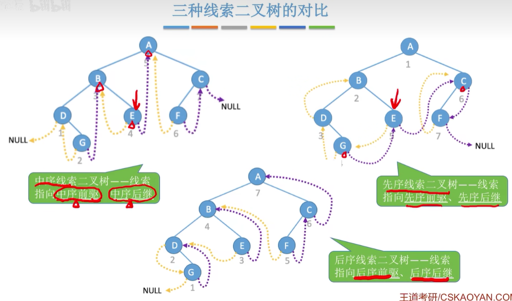

### 创建线索二叉树

从代码层面来看，创建线索二叉树的过程可以分为两步：

1. **建立二叉树**：根据遍历序列创建一颗普通的二叉树。

   根据遍历序列，将节点按照遍历次序连接起来的过程。在这个过程中，只关心节点之间的父子关系，而**不关心前驱和后继关系**。

2. **线索化**：遍历二叉树，根据遍历次序判断每个节点的左右孩子是否为空，并设置相应的线索标志。

   在建立二叉树的基础上，为每个节点添加前驱和后继信息的过程。这个过程需要遍历二叉树两次，**第一次遍历**是为了确定每个节点的前驱和后继，**第二次遍历**是为了设置线索标志。

---

**线索二叉树可以直接由遍历序列创建**，而无需先构造一棵普通的二叉树。例如，可以使用先序遍历序列、中序遍历序列或后序遍历序列来创建线索二叉树。

**线索二叉树的存储结构与普通二叉树不同**。在普通二叉树中，每个节点只有左右孩子指针，而在线索二叉树中，每个节点还增加了左标志和右标志，用于表示前驱和后继信息。

**线索二叉树的遍历算法与普通二叉树不同**。由于线索二叉树中包含了前驱和后继信息，因此可以使用线索遍历算法来遍历线索二叉树，而无需像普通二叉树那样使用递归或迭代算法。

## 3.二叉树线索化

二叉树的线索化是将二叉链表中的空指针改为指向前驱或后继的线索。而前驱或后继的信息只有在遍历时才能得到，**因此线索化的实质就是遍历一次二叉树，线索化的过程就是在遍历的过程中修改空指针的过程。**

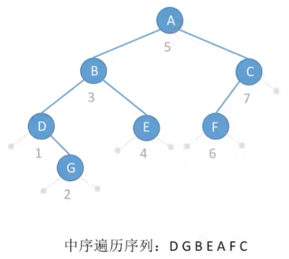

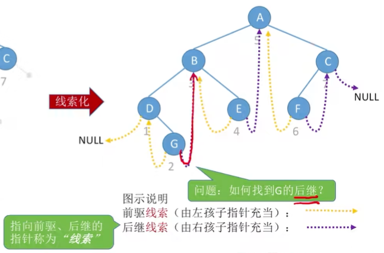

### 3.1中序线索化

设指针pre指向刚刚访问过的结点，指针p指向正在访问的结点，即pre指向p的前驱。在中序遍历的过程中，

1. 检查p的**左指针`lchild`**是否为空，若为空就将它指向pre；
2. 检查pre的**右指针`rchild`**是否为空，若为空就将它指向p。


上图中序：BDAEC

通过中序遍历对二叉树**线索化**的递归算法如下：

```c
//二叉树的结点（线索链表）
typedef struct ThreadNode{
	ElemType data;	//数据元素
	struct ThreadNode *lchild, *rchild;	//左、右孩子指针
	int ltag, rtag;	//左、右线索标志
}ThreadNode, *ThreadTree;

//线索化：一边遍历，一边线索化
void InThread(ThreadTree p, ThreadTree &pre){
	if(p != NULL){
		InThread(p->lchild, pre);	//递归，线索化左子树
        //---
		if(p->lchild == NULL){	//左子树为空，建立前驱线索
			p->lchild = pre;
			p->ltag = 1;
		}
		if(pre != NULL && pre->rchild == NULL){
			pre->rchild = p;	//建立前驱结点的后继线索
			pre->rtag = 1;
		}
		pre = p;	//标记当前结点成为刚刚访问过的结点
        //---
		InThread(p->rchild, pre);	//递归，线索化右子树
	}
}
```

会发现，除了中间的代码，和二叉树**中序遍历**的递归代码几乎完全一样。只不过将本是访问结点的功能改成了线索化的功能，相当于：

```c
void InThread(ThreadTree T){
	if(T!=NULL){
		InThread(T->lchild);//递归线索化左子树
		visit(T)
		InThread(T->rchild);//递归线索化右子树
	}
}

void visit(ThreadTree p){
    if(p->lchild == NULL){	//左子树为空，建立前驱线索
        p->lchild = pre;
        p->ltag = 1;
    }
    if(pre != NULL && pre->rchild == NULL){
        pre->rchild = p;	//建立前驱结点的后继线索
        pre->rtag = 1;
    }
    pre = p;	//标记当前结点成为刚刚访问过的结点
}
```


#### ❗中序线索化代码

```c++
//二叉树的结点（线索链表）
typedef struct ThreadNode{
	ElemType data;	//数据元素
	struct ThreadNode *lchild, *rchild;	//左、右孩子指针
	int ltag, rtag;	//左、右线索标志
}ThreadNode, *ThreadTree;

// 中序线索化。一边遍历，一边线索化
// 后序线索化的代码和中序完全相同
void InThread(ThreadNode* p, ThreadNode* &pre)
{
	if(p != NULL){
		InThread(p->lchild, pre);	//递归，线索化左子树

        //---
		//左子树为空，建立前驱线索
		if(p->lchild == NULL){
			p->lchild = pre;
			p->ltag = 1;
		}
		//右子树为空，建立前驱结点的后继线索
		if(pre != NULL && pre->rchild == NULL){ // pre != NULL 排除第一个结点前驱为空的情况
			pre->rchild = p;
			pre->rtag = 1;
		}
		pre = p;	//标记当前结点成为刚刚访问过的结点
        //---

		InThread(p->rchild, pre);	//递归，线索化右子树
	}
}
// 中序线索化
void CreateInThread(ThreadTree T){
	ThreadNode *pre = NULL;	//第一个结点没有前驱，这里的NULL会赋给第一个结点的前驱
	if(T != NULL){
		InThread(T, pre);	//线索化二叉树
		pre->rchild = NULL;	//遍历结束后的最后一个结点没有后继
		pre->rtag = 1;
	}
}
```

#### 头结点

为了方便，可以在二叉树的线索链表上也添加一个**头结点**，令其lchild域的指针指向二叉树的根结点，其rchild域的指针指向中序遍历时访问的最后一个结点。

令二叉树中序序列中的第一个结点的lchild域指针和最后一个结点的rchild域指针均指向头结点。这好比为二叉树建立了一个双向线索链表，方便从前往后或从后往前对线索二叉树进行遍历，如下图所示：


遍历的代码如下：

```c
/*T指向头结点，头结点左链lchild指向根结点，头结点右链rchild指向中序遍
的最后一个结点。中序遍历二叉线索链表表示的二叉树T
*/
void InOrderTraverse_Thr(BiThrTree T){
	BiThrTree p;
	p = T->lchild;	//p指向根结点
	//空树或遍历结束时，p==T（最后一个结点指向根结点）
	while(p != T){	
		//当ltag==0时循环到中序序列第一个结点
		while(p->ltag == 0){	
			p = p->lchild;	//p指向p的左子树
		}
		visit(p);	//访问该结点
		//后继线索为1且不是指向头指针
		while(p->rtag == 1 && p->rchild != T){	
			p = p->rchild;	//p指向p的后继
			visit(p);	//访问该节点
		}
		//p进至其右子树根，开始对右子树根进行遍历
		p = p->rchild;	
	}
}
```

从这段代码也可以看出，它等于是一个链表的扫描，所以时间复杂度为0(n)。

由于它充分利用了空指针域的空间（这等于节省了空间），又保证了创建时的一次遍历就可以终生受用前驱后继的信息（这意味着节省了时间）。所以在实际问题中，如果所用的二叉树需经常遍历或查找结点时需要某种遍历序列中的前驱和后继，那么采用线索二叉链表的存储结构就是非常不错的选择。

### 3.2先序、后序线索化

上面给出了建立中序线索二叉树的代码，建立先序线索二叉树和后序线索二叉树的代码类似，只需变动线索化改造的代码段与调用线索化左右子树递归函数的位置。

以图(a)的二叉树为例，其先序序列为ABCDF，后序序列为CDBFA，可得出其先序和后序线索二叉树分别如图(b)和(c)所示：


**【注意】先序线索化的代码和中序基本相同**，但是有一点不同，当一个结点没有左孩子时候，它的左指针lchild会指向前驱，这时候，lchild所指的并**不是左子树，而是左线索**，所以会**出现遍历错误**。

```c
//先序遍历
void Pre0rder(BiTree T){
    if(T!=NULL){
        visit(T)//访问根结点，比如打印
            
		PreOrder(T->lchild);//递归遍历左子树
        
        Pre0rder(T->rchild);//递归遍历右子树
	}
}
```

所以需要改为：

```c
void PreThread(ThreadTree T){
    if(T!=NULL){
        visit(T)	//处理
            
        if(T->ltag == 0){	//0表示孩子（子树）
            PreOrder(T->lchild);//递归遍历左子树
        }
        
        Pre0rder(T->rchild);	//递归遍历右子树
	}
}
```

#### ❗前序线索化代码

```c++
// 前序线索化
// 先序线索化的代码和中序基本相同，但是有一点不同，当一个结点没有左孩子时候，它的左指针lchild会指向前驱，这时候，lchild所指的并不是左子树，而是左线索，所以会出现遍历错误。
void PreThread(ThreadNode* p, ThreadNode* &pre) // 前序线索化二叉树子函数
{
    if(p != NULL){
		//左子树为空，建立前驱线索
        if(p->lchild == NULL){
            p->lchild = pre;
            p->ltag = 1;
        }
		//右子树为空，建立前驱结点的后继线索
        if(pre != NULL && pre->rchild == NULL){ // pre != NULL 排除第一个结点前驱为空的情况
            pre->rchild = p;
            pre->rtag = 1;
        }
        pre = p;

        // 【注意】这里在递归入口处有条件限制，左、右指针不是线索才能继续递归
        if(p->ltag == 0)
            PreThread(p->lchild, pre); // 递归，左子树线索化
        if(p->rtag == 0)
            PreThread(p->rchild, pre); // 递归，右子树线索化
    }
}
void CreatePreThread(ThreadTree T){ // 前序线索化二叉树
    ThreadNode *pre = NULL;
    if(T != NULL){
        PreThread(T, pre);
        pre->rchild = NULL; // 非空二叉树，线索化
        pre->rtag = 1; // 后处理中序最后一个结点
    }
}
```


**后序线索化的代码和中序完全相同**。

#### ❗后序线索化代码

```c++
// 后序线索化
// 后序线索化的代码和中序完全相同，只有顺序不同
void PostThread(ThreadNode* p, ThreadNode* &pre){ // 后序线索化二叉树子函数
    if(p != NULL){
        PostThread(p->lchild, pre); // 递归，左子树线索化
        PostThread(p->rchild, pre); // 递归，右子树线索化

        if(p->lchild == NULL){
            // 建立当前节点的前驱线索
            p->lchild = pre;
            p->ltag = 1;
        }
        if(pre != NULL && pre->rchild == NULL){ // pre != NULL 排除第一个结点前驱为空的情况
            // 建立当前节点的后继线索
            pre->rchild = p;
            pre->rtag = 1;
        }
        pre = p;
    }
}
// 后序线索化
void CreatePostThread(ThreadTree T){ // 前序线索化二叉树
    ThreadNode *pre = NULL;
    if(T != NULL){
        PostThread(T, pre);
        pre->rchild = NULL; // 非空二叉树，线索化
        pre->rtag = 1; // 后处理中序最后一个结点
    }
}
```


## 4.根据线索二叉树找前驱后继

### 4.1中序

因为二叉树已经被中序线索化，所以我们遍历链表，并按照中序（左->根->右）的方式访问结点即可。

在中序线索二叉树中找结点的前驱、后继：

1. 如果二叉树指针被线索化（叶子节点，ltag和rtag是1），那么前驱和后继就是结点的lchild和rchild。

2. 如果ltag和rtag是0，

   1. 后继就是结点右子树最左下角的结点；

      

   2. 前驱就是结点左子树最右下角的结点。

      

```c
//找到以P为根的子树中，第一个被中序遍历的结点
ThreadNode *FirstNode(ThreadNode *p){
	//循环找到右子树最左下结点(不一定是叶结点)
    while(p->ltag == 0)
        p=p->lchild;
    return p;
}
//在中序线索二叉树中找到结点p的后继结点
ThreadNode *Next(ThreadNode *p){
	//右子树中最左下结点
    if(p->rtag == 0)
        return FirstNode(p->rchild);
    else
        return p->rchild;	//rtag==1直接返回后继线索
}


//找到以P为根的子树中，最后一个被中序遍历的结点
ThreadNode *LastNode(ThreadNode *p){
    //循环找到最右下结点（不一定是叶子结点）
    while(p->rtag == 0)
        p = p->rchild;
    return p;
}
//在中序线索二叉树中找到结点p的前驱结点
ThreadNode *Pre(ThreadNode *p){
    //左子树中最右下结点
    if(p->ltag == 0)
        return LastNode(p->lchild);
    else
        return p->lchild;
}
```

既然可以求出每个结点的前驱后继，那么就能写出**非递归中序遍历**和**非递归中序逆向遍历**。

```c
//对中序线索二叉树进行中序遍历（顺序）
// （利用线索实现的非递归算法）空间复杂度O(1)
void InOrder(ThreadNode *T){
    for(ThreadNode *p=FirstNode(T); p!=NULL; p=Next(p))
        visit(p);
}

//对中序线索二叉树进行中序遍历（倒叙）
// （利用线索实现的非递归算法）空间复杂度O(1)
void RevInOrder(ThreadNode *T){
    for(ThreadNode *p=LastNode(T); p!=NULL; p=Pre(p))
        visit(p);
}
```


### 4.2先序

#### 4.2.1先序后继


1. 如果为叶结点（ltag和rtag是1），则右链域直接指示了结点的后继；
2. 如果有左孩子，则左孩子根就是其后继；
3. 如果无左孩子但有右孩子，则右孩子根就是其后继。

#### 4.2.2先序前驱

因为先序遍历的特点是 **根-左-右**，也就是左右子树都是根的后继，因为**二叉链表**只有两个孩子结点指针，所以找不到结点的前驱，只能用老办法再遍历一遍。

但是如果是**三叉链表**，增加了父结点指针：

1. 如果当前结点p是左孩子，则父结点就是其前驱；

   

2. 如果当前结点p是右孩子，并且父结点没有左孩子，则父结点就是其前驱；

   

3. 如果当前结点p是右孩子，父结点有左孩子。则左兄弟子树最后一个被先序遍历的结点是其前驱；

   

4. 如果当前结点p是根节点，那么前驱为空。

### 4.3后序

#### 4.3.1先序前驱

1. 若二叉树指针被线索化（叶子节点，ltag==1），那么前驱就是结点的lchild。

2. 若ltag==0，

   1. 若结点有右孩子，那么右孩子的根结点就是前驱；

   2. 若结点没有右孩子，有左孩子，那么左孩子的根结点就是前驱。

      

#### 4.3.2后序后继

和先序前驱同理。因为后序遍历的特点是 **左-右-根**，也就是左右子树都是根的前驱，因为**二叉链表**只有两个孩子结点指针，所以找不到结点的后继，只能用老办法再遍历一遍。

但是如果是**三叉链表**，增加了父结点指针：

1. 若结点p是其双亲的右孩子，则父结点就是后继；

   

2. 若结点p是其双亲的左孩子，且没有右兄弟，则父结点就是后继；

   

3. 若结点p是其双亲的左孩子，有右兄弟，则右兄弟子树最后一个被后序遍历的结点是其前驱；

   

4. 如果当前结点p是根节点，那么后继为空。


图(c)中找结点B的后继无法通过链域找到，可见在后序线索二叉树上找后继时需知道结点双亲，即需采用带标志域的三叉链表作为存储结构。


## ❗线索二叉树代码C

```c++
/* 二叉树
	线索二叉树
C 实现（但是没有双指针，需要在c++中运行）

参考：https://blog.csdn.net/BBBling/article/details/117444965
*/

#include<stdio.h>
#include<stdlib.h>


typedef char ElemType;

typedef struct ThreadNode {
	ElemType data;
	struct ThreadNode *lchild, *rchild;//左右孩子指针
	
	//默认0代表左右孩子, 1代表前驱或者后继
	int ltag, rtag;		//左、右线索标志
}ThreadNode, *ThreadTree;


ThreadTree CreatBiTree();  //前序遍历递归法建立二叉树算法
ThreadTree CreatBiTreeByArray(ElemType data[], int &j, int length);  //使用数组直接创建二叉树(前序)

// 中序线索化
void InThread(ThreadNode* p, ThreadNode* &pre);
void CreateInThread(ThreadTree T);
// 前序线索化
void PreThread(ThreadNode* p, ThreadNode* &pre);
void CreatePreThread(ThreadTree T);
// 后序线索化
void PostThread(ThreadNode* p, ThreadNode* &pre);
void CreatePostThread(ThreadTree T);

void DestroyThreadTree(ThreadTree T);	//销毁二叉树

// 中序线索遍历
ThreadNode* FirstNode(ThreadNode* p);
ThreadNode* Next(ThreadNode* p);
void InOrder(ThreadNode *T);    //中序遍历
ThreadNode* LastNode(ThreadNode* p);
ThreadNode* Pre(ThreadNode* p);
void RevInOrder(ThreadNode *T);     //中序倒叙遍历
void PreOrder(ThreadNode *T);   // 前序线索遍历
// 后序线索遍历考试几乎会不考到，故省略。

void visit(ThreadTree T);	//获取元素


/*
//示例二叉树的结构
        A
      /   \
     B     C
      \   / 
       D E

*/
int main()
{
    ThreadTree root;
	// printf("请输入根结点(输入#表示该结点为空)：");
    // root=CreatBiTree();      //创建树

// 数组创建二叉树
	ElemType data[] = "ab#d##ce###";
	int i=0;
    int length = sizeof(data) / sizeof(ElemType);
	root = CreatBiTreeByArray(data, i, length);  //创建树

	

    // 中序线索化
    CreateInThread(root);
	printf("前序遍历二叉树: \n");
	InOrder(root);
	printf("\n");
	printf("后序遍历二叉树: \n");
	RevInOrder(root);

    // // 前序线索化
    // CreatePreThread(root);
	// printf("前序遍历二叉树: \n");
	// PreOrder(root);
	// printf("\n");


	// 销毁二叉树
	printf("\n销毁二叉树\n");
	DestroyThreadTree(root);

    return 0;
}


//-------------------------------------------------------------
// 前序遍历递归法建立二叉树算法
ThreadTree CreatBiTree(){
    ThreadTree T;
    ElemType data;
    fflush(stdin);
    // scanf("%c",&data);
	data = getchar();
 
 	if(data == '#')
		T = NULL;
    else{
        T = (ThreadTree)malloc(sizeof(ThreadNode));
        T->data = data;
        T->ltag = 0;
        T->rtag = 0;
		printf("%c的左子树：",data);
        T->lchild = CreatBiTree();
		printf("%c的右子树：",data);
        T->rchild = CreatBiTree();
    }
    return T;
}


// 使用数组直接创建二叉树(前序)
// j指针指示当前到达的数组位置, 从数组0开始
ThreadTree CreatBiTreeByArray(ElemType data[], int &j, int length){
    ThreadTree T;
	if(j >= length || data[j] == '#'){
		T = NULL;
		j++;
	}
	else{
		T = (ThreadTree)malloc(sizeof(ThreadNode));
		T->data = data[j];
		T->ltag = 0;
		T->rtag = 0;

		j++;
		T->lchild = CreatBiTreeByArray(data, j, length);
		T->rchild = CreatBiTreeByArray(data, j, length);
	}
    return T;
}

// 销毁二叉树
void DestroyThreadTree(ThreadTree T){
    if(T != NULL){
        if(T->ltag == 0)
            DestroyThreadTree(T->lchild);
        if(T->rtag == 0)
            DestroyThreadTree(T->rchild);
        free(T);
    }
}


// 获取元素
void visit(ThreadTree T){
	if(T==NULL){
		printf("# ");;
	}
	printf("%c ",T->data);
}

// --------------------------- Thread 线索化 ----------------------------
/*
设指针pre指向刚刚访问过的结点，指针p指向正在访问的结点，即pre指向p的前驱（p先走，然后再pre）。在中序遍历的过程中，
1. 检查p的左指针`lchild`是否为空，若为空就将它指向pre；
2. 检查pre的右指针`rchild`是否为空，若为空就将它指向p。
*/
// 中序线索化。一边遍历，一边线索化
// 后序线索化的代码和中序完全相同
void InThread(ThreadNode* p, ThreadNode* &pre)
{
	if(p != NULL){
		InThread(p->lchild, pre);	//递归，线索化左子树

        //---
		//左子树为空，建立前驱线索
		if(p->lchild == NULL){
			p->lchild = pre;
			p->ltag = 1;
		}
		//右子树为空，建立前驱结点的后继线索
		if(pre != NULL && pre->rchild == NULL) {
			pre->rchild = p;
			pre->rtag = 1;
		}
		pre = p;	//标记当前结点成为刚刚访问过的结点
        //---

		InThread(p->rchild, pre);	//递归，线索化右子树
	}
}
// 中序线索化
void CreateInThread(ThreadTree T){
	ThreadNode *pre = NULL;	//第一个结点没有前驱，这里的NULL会赋给第一个结点的前驱
	if(T != NULL){
		InThread(T, pre);	//线索化二叉树
		pre->rchild = NULL;	//遍历结束后的最后一个结点没有后继
		pre->rtag = 1;
	}
}

// 前序线索化
// 先序线索化的代码和中序基本相同，但是有一点不同，当一个结点没有左孩子时候，它的左指针lchild会指向前驱，这时候，lchild所指的并不是左子树，而是左线索，所以会出现遍历错误。
void PreThread(ThreadNode* p, ThreadNode* &pre) // 前序线索化二叉树子函数
{
    if(p != NULL){
		//左子树为空，建立前驱线索
        if(p->lchild == NULL){
            p->lchild = pre;
            p->ltag = 1;
        }
		//右子树为空，建立前驱结点的后继线索
        if(pre != NULL && pre->rchild == NULL){ // pre != NULL 排除第一个结点前驱为空的情况
            pre->rchild = p;
            pre->rtag = 1;
        }
        pre = p;

        // 【注意】这里在递归入口处有条件限制，左、右指针不是线索才能继续递归
        if(p->ltag == 0)
            PreThread(p->lchild, pre); // 递归，左子树线索化
        if(p->rtag == 0)
            PreThread(p->rchild, pre); // 递归，右子树线索化
    }
}
// 前序线索化
void CreatePreThread(ThreadTree T){ // 前序线索化二叉树
    ThreadNode *pre = NULL;
    if(T != NULL){
        PreThread(T, pre);
        pre->rchild = NULL; // 非空二叉树，线索化
        pre->rtag = 1; // 后处理中序最后一个结点
    }
}

// 后序线索化
// 后序线索化的代码和中序完全相同，只有顺序不同
void PostThread(ThreadNode* p, ThreadNode* &pre){ // 后序线索化二叉树子函数
    if(p != NULL){
        PostThread(p->lchild, pre); // 递归，左子树线索化
        PostThread(p->rchild, pre); // 递归，右子树线索化

        if(p->lchild == NULL){
            // 建立当前节点的前驱线索
            p->lchild = pre;
            p->ltag = 1;
        }
        if(pre != NULL && pre->rchild == NULL){ // pre != NULL 排除第一个结点前驱为空的情况
            // 建立当前节点的后继线索
            pre->rchild = p;
            pre->rtag = 1;
        }
        pre = p;
    }
}
// 后序线索化
void CreatePostThread(ThreadTree T){ // 前序线索化二叉树
    ThreadNode *pre = NULL;
    if(T != NULL){
        PostThread(T, pre);
        pre->rchild = NULL; // 非空二叉树，线索化
        pre->rtag = 1; // 后处理中序最后一个结点
    }
}


// ----------------------- Traverse 遍历方法 ----------------------------
// 中序顺序遍历
//找到以P为根的子树中，第一个被中序遍历的结点
ThreadNode* FirstNode(ThreadNode* p){
	//循环找到右子树最左下结点(不一定是叶结点)
    while(p->ltag == 0)
        p=p->lchild;
    return p;
}
//在中序线索二叉树中找到结点p的后继结点
ThreadNode* Next(ThreadNode* p){
	//右子树中最左下结点
    if(p->rtag == 0)
        return FirstNode(p->rchild);
    else
        return p->rchild;	//rtag==1直接返回后继线索
}
//对中序线索二叉树进行中序遍历（顺序）
// （利用线索实现的非递归算法）空间复杂度O(1)
void InOrder(ThreadNode *T){
    for(ThreadNode *p=FirstNode(T); p!=NULL; p=Next(p))
        visit(p);
}


// 中序倒叙遍历
//找到以P为根的子树中，最后一个被中序遍历的结点
ThreadNode* LastNode(ThreadNode* p){
    //循环找到最右下结点（不一定是叶子结点）
    while(p->rtag == 0)
        p = p->rchild;
    return p;
}
//在中序线索二叉树中找到结点p的前驱结点
ThreadNode* Pre(ThreadNode* p){
    //左子树中最右下结点
    if(p->ltag == 0)
        return LastNode(p->lchild);
    else
        return p->lchild;
}
//对中序线索二叉树进行中序遍历（倒叙）
// （利用线索实现的非递归算法）空间复杂度O(1)
void RevInOrder(ThreadNode *T){
    for(ThreadNode *p=LastNode(T); p!=NULL; p=Pre(p))
        visit(p);
}

// 前序遍历
// 因为二叉链表只能找前序后继，所以是顺序遍历（三叉链表才能找前驱）
void PreOrder(ThreadNode *T){
    if(T != NULL){
        ThreadNode *p = T;
        while (p != NULL){
            while (p->ltag == 0){ // 左指针不是线索，则边访问边左移
                visit(p); // 访问结点
                p = p->lchild; // 左移，访问左子树
            }
            visit(p); // 此时p左必为线索，但还没有被访问，则访问
            p = p->rchild; // 此时p左孩子不存在，则右指针若非空，则不论是否为线索都指向其后继
        }
    }
}
```


# 四、树、森林与二叉树的转化

在讲树的存储结构时，我们提到了树的**孩子兄弟法**可以将一棵树用二叉链表进行存储，所以借助二叉链表，树和二叉树可以相互进行转换。从物理结构来看，它们的二叉链表也是相同的，只是解释不太一样而已。 因此，只要我们设定一定的规则，用二叉树来表示树，甚至表示森林都是可以的，森林与二叉树也可以互相进行转换。

## 1.树转换为二叉树

### ==【考点】左孩子，右兄弟==

每个结点左指针指向它的第一个孩子，右指针指向它在树中的相邻右兄弟，这个规则又称“**左孩子右兄弟**”。

**左孩子变左孩子，右兄弟变右孩子**。

由于根结点没有兄弟，所以对应的二叉树没有右子树。

树转换成二叉树的画法：

1. 在兄弟结点之间加一连线；
2. 对每个结点，只保留它与第一个孩子的连线，而与其他孩子的连线全部抹掉；
3. 以树根为轴心，顺时针旋转45°。


==【考点总结】==（二级结论）树 T，二叉树 B：

- T 中的**叶子结点**数 = B 中的**没有左孩子的结点**数【2014年408真题】
- B 中的**叶子结点**数 = T 中的**叶子结点**，并且**没有右兄弟**。
- B 中的**没有右孩子结点**数 = T 中的**没有右兄弟结点**。


## 2.森林转化为二叉树

森林是由若干棵树组成的，所以完全可以理解为：**森林中的每一棵树都是兄弟**，可以按照兄弟的处理办法来操作。

森林转换成二叉树的画法：

1. 将森林中的每棵树转换成相应的二叉树；
2. 每棵树的根也可视为兄弟关系，在每棵树的根之间加一根连线；
3. 以第一棵树的根为轴心顺时针旋转45°。


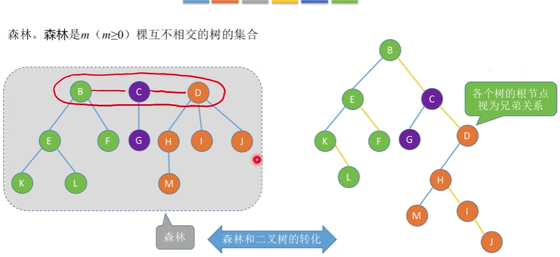

至于二叉树转换为树或者二叉树转换为森林只不过是上面步骤的逆过程，在此不做赘述。

# 五、树、森林的遍历

### ==【考点】树、森林、二叉树的遍历关系==

| 树   | 森林                                                         | 二叉树 |
| ---- | ------------------------------------------------------------ | ------ |
| 先根 | 先序（对森林里每一个树的**先根**）                           | 先序   |
| 后根 | 中序（一般也说是森林的**后根**）（对森林里每一个树的**后根**） | 中序   |

【技巧】实在是忘了关系了，可以现场画一个三个节点的树，试验一下。


## 1.树的遍历

树的遍历是指用某种方式访问树中的每个结点，且仅访问一次。主要有两种方式：

1. **先根遍历**。若树非空，先访问根结点，再依次遍历根结点的每棵子树，遍历子树时仍遵循先根后子树的规则。其遍历序列与这棵树相应二叉树的先序序列相同。
2. **后根遍历**。若树非空，先依次遍历根结点的每棵子树，再访问根结点，遍历子树时仍遵循先子树后根的规则。其遍历序列与这棵树相应二叉树的中序序列相同。

下图的树的先根遍历序列为A BEF C DG，后根遍历序列为EFB C GDA。


另外，树也有层次遍历，与二叉树的层次遍历思想基本相同，即按层序依次访问各结点。

---

树的先根遍历和后根遍历是**深度优先遍历**。

树的层次遍历是**广度优先遍历**。

## 2.森林的遍历

按照森林和树相互递归的定义，可得到森林的两种遍历方法。

1. **先序遍历**。若森林为非空，则按如下规则进行遍历:
   1. 访问森林中第一棵树的根结点。
   2. 先序遍历第一棵树中根结点的子树森林。
   3. 先序遍历除去第一棵树之后剩余的树构成的森林。
2. **中序遍历**。森林为非空时，按如下规则进行遍历:
   1. 后序遍历森林中第一棵树的根结点的子树森林。
   2. 访问第一棵树的根结点。
   3. 后序遍历除去第一棵树之后剩余的树构成的森林。

森林的先序遍历序列为ABCD EF GHI，后序遍历序列为BCDA FE HIG。


当森林转换成二叉树时，其第一棵树的子树森林转换成左子树，剩余树的森林转换成右子树，可知森林的先序和后序遍历即为其对应二叉树的先序和中序遍历。


# 六、应用

## 1.==【考点】二叉排序树BST==

> 与 7.查找 那一部分的内容完全相同

### 1.1定义

**二叉排序树**（Binary Sort Tree），又称**二叉查找树**（Binary Search Tree），二叉搜索树，排序二叉树。

它或者是一棵空二叉树，或者具有以下性质：

==**左子树 < 根节点 < 右子树**==（所以**中序遍历**会得到一个有序序列）

1. <u>左子树上所有结点的关键字均小于根结点的关键字；</u>
2. <u>右子树上的所有结点的关键字均大于根结点的关键字；</u>
3. <u>左子树和右子树又各是一棵二叉排序树。</u>
4. <u>默认**不允许**有两个结点的**关键字（data）相同**。</u>


下图值为10的结点的右子树为5，比10小，不满足条件2，所以这棵树不是二叉搜索树。


可以进行**中序遍历**，得到一个**递增的序列**。

适用于需要快速查找、插入和删除数据的场景。

插入和删除操作的时间复杂度为 O(log n)，其中 n 是树中节点的个数。

查找操作的时间复杂度也为 O(log n) 在平均情况下，但在最坏情况下可能为 O(n)。

#### ==【考点】BST树结点删增后的变化==

1. 如果删去的**是叶结点**，那么增加回来就与原来的树**相同**。
2. 如果删去的**不是叶结点**，那么增加回来就与原来的树**不相同**。


### 1.2存储结构

```c
// 二叉树的二叉链表结点结构定义
typedef int ElemType;

typedef struct BSTNode
{
	ElemType data;	//结点数据
	struct BSTNode *lchild, *rchild;	//左右孩子指针
} BSTNode, *BSTree;
```

### 1.3查找

查找操作的时间复杂度也为 **O(log n)** 在平均情况下，但在最坏情况下可能为 O(n)。

步骤：

1. 查找从根结点开始，如果树为空，返回NULL。
2. 若搜索树非空，则根结点关键字和 X 进行比较，并进行不同处理：
   1. 若 X **小于**根结点的键值，在**左子树**中继续搜索；
   2. 若 X 大于根结点的键值，在右子树中进行继续搜索；
   3. 若两者比较结果是相等，搜索完成，返回指向此结点的指针。

```c
// 递归查找二叉排序树T中是否存在X
*BSTNode Find(BSTree BST, ElemType X){
    if(!BST) return NULL; //查找失败

    if(X > BST->data)
        return Find(X, BST->rchild); //在右子树中继续查找
    else if(X < BST->Data)
        return Find(X, BST->lchild); //在左子树中继续查找
    else //X == BST->Data 
		return BST; //查找成功，返回结点的找到结点的地址
}
```

使用**递归**会导致效率不高。恰巧这段代码又是尾递归的方式（尾递归就是程序分支的最后，也就是最后要返回的时候才出现递归），从编译的角度来讲，**尾递归都可以用循环的方式去实现**。

由于非递归函数的执行效率高，可将“尾递归”函数改为迭代函数。

递归的时间复杂度：**O(h)**。

迭代的时间复杂度：**O(1)**。

```c
*BSTNode IterFind(BSTree BST, ElemType X){
    while(BST) {
        if(X > BST->data)
            BST = BST->rchild; //向右子树中移动，继续查找
        else if(X < BST->data)
            BST = BST->lchild; //向左子树中移动，继续查找
        else // X == BST->Data 
            return BST; //查找成功，返回结点的找到结点的地址
    }
	 return NULL; //查找失败
}
```

或者写为：

```c
*BSTNode IterFind(BSTree BST, ElemType X){
    while(BST!=NULL && X!=BST->data) {
        if(X > BST->data)
            BST = BST->rchild; //向右子树中移动，继续查找
        else if(X < BST->data)
            BST = BST->lchild; //向左子树中移动，继续查找
    }
    //最后在叶子结点还是没有找到，那么就会继续向下使得BST=NULL
	 return BST;
}
```

#### 1.3.1查找最大和最小元素

①最**大**元素一定是在树的**最右**分枝的端结点上。
②最**小**元素一定是在树的**最左**分枝的端结点上。

根据上述两点，我们可以很轻松的把代码（两种方式）写出来：

```c
//方法1：递归
*BiTNode FindMin(BinTree BST){
	 if(!BST) return NULL; //空的二叉搜索树，返回NULL
	 else if(!BST->lchild)
	 	return BST; //找到最左叶结点并返回
	 else
	 	return FindMin(BST->lchild); //沿左分支继续查找
}
*BiTNode FindMax(BinTree BST){
	 if(!BST) return NULL;
	 else if(!BST->rchild)
	 	return BST;
	 else
	 	return FindMin(BST->rchild);
}


//方法2：迭代函数
*BiTNode FindMin(BinTree BST){
	 if(BST)
	 	while(BST->lchild)  //沿右分支继续查找，直到最右叶结点
	 		BST = BST->lchild;
	 return BST;
}
*BiTNode FindMax(BinTree BST){
	 if(BST)
	 	while(BST->rchild)  //沿右分支继续查找，直到最右叶结点
	 		BST = BST->rchild;
	 return BST;
}
```

### 1.4插入

有了二叉排序树的查找函数，那么所谓的二叉排序树的插入，其实也就是将关键字放到树中的合适位置而已。

#### ==【考点】关键字有序深度最大==

如果插入的**关键字有序**，那么二叉排序树会形成一个长链，此时树的**深度最大**。


时间复杂度为 O(log n)，其中 n 是树中节点的个数。

```c
BiTree Insert(BiTree &BST, ElemType X){
    if(!BST){ //若原树为空，生成并返回一个结点的二叉搜索树
        BST = (BiTree)malloc(sizeof(struct BiTNode));
        BST->data = X;
        BST->lchild = BST->rchild = NULL;
    }
    else { //开始找要插入元素的位置
        if(X < BST->data)
            BST->lchild = Insert(BST->lchild, X);//递归插入左子树
        else if(X > BST->Data)
            BST->rchild = Insert(BST->rchild, X);//递归插入右子树
        //else X已经存在，什么都不做
    }
    return BST;
}
```

#### 1.4.1插入构造二叉排序树

有了二叉排序树的插入代码，我们要实现二叉排序树的构建就非常容易了，几个例子：

```c
int n=8;
int a[8] = {62, 88, 58, 47, 35, 73, 51, 99};
BSTree T;
CreateBST(T, a[], n);

//----------------------------------------
CreateBST(BSTree &T, int a[], int n){
    T=NULL;
    for(int i=0; i<10; i++){
        Insert(&T, a[i]);
}
```

上面的代码就可以创建一棵下图这样的树。

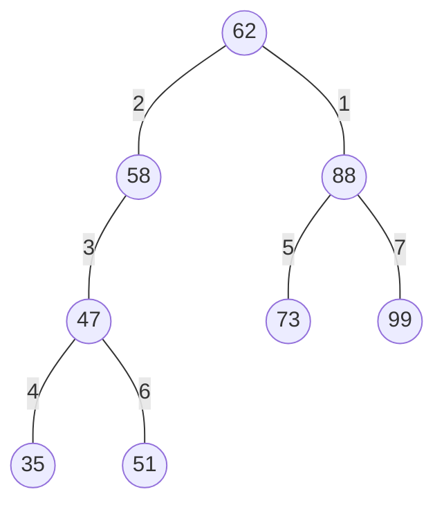
```mermaid
graph TB

%%左子树
1((62))--2---2((58))--3---4((47))--4---8((35))
2---5(( ))
4--6---9((51))

%%右子树
1((62))--1---3((88))--5---6((73))
3--7---7((99))

%%隐藏结点
style 5 fill: #f100,stroke-width:0px
%%隐藏路径
linkStyle 3 stroke:#0ff,stroke-width:0px
```

### ❗1.5删除

删除的结点有三种情况：

1. **叶子结点**：
   - 只需删除该结点不需要做其他操作。
2. **仅有左或右子树的结点**：
   - 删除后需让被删除结点的**直接后继（子树）**接替它的位置。
3. **左右子树都有的结点**：
   - 此时我们需要遍历得到被删除结点的直接前驱或者直接后继（**一般是右子树的最小结点，即右子树的中序第一个子女**），来接替它的位置，然后再删除那个最小的子女。


时间复杂度为 **O(log n)**，其中 n 是树中节点的个数。

```c
BiTree Delete(BiTree BST, ElemType X) { 
    *BiTNode Tmp; 
    if(!BST) 
        printf("BST is NULL");
    else {
        if(X < BST->data) 
            BST->lchild = Delete(BST->lchild, X);//从左子树递归删除
        else if(X > BST->data) 
            BST->rchild = Delete(BST->rchild, X);//从右子树递归删除

        //BST就是要删除的结点
        else {
            //如果被删除结点有左右两个子结点
            if(BST->lchild && BST->rchild) 
            {
                //从右子树中找最小的元素填充删除结点
                Tmp = FindMin(BST->rchild);
                BST->data = Tmp->data;
                //从右子树中删除最小元素
                BST->rchild = Delete(BST->rchild, BST->data);
            }
            //被删除结点有一个或无子结点
            else 
            {
                Tmp = BST; 
                if(!BST->lchild)    //只有右孩子或无子结点
                    BST = BST->rchild; 
                else                //只有左孩子
                    BST = BST->lchild;
                free(Tmp);
            }
        }
    }
    return BST;
}
```

### 1.6==【考点】查找性能分析==

二叉排序树的优点明显，插入删除的时间性能比较好。而对于二叉排序树的查找，走的就是从根结点到要查找的结点的路径，其比较次数等于给定值的结点在二叉排序树的**层数**。

极端情况，最少为1次，即根结点就是要找的结点；最多也不会超过树的深度。也就是说，**二叉排序树的查找性能取决于二叉排序树的形状（==深度==）**。可问题就在于，二叉排序树的形状是不确定的。

例如 {62 , 88 , 58 , 47 , 35 , 73 , 51 , 99 , 37 , 93} 这样的数组，我们可以构建如下左图的二叉排序树。但如果数组元素的次序是从小到大有序，如{35,37,47,51,58,62,73,88,93,99}，则二叉排序树就成了极端的右斜树，如下面右图的二叉排序树：


也就是说，我们希望**二叉排序树是比较平衡（左子树和左子树的高度之差不超过1）**的，即其深度与完全二叉树相同，那么查找的时间复杂也就为 **O(log n)**，近似于折半查找。

不平衡的最坏情况就是像上面右图的斜树（高度为n），查找时间复杂度为 **O(n)**，这等同于顺序查找。

因此，如果我们希望对一个集合按二叉排序树查找，最好是把它构建成一棵**平衡的二叉排序树**。


## 2.平衡二叉树AVL

> 与 7.查找 那一部分的内容完全相同

### 2.1定义

**平衡二叉树（Self-Balancing Binary Search Tree 或 Height-Balanced Binary Search Tree）**，是由前苏联的数学家 **A**delse-**V**elskil 和 **L**andis 在 1962 年提出的高度平衡的二叉树。

平衡二叉树（AVL树），它是 "平衡二叉搜索树" 的简称，它是一种**二叉排序树**，满足**左子树 < 根节点 < 右子树**。

它或者是一颗空树，或者是具有以下性质的二叉排序树：

1. <u>它的左子树和左子树的**高度之差（平衡因子）的绝对值不超过1**；</u>
2. <u>且它的左子树和右子树又都是一颗平衡二叉树。</u>

- **平衡因子（BF, Balance Factor）**：我们将二叉树上结点的**左子树深度减去右子树深度**的值称为**平衡因子**。

那么平衡二叉树上所有结点的平衡因子只可能是 -1、0和1。只要二叉树上有一个结点的平衡因子的绝对值大于1，则该二叉树就是不平衡的。

#### ==【考点】AVL树结点删增后的变化==

<u>**无论**删去的结点是不是**叶结点**，再加上之后**都有可能**与原来完全相同</u>。


追求更好的平衡二叉树，可以得到更好的二叉排序树，**提高排序和查询的效率**，不至于让一边的树的深度太大。

### 2.2存储结构

```c
// 平衡二叉树存储结构
typedef struct AVLNode{
    int data;		//数据域
    int balance;	//平衡因子
    struct AVLNode *lchild, *rclild;
}AVLNode,*AVLTree;
```


### 2.3查找

在平衡二叉树上进行查找的过程与二叉排序树的相同。因此，在查找过程中，与给定值进行比较的关键字个数不超过树的深度。

假设以 $n_h$ 表示深度为 h 的平衡树中含有的**最少结点数**。

显然，有 $n_0=0,n_1=1,n_2=2$，并且有 $n_h=n_{h-1}+n_{h-2}+1$。

#### ==【考点】平衡二叉树结点数与深度关系==

根据上面的递归公式：
$$
n(h) =
\begin{cases}
1, & if\ h=1 \\[1ex]
2, & if\ h=2 \\[1ex]
n_{h-1}+n_{h-2}+1 ,& if\ h>2 \\[1ex]
\end{cases}
$$
我们可以得到下面的表格（考试的时候建议直接先画出表格）

| 层数 | 此时二叉平衡树的最少结点数 |
| ---- | :------------------------- |
| 1    | 1                          |
| 2    | 2                          |
| 3    | 4                          |
| 4    | 7                          |
| 5    | 12                         |
| 6    | 20                         |
| 7    | 33                         |

> 【2012统考真题】若平衡二叉树的高度为 6，且所有非叶子结点的平衡因子均为1，则该平衡二叉树的结点总数为（B）。 
>
> A.12	 B.20 	C.32 	D.33

可以证明，含有 n 个结点的平衡二叉树的最大深度为 $O(log2n)$，因此平衡二叉树的平均查找长度为 $O(log2n)$ 如下图所示：


### ❗2.4插入（保持平衡）

二叉排序树保证平衡的基本思想：每当在二叉排序树中插入(或删除)一个结点时，首先检查其插入路径上的结点是否因为此次操作而导致了不平衡。若导致了不平衡，则先找到插入路径上离插入结点最近的平衡因子的绝对值大于 1 的结点A，再对以A为根的子树（**最小不平衡子树**），在保持二叉排序树特性的前提下，调整各结点的位置关系，使之重新达到平衡。

【注意】每次调整的对象都是**最小不平衡子树**。

**最小不平衡子树**：以插入路径上离插入结点最近的平衡因子的绝对值大于 1 的结点作为根的子树。下图中的虚线框内为最小不平衡子树：


平衡二叉树的插入过程的前半部分与二叉排序树相同，但在新结点插入后，若造成查找路径上的某个结点不再平衡，则需要做出相应的调整。可将调整的规律归纳为下列4种情况：


#### 2.4.1 LL平衡旋转(右单旋转)

<u>在结点A的**左孩子(L)**的**左子树(L)**上插入了新结点，导致了不平衡。</u>

LL平衡旋转（右单旋转）。由于在结点A的左孩子(L)的左子树(L)上插入了新结点，使得（图a->b）A的平衡因子由1增至2，导致以A为根的子树失去平衡，需要一次向右的旋转操作。

将A的左孩子**B向右上旋转代替A**成为根结点，将A结点向**右下旋转**成为B的右子树的根结点，而B的原右子树则作为A结点的左子树。（见下面动图所示）

如下图所示，结点旁的数值代表结点的平衡因子，而用方块表示相应结点的子树，下方数值代表该子树的高度。

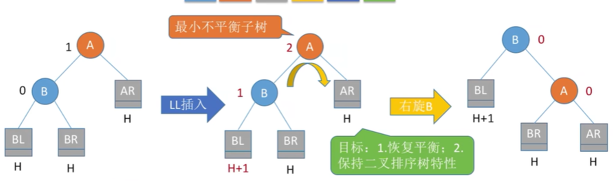


CODE：

```c
//f是父结点A，p是左孩子B，gf是父结点的父结点A的父结点
f->lchild = p->rchild;	//把B的左孩子BL放到B的位置
p->rchild = f;		//B和A右旋，A变成B的右孩子
gf->lchild/rchild = p;	//A的父结点现在指向B
```


#### 2.4.2 RR平衡旋转(左单旋转)

<u>在结点A的**右孩子(R)**的**右子树(R)**上插入了新结点，导致了不平衡。</u>

RR平衡旋转（左单旋转）。由于在结点A的右孩子(R)的右子树(R)上插入了新结点，使得（图a->b）A的平衡因子由-1减至-2，导致以A为根的子树失去平衡，需要一次向左的旋转操作。

将A的右孩子**B向左上旋转代替A**成为根结点，将A结点向**左下旋转**成为B的左子树的根结点，而B的原左子树则作为A结点的右子树。

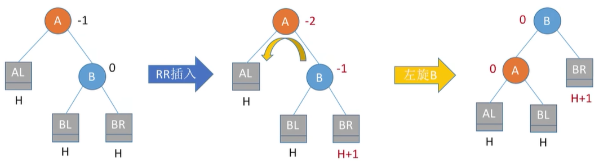


CODE：

```c
//f是父结点A，p是左孩子B，gf是父结点的父结点A的父结点
f->rchild = p->lchild;
p->lchild = f;		//B和A右旋
gf->lchild/rchild = p;	//A的父结点现在指向B
```


#### 2.4.3 LR平衡旋转(先左后右双旋转)

<u>在A的**左孩子(L)**的**右子树(R)**上插入新结点，导致了不平衡。</u>

LR平衡旋转（先左后右双旋转）。由于在A的左孩子(L)的右子树(R)上插入新结点，A的平衡因子由1增至2，导致以A为根的子树失去平衡，需要进行两次旋转操作，先左旋转后右旋转。

先将A结点的左孩子B的右子树的根结点**C向左上旋转提升到B结点的位置**（即进行一次RR平衡旋转(左单旋转)），然后再把该**C结点向右上旋转提升到A结点的位置**（即进行一次 LL平衡旋转(右单旋转) ）。


#### 2.4.4 RL平衡旋转(先右后左双旋转)

<u>在A的**右孩子(R)**的**左子树(L)**上插入新结点，导致了不平衡。</u>

RL平衡旋转（先右后左双旋转）。由于在A的右孩子(R)的左子树(L)上插入新结点，A的平衡因子由-1减至-2，导致以A为根的子树失去平衡，需要进行两次旋转操作，先右旋转后左旋转。

先将A结点的右孩子B的左子树的根结点**C向右上旋转提升到B结点的位置**（即进行一次LL平衡旋转(右单旋转)），然后再把该**C结点向左上旋转提升到A结点的位置**（即进行一次RR平衡旋转(左单旋转)）。

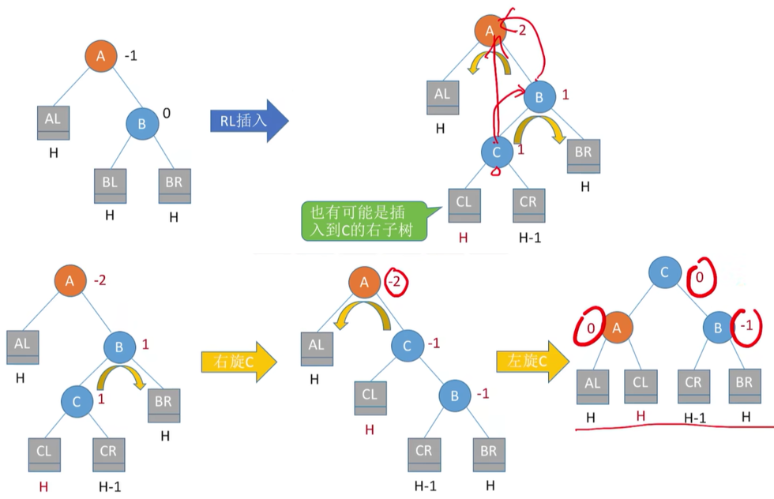


**【注意】LR和RL旋转时，新结点究竟是插入C的左子树还是插入C的右子树不影响旋转过程。**

二叉排序树还有另外的平衡算法，如**红黑树(Red Black Tree)**等，与**平衡二叉树(AVL树)**相比各有优势。

#### 2.4.5题解

>例子：
>
>假设关键字序列为 15 , 3 , 7 , 10 , 9 , 8 通过该序列生成平衡二叉树的过程如下图所示：
>
>


#### ==【考点】插入步骤==

1. 找到**最小不平衡子树**的根节点；
2. 判断旋转方式；
3. 进行旋转（**根节点改变**和**子树迁移**）；
4. 检查：是否符合**左 < 根 < 右**。


> 【RR】**R子树**根节点替代**最小不平衡子树**的根节点。
>
> 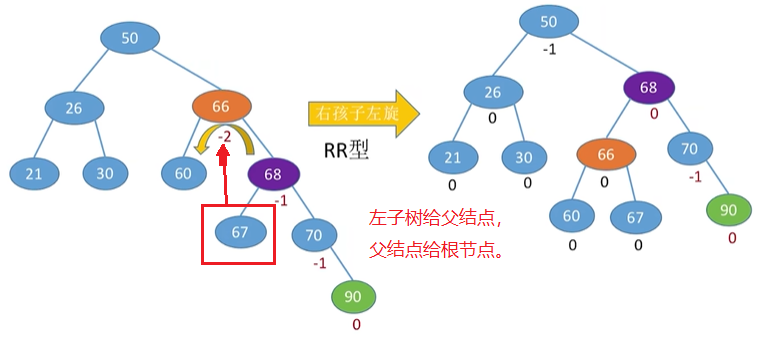
>
> 【LR】根节点的左子树L --变成--> 父结点的右子树R
> 根节点的右子树R --变成--> 爷结点的左子树L
> 根节点 --变成--> 爷爷结点
>
> 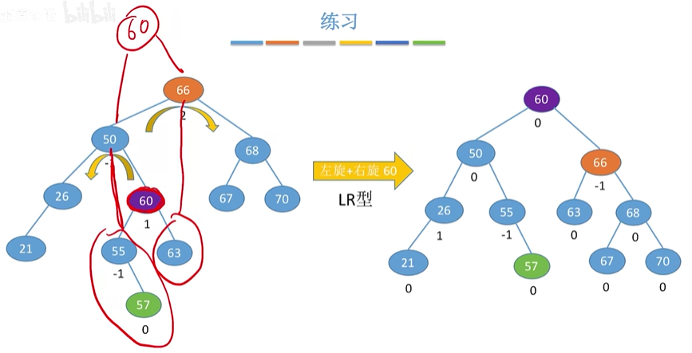
>
> 【RL】根节点的右子树R --变成--> 父结点的左子树L
> 根节点的左子树L --变成--> 爷结点的右子树R
> 根节点 --变成--> 爷爷结点
>
> 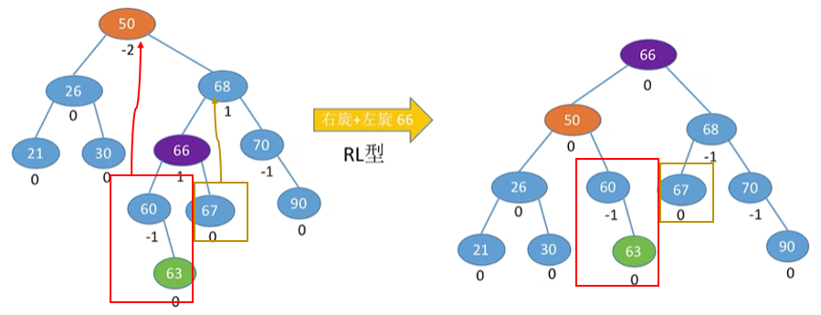


### 2.5查找性能分析

若树高为 h，则最坏情况下，查找一个关键字最多需要对比 h 次，即查找操作的时间复杂度不可能超过O(h)。

因为平衡二叉树的左右子树之间高度差不会超过1，

所以假设 $n_h$ 表示高度为 h 的平衡二叉树的含有的**最少的结点数**。

则有：
$$
n_0 = 0\\
n_1 = 1\\
n_2 = 2\\
那么可以推出:\\
n_h = n_{h-1} + n_{h-2} + 1\\
含义为:左子树的最少结点数 + 右子树的最少结点数 + 根节点\\
那么就有:\\
n_3=4;n_4=7;n_5=12;n_6=20...
$$
那么，如果知道了结点数 n，就可以推断出整棵树的最大高度 h。

> eg: 这棵树有n=9个结点，求最大高度h.
>
> 那么因为 $n_4=7;n_5=12$，而 7 < 9 < 12.
>
> 想要高度为 5，至少需要12个结点，所以这棵树的最大高度 h 为4.
>
> 那么知道高度了，就能够得到时间复杂度O(4)。

可以证明含有 n 个结点的平衡二叉树的最大深度为 **O(log2 n)**，平衡二叉树的平均查找长度为 **O(log2 n)**。


### 2.6删除

平衡二叉树的删除操作删除结点后，也要**保持二叉排序树的特性不变**（左<中<右）。若删除结点导致不平衡，则需要调整平衡。

---

平衡二叉树的删除操作具体步骤：

1. 删除结点 （方法同“二叉排序树”）；

   1. **叶子结点**：直接删除。
   2. **仅有左或右子树的结点**：删除后，让被删除结点的**直接后继（子树）**接替它的位置。
   3. **左右子树都有的结点**：删除后，用**右子树的最小结点，即右子树的中序第一个子女**来接替它的位置，然后再删除这个最小的子女。

2. 一路向上找到**最小不平衡子树**，找不到就说明平衡，完结撒花return；

3. 找最小不平衡子树下，高度最高的儿子、孙子；

4. 根据孙子的位置，**调整平衡**（LL/RR/LR/RL）；

   1. 孙子在LL：儿子右单旋。
   2. 孙子在RR：儿子左单旋。
   3. 孙子在LR：孙子先左旋，再右旋。
   4. 孙子在RL：孙子先右旋，再左旋。

5. 如果还不平衡向上传导，继续②。

   对最小不平衡子树的旋转可能导致树变矮，从而导致上层祖先不平衡（不平衡的向上传递）


> 更多相关查找树（如红黑树，B树，B+树）看 7.查找 章节。


## 3.哈夫曼树和哈夫曼编码

### 3.1==【考点】带权路径长度 WPL==

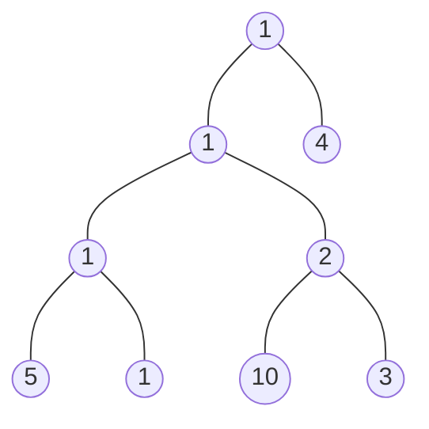
```mermaid
graph TB

%%左子树
1((1))---2((1))---4((1))---8((5))
2---5((2))---10((10))
4---9((1))
5---11((3))

%%右子树
1((1))---3((4))

%%隐藏结点
%%style 9 fill: #f100,stroke-width:0px
%%隐藏路径
%%linkStyle 5,6 stroke:#0ff,stroke-width:0px
```

结点的**权**：有某种现实含义的数值（如：表示结点的重要性等）。

结点的**带权路径长度**：从树的根到该结的路径长度（经过的边数）与该结点上权值的乘积。
$$
\color{red}结点的带权路径长度=权×边数
$$

> 比如第四层第四个结点度为3，它的带权路径长度：边数 * 权 = 3*3 = 9

树的**带权路径长度**（**WPL**, weighted path length）：树中的所有的**==叶子==节点**的**带权路径长度的和**。
$$
WPL(树的带权路径长度)=\sum_{i=1}^n w_il_i
$$

- $w_i$是第i个叶结点所带的权值；
- $l_i$是第i个叶结点到根结点的路径长度。

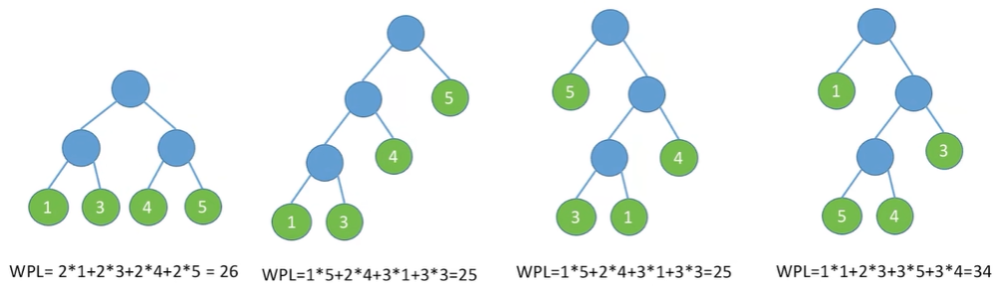

### 3.2哈夫曼树的定义、特点

**哈夫曼树（Huffman Tree）**：在含有n个带权叶子节点的二叉树中，其中**带权路径长度(WPL)最小的二叉树**称为哈夫曼树，也称**最优二叉树**。

> 例如，在上图求WPL的四棵树中，都是4个同样权值的叶子节点，中间两棵树的WPL最小，那么它们两个就是哈夫曼树。

#### 3.2.1==【考点】哈夫曼树特点==

1. **每个初始结点最终都成为叶结点**，且权值越小的结点到根结点的路径长度越大。

2. 哈夫曼树中**不存在度为1的结点**。要么是叶子结点，要么是有两个度。

   > 解释度为1：就是只有一个孩子结点。

3. ==哈夫曼树的**结点总数为 $2n_0 - 1$**==。

   因为共有n个叶子结点，也就是两两合成 n-1 次，就多了**n-1个分支节点**，n-1+n = 2n-1。

4. **哈夫曼树并不唯一，但WPL必然相同且最优**。

5. 把二叉树上的所有分支都进行编号，将所有**左分支都标记为0**，所有右分支都标记为1。

6. 对于树上的任何一个结点，都可以根据从根结点到该结点的路径唯一确定一个编号。

【不足】当权值大小相差不大的时候，哈夫曼压缩效果不理想。


### 3.3==【考点】哈夫曼树的构造==

步骤：

1. 先把有权值的叶子结点按照从大到小（从小到大也可以）的顺序排列成一个有序序列。
2. 取最后两个最小权值的结点作为一个新节点的两个子结点，注意<u>相对较小的是左孩子</u>（可以不是）。
3. 用第2步构造的新结点替掉它的两个子节点，插入有序序列中，保持从大到小排列。
4. 重复步骤2到步骤3，直到根节点出现。

看图就清晰了，如下图所示：


#### 代码实现

```c
typedef double DataType; //结点权值的数据类型

typedef struct HTNode //单个结点的信息
{
	DataType weight; //权值
	int parent; //父节点
	int lc, rc; //左右孩子
}*HuffmanTree;
```

代码实现时，我们用一个数组（**静态三叉链表**）存储构建出来的哈夫曼树中各个结点的基本信息（权值、父结点、左孩子以及右孩子）。该数组的基本布局如下：

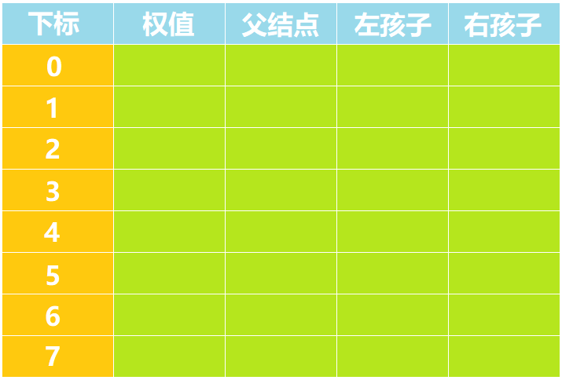

我们以“用数字7、5、4、2构建一棵哈夫曼树”为例，代码的基本实现步骤如下：

- 第一阶段

所构建的哈夫曼树的总结点个数为2 × 4 − 1 = 7，但是这里我们开辟的数组可以存储8个结点的信息，因为数组中下标为0的位置我们不存储结点信息，具体原因后面给出。

我们先将用于构建哈夫曼树的数字7、5、4、2依次赋值给数组中下标为1-4的权值位置，其余信息均初始化为0。

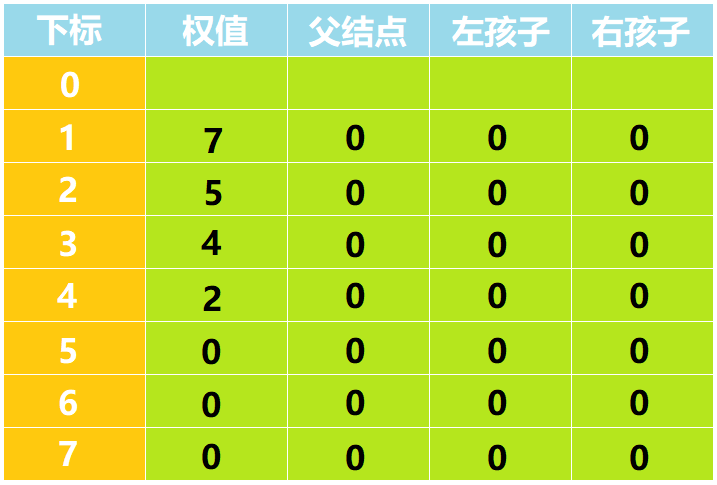

- 第二阶段

从数组中下标为1-4的元素中，选取权值最小，并且父结点为0（代表其还没有父结点）的两个结点，生成它们的父结点：

 1、下标为5的结点的权值等于被选取的两个结点的权值之和。
 2、两个被选取的结点的父结点就是下标为5的结点。
 3、下标为5的结点左孩子是被选取的两个结点中权值较小的结点，另外一个是其右孩子。

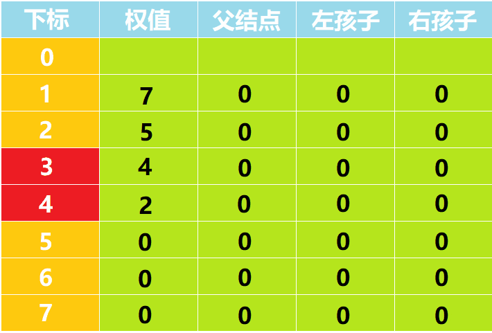

再从数组中下标为1-5的元素中，选取权值最小，并且父结点为0的两个结点，生成它们的父结点。

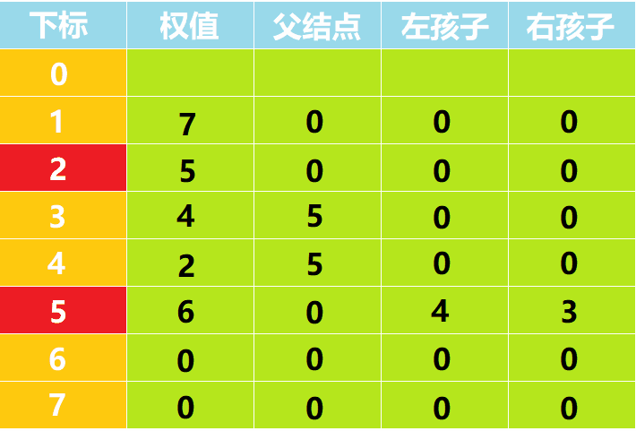

继续从数组中下标为1-6的元素中，选取权值最小，并且父结点为0的两个结点，生成它们的父结点。


此时，除了下标为0的元素以外，数组中所有元素均已有了自己的结点信息，哈夫曼树已经构建完毕。

**为什么数组中下标为0的元素不存储结点信息？**

因为在数组中叶子结点的左右孩子是0，根结点的父结点是0，我们若是用数组中下标为0元素存储结点信息，那么我们将不能区分左右孩子为0的结点是叶子结点还是说该结点的左右孩子是下标为0的结点，同时也不知道哈夫曼树的根结点到底是谁。

```c++
// 在下标为1到i-1的范围(n个数)找到权值最小的两个值的下标, 其中s1的权值小于s2的权值, 返回s1和s2的下标
// HT是哈夫曼树的根结点，n是叶子结点的个数
void Select(HuffmanTree& HT, int n, int& s1, int& s2)
{
	int min;
	//找第一个最小值
	for (int i=1; i <= n; i++){
		if (HT[i].parent == 0){
			min = i;
			break;
		}
	}
	for (int i= min+1; i <= n; i++){
		if (HT[i].parent == 0 && HT[i].weight < HT[min].weight)
			min = i;
	}
	s1 = min; //第一个最小值给s1

	//找第二个最小值
	for (int i=1; i <= n; i++){
		if (HT[i].parent == 0 && i != s1){
			min = i;
			break;
		}
	}
	for (int i= min+1; i <= n; i++){
		if (HT[i].parent == 0 && HT[i].weight < HT[min].weight && i != s1)
			min = i;
	}
	s2 = min; //第二个最小值给s2
}


// 构建哈夫曼树
// HT是哈夫曼树的根结点，w是n个叶子结点的权值数组，n是叶子结点(初始节点)的个数
void CreateHuff(HuffmanTree& HT, DataType* w, int n)
{
	// step1.分配足够空间
	int number = 2*n - 1; //哈夫曼树总结点数

	HT = (HuffmanTree)calloc(number + 1, sizeof(HTNode)); //开m+1个HTNode，因为下标为0的HTNode不存储数据
	if (!HT){
		printf("分配内存失败\n");
		exit(0);
	}

	// step2.构建叶子结点
	for (int i=1; i <= n; i++){
		HT[i].weight = w[i - 1]; //赋权值给n个叶子结点
	}

	// step3.构建哈夫曼树(分支节点)，所以从新位置开始
	for (int i= n+1; i <= number; i++){
		//选择权值最小的s1和s2，生成它们的父结点
		int s1, s2;
		Select(HT, i-1, s1, s2); //在下标为1到i-1的范围找到权值最小的两个值的下标，其中s1的权值小于s2的权值
		HT[i].weight = HT[s1].weight + HT[s2].weight; //i的权重是s1和s2的权重之和
		HT[s1].parent = i; //s1的父亲是i
		HT[s2].parent = i; //s2的父亲是i
		HT[i].lc = s1; //左孩子是s1
		HT[i].rc = s2; //右孩子是s2
	}
}


//打印哈夫曼树中各结点之间的关系
void PrintHuff(HuffmanTree HT, int n)
{
	printf("下标   权值     父结点   左孩子   右孩子\n");
	printf("0                                  \n");
	for (int i=1; i <= n; i++)
	{
		printf("%-4d   %-6.2lf   %-6d   %-6d   %-6d\n", i, HT[i].weight, HT[i].parent, HT[i].lc, HT[i].rc);
	}
		printf("\n");
}
```

注：为了避免使用二级指针，函数传参使用了C++中的引用传参。


### 3.4==【考点】哈夫曼编码==

赫夫曼当前研究这种最优树的目的是为了解决当年远距离通信（主要是电报）的数据传输的最优化问题。

哈夫曼编码是一种被广泛应用而且非常有效的**数据压缩**编码。

比如我们有一段文字内容为“ BADCADFEED”要网络传输给别人，显然用二进制的数字(0和1)来表示是很自然的想法。我们现在这段文字只有六个字母ABCDEF，那么我们可以用相应的二进制数据表示，如下表所示：

| 字母       | A    | B    | C    | D    | E    | F    |
| ---------- | ---- | ---- | ---- | ---- | ---- | ---- |
| 二进制字符 | 000  | 001  | 010  | 011  | 100  | 101  |

这样按照固定长度编码编码后就是“001000011010000011101100100011”，对方接收时可以按照3位一分来译码。如果一篇文章很长，这样的二进制串长度也将非常的可怕。

事实上，不管是英文、中文或是其他语言，字母或汉字的**出现频率是不相同的**。

假设六个字母的频率为A 27, B 8, C 15, D 15, E 30, F 5,合起来正好是100%。那就意味着，我们完全可以重新按照赫夫曼树来规划它们。

下图为构造赫夫曼树的过程的权值显示：

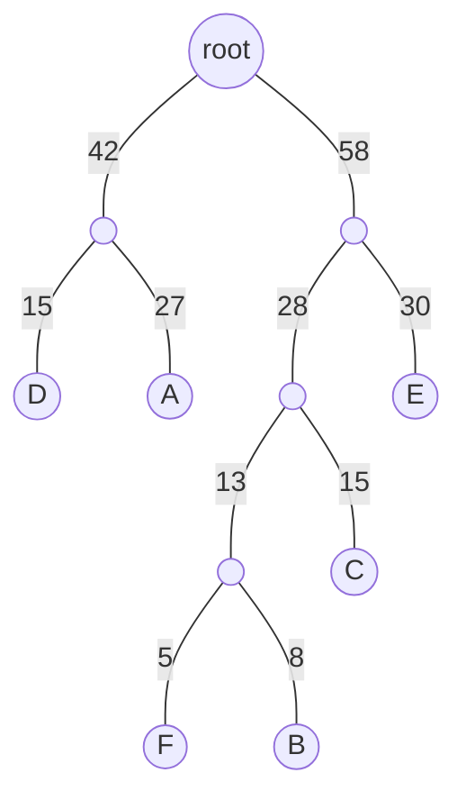
```mermaid
graph TB

%%左子树
1((root))--42---2(( ))--15---4((D))
2--27---5((A))

%%右子树
1--58---3(( ))--28---6(( ))--13---12(( ))--5---24((F))
3--30---7((E))
6--15---13((C))
12--8---25((B))
```

将权值==**左分支改为0，右分支改为1**==后的赫夫曼树：

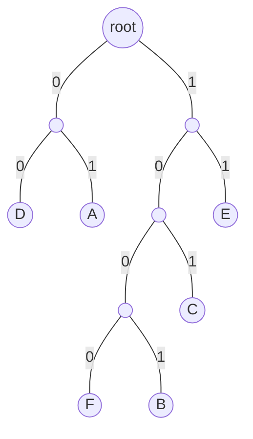
```mermaid
graph TB

%%左子树
1((root))--0---2(( ))--0---4((D))
2--1---5((A))

%%右子树
1--1---3(( ))--0---6(( ))--0---12(( ))--0---24((F))
3--1---7((E))
6--1---13((C))
12--1---25((B))
```

这哈夫曼树的WPL为：

WPL = 2\*( 15 + 27 + 30 ) + 3\*15 + 4\*( 5 + 8 ) = 241

此时，我们对这六个字母用其从树根到叶子所经过路径的0或1来编码，可以得到如下表所示这样的定义：

| 字母       | A    | B    | C    | D    | E    | F    |
| ---------- | ---- | ---- | ---- | ---- | ---- | ---- |
| 二进制字符 | 01   | 1001 | 101  | 00   | 11   | 1000 |

**路径长度（边数） = 编码的位数**

---

**固定长度**编码：每个字符用相等长度的二进制位表示。

**可变长度**编码：允许对不同字符用不等长的二进制位表示。

==**前缀编码**：若**没有**一个编码是另一个编码的前缀，则称这样的编码为**前缀编码**。==

由哈夫曼树得到哈夫曼编码：字符集中的每个字符作为一个**叶子结点**，各个字符**出现的频度作为结点的权值**，根据之前介绍的方法构造哈天曼树。

---

这里使用的就是可变长度编码，并且是前缀编码，这样就不会有歧义。

我们将文字内容为“ BADCADFEED”再次编码，对比可以看到结果串变小了。

原编码二进制串: 000011000011101100100011 (共 30 个字符)
新编码二进制串: 10100101010111100(共 25 个字符)

也就是说，我们的数据被压缩了，节约了大约17%的存储或传输成本。

#### ==【考点】压缩比（加权平均长度）==

$$
加权平均长度= \frac{带权路径长度WPL}{根结点和(所有叶节点出现的频率的次数和)}
$$

原本ABCDEF这6个字符，最少使用3位二进制数表示，即每个字符用3位。

通过哈夫曼树进行优化之后，按照出现频率（六个字母的频率为A 27, B 8, C 15, D 15, E 30, F 5）计算**加权平均长度**（字符位数）：

因为六个字母出现的和 = 100

2\*0.27 + 4\*0.08 + 3\*0.15 + 2\*0.15 + 2\*0.3 + 4\*0.05 = 2.41位

未压缩长度3位（3位二进制表示），压缩后长度2.41，那么压缩比为：

$\displaystyle \frac {3-2.41}3 = 0.197= 19.7\%$


#### 代码实现

一个字符串若是想要容纳下“用n个数据生成的哈夫曼编码”中的任意一个编码，那么这个字符串的长度应该为n，因为我们还需要用一个字节的位置用于存放字符串的结束标志`\0`。

我们就以数字7、5、4、2构建的哈夫曼树为例，哈夫曼编码生成的基本实现步骤如下：

- 第一阶段

因为数据个数为4，所以我们开辟一个大小为4的辅助空间，并将最后一个位置赋值为`\0`，用于暂时存放正在生成的哈夫曼编码。

](imgs-DS/5哈夫曼编码1.png)

为了存放这4个数据哈夫曼编码，我们开辟一个字符指针数组，该数组中有5个元素，每个元素的类型为`char**`，该字符指针数组的基本布局如下：

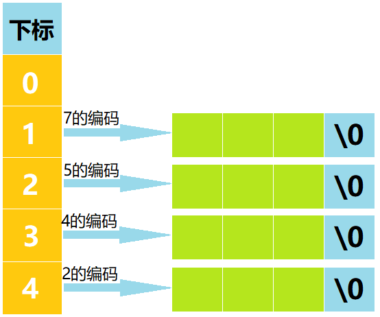

【注意】这里为了与 “构建哈夫曼树时所生成的数组” 中的下标相对应，所以该字符指针数组中下标为0的元素也不存储有效数据。

- 第二阶段

利用已经构建好的哈夫曼树，生成这4个数据的哈夫曼编码。单个数据生成哈夫曼编码的过程如下：

 1、判断该数据结点与其父结点之间的关系，若该数据结点是其父结点的左孩子，则将start指针前移，并将0填入start指向的位置，若是右孩子，则在该位置填1。

 2、接着用同样的方法判断其父结点与其父结点的父结点之间的关系，直到待判断的结点为哈夫曼树的根结点为止，该结点的哈夫曼编码生成完毕。

 3、将字符串中从start的位置开始的数据拷贝到字符指针数组中的相应位置。

这里我们以生成数据5的哈夫曼编码为例：

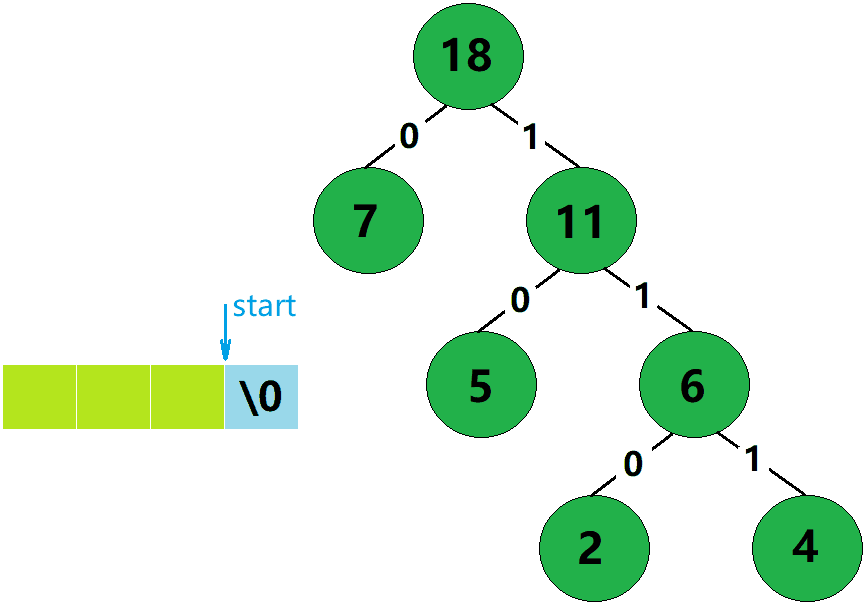

**【注意】**在每次生成数据的哈夫曼编码之前，先将start指针指向`\0`。

按照此方式，依次生成7、5、4、2的哈夫曼编码后，字符指针数组的基本布局如下：

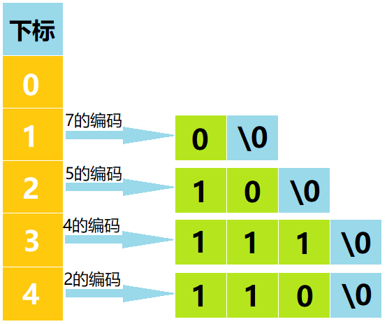

哈夫曼编码生成完毕。

代码如下：

```c++
//生成哈夫曼编码
void HuffCoding(HuffmanTree& HT, HuffmanCode& HC, int n)
{
	HC = (HuffmanCode)malloc(sizeof(char*) * (n+1)); //开n+1个空间char**，因为下标为0的空间不用

	char* code = (char*)malloc(sizeof(char) * n); //辅助空间，编码最长为n(最长时，前n-1个用于存储数据，最后1个用于存放'\0')
	code[n - 1] = '\0'; //辅助空间最后一个位置为'\0'

	for (int i = 1; i <= n; i++)
	{
		int start = n - 1; //每次生成数据的哈夫曼编码之前，先将start指针指向'\0'
		int c = i; //正在进行的第i个数据的编码
		int parent_c = HT[c].parent; //找到该数据的父结点

		while (parent_c) //直到父结点为0，即父结点为根结点时，停止
		{
			//如果该结点是其父结点的左孩子，则编码为0，否则为1
			if (HT[parent_c].lc == c)
				code[--start] = '0';
			else
				code[--start] = '1';

			c = parent_c; //继续往上进行编码
			parent_c = HT[c].parent; //c的父结点
		}

		HC[i] = (char*)malloc(sizeof(char) * (n-start)); //开辟用于存储编码的内存空间
		strcpy(HC[i], &code[start]); //将编码拷贝到字符指针数组中的相应位置
	}
	free(code); //释放辅助空间
}
```

### ❗3.5哈夫曼树-C++

```c++
/* 二叉树
	哈夫曼树：在含有n个带权叶子节点的二叉树中，
	其中带权路径长度(WPL)最小的二叉树称为哈夫曼树，也称最优二叉树。

用一个 静态三叉链表 来存储
C++实现

*/

#include <stdio.h>
#include <stdlib.h>
#include <string.h>
#include <math.h>


typedef double DataType; //结点权值的数据类型

typedef struct HTNode //单个结点的信息
{
	DataType weight; //权值
	int parent; //父节点
	int lc, rc; //左右孩子
} *HuffmanTree;
typedef char **HuffmanCode;	//字符指针数组中存储的元素类型

void Select(HuffmanTree& HT, int n, int& min1, int& min2);
void Select2(HuffmanTree& HT, int n, int& s1, int& s2);	//在哈夫曼树中选择两个权值最小的结点
void Select3(HuffmanTree& HT, int n, int& s1, int& s2);
void CreateHuff(HuffmanTree& HT, DataType* w, int n); //构建哈夫曼树
void PrintHuff(HuffmanTree HT, int n); //打印哈夫曼树
void HuffCoding(HuffmanTree& HT, HuffmanCode& HC, int n);	//哈夫曼编码

double GetWpl(HuffmanTree HT, int n, int target);
double GetWPL(HuffmanTree HT, int n);
double GetAverageLength(HuffmanTree HT, HuffmanCode HC, int n);
double GetCompressionRate(HuffmanTree HT, HuffmanCode HC, int n);


int main()
{
	//测试数据
	int n = 1;
	DataType w[] = {27,8,15,15,30,5};
	// 获取长度
	n = sizeof(w)/sizeof(DataType);

	//创建哈夫曼树
	HuffmanTree HT;
	CreateHuff(HT, w, n);

	//打印哈夫曼树
	PrintHuff(HT, n);

	HuffmanCode HC;
	HuffCoding(HT, HC, n);

	//打印哈夫曼编码
	for (int i=1; i <= n; i++){
		printf("%.2lf的哈夫曼编码是：%s\n", HT[i].weight, HC[i]);
	}

	//计算哈夫曼树的带权路径长度
	printf("\n哈夫曼树的带权路径长度WPL是：%.2lf\n", GetWPL(HT,n));

	// GetAverageLength(HC, n);
	printf("压缩率是 %.2lf %%", GetCompressionRate(HT, HC, n)*100);


	return 0;
}


// ------------------------- 哈夫曼树 构建------------------------

// 在下标为1到i-1的范围(n是叶子结点数)找到权值最小的两个值的下标, 其中s1的权值小于s2的权值, 返回s1和s2的下标
void Select2(HuffmanTree& HT, int n, int& s1, int& s2)
{
	int min;
//找第一个最小值
	//初始化，把第一个父结点为0的叶子结点作为最小值
	for (int i=1; i <= n; i++){
		if (HT[i].parent == 0){
			min = i;
			break;
		}
	}
	//在剩下的n-1个父结点为0的叶子结点中，找到权值最小的
	for (int i= min+1; i <= n; i++){
		if (HT[i].parent == 0 && HT[i].weight < HT[min].weight)
			min = i;
	}
	s1 = min; //第一个最小值给s1

//找第二个最小值
	for (int i=1; i <= n; i++){
		if (HT[i].parent == 0 && i != s1){
			min = i;
			break;
		}
	}
	for (int i= min+1; i <= n; i++){
		if (HT[i].parent == 0 && HT[i].weight < HT[min].weight && i != s1)
			min = i;
	}
	s2 = min; //第二个最小值给s2
}

/*
设立两个变量，x(min1)，y(min2)
将数组前两个值赋值给x，y；
比对x，y的大小，
更大的值给y，更小的值给x
循环数组，与y对比，当小于y时，与x对比，若小于x，则将x的值给y，x的值为min；
大于x则将min赋值给y；
*/
void Select(HuffmanTree& HT, int n, int& min1, int& min2)
{
	//初始化，把第一个父结点为0的叶子结点作为最小值
	for (int i=1; i <= n; i++){
		if (HT[i].parent == 0){
			min1 = i;
			break;
		}
	}
	for (int i=1; i <= n; i++){
		if (HT[i].parent == 0 && i!=min1){
			min2 = i;
			break;
		}
	}
	//min1比min2小
	if (HT[min1].weight > HT[min2].weight){
		int temp = min1;
		min1 = min2;
		min2 = temp;
	}

	for (int i=1; i <= n; i++){
		if(HT[i].parent == 0){
			if (HT[i].weight < HT[min1].weight){
				min2 = min1;
				min1 = i;
			}else if (HT[i].weight < HT[min2].weight && i != min1){
				min2 = i;
			}
		}
	}
}

void Select3(HuffmanTree& HT, int n, int& s1, int& s2)
{
	double min1=255, min2=255; //初始化，把第一个父结点为0的叶子结点作为最小值
	s1=s1=0;
	for (int i=1; i <= n; i++){
		if(HT[i].parent == 0){
			if (HT[i].weight < min1){
				min2 = min1, s2 = s1;
				min1 = HT[i].weight, s1 = i;
			}else if (HT[i].weight < min2){
				min2 = HT[i].weight, s2 = i;
			}
		}
	}
}


// 构建哈夫曼树
// HT是哈夫曼树的根结点，w是n个叶子结点的权值数组，n是叶子结点(初始节点)的个数
void CreateHuff(HuffmanTree& HT, DataType* w, int n)
{
	// step1.分配足够空间
	int number = 2*n - 1; //哈夫曼树总结点数

	HT = (HuffmanTree)calloc(number + 1, sizeof(HTNode)); //开m+1个HTNode，因为下标为0的HTNode不存储数据
	if (!HT){
		printf("分配内存失败\n");
		exit(0);
	}

	// step2.构建叶子结点
	for (int i=1; i <= n; i++){
		HT[i].weight = w[i - 1]; //赋权值给n个叶子结点
	}

	// step3.构建哈夫曼树(分支节点)，所以从新位置开始
	for (int i= n+1; i <= number; i++){
		//选择权值最小的s1和s2，生成它们的父结点
		int s1, s2;
		Select(HT, i-1, s1, s2); //在下标为1到i-1的范围找到权值最小的两个值的下标，其中s1的权值小于s2的权值
		HT[i].weight = HT[s1].weight + HT[s2].weight; //i的权重是s1和s2的权重之和
		HT[s1].parent = i; //s1的父亲是i
		HT[s2].parent = i; //s2的父亲是i
		HT[i].lc = s1; //左孩子是s1
		HT[i].rc = s2; //右孩子是s2
	}
}


//打印哈夫曼树中各结点之间的关系
void PrintHuff(HuffmanTree HT, int n)
{
	int m = 2*n-1;
	printf("哈夫曼树为:>\n");
	printf("下标   权值     父结点   左孩子   右孩子\n");
	printf("0                                  \n");
	for (int i=1; i <= m; i++){
		printf("%-4d   %-6.2lf   %-6d   %-6d   %-6d\n", i, HT[i].weight, HT[i].parent, HT[i].lc, HT[i].rc);
	}
		printf("\n");
}


// ------------------------- 哈夫曼 编码------------------------

//生成哈夫曼编码
void HuffCoding(HuffmanTree& HT, HuffmanCode& HC, int n)
{
	HC = (HuffmanCode)malloc(sizeof(char*) * (n+1)); //开n+1个空间char**，因为下标为0的空间不用

	char* code = (char*)malloc(sizeof(char) * n); //辅助空间，编码最长为n(最长时，前n-1个用于存储数据，最后1个用于存放'\0')
	code[n - 1] = '\0'; //辅助空间最后一个位置为'\0'

	for (int i = 1; i <= n; i++)
	{
		int start = n - 1; //每次生成数据的哈夫曼编码之前，先将start指针指向'\0'
		int c = i; //正在进行的第i个数据的编码
		int parent_c = HT[c].parent; //找到该数据的父结点

		while (parent_c) //直到父结点为0，即父结点为根结点时，停止
		{
			//如果该结点是其父结点的左孩子，则编码为0，否则为1
			if (HT[parent_c].lc == c)
				code[--start] = '0';
			else
				code[--start] = '1';

			c = parent_c; //继续往上进行编码
			parent_c = HT[c].parent; //c的父结点
		}

		HC[i] = (char*)malloc(sizeof(char) * (n-start)); //开辟用于存储编码的内存空间
		strcpy(HC[i], &code[start]); //将编码拷贝到字符指针数组中的相应位置
	}
	free(code); //释放辅助空间
}


// --------------------------- Get -----------------------------
// 结点的带权路径长度
// 获得n个叶子情况下结点target的带权路径长度
// 结点的带权路径长度=权×边数
double GetWpl(HuffmanTree HT, int n, int target){
	if(target <= 0 || target > n){
		return -1;
	}
	int sum = 0;	//边数
	int parent_target = HT[target].parent;
	while(parent_target){
		sum++;
		parent_target = HT[parent_target].parent;
	}
	return sum * HT[target].weight;
}

// 树的带权路径长度WPL
double GetWPL(HuffmanTree HT, int n){
	double wpl = 0;
	for (int i=1; i <= n; i++){
		wpl += GetWpl(HT, n, i);
	}
	return wpl;
}

// 计算哈夫曼编码的平均长度(字符位数)
double GetAverageLength(HuffmanTree HT, HuffmanCode HC, int n){
	double Number_of_AVEdigits = 0;	//压缩后的平均长度(字符位数)

	//遍历哈夫曼编码
	for (int i=1; i <= n; i++){
		// printf("%s哈夫曼编码长度：%d\n", HC[i], strlen(HC[i]));
		Number_of_AVEdigits += strlen(HC[i]) * HT[i].weight / 100;
	}
	return Number_of_AVEdigits;
}

// 计算压缩率
// 压缩率 = 加权平均字符位数 / 未压缩字符位数
double GetCompressionRate(HuffmanTree HT, HuffmanCode HC, int n){
	double Number_of_digits = 0;	//未压缩字符位数
	for(int i=1; i <= n; i++){
		if(pow(2, i) >= n){
			Number_of_digits = i;
			break;
		}
	}
	GetAverageLength(HT, HC, n);
	return (Number_of_digits - GetAverageLength(HT, HC, n) ) / Number_of_digits;
}


// 计算哈夫曼编码的熵
//pase
```


## 4.并查集Disjoint Set

集合。在集合中将各个元素划分为若干个**互不相交**的子集。

- 如何表示"集合"关系?

用互不相交的树，表示多个“集合”。这些树构成一个森林。

---

并查集（Disjoint Set）是逻辑结构集合的一种具体实现，只进行“并”和“查”两种基本操作。是一种**双亲表示法存储的树**。

### 4.1查

- 如何“查”到一个元素到底属于哪一个集合?

从指定元素出发，一路向上，找到根节点。

- 如何判断两个元素是否属于同一个集合?

分别查到两个元素的根，判断根节点是否相同即可。

### 4.2并

- 如何把两个集合合并一个集合?

让一棵树成为另一棵树的子树即可。

### ❗4.3代码实现

因为只需要查找到**根结点**来判断是不是一个根节点（一个集合），所以使用**双亲表示法**来实现树的存储，表示一个集合。


Find ：“查”操作:确定一个指定元索所属集合。

最坏时间复杂度O(n)：n个结点全是上一个的孩子

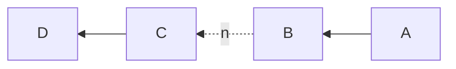
```mermaid
graph RL
A-->B  
B-.n.->C  
C-->D  
```

所有我们的优化就是尽量不让树长高。


Union：“并”操作:将两个不想交的集合合并为一个。

时间复杂度O(1)

```c
#include<stdio.h>
#include<stdlib.h>
#define SIZE 10
int UFsets[SIZE];	//集合元素数组

//初始化并查集，S相当于父结点，一开始都是一个节点，所以都是-1
void Initial(int S[]){
    for (int i=0; i<SIZE; i++)
        S[i]=-1;
}

//Find“查”操作，找x所属集合(返回x所属根结点)
int Find(int S[], int x){
    while(S[x] >= 0)	//循环寻找x的根
        x=S[x];		//寻找它的父结点
    return x;	//根的S[]小于0(就是等于-1表示树的根)
}

//Union“并”操作，将两个集合合并为一个(把一个树的根变成另一个树的根的孩子)
void Union(int S[], int x, int y){
    int rootx=Find(S,x);
    int rooty=Find(S,y);
    //要求x与y是不同的集合
    if(rootx!=rooty){
        S[rooty] = rootx;//将根Root2连接到另一根Root1下面
    }
}


//判断元素x和y是否属于同一集合
int IsSame(int S[],int x,int y){
    if (Find(S,x)==Find(S,y))
        return 1;
    else
        return 0;
}


int main(){
    int S[SIZE];
    Initial(S);
    printf("初始状态：");
    for(int i=0;i<SIZE;i++) printf("%d ",S[i]);
    printf("\n");

    Union(S,0,1);
    Union(S,1,2);
    Union(S,2,3);
    Union(S,3,4);
    Union(S,4,5);
    printf("1-5合并后的状态：");
    for(int i=0;i<SIZE;i++) printf("%d ",S[i]);
    printf("\n");

    Union(S,0,7);
    printf("7  合并后的状态：");
    for(int i=0;i<SIZE;i++) printf("%d ",S[i]);
    printf("\n");
    
    printf("%d\n",Find(S,5));
    printf("%d\n",Find(S,6));

    return 0;
}
```

>初始状态：-1 -1 -1 -1 -1 -1 -1 -1 -1 -1   
>
>1-5合并后的状态：-1 0 0 0 0 0 -1 -1 -1 -1 
>
>7  合并后的状态：-1 0 0 0 0 0 -1 0 -1 -1
>
>0
>6

另一种写法：

假如有编号为1, 2, 3, …, n的n个元素，我们用一个数组fa[]来存储每个元素的父节点（因为每个元素有且只有一个父节点，所以这是可行的）。一开始，我们先将它们的父节点设为自己。

```c
//或者写成：用递归的写法实现对代表元素的查询：一层一层访问父节点，直至根节点（根节点的标志就是父节点是本身）。要判断两个元素是否属于同一个集合，只需要看它们的根节点是否相同即可。
int find(int x){
    if(fa[x] == x)
        return x;
    else
        return find(fa[x]);
}

//合并操作也是很简单的，先找到两个集合的代表元素，然后将前者的父节点设为后者即可。当然也可以将后者的父节点设为前者，这里暂时不重要。本文末尾会给出一个更合理的比较方法。
void merge(int i, int j){
    fa[find(i)] = find(j);
}

```

这里的Find可以简写为一行：

```c
int find(int x){
	return x == fa[x] ? x : (fa[x] = find(fa[x]));
}
```

注意赋值运算符=的优先级没有三元运算符?:高，这里要加括号。

### 4.4对union优化

我们的优化目标是尽量不让树的高度更高，提高查找效率。

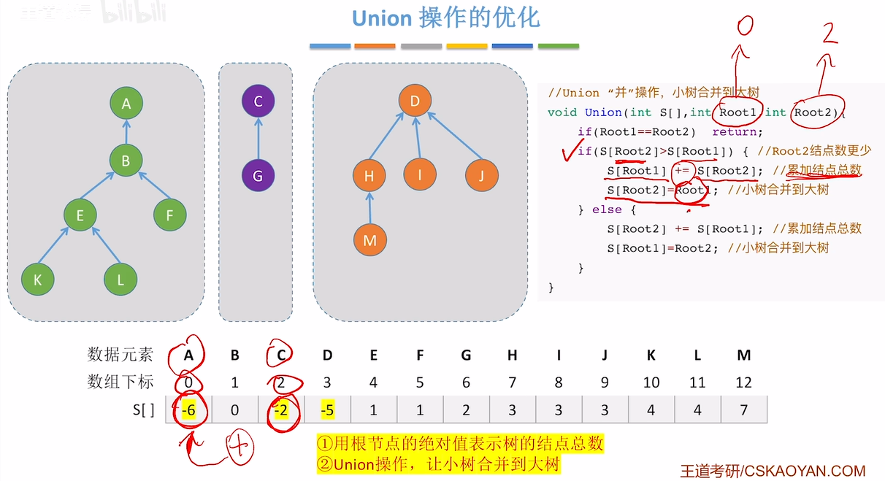

```c
//Union“并”操作，将两个集合合并为一个(把一个树的根变成另一个树的根的孩子)
void Union(int S[], int x, int y){
    int rootx=Find(S,x);
    int rooty=Find(S,y);
    //要求x与y是不同的集合
    if(rootx == rooty){
        return;
    }

    if(S[rootx] <= S[rooty]){ 	//x结点数更多(因为是负数)
        S[rootx] += S[rooty];	//累加结点总数
        S[rooty] = rootx; 		//小树y合并到大树x
    }
    else {
        S[rooty] += S[rootx];	//累加结点总数
        S[rootx] = rooty; 		//小树x合并到大树y
    }
}
```

该方法构造的树高不超过$\lfloor log_2n \rfloor+1$。

使得 Find 的最坏时间复杂度变为$O(log_2n)$

### 4.5对Find的优化（压缩路径）

压缩路径：Find 操作，先找到根节点，再将查找路径上所有结点都挂到根结点下。

每次Find操作，先找根，再“压缩路径”，可使树的高度不超过O(α(n))。

α(n)是一个增长很缓慢的函数，对于常见的n值，迪常α(n)≤4，因此优化后并查集的Find、Union操作时间开销都很低。

```c
//Find“查”操作优化，先找到根节点，再进行“压缩路径”
// 将查找路径上所有结点都挂到根结点下
int Find(int S[], int x){
    int root = x;
    while(S[root] >= 0)
        root=S[root];   //循环找到根
//压缩路径
    while(x != root){	//将查找路径上所有结点都挂到根结点下
        int temp=S[x];	//temp指向x的父节点
        S[x]=root;	    //把x直接挂到根节点下
        x=temp;         //继续操作x的父结点，准备也挂在root节点下
	}
	return root;//返回根节点编号
}
```

### ❗4.6并查集C代码（优化后）

```c
#include<stdio.h>
#include<stdlib.h>
#define SIZE 10
int UFsets[SIZE];	//集合元素数组

//初始化并查集，S相当于父结点，一开始都是一个节点，所以都是-1
void Initial(int S[]){
    for (int i=0; i<SIZE; i++)
        S[i]=-1;
}

//Find“查”操作优化，先找到根节点，再进行“压缩路径”
// 将查找路径上所有结点都挂到根结点下
int Find(int S[], int x){
    int root = x;
    while(S[root] >= 0)
        root=S[root];   //循环找到根
//压缩路径
    while(x != root){	//将查找路径上所有结点都挂到根结点下
        int temp=S[x];	//temp指向x的父节点
        S[x]=root;	    //把x直接挂到根节点下
        x=temp;         //继续操作x的父结点，准备也挂在root节点下
	}
	return root;//返回根节点编号
}

//Union“并”操作，将两个集合合并为一个(把一个树的根变成另一个树的根的孩子)
void Union(int S[], int x, int y){
    int rootx=Find(S,x);
    int rooty=Find(S,y);
    //要求x与y是不同的集合
    if(rootx == rooty){
        return;
    }

    if(S[rootx] <= S[rooty]){ 	//x结点数更多(因为是负数)
        S[rootx] += S[rooty];	//累加结点总数
        S[rooty] = rootx; 		//小树y合并到大树x
    }
    else {
        S[rooty] += S[rootx];	//累加结点总数
        S[rootx] = rooty; 		//小树x合并到大树y
    }
}

//判断元素x和y是否属于同一集合
int IsSame(int S[],int x,int y){
    if (Find(S,x)==Find(S,y))
        return 1;
    else
        return 0;
}


int main(){
    int S[SIZE];
    Initial(S);
    printf("初始状态：");
    for(int i=0;i<SIZE;i++) printf("%d ",S[i]);
    printf("\n");

    Union(S,0,1);
    printf("1  合并后的状态：");
    for(int i=0;i<SIZE;i++) printf("%d ",S[i]);
    printf("\n");

    Union(S,1,2);
    Union(S,2,3);
    Union(S,3,4);
    Union(S,4,5);
    printf("2-5合并后的状态：");
    for(int i=0;i<SIZE;i++) printf("%d ",S[i]);
    printf("\n");

    Union(S,0,7);
    printf("7  合并后的状态：");
    for(int i=0;i<SIZE;i++) printf("%d ",S[i]);
    printf("\n\n");

    return 0;
}
```

>初始状态：-1 -1 -1 -1 -1 -1 -1 -1 -1 -1 
>1  合并后的状态：-2 0 -1 -1 -1 -1 -1 -1 -1 -1
>2-5合并后的状态：-6 0 0 0 0 0 -1 -1 -1 -1
>7  合并后的状态：-7 0 0 0 0 0 -1 0 -1 -1


#### 按秩合并

```c
#include<stdio.h>
#include<stdlib.h>

#define SIZE 10
const int maxn = 5005;
int Fa[maxn],Rank[maxn];

//初始化（按秩合并）
void init(int n){
	for (int i=0; i<n; i++){
		Fa[i] = i;
		Rank[i] = 1;
	}
}

int find(int x){
    return x == Fa[x]? x:(Fa[x] = find(Fa[x]));//路径压缩
}

//合并（按秩合并）
 void merge(int i, int j) {
    int x = find(i), y = find(j);
    if (Rank[x] < Rank[y]){     //小树合并到大树
        Fa[x] = y;
    }
    else{
        Fa[y] = x;
    }
    // 合并完更新rank秩
    if (Rank[x] == Rank[y] && x!=y){
        Rank[y]++;
    }
}


int main(){
    init(SIZE);
    printf("初始状态：");
    for(int i=0;i<SIZE;i++) printf("%d(%d) ",Fa[i],Rank[i]);
    printf("\n");

    merge(0,1);
    printf("1  合并后的状态：");
    for(int i=0;i<SIZE;i++) printf("%d(%d) ",Fa[i],Rank[i]);
    printf("\n");

    merge(1,2);
    merge(2,3);
    merge(3,4);
    merge(4,5);
    printf("2-5合并后的状态：");
    for(int i=0;i<SIZE;i++) printf("%d(%d) ",Fa[i],Rank[i]);
    printf("\n");

    merge(2,7);
    printf("7  合并后的状态：");
    for(int i=0;i<SIZE;i++) printf("%d(%d) ",Fa[i],Rank[i]);
    printf("\n\n");

    return 0;
}
```

>初始状态：0(1) 1(1) 2(1) 3(1) 4(1) 5(1) 6(1) 7(1) 8(1) 9(1)        
>1  合并后的状态：0(1) 0(2) 2(1) 3(1) 4(1) 5(1) 6(1) 7(1) 8(1) 9(1) 
>2-5合并后的状态：0(1) 0(2) 0(2) 0(2) 0(2) 0(2) 6(1) 7(1) 8(1) 9(1) 
>7  合并后的状态：0(1) 0(2) 0(2) 0(2) 0(2) 0(2) 6(1) 0(2) 8(1) 9(1) 


# 参考

[数据结构：树(Tree)【详解】_数据结构 树-CSDN博客](https://blog.csdn.net/Real_Fool_/article/details/113930623)

[数据结构——二叉搜索树详解-CSDN博客](https://blog.csdn.net/L_T_W_Y/article/details/108407686)

[数据结构之——平衡二叉树（内容详解）-CSDN博客](https://blog.csdn.net/m0_37914588/article/details/103754959)


[【数据结构与算法】详解什么是树结构，并用代码手动实现一个二叉查找树_什么算法采用的是树结构-CSDN博客](https://blog.csdn.net/l_ppp/article/details/108307532)

[线索二叉树的建立和遍历（附源码）（前/中/后序）「数据结构算法精讲」-CSDN博客](https://blog.csdn.net/BBBling/article/details/117444965)

[哈夫曼树（C语言实现）_哈夫曼树c语言-CSDN博客](https://blog.csdn.net/chenlong_cxy/article/details/117929139)
