# 一、图Graph


[toc]

## 1.逻辑结构

在**线性表**中，数据元素之间是被串起来的，仅有线性关系，每个数据元素只有一个直接前驱和一个直接后继。

在**树形结构**中，数据元素之间有着明显的层次关系，并且每一层上的数据元素可能和下一层中多个元素相关，但只能和上一层中一个元素相关。

图是一种较线性表和树更加复杂的数据结构。

在**图形结构**中，结点之间的关系可以是任意的，图中任意两个数据元素之间都可能相关。

### 1.1 定义

图(**G**raph)是由顶点的有穷非空集合 **顶点集V(G)** 和顶点之间边的集合 **边集E(G)** 组成，通常表示为：

G = (V, E)

其中，G 表示个图，
**V** 是图G 中**顶点**的集合，
**E** 是图G 中**边**的集合。

> vertex：顶点
> edge：边

若 $V= \{v_1, v_2,...,v_n\}$，则用 |V| 表示图 G 中顶点的个数，也称图 G 的阶，
$E= \{(u, v) |u∈V, v∈V\}$，用 |E| 表示图 G 中边的条数。


【注意】线性表可以是空表，树可以是空树，但**图不可以是空图**。
就是说，图中不能一个顶点也没有，图的**顶点集V一定非空**，但**边集E可以为空**，此时图中只有顶点而没有边。

### 1.2 【考点】术语

#### 1.2.1有向图

若 E 是**有向边**(也称弧)的有限集合时，则图G为有向图。

弧是顶点的**有序对，记为<v, w>**，其中v,w是顶点，v称为**弧尾**，w称为**弧头**，<v,w>称为**从顶点v到顶点w的弧**，也称v邻接到w，或w邻接自v。

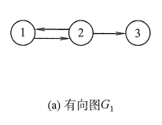

图(a)所示的有向图$G_1$可表示为：
$$
G_1=(V_1, E_1) \\
V_1=\{1,2,3\} \\
E_1=\{<1,2>, <2,1>, <2,3>\} \\
$$


#### 1.2.2无向图

若 E 是**无向边**(简称边)的有限集合时，则图G为无向图。

边是顶点的**无序对，记为(v, w)或(w, v)**，因为(v,w)=(w,v)，其中v,w是顶点。可以说顶点w和顶点v互为邻接点。边(v, w)依附于顶点w和v，或者说边(v, w)和顶点v, w相关联。

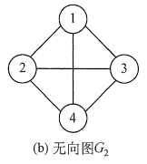

图(b)所示的无向图$G_2$可表示为：
$$
G_2=(V_2, E_) \\
V_2=\{1,2,3,4\} \\
E_2=\{(1,2), (1,3), (1,4), (2,3), (2,4), (3,4)\} \\
$$

#### 1.2.3简单图&多重图

**【注意】**此数据结构中仅讨论简单图。

- **简单图**：

  一个图 G 若满足：

  1. **不存在重复边；**
  2. **不存在顶点到自身的边。**

  则称图 G 为简单图。上图中$G_1$和$G_2$均为简单图。

- **多重图**：

  若图 G 中某两个结点之间的边数多于一条，又允许顶点通过同一条边和自己关联，则 G 为多重图。

  多重图的定义和简单图是相对的。

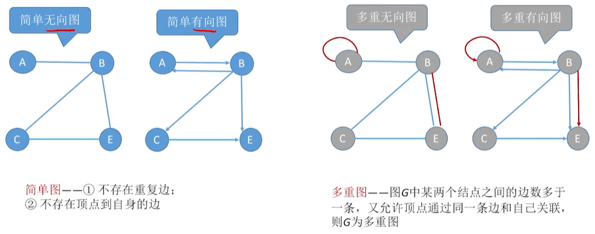

#### 1.2.4完全图

- **无向完全图**， |E| 的取值范围是 0 到$\cfrac {n(n-1)} {2}$，有$\cfrac {n(n-1)} {2}$条边的无向图称为完全图。

**【技巧】就是所有两个顶点都有边。**

- **有向完全图**，|E|的取值范围是 0 到 n(n-1)，有 **n(n-1)** 条弧的有向图称为有向完全图，在**有向完全图**中任意两个顶点之间都存在方向相反的两条弧。

1.2.2无向图中$G_2$为无向完全图，而下面$G_3$为有向完全图。

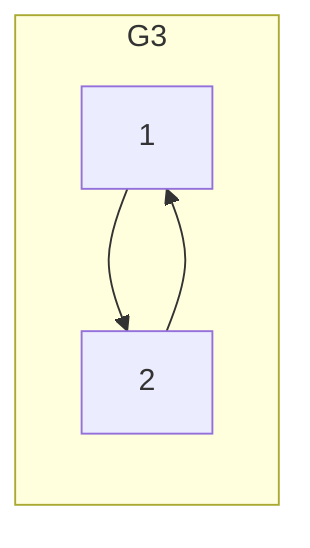
```mermaid
graph RL

subgraph G3
	1-->2
	2-->1
end
```

#### 1.2.5子图

- ==**子图**==：设有两个图 G=(V, E) 和 G'=(V', E')， 若 V' 是 V 的子集，且 E' 是 E 的子集，则称 G' 是 G 的**子图**。
- ==**生成子图**==：若有满足 V(G')= V(G) 的子图 G'，则称其为 G 的**生成子图**。下图中 G3 为 G1 的子图。

**【技巧】生产子图，就是包含原图的所有点，但是没有所有边**

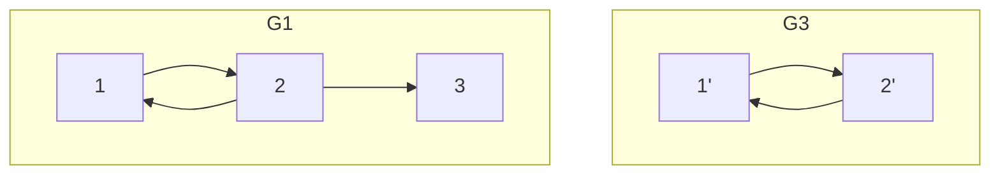
```mermaid
graph

subgraph G3
	1'-->2'
	2'-->1'
end
subgraph G1
	1-->2
	2-->1
	2-->3
end
```

【注意】并非V和E的任何子集都能构成G的子图，因为这样的子集可能不是图，即E的子集中的某些边关联的顶点可能不在这个V的子集中。


#### 1.2.6==连通==

【注意】图中有一个环就算**连通**。

n 个顶点：

1. 无向连通图需要 n-1 条边；
2. 有向连通图需要 n 条边。


##### 1）连通、连通图、连通分量

在**无向图**中，若从顶点 v 到顶点 w 有路径存在，则称v和w是**连通的**。

- **==连通图==**：若图 G 中**任意两个顶点都是连通的**，则称图G为**连通图**，否则称为**非连通图**。

若一个图有n个顶点，并且边数小于n - 1，则此图必是非连通图。

- ==**连通分量**==：无向图中的**极大连通子图**称为**连通分量**。如下图(a)所示，图G4有3个连通分量，如图(b)所示。

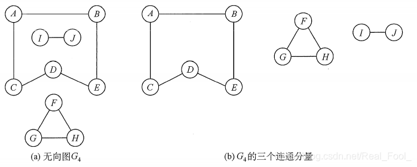

**极大连通子图**是无向图的连通分量，**极大**即要求**该连通子图**==包含其所有的**边**==。

**极小连通子图**是既要保持图**连通**又要使得边数最少的子图。


##### ==【考点】形成一个连通图：顶点与边关系==

| 最多边（有向完全图） | 最少边（有向图） | 顶点数 | 最少边数（无向图）<br>也是生成树的边数 | 最多边数（无向完全图）    |
| -------------------- | ---------------- | ------ | -------------------------------------- | ------------------------- |
| 0                    | 0                | **1**  | 0                                      | 0                         |
| 2                    | 2                | **2**  | 1                                      | 1                         |
| 6                    | 3                | **3**  | 2                                      | 3                         |
| 12                   | 4                | **4**  | 3                                      | 6                         |
| 20                   | 5                | **5**  | 4                                      | 10                        |
| $n^2-n$              | **n**            | **n**  | **n-1**                                | $\cfrac{n^2-n}2 = \C_n^2$ |

可以总结规律：

形成一个连通图 **n** 个顶点，边数：
$$
最少边数 = n-1\\\\
最大边数 = (n-1)+(n-2)+(n-3)+...+(1)+(n-n)\\
即= \frac {n(n-1)}2 =  \color{red}\frac {n^2-n}2 \\
也就是 \C_n^2
$$

==【关键词注意】确保，保证，一定==

>【华中科技大学真题】设有6个结点的无向图，该图**至少**应有（**11**）条边，才能**确保**是一个连通图？
>
>这里的“**确保**”意思是，6个顶点不管怎么连（平行边除外），你是找不出非连通图的情况的。而常规的最少边数的连通是某一个特定的情况，比如这个 6 个顶点最少可以 5 条边连接，但是只是理想情况：
>
>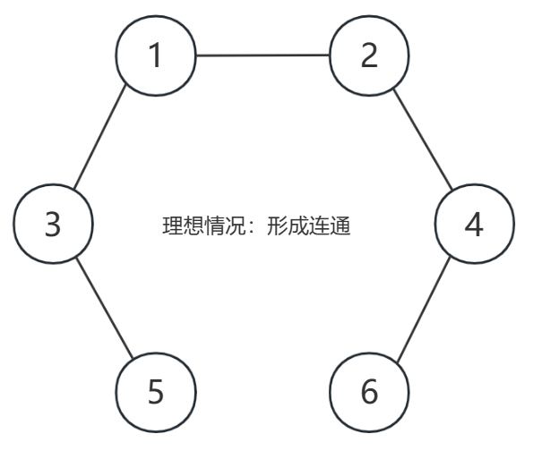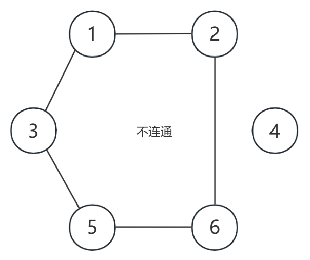
>
>所以为了**确保**。首先5个顶点的全连通图需要是**完全连通图**，边为$\cfrac{5^2-5}2 = 10$，
>
>再加 1 条边与另一个顶点相连接，总共11条边，不管你怎么连，都可以确保这个图是连通的（不存在平行边）。
>
>为什么说这样连可以确保，证明如下：
>
>1. 如果连线个数<5\*(5-1)/2+1,  即连线n最多为5\*(5-1)/2，则可以把这n条线都连在5个点上，导致第6个点无法连接。
>2. 如果连线个数=5\*(5-1)/2+1，假设此时有一个点连不上，则5\*(5-1)/2+1条线全部连在剩下5个点上。这是不可能的，因为5个点的连线最多为5\*(5-1)/2。
>3. 如果连线个数>5\*(5-1)/2+1,那个自然图就是确定联通的。
>
>所以，5\*(5-1)/2+1可以保证无论怎么连都可以保证图联通。


##### 2）强连通图、强连通分量

在**有向图**中，若从顶点v到顶点w，从顶点w到项点v之间都有路径，则称这两个顶点是强连通的。

若图中任何一对顶点都是强连通的，则称此图为**强连通图**。有向图中的**极大强连通子图**称为有向图的**强连通分量**，图G1的强连通分量如下图所示。

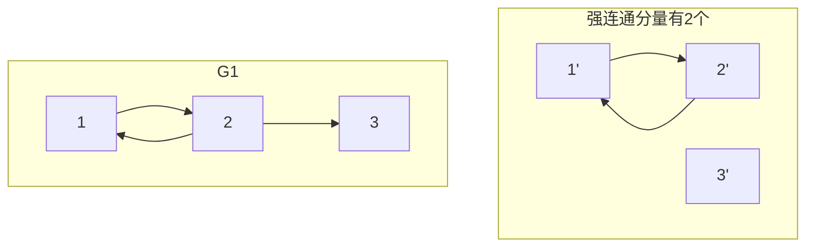
```mermaid
graph

subgraph 强连通分量有2个
	1'-->2'
	2'-->1'
	3'
end

subgraph G1
	1-->2
	2-->1
	2-->3
end
```

【注意】强连通图、强连通分量只是针对有向图而言的。一般在无向图中讨论连通性，在有向图中考虑强连通性。

##### ==【考点】求有向图强连通分量的个数==

[技巧：求强连通分量个数](https://www.bilibili.com/video/BV1NM411H71m/)

【技巧总结】把每一个成环后的强连通分量看作一个整体，然后重新画图，直到没有新的环出现，此时有几个顶点，就是有几个强连通分量。


#### 1.2.7生成树

生成树、生成森林

**连通图的生成树**是包含图中**全部顶点**的一个**极小连通子图**。若图中顶点数为n，则它的生成树含有n-1条边。

对生成树而言，若砍去它的一条边，则会变成非连通图，若加上一条边则会形成一个回路。在非连通图中，连通分量的生成树构成了非连通图的生成森林。图G2的一个生成树如下图所示。


生成树：

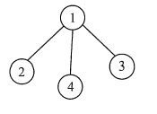

【注意】包含无向图中全部顶点的极小连通子图，只有生成树满足条件，因为砍去生成树的任一条边，图将不再连通。


##### 有向树

一个顶点的入度为0、其余顶点的入度均为1的有向图，称为有向树。


#### 1.2.8边的权和网

在一个图中，每条边都可以标上具有某种含义的数值，该数值称为该边的**权值**。

- **网图**：这种边上带有权值的图称为**带权图**，也称**网**。
- **非网图**：它没有边上的权值。


#### 1.2.9稠密图、稀疏图

边数很少的图称为**稀疏图**，反之称为**稠密图**。

稀疏和稠密本身是模糊的概念，稀疏图和稠密图常常是相对而言的。一般当图G满足|E|<|V|log|V|时，可以将G视为稀疏图。


#### 1.2.10顶点的==度==

顶点的度、入度、出度

图中**每个顶点的度**定义为以该项点为一个端点的**边的数目**。

1. 对于**无向图**，**顶点v的度**是指依附于该顶点的**边的条数**，记为 **TD(v)**。

在具有n个顶点、e条边的无向图中，$\displaystyle \sum_{i=1}^{n} TD(v_i) = 2e$。即无向图的全部顶点的度的和等于边数的2倍，因为每条边和两个顶点相关联。

2. 对于**有向图**，顶点v的度分为入度和出度。

==入度==是以顶点**v为终点**（**进入v**）的有向边的数目，记为 **ID(v)**。

==出度==是以顶点**v为起点**（**从v出去**）的有向边的数目，记为 **OD(v)**。

顶点v的**度**等于其入度和出度之和，即 TD(v) = ID(v)＋OD(v)。

在具有n个顶点、e条边的有向图中，$\displaystyle \sum_{i=1}^{n} ID(v_i) = \sum_{i=1}^{n} OD(v_i) = e.\sum_{i=1}^{n}TD(v)=2e$，即有向图的全部顶点的入度之和与出度之和相等，并且等于边数，这是因为每条有向边都有一个起点和终点。

##### ==【度 - 考点】==

- **入度 = 出度 = 边数**

- **总度数 = 2 \* 边数**

当然，总度数 = 每个顶点的度数之和


#### 1.2.11==路径==

顶点$v_p$到顶点$v_q$之间的—条路径是指**顶点序列**$v_p,v_{i_1} , v_{i_2},...,v_{i_m},v_q$，当然关联的边也可以理解为路径的构成要素。

==路径==：<u>路径上**边的数目**称为**路径长度**</u>。

==回路==：第一个顶点和最后一个顶点相同的路径称为**回路**或**环**。

若一个图有n个顶点，并且|E|>n-1（边数大于n-1），则此图一定有环。

判断是否有回路的方法：

1. 深度优先遍历DFS
2. 拓扑排序

> 顶点V=5个，边数E=4就是 极小连通子图。

==简单路径==：在路径序列中，**顶点不重复出现**的路径称为简单路径。

==简单回路==：除第一个顶点和最后一个顶点外，其余顶点不重复出现的回路称为简单回路。

==路径长度==：一条路径上，边的数目。

==距离==（点到点的距离）：从顶点u出发到顶点v的**最短路径**若存在，则最短路径的长度称为从u到v的距离。若从u到v根本不存在路径，则记该距离为无穷(∞)。


## 2.物理（存储）结构

由于图的结构比较复杂，任意两个顶点之间都可能存在联系，因此无法以数据元素在内存中的物理位置来表示元素之间的关系，也就是说，图不可能用简单的顺序存储结构来表示。

而多重链表的方式，要么会造成很多存储单元的浪费，要么又带来操作的不便。

因此，对于图来说，如何对它实现物理存储是个难题，接下来我们介绍五种不同的存储结构。


## 3.基本操作

【提示】看完<u>二、存储结构</u>，再回来看。


**Adjacent(G,x,y)**：**判断**图G是否存在**边**<x, y>或(x, y)。

- 邻接矩阵：直接在二维数组中找是不是为1。
  O(1)
- 邻接表：遍历结点对应的单链表，最好遍历第一个就找到，最差遍历完都没有。
  O(1)~O(|V|)


**Neighbors(G,x)**：**列出**图G中与结点x邻接的**边**。

- 邻接矩阵：直接在二维数组中找结点x那一行/列中为1的边。
  O(|V|)
- 邻接表：
  - 无向图/出边：遍历结点x对应的单链表。
    O(1)~O(|V|)
  - 入边：那么就要遍历所有的单链表来寻找，结点x作为入边的有多少。
    O(|E|)


**lnsertVertex(G,x)**：在图G中**插入顶点**x。

- 邻接矩阵：直接在二维数组插入新的结点。
  O(1)
- 邻接表：直接在结点表的末尾插入新结点。
  O(1)


**DeleteVertex(G,x)**：从图G中**删除顶点**x。

- 邻接矩阵：把要删除的结点的行列所有元素全部设置为0，然后把结点设置为NULL。
  O(|V|)
- 邻接表：删除结点表中该结点和它对应的边单链表，然后再删除在其他结点的单链表中，与他相关的链表结点。
  O(1)~O(|E|)


**AddEdge(G,x,y)**：若无向边(x,y)或有向边<x, y>不存在，则向图G中**添加该边**。

- 邻接矩阵：直接改变在二维数组中元素的值。
  O(1)
- 邻接表：在两个结点的单链表中都插入彼此结点（头插法插在前面，比尾插法快）。
  O(1)~O(|V|)


**RemoveEdge(G,x,y)**：若无向边(x,y)或有向边<x, y>存在，则从图G中**删除该边**。

删除操作和添加类似。


❗**FirstNeighbor(G,x)**：**求**图G中**顶点x**的第一个**邻接点**，若有则返回顶点号。若x没有邻接点或图中不存在x，则返回-1。

- 邻接矩阵：直接遍历二维数组中结点x行列元素的第一个为1的值。
  O(1)~O(|V|)
- 邻接表：
  - 无向图/出边：查找结点x的单链表的第一个链表结点。
    O(1)
  - 入边：遍历每一个结点，搜寻要查找的结点x是否是每一个结点的入边。
    O(1)~O(|E|)


❗**NextNeighbor(G,x,y)**：假设图G中顶点y是顶点x的一个邻接点，返回除y之外顶点x的下一个邻接点的顶点号，若y是x的最后一个邻接点，则返回-1。

- 邻接矩阵：直接遍历二维数组中结点x行列元素的第二个为1的值。
  O(1)~O(|V|)
- 邻接表：
  - 无向图/出边：查找结点x的单链表的第二个链表结点。
    O(1)
  - 入边：遍历每一个结点，搜寻要查找的结点x是否是每一个结点的入边。
    O(1)~O(|E|)


**Get_edge_value(G,x,y)**：获取图G中边(x, y)或<x, y>对应的权值。

**Set_edge_value(G,x,y,v)**：设置图G中边(x, y)或<x, y>对应的权值为v。

- 邻接矩阵：直接在二维数组中找是不是为1。
  O(1)
- 邻接表：遍历结点对应的单链表，最好遍历第一个就找到，最差遍历完都没有。
  O(1)~O(|V|)


# 二、存储结构

## ❗1.==【考点】邻接矩阵==

图的邻接矩阵（Adjacency Matrix）存储方式是用**两个数组来表示图**。一个一维数组存储图中顶点信息，一个二维数组（称为邻接矩阵）存储图中的边或弧的信息。

用1表示有边，0表示没有边。

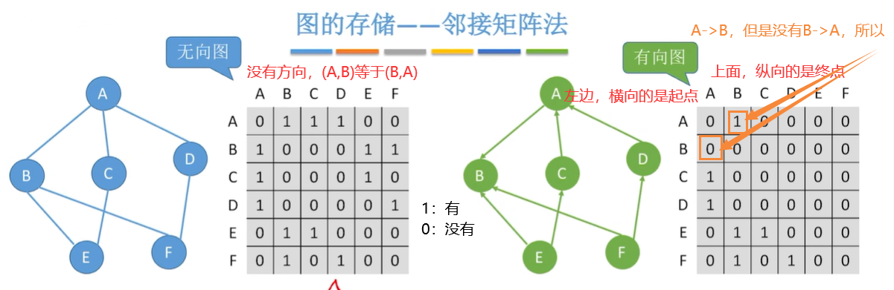

结点数为n的图G，邻接矩阵A是一个 n\*n 的方阵，将G顶点编号为$v_1,v_2,...,v_n$：
$$
A[i][j] =
\begin{cases}
1, & 若边集E(G)中有(v_i,v_j)or<v_i,v_j> \\[2ex]
0, & 若边集E(G)中没有(v_i,v_j)or<v_i,v_j> 
\end{cases}
$$
存储结构定义：

```c
#define MaxVertexNum 100	//顶点数目的最大值
typedef char VertexType;  //顶点的数据类型
typedef int EdgeType;     //带权图中边上权值的数据类型

typedef struct{
    VertexType Vex[MaxVertexNum] ;	//顶点表:存放结构or信息
    EdgeType Edge[MaxVertexNum][MaxVertexNum];	//邻接矩阵，边表
    int vexnum, edgenum;		//图的当前顶点数和边数/弧数
}MGraph;
```


### 1.1无向图

1. 无向图的邻接矩阵一定是一个**对称矩阵**（即从矩阵的左上角到右下角的主对角线为轴，右上角的元与左下角相对应的元全都是相等的）。 

   因此，在存储邻接矩阵时只需存储**上(或下)三角矩阵**的元素。

2. 对于无向图，第i个结点的**度** = 邻接矩阵的**第i行(或第i列)**非零元素(或非∞元素)的个数。

   > 顶点A的度就是0+1+1+1+0+0=3。

下图是一个无向图和它的邻接矩阵：


#### ❗邻接矩阵-无向图代码-C

```c++
/* 图
    邻接矩阵(Adjacency Matrix) 
    存储方式是用两个数组来表示图。
    一个一维数组存储图中顶点信息，一个二维数组(称为邻接矩阵)存储图中的边或弧的信息。
    
    无向图

C实现
*/

#include <stdio.h>
#include <string.h>
#define MaxVertexNum  100 //顶点数目最大值
typedef char VertexType;  //顶点的数据类型
typedef int EdgeType;     //带权图中边上权值的数据类型

#define numVertexes 6   // 顶点个数，用于visited数组
#define numEdges 7      // 边个数


typedef struct
{
	VertexType Vex[MaxVertexNum];   //顶点表
	EdgeType Edge[MaxVertexNum][MaxVertexNum];  //邻接矩阵，边表
	int vexnum, edgenum;    //图的顶点数和弧数
}MGraph;
 

void create_Graph(MGraph *G);
void create_Graph_ByArray(MGraph *G, int edges[][3]);
void print_Matrix(MGraph G);
void DFS(MGraph G,int v);
void DFSTraverse(MGraph G);
void BFS(MGraph G, int v);
void BFSTraverse(MGraph G);


int main()
{
	MGraph G;
    // 创建无向图方法1
	//create_Graph(&G);

    // 创建无向图方法2
    //这里可以使用int，因为edge的EdgeType是int
    int edges[numEdges][3] = {  // 边的起点序号，终点序号，权值
        {1,2,5},
        {1,3,1},
        {1,4,6},
        {2,5,3},
        {2,6,4},
        {3,5,3},
        {4,6,2}
    };
	create_Graph_ByArray(&G,edges);

	print_Matrix(G);
    
	printf("\nDFS:");
	DFS(G,0);
	printf("\nBFS:");
	BFS(G,0);
    printf("\nBFS直接遍历(非连通图):");
    BFSTraverse(G);

	return 0;
}


// 创建无向图
void create_Graph(MGraph *G){
	int i, j;
	int start, end;  //边的起点序号、终点序号
	int w;   //边上的权值
    
// 所创建无向图的顶点数和边数(用空格隔开)。这里也可以输入
	G->vexnum = numVertexes;
	G->edgenum = numEdges;
	
	printf("\n");

	//图的初始化init
	for (i=0; i<G->vexnum; i++){
		for (j=0; j<G->vexnum; j++){
			if (i == j)
				G->Edge[i][j] = 0;      //结点自身
			else
				G->Edge[i][j] = 32767;   //初始都为表示∞
		}
	}
 
	//顶点信息存入顶点表
	for (i=0; i<G->vexnum; i++){
		// printf("请输入第%d个顶点的信息(int):",i+1);
		// scanf("%d", &G->Vex[i]);

        //这里不输入了，暂时默认0开始
        G->Vex[i] = i+1;
	}
	printf("\n");

	//输入无向图边的信息
	for (i=0; i<G->edgenum; i++){
		printf("请输入边的起点序号，终点序号，权值(用空格隔开)(int,从1开始,没有0)：");
		scanf("%d%d%d", &start, &end, &w);
		G->Edge[start-1][end-1] = w;
		G->Edge[end-1][start-1] = w;   //无向图具有对称性
	}
}


// 创建无向图
void create_Graph_ByArray(MGraph *G, int edges[][3]){
	int i, j;
	int start, end;  //边的起点序号、终点序号
	int w;   //边上的权值
    
// 所创建无向图的顶点数和边数(用空格隔开)。这里也可以输入
	G->vexnum = numVertexes;
	G->edgenum = numEdges;
	
	printf("\n");

	//图的初始化init
	for (i=0; i<G->vexnum; i++){
		for (j=0; j<G->vexnum; j++){
			if (i == j)
				G->Edge[i][j] = 0;      //结点自身
			else
				G->Edge[i][j] = 32767;   //初始都为表示∞
		}
	}
 
	//顶点信息存入顶点表
	for (i=0; i<G->vexnum; i++){
		// printf("请输入第%d个顶点的信息(int):",i+1);
		// scanf("%d", &G->Vex[i]);

        //这里不输入了，暂时默认0开始
        G->Vex[i] = i+1;
	}
	printf("\n");
    
    // 输入无向图边的信息
	for (i=0; i<G->edgenum; i++){
        start = edges[i][0];
        end = edges[i][1];
        w = edges[i][2];

		G->Edge[start-1][end-1] = w;
		G->Edge[end-1][start-1] = w;   //无向图具有对称性
	}
}


// 输出图
void print_Matrix(MGraph G){
	int i, j;
	printf("\n图的顶点为:");
	for (i=0; i<G.vexnum; i++)
		printf("%d ", G.Vex[i]);

	printf("\n输出邻接矩阵:\n");
    

    // 横坐标
    printf(" "); //表示行坐标，前面空格留给纵坐标
	for (i=0; i<G.vexnum; i++)
		printf("%5d", G.Vex[i]);
    printf("\n");
		
	for (i=0; i<G.vexnum; i++){
        // 纵坐标
		printf("\n%d", G.Vex[i]);

        // 输出邻接矩阵
		for (j=0; j<G.vexnum; j++){
			if (G.Edge[i][j] == 32767)
				printf("%7s", "∞");
			else
				printf("%5d", G.Edge[i][j]);
		}
		printf("\n");
	}	
}


// ------------------------- DFS 深度优先遍历------------------------
int visited[numVertexes]={0};
// 注意：是从0下标开始
void DFS(MGraph G, int x){
    // 访问顶点x
	printf("%d",G.Vex[x]);
    visited[x]=1;   //设已访问标记
    
    // 遍历x的邻接顶点
	for(int v=0; v<G.vexnum; v++){
        //i为x的尚未访问的邻接顶点
		if(!visited[v] && G.Edge[x][v] != 32767){
			DFS(G, v);
        }
    }
}
//对非连通图进行深度优先遍历
void DFSTraverse(MGraph G){
    //把所有结点全部标记为false，表示没有访问过
	for(int v=0; v<G.vexnum; v++){
		visited[v] = 0;
	}
	for(int v=0; v<G.vexnum; v++){	//从v=0开始遍历
		if(!visited[v]){
			DFS(G, v);
		}
	}
}


/// @brief /辅助队列
typedef struct{
	int data[numVertexes];
	int f,r;
}Que;
void InitQueue(Que &Q){
	Q.f=Q.r=0;
}
void In(Que &Q,int e){
	if ((Q.r+1)%numVertexes==Q.f) return; 
	Q.data[Q.r]=e;
	Q.r=(Q.r+1)%numVertexes;
}
void Out(Que &Q,int &e){
	if(Q.f==Q.r) return;
	e=Q.data[Q.f];
	Q.f=(Q.f+1)%numVertexes;
}

// ------------------------- BFS 广度优先遍历------------------------
// 对连通图进行广度优先遍历
void BFS(MGraph G, int v){
    Que Q;
    InitQueue(Q);	//初始化一辅助用的队列

    //把所有结点全部标记为false，表示没有访问过
	for(int i=0; i<G.vexnum; i++){
		visited[i] = 0;
	}

    printf("%d",G.Vex[v]);
    visited[v]=1;
    In(Q,v);

    while(Q.f!=Q.r){
        Out(Q,v);
        //把出队结点的相邻的所有结点入队
        for(int w=0; w<G.vexnum; w++){
            if(!visited[w] && G.Edge[v][w] != 32767){
                printf("%d",G.Vex[w]);
                visited[w]=1;
                In(Q,w);
            }
        }
    }

}

// 对非连通图的广度遍历
void BFSTraverse(MGraph G){
    Que Q;
    InitQueue(Q);	//初始化一辅助用的队列
	int v;
    //把所有结点全部标记为false，表示没有访问过
	for(v=0; v<G.vexnum; v++){
		visited[v] = 0;
	}
    
	for(v=0; v<G.vexnum; v++){		//这里是从0开始
		//若是未访问过就处理
		if(!visited[v]){
			printf("%d",G.Vex[v]);
            visited[v]=1;
            In(Q,v);

            while(Q.f!=Q.r){
                Out(Q,v);
                //把出队结点的相邻的所有结点入队
                for(int w=0; w<G.vexnum; w++){
                    if(!visited[w] && G.Edge[v][w] != 32767){
                        printf("%d",G.Vex[w]);
                        visited[w]=1;
                        In(Q,w);
                    }
                }
            }
        }
	}

}
```

>请输入边的起点序号，终点序号，权值(用空格隔开)(int,从1开始,没有0)：1 2 5
>请输入边的起点序号，终点序号，权值(用空格隔开)(int,从1开始,没有0)：1 3 1
>请输入边的起点序号，终点序号，权值(用空格隔开)(int,从1开始,没有0)：1 4 6
>请输入边的起点序号，终点序号，权值(用空格隔开)(int,从1开始,没有0)：2 5 3
>请输入边的起点序号，终点序号，权值(用空格隔开)(int,从1开始,没有0)：2 6 4
>请输入边的起点序号，终点序号，权值(用空格隔开)(int,从1开始,没有0)：3 5 3
>请输入边的起点序号，终点序号，权值(用空格隔开)(int,从1开始,没有0)：4 6 2
>
>图的顶点为:1 2 3 4 5 6         
>输出邻接矩阵:
>           1    2    3    4    5    6
>
>1    0    5    1    6    ∞    ∞
>
>2    5    0    ∞    ∞    3    4
>
>3    1    ∞    0    ∞    3    ∞
>
>4    6    ∞    ∞    0    ∞    2
>
>5    ∞    3    3    ∞    0    ∞
>
>6    ∞    4    ∞    2    ∞    0
>
>DFS:125364
>BFS:123456
>BFS直接遍历(非连通图):123456


### 1.2有向图

主对角线上数值依然为0。但因为是有向图，所以此**矩阵并不对称**。

**【注意】行是出度**

有向图讲究入度与出度，
第i个结点的**入度** = 邻接矩阵的**第i列**的非零元素的个数。（**竖着**）
第i个结点的**出度** = 邻接矩阵的**第i行**的非零元素的个数。（**横着**）
第i个结点的**度** = 第i行、第i列的非零元素个数之**和**。

下图是有向图和它的邻接矩阵：


#### ❗邻接矩阵-有向图代码-C

与无向图的区别，仅有在构造的时候：

```c
G->Edge[start-1][end-1] = w;
//有向图不具有对称性
```

code:

```c
/* 图
    邻接矩阵(Adjacency Matrix) 
    存储方式是用两个数组来表示图。
    一个一维数组存储图中顶点信息，一个二维数组(称为邻接矩阵)存储图中的边或弧的信息。
    
    有向图

C实现
*/

#include <stdio.h>
#include <string.h>
#define MaxVertexNum  100 //顶点数目最大值
typedef char VertexType;  //顶点的数据类型
typedef int EdgeType;     //带权图中边上权值的数据类型

#define numVertexes 6   // 顶点个数，用于visited数组
#define numEdges 7      // 边个数


typedef struct
{
	VertexType Vex[MaxVertexNum];   //顶点表
	EdgeType Edge[MaxVertexNum][MaxVertexNum];  //邻接矩阵，边表
	int vexnum, edgenum;    //图的顶点数和弧数
}MGraph;
 

void create_Graph(MGraph *G);
void create_Graph_ByArray(MGraph *G, int edges[][3]);
void print_Matrix(MGraph G);
void DFS(MGraph G,int v);
void DFSTraverse(MGraph G);
void BFS(MGraph G, int v);
void BFSTraverse(MGraph G);


int main()
{
	MGraph G;
    // 创建有向图方法1
	//create_Graph(&G);

    // 创建有向图方法2
    //这里可以使用int，因为edge的EdgeType是int
    int edges[numEdges][3] = {  // 边的起点序号，终点序号，权值
        {1,2,5},
        {3,1,1},
        {4,1,6},
        {5,2,3},
        {5,3,3},
        {6,2,4},
        {6,4,2}
    };
	create_Graph_ByArray(&G,edges);

	print_Matrix(G);
    
	printf("\nDFS:");
	DFS(G,0);
    printf("\nDFS直接遍历(非连通图):");
    DFSTraverse(G);

	printf("\nBFS:");
	BFS(G,0);
    printf("\nBFS直接遍历(非连通图):");
    BFSTraverse(G);

	return 0;
}


// 创建有向图
void create_Graph(MGraph *G){
	int i, j;
	int start, end;  //边的起点序号、终点序号
	int w;   //边上的权值
    
// 所创建有向图的顶点数和边数(用空格隔开)。这里也可以输入
	G->vexnum = numVertexes;
	G->edgenum = numEdges;
	
	printf("\n");

	//图的初始化init
	for (i=0; i<G->vexnum; i++){
		for (j=0; j<G->vexnum; j++){
			if (i == j)
				G->Edge[i][j] = 0;      //结点自身
			else
				G->Edge[i][j] = 32767;   //初始都为表示∞
		}
	}
 
	//顶点信息存入顶点表
	for (i=0; i<G->vexnum; i++){
		// printf("请输入第%d个顶点的信息(int):",i+1);
		// scanf("%d", &G->Vex[i]);

        //这里不输入了，暂时默认0开始
        G->Vex[i] = i+1;
	}
	printf("\n");

	//输入有向图边的信息
	for (i=0; i<G->edgenum; i++){
		printf("请输入边的起点序号，终点序号，权值(用空格隔开)(int,从1开始,没有0)：");
		scanf("%d%d%d", &start, &end, &w);
		G->Edge[start-1][end-1] = w;
		//有向图不具有对称性
	}
}


// 创建有向图
void create_Graph_ByArray(MGraph *G, int edges[][3]){
	int i, j;
	int start, end;  //边的起点序号、终点序号
	int w;   //边上的权值
    
// 所创建有向图的顶点数和边数(用空格隔开)。这里也可以输入
	G->vexnum = numVertexes;
	G->edgenum = numEdges;
	
	printf("\n");

	//图的初始化init
	for (i=0; i<G->vexnum; i++){
		for (j=0; j<G->vexnum; j++){
			if (i == j)
				G->Edge[i][j] = 0;      //结点自身
			else
				G->Edge[i][j] = 32767;   //初始都为表示∞
		}
	}
 
	//顶点信息存入顶点表
	for (i=0; i<G->vexnum; i++){
		// printf("请输入第%d个顶点的信息(int):",i+1);
		// scanf("%d", &G->Vex[i]);

        //这里不输入了，暂时默认0开始
        G->Vex[i] = i+1;
	}
	printf("\n");
    
    // 输入有向图边的信息
	for (i=0; i<G->edgenum; i++){
        start = edges[i][0];
        end = edges[i][1];
        w = edges[i][2];

		G->Edge[start-1][end-1] = w;
		//有向图不具有对称性
	}
}


// 输出图
void print_Matrix(MGraph G){
	int i, j;
	printf("\n图的顶点为:");
	for (i=0; i<G.vexnum; i++)
		printf("%d ", G.Vex[i]);

	printf("\n输出邻接矩阵:\n");
    

    // 横坐标
    printf(" "); //表示行坐标，前面空格留给纵坐标
	for (i=0; i<G.vexnum; i++)
		printf("%5d", G.Vex[i]);
    printf("\n");
		
	for (i=0; i<G.vexnum; i++){
        // 纵坐标
		printf("\n%d", G.Vex[i]);

        // 输出邻接矩阵
		for (j=0; j<G.vexnum; j++){
			if (G.Edge[i][j] == 32767)
				printf("%7s", "∞");
			else
				printf("%5d", G.Edge[i][j]);
		}
		printf("\n");
	}	
}


// ------------------------- DFS 深度优先遍历------------------------
int visited[numVertexes]={0};
// 注意：是从0下标开始
void DFS(MGraph G, int x){
    // 访问顶点x
	printf("%d",G.Vex[x]);
    visited[x]=1;   //设已访问标记
    
    // 遍历x的邻接顶点
	for(int v=0; v<G.vexnum; v++){
        //i为x的尚未访问的邻接顶点
		if(!visited[v] && G.Edge[x][v] != 32767){
			DFS(G, v);
        }
    }
}
//对非连通图进行深度优先遍历
void DFSTraverse(MGraph G){
    //把所有结点全部标记为false，表示没有访问过
	for(int v=0; v<G.vexnum; v++){
		visited[v] = 0;
	}

	for(int v=0; v<G.vexnum; v++){	//从v=0开始遍历
		if(!visited[v]){
			DFS(G, v);
		}
	}
}


/// @brief /辅助队列
typedef struct{
	int data[numVertexes];
	int f,r;
}Que;
void InitQueue(Que &Q){
	Q.f=Q.r=0;
}
void In(Que &Q,int e){
	if ((Q.r+1)%numVertexes==Q.f) return; 
	Q.data[Q.r]=e;
	Q.r=(Q.r+1)%numVertexes;
}
void Out(Que &Q,int &e){
	if(Q.f==Q.r) return;
	e=Q.data[Q.f];
	Q.f=(Q.f+1)%numVertexes;
}

// ------------------------- BFS 广度优先遍历------------------------
// 对连通图进行广度优先遍历
void BFS(MGraph G, int v){
    Que Q;
    InitQueue(Q);	//初始化一辅助用的队列

    //把所有结点全部标记为false，表示没有访问过
	for(int i=0; i<G.vexnum; i++){
		visited[i] = 0;
	}

    printf("%d",G.Vex[v]);
    visited[v]=1;
    In(Q,v);

    while(Q.f!=Q.r){
        Out(Q,v);
        //把出队结点的相邻的所有结点入队
        for(int w=0; w<G.vexnum; w++){
            if(!visited[w] && G.Edge[v][w] != 32767){
                printf("%d",G.Vex[w]);
                visited[w]=1;
                In(Q,w);
            }
        }
    }

}

// 对非连通图的广度遍历
void BFSTraverse(MGraph G){
    Que Q;
    InitQueue(Q);	//初始化一辅助用的队列
	int v;
    //把所有结点全部标记为false，表示没有访问过
	for(v=0; v<G.vexnum; v++){
		visited[v] = 0;
	}
    
	for(v=0; v<G.vexnum; v++){		//这里是从0开始
		//若是未访问过就处理
		if(!visited[v]){
			printf("%d",G.Vex[v]);
            visited[v]=1;
            In(Q,v);

            while(Q.f!=Q.r){
                Out(Q,v);
                //把出队结点的相邻的所有结点入队
                for(int w=0; w<G.vexnum; w++){
                    if(!visited[w] && G.Edge[v][w] != 32767){
                        printf("%d",G.Vex[w]);
                        visited[w]=1;
                        In(Q,w);
                    }
                }
            }
        }
	}

}
```


### 1.3带权图

对于带权图而言,若顶点vi和vj之间有边相连，则邻接矩阵中对应项存放着该边对应的权值。

没有边，那么距离就是无穷。

自己指向自己，那么边就是0。

![A[i][j]](https://img-blog.csdnimg.cn/20210301100252622.png#pic_center)

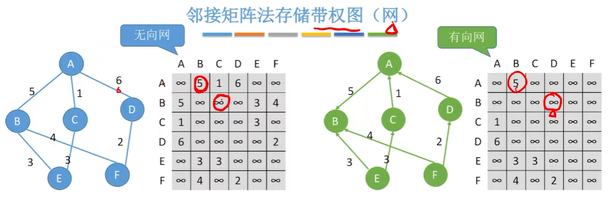


### 1.4性能分析

一个一维数组，一个二维数组，存储空间是O(n) + O(n^2^) = O(n^2^) ，即O(IVI^2^)。

邻接矩阵法求顶点的度/出度/入度的时间复杂度为O(IVI)。

适合用于**稠密图**。


### 1.5==【考点】相乘==

> 线性代数 - 矩阵的乘法

设图 G 的邻接矩阵为 A（矩阵元素为0/1），则A^n^的元素 A^n^\[i]\[j] 等于由顶点 i 到顶点 j 的长度为 n 的路径的数目。

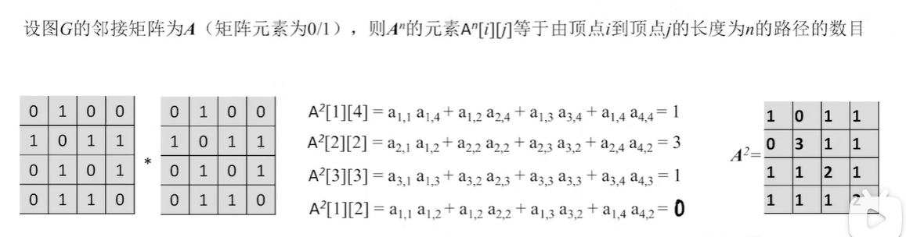

#### ==【考点 - 矩阵内元素的含义】==

A^2^\[1]\[4]：就是从A->B，然后B->D，这样两次（**路径长度为2**）的路径的条数。

A^2^\[1]\[4] = 1，意思是：**从顶点1到顶点4之间长度为2的路径，只有 1 条**。


A^3^同理，表示路径长度为 3 的路径数目。

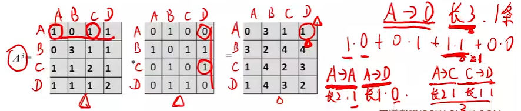


## ❗2.邻接表

- 邻接矩阵的不足：

当一个图为稀疏图时（边数相对顶点较少），使用邻接矩阵法显然要浪费大量的存储空间，如下图所示：


- 邻接表（Adjacency List）：顺序+链式存储

而图的邻接表法结合了**顺序存储 + 链式存储**方法，减少了这种不必要的浪费。

所谓邻接表，是指对图G中的每个顶点 vi 建立一个单链表，第 i 个单链表中的结点表示依附于顶点 vi 的边，这个单链表就称为顶点 vi 的边表。

那么，一个结点的**出度就是单链表内的结点个数**。

边表的头指针和顶点的数据信息采用顺序存储(称为顶点表)，所以在邻接表中存在两种结点：顶点表结点和边表结点，如下图所示：

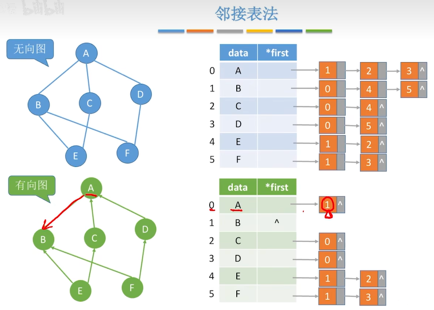

**链表的结点，没有先后顺序，都是直接连在顶点上的**。所以链表有很多表示方式，**不唯一**。

> 一个参考图：
>
> 


存储结构定义：

```c
#define MaxVertexNum  100 //顶点数目最大值
typedef char VertexType;  //顶点的数据类型
typedef int EdgeType;     //带权图中边上权值的数据类型

//边表结点
typedef struct EdgeNode{
	int adjvex;		        //该弧所指向的顶点的下标或者位置
	EdgeType weight;	    //权值，对于非网图可以不需要
	struct EdgeNode *next;	//指向下一个邻接点
}EdgeNode;

//顶点表结点
typedef struct VertexNode{
	VertexType data;	    //顶点域，存储顶点信息
	EdgeNode *firstedge;	//边表头指针
}VertexNode, AdjList[MaxVertexNum];

//邻接表
typedef struct{
	AdjList adjList;
	int vexnum, edgenum;		//图的当前顶点数和边数/弧数
}LinkGraph;
```


### 2.1无向图

无向图存储中，一条边会出现在两端点的链表中，边结点的数量是2|E|，整体空间复杂度为 O(|V|+ 2|E|)。


### 2.2有向图

有向图存储中，边结点的数量是|E|，整体空间复杂度为 O(|V|+ |E|)。


### ❗邻接表-C

```c
/* 图
    邻接表(Adjacency List)
    存储方式是结合了 顺序存储 + 链式存储方法，减少了邻接矩阵不必要的浪费。

    无向图 与 有向图 的区别：就是一条edge是否添加两次到两端节点

	这里默认是无向图，但是在代码中注释了有向图

C实现
*/

#include <stdio.h>
#include <string.h>
#include <stdlib.h>

#define MaxVertexNum  100 //顶点数目最大值
typedef char VertexType;  //顶点的数据类型
typedef int EdgeType;     //带权图中边上权值的数据类型

#define numVertexes 5   // 顶点个数，用于visited数组
#define numEdges 7      // 边个数


//边表结点
typedef struct EdgeNode{
	int adjvex;		        //该弧所指向的顶点的下标或者位置
	EdgeType weight;	    //权值，对于非网图可以不需要
	struct EdgeNode *next;	//指向下一个邻接点
}EdgeNode;

//顶点表结点
typedef struct VertexNode{
	VertexType data;	    //顶点域，存储顶点信息
	EdgeNode *firstedge;	//边表头指针
}VertexNode, AdjList[MaxVertexNum];
// AdjList[MaxVertexNum]是静态的链表

//邻接表
typedef struct{
	AdjList adjList;
	int vexnum, edgenum;		//图的当前顶点数和边数/弧数
}LinkGraph;


void create_Graph(LinkGraph *G);
void create_Graph_ByArray(LinkGraph *G, int edges[][3]);
void print_Graph(LinkGraph G);


int main()
{
	LinkGraph G;
    // 创建图方法1
	// create_Graph(&G);

    // 创建图方法2
    // 这里可以使用int，因为edge的EdgeType是int
    int edges[numEdges][3] = {  // 边的起点序号，终点序号，权值
        {1,2,1},
		{1,5,1},
		{2,3,1},
		{2,4,1},
		{2,5,1},
		{3,4,1},
		{4,5,1}
    };
	create_Graph_ByArray(&G,edges);

	print_Graph(G);

	return 0;
}


// 创建图
void create_Graph(LinkGraph *G){
	int i, j;
	int start, end;  //边的起点序号、终点序号
	int w;   //边上的权值
    
// 所创建图的顶点数和边数(用空格隔开)。这里也可以输入
	G->vexnum = numVertexes;
	G->edgenum = numEdges;

	printf("\n");

	//初始化顶点
	for (i=0; i<G->vexnum; i++){
		G->adjList[i].data = i+1;  //顶点初始化
		G->adjList[i].firstedge = NULL;  //边表头指针初始化为空
	}

	//初始化边
	for (i=0; i<G->edgenum; i++){
		printf("请输入边的起点序号，终点序号，权值(用空格隔开)(int,从1开始,没有0)：");
		scanf("%d%d%d", &start, &end, &w);

		// 创建边表结点
		// 有向图，只需要创建一个结点
		EdgeNode *e = (EdgeNode*)malloc(sizeof(EdgeNode));
		e->adjvex = end-1;  //终点序号
		e->weight = w;

		//将结点e插入顶点表start的边表中
		e->next = G->adjList[start-1].firstedge;
		G->adjList[start-1].firstedge = e;
		
		// 无向图，还要插入终点序号的边表
		//创建边表结点
		EdgeNode *e_ = (EdgeNode*)malloc(sizeof(EdgeNode));
		e_->adjvex = start-1;  //起点序号
		e_->weight = w;

		//将结点e_插入顶点表end的边表中
		e_->next = G->adjList[end-1].firstedge;
		G->adjList[end-1].firstedge = e_;
	}
}


// 使用数组创建图
void create_Graph_ByArray(LinkGraph *G, int edges[][3]){
	int i, j;
	int start, end;  //边的起点序号、终点序号
	int w;   //边上的权值
    
// 所创建图的顶点数和边数(用空格隔开)。这里也可以输入
	G->vexnum = numVertexes;
	G->edgenum = numEdges;

	printf("\n");

	//初始化顶点
	for (i=0; i<G->vexnum; i++){
		G->adjList[i].data = i+1;  //顶点初始化
		G->adjList[i].firstedge = NULL;  //边表头指针初始化为空
	}

	//初始化边
	for (i=0; i<G->edgenum; i++){
		start = edges[i][0];
        end = edges[i][1];
        w = edges[i][2];

		// 创建边表结点
		// 有向图，只需要创建一个结点
		EdgeNode *e = (EdgeNode*)malloc(sizeof(EdgeNode));
		e->adjvex = end-1;  //终点序号
		e->weight = w;

		//将结点e插入顶点表start的边表中
		e->next = G->adjList[start-1].firstedge;
		G->adjList[start-1].firstedge = e;
		
		// 无向图，还要插入终点序号的边表
		//创建边表结点
		EdgeNode *e_ = (EdgeNode*)malloc(sizeof(EdgeNode));
		e_->adjvex = start-1;  //起点序号
		e_->weight = w;

		//将结点e_插入顶点表end的边表中
		e_->next = G->adjList[end-1].firstedge;
		G->adjList[end-1].firstedge = e_;
	}
}

// 输出图
void print_Graph(LinkGraph G){
	int i, j;

	printf("\n图的顶点为:");
	for (i=0; i<G.vexnum; i++){
		printf("%d ", G.adjList[i].data);
	}

	// 输出邻接表
	printf("\n图的邻接矩阵为:\n");
	for (i=0; i<G.vexnum; i++){		//遍历顶点
		printf("%d. %d:> ",i, G.adjList[i].data);	//输出顶点

		EdgeNode *p = G.adjList[i].firstedge;	//边结构
		while (p){							//遍历边
			printf("%d-->", p->adjvex+1);
			p = p->next;
		}
		printf("Null.\n");
	}
}
```

>图的顶点为:1 2 3 4 5
>图的邻接矩阵为:
>
>0. 1:> 5-->2-->Null.
>1. 2:> 5-->4-->3-->1-->Null.
>2. 3:> 4-->2-->Null.
>3. 4:> 5-->3-->2-->Null.
>4. 5:> 4-->2-->1-->Null.


## ==【考点】邻接矩阵VS邻接表==

|                    | 邻接矩阵                             | 邻接表                                                       |
| ------------------ | ------------------------------------ | ------------------------------------------------------------ |
| 空间复杂度         | O( IVI^2^ ) 只与顶点有关             | 无向图O(\|V\|+2\|E\|)；<br />有向图O(\|V\|+\|E\|)。          |
| 适用于             | 稠密图                               | 稀疏图                                                       |
| 表示方式           | 唯一                                 | 不唯一                                                       |
| 计算度、出度、入度 | 必须遍历对应的行或列                 | 计算有向图的度、入度不方便，其余很方便。                     |
| 找相邻的边         | 必须遍历对应的行或列                 | 找有向图的入边不方便，其余很方便。                           |
| 删除边、结点       | 删除边很方便，删除结点要移动大量数据 | 删除边，删除结点（时间复杂度O(n+e)）都不方便                 |
| **无向图**         | 对称矩阵                             | 偶数个**边表结点**。有 n 个顶点，最多边数是 $\C_n^2$，最多边表结点是 $2\C_n^2$. |
| **有向图**         | 非对称矩阵                           | 边表结点可能偶数可能奇数                                     |

【技巧】：

- 遇到邻接矩阵，先看是不是**对称矩阵**。
- 遇到邻接表，先看**边表结点**的个数和奇偶。


### 1）邻接矩阵

1. 在简单应用中，可直接用二维数组作为图的邻接矩阵（顶点信息等均可省略）。
2. 当邻接矩阵中的元素仅表示相应的边是否存在时，EdgeType可定义为值为0和1的枚举类型或者bool。
3. **无向图**的邻接矩阵是对称矩阵，对规模特大的邻接矩阵可采用压缩存储。
4. 邻接矩阵表示法的空间复杂度为O(n^2^)，其中n为图的顶点数|V|。
5. 用邻接矩阵法存储图，很容易确定图中任意两个顶点之间是否有边相连。但是，要确定图中有多少条边，则必须按行、按列对每个元素进行检测，所花费的时间代价很大。
6. 稠密图适合使用邻接矩阵的存储表示。

### 2）邻接表

1. 对于稀疏图，采用邻接表表示将极大地节省存储空间。

2. 在邻接表中，给定一顶点，能很容易地找出它的**所有邻边**，因为只需要读取它的邻接表。在邻接矩阵中，相同的操作则需要扫描一行，花费的时间为O(n)。
  
2. 但是，若要确定给定的**两个顶点间边**是否存在，则在邻接矩阵中可以立刻查到，而在邻接表中则需要在相应结点对应的边表中查找另一结点，效率较低。
  
2. 在**无向图**的邻接表表示中，因为每一条边都存储两次，所以**边表结点**的个数一定是**偶数**。如果边结点个数为奇数，那么就是有向图。
  
   ==有 n 个顶点，最多边数是 $\C_n^2$，最多边表结点是 $2\C_n^2$.==
   
3. 在**有向图**的邻接表表示中，
  
   求一个给定顶点的出度只需计算其邻接表中的结点个数；
   但求其顶点的入度则需要遍历全部的邻接表。
   
   因此，也有人采用**逆邻接表**的存储方式来加速求解给定顶点的入度。当然，这实际上与邻接表存储方式是类似的。
   
4. 图的邻接表表示并不唯一，因为在每个顶点对应的单链表中，各边结点的链接次序可以是任意的，它取决于建立邻接表的算法及边的输入次序。


## 3.十字链表（有向图）

十字链表是有向图的一种链式存储结构。

- 邻接表的不足：

对于有向图来说，邻接表是有缺陷的。了解入度就必须要遍历整个图才能知道；反之，逆邻接表解决了入度却不了解出度的情况。

- 十字链表(Orthogonal List)

把**邻接表**与**逆邻接表**结合起来就是我们现在要介绍的有向图的一种存储方法：**十字链表(Orthogonal List)**。

顶点结点结构：

| data | firstin | firstout |
| ---- | ------- | -------- |

firstin：表示**作为入边**表头指针，指向该顶点的入边表中第一个结点；
firstout：表示**作为出边**表头指针，指向该顶点的出边表中的第一个结点。

边结点结构：

| tailvex | headvex | info | headlink | taillink |
| ------- | ------- | ---- | -------- | -------- |

tailvex：是指**弧起点**在顶点表的下标；
headvex：是指**弧终点**在顶点表中的下标；
headlink：是指入边表指针域，指向**终点相同**的下一条边；
taillink：是指边表指针域，指向**起点相同**的下一条边。

如果是网，还可以再增加一个 info 域来存储权值。

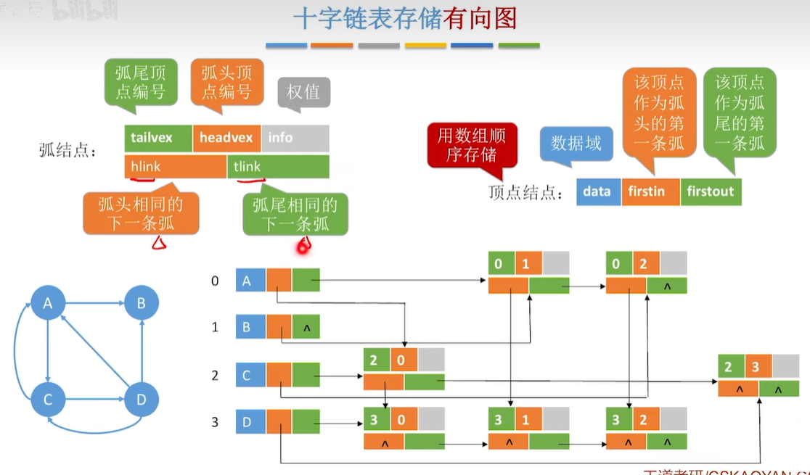

### 3.1性能分析

空间复杂度：顶点个数+边的个数	O(|V|+|E|)

在此把**邻接表**与**逆邻接表**结合起来，解决了存储时候，有冗余的问题，也更容易求得顶点的出度和入度。而且它除了结构复杂一点外，其实创建图算法的时间复杂度是和邻接表相同的。


## 4.邻接多重表（无向图）

邻接多重表是无向图的另一种链式存储结构。

- 邻接表的不足：

在邻接表中，容易求得顶点和边的各种信息，但每条边对应两条冗余信息。删除顶点、删除边等操作时，需要分别在两个顶点的边表中遍历，效率较低。

eg. 如果要删除一条边，那么在邻接表中，要在两个顶点（边的两端点）的单链表中进行边的删除。

>若要删除左图的( V0 , V2 )这条边，需要对邻接表结构中右边表的阴影两个结点进行删除操作，显然这是比较烦琐的。
>
>
>
>

- 邻接多重表(adjacent multiList)

顶点结点结构：

| data | firstedge |
| ---- | --------- |

data 域存储该顶点的相关信息；
firstedge 域指示第一条依附于该顶点的边。

边结点结构：

| ivex | jvex | info | ilink | jlink |
| ---- | ---- | ---- | ----- | ----- |

ivex和jvex是与某条边依附的两个顶点在顶点表中下标。
ilink 指向依附顶点ivex的下一条边，jlink 指向依附顶点jvex的下一条边。

如果是网，还可以再增加一个 info 域来存储权值。

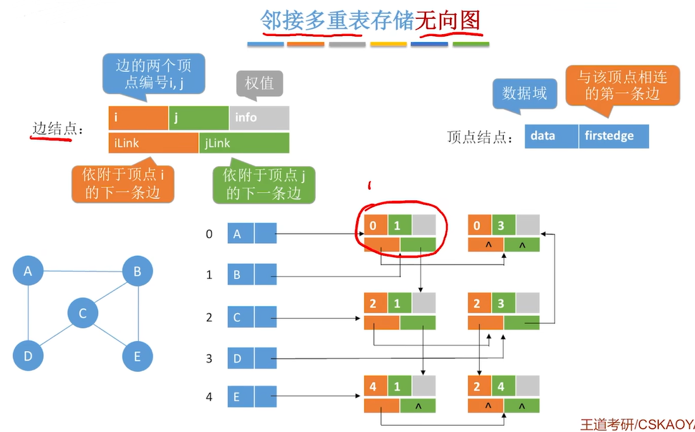

删除一条边，就改变它的两个link指针。


删除一个顶点，那么就把对应的边表清空。

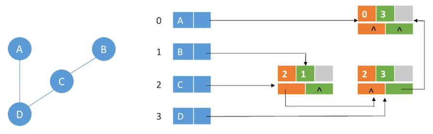

### 4.1性能分析

空间复杂度：顶点个数+边的个数	O(|V|+|E|)

删除边、结点等的操作很方便。


## 5.边集数组

边集数组是由两个数组构成。一个是存储顶点的信息；另一个是存储边的信息。

这个边数组每个数据元素由一条边的起点下标(begin)、 终点下标(end)和权(weight)组成，如下图所示：

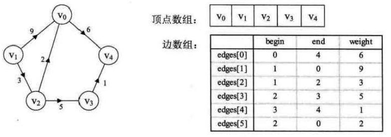

显然边集数组**关注的是边**的集合，在边集数组中要查找一个顶点的度需要扫描整个边数组，效率并不高。因此它更适合对边依次进行处理的操作，而不适合对顶点相关的操作。


# 三、基本操作与应用

> 这一部分的代码一般比较复杂，所有考研大概率不会直接考代码。

## 1.==【考点】图的遍历==

图的遍历是和树的遍历类似，我们希望**从图中某一顶点出发访遍图中其余顶点，且使每一个顶点仅被访问一次， 这一过程就叫做图的遍历（Traversing Graph）。**

对于图的遍历来，通常有两种遍历次序方案：

1. 深度优先遍历DFS
2. 广度优先遍历BFS

|      | 深度优先遍历DFS               | 广度优先遍历BFS         |
| ---------- | ------------------------- | -------------------- |
| 树的遍历        | **先序遍历**       | **层序遍历**         |
| 特点        | 递归调用自身；<br />每个点仅访问一次。       | 分层的查找过程；<br />不是一个递归的算法；<br />借助一个辅助队列（每个点仅能进队一次）。 |
| 空间复杂度（DFS&BFS相同） | O（V）         | O（V）          |
| 时间复杂度（DFS&BFS相同） | 邻接矩阵：O（V^2^），<br />邻接表：O（V+E）        | 邻接矩阵：O（V^2^），<br />邻接表：O（V+E） |
| 生成树（遍历序列）的唯一性（DFS&BFS相同） | 邻接矩阵：**唯一**的，<br />邻接表：**不唯一**的 | 邻接矩阵：**唯一**的，<br />邻接表：**不唯一**的 |
| 应用 | 判断是否有**回路** |  |


### 1.1 深度优先遍历DFS

**深度优先遍历（Depth First Search）**，也有称为深度优先搜索，简称为DFS。

#### 1.1.1 DFS算法

深度优先搜索类似于树的**先序遍历**。如其名称中所暗含的意思一样，这种搜索算法所遵循的搜索策略是尽可能“深”地搜索一个图，每次都尝试向更深的节点走。它的基本思想如下：

首先访问图中某一起始顶点v，然后由v出发，访问与v邻接且未被访问的任一顶点w1，再访问与 w1 邻接且未被访问的任一顶点…重复上述过程。当不能再继续向下访问时，依次**退回到==最近==被访问的顶点**，若它还有邻接顶点未被访问过，则从该点开始继续上述搜索过程，直至图中所有顶点均被访问过为止。

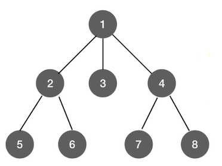

先序遍历：12563478

- DFS 最显著的特征在于其 **递归调用自身**。
- 同时与 BFS 类似，DFS 会对其访问过的点打上访问标记，在遍历图时跳过已打过标记的点，以确保**每个点仅访问一次**。

符合以上两条规则的函数，便是广义上的 DFS。算法过程如下：

```c
bool visited[MAX_VERTEX_NUM];	//访问标记数组

//从顶点出发，深度优先遍历图G
void DFS(Graph G, int v){
	visit(v);	//访问顶点
	visited[v] = TRUE;	//设已访问标记
	//FirstNeighbor(G,v):求图G中顶点v的第一个邻接点，若有则返回顶点号，否则返回-1。
	//NextNeighbor(G,v,w):假设图G中顶点w是顶点v的一个邻接点，返回除w外顶点v
	for(int w = FirstNeighbor(G, v); w>=0; w=NextNeighor(G, v, w)){
		if(!visited[w]){	//w为v的尚未访问的邻接顶点
			DFS(G, w);//递归
		}
	}
}
```

但是如果是**非连通图**，那么就不能从一个结点遍历所有的结点。这个时候需要添加一个函数来寻找没被访问的结点。

```c
//深度遍历算法final
bool visited[MAX_VERTEX_NUM];	//访问标记数组

//从顶点出发，深度优先遍历图G
void DFS(Graph G, int v){
	visit(v);	//访问顶点
	visited[v] = TRUE;	//设已访问标记
	//FirstNeighbor(G,v):求图G中顶点v的第一个邻接点，若有则返回顶点号，否则返回-1。
	//NextNeighbor(G,v,w):假设图G中顶点w是顶点v的一个邻接点，返回除w外顶点v
	for (int w = FirstNeighbor(G, v); w>=0; w=NextNeighor(G, v, w)){
		if (!visited[w]){	//w为v的尚未访问的邻接顶点
			DFS(G, w);//递归
		}
	}
}

//对图进行深度优先遍历
void DFSTraverse(MGraph G){
	for (int v=0; v<G.vexnum; v++){
		visited[v] = FALSE;	//初始化已访问标记数据
	}
	for (int v=0; v<G.vexnum; v++){	//从v=0开始遍历
		if(!visited[v]){
			DFS(G, v);
		}
	}
}
```

#### 1.1.2 DFS算法的性能分析

空间复杂度：DFS算法是一个递归算法，需要借助一个递归工作栈。最坏情况是 **O(|V|)**。

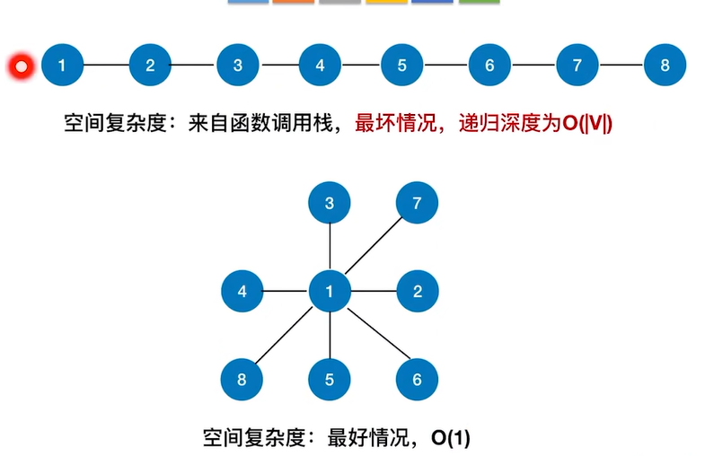

时间复杂度：

- 邻接矩阵：需要访问|V|个结点，然后查找|V|个结点的邻接点|V|个，那么时间复杂度为  O(|V|+|V|^2^)。
   **O(|V|^2^)**
- 邻接表：需要访问|V|个结点，然后查找每个结点的邻接点总共需要O(2|E|)时间，那么时间复杂度为  O(|V|+2|E|)。
  **O(|V|+|E|)**

#### 1.1.3 深度优先的生成树和生成森林

1. 从不同的点出发，得到的遍历序列不一样；即使从同一个点出发，也可能得到不同的遍历序列。
2. 因为**邻接矩阵**的表示方式是唯一的，所以DFS算法得到的遍历序列**是唯一**的。
3. 因为**邻接表**的表示方式不是唯一的，所以DFS算法得到的遍历序列**不是唯一**的。

对一个图进行所有结点的遍历，那么在这个遍历过程中不是所有的边都被用到：

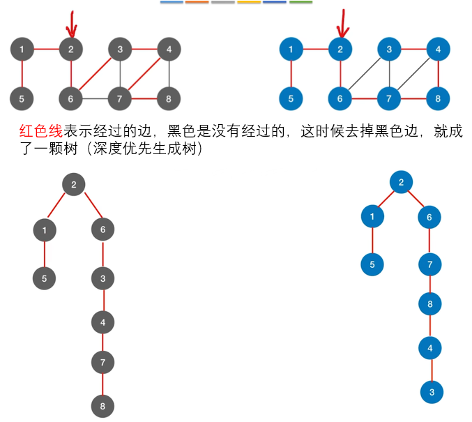

**【注意】**当图里面有多个**连通分量**，那么就会有多个生成树，这时候这些树就组成一个生成森林。


### 1.2 广度优先遍历BFS

**广度优先遍历（Breadth First Search）**，又称为广度优先搜索，简称BFS。

#### 1.2.1 BFS算法

如果说图的深度优先遍历类似树的前序遍历，那么图的广度优先遍历就类似于树的**层序遍历**了。

广度优先搜索是一种**分层的查找过程**，每向前走一步可能访问一批顶点，不像深度优先搜索那样有往回退的情况，因此它**不是一个递归的算法**。为了实现逐层的访问，算法必须**借助一个辅助队列**，以记忆正在访问的顶点的下一层顶点。

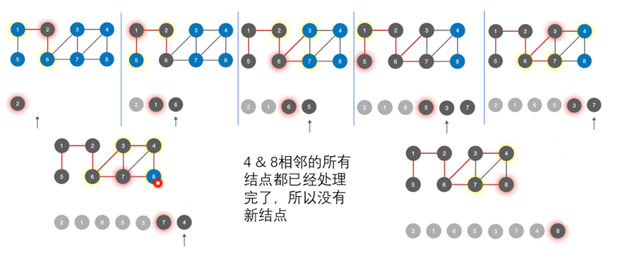

以下是广度优先遍历的代码：

从结点v出发遍历：

```c
//邻接矩阵的广度遍历算法。从结点v出发遍历
void BFS(MGraph G, int v){
	Queue Q;
    //把所有结点全部标记为false，表示没有访问过
	for(int i = 0; i<G.numVertexes; i++){
		visited[i] = FALSE;
	}
	InitQueue(&Q);	//初始化一辅助用的队列
    
    visit(v);	//访问顶点
	vivited[v] = TRUE;	//设置当前访问过
    EnQueue(&Q, v);	//将此顶点入队列
            
    //若当前队列不为空
    while(!QueueEmpty(Q)){
        DeQueue(&Q, &v);	//顶点v出队列

        //FirstNeighbor(G,v):求图G中顶点v的第一个邻接点，若有则返回顶点号，否则返回-1。
        //NextNeighbor(G,v,w):假设图G中顶点w是顶点v的一个邻接点，返回除w外顶点v

        //把出队结点的相邻的所有结点入队
        for(int w=FirstNeighbor(G, v); w>=0; w=NextNeighbor(G, v, w)){
            //检验v的所有邻接点
            if(!visited[w]){
                visit(w);	//访问顶点w
                visited[w] = TRUE;	//访问标记
                EnQueue(&Q, w);	//顶点w入队列
            }//if
        }//for
    }//while
}
```

但是如果是**非连通图**，那么就不能从一个结点遍历所有的结点。这个时候需要添加一个函数来寻找没被访问的结点。

```c
//邻接矩阵的广度遍历算法final
void BFSTraverse(MGraph G){
	int i, j;
	Queue Q;
    //把所有结点全部标记为false，表示没有访问过
	for(i = 0; i<G.numVertexes; i++){
		visited[i] = FALSE;
	}
	InitQueue(&Q);	//初始化一辅助用的队列
    
	for(i=0; i<G.numVertexes; i++){		//这里是从0开始
		//若是未访问过就处理
		if(!visited[i]){
            
        //下面的部分相当于前面写的BFS(G, v);
            
			visit(i);	//访问顶点
            vivited[i] = TRUE;	//设置当前访问过
			EnQueue(&Q, i);	//将此顶点入队列
            
			//若当前队列不为空
			while(!QueueEmpty(Q)){
				DeQueue(&Q, &i);	//顶点i出队列
                
				//FirstNeighbor(G,v):求图G中顶点v的第一个邻接点，若有则返回顶点号，否则返回-1。
				//NextNeighbor(G,v,w):假设图G中顶点w是顶点v的一个邻接点，返回除w外顶点v
                
                //把出队结点的相邻的所有结点入队
				for(j=FirstNeighbor(G, i); j>=0; j=NextNeighbor(G, i, j)){
					//检验v的所有邻接点
					if(!visited[j]){
						visit(j);	//访问顶点j
						visited[j] = TRUE;	//访问标记
						EnQueue(Q, j);	//顶点j入队列
					}//if
				}//for
			}//while
            
		}//if
	}//for
}
```

下面的部分相当于前面写的BFS(G, v);，所以还有一种写法是**把BFSTraverse 和 BFS分开**。

```c
//对非连通图的广度遍历算法final
void BFSTraverse(MGraph G){
    Queue Q;
    InitQueue(&Q);	//初始化一辅助用的队列
    
	int i;
    //把所有结点全部标记为false，表示没有访问过
	for(i=0; i<G.numVertexes; i++){
		visited[i] = FALSE;
	}
	
    
	for(i=0; i<G.numVertexes; i++){		//这里是从0开始
		//若是未访问过就处理
		if(!visited[i]){
			BFS(G, i);	//调用BFS函数
        }//if
	}//for
}

void BFS(MGraph G, int v){
    visit(v);	//访问顶点
    vivited[v] = TRUE;	//设置当前访问过
    EnQueue(&Q, v);	//将此顶点入队列

    //若当前队列不为空
    while(!QueueEmpty(Q)){
        DeQueue(&Q, &v);	//顶点i出队列

        //FirstNeighbor(G,v):求图G中顶点v的第一个邻接点，若有则返回顶点号，否则返回-1。
        //NextNeighbor(G,v,w):假设图G中顶点w是顶点v的一个邻接点，返回除w外顶点v

        //把出队结点的相邻的所有结点入队
        for(w=FirstNeighbor(G, v); w>=0; w=NextNeighbor(G, v, w)){
            //检验v的所有邻接点
            if(!visited[w]){
                visit(w);	//访问顶点w
                visited[w] = TRUE;	//访问标记
                EnQueue(Q, w);	//顶点w入队列
            }//if
        }//for
    }//while
}
```

**对于无向图，调用BFS函数的次数 = 连通分量**。

#### 1.2.2 BFS算法性能分析

空间复杂度：最坏情况是当所有结点都连在第一个结点上，辅助队列大小为 **O(|V|)**。

时间复杂度：

- 邻接矩阵：需要访问|V|个结点，然后查找|V|个结点的邻接点|V|个，那么时间复杂度为  O(|V|+|V|^2^)。
   **O(|V|^2^)**
- 邻接表：需要访问|V|个结点，然后查找每个结点的邻接点总共需要O(2|E|)时间，那么时间复杂度为  O(|V|+2|E|)。
  **O(|V|+|E|)**

#### 1.2.3 广度优先的生成树和生成森林

对一个图进行所有结点的遍历，那么在这个遍历过程中不是所有的边都被用到：

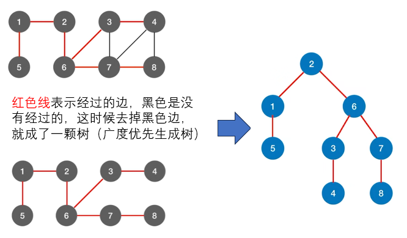

【注意】BFS算法得到的遍历序列 就是 广度优先生成树。

- 因为**邻接矩阵**的表示方式是唯一的，所以BFS算法得到的遍历序列**是唯一**的。
- 因为**邻接表**的表示方式不是唯一的，所以BFS算法得到的遍历序列**不是唯一**的。

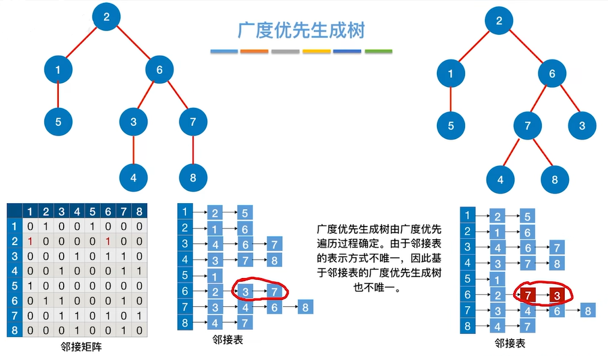

当图里面有多个连通分量，那么就会有多个生成树，这时候这些树就组成一个生成森林。


### 1.3==【考点】遍历的唯一性==

1. 如果题目只给了**图**，没有说什么存储方式实现的，那这些遍历就**不唯一**的。

2. 如果题目给了**邻接矩阵or邻接表**，那这些遍历就是**唯一**的。

   因为邻接矩阵是唯一的。我们默认从左向右遍历。如果你从右向左遍历就不唯一了。

   因为邻接表中的边结点顺序已经确定了。

3. 如果题目给了图，让你画出邻接矩阵，那这些遍历也是唯一的。---因为邻接矩阵是唯一的

4. 如果题目给了图，让你画出邻接表(**没有说顺序**，按照升序还是降序或者某种别的顺序)，那这些遍历**不唯一**的。--因为你可以画很多不同的邻接表，这些邻接表之间的遍历不一样。

5. 如果题目给了图，让你画出邻接表(按照升序还是降序或者某种别的顺序)，那这些遍历是唯一的。---因为你只能画一种邻接表，邻接表中的边结点的前后顺序一定确定了。


### 1.4==【考点】图的遍历与图的连通性==

图的遍历算法可以用来判断图的连通性。

- 对于**无向图**进行BFS/DFS遍历。

  ==BFS/DFS函数的**调用次数** = **连通分量数**==。

  - 若是**连通图**的，则从任一结点出发， 仅需一次遍历就能够访问图中的所有顶点，只需调用1次BFS/DFS。
  - 若是**非连通**的，则从某一个顶点出发，一次遍历只能访问到该顶点所在连通分量的所有顶点，而对于图中其他连通分量的顶点，则无法通过这次遍历访问。

- 对于**有向图**进行BFS/DFS遍历。
  调用BFS/DFS函数的次数要具体问题具体分析

  - 若起始顶点到其他各顶点都有路径，则只需调用1次BFS/DFS函数，对于**强连通图**，从任一结点出发都只需调用1次BFS/DFS。
  - 但是从起始顶点不能到达所有结点，那么需要调用多次BFS/DFS。


## 2.最小生成树MST

一个图可以有多个生成树，我们定义无向连通图的 **最小生成树**（Minimum Spanning Tree，MST）为所有**边的权值的和最小**的生成树。

**【注意】**：

1. 最小生成树也**可能有多个**。
   - 只要无向连通图中的边权值都不一样，那么最小生成树**唯一**。

2. 一个连通图的生成树是一个**极小的连通子图**，它含有图中全部的顶点。
   - 如果一个连通图本身就是一棵树，则其最小生成树就是它本身。
3. 只有连通图才有生成树，而对于非连通图，只存在生成森林。


构造最小生成树有多种算法，但大多数算法都利用了最小生成树的下列性质：

<u>假设G=(V,E)是个带权连通无向图，U是顶点集V的一个非空子集（U∈V）。若(u,v)是一条具有最小权值的边，其中u∈U, v∈V-U，则必存在一棵包含边(u,v)的最小生成树。</u>

基于该性质的最小生成树算法主要有Prim算法和Kruskal算法，它们都基于**贪心算法**的策略。下面介绍一个通用的最小生成树算法：

```pseudocode
GENERIC_MST(G){
	T=NULL;
	while T 未形成一棵生成树;
		do 找到一条最小代价边(u, v)并且加入T后不会产生回路;
			T=T U (u, v);
}
```

通用算法每次加入一条边以逐渐形成一棵生成树，下面介绍两种实现上述通用算法的途径。

### 2.1 ==【考点】普里姆(Prim)算法==

==**<u>从一个顶点开始</u>，每次将代价最小的新顶点纳入生成树,直到所有顶点都纳入为止。**==

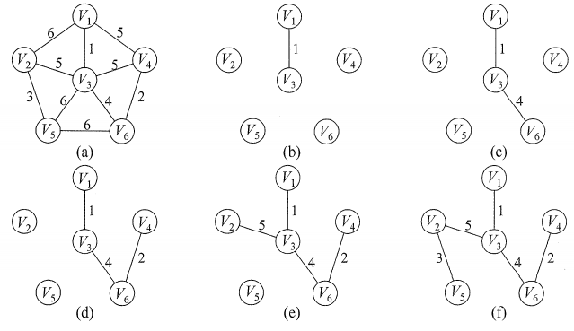

- Prim算法只和**顶点**个数有关系，它的时间复杂度是**O(|V|^2^)**。
- 适合于边**稠密的图**。

---

#### 算法思路

创建两个数组`isJoin`标记各节点是否已经加入树，`lowCost`标记各节点加入树的最低代价。

**初始化**：把第一个结点v0的`isJoin`除了它自己全部标记为false，`lowCost`填入边的权值（不相连为∞）。

**找出 lowCost 最小的结点v1加入（isJoin = true），这个时候，<u>初始结点v0和这个新结点v1就是一个树</u>，那么 lowCost 保存的是整棵树的的最低代价，所以需要遍历新加入的结点v1的边的权值，当初始节点v0的 lowCost 大于新结点v1的 lowCost ，则直接更新 lowCost 为那个更小的权值。**

**再在 lowCost 中<u>寻找权值最小的结点，然后加入树，然后遍历它的 lowCost 进行替换</u>。直到所有结点都加入生成树。**

也就是每个结点都遍历一遍lowCost，所以时间复杂度为O(n^2^)。

> 初始化：
>
> 然后进行第一轮low的遍历
>
> 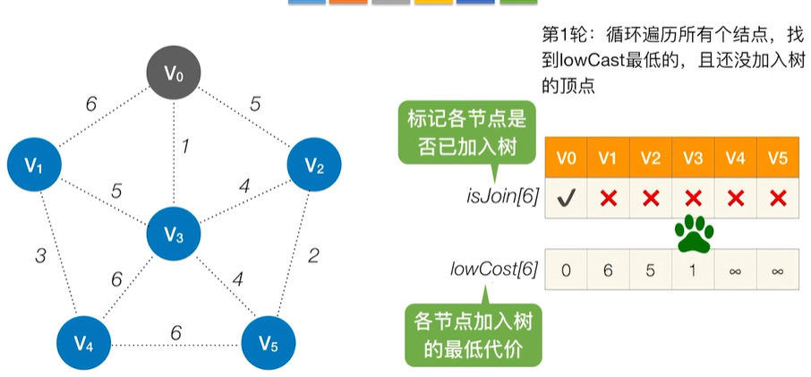
>
> 修改lowCost之后，修改isJoin：
>
> 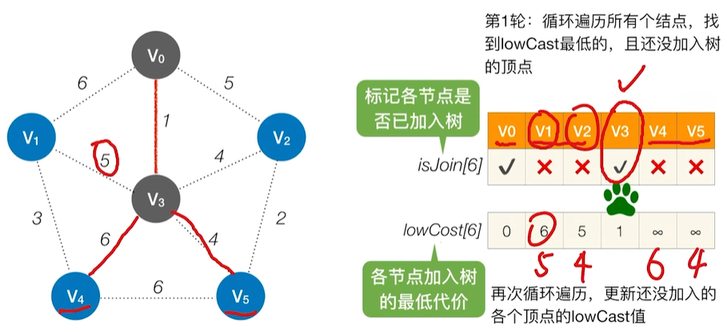
>
> 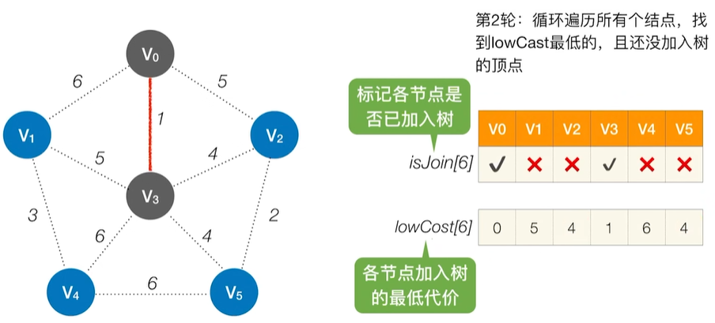
>
> 然后这个点就结束了，再去寻找下一个lowCost最低的点：
>
> 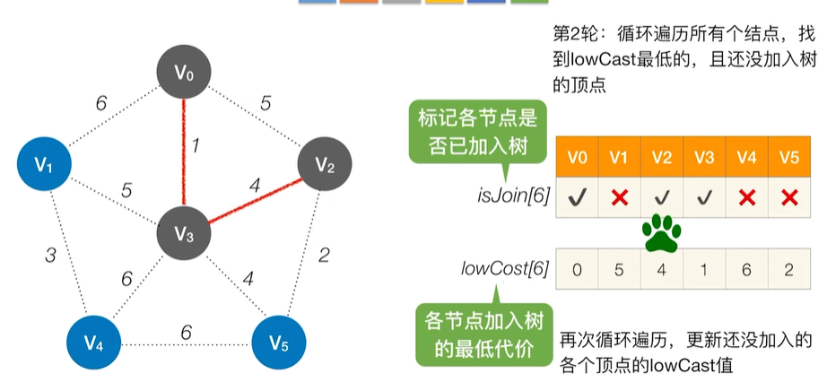
>
> ...一直扫描所有点，直到isJoin全部为true：
>
> 


在邻接矩阵中：

```c
// 最小生成树MST - Prim算法
// 贪心, O(n^2), 适用于稠密图
void MiniSpanTree_Prim(MGraph G){
	int i, j;
	int v, min; 			//min是最小权值，v是最小权值的下标
	int adjvex[G.vexnum];	//保存相关顶点下标
	int lowCost[G.vexnum];	//保存标记各节点加入树的最低代价

//初始化
	lowCost[0] = 0;	//初始化第一个权值为0，即v0加入生成树
	//lowCost的值为0，在这里就是此下标的顶点已经加入生成树
	adjvex[0] = 0;	//初始化第一个顶点下标为0

	for(i=0; i<G.vexnum; i++){
		lowCost[i] = G.Edge[0][i];	//将v0顶点与之组成边的权值存入数组
		adjvex[i] = 0;	//初始化都为v0的下标
	}

//寻找
	for(i=1; i<G.vexnum; i++){
		min = INFINITY;	//初始化最小权值为∞，通常设置一个不可能的很大的数字
		j = 1;	//0已经初始化，从1开始
		v = 0;

		//循环全部顶点找最小权值
		while(j < G.vexnum){
			//如果权值不为0且权值小于min
			if(lowCost[j]!=0 && lowCost[j]<min){
				min = lowCost[j];	//则让当前权值成为最小值
				v = j;	//将当前最小值的下标存入k
			}
			j++;
		}

		printf("(%d, %d)", adjvex[v], v);	//打印当前顶点边中权值的最小边

		for(j=1; j<G.vexnum; j++){ //修改lowCost数组
			//若下标为v顶点各边权值小于此前这些顶点未被加入生成树权值
			if(lowCost[j]!=0 && G.Edge[v][j] < lowCost[j]){
				lowCost[j] = G.Edge[v][j];	//将较小权值存入lowCost
				adjvex[j] = v;	//将下标为v的顶点存入adjvex
			}
		}
	}//for
}
```

由算法代码中的循环嵌套可得知此算法的时间复杂度为O(n^2^)。


### 2.2 ==【考点】克鲁斯卡尔(Kruskal)算法==

与Prim算法从顶点开始扩展最小生成树不同，Kruskal 算法是一种按权值的递增次序选择合适的边来构造最小生成树的方法。

==**这个算法不选择一开始的顶点，<u>直接找权值最小的边</u>，从小到大加入边，是个贪心算法。**==

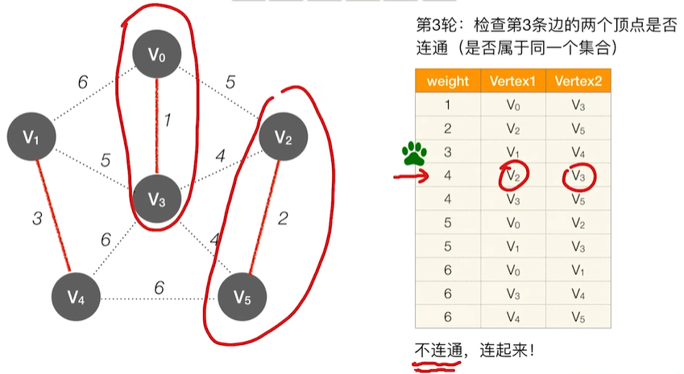

- Kruskal算法只关系**边**的个数，它的时间复杂度是**O(|E|log~2~|E|)**。
- 适合于边**稀疏的图**，顶点可以较多。

---

#### 算法思路

因为 kruskal 算法每次找的是权值最小的边，所以可以**预处理把所有的边进行排序。用 `weight, V1, V2` 保存这样一个边的信息，weight是权值，V1, V2是它连接的两个结点。**

**<u>一开始，每一个结点都可以看作不同的集合。当一个边的权值足够小，并且两个结点V1, V2属于不同的集合，那么这时候就可以把两个结点连起来（选择这条边）构成一个新的集合。</u>**

一直从小到大遍历完所有的边。

> 

算法虽简单，但需要相应的数据结构来支持……具体来说，维护一个森林，查询两个结点是否在同一棵树中，连接两棵树。

抽象一点地说，维护一堆 **集合**，查询两个元素是否属于同一集合，合并两个集合。

其中，查询两点是否连通和连接两点可以使用并查集维护。

如果使用 O(mlog m) 的排序算法，并且使用 O(mα(m,n)) 或 O(mlog m) 的并查集，就可以得到时间复杂度为 O(mlog m) 的 Kruskal 算法。

---

于是Kruskal算法代码如下：

```c++
/*Kruskar算法生成最小生成树*/
void MiniSpanTree_Kruskal(MGraph G){
	int i, n, m;
	Edge edges[MAXEDGE];	//定义边集数组
	int parent[MAXVEX];	//定义一数组用来判断边与边是否形成环路
	/*此处省略将邻接矩阵G转化为边集数组edges并按照权由小到大排序的代码*/
	for(i=0; i<G.numVertexes; i++){
		parent[i] = 0;	//初始化数组为0
	}
	for(i=0; i<G.numVertexes; i++){
		n = Find(parent, edges[i].begin);
		m = Find(parent, edge[i],end);
		//假如n与m不等，说明此边没有与现有生成树形成环路
		if(n != m){
		//将此边的结尾顶点放入下标为起点的parent中表示此顶点已经在生成树集合中
            parent[n] = m;
            printf("(%d, %d, %d)", edges[i].begin, edges[i].end, edges[i].weight);
		}
	}
}

/*查找连线顶点的尾部下标*/
int Find(int *parent, int f){
	while(parent[f] > 0){
		f = parent[f];
	}
	return f;
}
```

此算法的Find函数由边数n决定，时间复杂度为O(logn)，而外面有一个for循环n次。所以克鲁斯卡尔算法的时间复杂度为O(nlogn)。

---

对比两个算法，克鲁斯卡尔算法主要是针对边来展开，边数少时效率会非常高，所以对于稀疏图有很大的优势;而普里姆算法对于稠密图，即边数非常多的情况会更好一些。


### 2.3 Boruvka 算法

> 考研大概率不考

很容易发现，对于某些毒瘤的问题，边的数量极其大，而边集内部又存在各种规律可能需要套上各种数据结构加以优化。但是此时Kruskal和Prim并不能很好的嵌合进这些数据结构。此时我们可以引入Boruvka算法。

该算法的思想是前两种算法的结合。它可以用于求解无向图的最小生成森林。（无向连通图就是最小生成树。）在边具有较多特殊性质的问题中，Boruvka 算法具有优势。例如 [CF888G](https://codeforces.com/problemset/problem/888/G) 的完全图问题。

对于Boruvka算法，一个比较笼统的表述是，一个多路增广版本的Kruskal。

#### 2.3.1基本原理

在并查集算法中，初始状态下我们将每个点视为一个独立的点集，并不断地合并集合。

**在Brouvka算法中，我们在一开始将所有点视为独立子集，每次我们找到两个集合(即为连通块)之间的最短边，然后扩展连通块进行合并。不断扩大集合(连通块)直到所有点合并为一个集合(连通块)**

可以发现，Boruvka算法将求解最小生成树的问题分解为求连通块间最小边的问题。它的基本思想是：生成树中所有顶点必然是连通的，所以两个不相交集必须连接起来才能构成生成树，而且所选择的连接边的权重必须最小，才能得到最小生成树。

通过一张动态图来举一个例子：


#### 2.3.2基本过程

1. 首先将所有点视为各自独立的集合，初始化一个空的MST;
2. 当子集个数大于1的时候，对各个子集和执行以下操作:
   1. 找到与当前集合有边的集合，选出权值最小的边;
   2. 如果该权值最小的边不在MST中;

```c
#include <bits/stdc++.h>
using namespace std;

const int N = 1e5 + 10;
const int M = 1e6 + 10;

struct node { int u, v, w; } edge[M];

int f[N], best[N];
bool vis[N];
int n, m;

int find(int x){
    return f[x] == x ? x : find(f[x]);
}

inline const bool cmp(int u, int v){
    if(v == 0) return 1;
    if(edge[u].w != edge[v].w) return edge[u].w < edge[v].w;
    return u < v;
}

inline void init(){
    cin >> n >> m;
    for(int i = 1; i <= m; i++) cin >> edge[i].u >> edge[i].v >> edge[i].w;
    for(int i = 1; i <= n; i++) f[i] = i;
}

inline int boruvka(){
    memset(vis, 0, sizeof(vis));
    int ans = 0, cnt = 0;
    bool status = true;
    while(true){
        status = false;
        //遍历边集
        for(int i = 1; i <= m; i++){
            if(!vis[i]){
                int uu = find(edge[i].u), vv = find(edge[i].v);
                if(uu == vv) continue;
                if(cmp(i, best[uu])) best[uu] = i;
                if(cmp(i, best[vv])) best[vv] = i; 
            }
        }
        //遍历点集
        for(int i = 1; i <= n; i++){
            if(best[i] && !vis[best[i]]){
                status = true, cnt++, ans += edge[best[i]].w;
                vis[best[i]] = 1;
                int uu = find(edge[best[i]].u), vv = find(edge[best[i]].v);
                f[uu] = vv;
            }
        }
    }
    if(cnt == n - 1) return ans;
    return -1;
}

signed main(){
    init();
    boruvka();
    return 0;
}
```


## 3.最短路径

在网图和非网图中，最短路径的含义是不同的。

1. 由于**非网图**它没有边上的权值，所谓的最短路径，其实就是指两顶点之间经过的**边数最少的路径**。

2. 对于**网图**来说，最短路径，是指两顶点之间经过的边上**权值之和最少**的路径，并且我们称路径上的第一个顶点是**源点**，最后一个顶点是**终点**。


- **单源最短路径**
  - BFS(广度优先算法)算法（无权图）
  - 迪杰斯特拉(Dijkstra)算法（无权图、带权图）
- **各个顶点之间的最短路径**
  - 弗洛伊德(Floyd)算法（无权图、带权图）


### 3.1 BFS 算法

【技巧】**不带权值图**其实就是一直特殊的带权图，只是权值都是1。

通过一次遍历，就得到了每个结点到源点的距离。所以求最短路径的代码可以通过BFS遍历得到：

```c
//BFS广度遍历算法求最短路径
void BFS_MIN_Distance(MGraph G, int v){
    Queue Q;
	InitQueue(&Q);	//初始化一辅助用的队列
    
    //d[i]表示从u到i结点的最短路径
    for(int i=0; i<G.numVertexes; ++i){
    	d[i] = 32767;	//初始化为无穷，意为不相连
    	path[i]=-1;		//最短路径从哪个顶点过来，就上这条路的上一个结点，这里是源点所以是-1
    }
    
//源点处理
    d[v]=0;		//结点本身，距离为0
    visit(v);	//访问顶点
    vivited[v]=TRUE;	//设置当前访问过
    EnQueue(&Q, v);	//将此顶点入队列

//BFS
    while(!QueueEmpty(Q)){
        DeQueue(&Q, &v);	//顶点i出队列
        for(w=FirstNeighbor(G, v); w>=0; w=NextNeighbor(G, v, w)){
            //检验v的所有邻接点
            if(!visited[w]){
                d[w]=d[v]+1	//路径长度+1
                path[w]=v;	//w的上一个结点是v
                visit(w);	//访问顶点w
                visited[w]=TRUE;	//访问标记
                EnQueue(Q, w);	//顶点w入队列
            }//if
        }//for
    }//while
}
```


### 3.2==【考点】迪杰斯特拉(Dijkstra)算法==

Dijkstra算法[1]用于**构建单源点**的最短路径—，即图中某个点到任何其他点的距离都是最短的。例如，构建地图应用时查找自己的坐标离某个地标的最短距离。可以用于有向图，但是不能存在**负权值**。

Dijstra算法在计算迭代的过程中，使用**并查集**来进行判断点的使用否。

【步骤】：

1. 从一个顶点开始先连接可以一步直达的点；

2. 在当前的路径里找一个最短的路径进行锁定，并把那个新的点放入并查集；

3. 利用并查集里面的点作为原始点，进行下一波路径的更新；

   【注意】初始路径到达不了就是∞，更新是只要比前一轮的路径短，就进行更新。

4. 同样选择新更新的路径里面的最短路径的那个点放入并查集；

5. 重复上述操作，直到所有点都进入并查集。

==【总结】==：

1. ==初始化：是把一个顶点放入并查集。==
2. ==根据并查集内的点，找到能走**一步**到达的路径，并把这些走一步的路径里面的路径权值最小的那个到达的点放入并查集，并锁定这条路径（就是**最短路径**）。==
3. ==结束：直到全部的点都在并查集结束。==

**【注意】每一轮都会确定一个点的最短路径**，也就是说有 n 个点，就需要进行 n-1 轮。

那么时间复杂度就是 O(n^2^)。因为每轮会遍历一遍n个结点。

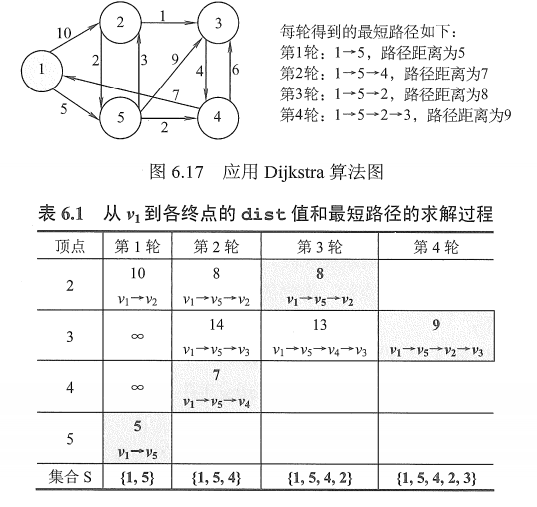

实在是不懂看视频：[6.4_3_最短路径问题_Dijkstra算法_哔哩哔哩_bilibili](https://www.bilibili.com/video/BV1b7411N798/?p=66&spm_id_from=pageDriver&vd_source=9d3c5a863c7c6dbd5152dd7c4e9dc492)

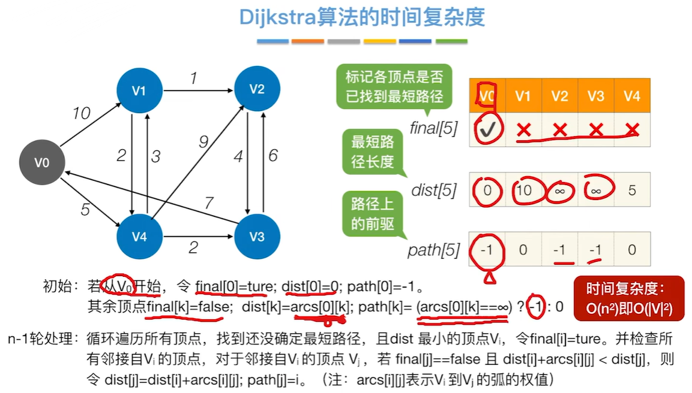

显然，Dijkstra算法也是基于贪心策略的。使用邻接矩阵或者带权的邻接表表示时，时间复杂度为O(|V|^2^)。


### 3.3弗洛伊德(Floyd)算法

弗洛伊德(Floyd)算法是用来求**任意两个结点**之间的最短路的。

复杂度比较高，但是常数小，容易实现（只有三个 for）。

【适用】适用于任何图，不管有向无向，边权正负，但是最短路必须存在。（不能有个负环）

[6.4_4_最短路径问题_Floyd算法_哔哩哔哩_bilibili](https://www.bilibili.com/video/BV1b7411N798/?p=67&spm_id_from=pageDriver&vd_source=9d3c5a863c7c6dbd5152dd7c4e9dc492)

使用**动态规划**思想，将问题的求解分为多个阶段

对于n个顶点的图G，求任意一对顶点Vi -> Vj之间的最短路径可分为如下几个阶段：

- 初始︰不允许在其他顶点中转，最短路径是?
- 0：若允许在Vo中转，最短路径是?
- 1：若允许在Vo、V中转，最短路径是?
- 2：若允许在Vo、V1、Vz中转，最短路径是?
- ...
- n-1∶若允许在Vo、V1、V2......Vn-1中转，最短路径是?


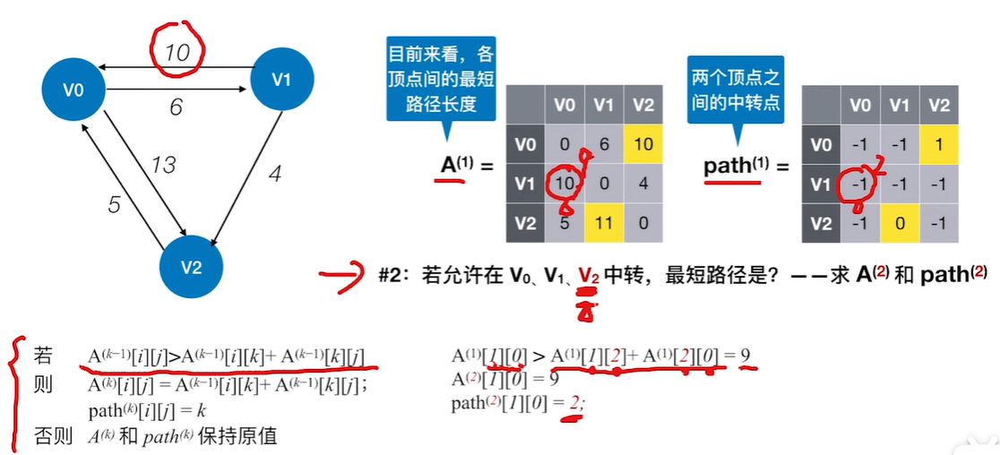

【例子】：


1. 初始化：方阵$A^{(-1)}[i][j]=arcs[i][j]$.

2. 第一轮：将$V_0$作为**中间顶点**，对于所有顶点$\{i,j\}$，如果有$A^{-1}[i][j]>A^{-1}[i][0]+A^{-1}[0][j]$，则将$A^{-1}[i][j]$更新为$A^{-1}[i][0]+A^{-1}[0][j]$.

   eg:有$A^{-1}[2][1]>A^{-1}[2][0]+A^{-1}[0][1]=11$，更新$A^{-1}[2][1]=11$，更新后的方阵标记为$A^0$。

3. 第二轮：将$V_1$作为中间顶点，继续监测全部顶点对$\{i,j\}$.

   eg:有$A^{0}[0][2]>A^{0}[0][1]+A^{0}[1][2]=10$，更新后的方阵标记为$A^1$。

4. 第三轮：将$V_2$作为中间顶点，继续监测全部顶点对$\{i,j\}$.

   eg:有$A^{1}[1][0]>A^{1}[1][2]+A^{1}[2][0]=9$，更新后的方阵标记为$A^2$。

此时$A^2$中保存的就是任意顶点对的最短路径长度。

应用Floyd算法求所有顶点之间的最短路径长度的过程如下表所示：

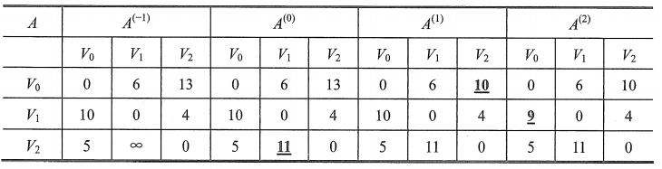

从这个表中，可以发下一些规律：


**【技巧】可以看出，矩阵中，每一步中红线划掉的部分都不用考虑计算，只需要计算红线外的部分，节省了计算量。**

#### ==【考点 - 弗洛伊德算法模拟】==

[【五分钟速通】巨快无比秒杀Floyd算法手动模拟流程_哔哩哔哩_bilibili](https://www.bilibili.com/video/BV1tQ4y147pw)

1. 对角线表示自己到自己，一直是0，不用优化。
2. 在 $A^{(-1)}$ 中，把 $V_0$ 作为中间顶点，所有不需要修改 $(V_0,V_0)$ 点的行和列。
3. 同理后面每一个中间顶点的行和列都不需要修改。

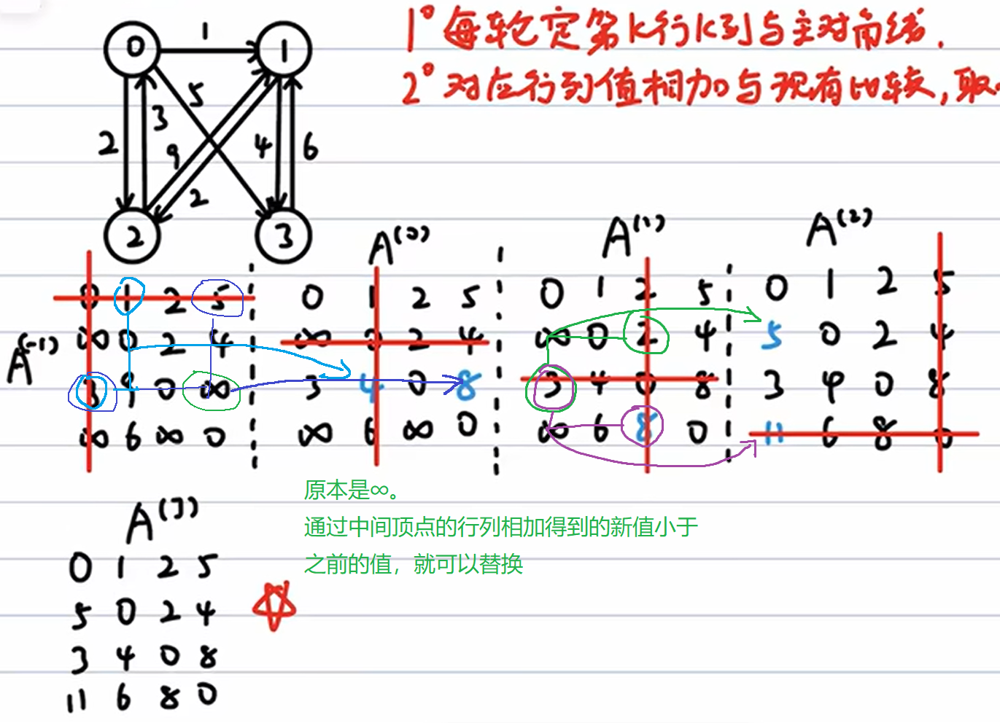

---

但是代码很简单：

```c
//......准备工作，根据图的信息初始化矩阵A和path (如上图)
for(int k=0; k<n ; k++){	//考虑以vk作为中转点
	for(int i=0; i<n; i++) {	//遍历整个矩阵，i为行号，j为列号
		for(int j=0; j<n; j++){
			if (A[i][j] > A[i][k]+A[k][j]){	//以vk为中转点的路径更短
                A[i][j] = A[i][k]+A[k][j];//更新最短路径长度
                path[i][j] = k;//中转点
            }
        }
    }
}
```

综上时间复杂度是O(N^3^)，空间复杂度是O(N^2^)。

### 3.4==【考点】最短路径总结==

|                    |        BFS         | 迪杰斯特拉 Dijkstra |    弗洛伊德 Floyd    |
| ------------------ | :----------------: | :-----------------: | :------------------: |
| 用途               | 无权图单源最短路径 |    单源最短路径     | 各顶点之间的最短路径 |
| 无权图             |         √          |          √          |          √           |
| 带权图             |         -          |          √          |          √           |
| 带**负权值**的图   |         -          |          -          |          √           |
| 带负权**回路**的图 |         -          |          -          |          -           |
| 时间复杂度         | O(V^2^) 或 O(V+E)  |       O(V^2^)       |       O(V^3^)        |


## 4.有向无环图(DAG)的应用

### 4.1有向无环图(DAG)描述表达式

有向无环图：若一个有向图中不存在环，则称为有向无环图，简称DAG图（Directed Acyclic Graph）。

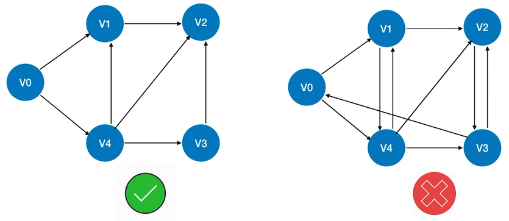

对于使用树来表示算术表达式，会可能有重复的部分：

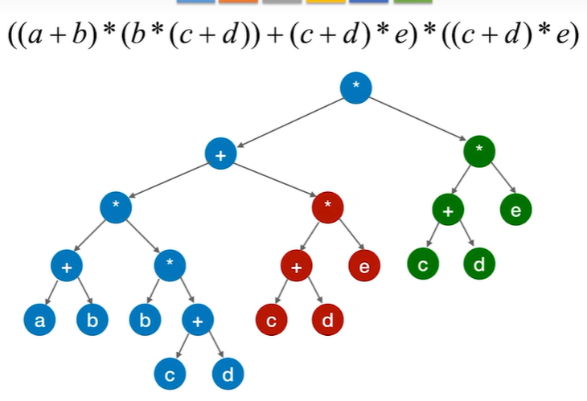

这棵树中，红色和绿色的子树是重复的，那么就要可以删去一个：

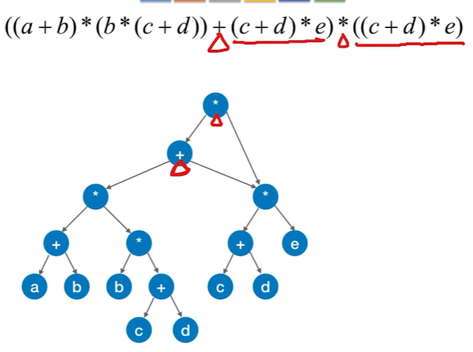

同理，还可以合并多处重复的数据：


> 【2019年408真题】用有向无环图描述表达式(x + y)((x + y)/ x)，需要的顶点个数至少是（）。
> 	A. 5		B. 6		C. 8		D.9
>
> 答案：A.5
>
> 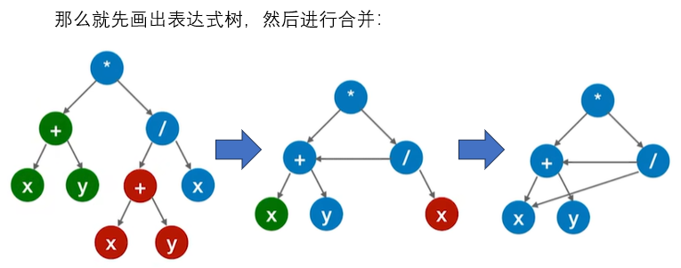

#### ✨4.1.1 解题步骤

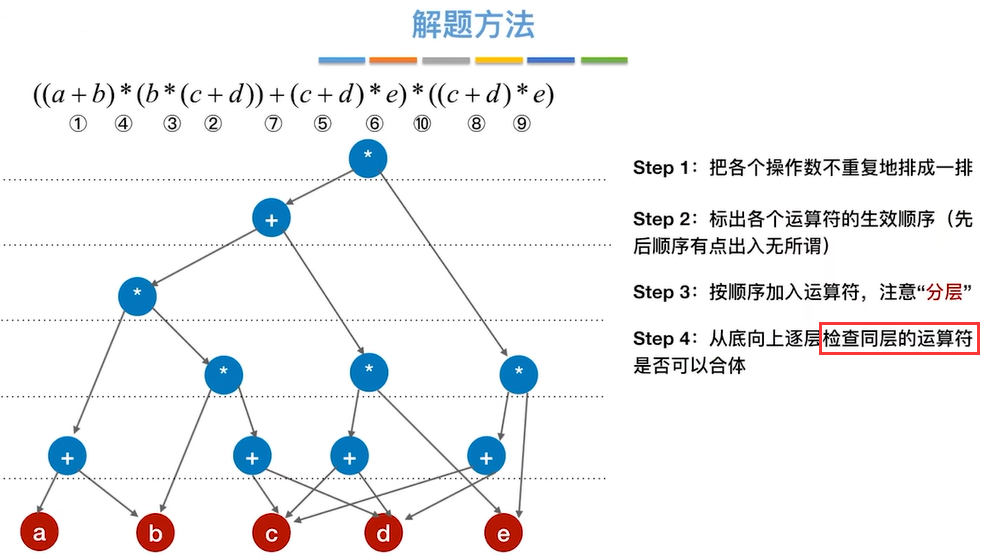


### 4.2拓扑排序（AOV网）

**AOV网**（Activity on vertex Network，用顶点表示活动的网）：

用**DAG图**（有向**无环**图）表示一个工程。顶点表示活动，有向边$<V_i,V_j>$表示活动V~i~必须先于活动V~j~进行（活动有先后顺序）。

- **顶点**：活动
- **有向边**：活动有先后顺序

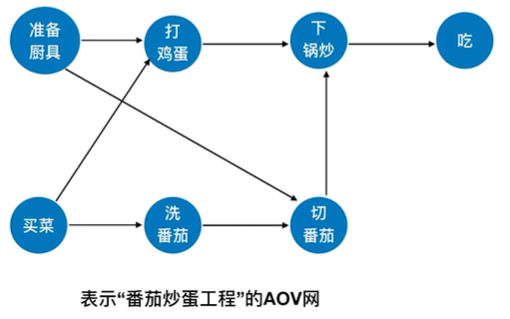

#### 4.2.1 定义

所谓**拓扑排序，其实就是对一个有向图构造拓扑序列的过程**。每个AOV网都有一个或多个拓扑排序序列。

#### 4.2.2 算法

拓扑排序的实现步骤：

1. 从AOV网中选择一个没有前驱（**入度为0**）的顶点并输出。
2. 从网中删除该顶点和所有以它为起点的有向边。
3. 重复①和②直到当前的**AOV网为空**或当前**网中不存在无前驱的顶点**为止。

**【注意】**

1. **一定是无环图才有拓扑排序，有环则不行。**如果输出顶点数少了，哪怕是少了一个，也说明这个网存在环(回路)，不是AOV网。
2. 若一个顶点有**多个直接后继**，则拓扑排序的结果通常不唯一。


上图所示为拓扑排序过程的示例。每一轮选择一个入度为0的顶点并输出，然后删除该顶点和所有以它为起点的有向边，最后得到拓扑排序的结果为{1,2,4,3,5}。

拓扑排序算法的实现如下：

```c
// 使用 邻接表 是实现
//indegree[] 是当前结点的入度
//用栈来保存当前度0的顶点，也可以用数组/队列保存

bool TopologicalSort(Graph G){
    
	InitStack(S);	//初始化栈，存储入度为0的顶点
    
	for(int i=0; i<G.vexnum; i++){
		if(indegree[i] == 0){
			Push(S, i);	//将所有入度为0的顶点进栈
		}
	}
    
	int count = 0;	//计数，记录当前已经输出的顶点数
	while(!IsEmpty(S)){	//栈不空，则存在入度为0的顶点
		Pop(S, i);	//顶点元素出栈
		printf("%d ", i);	//输出顶点i
		count++;
        
		for(p=G.vertices[i].finstarc; p; p=p->nextarc){
			//将所有i指向的顶点的入度减1，并且将入度减为0的顶点压入栈S
			v = p->adjvex;	//遍历结点的边
			if(!--indegree[v]){
				Push(S, v);	//入度为0，则入栈
			}
		}
	}
	if(count < G.vexnum){
		return false;	//输出顶点少了，有向图中有回路，排序失败
	}else{
		return true;	//拓扑排序成功
	}
}
```

由于输出每个顶点的同时还要删除以它为起点的边，故拓扑排序的**时间复杂度为O(|V|＋|E|)**。

如果采用邻接矩阵，那么时间复杂度为O(|V|^2^)。

此外，利用**深度优先遍历(DFS)**也可实现**拓扑排序**。

<u>邻接表很好写</u>

### 4.3逆拓扑排序

与拓扑排序基本相似，但是是倒叙的，所以选择的是出度为0的结点。

逆拓扑排序的实现步骤：

1. 从AOV网中选择一个没有前驱（**出度为0**）的顶点并输出。
2. 从网中删除该顶点和所有以它为起点的有向边。
3. 重复①和②直到当前的**AOV网为空**或当前**网中不存在无后继的顶点**为止。

<u>邻接表不好写，邻接矩阵还可以，逆邻接表好写</u>


## 5.关键路径（AOE网）

拓扑排序主要是为解决一个工程能否顺序进行的问题，但有时我们还需要解决工程完成需要的**最短时间**问题。

### 5.1 定义

**AOE网**(Activity On Edge NetWork)：在带权有向图中，以顶点表示事件，以有向边表示活动，以边上的权值表示完成该活动的开销（如完成活动所需的时间)，称之为用边**表示活动的网络**，简称AOE网(Activity On Edge NetWork)。

- **顶点**：事件
- **有向边**：活动
- **权值**：完成活动的开销（如时间）

AOE网和AOV网都是**有向无环图**，不同之处在于它们的边和顶点所代表的含义是不同的，AOE网中的边有权值；而AOV网中的边无权值，仅表示顶点之间的前后关系。

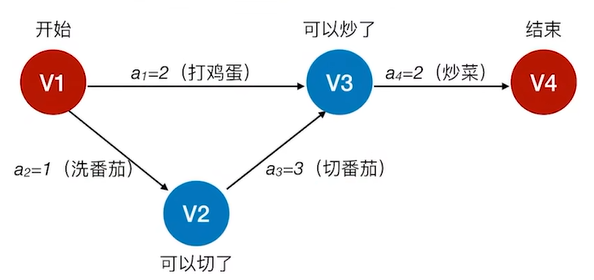

AOE网具有以下两个性质：

1. 只有在某顶点所代表的**事件发生后**，从该顶点出发的各**有向边所代表的活动才能开始**。
2. 只有在进入某顶点的各有向边所代表的**活动都已结束时**，**该顶点所代表的事件才能发生**。（有些活动可以**并行**进行，例如这里打鸡蛋和洗蕃茄可以同时进行）

**源点**：在AOE网中仅有一个**入度为0**的顶点，称为开始顶点（源点)，它表示整个工程的开始。（这里是V1）

**汇点**：也仅有一个**出度为0**的顶点，称为结束顶点（汇点)，它表示整个工程的结束。（这里的V4）


- ==**关键路径**==：从源点到汇点的有向路径可能有**多条**，所有路径中，具有==**最大路径长度**==的路径称为**关键路径**，而把关键路径上的活动称为**关键活动**。

（这里关键路径是V1->V2->V3->V4，它的长度最长）

【特性 - 注意】

1. 完成整个工程的**最短时间就是关键路径的长度**，关键路径上的所有活动都是关键活动，它是决定整个工程的关键因素：
   1. 若关键活动不能按时完成，则整个工程的完成时间就会延长。
   2. 因此可通过加快关键活动，来缩短关键路径，缩短整个工程的工期。
   3. 当关键路径缩短到一定的程度，该关键活动就可能会变成非关键活动。

2. 当网中的**关键路径并不唯一**，对于有几条关键路径的网，只提高一条关键路径上的关键活动速度并不能缩短整个工程的工期，只有加快那些**包括在所有关键路径上的关键活动**才能达到缩短工期的目的。


### 5.2 算法

1. **事件的最早发生时间**`ve`：即顶点V的最早发生时期。

2. **事件的最晚发生时间**`vl`：即顶点V的最晚发生时间，也就是每个顶点对应的事件最晚需要开始的时间，超出此时间将会延误整个工期。

3. **活动的最早开始时间**`e`：即弧a的最早发生时间。

4. **活动的最晚开始时间**`l`：即弧a的最晚发生时间，也就是不推迟工期的最晚开工时间。

5. 一个活动a的最迟开始时间`l(i)`和其最早开始时间`e(i)`的**差额**`d(i) = l(i) - e(i)`：它是指该活动完成的**时间余量**，即在不增加完成整个工程所需总时间的情况下，活动a可以拖延的时间。

   若一个活动的**时间余量为零（不允许拖延）**，则说明该活动必须要如期完成，否则就会拖延整个工程的进度，所以称`l(i)-e(i)=0`即`l(i)= e(i)`的活动a是**关键活动**。

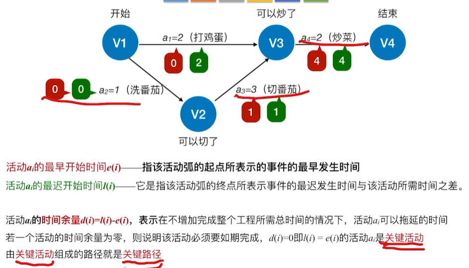

求关键路径的算法步骤如下：

1. 从源点出发，令ve(源点)=0，按**拓扑排序**求其余顶点的最早发生时间ve()。
2. 从汇点出发，令vl(汇点)= ve(汇点)，按**逆拓扑排序**求其余顶点的最迟发生时间vl()。
3. 根据各顶点的ve()值求所有弧的最早开始时间e()。
4. 根据各顶点的vl()值求所有弧的最迟开始时间l()。
5. 求AOE网中所有活动的差额d()，找出所有d()=0的活动构成**关键路径**。

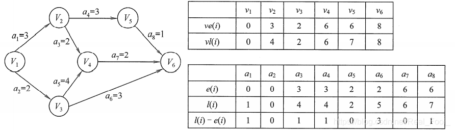

> ❗比如题目是这里上面这个图，求关键路径：
>
> |                                                              | V1    | V2   | V3   | V4   | V5   | V6   |
> | ------------------------------------------------------------ | ----- | ---- | ---- | ---- | ---- | ---- |
> | 正向推算事件(结点)最**早**发生的时间ve（如果有两个前驱得到两个值，**选大的**，因为早完成的需要等晚完成的） | 正向0 | 3    | 2    | 6    | 6    | 8    |
> | 反向推算事件(结点)最**晚**发生的时间vl（如果有两个后继得到两个值，**选小的**，因为小的表示早完成的那个，需要早完成后继才能正常进行）（先填V6=8） | 反向0 | 4    | 2    | 6    | 7    | 8    |
> | vd = vl - ve                                                 | 0     | 1    | 0    | 0    | 1    | 0    |
>
> 把vd=0的事件结点都带上：
>
> 所以关键路径是：V1->V3->V4->V6


# 参考

[数据结构：图(Graph)【详解】_图数据结构-CSDN博客](https://blog.csdn.net/Real_Fool_/article/details/114141377)

[图论部分简介 - OI Wiki (oi-wiki.org)](https://oi-wiki.org/graph/)

[图论 最小生成树 Boruvka算法_bruvka-CSDN博客](https://blog.csdn.net/yanweiqi1754989931/article/details/121238116)


[1]Dijkstra算法（英语：Dijkstra's algorithm），又称迪杰斯特拉算法，戴克斯特拉算法，是由荷兰计算机科学家艾兹赫尔·迪杰斯特拉在1956年发现的算法，使用类似广度优先搜索的方法解决赋权图的单源最短路径问题。

<u>艾兹赫尔·韦伯·迪杰斯特拉</u>（1930年5月11日—2002年8月6日），又译艾兹赫尔·韦伯·戴克斯特拉，生于荷兰鹿特丹，计算机科学家，是荷兰第一位以程序为专业的科学家。曾在1972年获得图灵奖，之后他还获得1974年AFIPS Harry Goode Memorial Award、1989年ACM SIGCSE计算机科学教育教学杰出贡献奖。


2002年，在他去世前不久，艾兹赫尔获得了ACM PODC（分布式计算原理）最具影响力论文奖，以表彰他在分布式领域中关于程序计算自稳定的贡献。为了纪念他，这个每年一度奖项也在此后被更名为“Dijkstra奖”。

学术贡献：

1. 提出“GOTO有害理论”：操作系统，虚拟存储技术；
2. 信号量机制PV原语（passeren vrijgeven）：操作系统，进程同步；
3. 银行家算法：操作系统，死锁，资源分配问题；
4. 解决了“哲学家就餐问题”：操作系统，死锁；
5. 提出了目前在离散数学中应用广泛的最短路径算法（Dijkstra's Shortest Path First Algorithm）Dijstra算法。

