# 一、查找Search


[toc]

## 1.查找的基本概念

### 1.1基本概念

- **查找(Searching)**：就是根据给定的某个值，在**查找表**中确定一个其关键字等于给定值的数据元素（或记录）。

- **查找表(Search Table)**：是由同一类型的**数据元素**(或**记录**)构成的集合。

  可以是线性结构、树形结构、图状结构...

- **关键字(Key)**：数据元素中**唯一标识该元素**的某个**数据项的值**，使用基于关键字的查找，查找结果应该是唯一的。

  例如，在由一个学生元素构成的数据集合中，学生元素中“学号”这一数据项的值唯一地标识一名学生。

- **静态查找表(Static Search Table)**：只作查找操作的查找表（**只查不改**）。主要操作：
  1. 查询某个“特定的”数据元素**是否在查找表中**。
  1. 检索某个“特定的”数据元素和**各种属性**。


- **动态查找表(Dynamic Search Table)**： 在查找过程中同时插入查找表中不存在的数据元素，或者从查找表中删除已经存在的某个数据元素（**边查边改**）。主要操作：
  1. 查找时插入不存在的数据元素。
  1. 查找时删除已存在的数据元素。


### 1.2算法评价标准

**查找长度**：在查找运算中，一次查找需要对比关键字的**次数**称为查找长度。

### ==【考点】平均查找长度ASL==

**平均查找长度(ASL, Average Search Length.)**：所有查找过程中进行关键字的比较次数的平均值。

平均查找长度是衡量查找算法效率的最主要的指标。

其数学定义为：
$$
ASL=\sum ^n_{i=1} P_iC_i
$$

- $n$：数据元素个数
- $P_i$：查找第 i 个元素的**概率**，一般认为每个数据元素的**查找概率相等**，即 $P_i=\cfrac1n$.
- $C_i$：查找第 i 个元素的**查找长度**

例如判定树的ASL计算：

**【注意】这里不用管每个结点的权值，都是 1，表示 1 个结点。**

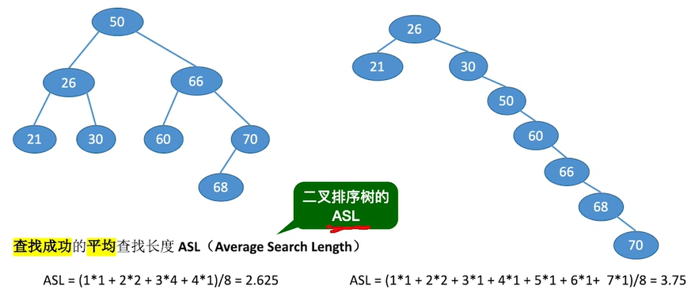

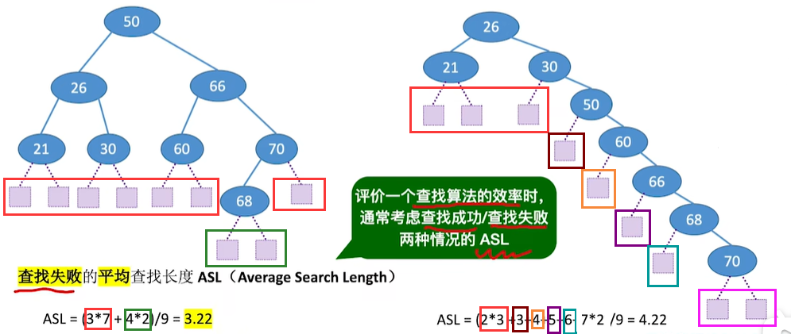

> 【浙江师范大学2008年计算机考研数据结构】对长度为3的顺序表进行搜索，若搜索**第一、第二、第三个元素**的概率分别为**1/2，1/3和1/6**，则搜索任一元素的平均搜索长度为：（5/3）
>
> “第一、第二、第三个元素”就是查找长度，“1/2，1/3和1/6”就是查找概率
>
> $1·\cfrac12+2·\cfrac13+3·\cfrac16 =\cfrac53$


# 二、==【考点】线性结构==

- **顺序查找**（线性查找）
  - 时间复杂度：**O(n)**
  - 成功 平均查找长度ASL：$\cfrac{n+1}2$。
  - 失败 平均查找长度ASL：**n-1**
- **折半查找**（二分查找）
  - 时间复杂度为：**O(log~2~n)**
  - 求ASL：画判定树
  - 判定树
    - 二叉树的**深度（树高）**为$\lceil log_2(n+1) \rceil或者\lfloor log_2n \rfloor +1$。
    - 树高也就是==**比较次数**==。


**【注意】**只能在顺序存储结构中进行查找的是：**折半查找**（不是顺序查找）。


## 1.顺序表查找

### ❗1.1顺序查找

**顺序查找**(Sequential Search) 又叫**线性查找**，是最基本的查找技术。通常用于线性表。

#### 1.1.1算法思想

算法思想（严谨）：从线性表的一端开始，逐个检查关键字是否满足给定的条件。若查找到某个元素的关键字满足给定条件，则查找成功，返回该元素在线性表中的位置；若已经查找到表的另一端，但还没有查找到符合给定条件的元素，则返回查找失败的信息。

**算法思想（个人）：从头到尾挨个找(或者反过来也OK)**

**有哨兵顺序查找**：倒序查找，在下标为0处（查找尽头）设置为关键字，称之为哨兵。返回其他值为查找成功，返回0表示失败。

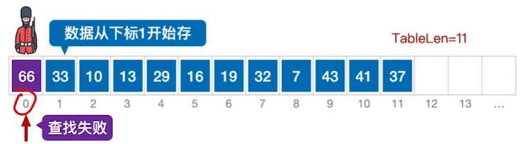

```c
//有哨兵顺序查找
int Sequential_Search(int *a, int n, int key){
	int i;
	a[0] = key;	//设置a[0]为关键字，称之为“哨兵”
	i = n;	//循环从数组尾部开始
	while(a[i] != key){
		i--;
	}
	return i;	//返回0则说明查找失败
}

```

这种在查找方向的尽头放置“哨兵”免去了在查找过程中每一次比较后都要判断查找位置是否越界的小技巧，看似与原先差别不大，但在总数据较多时，效率提高很大，是非常好的编码技巧。

上述顺序表查找**时间复杂度是O(n)**。

#### 1.1.2顺序查找效率分析

倒序查找，如果第一个就是查找目标，那么只需要对比关键字1次，如果是倒数第2个，那么就对比2次。如果查找失败，那么就直接遍历到0号元素。

所以：
$$
\begin{equation}\begin{split} 
成功ASL
&= \sum ^n_{i=1} P_iC_i \\
&= \frac 1n * \sum ^n_{i=1}C_i \\
&= \frac 1n *(1+2+3+...+n) \\
&= \frac {n+1}2 \\

失败ASL = n+1
\end{split}\end{equation}
$$


## 2.有序表查找

如果一个表是从小到大（升序）或者从大到小（降序），那么查找效率可以提高很多。

### ❗2.1==【考点】折半查找（二分）==

**折半查找**(Binary Search)技术，又称为**二分查找**。它的前提是线性表中的记录必须是**关键码有序**(通常从小到大有序)，线性表必须采用**顺序存储**。

即两个条件：

1. **关键字有序**
2. **顺序存储**

#### 2.1.1算法思想

算法思想（严谨）：在有序表中，取中间记录作为比较对象，若给定值与中间记录的关键字相等，则查找成功；若给定值小于中间记录的关键字，则在中间记录的左半区继续查找；若给定值大于中间记录的关键字，则在中间记录的右半区继续查找。不断重复上述过程，直到查找成功，或所有查找区域无记录，查找失败为止。

**算法思想（个人）：因为顺序表有顺序，那么直接从中间开始查找，把整个表一分为二；如果关键字比中间的值更大，那么就往更大的一半查找（==不包含当前查找的这个值，当不是奇数时候选前面的数==）。依然从中间开始查找对比大小。**

```c
// 从小到大，升序
int Binary_Search(SeqList L, ElemType key){
	int low=0;	//头
    int high = L.length - 1;	//尾
    int mid;
    
	while(low <= high){
		mid = (low + high)/2;	//取中间位置
		if(L.elem[mid] == key){
			return mid;	//查找成功返回所在位置
		}else if(L.elem[mid] > key){
			high = mid - 1;	//从前半部分继续查找
		}else{
			low = mid + 1;	//从后半部分继续查找
		}
	}
	return -1;	//查找失败，返回-1
}
```

- **查找判定树**：折半查找的过程可用二叉树来描述，称为**判定树**。折半查找的判定树一定是==**平衡二叉树**==（**只有最下面一层是不满的**）。

我们知道，具有n个结点的二叉树的**深度（树高）**为$\lceil log_2(n+1) \rceil或者\lfloor log_2n \rfloor +1$，那么$ASL=\lceil log_2(n+1) \rceil$。

所以，折半查找的**时间复杂度为O(log~2~n)**。

平均情况下（但是不是所有情况），比顺序查找的效率高。

因为折半查找需要方便地定位查找区域，所以它要求线性表必须具有随机存取的特性。因此，该查找法仅**适合于顺序存储结构**，**不适合于链式存储**结构，且要求元素按关键字有序排列。

#### 2.1.2==【考点】判定树构造==

因为折半查找是删去中间的元素，然后进行两边平分的，那么就需要关注整体的元素的个数是奇数还是偶数。

如果是奇数个元素（11）：

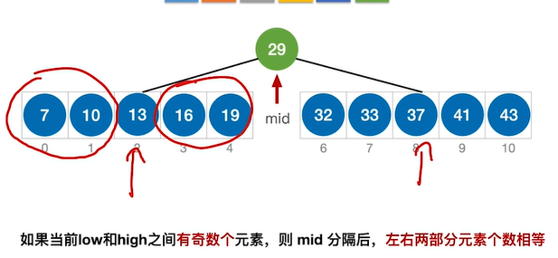

如果是偶数个元素（10）：

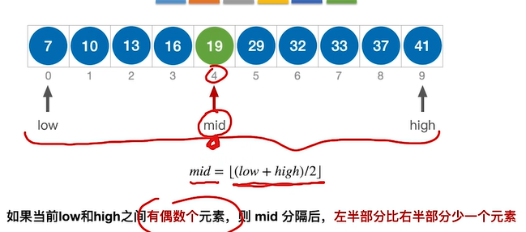

总结：

- 奇数个元素，则mid分隔后，**选中间数**。左右两部分元素个数相等。
- 偶数个元素，则mid分隔后，**==选前面的数==**。左半部分比右半部分少一个元素（**右边多，因为计算机是向下取整**）。

折半查找的判定树中，若$mid=\lfloor (low+high)/2 \rfloor +1$，则对于任何一个结点，必有：
$$
右子树结点数-左子树结点数=0或1
$$
也即是左右子树的深度之差不会超过 1。那么折半查找的判定树一定是**平衡二叉树**。

> 【2015年408真题】下列选项中，不能构成折半查找中关键字比较序列的是 （A）。
>
> A. 500,200,450,180
>
> B. 500,450,200,180
>
> C. 180,500,200,450
>
> D. 180,200,500,450
>
> 【关键】判断方法：**对于任意节点，后面所有要么全大于该节点，要么全小于该节点**。
>
> 这里的A，180小于200，但是450大于200，所以不成立。

#### 2.1.3==【考点】判断是不是折半查找树==

折半查找树：==**统一策略**，即要么所有结点的左子树结点个数都比右子树结点个数多（少），凡是出现不统一的现象统统为错==。

同样，**二叉排序树**的序列也有这个特性。

【2017年408真题】下列二叉树中，可能成为折半查找判定树（不含外部结点）的是（A）

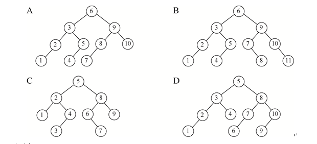


#### 2.1.4通过判定树进行查找效率分析

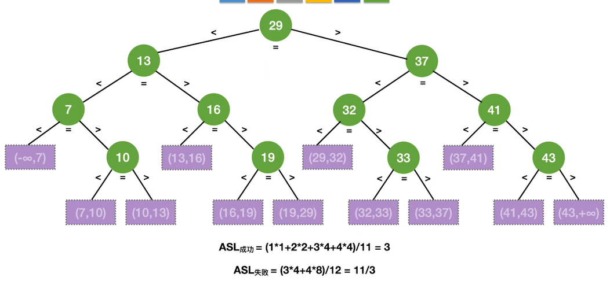

**失败节点的个数是n+1，也就是成功结点的空链域的数量。**


**一个成功结点的查找长度C = 自身所在的层数。**

**一个失败结点的查找长度C = 父结点所在的层数。**

默认情况下，各种失败情况或成功情况都等概率发生。

#### 2.1.5被查找概率不相等（优化）

被查找概率不相等时候，那么可以**把查找概率大的元素放在前面**，先进行查找，这样可以降低查找**成功的ASL**。

不足：但是这样就打破了排序，那么查找失败的ASL就需要全部遍历到哨兵才可以。

### 2.2插值查找（折半优化）

现在我们的新问题是，为什么一定要折半，而不是折四分之一或者折更多呢？比如要在取值范围0 ~ 10000之间100个元素从小到大均匀分布的数组中查找5，我们自然会考虑从数组下标较小的开始查找。所以，折半查找还是有改善空间的。

对上述折半查找的mid值获取等式变换后可得到：

```c
mid = (low + high)/2 = low + (high - low)/2;
```

也就是mid等于最低下标low加上最高下标high与low的差的一半。

大佬们考虑的就是将这个`1/2`进行改进，改进为下面的计算方案:

```c
mid = low + (key-L.elem[low]) / ( (L.elem[high] - L.elem[low]) * (high-low) );	//插值
```

就得到了另一种有序表查找算法，**插值查找法**。

**插值查找(Interpolation Search)**是根据要查找的关键字key与查找表中最大最小记录的关键字比较后的查找方法，其核心就在于插值的计算公式。

从时间复杂度来看，它**也是O(log2 n)**，但对于**表长较大，而关键字分布又比较均匀**的查找表来说，插值查找算法的平均性能比折半查找要好得多。

反之，数组中如果分布类似0,1,2,2000,2001,......999998,99999这种极端不均匀的数据，用插值查找未必是很合适的选择。

### 2.3斐波那契查找

**斐波那契查找(Fibonacci Search)**，它是利用了**黄金分割原理**来实现的。

斐波那契数列（Fibonacci sequence），又称黄金分割数列，以兔子繁殖为例子而引入，故又称“兔子数列”。其数值为：1、1、2、3、5、8、13、21、34……在数学上，这一数列以如下**递推**的方法定义：

```c
F(0)=0,
F(1)=1,
F(n)=F(n-1) + F(n-2)
    //(n ≥ 2, n ∈ N)
//F(n) = 前两数之和
```

这里定义一个斐波那契数列：

| 下标 | 0    | 1    | 2    | 3    | 4    | 5    | 6    | 7    | 8    | 9    | 10   |
| ---- | ---- | ---- | ---- | ---- | ---- | ---- | ---- | ---- | ---- | ---- | ---- |
| F    | 0    | 1    | 1    | 2    | 3    | 5    | 8    | 13   | 21   | 34   | ...  |

斐波那契查找算法的核心在于:

1. 当key = a[mid]时，查找就成功；
2. 当key < a[mid]时，新范围是第low个到第mid-1个，此时范围个数为F[k-1]-1个；
3. 当key > a[mid]时，新范围是第m+1个到第high个，此时范围个数为F[k-2]-1个。

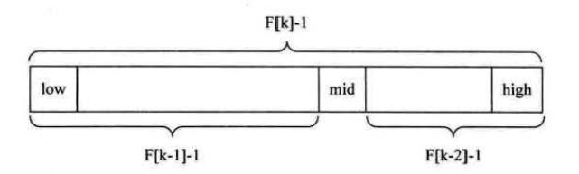

也就是说，如果要查找的记录在右侧，则左侧的数据都不用再判断了，不断反复进行下去，对处于当中的大部分数据，其工作效率要高一些，而且斐波那契查找只是最简单加减法运算，所以尽管斐波那契查找的**时间复杂也为O(logn)**，但就平均性能来说，斐波那契查找要优于折半查找。

不过如果是最坏情况，比如这里key=1，那么始终都处于左侧长半区在查找，则查找效率要低于折半查找。

算法如下：

```c
//斐波那契查找
int Fibonacci_Search(int *a, int n, int key){
	int low, high, mid, i, k;
	low = 0;	//定义最低下标为记录首位
	high = n;	//定义最高下标为记录末尾
	k = 0;
	while(n > F[k] - 1){
		//计算n位于斐波那契数列的位置
		k++;
	}
	for(i=n; i<F[k]; i++){
		//在尾部补上F[k]-n-1个数，大小等于尾部最大值，否则会存在数组溢出
		a[i]=a[n];
	}
	while(low <= hight){
		mid = low + F[k-1]-1;	//计算当前分隔的下标
		if(key < a[mid]){
			//若查找记录小于当前分隔记录
			hight = mid - 1;	//最高下标调整到分隔下标mid-1处
			k = k - 1;	//斐波那契数列下标减一位
		}else if(key > a[mid]){
			//若查找记录大于当前分隔记录
			low = mid + 1;	//最低下标调整到分隔下标mid+1处
			k = k - 2;	//斐波那契数列下标减两位
		}else{
			if(mid <= n){
				return mid;	//若相等则说明mid即为查找的位置
			}else{
				return n;	//若mid>n说明是补全数值，返回n
			}
		}
	}
	return -1;
}
```


## 3.线性索引查找

现实生活中计算机要处理的数据量是极其庞大的，而数据结构的最终目的是提高数据的处理速度，**索引**是为了加快查找速度而设计的一种数据结构。

索引就是把一个关键字与它对应的记录相关联的过程， 一个索引由若干个**索引项**构成，每个索引项至少应包含关键字和其对应的记录在存储器中的位置等信息。索引技术是组织大型数据库以及磁盘文件的一种重要技术。

- 索引
  - 索引项
    - 关键字
    - 关键字对应的记录在存储器的位置

索引按照结构可以分为：

1. **线性索引**
   1. 稠密索引
   2. 分块索引
   3. 倒排索引
2. **树形索引**
3. **多级索引**

这里主要介绍**线性索引**，所谓线性索引就是将索引项集合组织为线性结构，也称为**索引表**。我们重点介绍三种线性索引：稠密索引、分块索引和倒排索引。

### 3.1稠密索引

稠密索引是很简单直白的一种索引结构。

**稠密索引是指在线性索引中，将数据集中的每个记录对应一个索引项，而索引项一定是按照关键码有序的排列**。如下图所示：

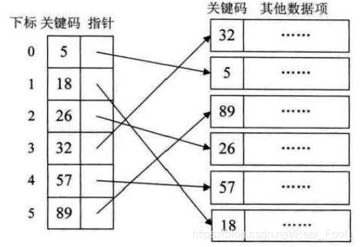

索引项有序也就意味着，我们要查找关键字时，可以用到折半、插值、斐波那契等有序查找算法，提高了效率。这是稠密索引优点，但是如果**数据集非常大**，比如上亿，那也就意味着索引也得同样的数据集长度规模，对于内存有限的计算机来说，可能就需要反复去访问磁盘，查找性能反而大大下降了。

### ❗3.2==【考点】分块索引==

稠密索引因为索引项与数据集的记录个数相同，所以空间代价很大。为了减少索引项的个数，我们可以对数据集进行分块，使其分块有序，然后再对每一块建立一个索引项，从而减少索引项的个数。

**分块有序**，又称索引顺序查找。是把数据集的记录分成了若千块，并且这些块需要满足两个条件：

1. **==块内无序==**：即每一块内的记录不要求有序。
2. **==块间有序==**：例如，要求第二块所有记录的关键字均要大于第一块中所有记录的关键字，第三块的所有记录的关键字均要大于第二块的所有记录关键字…因为只有块间有序，才有可能在查找时带来效率。

==**理想块长**：$\sqrt{记录数}$==。（这个推理其实并不严谨，这只是为了应对考试）

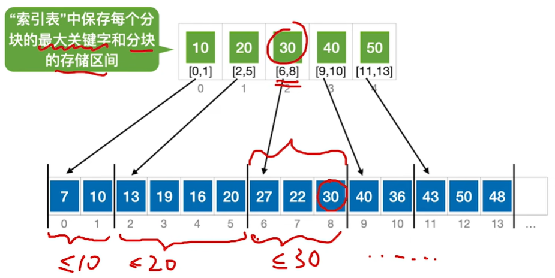

对于分块有序的数据集，将每块对应一个索引项， 这种索引方法叫做分块索引。我们定义的分块索引的索引项结构分三个数据项：

- **最大关键码**：它存储每一块中的最大关键字，这样的好处就是可以使得在它之后的下一块中的最小关键字也能比这一块最大的关键字要大。
- **块长**：存储了块中的记录个数，以便于循环时使用。
- **块首指针**：用于指向块首数据元素的指针，便于开始对这一块中记录进行遍历。

#### 3.2.1算法思想

1. 在索引表中确定待查记录所属的分块（可**顺序**、可**折半**)；
2. 在块内顺序查找（全部遍历）。

```c
//索引表
typedef struct {
	ElemType maxValue;
    int low,high;
}Index;
//顺序表存储实际元素
ElemType List [100] ;
```

【易错点】对索引表进行折半查找时,若索引表中不包含目标关键字,则折半查找最终停在low>high，要在low所指分块中查找。

#### 3.2.2查找效率分析

如上图，有0-13共14个元素，它们各自被查找的概率都是1/14。

假设，长度为 n 的查找表被均匀地分为 b 块，每块 s 个元素，那么可以推断**n=sb**。

设**索引查找**和**块内查找**的平均查找长度分别为LI、LS，则分块查找的**平均查找长度**为：
$$
ASL = L_I + L_s\\
$$

1. 如果用**顺序查找**来查找索引

$$
L_I = \frac {1+2+...+b}b = \frac {b+1}2 \\
L_S = \frac {1+2+...+s}s = \frac {s+1}2 \\
\\
所以:ASL = \frac{b+1}2 + \frac{s+1}2 \\
并且:n=sb \\
那么:ASL = \frac{s^2+2s+n}{2s} =  \frac 12s+1+\frac n{2s}\\
\\
当s=\sqrt n时,ASL_{min}=\sqrt n +1
$$

也就是，当把元素分为 $\sqrt n$ 块，每块有 $\sqrt n$ 个元素的时候，ASL最小。

> eg: 若元素有n=10000个，求最小ASL。
>
> $\sqrt {10000}=100$ ，那么最小 ASL=100+1 = 101

2. 如果用**折半查找**来查找索引

$$
L_I = \lceil log_2(b+1) \rceil \\
L_S = \frac {1+2+...+s}s = \frac {s+1}2 \\
\\
所以:ASL = \lceil log_2(b+1)\rceil + \frac{s+1}2 \\
$$

#### 3.2.3分块索引的优化

若查找表是“动态查找表”，那么因为要删除和添加新的元素，那么就需要把整个表的下标都进行前移或后移。所以使用链式存储的方式：

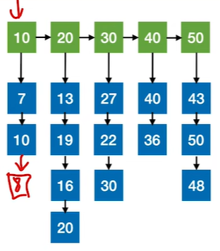


### 3.3倒排索引

搜索引擎中涉及很多搜索技术，这里介绍一种最简单，也是最基础的搜索技术：**倒排索引**。

**倒排索引**(inverted index)：其中记录号表存储具有相同次关键字的所有记录的记录号（可以是指向记录的指针或者是该记录的主关键字）。这样的索引方法就是倒排索引。

我们举个简单的例子：

假如下面两篇极短的文章。

1. Books and friends should be few but good.
2. A good book is a good friend.

忽略字母大小写，我们统计出每个单词出现在哪篇文章之中：文章1、文章2、文章(1，2)，得到下面这个表，并对单词做了排序：

| 英文单词（次关键码） | 文章编号（记录号表） |
| -------------------- | -------------------- |
| a                    | 2                    |
| and                  | 1                    |
| be                   | 1                    |
| book                 | 1,2                  |
| but                  | 1                    |
| few                  | 1                    |
| friend               | 1,2                  |
| good                 | 1,2                  |
| is                   | 2                    |
| should               | 1                    |

有了这样一张单词表，我们要搜索文章，就非常方便了。如果你在搜索框中填写“book"关键字。系统就先在这张单词表中有序查找“book" ，找到后将它对应的文章编号1和2的文章地址返回。

在这里这**张单词表就是索引表**，索引项的通用结构是：

- **次关键码**，例如上面的“英文单词”；
- **记录号表**，例如上面的“文章编号"。

---

这名字为什么要叫做“倒排索引”呢？

顾名思义，倒排索引源于实际应用中需要根据属性（或字段、次关键码）的值来查找记录（或主关键编码）。这种索引表中的每一项都包括一个属性值和具有该属性值的各记录的地址。由于不是由记录来确定属性值，而是由属性值来确定记录的位置，因而称为倒排索引。

当然，现实中的搜索技术是非常复杂的，要考虑诸多因素用到诸多技术，由于本文的侧重点并非搜索引擎，所以于此不再赘述。


# 三、树形结构

## 1.==【考点】二叉排序树BST==

> 与 5.树 那一部分的内容完全相同

### 1.1定义

**二叉排序树**（Binary Sort Tree），又称**二叉查找树**（Binary Search Tree），二叉搜索树，排序二叉树。

它或者是一棵空二叉树，或者具有以下性质：

==**左子树 < 根节点 < 右子树**==（所以**中序遍历**会得到一个有序序列）

1. <u>左子树上所有结点的关键字均小于根结点的关键字；</u>
2. <u>右子树上的所有结点的关键字均大于根结点的关键字；</u>
3. <u>左子树和右子树又各是一棵二叉排序树。</u>
4. <u>默认**不允许**有两个结点的**关键字（data）相同**。</u>


下图值为10的结点的右子树为5，比10小，不满足条件2，所以这棵树不是二叉搜索树。


可以进行**中序遍历**，得到一个**递增的序列**。

适用于需要快速查找、插入和删除数据的场景。

插入和删除操作的时间复杂度为 O(log n)，其中 n 是树中节点的个数。

查找操作的时间复杂度也为 O(log n) 在平均情况下，但在最坏情况下可能为 O(n)。

#### ==【考点】BST树结点删增后的变化==

1. 如果删去的**是叶结点**，那么增加回来就与原来的树**相同**。
2. 如果删去的**不是叶结点**，那么增加回来就与原来的树**不相同**。


### 1.2存储结构

```c
// 二叉树的二叉链表结点结构定义
typedef int ElemType;

typedef struct BSTNode
{
	ElemType data;	//结点数据
	struct BSTNode *lchild, *rchild;	//左右孩子指针
} BSTNode, *BSTree;
```

### 1.3查找

查找操作的时间复杂度也为 **O(log n)** 在平均情况下，但在最坏情况下可能为 O(n)。

步骤：

1. 查找从根结点开始，如果树为空，返回NULL。
2. 若搜索树非空，则根结点关键字和 X 进行比较，并进行不同处理：
   1. 若 X **小于**根结点的键值，在**左子树**中继续搜索；
   2. 若 X 大于根结点的键值，在右子树中进行继续搜索；
   3. 若两者比较结果是相等，搜索完成，返回指向此结点的指针。

```c
// 递归查找二叉排序树T中是否存在X
*BSTNode Find(BSTree BST, ElemType X){
    if(!BST) return NULL; //查找失败

    if(X > BST->data)
        return Find(X, BST->rchild); //在右子树中继续查找
    else if(X < BST->Data)
        return Find(X, BST->lchild); //在左子树中继续查找
    else //X == BST->Data 
		return BST; //查找成功，返回结点的找到结点的地址
}
```

使用**递归**会导致效率不高。恰巧这段代码又是尾递归的方式（尾递归就是程序分支的最后，也就是最后要返回的时候才出现递归），从编译的角度来讲，**尾递归都可以用循环的方式去实现**。

由于非递归函数的执行效率高，可将“尾递归”函数改为迭代函数。

递归的时间复杂度：**O(h)**。

迭代的时间复杂度：**O(1)**。

```c
*BSTNode IterFind(BSTree BST, ElemType X){
    while(BST) {
        if(X > BST->data)
            BST = BST->rchild; //向右子树中移动，继续查找
        else if(X < BST->data)
            BST = BST->lchild; //向左子树中移动，继续查找
        else // X == BST->Data 
            return BST; //查找成功，返回结点的找到结点的地址
    }
	 return NULL; //查找失败
}
```

或者写为：

```c
*BSTNode IterFind(BSTree BST, ElemType X){
    while(BST!=NULL && X!=BST->data) {
        if(X > BST->data)
            BST = BST->rchild; //向右子树中移动，继续查找
        else if(X < BST->data)
            BST = BST->lchild; //向左子树中移动，继续查找
    }
    //最后在叶子结点还是没有找到，那么就会继续向下使得BST=NULL
	 return BST;
}
```

#### 1.3.1查找最大和最小元素

①最**大**元素一定是在树的**最右**分枝的端结点上。
②最**小**元素一定是在树的**最左**分枝的端结点上。

根据上述两点，我们可以很轻松的把代码（两种方式）写出来：

```c
//方法1：递归
*BiTNode FindMin(BinTree BST){
	 if(!BST) return NULL; //空的二叉搜索树，返回NULL
	 else if(!BST->lchild)
	 	return BST; //找到最左叶结点并返回
	 else
	 	return FindMin(BST->lchild); //沿左分支继续查找
}
*BiTNode FindMax(BinTree BST){
	 if(!BST) return NULL;
	 else if(!BST->rchild)
	 	return BST;
	 else
	 	return FindMin(BST->rchild);
}


//方法2：迭代函数
*BiTNode FindMin(BinTree BST){
	 if(BST)
	 	while(BST->lchild)  //沿右分支继续查找，直到最右叶结点
	 		BST = BST->lchild;
	 return BST;
}
*BiTNode FindMax(BinTree BST){
	 if(BST)
	 	while(BST->rchild)  //沿右分支继续查找，直到最右叶结点
	 		BST = BST->rchild;
	 return BST;
}
```

### 1.4插入

有了二叉排序树的查找函数，那么所谓的二叉排序树的插入，其实也就是将关键字放到树中的合适位置而已。

#### ==【考点】关键字有序深度最大==

如果插入的**关键字有序**，那么二叉排序树会形成一个长链，此时树的**深度最大**。


时间复杂度为 O(log n)，其中 n 是树中节点的个数。

```c
BiTree Insert(BiTree &BST, ElemType X){
    if(!BST){ //若原树为空，生成并返回一个结点的二叉搜索树
        BST = (BiTree)malloc(sizeof(struct BiTNode));
        BST->data = X;
        BST->lchild = BST->rchild = NULL;
    }
    else { //开始找要插入元素的位置
        if(X < BST->data)
            BST->lchild = Insert(BST->lchild, X);//递归插入左子树
        else if(X > BST->Data)
            BST->rchild = Insert(BST->rchild, X);//递归插入右子树
        //else X已经存在，什么都不做
    }
    return BST;
}
```

#### 1.4.1插入构造二叉排序树

有了二叉排序树的插入代码，我们要实现二叉排序树的构建就非常容易了，几个例子：

```c
int n=8;
int a[8] = {62, 88, 58, 47, 35, 73, 51, 99};
BSTree T;
CreateBST(T, a[], n);

//----------------------------------------
CreateBST(BSTree &T, int a[], int n){
    T=NULL;
    for(int i=0; i<10; i++){
        Insert(&T, a[i]);
}
```

上面的代码就可以创建一棵下图这样的树。

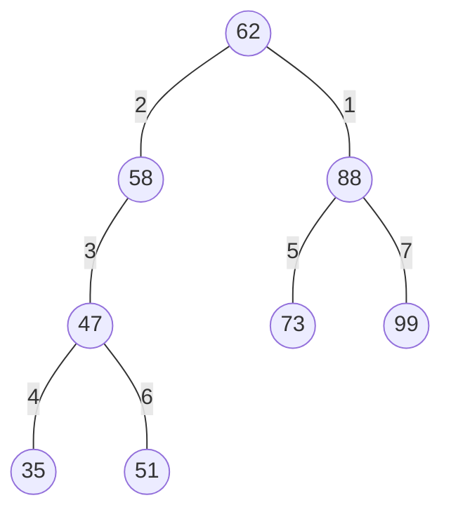
```mermaid
graph TB

%%左子树
1((62))--2---2((58))--3---4((47))--4---8((35))
2---5(( ))
4--6---9((51))

%%右子树
1((62))--1---3((88))--5---6((73))
3--7---7((99))

%%隐藏结点
style 5 fill: #f100,stroke-width:0px
%%隐藏路径
linkStyle 3 stroke:#0ff,stroke-width:0px
```

### ❗1.5删除

删除的结点有三种情况：

1. **叶子结点**：
   - 只需删除该结点不需要做其他操作。
2. **仅有左或右子树的结点**：
   - 删除后需让被删除结点的**直接后继（子树）**接替它的位置。
3. **左右子树都有的结点**：
   - 此时我们需要遍历得到被删除结点的直接前驱或者直接后继（**一般是右子树的最小结点，即右子树的中序第一个子女**），来接替它的位置，然后再删除那个最小的子女。


时间复杂度为 **O(log n)**，其中 n 是树中节点的个数。

```c
BiTree Delete(BiTree BST, ElemType X) { 
    *BiTNode Tmp; 
    if(!BST) 
        printf("BST is NULL");
    else {
        if(X < BST->data) 
            BST->lchild = Delete(BST->lchild, X);//从左子树递归删除
        else if(X > BST->data) 
            BST->rchild = Delete(BST->rchild, X);//从右子树递归删除

        //BST就是要删除的结点
        else {
            //如果被删除结点有左右两个子结点
            if(BST->lchild && BST->rchild) 
            {
                //从右子树中找最小的元素填充删除结点
                Tmp = FindMin(BST->rchild);
                BST->data = Tmp->data;
                //从右子树中删除最小元素
                BST->rchild = Delete(BST->rchild, BST->data);
            }
            //被删除结点有一个或无子结点
            else 
            {
                Tmp = BST; 
                if(!BST->lchild)    //只有右孩子或无子结点
                    BST = BST->rchild; 
                else                //只有左孩子
                    BST = BST->lchild;
                free(Tmp);
            }
        }
    }
    return BST;
}
```

### 1.6==【考点】查找性能分析==

二叉排序树的优点明显，插入删除的时间性能比较好。而对于二叉排序树的查找，走的就是从根结点到要查找的结点的路径，其比较次数等于给定值的结点在二叉排序树的**层数**。

极端情况，最少为1次，即根结点就是要找的结点；最多也不会超过树的深度。也就是说，**二叉排序树的查找性能取决于二叉排序树的形状（==深度==）**。可问题就在于，二叉排序树的形状是不确定的。

例如 {62 , 88 , 58 , 47 , 35 , 73 , 51 , 99 , 37 , 93} 这样的数组，我们可以构建如下左图的二叉排序树。但如果数组元素的次序是从小到大有序，如{35,37,47,51,58,62,73,88,93,99}，则二叉排序树就成了极端的右斜树，如下面右图的二叉排序树：


也就是说，我们希望**二叉排序树是比较平衡（左子树和左子树的高度之差不超过1）**的，即其深度与完全二叉树相同，那么查找的时间复杂也就为 **O(log n)**，近似于折半查找。

不平衡的最坏情况就是像上面右图的斜树（高度为n），查找时间复杂度为 **O(n)**，这等同于顺序查找。

因此，如果我们希望对一个集合按二叉排序树查找，最好是把它构建成一棵**平衡的二叉排序树**。


## 2.平衡二叉树AVL

> 与 5.树 那一部分的内容完全相同

### 2.1定义

**平衡二叉树（Self-Balancing Binary Search Tree 或 Height-Balanced Binary Search Tree）**，是由前苏联的数学家 **A**delse-**V**elskil 和 **L**andis 在 1962 年提出的高度平衡的二叉树。

平衡二叉树（AVL树），它是 "平衡二叉搜索树" 的简称，它是一种**二叉排序树**，满足**左子树 < 根节点 < 右子树**。

它或者是一颗空树，或者是具有以下性质的二叉排序树：

1. <u>它的左子树和左子树的**高度之差（平衡因子）的绝对值不超过1**；</u>
2. <u>且它的左子树和右子树又都是一颗平衡二叉树。</u>

- **平衡因子（BF, Balance Factor）**：我们将二叉树上结点的**左子树深度减去右子树深度**的值称为**平衡因子**。

那么平衡二叉树上所有结点的平衡因子只可能是 -1、0和1。只要二叉树上有一个结点的平衡因子的绝对值大于1，则该二叉树就是不平衡的。

#### ==【考点】AVL树结点删增后的变化==

<u>**无论**删去的结点是不是**叶结点**，再加上之后**都有可能**与原来完全相同</u>。


追求更好的平衡二叉树，可以得到更好的二叉排序树，**提高排序和查询的效率**，不至于让一边的树的深度太大。

### 2.2存储结构

```c
// 平衡二叉树存储结构
typedef struct AVLNode{
    int data;		//数据域
    int balance;	//平衡因子
    struct AVLNode *lchild, *rclild;
}AVLNode,*AVLTree;
```


### 2.3查找

在平衡二叉树上进行查找的过程与二叉排序树的相同。因此，在查找过程中，与给定值进行比较的关键字个数不超过树的深度。

假设以 $n_h$ 表示深度为 h 的平衡树中含有的**最少结点数**。

显然，有 $n_0=0,n_1=1,n_2=2$，并且有 $n_h=n_{h-1}+n_{h-2}+1$。

#### ==【考点】平衡二叉树结点数与深度关系==

根据上面的递归公式：
$$
n(h) =
\begin{cases}
1, & if\ h=1 \\[1ex]
2, & if\ h=2 \\[1ex]
n_{h-1}+n_{h-2}+1 ,& if\ h>2 \\[1ex]
\end{cases}
$$
我们可以得到下面的表格（考试的时候建议直接先画出表格）

| 层数 | 此时二叉平衡树的最少结点数 |
| ---- | -------------------------- |
| 1    | 1                          |
| 2    | 2                          |
| 3    | 4                          |
| 4    | 7                          |
| 5    | 12                         |
| 6    | 20                         |
| 7    | 33                         |

> 【2012统考真题】若平衡二叉树的高度为 6，且所有非叶子结点的平衡因子均为1，则该平衡二叉树的结点总数为（B）。 
>
> A.12	 B.20 	C.32 	D.33

可以证明，含有 n 个结点的平衡二叉树的最大深度为 $O(log2n)$，因此平衡二叉树的平均查找长度为 $O(log2n)$ 如下图所示：


### ❗2.4插入（保持平衡）

二叉排序树保证平衡的基本思想：每当在二叉排序树中插入(或删除)一个结点时，首先检查其插入路径上的结点是否因为此次操作而导致了不平衡。若导致了不平衡，则先找到插入路径上离插入结点最近的平衡因子的绝对值大于 1 的结点A，再对以A为根的子树（**最小不平衡子树**），在保持二叉排序树特性的前提下，调整各结点的位置关系，使之重新达到平衡。

【注意】每次调整的对象都是**最小不平衡子树**。

**最小不平衡子树**：以插入路径上离插入结点最近的平衡因子的绝对值大于 1 的结点作为根的子树。下图中的虚线框内为最小不平衡子树：


平衡二叉树的插入过程的前半部分与二叉排序树相同，但在新结点插入后，若造成查找路径上的某个结点不再平衡，则需要做出相应的调整。可将调整的规律归纳为下列4种情况：


#### 2.4.1 LL平衡旋转(右单旋转)

<u>在结点A的**左孩子(L)**的**左子树(L)**上插入了新结点，导致了不平衡。</u>

LL平衡旋转（右单旋转）。由于在结点A的左孩子(L)的左子树(L)上插入了新结点，使得（图a->b）A的平衡因子由1增至2，导致以A为根的子树失去平衡，需要一次向右的旋转操作。

将A的左孩子**B向右上旋转代替A**成为根结点，将A结点向**右下旋转**成为B的右子树的根结点，而B的原右子树则作为A结点的左子树。（见下面动图所示）

如下图所示，结点旁的数值代表结点的平衡因子，而用方块表示相应结点的子树，下方数值代表该子树的高度。


CODE：

```c
//f是父结点A，p是左孩子B，gf是父结点的父结点A的父结点
f->lchild = p->rchild;	//把B的左孩子BL放到B的位置
p->rchild = f;		//B和A右旋，A变成B的右孩子
gf->lchild/rchild = p;	//A的父结点现在指向B
```


#### 2.4.2 RR平衡旋转(左单旋转)

<u>在结点A的**右孩子(R)**的**右子树(R)**上插入了新结点，导致了不平衡。</u>

RR平衡旋转（左单旋转）。由于在结点A的右孩子(R)的右子树(R)上插入了新结点，使得（图a->b）A的平衡因子由-1减至-2，导致以A为根的子树失去平衡，需要一次向左的旋转操作。

将A的右孩子**B向左上旋转代替A**成为根结点，将A结点向**左下旋转**成为B的左子树的根结点，而B的原左子树则作为A结点的右子树。


CODE：

```c
//f是父结点A，p是左孩子B，gf是父结点的父结点A的父结点
f->rchild = p->lchild;
p->lchild = f;		//B和A右旋
gf->lchild/rchild = p;	//A的父结点现在指向B
```


#### 2.4.3 LR平衡旋转(先左后右双旋转)

<u>在A的**左孩子(L)**的**右子树(R)**上插入新结点，导致了不平衡。</u>

LR平衡旋转（先左后右双旋转）。由于在A的左孩子(L)的右子树(R)上插入新结点，A的平衡因子由1增至2，导致以A为根的子树失去平衡，需要进行两次旋转操作，先左旋转后右旋转。

先将A结点的左孩子B的右子树的根结点**C向左上旋转提升到B结点的位置**（即进行一次RR平衡旋转(左单旋转)），然后再把该**C结点向右上旋转提升到A结点的位置**（即进行一次 LL平衡旋转(右单旋转) ）。


#### 2.4.4 RL平衡旋转(先右后左双旋转)

<u>在A的**右孩子(R)**的**左子树(L)**上插入新结点，导致了不平衡。</u>

RL平衡旋转（先右后左双旋转）。由于在A的右孩子(R)的左子树(L)上插入新结点，A的平衡因子由-1减至-2，导致以A为根的子树失去平衡，需要进行两次旋转操作，先右旋转后左旋转。

先将A结点的右孩子B的左子树的根结点**C向右上旋转提升到B结点的位置**（即进行一次LL平衡旋转(右单旋转)），然后再把该**C结点向左上旋转提升到A结点的位置**（即进行一次RR平衡旋转(左单旋转)）。


**【注意】LR和RL旋转时，新结点究竟是插入C的左子树还是插入C的右子树不影响旋转过程。**

二叉排序树还有另外的平衡算法，如**红黑树(Red Black Tree)**等，与**平衡二叉树(AVL树)**相比各有优势。

#### 2.4.5题解

>例子：
>
>假设关键字序列为 15 , 3 , 7 , 10 , 9 , 8 通过该序列生成平衡二叉树的过程如下图所示：
>
>


#### ==【考点】插入步骤==

1. 找到**最小不平衡子树**的根节点；
2. 判断旋转方式；
3. 进行旋转（**根节点改变**和**子树迁移**）；
4. 检查：是否符合**左 < 根 < 右**。


> 【RR】**R子树**根节点替代**最小不平衡子树**的根节点。
>
> 
>
> 【LR】根节点的左子树L --变成--> 父结点的右子树R
> 根节点的右子树R --变成--> 爷结点的左子树L
> 根节点 --变成--> 爷爷结点
>
> 
>
> 【RL】根节点的右子树R --变成--> 父结点的左子树L
> 根节点的左子树L --变成--> 爷结点的右子树R
> 根节点 --变成--> 爷爷结点
>
> 


### 2.5查找性能分析

若树高为 h，则最坏情况下，查找一个关键字最多需要对比 h 次，即查找操作的时间复杂度不可能超过O(h)。

因为平衡二叉树的左右子树之间高度差不会超过1，

所以假设 $n_h$ 表示高度为 h 的平衡二叉树的含有的**最少的结点数**。

则有：
$$
n_0 = 0\\
n_1 = 1\\
n_2 = 2\\
那么可以推出:\\
n_h = n_{h-1} + n_{h-2} + 1\\
含义为:左子树的最少结点数 + 右子树的最少结点数 + 根节点\\
那么就有:\\
n_3=4;n_4=7;n_5=12;n_6=20...
$$
那么，如果知道了结点数 n，就可以推断出整棵树的最大高度 h。

> eg: 这棵树有n=9个结点，求最大高度h.
>
> 那么因为 $n_4=7;n_5=12$，而 7 < 9 < 12.
>
> 想要高度为 5，至少需要12个结点，所以这棵树的最大高度 h 为4.
>
> 那么知道高度了，就能够得到时间复杂度O(4)。

可以证明含有 n 个结点的平衡二叉树的最大深度为 **O(log2 n)**，平衡二叉树的平均查找长度为 **O(log2 n)**。


### 2.6删除

平衡二叉树的删除操作删除结点后，也要**保持二叉排序树的特性不变**（左<中<右）。若删除结点导致不平衡，则需要调整平衡。

---

平衡二叉树的删除操作具体步骤：

1. 删除结点 （方法同“二叉排序树”）；

   1. **叶子结点**：直接删除。
   2. **仅有左或右子树的结点**：删除后，让被删除结点的**直接后继（子树）**接替它的位置。
   3. **左右子树都有的结点**：删除后，用**右子树的最小结点，即右子树的中序第一个子女**来接替它的位置，然后再删除这个最小的子女。

2. 一路向上找到**最小不平衡子树**，找不到就说明平衡，完结撒花return；

3. 找最小不平衡子树下，高度最高的儿子、孙子；

4. 根据孙子的位置，**调整平衡**（LL/RR/LR/RL）；

   1. 孙子在LL：儿子右单旋。
   2. 孙子在RR：儿子左单旋。
   3. 孙子在LR：孙子先左旋，再右旋。
   4. 孙子在RL：孙子先右旋，再左旋。

5. 如果还不平衡向上传导，继续②。

   对最小不平衡子树的旋转可能导致树变矮，从而导致上层祖先不平衡（不平衡的向上传递）


## 3.红黑树RBT

红黑树（RBT，Red-Black Tree）

|                      | BST  | AVL Tree  | Red-Black Tree |
| -------------------- | ---- | --------- | -------------- |
| 诞生日               | 1960 | 1962      | 1972           |
| Search查的时间复杂度 | O(n) | O(log2 n) | O(log2 n)      |
| Insert插的时间复杂度 | O(n) | O(log2 n) | O(log2 n)      |
| Delete删的时间复杂度 | O(n) | O(log2 n) | O(log2 n)      |

**平衡二叉树AVL**的不足：插入/删除很容易破坏"平衡”特性，需要频繁调整树的形态。例如插入操作导致不平衡，则**需要先计算平衡因子，找到最小不平衡予树（时间开销大）**，再进行LL/RR/LR/RL调整。

所以提出**红黑树RBT**：插入/删除很多时候不会破坏“红黑”特性，无需频繁调整树的形态。即便需要调整，一般都可以**在常数级时间内完成**。

AVL适用于以查为主、很少插入/删除的场景。

RBT适用于频繁插入、删除的场景，实用性更强。

### 3.1==【考点】定义==

红黑树也是一种特殊的**二叉排序树**，满足**左子树 < 根节点 < 右子树**。

红黑树的特性：

1. 每个结点或是<font color="red">红色</font>，或是**黑色**的。

2. **根节点是黑色**的。

3. ==**叶结点**==（不是叶子结点，是**外部结点、NULL结点、失败结点**）均是**黑色**的；

   叶节点是外部节点，那么对应的根节点和非根节点就是**内部节点**。

4. **不存在两个相邻的红结点**（即红结点的父节点和孩子结点均是黑色）（**==黑红交替==**）。

5. 对每个结点，从该节点到任一叶结点的简单路径（**只能向下**）上，所含**黑结点的数目相同**。

   结点的==**黑高 bh**==：从某结点出发（**不含该结点**）到达任一空叶结点的路径上黑结点总数。
   
   >思考：根节点黑高为h的红黑树，内部结点数（关键字）**至少**有多少个?
   >
   >回答：内部结点数**最少**的情况――总共h层黑结点（**满树**形态）。
   >
   >【结论】若根节点黑高为 h，内部结点数（关键字）最少有 $2^h-1$ 个。

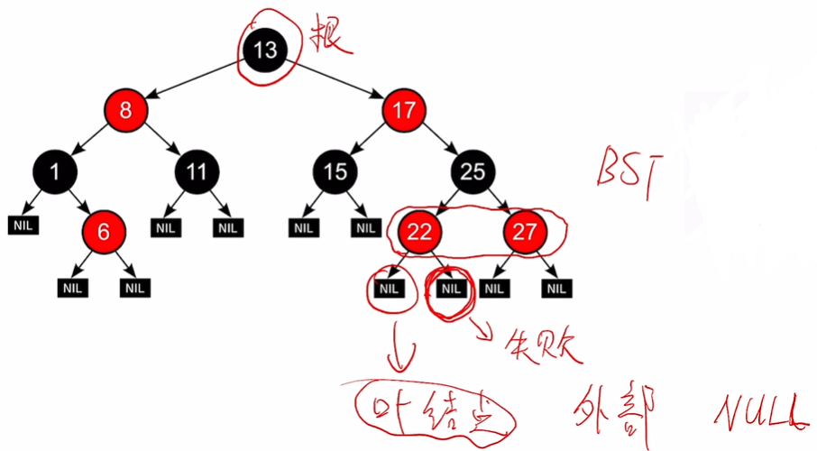

**【顺口溜】**

- **左根右**：左子树 < 根节点 < 右子树。
- **根叶黑**：根节点和叶节点是黑色。
- **不红红**：不存在两个相邻的红色结点（黑红交替）。
- **黑路同**：从任意节点到任一叶结点的简单路径（只能向下）上，所含**黑结点的数目相同**。


由定义推导出的性质：

1. 性质1：从根节点到叶结点的最长路径不大于最短路径的**2倍**。（特性4/5推得）

而AVL树的要求是左右子树高度差不超过1，比RBT的2倍要求更严格，所以AVL经常不平衡，而RBT则没有，所以插入和删除更高效。

2. 性质2：有n个内部节点的红黑树高度 $h≤2log_2(n+1)$ 。

性质2推导：红黑树查找操作时间复杂度 $O(log_2n)$，查找效率与AVL树同等数量级。

### 3.2存储结构

```c
struct RBnode {		// 红黑树的结点定义
    int key;		// 关键字的值
    RBnode* parent;	// 父节点指针
    RBnode* 1child,rchild;	// 左右孩子指针
    int color;		// 结点颜色,如:可用表示黑/红也可使用枚举型enum表示顏色
};
```

### 3.3查找

与 BST、AVL 相同，从根出发，左小右大，若查找到一个空叶节点，则查找失败。

### ❗3.4==【考点】插入==

可视化网站：https://www.cs.usfca.edu/~galles/visualization/RedBlack.html

步骤：

step1：先查找，确定插入位置（原理同二叉排序树），插入新结点。

- 新结点是**根**――染为**黑色**。
- 新结点<font color="red">非根</font>――染为<font color="red">红色</font>。

step2：插入之后：

1. 若插入新结点后依然满足红黑树定义，则插入结束。

2. 若插入新结点后不满足红黑树定义（破坏了特性），需要**调整**（看新结点的叔叔（父结点的兄弟）的颜色），使其重新满足红黑树定义

   【注意】这里的**染色**都是染成相反颜色。

   1. **黑叔**：**旋转+染色**：
     - LL型：右单旋，**父替爷** + **==父爷==染色**。
     - RR型：左单旋，父替爷 + 父爷染色。
     - LR型：左、右双旋，儿替爷 + 儿爷染色。
     - RL型：右、左双旋，儿替爷 + 儿爷染色。
   2. <font color="red">红叔</font>：**染色+变新**：
     1. **==叔父爷==染色，爷变为新结点**（那么就再判断新结点是不是根节点，要不要变黑）

---

例子：

从一棵空的红黑树开始，插入：20,10,**5**,30,40,57,3,2,4,35,25,18,22,23,24,19,18。

[7.3_5_红黑树的插入_哔哩哔哩_bilibili](https://www.bilibili.com/video/BV1b7411N798/?p=79&spm_id_from=pageDriver&vd_source=9d3c5a863c7c6dbd5152dd7c4e9dc492)

到插入5时候，发生不平衡（红红相连），进行对**<u>黑叔 + LL</u>**的操作：

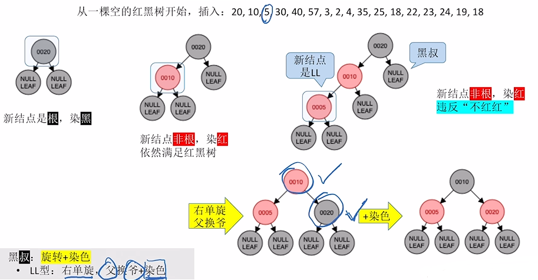

到插入30时候，发生不平衡（红红相连），进行对 <u><font color="red">红叔</font></u> 的操作：

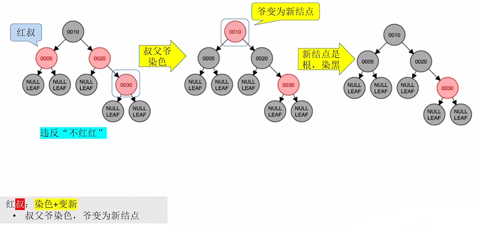

到插入40时候，发生不平衡（红红相连），进行对**<u>黑叔 + RR</u>** 的操作：


到插入57时候，发生不平衡（红红相连），进行对 <u><font color="red">红叔</font></u> 的操作：

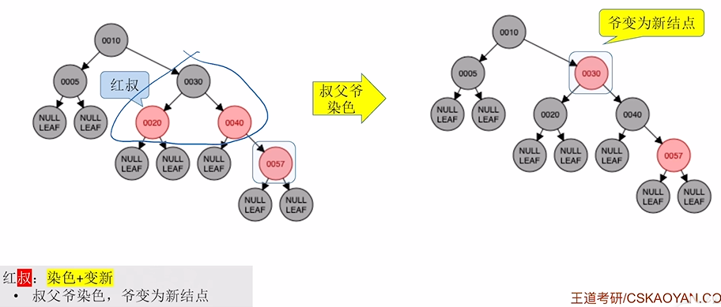

...省略简单重复操作

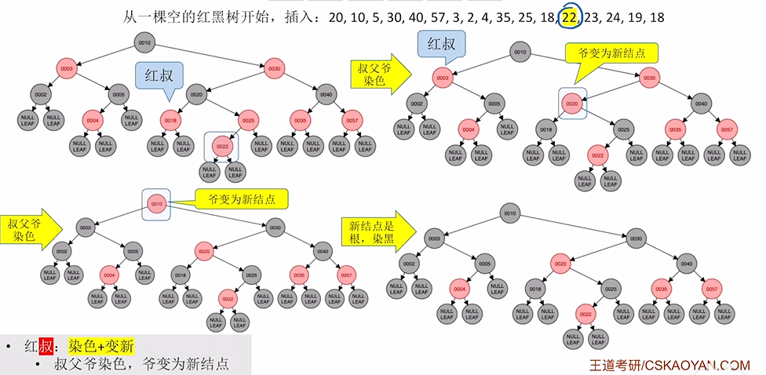

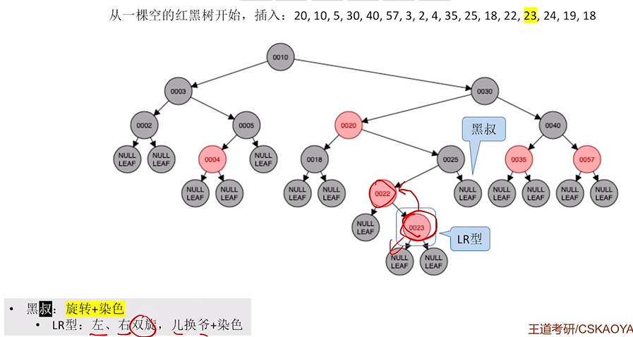

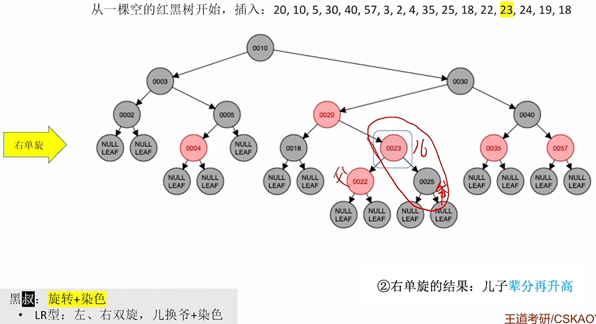

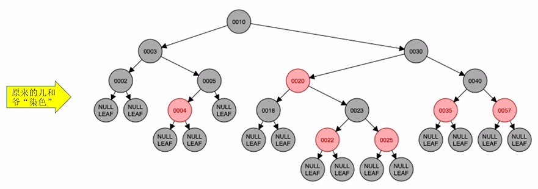


### 3.5删除

1. 红黑树删除操作的时间复杂度 **O(log2 n)**。
2. 在红黑树中删除结点的处理方式和“二叉排序树的删除”（3种情况）一样
3. 按②删除结点后，可能破坏“红黑树特性”，此时需要调整结点颜色、位置，使其再次满足“红黑树特性”。


## 4.多路查找树

前面提到的**二叉**排序树，关键点在于**2叉**，也就是说把一棵树的分叉通过判断是否大于该节点，分出了两个子树。那么如果一个节点有不止一个元素呢？

**多路查找树(muitl-way search tree)**， 其每一个结点的孩子数可以多于两个，且每一个结点处可以存储多个元素。由于它是查找树，所有元素之间存在某种特定的排序关系。

在这里，每一个结点可以存储多少个元素，以及它的孩子数的多少是非常关键的。常见的有4种特殊形式：2-3树、2-3-4树、B树和B+树。这里主要介绍B树和B+树，因为2-3树、2-3-4树都是B树的特例。

如下图所示是一颗2-3树：

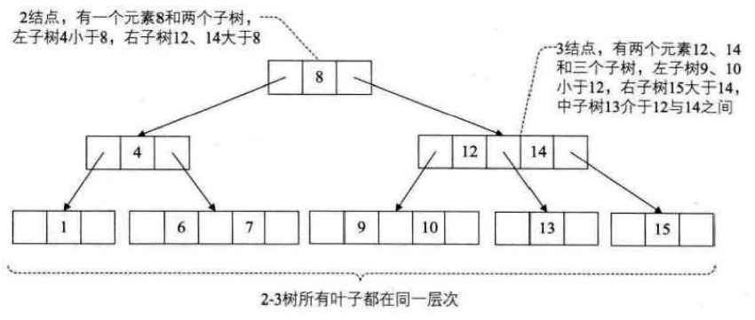

### 4.1 B树

#### 4.1.1 定义

B树，又称**多路平衡查找树**，B树中所有结点的孩子个数的**最大值**称为B树的**阶**，通常用 m 表示。

**【注意】**B树是所有结点的**平衡因子均等于0**的多路平衡查找树。

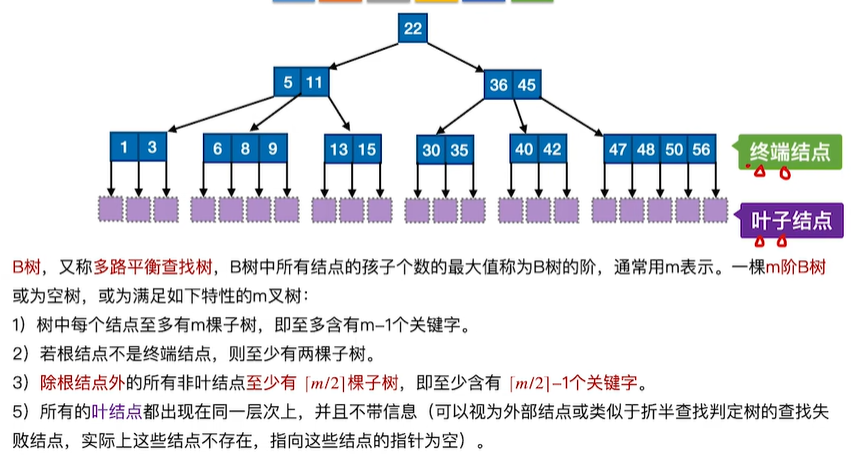

##### ==【考点】B树的特征==

一棵**==m阶==B树**：或为空树，或为满足如下特性的m叉树：

1. 树中每个结点==至多==有 **==m 棵子树==**，即至多含有 m-1 个关键字（**可以没有满的分支结点**）。

2. 若**根结点**不是**终端结点（分支结点）**，则**至少有 2 棵子树**。

3. **除根结点外**的所有**非叶结点（分支结点）==至少==有 ==$\lceil m/2\rceil$ 棵子树==**，即至少含有 $\lceil m/2\rceil-1$ 个关键字。

   【技巧】遇到这种题，求分叉的数量，自然-1就是关键字的数量。

4. **叶节点**：

   - 所有的叶结点都出现在同一层次上（**平衡因子均**等于0）；
   - 并且**不带信息**（可以视为外部结点或类似于折半查找判定树的**查找失败结点**，**实际上这些结点不存在**，指向这些结点的指针为空）；
   - **n 个关键字的B树，有 n+1 个叶节点**（因为**叶节点是分叉**）。

5. 所有非叶结点（关键字）结构如下：

| n    | P0   | K1   | P1   | K2   | P2   | ...  | Kn   | Pn   |
   | ---- | ---- | ---- | ---- | ---- | ---- | ---- | ---- | ---- |

其中：

K~i~（i = 1,2,...n）为结点的**关键字**，且满足K~1~<K~2~< ...<K~n~。

P~i~（i = 0,1,...n）为指向**子树根结点**的指针，且指针 P~i-1~ 所指子树中所有结点的关键字均小于 K~i~，P~i~ 所指子树中所有结点的关键字均大于K~i~ 。（即符合二叉排序树的左小右大）。

n $(\lceil m/2\rceil-1≤ n ≤m-1)$ 为结点中关键字的个数。


#### 4.1.1(1)五叉查找树

<u>最多4个关键字，**5**个子树（分叉）。最少2个关键字，3个子树（分叉）。</u>

**结点内关键字有序**。因为有序，所以可以使用折半查找。

下图所示的B树中**所有结点的最大孩子数m=5**，因此它是一棵**5阶B树**，在 m 阶B树中结点最多可以有 m 个孩子。

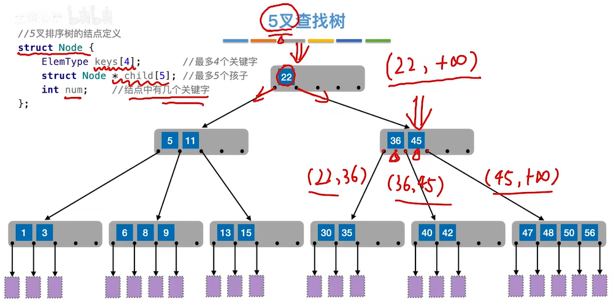

可以借助该实例来分析上述性质：

1. 每一个节点的**孩子个数 = 关键字个数 + 1** (每一个空隙都存在一个分支)。
2. 如果根结点没有关键字就没有子树，此时B树为空；如果根结点有关键字，则其子树必然大于等于两棵，因为子树个数等于关键字个数加1。
3. **除根结点外**的所有非终端结点==至少有 $\lceil m/2\rceil=\lceil 5/2\rceil=3$ 棵子树==（即至少有$ \lceil m/2\rceil-1=\lceil 5/2\rceil-1=2 $个关键字)，至多有5棵子树（即至多有4个关键字）。
4. 结点中**关键字从左到右递增有序**，关键字两侧均有指向子树的指针，左边指针所指子树的所有关键字均小于该关键字，右边指针所指子树的所有关键字均大于该关键字。或者看成下层结点关键字总是落在由上层结点关键字所划分的区间内，如第二层最左结点的关键字划分成了3个区间：(-∞,5), (5,11), (11,+∞)，该结点3个指针所指子树的关键字均落在这3个区间内。
5. **所有叶结点（外部节点）均在第4层**，代表**查找失败**的位置。


#### 4.1.2 B树与磁盘存取

**B树中的大部分操作所需的磁盘存取次数与B树的高度成正比。**

我们的外存，比如硬盘， 是将所有的信息分割成相等大小的页面，每次硬盘读写的都是一个或多个完整的页面，对于一个硬盘来说，一页的长度可能是211到214个字节。

在一个典型的B树应用中，要处理的硬盘数据量很大，因此无法一次全部装入内存。因此我们会对B树进行调整，使得B树的阶数（或结点的元素）与硬盘存储的页面大小相匹配。比如说一棵B树的阶为1001 (即1个结点包含1000个关键字)，高度为2，它可以储存超过10亿个关键字，我们只要让根结点持久地保留在内存中，那么在这棵树上，寻找某一个关键字至多需要两次硬盘的读取即可。

通过这种方式，在有限内存的情况下，每一次磁盘的访问我们都可以获得最大数量的数据。由于B树每结点可以具有比二叉树多得多的元素，所以与二叉树的操作不同，它们减少了必须访问结点和数据块的数量，从而提高了性能。可以说，B树的数据结构就是为内外存的数据交互准备的。


#### 4.1.3 查找

在B树上进行查找与二叉查找树很相似，只是每个结点都是多个关键字的有序表，在每个结点上所做的不是两路分支决定，而是根据该结点的子树所做的多路分支决定。

B树的查找包含2个基本操作：

1. **在B树中找结点；**
2. **在结点内找关键字。**

在B树上查找到某个结点后，先在有序表中进行查找：

1. 若找到则查找成功；
2. 没找到，按照对应的指针信息到所指的子树中去查找。

【2023年408真题】查找某个关键字，不一定会查到叶节点，因为可能在分支结点就找到了。

---

##### 如何保证查找效率？

若每个结点内关键字太少，导致树**变高**，要查更多层结点，效率低。

**策略1**：（可以借助性质第3条）

**除根结点外**的所有非终端结点：（m=5）

1. **至少有 $\lceil m/2\rceil=\lceil 5/2\rceil=3$ 棵子树（向上取整），至多有5棵子树**。
2. **至少有 $\lceil m/2\rceil-1=\lceil 5/2\rceil-1=2$ 个关键字，至多有m-1=4个关键字**。

> 为什么除根节点呢？
>
> 因为如果整个树只有1个元素，根节点只有两个分叉。

但是下面整棵树虽然满足上面的条件，仍不够平衡：

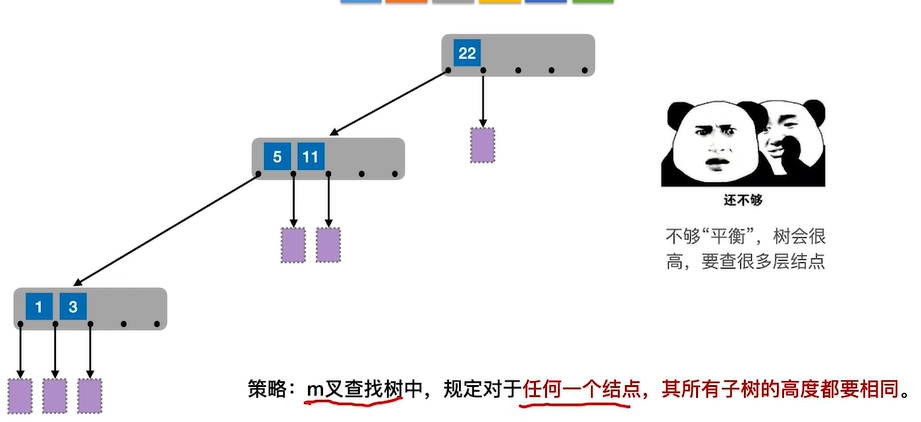

**策略2**：（性质第5条）

**m叉查找树中，规定对于任何一个结点，其所有子树的高度都要相同**。

---

##### 含n个关键字的m阶B树，最小高度、最大高度是多少?

【注意】大部分学校算B树的高度不包括叶子结点（失败结点）

- 最小高度

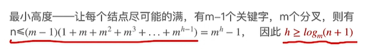

- 最大高度

思路1：

n个关键字将数域切分为 n+1 个区间。

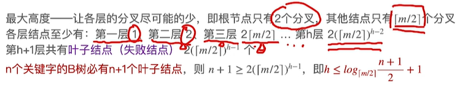

思路2：

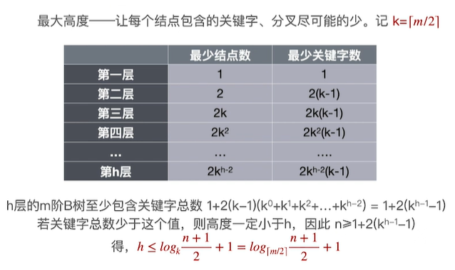


#### 4.1.4 插入

[7.4_2_B树的插入删除_哔哩哔哩_bilibili](https://www.bilibili.com/video/BV1b7411N798/?p=82&spm_id_from=pageDriver&vd_source=9d3c5a863c7c6dbd5152dd7c4e9dc492)

与二叉查找树的插入操作相比，B树的插入操作要复杂得多。在二叉査找树中，仅需査找到需插入的终端结点的位置。但是，在B树中找到插入的位置后，并不能简单地将其添加到终端结点中，因为此时可能会导致整棵树不再满足B树定义中的要求。

将关键字key插入B树的过程如下：

1. **定位**。利用前述的B树査找算法，找出插入该关键字的**最低层**中的某个非叶结点（在B树中查找key时,会找到表示查找失败的叶结点,这样就确定了最底层非叶结点的插入位置）。

   【注意】插入位置一定是**最低层**中的某个非叶结点。

2. **插入**。在B树中，每个非失败结点的关键字个数都在区间 [ **⌈ m / 2 ⌉ − 1** , m − 1 ] 内。插入后检查被插入结点内关键字的个数：

   1. 插入后的结点关键字个数小于 m - 1，可以直接插入；
   2. 插入后的结点关键字个数大于 m − 1 时，必须对结点进行分裂
      - **【注意】**分裂选的结点是从**中间 ⌈ m / 2 ⌉** 选的，往往是一个拿出来放到上面。。

##### ==【考点】B树插入的关键==

- 关键字个数插入之后是否大于 ==m − 1（最大关键字数）==，大于了就要分裂长高。

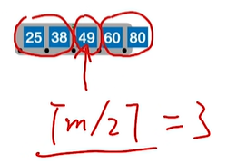

分裂（长高）：

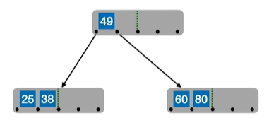

这里再插入，不会插入到49后面，而是38或者80后面。

直到下面子树节点满了，再分裂把 ⌈ m / 2 ⌉ 提到父结点的后面。

> eg.
>


#### 4.1.5 删除

B树中的删除操作与插入操作类似，但要更复杂一些，即要使得删除后的结点中的 **关键字个数 ≥ ⌈ m / 2 ⌉ − 1** ，因此将涉及结点的“**合并**”问题。

##### ==【考点】B树删除的关键==

- 删除关键字之后，结点内关键字个数是否小于 ==⌈ m / 2 ⌉ − 1（最小关键字数）==。

1. **被删关键字 k 不是终端结点（最低层非叶结点）时**，可以用 k 的前驱（或后继）来替替代 k，然后在相应的结点中删除 k。


2. **被删关键字 k 在终端结点（最低层非叶结点）时**，有下列三种情况：

   1. 删除之后关键字数满足B树条件（m-1 > n ≥ ⌈ m / 2 ⌉），**直接删除关键字**。若被删除关键字所在结点的 **关键字个数 ≥ ⌈ m / 2 ⌉**，表明删除该关键字后仍满足B树的定义，则直接删去该关键字。

   2. 删除之后关键字数量低于下限：

      1. **兄弟够借**。若被删除关键字所在结点删除前的 **关键字个数 = ⌈ m / 2 ⌉ − 1**，且与此结点相邻的右(或左)兄弟结点的 **关键字个数 ≥ ⌈ m / 2 ⌉**，则需要调整该结点、右(或左)兄弟结点及其双亲结点（父子换位法），以达到新的平衡。

         > 在图(a)中删除B树的关键字65，右兄弟 关键字个数≥ ⌈ m / 2 ⌉ = 2，将71取代原65的位置，将74调整到71的位置。

      1. **兄弟不够借，合并**。若被删除关键字所在结点删除前的 **关键字个数 = ⌈ m / 2 ⌉ − 1**，且此时与该结点相邻的左、右兄弟结点的 关键字个数均 = ⌈ m / 2 ⌉ − 1，则将关键字删除后与左(或右)兄弟结点及双亲结点中的关键字进行合并。

         > 在图(b)中删除B树的关键字5，它及其右兄弟结点的 关键字个数= ⌈ m / 2 ⌉ − 1=1，故在5删除后将60合并到65结点中。

在合并过程中，**双亲结点中的关键字个数会减1**。若其双亲结点是根结点且关键字个数减少至0（根结点关键字个数为1时，有2棵子树)，则直接将根结点删除，合并后的新结点成为根；若双亲结点不是根结点，且关键字个数减少到 ⌈ m / 2 ⌉ − 2  ，则又要与它自己的兄弟结点进行调整或合并操作，并重复上述步骤，直至符合B树的要求为止。


### 4.2 B+树

B+树是应文件系统（比如数据库）所需而出现的一种B树的变形树。

m 阶的B+树与 m 阶的B树的主要**差异**如下：

1. **n个关键字，对应 n 个子树（分叉）**。

   1. 在B+树中，每个结点（非根内部结点）的关键字个数 n 的范围是 ⌈ m / 2 ⌉ ≤ n ≤ m（根结点：1 ≤ n ≤ m）；
   2. 在B树中，每个结点（非根内部结点）的关键字个数 n 范围是 ⌈ m / 2 ⌉ − 1 ≤ n ≤ m − 1（根结点：1 ≤ n ≤ m − 1）。

2. 所有的**叶子结点包含全部关键字的信息**，及指向含这些关键字记录的指针，**叶子结点本身依关键字的大小自小而大顺序链接**。

   所以支持顺序查找

3. 所有分支结点可以看成是索引，结点中仅含有其子树中的最大(或最小)关键字。

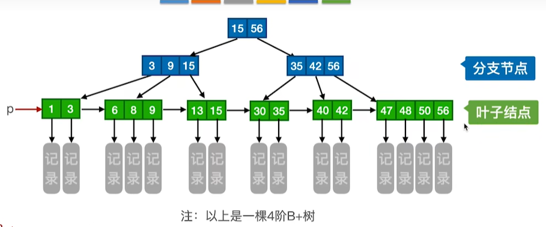

B+树的结构特别适合带有范围的查找。比如查找我们学校18~22岁的学生人数，我们可以通过从根结点出发找到第一个18岁的学生，然后再在叶子结点按顺序查找到符合范围的所有记录。

B+树的插入、删除过程也都与B树类似，只不过插入和删除的元素都是在叶子结点上进行而已。

### 4.3 ==【考点】B树 vs B+树==

|                | m阶B树                                                       | m阶B+树                                                      |
| -------------- | ------------------------------------------------------------ | ------------------------------------------------------------ |
| 类比           | 二叉查找树的进化→m叉查找树                                   | 分块查找的进化→多级**分块查找**                              |
| 关键字与分叉   | n个关键字对应n+1个分叉（子树）                               | **n个关键字对应n个分叉**                                     |
| 结点包含的信息 | 所有结点中都包含记录的信息                                   | 只有最下层**叶子结点**才包含记录的信息（可使树更矮）         |
| 查找方式       | **折半查找**。**不支持顺序查找**。查找成功时，可能停在任何一层结点，查找速度“不稳定”。 | 支持**顺序查找**。查找成功或失败都会到达最下一层结点，查找速度“稳定”。 |
| 相同点         | >                                                            | 除根节点外，最少[m/2]个分叉（确保结点不要太“空”）任何一个结点的子树都要一样高（确保“绝对平衡”） |


# 四、散列查找（哈希Hash表）

## 1.散列表查找的基本概念

**散列表**是根据关键字而直接进行访问的数据结构。也就是说，散列表建立了关键字和存储地址之间的一种**直接映射**关系。我们只需要通过某个函数$f$，使得：
$$
存储位置 = f(关键字)
$$
那样我们可以通过查找关键字不需要比较就可获得需要的记录的存储位置。

---

**散列技术**既是一种存储方法， 也是一种查找方法，散列技术是在记录的存储位置和它的关键字之间建立一个确定的对应关系f，使得每个关键字key对应一个存储位置  f(key)。查找时，根据这个确定的对应关系找到置上。

这里我们把这种 $对应关系 f$ 称为**散列函数**，又称为**哈希(Hash)函数**。按这个思想，采用散列技术将记录存储在一块连续的存储空间中，这块连续存储空间称为**散列表**或**哈希表(Hash table)**。那么关键字对应的记录存储位置我们称为**散列地址**。

散列函数可能会把两个或两个以上的<u>不同关键字映射到同一地址</u>，称这种情况为**冲突**，这些发生碰撞的不同关键字称为**同义词**。一方面，设计得好的散列函数应尽量减少这样的冲突；另一方面，由于这样的冲突总是不可避免的，所以还要设计好处理冲突的方法。

理想情况下，对散列表进行查找的**时间复杂度为 O(1)**，即与表中元素的个数无关。


这里使用**拉链法**：

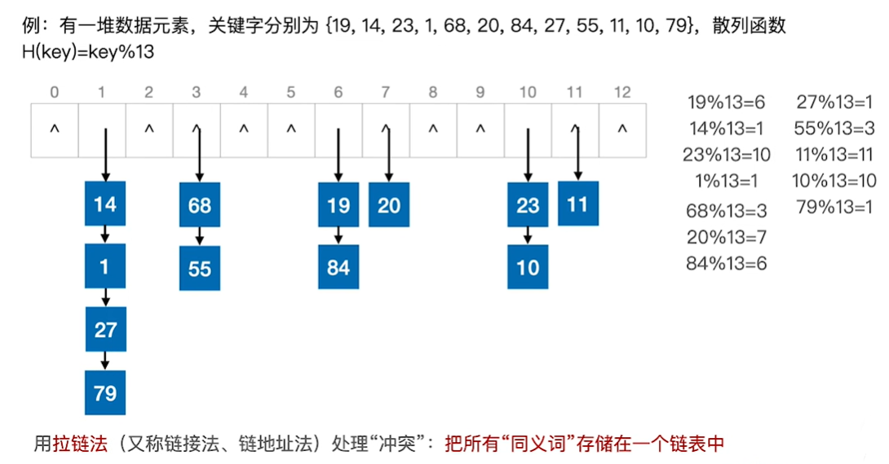

## 2.散列函数的构造方法

### 2.1直接定址法

适合关键字的分布基本**线性连续**的情况。

直接取关键字的某个线性函数值为散列地址，散列函数为：
$$
H(key) = key\ 或\ H(key) = a* key ＋ b
$$
式中，a和b是常数。

这种方法计算最简单，且不会产生冲突。它适合关键字的分布基本连续的情况，若关键字分布不连续，空位较多，则会造成存储空间的浪费。

> 例如：0~100岁的人口数字统计表，可以吧年龄数值直接当做散列地址。

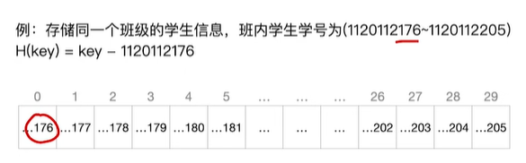

### 2.2数字分析法

数字分析法通常适合处理关键字位数比较大的情况，如果**事先知道关键字的分布**且关键字的若干位分布**较均匀**，就可以考虑用这个方法。

设关键字是r进制数（如十进制数)，而 **r 个数码在各位上出现的频率不一定相同，可能在某些位上分布均匀一些**，每种数码出现的机会均等；而在某些位上分布不均匀，只有某几种数码经常出现，此时可选取数码分布较为均匀的若干位作为散列地址。

这种方法适合于已知的关键字集合，若更换了关键字，则需要重新构造新的散列函数。

> 例如，当手机号码为关键字时，其11位数字是有规则的，此时是无需把11位数值全部当做散列地址，这时我们给关键词抽取， 抽取方法是使用关键字的一部分来计算散列存储位置的方法，这在散列函数中是常常用到的手段。


### 2.3平方取中法

平方取中法――取关键字的平方值的中间几位作为散列地址。

具体取多少位要视实际情况而定。这种方法得到的**散列地址与关键字的每位都有关系**，因此使得散列地址分布比较均匀，

平方取中法比较适合于**不知道关键字的分布**，而**位数又不是很大**的情况。

【另一种说法】适用于关键字的每位取值都不够均匀或均小于散列地址所需的位数

这个方法计算很简单，假设关键字是1234，那么它的平方就是1522756，再抽取中间的3位就是227，用做散列地址。

再比如关键字是4321，那么它的平方就是18671041，抽取中间的3位就可以是671，也可以是710，用做散列地址。

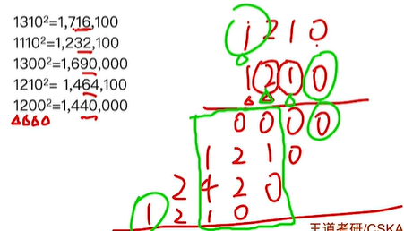


### ❗2.4除留余数法

这是一种最简单、最常用的方法，假定**散列表表长为 m**，取一个**不大于 m 但最接近或等于 m 的质数 p**，利用以下公式把关键字转换成散列地址。散列函数为：
$$
H(key) = key \% p\ (p<=m)
$$
事实上，这方法不仅可以对关键字直接取模，也可在折叠、平方取中后再取模。

除留余数法的**关键是选好p**，使得每个关键字通过该函数转换后等概率地映射到散列空间上的任一地址，从而尽可能减少冲突的可能性。

【原因】因为质数对其他的数没有公因子。

### 2.5随机数法

选择一个随机数，取关键字的随机函数值为它的散列地址。也就是

H(key) =random(key)

这里random是随机函数。当关键字的长度不等时，采用这个方法构造散列函数是比较合适的。


## 3.处理散列冲突（碰撞）

[7.5_2_散列查找(下)_哔哩哔哩_bilibili](https://www.bilibili.com/video/BV1b7411N798/?p=85&spm_id_from=pageDriver&vd_source=9d3c5a863c7c6dbd5152dd7c4e9dc492)

任何设计出来的散列函数都**不可能绝对地避免冲突**。为此，必须考虑在发生冲突时应该如何处理，即为产生冲突的关键字寻找下一个“空”的Hash地址。

### 3.1开放定址法

**开放定址法**：一旦发生了冲突，**就去寻找下一个空的散列地址**，只要散列表足够大，空的散列地址总能找到，并将记录存入。

它的公式是：
$$
H_i(key)= (f(key)+ d_i)\% m\ (di= 1,2,3,...,m - 1)
$$
式中：

- $H_i(key)$为散列函数，i=0,1,2,.., k (k ≤ m - 1)。
- $m$表示散列列表表长。
- ==$d_i$为增量序列==。

根据增量序列的不同，就分为下面 4 种方法：

1. 线性探测法
2. 平方探测法
3. 再散列法
4. 伪随机序列法


#### ==【考点】堆积、聚集==

- 因为**同义词之间或非同义词**之间发生冲突，散列到同一个地址引起“**堆积、聚集**”。
- 如果发生**聚集、堆积**，那么就是**解决冲突的方法选择不当**。
- 【2014年408真题】堆积现象，只会影响**平均查找长度**。


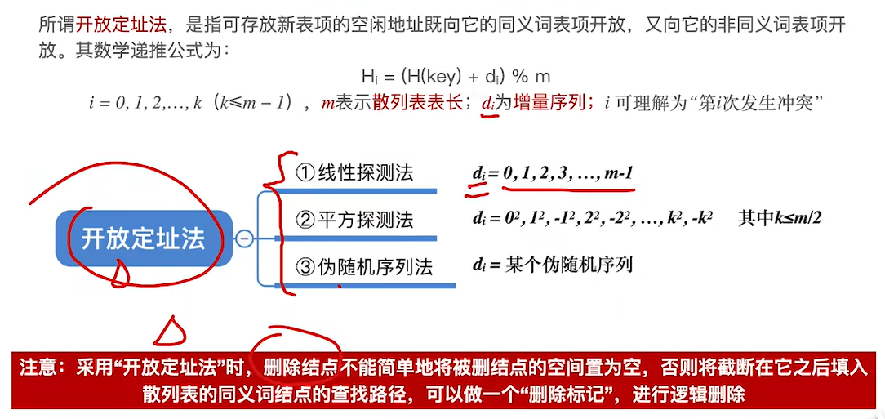

#### 3.1.1==【考点】线性探测法==

线性探测法：当 $d_i =0,1,2,...,m-1$ 时，称为线性探测法。

**特点**：冲突发生时，顺序查看表中**下一个单元**，直到找出一个空闲单元（当表未填满时一定能找到一个空闲单元）或查遍全表。

**【注意】当没有提及表有多长的时候，就可以一直往后填。**

**==散列表的大小==与模没有关系，与填装因子α有关**。如2010年408大题（1）。

**缺点**：可能使第个散列地址的**同义词**存入第i+1个散列地址，这样本应存入第 i+1个散列地址的元素就争夺第i+2个散列地址的元素的地址，从而造成大量元素在**相邻的散列地址上堆积**，大大降低了查找效率。

- **==同义词==**：就是原本应该放在同一个位置的关键字。

> 例题：有k个同义词，用线性探测法把它们填入散列表，要进行（==$\cfrac{k(k+1)}2$==）次探测。
>
> 那么第一个关键字直接探测然后放进去，是 1 次。
>
> 第二个关键字，因为原本的位置被第一个占了，所有在原有的基础上加一，所以是 2 次。
>
> 以此类推，构成等差数列：1，2，3，...，k，$\displaystyle \sum_{i=1}^ki = \cfrac{k(k+1)}2$.

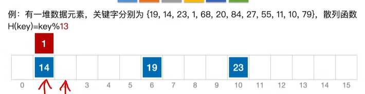

$d_i=1$，这里就是 +1：

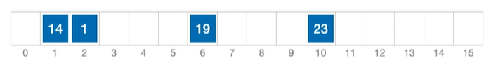

#### 3.1.2平方探测法

平方探测法，又称**二次探测法**。当 $d_i=0^2,1^2,-1^2,2^2,-2^2,..,k^2, -k^2$ 时，称为平方探测法，其中$k < \cfrac m2$，散列表长度 m 必须是一个可以表示成4k + 3的素数。

平方探测法是一种较好的处理冲突的方法，**可以避免出现“堆积、聚集”问题**，它的缺点是不能探测到散列表上的所有单元，但至少能探测到一半单元。


#### 3.1.3再散列法

再散列法（**再哈希法**，**双散列法**）：除了原始的散列函数H(key)之外，多准备几个散列函数RHi(key)，当散列函数冲突时，用下一个散列函数计算一个新地址，直到不冲突为止：

**【注意】新地址，无论大于小于，不等于就行**。
$$
H_i = RH_i(Key) \ i=1,2,3...,k
$$

#### 3.1.4伪随机序列法

当 **d~i~= 伪随机数序列**时，称为伪随机序列法。


### 3.2==【考点】链地址法（拉链法）==

**不换地方。**

转换一下思路，为什么非得有冲突就要换地方呢，如果不换地方该怎么处理？于是我们就有了链地址法。

将所有关键字为同义词的记录存储在一个单链表中，我们称这种表为同义词子表，在散列表中只存储所有同义词子表的头指针。


### 3.4公共溢出区法

这个方法其实就更加好理解，就是把凡是冲突的家伙额外找个公共场所待着。我们为所有冲突的关键字建立了一个公共的溢出区来存放。

就前面的例子而言，我们共有三个关键字{37,48,34}与之前的关键字位置有冲突，那么就将它们存储到溢出表中，如下图所示：


如果相对于基本表而言，有冲突的数据很少的情况下，公共溢出区的结构对查找性能来说还是非常高的。


## 4.散列表查找

### 4.1==【考点】填装因子α==

【2011，2022年真题】**查找效率**取决于：（==冲突越少，效率越高==）

1. ==散列函数==

2. ==处理冲突的方法==

3. 散列函数的==**填装因子α**==。且**成反比**。

   填装因子α越大，冲突产生概率越大，查找效率越低。

$$
填装因子\alpha = \frac{表中的记录数(已经含有的表项数)}{散列表的长度(一共能够容纳的表项数)}
$$

**【注意】**题目中如果给出含有 n 个元素的散列表，查找效率（查找长度），都**与 n 无关，只与填装因子α有关**。


### 4.2==【考点】平均查找长度==

#### 4.2.1查找成功

##### 1）==线性探测再散列==

==【2018年408真题】==现有长度为7、初始为空的散列表ht，散列函数h(k)=k%7，用线性探测再散列法解决冲突。将关键字 22,43,15 依次插入到ht后，查找**成功**的平均查找长度是：（2）

这里通过取余运算，得到三个关键字的余数都是 1。所以通过线性探测把他们依次向后移。得到HT（哈希表）如下：

| 散列地址 | 0    | 1    | 2    | 3    | 4    | 5    | 6    |
| -------- | ---- | ---- | ---- | ---- | ---- | ---- | ---- |
| 关键字   |      | 22   | 43   | 15   |      |      |      |

1. **分母**：因为**有 3 个关键字，所以分母是 3**。

2. **分子**：**找到对应的关键字要对比几次**。这里就是：

   分子是 1+2+3

**ASL~成功~ = （1+2+3）/ 3 = 2**。

---

##### 2）链地址法

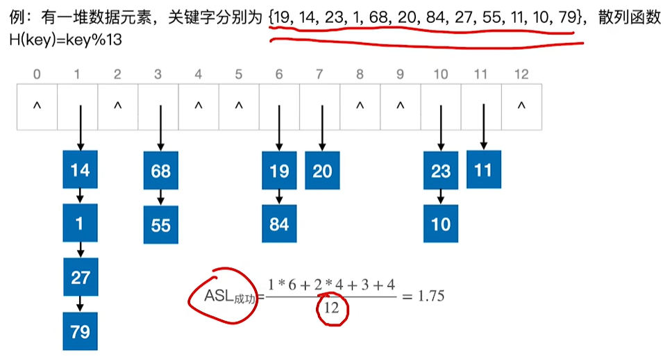

例如存了12个元素，那么每一个被查询的概率是 1/12。（**分母是元素个数**）

这里第一层有6个，所以是1*6，

第二层有4个，所以是2*4，

第三层第四层分别有1个，所以是3+4。


#### 4.2.2查找失败

计算失败，可以转换理解，就是在已经构造好的散列表上，我们再去插入一个新的值需要比较多少次。

##### 1）==线性探测再散列==

==【2019年408真题】==现有长度为 11 且初始为空的散列表 HT，散列函数是 H(key) = key % 7，采用线性探查 （线性探测再散列）法解决冲突。将关键字序列 87, 40, 30, 6, 11, 22, 98, 20 依次插入 HT 后，HT 查找**失败**的平均查找长度是：（6）

通过取余的方式把关键字填入HT之后得到：

| 散列地址 | 0    | 1    | 2    | 3    | 4    | 5    | 6    | 7    | 8    | 9    | 10   |
| -------- | ---- | ---- | ---- | ---- | ---- | ---- | ---- | ---- | ---- | ---- | ---- |
| 关键字   | 98   | 22   | 30   | 87   | 11   | 40   | 6    | 20   |      |      |      |

1. **分母**：因为**取余的模是 7，所以分母是 7**。

2. **分子**：**查找失败的关键字要对比几次**。所以第一个0号地址，（**包括它自己**）要向后走9次（**对比9次**）才能**到达空的关键字**。其他的关键字同理，数出到达空的关键字的次数。

   而到达7，**因为模是7**，所以7之后的散列地址不进行计算，就**到 6 就结束**。

   所以分子是 9+8+7+6+5+4+3 = 42

**ASL~失败~ = 42 / 7 = 6**。

---

==【2012年408真题】==现有长度为5、初始为空的散列表HT，散列函数H(k)=(k+4)%5，用线性探查再散列法解决冲突。若将关键字序列 2022，12，25 依次插入 HT 中，然后删除关键字25，则HT中查找**失败**的平均查找长度为（1.8）

通过取余的方式把关键字填入HT之后得到：

| 散列地址 | 0    | 1    | 2    | 3    | 4    |
| -------- | ---- | ---- | ---- | ---- | ---- |
| 关键字   |      | 2022 | 12   |      | 25   |

1. **分母**：因为**取余的模是 5，所以分母是 5**。

2. **分子**：

   1. 第 0 个散列地址，因为**是空，所以只需要对比 1 次**。
   2. 第 1 个散列地址，需要对比 3 次（包括它自己）才能走到3号散列地址。
   3. 第 2 个散列地址，需要对比 2 次。
   4. 第 3 个散列地址，因为是空，所以只需要对比 1 次。
   5. 第 4 个散列地址，是**最后一个关键字地址**，再往后一步，就可以查找失败，所以是**需要对比 2 次**。

   所以分子是 1+3+2+1+2 = 9

**ASL~失败~ = 9 / 5 = 1.8**。

---

##### 2）链地址法

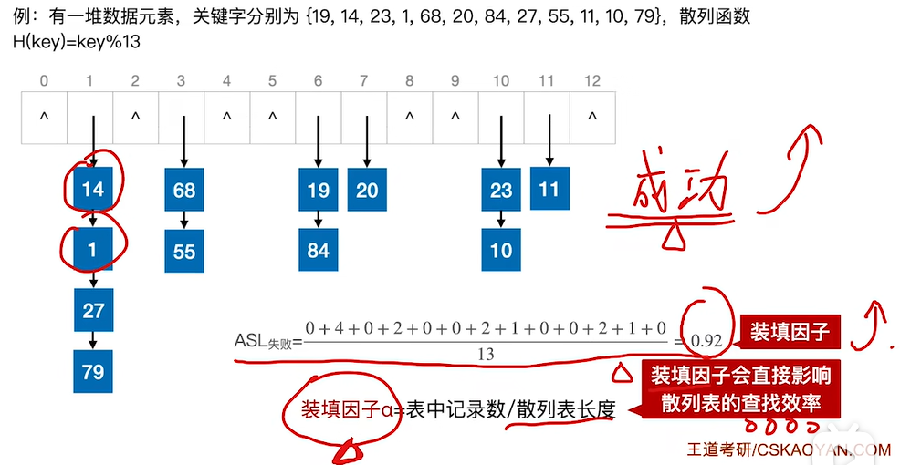

**分子上的数，就是每一列的链表的长度之和**。

分母依旧是元素个数。


# 参考

[数据结构：查找(Search)【详解】- CSDN博客](https://blog.csdn.net/Real_Fool_/article/details/114359564)

