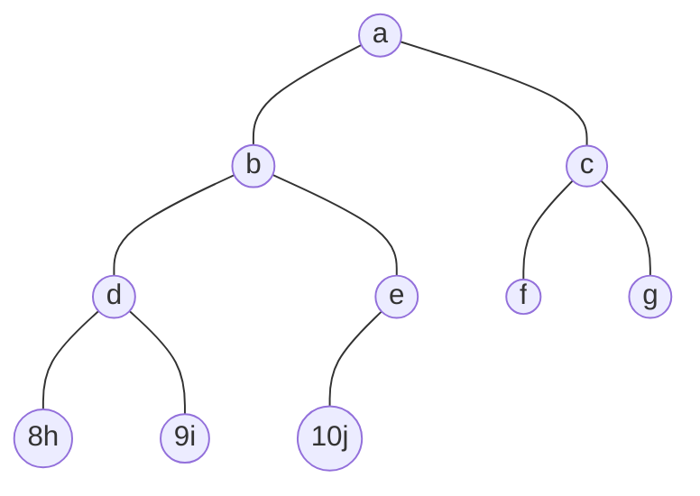

# 数据结构代码

> Suhan
>
> 用于考研408

**【注意】为了避免使用二级指针，函数传参使用了C++中的引用传参`&`。**

[toc]

## 数据结构三要素和三种结构

- **逻辑结构**
  - 集合结构
  - 线性结构：一对一
    - 线性表
    - 栈
    - 队列
    - 串
  - 树形结构：一对多
  - 图形结构：多对多

- **数据运算（基本操作）**
- **物理结构（存储结构）**
  - 顺序存储：物理上相邻
  - 非顺序（离散）存储：物理上不相邻
    - 链式存储
    - 索引存储
    - 散列存储

若采用顺序存储，则各个数据元素在物理上必须是连续的；若采用非顺序存储,则各个数据元素在物理上可以是离散的。

数据的存储结构会影响存储空间分配的**方便程度**。

数据的存储结构会影响对数据运算的**速度**。

# 线性结构

## 1.线性表linear list

### 1.1 顺序表-C-静态分配

```c
#include <stdio.h>
#include<stdbool.h>		//引入bool数据类型
#define MaxSize 10        //定义最大长度
typedef int ElemType;    //定义数据元素类型为整型

//顺序表
// c

typedef struct
{    
    int data[MaxSize];    //用静态的"数组"存放数据元素
    int length;            //顺序表的当前长度（总长度）
}SqList;                //顺序表的类型定义


void InitList(SqList* L);
bool ListInsert(SqList* L,int i,int e);
bool ListDelete(SqList* L,int i,int* e);
ElemType GetElem(SqList L, int i);
int LocateElem(SqList L, ElemType e);
void TraverseList(SqList L);
/*关于销毁
- 静态分配：静态数组，系统自动回收空间。
- 动态分配：动态数组（malloc、 free），需要手动free。*/


int main() {
	SqList L;        //声明一个顺序表L
	int number; 		//number为元素个数
	ElemType value;  //value为查找的元素值

	InitList(&L);    //初始化顺序表L

	printf("请输入需要插入的元素个数:");
	scanf("%d",&number);
    printf("依次输入%d个元素:",number);
	for(int i=1; i<=number; i++){
		scanf("%d",&value);
		ListInsert(&L, i, value);  //在顺序表L的第1个位置插入元素value
	}
	TraverseList(L);  //输出顺序表L


	ListInsert(&L, 1, 11);  //在顺序表L的第1个位置插入元素11
	printf("插入之后的顺序表：");
	TraverseList(L);  //输出顺序表L

	printf("L的第1个位置的元素值：");
	printf("%d\n", GetElem(L, 1));  //获取顺序表L的第1个位置的元素值

	printf("查找元素值为11的元素的位序：");
	printf("%d\n", LocateElem(L, 11));  //查找元素值为11的元素，返回其位序

	ElemType e;
	ListDelete(&L, 1, &e);  //删除顺序表L的第1个位置的元素，并用e返回其值
	printf("返回刚删除的e的值：%d\n", e);
	TraverseList(L);  //输出顺序表L
    
	return 0;
}


//----------------------------------------------------
//基本操作：初始化一个顺序表
void InitList(SqList* L){
    for(int i=0; i<MaxSize; i++) //MaxSize是顺序表的最大长度L->length
        L->data[i]=0;    //将所有数据元素设置为默认初始值0
    L->length=0;            //顺序表初始长度为0
}

// 插入：在表L中的第i个位置上插入指定元素e。
//把新的数据插入的目标位置之后，把目标位置后面的数据依次向后进行移动。O(n)
bool ListInsert(SqList* L,int i,int e){
    if(i<1 || i>L->length+1)    //判断i的范围是否有效
        return false;
    if(L->length>=MaxSize)    //当前存储空间已满，不能插入
        return false;

    for(int j=L->length; j>=i; j--) //将第i个元素及之后的元素后移
        L->data[j]=L->data[j-1];
    L->data[i-1]=e;        //在位置i处放入新的数据e
    L->length++;            //长度加1
    return true;
} 

// 删除。删除表L中第i个位置的元素，并用e返回删除元素的值。
//O(n)
bool ListDelete(SqList* L,int i,int* e){ 
    if(i<0||i>L->length)//判断i的范围是否有效
        return false;
    *e=L->data[i-1];//将被删除的元素赋值给e
    for(int j=i;j<L->length;j++)//将第i个位置后的元素前移
        L->data[j-1]=L->data[j];
    L->length--;//线性表长度减1
    return true;
}

// 按位查找操作。获取表L中第i个位置的元素的值。
//O(1)
ElemType GetElem(SqList L, int i){
    if(i<0 || i>L.length)//判断i的范围是否有效
        return NULL;
    return L.data[i-1];
}

// 按值查找操作。在表L中查找具有给定关键字值的元素。
//O(n)
int LocateElem(SqList L, ElemType e){
	for(int i=0;i<L.length;i++)
		if(L.data[i]==e)
			return i+1;    //数组下标为i的元素值等于e，返回其位序i+1
	return -1;//退出循环，说明查找失败
}

// 遍历
void TraverseList(SqList L){
	for(int i=0; i<L.length; i++)
		printf("%d  ", L.data[i]);
	printf("\n");
}
```

>请输入需要插入的元素个数:4
>依次输入4个元素:1
>2
>3
>4
>1  2  3  4 
>插入之后的顺序表：11  1  2  3  4 
>L的第1个位置的元素值：11
>查找元素值为11的元素的位序：1 
>返回刚删除的e的值：11
>1  2  3  4


### 1.2 单链表-Cpp-带头结点

```cpp
#include<stdio.h>
#include<stdlib.h>
typedef int ElemType;    //定义数据元素类型为整型

//创建单链表
// cpp

typedef struct LNode{    //定义单链表结点类型
    ElemType data;        //每个结点存放一个数据元素
    struct LNode *next;    //指针指向下一个节点
}LNode, *LinkList;


bool InitList(LinkList &L);	//初始化
bool Empty(LinkList L);		//判空

bool ListInsert(LinkList &L, int i, ElemType e);//插入
bool InsertNextNode(LNode *p, ElemType e);		//后插
bool InsertPriorNode(LinkList &L, LNode *p, ElemType e);//前插

bool ListDelete(LinkList &L,int i,ElemType &e);	//按照位序删除元素
bool DeleteNode(LinkList &L,LNode *p);          //删除指定的某一个元素
void DestroyList(LinkList &L);					//销毁

LNode* GetElem(LinkList L, int i);		    //按照位序查找
LNode* LocateElem(LinkList L, ElemType e);//按照给定的值查找

int Length(LinkList L);		//链表长度
void TraverseList(LinkList L);//遍历输出链表的所有元素

LinkList CreateListTail(int n);//尾插法建立链表


int main()
{
	LinkList L;
	InitList(L);
	L = CreateListTail(5);
	printf("链表长度：%d\n", Length(L));

//------------------------测试代码--------------------
// 查找
    //查找第一个元素
    LNode *p = GetElem(L, 1);
    if(p){
        printf("查找第一个元素：%d\n", p->data);
    }else{
        printf("查找失败\n");
    }

    //查找3
    p = LocateElem(L, 3);
    if(p){
        printf("查找3成功：%d\n", p->data);
    }else{
        printf("查找3失败\n");
    }


// 插入
    printf("在第1个位置插入100：");
    ListInsert(L, 1, 100);
    TraverseList(L);

    printf("在第6个位置,后插入200：");
    if( InsertNextNode(GetElem(L, 6), 200) ){
        printf("后插成功\n");
    }
    else{
        printf("后插失败\n");
    }
    TraverseList(L);

    printf("在第1个位置,前插入300：");
    if( InsertPriorNode(L, GetElem(L, 1), 300) ){
        printf("前插成功\n");
    }
    else{
        printf("前插失败\n");
    }
    TraverseList(L);


// 删除
    ElemType e=0;
    printf("删除第8个位置的元素：");
    if( ListDelete(L, 8, e) ){
        printf("删除成功，删除的元素是：%d\n", e);
    }
    else{
        printf("删除失败\n");
    }
    TraverseList(L);

    printf("删除结点1：");
    if( DeleteNode(L, GetElem(L, 1))){
        printf("删除成功\n");
    }
    else{
        printf("删除失败\n");
    }
    TraverseList(L);

// 销毁
    printf("销毁链表：");
    DestroyList(L);
    TraverseList(L);
//---------------------------------------------------

	return 0;
}


//---------------------------------------------------
//初始化一个单链表（带头结点）
bool InitList(LinkList &L){
    L = (LNode *)malloc(sizeof(LNode)); //分配一个头结点
    if (L==NULL)    //内存不足，分配失败
        return false;
    L->next = NULL;    //头结点之后暂时还没有节点
    return true;
}

// 判断单链表是否为空（带头结点）
bool Empty(LinkList L){
    return L==NULL ? true : false;
}

/**
 * 
 * @brief 按位序插入(带头结点)：在表L中的第i个位置上插入指定元素e。
 * @details 在 i 位置插入e，相当于在 i 前面 i-1 位置后插入e，所以Get查找的是i-1。
 * 时间复杂度O(n)
 * @note step1.判断插入的是不是头结点，如果是则false;
 * step2.循环找到第i-1个结点;
 * step3.判断i-1的合法性;
 * step4.在i-1之后插入新结点。
 *
 * @param L 
 * @param i 
 * @param e 
 * @return true 
 * @return false
 * 
 */
bool ListInsert(LinkList &L, int i, ElemType e){
    //step1判断插入的是不是头结点，如果是则false。
    if(i<1)        //位序0是头结点
        return false;

    //step2循环找到第i-1个结点。
    //这样p就是i前一个结点，插入p的后面
    LNode *p = GetElem(L, i-1);
    
	//step3判断i-1的合法性。
    if(p==NULL)     //i-1值不合法
        return false;
    
	//step4在i-1之后插入新结点。
    LNode *s = (LNode *)malloc(sizeof(LNode));//新结点s
    s->data = e;
    s->next = p->next;
    p->next = s;    //将结点s连到p之后
    return true;    //插入成功
}

//后插操作：在p结点之后插入元素e
//时间复杂度O(1)
bool InsertNextNode(LNode *p, ElemType e){
    if (Empty(p))
        return false;
    LNode *s = (LNode *)malloc(sizeof(LNode));
    if (s==NULL)    //内存分配失败
        return false;

    s->data = e;        //用结点s保存数据元素e
    s->next = p->next;
    p->next = s;        //将结点s连到p之后
    return true;
}

//前插操作：在表L中的指定p结点之前插入元素e
//两种方法：
//	1是朴素的遍历一遍，然后在p-1后面插入e; 时间复杂度O(n)
//	2是在新建一个结点，存放p的内容，链接p->next，这样它就变成了p，这时候p就可以赋值为新的结点了。时间复杂度O(1)
bool InsertPriorNode(LinkList &L, LNode *p, ElemType e){
    if (Empty(p) || p==L)   //插入头结点or空结点前面
        return false;
    LNode *s = (LNode *)malloc(sizeof(LNode));
    if (s==NULL)    //内存分配失败
        return false;

    s->next = p->next;
    p->next = s;    	//新结点s连到p之后
    s->data = p->data;  //将p中元素复制到s中
    p->data = e;    	//p中元素覆盖为e
    return true;
}


/**
 * @brief 按位序删除元素(带头结点)：删除操作。删除表L中第i个位置的元素,并用e返回删除元素的值。
 * @details 因为无法获取链表里面一个结点的上一个结点，所以这里直接获取 i-1 结点，来删除 i 结点。
 * 时间复杂度O(n)
 * @note step1.新建节点q指向要删除的i结点;
 * step2.用e返回删除的结点内容;
 * step3.i-1结点直接指向i的下一个结点(q->next)，来断开i结点;
 * step4.释放i的空间(释放q)。
 *
 * @param L 
 * @param i 
 * @param e 
 * @return true 
 * @return false 
 */
bool ListDelete(LinkList &L, int i, ElemType &e){
    if(i<1 || i>Length(L))
      	return false;

    //因为无法获取链表里面一个结点的上一个结点，所以这里直接获取 i-1 结点，来删除 i 结点。
    LNode *p = GetElem(L, i-1);    //获取第i-1元素
    if(p==NULL)    //i-1值不合法
        return false;
		
    LNode *q = p->next; //令q指向被删除结点（拿到结点），也就是p->next
    e = q->data;        //用e返回元素的值
    p->next = q->next;  //将*q结点从链中“断开”
    free(q);            //释放结点的存储空间
    return true;        //删除成功
}


/**
 * @brief 指定结点删除：删除表L中指定的某一个结点p。
 * @details 时间复杂度O(1)
 * @note 解释：1->2->3->4。
 * 若要删掉1，可以先令前两个数据交换，2->1->3->4;
 * 再让1的指针链断开，令2指向3： 2->（1）-3->4;
 * 把1断开，于是就是2->3->4。
 * 
 *【注意】如果p结点是最后一个结点则无法使用这种，只能依次遍历。
 * 
 * @param L 
 * @param p 
 * @return true 
 * @return false 
 */
bool DeleteNode(LinkList &L, LNode *p){
    if(p == NULL || p==L)        //若删除的节点为空结点或者头结点，操作无效
        return false;

    if(p->next != NULL){       //p是最后一个结点，则next=NULL，操作无效
        LNode *q = p->next;    //定义一个q指针，令q指向*p的后继结点
        p->data = q->data;     //和后继结点交换数据域，相当于将p节点的后一个结点的数据赋值到p结点中  
        p->next = q->next;  //将*q结点从链中“断开”
        free(q);            //释放结点的存储空间
        return true;        //删除成功
    }
    return false;
}


//销毁一个单链表
//时间复杂度O(n)
void DestroyList(LinkList &L){
    //循环释放各个数据结点
    while(L->next != NULL){    //判断头结点是否有后继结点，直到头结点后再无其他结点结束循环
        LNode *q = L;    //令q指向被删除结点（拿到结点）
        L = q->next;    //将*q结点从链中“断开”
        free(q);            //释放结点的存储空间
    }
    free(L);                //释放头结点
    L = NULL;                //头指针指向NULL    
}


//按位查找：获取表L中第i个位置的元素的值。
//时间复杂度O(n)
LNode* GetElem(LinkList L, int i)
{
    if(i<0)        //判断i是否合法。i<0，那么头结点也可以返回。
        return NULL;
    LNode *p;       //指针p指向当前扫描到的结点
    int j=0;        //当前p指向的是第几个结点
    p=L;            //L指向头结点,头结点是第0个结点（不存数据）

    while(p!=NULL && j<i){   //寻找第i个结点
        p=p->next;    //让p指针依次往后移
        j++;
    }
    return p;
}

//按值查找：在表L中查找具有给定关键字值的元素。
//时间复杂度O(n)
LNode* LocateElem(LinkList L, ElemType e) {
    LNode *p = L->next;
    //从第1个结点开始查找数据域为e的结点
    while(p != NULL && p->data != e)
        p = p->next;
    return p;    //找到后返回该结点指针，否则返回NULL
}


//求表的长度(带头结点，但是统计的时候不带头结点的数量)
//时间复杂度O(n)
int Length(LinkList L){
    int len = 0;    //统计表长
    LNode *p=L;
    while (p->next != NULL){
        p = p->next;
        len++;
    }
    return len;
}

//链表的遍历输出
void TraverseList(LinkList L){
    if(!Empty(L)){
        LNode *p, *x;
        p = L;//将头指针赋值给p
        while(p->next != NULL){
            x = p->next;
            printf("%d ", x->data);
            p = p->next;
        }
        printf("\n");
    }
    else{
        printf("链表为空！\n");
    }    
}


//尾插法建立链表
//时间复杂度O(n)
LinkList CreateListTail(int n) {//输入几个结点
    LNode *p;
    LNode *r;
    int i;

    //新建单链表L
    LinkList L = (LNode*)malloc(sizeof(LNode));
    L->next = NULL;//头结点
    L->data = 0;//防止脏数据
    r = L;//尾指针等于当前头结点

    //放入0 1 2 3...n
    for(i=0; i<n; i++){
        p = (LNode*)malloc(sizeof(LNode));//每次动态申请一个结构体空间存储
        p->data = i;
        r->next = p;
        r = p;//尾指针后移
    }
    r->next = NULL;
    return L;
}
```

>链表长度：5
>查找第一个元素：0
>查找3成功：3
>在第1个位置插入100：100 0 1 2 3 4 
>在第6个位置,后插入200：后插成功
>100 0 1 2 3 4 200
>在第1个位置,前插入300：前插成功
>300 100 0 1 2 3 4 200
>删除第8个位置的元素：删除成功，删除的元素是：200
>300 100 0 1 2 3 4
>删除结点1：删除成功
>100 0 1 2 3 4
>销毁链表：链表为空！


### 1.2 单链表-C-带头结点

```c
#include<stdio.h>
#include<stdbool.h>		//引入bool数据类型
#include<stdlib.h>
typedef int ElemType;    //定义数据元素类型为整型

//创建单链表Singly Linked List
// c
// 要使用双指针初始化

// Define a structure for a node in the linked list
// 定义链表中节点的结构
typedef struct LNode{
    ElemType data;        //每个结点存放一个数据元素
    struct LNode *next;    //指针指向下一个节点
}LNode, *LinkList;


bool InitList(LinkList* L);	//初始化
bool Empty(LinkList L);		//判空

bool ListInsert(LinkList L, int i, ElemType e);//插入
bool InsertNextNode(LNode *p, ElemType e);		//后插
bool InsertPriorNode(LinkList L, LNode *p, ElemType e);//前插

bool ListDelete(LinkList L, int i, ElemType* e);	//按照位序删除元素
bool DeleteNode(LinkList L,LNode *p);          //删除指定的某一个元素
void DestroyList(LinkList* L);					//销毁

LNode* GetElem(LinkList L, int i);		    //按照位序查找
LNode* LocateElem(LinkList L, ElemType e);//按照给定的值查找

int Length(LinkList L);		//链表长度
void TraverseList(LinkList L);//遍历输出链表的所有元素

LinkList CreateListTail(int n);//尾插法建立链表


int main()
{
	LinkList L;
	InitList(&L);
	L = CreateListTail(5);
	printf("链表长度：%d\n", Length(L));

//-------------------------测试代码-----------------------
// 查找
    //查找第一个元素
    LNode *p = GetElem(L, 1);
    if(p){
        printf("查找第一个元素：%d\n", p->data);
    }else{
        printf("查找失败\n");
    }

    //查找3
    p = LocateElem(L, 3);
    if(p){
        printf("查找3成功：%d\n", p->data);
    }else{
        printf("查找3失败\n");
    }


// 插入
    printf("在第1个位置插入100：");
    ListInsert(L, 1, 100);
    TraverseList(L);

    printf("在第6个位置,后插入200：");
    if( InsertNextNode(GetElem(L, 6), 200) ){
        printf("后插成功\n");
    }
    else{
        printf("后插失败\n");
    }
    TraverseList(L);

    printf("在第1个位置,前插入300：");
    if( InsertPriorNode(L, GetElem(L, 1), 300) ){
        printf("前插成功\n");
    }
    else{
        printf("前插失败\n");
    }
    TraverseList(L);


// 删除
ElemType e=0;
    printf("删除第8个位置的元素：");
    if( ListDelete(L, 8, &e) ){
        printf("删除成功，删除的元素是：%d\n", e);
    }
    else{
        printf("删除失败\n");
    }
    TraverseList(L);

    printf("删除结点1：");
    // printf("%d",GetElem(L, 1)->data);
    if( DeleteNode(L, GetElem(L, 1))){
        printf("删除成功\n");
    }
    else{
        printf("删除失败\n");
    }
    TraverseList(L);

// 销毁
    printf("销毁链表：");
    DestroyList(&L);
    TraverseList(L);
//-----------------------------------------

	return 0;
}


//----------------------------------------------------------
//初始化一个单链表（带头结点）
bool InitList(LinkList *L) {
    *L = (LinkList)malloc(sizeof(LNode)); // Allocate memory for the head node
    if (*L == NULL) {
        return false; // Allocation failed
    }
    (*L)->next = NULL; // Initialize the next pointer of the head node
    return true;
}

// 判断单链表是否为空（带头结点）
bool Empty(LinkList L){
    return L==NULL ? true : false;
}

/**
 * 
 * @brief 按位序插入(带头结点)：在表L中的第i个位置上插入指定元素e。
 * @details 在 i 位置插入e，相当于在 i 前面 i-1 位置后插入e，所以Get查找的是i-1。
 * 时间复杂度O(n)
 * @note step1.判断插入的是不是头结点，如果是则false;
 * step2.循环找到第i-1个结点;
 * step3.判断i-1的合法性;
 * step4.在i-1之后插入新结点。
 *
 * @param L 
 * @param i 
 * @param e 
 * @return true 
 * @return false
 * 
 */
bool ListInsert(LinkList L, int i, ElemType e){
    //step1判断插入的是不是头结点，如果是则false。
    if(i<1)        //位序0是头结点
        return false;

    //step2循环找到第i-1个结点。
    //这样p就是i前一个结点，插入p的后面
    LNode *p = GetElem(L, i-1);
    
	//step3判断i-1的合法性。
    if(p==NULL)     //i-1值不合法
        return false;
    
	//step4在i-1之后插入新结点。
    LNode *newNode = (LNode *)malloc(sizeof(LNode));//新结点
    newNode->data = e;
    newNode->next = p->next;
    p->next = newNode;    //将结点newNode连到p之后
    return true;    //插入成功
}

//后插操作：在p结点之后插入元素e
//时间复杂度O(1)
bool InsertNextNode(LNode *p, ElemType e){
    if (Empty(p))
        return false;
    LNode *newNode = (LNode *)malloc(sizeof(LNode));
    if (newNode==NULL)    //内存分配失败
        return false;

    newNode->data = e;        //用结点newNode保存数据元素e
    newNode->next = p->next;
    p->next = newNode;        //将结点newNode连到p之后
    return true;
}

//前插操作：在表L中的指定p结点之前插入元素e
//两种方法：
//	1是朴素的遍历一遍，然后在p-1后面插入e; 时间复杂度O(n)
//	2是在新建一个结点，存放p的内容，链接p->next，这样它就变成了p，这时候p就可以赋值为新的结点了。时间复杂度O(1)
bool InsertPriorNode(LinkList L, LNode *p, ElemType e){
    if (Empty(p) || p==L)   //插入头结点or空结点前面
        return false;
    LNode *s = (LNode *)malloc(sizeof(LNode));
    if (s==NULL)    //内存分配失败
        return false;

    s->next = p->next;
    p->next = s;    	//新结点s连到p之后
    s->data = p->data;  //将p中元素复制到s中
    p->data = e;    	//p中元素覆盖为e
    return true;
}


/**
 * @brief 按位序删除元素(带头结点)：删除操作。删除表L中第i个位置的元素,并用e返回删除元素的值。
 * @details 因为无法获取链表里面一个结点的上一个结点，所以这里直接获取 i-1 结点，来删除 i 结点。
 * 时间复杂度O(n)
 * @note step1.新建节点q指向要删除的i结点;
 * step2.用e返回删除的结点内容;
 * step3.i-1结点直接指向i的下一个结点(q->next)，来断开i结点;
 * step4.释放i的空间(释放q)。
 *
 * @param L 
 * @param i 
 * @return ElemType
 */
bool ListDelete(LinkList L, int i, ElemType* e){
    if(i<1 || i>Length(L))
      	return false;

    //因为无法获取链表里面一个结点的上一个结点，所以这里直接获取 i-1 结点，来删除 i 结点。
    LNode *p = GetElem(L, i-1);    //获取第i-1元素
    if(p==NULL)    //i-1值不合法
        return false;
		
    LNode *q = p->next; //令q指向被删除结点（拿到结点），也就是p->next
    *e = q->data;        //用e返回元素的值
    p->next = q->next;  //将*q结点从链中“断开”
    free(q);            //释放结点的存储空间
    return true;        //删除成功
}


/**
 * @brief 指定结点删除：删除表L中指定的某一个结点p。
 * @details 时间复杂度O(1)
 * @note 解释：1->2->3->4。
 * 若要删掉1，可以先令前两个数据交换，2->1->3->4;
 * 再让1的指针链断开，令2指向3： 2->（1）-3->4;
 * 把1断开，于是就是2->3->4。
 * 
 *【注意】如果p结点是最后一个结点则无法使用这种，只能依次遍历。
 * 
 * @param L 
 * @param p 
 * @return true 
 * @return false 
 */
bool DeleteNode(LinkList L, LNode *p){
    if(p == NULL || p==L)        //若删除的节点为空结点或者头结点，操作无效
        return false;

    if(p->next != NULL){       //p是最后一个结点，则next=NULL，操作无效
        LNode *q = p->next;    //定义一个q指针，令q指向*p的后继结点
        p->data = q->data;     //和后继结点交换数据域，相当于将p节点的后一个结点的数据赋值到p结点中  
        p->next = q->next;  //将*q结点从链中“断开”
        free(q);            //释放结点的存储空间
        return true;        //删除成功
    }
    return false;
}


//销毁一个单链表
//时间复杂度O(n)
void DestroyList(LinkList* L){
    LNode *current = (*L)->next;
    //循环释放各个数据结点
    while(current != NULL){    //判断头结点是否有后继结点，直到头结点后再无其他结点结束循环
        LNode *q = current;    //令q指向被删除结点（拿到结点）
        current = q->next;    //将*q结点从链中“断开”
        free(q);            //释放结点的存储空间
    }
    free(current);                //释放头结点
    free(*L);
    *L = NULL;          //头指针指向NULL    
}


//按位查找：获取表L中第i个位置的元素的值。
//时间复杂度O(n)
LNode* GetElem(LinkList L, int i)
{
    if(i<0)        //判断i是否合法。i<0，那么头结点也可以返回。
        return NULL;
    LNode *p;       //指针p指向当前扫描到的结点
    int j=0;        //当前p指向的是第几个结点
    p=L;            //L指向头结点,头结点是第0个结点（不存数据）

    while(p!=NULL && j<i){   //寻找第i个结点
        p=p->next;    //让p指针依次往后移
        j++;
    }
    return p;
}

//按值查找：在表L中查找具有给定关键字值的元素。
//时间复杂度O(n)
LNode* LocateElem(LinkList L, ElemType e) {
    LNode *p = L->next;
    //从第1个结点开始查找数据域为e的结点
    while(p != NULL && p->data != e)
        p = p->next;
    return p;    //找到后返回该结点指针，否则返回NULL
}


//求表的长度(带头结点，但是统计的时候不带头结点的数量)
//时间复杂度O(n)
int Length(LinkList L){
    int len = 0;    //统计表长
    LNode* p=L;
    while (p->next != NULL){
        p = p->next;
        len++;
    }
    return len;
}

//链表的遍历输出
void TraverseList(LinkList L){
    if(!Empty(L)){
        LNode *p, *x;
        p = L;//将头指针赋值给p
        while(p->next != NULL){
            x = p->next;
            printf("%d ", x->data);
            p = p->next;
        }
        printf("\n");
    }
    else{
        printf("链表为空！\n");
    }    
}


//尾插法建立链表
//时间复杂度O(n)
LinkList CreateListTail(int n) {//输入几个结点
    LNode *p;
    LNode *r;
    int i;

    //新建单链表L
    LinkList L = (LNode*)malloc(sizeof(LNode));
    L->next = NULL;//头结点
    L->data = 0;//防止脏数据
    r = L;//尾指针等于当前头结点

    //放入0 1 2 3...n
    for(i=0; i<n; i++){
        p = (LNode*)malloc(sizeof(LNode));//每次动态申请一个结构体空间存储
        p->data = i;
        r->next = p;
        r = p;//尾指针后移
    }
    r->next = NULL;
    return L;
}
```

>链表长度：5
>查找第一个元素：0
>查找3成功：3
>在第1个位置插入100：100 0 1 2 3 4 
>在第6个位置,后插入200：后插成功
>100 0 1 2 3 4 200 
>在第1个位置,前插入300：前插成功
>300 100 0 1 2 3 4 200 
>删除第8个位置的元素：删除成功，删除的元素是：200
>300 100 0 1 2 3 4
>删除结点1：删除成功
>100 0 1 2 3 4
>销毁链表：链表为空！

### 1.3 双链表-Cpp

```cpp
#include<stdio.h>
#include<stdbool.h>		//引入bool数据类型
#include<stdlib.h>
typedef int ElemType;

// 创建双链表（Doubly Linked List）
// cpp

typedef struct DNode{
    ElemType data;              //数据域
    struct DNode *prior, *next;  //前驱和后继指针
}DNode, *DLinkList;


bool InitDLinkList(DLinkList &L);
bool Empty(DLinkList L);
int Length(DLinkList L);
bool InsertNextDNode(DNode *p, DNode *s);
bool DeleteNextDNode(DNode *p);
void DestroyDList(DLinkList &L);
bool BackwardTraverseList(DLinkList L_head);
void ForwardTraverseList(DLinkList L_tail);


//主函数
int main(){
    DLinkList L;
    InitDLinkList(L);


    //插入
    int n=5;
    for(int i=1; i<n+1; i++){
        DNode * p = (DNode*)malloc(sizeof(DNode));//每次动态申请一个结构体空间存储
        DNode * tail=L;
        p->data = i;
        InsertNextDNode(tail,p);
        tail = p;   //尾指针后移
    }
    printf("Insert %d DNode: ",n);
    BackwardTraverseList(L);

    //删除L
    DeleteNextDNode(L);
    printf("DeleteNextDNode(L): ");
    BackwardTraverseList(L);

    //求双链表的长度
    printf("Length of DLinkList is %d\n",Length(L));

    //判断双链表是否为空
    if(Empty(L))
        printf("DLinkList is empty\n");
    else
        printf("DLinkList is not empty\n");
        
    //销毁双链表
    DestroyDList(L);

    //向后遍历
    printf("BackwardTraverseList: ");
    if(!BackwardTraverseList(L)){
        printf("DLinkList is empty\n");
    }

    return 0;
}


//------------------------------------------------------------------
//初始换双链表
bool InitDLinkList(DLinkList &L){
    L = (DNode *) malloc(sizeof(DNode));//分配一个头结点
    if(L == NULL)            //内存不足，分配失败
        return false;

    L->prior = NULL;        //头结点的前驱prior永远指向NULL
    L->next = NULL;            //头结点之后暂时还没有结点
    return true;    
}


//判断双链表是否为空（带头结点）
bool Empty(DLinkList L){    
    if(L->next == NULL)
        return true;
    else
        return false;
}


//求双链表的长度（带头结点）
int Length(DLinkList L){
    DNode *p = L->next;      //p指向第一个结点
    int j=0;                 //计数器
    while(p){
        j++;
        p = p->next;
    }
    return j;
}


//插入：在p结点之后插入s结点。
//就是更改前驱后继的指针，插入新结点。
bool InsertNextDNode(DNode *p, DNode *s){
    if (p == NULL || s == NULL) //非法参数
        return false;

    //和后继的联系
    s->next = p->next;
    if(p->next != NULL){     //如果p结点有后继结点才可以进去这个后继节点，如果p是最后一个结点，则后继为NULL
        p->next->prior = s;
    }

    //和前驱的联系
    s->prior = p;  
    p->next = s; 

    return true;//插入成功
}


//删除：删除p结点的后继结点
bool DeleteNextDNode(DNode *p){
    if(p == NULL)
        return false;
    DNode *q = p->next; //p的后继结点q
    if(q == NULL)
        return false;   //p没有后继结点

    p->next = q->next;  //使原本指向q的p的后继指向q的后继
    if(q->next != NULL) //q结点不是最后一个结点
        q->next->prior = p;    
    free(q);     //释放结点空间
    return true; //删除成功
}


//销毁一个双链表
void DestroyDList(DLinkList &L){
    //循环释放各个数据结点
    while(L->next != NULL){ //判断头结点是否有后继结点，直到头结点后再无其他结点结束循环
        DeleteNextDNode(L); //删除L结点的后继结点
    }
    free(L);                //释放头结点
    L = NULL;               //头指针指向NULL    
}


//向后遍历双链表
bool BackwardTraverseList(DLinkList L_head){
    if(L_head == NULL)
        return false;   //空链表
    DNode *p = L_head->next;
    while(p){
        printf("%d ",p->data);
        p = p->next;
    }
    printf("\n");
    return true;
}


//向前遍历
// 有bug
// void ForwardTraverseList(DLinkList L_tail){
//     DNode *p = L_tail->next;
//     while(p){
//         printf("%d ",p->data);
//         p = p->prior;
//     }
//     printf("\n");
// }
```

>Insert 5 DNode: 5 4 3 2 1
>DeleteNextDNode(L): 4 3 2 1
>Length of DLinkList is 4
>DLinkList is not empty
>BackwardTraverseList: DLinkList is empty

### 1.3 双链表-C

```c
#include<stdio.h>
#include<stdbool.h>		//引入bool数据类型
#include<stdlib.h>
typedef int ElemType;

// 创建双链表（Doubly Linked List）
// c

typedef struct DNode{
    ElemType data;              //数据域
    struct DNode *prior, *next;  //前驱和后继指针
}DNode, *DLinkList;


bool InitDLinkList(DLinkList* L);
bool Empty(DLinkList L);
int Length(DLinkList L);
bool InsertNextDNode(DNode *p, DNode *s);
bool DeleteNextDNode(DNode *p);
void DestroyDList(DLinkList* L);
bool BackwardTraverseList(DLinkList L_head);
void ForwardTraverseList(DLinkList L_tail);


//主函数
int main(){
    DLinkList L;
    InitDLinkList(&L);


    //插入
    int n=5;
    for(int i=1; i<n+1; i++){
        DNode * p = (DNode*)malloc(sizeof(DNode));//每次动态申请一个结构体空间存储
        DNode * tail=L;
        p->data = i;
        InsertNextDNode(tail,p);
        tail = p;   //尾指针后移
    }
    printf("Insert %d DNode: ",n);
    BackwardTraverseList(L);

    //删除L
    DeleteNextDNode(L);
    printf("DeleteNextDNode(L): ");
    BackwardTraverseList(L);

    //求双链表的长度
    printf("Length of DLinkList is %d\n",Length(L));

    //判断双链表是否为空
    if(Empty(L))
        printf("DLinkList is empty\n");
    else
        printf("DLinkList is not empty\n");
        
    //销毁双链表
    DestroyDList(&L);

    //向后遍历
    printf("BackwardTraverseList: ");
    if(!BackwardTraverseList(L)){
        printf("DLinkList is empty\n");
    }

    return 0;
}


//------------------------------------------------------------------
//初始化双链表
bool InitDLinkList(DLinkList* L){
    *L = (DLinkList)malloc(sizeof(DNode));//分配一个头结点
    if(L == NULL)            //内存不足，分配失败
        return false;

    (*L)->prior = NULL;        //头结点的前驱prior永远指向NULL
    (*L)->next = NULL;         //头结点之后暂时还没有结点
    return true;    
}


//判断双链表是否为空（带头结点）
bool Empty(DLinkList L){    
    if(L->next == NULL)
        return true;
    else
        return false;
}


//求双链表的长度（带头结点）
int Length(DLinkList L){
    DNode *p = L->next;      //p指向第一个结点
    int j=0;                 //计数器
    while(p){
        j++;
        p = p->next;
    }
    return j;
}


//插入：在p结点之后插入s结点。
//就是更改前驱后继的指针，插入新结点。
bool InsertNextDNode(DNode *p, DNode *s){
    if (p == NULL || s == NULL) //非法参数
        return false;

    //和后继的联系
    s->next = p->next;
    if(p->next != NULL){     //如果p结点有后继结点才可以进去这个后继节点，如果p是最后一个结点，则后继为NULL
        p->next->prior = s;
    }

    //和前驱的联系
    s->prior = p;  
    p->next = s; 

    return true;//插入成功
}


//删除：删除p结点的后继结点
bool DeleteNextDNode(DNode *p){
    if(p == NULL)
        return false;
    DNode *q = p->next; //p的后继结点q
    if(q == NULL)
        return false;   //p没有后继结点

    p->next = q->next;  //使原本指向q的p的后继指向q的后继
    if(q->next != NULL) //q结点不是最后一个结点
        q->next->prior = p;    
    free(q);     //释放结点空间
    return true; //删除成功
}


//销毁一个双链表
void DestroyDList(DLinkList* L){
    //循环释放各个数据结点
    while((*L)->next != NULL){ //判断头结点是否有后继结点，直到头结点后再无其他结点结束循环
        DeleteNextDNode(*L); //删除L结点的后继结点
    }
    free(*L);                //释放头结点
    *L = NULL;
}


//向后遍历双链表
bool BackwardTraverseList(DLinkList L_head){
    if(L_head == NULL)
        return false;   //空链表
    DNode *p = L_head->next;
    while(p){
        printf("%d ",p->data);
        p = p->next;
    }
    printf("\n");
    return true;
}


//向前遍历
// 有bug
// void ForwardTraverseList(DLinkList L_tail){
//     DNode *p = L_tail->next;
//     while(p){
//         printf("%d ",p->data);
//         p = p->prior;
//     }
//     printf("\n");
// }
```

>Insert 5 DNode: 5 4 3 2 1
>DeleteNextDNode(L): 4 3 2 1
>Length of DLinkList is 4
>DLinkList is not empty
>BackwardTraverseList: DLinkList is empty

## 2.栈Stack

### 2.1 顺序栈-CPP-`top=-1`

```c++
#include<iostream>
#include<Windows.h>
using namespace std;

#define MaxSize 10				//栈最大可以存放的元素个数
typedef int ElemType;		//顺序栈存储的数据类型、用int代替ElemType

//创建顺序栈
// cpp

typedef struct
{
	ElemType* base;  //栈底指针
	int top;		 //栈顶的位置 如 0、1、2、3、4....MaxSize
} SqStack;			 //顺序栈的结构体定义


bool InitStack(SqStack& stack);	//初始化栈
bool StackEmpty(SqStack stack);//判断是否为空
bool StackFull(SqStack stack);	//判断是否已满
int GetStackSize(SqStack& stack);//获取顺序栈中元素个数

bool Push(SqStack& stack, ElemType value);//入栈
bool Pop(SqStack& stack, ElemType& value);//出栈
bool GetTop(SqStack& stack, ElemType& value);//获取栈顶的元素
void DestroyStack(SqStack& stack);//销毁栈、释放栈的内存


//--------------------------------------------------
void CreatStack(SqStack &stack){
    int number, value = 0;
    cout << "请输入需要插入的元素个数:";
	cin >> number;
	while (number > 0){
		cin >> value;
		Push(stack, value);	//放入栈
		number--;
        value++;
	}
}

int main()
{
	SqStack	stack;		//创建顺序栈
	InitStack(stack);	//初始化顺序栈
//例如插入
//这里在测试时候，使用了两种方法
    
	int value = 5;      //插入5个元素
    // while (value > 0){
	// 	Push(stack, value);	//放入栈
	// 	value--;
	// }
	CreatStack(stack);

	
	//获取栈顶的元素
	GetTop(stack, value);
	cout << "当前栈顶的元素是：" << value << endl;

	//获取栈的元素个数
	cout << "当前栈的元素个数是：" << GetStackSize(stack) << endl;

	//出栈
	cout << "出栈顺序：" << endl;
	while (!StackEmpty(stack)){
		Pop(stack, value);
		cout << value << " "; 
	}
	cout << endl;
    
	//释放栈的内存
	DestroyStack(stack);
	//system("pause");
	return 0;
}


//----------------------------------------------------------
//初始化顺序栈
bool InitStack(SqStack& stack){

	//注意:这里使用new进行空间分配,所以在后面摧毁栈的时候需要delete释放空间

	//动态分配一个ElemType类型MaxSize长度的空间，将地址给顺序栈Stack的栈底指针
	stack.base = new ElemType[MaxSize];
	//判断顺序栈的栈底指针(stack.base)是否为空，若无地址，则分配失败
	if(!stack.base){
		return false; 
	}
	stack.top = -1;		//初始化栈顶指针的位置为-1
	return true;
}

//判断栈空
bool StackEmpty(SqStack stack){
	if (stack.top == -1)
		return true;
	else
		return false; 
}

//判断栈满
bool StackFull(SqStack stack){
	if (stack.top == MaxSize-1)   //top的位置值等于MaxSize-1时栈满,因为是数据从0开始的
		return true; 
	else
		return false; 
}

//顺序栈中元素个数
int GetStackSize(SqStack& stack){
	return stack.top+1;  //栈顶位置即top的数值，就是栈中元素的个数
}

/**
 * @brief 顺序栈入栈:
 * 开辟一个新的空间,栈顶+1,然后将数据存入stack.base[stack.top]所在的位置.
 * 
 * @param stack 
 * @param value 
 * @return true 
 * @return false 
 */
bool Push(SqStack& stack, ElemType value){
	if (StackFull(stack)){
		cout<<"栈满"<<endl;
		return false;  
	}
	//若栈未满，执行入栈操作
	stack.top++;		//栈顶自增1
	stack.base[stack.top] = value;    //以栈顶位置作为下标存储数据
	return true;
}

/**
 * @brief 顺序栈出栈:
 * 读取栈顶stack.base[stack.top]的元素,然后使栈顶-1.
 * 
 * @param stack 
 * @param value 
 * @return true 
 * @return false 
 */
bool Pop(SqStack& stack, ElemType &value){
	if (StackEmpty(stack)){
		cout<<"栈为空"<<endl;
		return false;
	}
	value = stack.base[stack.top];	//以栈顶位置作为下标的值赋值给value返回
	stack.top--;	//栈顶自减1
	return true;
}

//读取栈顶元素
bool GetTop(SqStack& stack, ElemType &value){
	if (StackEmpty(stack)){
		cout<<"栈为空"<<endl;
		return false; 
	}
	value = stack.base[stack.top];
	return true; 
}

//销毁栈、释放栈的内存
void DestroyStack(SqStack& stack){
	if(stack.base) {			//若栈底指针分配有地址,则释放
		delete stack.base;	//释放栈底指针的地址
		stack.top = -1;			//令栈顶位置为0
		stack.base = NULL;	//将栈底指针指向空
		cout<<"栈已释放内存！"<<endl; 
	}
}
```

>请输入需要插入的元素个数:3
>3
>6
>9
>当前栈顶的元素是：9
>当前栈的元素个数是：3
>出栈顺序：
>9 6 3
>栈已释放内存！

使用createStack

```c++
void PushStack(SqStack &stack){
    int number;
    ElemType value = 0;

    cout << "请输入需要插入的元素个数:";
	cin >> number;

	while (number > 0){
		cin >> value;
		Push(stack, value);	//放入栈
		number--;
	}
}

int main()
{
	SqStack	stack;		//创建顺序栈
	InitStack(stack);	//初始化顺序栈
    ElemType value = 5;      //插入5个元素
//例如插入    
    // while (value > 0){
	// 	Push(stack, value);	//放入栈
	// 	value--;
	// }
    PushStack(stack);

	//获取栈顶的元素
	GetTop(stack, value);
	cout << "当前栈顶的元素是：" << value << endl;

	//获取栈的元素个数
	cout << "当前栈的元素个数是：" << GetStackSize(stack) << endl;

	//出栈
	cout << "出栈顺序：" << endl;
	while (!StackEmpty(stack)){
		Pop(stack, value);
		cout << value << " "; 
	}
	cout << endl;

	//释放栈的内存
	DestroyStack(stack);
	system("pause");
	return 0;
}
```

>请输入需要插入的元素个数:4
>3
>6
>9
>27
>当前栈顶的元素是：27 
>当前栈的元素个数是：4
>出栈顺序：
>27 9 6 3 
>栈已释放内存！
>Press any key to continue . . . 

### 2.1 顺序栈-C-`top=-1`

#### ❗初始化有两种方式

栈顶指针`top`指向栈顶元素，一般存储的是数组的下标。（一般初始化时top=-1）

1. **初始化时`top=-1`，当前指向一个空的位置（元素从0开始）**。放入元素之后，就**指向那个元素**，所以每次入栈先+1。top当前指向的位置就是栈顶。

   如果有abcde，5个元素，那么满栈top=4。

   - 入栈：S.data[++S.top]=x;
   - 出栈：x=S.data[S.top--];
   - 获得栈顶元素：x=S.data[S.top];
   - 满栈：stack->top == MaxSize-1

2. **初始化时`top=0`**。top当前指向的位置是栈顶上面的一个**没有元素的空位置**。

   - 入栈：S.data[S.top++]=x;
   - 出栈：x=S.data[--S.top];
   - 获得栈顶元素：x=S.data[S.top-1];

```c
#include<stdio.h>
#include<stdbool.h>		//引入bool数据类型
#include <assert.h>		//引入断言
#include<Windows.h>

#define MaxSize 5				//栈最大可以存放的元素个数
typedef int ElemType;		//顺序栈存储的数据类型、用int代替ElemType

//创建顺序栈
// c
// top从-1开始
typedef struct
{
	ElemType data[MaxSize];  //栈底指针
	int top;		 //栈顶的位置 如 0、1、2、3、4....MaxSize
} SqStack;			 //顺序栈的结构体定义


bool InitStack(SqStack* stack);	//初始化栈
bool StackEmpty(SqStack stack);//判断是否为空
bool StackFull(SqStack stack);	//判断是否已满
int GetStackSize(SqStack stack);//获取顺序栈中元素个数

bool Push(SqStack* stack, ElemType value);//入栈
bool Pop(SqStack* stack, ElemType* value);//出栈
ElemType GetTop(SqStack stack);//获取栈顶的元素


//------------------------------------------------------
void PushStack(SqStack* stack){
    int number;
    ElemType value = 0;

    printf("请输入需要插入的元素个数:");
	scanf("%d",&number);

	while (number > 0){
		scanf("%d",&value);
		Push(stack, value);	//放入栈
		number--;
	}
}

int main()
{
	SqStack	stack;		//创建顺序栈
	InitStack(&stack);	//初始化顺序栈
    ElemType value = 5;      //插入5个元素
//例如插入5,4,3,2,1   
    while (value > 0){
		Push(&stack, value);	//放入栈
		value--;
	}

	
	//获取栈顶的元素
	printf("当前栈顶的元素是：%d\n",GetTop(stack));

	//获取栈的元素个数
	printf("当前栈的元素个数是：%d\n",GetStackSize(stack));

	//出栈1个
	Pop(&stack, &value);
	printf("出栈元素是：%d\n",value);

	printf("出栈1个后的出栈顺序：\n");
	while (!StackEmpty(stack)){
		Pop(&stack, &value);
		printf("%d ",value); 
	}
	printf("\n");
	return 0;
}


//----------------------------------------------------------------------
//初始化顺序栈
//初始化有两种方式：top=-1 或者 top=0
bool InitStack(SqStack* stack){
	assert(stack); // 这里一定要断言，如果是空指针的话，就无法找到整个数组
	
	stack->top = -1;		//初始化栈顶指针的位置为-1
	return true;
}

//判断栈空
bool StackEmpty(SqStack stack){
	if (stack.top == -1)
		return true;
	else
		return false; 
}

//判断栈满
bool StackFull(SqStack stack){
	//top的位置值等于MaxSize时栈满,因为数据是从0开始的
	if (stack.top == MaxSize-1){
        printf("栈满\n");
		return true; 
    }
	else
		return false; 
}

//顺序栈中元素个数
int GetStackSize(SqStack stack){
	return stack.top+1;  //栈顶位置即top的数值，就是栈中元素的个数
}

/**
 * @brief 入栈:
 * 开辟一个新的空间,栈顶+1,然后将数据存入stack.data[stack.top]所在的位置.
 * 
 * @param stack 
 * @param value 
 * @return true 
 * @return false 
 */
bool Push(SqStack* stack, ElemType value){
	if (StackFull(*stack)){
		return false;  
	}
	//若栈未满，执行入栈操作
	stack->top++;		//栈顶自增1
	stack->data[stack->top] = value;    //以栈顶位置作为下标存储数据
	return true;
}

/**
 * @brief 出栈:
 * 读取栈顶stack.data[stack.top]的元素,然后使栈顶-1.
 * 
 * @param stack 
 * @param value 
 * @return true 
 * @return false 
 */
bool Pop(SqStack* stack, ElemType* value){
	if(StackEmpty(*stack)){
		return false;
	}
	*value = stack->data[stack->top];	//以栈顶位置作为下标的值赋值给value返回
	stack->top--;	//栈顶自减1
	return true;
}

//读取栈顶元素
ElemType GetTop(SqStack stack){
	if(StackEmpty(stack)){
		printf("栈为空");
		return false; 
	}
	return stack.data[stack.top];
}

//销毁栈、释放栈的内存
// 顺序栈是在声明栈时直接分配内存，并没有使用`malloc`函数，所以不需要手动`free`，函数运行结束后系统自动回收空间。
```

>当前栈顶的元素是：1
>当前栈的元素个数是：5
>出栈元素是：1
>出栈1个后的出栈顺序：
>2 3 4 5


### 2.2 链栈-CPP

```cpp
#include<iostream>
using namespace std;

typedef int SElemType;  //链栈的数据元素类型假设为int整型

//创建链栈结构
// c++

typedef struct StackNode 
{
	SElemType data;   				//结点数据域
	struct StackNode* next;			//结点指针域
}StackNode, *LinkStack;				//struct StackNode的结点形式、链栈形式别名

bool InitStack(LinkStack& stack);					//初始化链栈
bool StackEmpty(LinkStack& stack);					//链栈判空
int StackLength(LinkStack& stack);					//计算链栈长度元素个数
bool PushStack(LinkStack& stack, SElemType value);	//入栈
bool PopStack(LinkStack& stack, SElemType& value);	//出栈
bool GetTop(LinkStack& stack, SElemType& value);	//获取栈顶元素
bool StackPrint(LinkStack& stack);					//遍历元素
void DestroyStack(LinkStack& stack);				//销毁链栈，释放内存


int main()
{
	//创建链栈
	LinkStack stack;
	SElemType value=1;

	InitStack(stack);
	cout << "检查栈是否为空？" << (StackEmpty(stack) ? "\t是" : "\t否") << endl;

	int number = 0;	//插入元素个数

	cout << "请输入需要插入的元素个数：";
	cin >> number;
	while ((number--) > 0) {
		PushStack(stack, value);//插入所输入元素
        value++;
	}

	cout << "当前栈的元素个数：" << StackLength(stack) << endl;

	GetTop(stack, value);
	cout << "栈顶元素：" << value << endl;
	StackPrint(stack);//遍历打印栈顶元素

	cout << endl;
	PopStack(stack, value);
	cout << "出栈一次,栈顶元素为：" << value << endl;
	StackPrint(stack);

	DestroyStack(stack);
	cout << endl << "栈已被销毁释放" << endl;
	cout << "销毁栈后遍历栈结果：" << " ";
	StackPrint(stack);

	// system("pause");
	return 0;
}


//链栈的初始化
bool InitStack(LinkStack& stack){
	//构造一个空栈、栈顶指针置为空
	stack = NULL;
	return true; 
}

//判断链栈是否为空
bool StackEmpty(LinkStack& stack){
	return stack==NULL? true : false;
}


/**
 * @brief 获取栈顶长度。
 * 因为链表的最后一个节点的next指针是nullptr（或者说是NULL），代表链表的终止，
 * 所以可以将链表的遍历条件设置为当前节点指针不等于nullptr，这样在遍历过程中，
 * 当指针指向最后一个节点时，其next指针就会指向nullptr，循环条件就不再成立，
 * 遍历结束，可以避免继续遍历下一个不合法的节点。
 * @param stack 
 * @return int 
 */
int StackLength(LinkStack& stack){
	int length = 0;
	StackNode* temp = stack;//创建临时指针temp与stack指向同一位置
	while (temp != nullptr){
		length++;  			//链栈长度即为栈中元素个数，循环一次，长度++
		temp = temp->next; 	//temp指针下移一位
	}
	return length; 			//返回链栈长度
}

//入栈（前插法）
bool PushStack(LinkStack& stack, SElemType value){   //不用判栈满
	StackNode* temp = new StackNode; 		//生成新结点temp
	temp->data = value; 	//将新节点数据域置为value
	temp->next = stack; 	//将新结点插入栈顶
	stack = temp; 			//更新栈顶指针
	return true;
}

//出栈：首先判空
bool PopStack(LinkStack& stack, SElemType &value){
	if (StackEmpty(stack)){
		return false; 
	}
	value = stack->data;  		//将栈顶数据域元素赋值给value
	StackNode* temp = stack;	//创建一个temp指针，并将其指向 stack 指针所指向的内存地址，以便找到出栈位置并释放。
	stack = stack->next; 		//令栈顶指针指向下一位结点，即更新栈顶指针
	delete temp;   				//释放temp所指向的空间，即出栈元素所占的内存空间，temp本身会在函数结束后自动销毁。
	return true;
}

//取栈顶元素
bool GetTop(LinkStack& stack, SElemType &value){
	if (!StackEmpty(stack)){  	//若栈不为空
		value = stack->data;  		//返回栈顶元素
		return true;
	}
	cout<<"栈为空"<<endl;
	return false; 
}


//遍历输出栈元素
bool StackPrint(LinkStack& stack){
	if (stack != nullptr){
		StackNode* temp = stack;	//创建一个指针与stack指向同一位置
		cout<<"出栈顺序：";
		while (temp != nullptr){
			cout << temp->data << " ";
			temp = temp->next;  		//temp向下移动一位
		}
		return true;
	}
	cout<<"栈为空！"<<endl;
	return false;
}


//销毁链栈，释放内存
void DestroyStack(LinkStack& stack){
	StackNode* temp = new StackNode;	//创建一个指针
	while (stack != nullptr){
		temp = stack;		//使该临时指针与stack指向同一位置
		stack = temp->next;	//更新栈顶指针
		delete temp;		//释放临时指针
	}
	stack = nullptr;
}
```

>检查栈是否为空？        是
>请输入需要插入的元素个数：5
>当前栈的元素个数：5
>栈顶元素：5
>出栈顺序：5 4 3 2 1 
>出栈一次,栈顶元素为：5
>出栈顺序：4 3 2 1 
>栈已被销毁释放
>销毁栈后遍历栈结果： 栈为空！

### 2.2 链栈-C

```c
#include<stdio.h>
#include<stdlib.h>
#include<stdbool.h>		//引入bool数据类型

typedef int SElemType;  //链栈的数据元素类型假设为int整型

//创建链栈结构
// c

typedef struct StackNode 
{
	SElemType data;   				//结点数据域
	struct StackNode* next;			//结点指针域
}StackNode, *LinkStack;				//struct StackNode的结点形式、链栈形式别名

void InitStack(LinkStack* stack);					//初始化链栈
bool StackEmpty(LinkStack stack);					//链栈判空
int StackLength(LinkStack stack);					//计算链栈长度元素个数
bool PushStack(LinkStack* stack, SElemType value);	//入栈
bool PopStack(LinkStack* stack, SElemType* value);	//出栈
SElemType GetTop(LinkStack stack);				//获取栈顶元素
bool StackPrint(LinkStack stack);					//遍历元素
void DestroyStack(LinkStack* stack);				//销毁链栈，释放内存


int main()
{
	//创建链栈
	LinkStack stack;
	SElemType value=1;

	InitStack(&stack);
	int number = 4;	//插入元素个数

	while ((number--) > 0) {
		PushStack(&stack, value);//插入所输入元素
        value++;
	}

	printf("当前栈的元素个数：%d\n",StackLength(stack));

	printf("栈顶元素：%d\n",GetTop(stack));
	StackPrint(stack);//遍历打印栈顶元素

	PopStack(&stack, &value);
	printf("出栈一次,栈顶元素为：%d\n",value);
	StackPrint(stack);

	DestroyStack(&stack);
	printf("栈已被销毁释放\n");
	printf("销毁栈后遍历栈结果： ");
	StackPrint(stack);

	// system("pause");
	return 0;
}


//链栈的初始化
void InitStack(LinkStack* stack){
	//构造一个空栈、栈顶指针置为空
	*stack = NULL;
}

//判断链栈是否为空
bool StackEmpty(LinkStack stack){
	return stack==NULL? true : false;
}


/**
 * @brief 获取栈顶长度。
 * 因为链表的最后一个节点的next指针是nullptr（或者说是NULL），代表链表的终止，
 * 所以可以将链表的遍历条件设置为当前节点指针不等于nullptr，这样在遍历过程中，
 * 当指针指向最后一个节点时，其next指针就会指向nullptr，循环条件就不再成立，
 * 遍历结束，可以避免继续遍历下一个不合法的节点。
 * @param stack 
 * @return int 
 */
int StackLength(LinkStack stack){
	int length = 0;
	StackNode* temp = stack;//创建临时指针temp与stack指向同一位置
	while (temp != NULL){
		length++;  			//链栈长度即为栈中元素个数，循环一次，长度++
		temp = temp->next; 	//temp指针下移一位
	}
	return length; 			//返回链栈长度
}

//入栈（前插法）
bool PushStack(LinkStack* stack, SElemType value){   //不用判栈满
	StackNode* temp = (StackNode*)malloc(sizeof(StackNode));//生成新结点temp
	temp->data = value; 	//将新节点数据域置为value
	temp->next = *stack; 	//将新结点插入栈顶
	*stack = temp; 			//更新栈顶指针
	return true;
}

//出栈：首先判空
bool PopStack(LinkStack* stack, SElemType* value){
	if (StackEmpty(*stack)){
		return false; 
	}
	*value = (*stack)->data;  		//将栈顶数据域元素赋值给value
	StackNode* temp = *stack;	//创建一个temp指针，并将其指向 stack 指针所指向的内存地址，以便找到出栈位置并释放。
	*stack = (*stack)->next; 		//令栈顶指针指向下一位结点，即更新栈顶指针
	free(temp);   				//释放temp所指向的空间，即出栈元素所占的内存空间，temp本身会在函数结束后自动销毁。
	return true;
}

//取栈顶元素
SElemType GetTop(LinkStack stack){
	if (!StackEmpty(stack)){  	//若栈不为空		//返回栈顶元素
		return stack->data;
	}
	return NULL; 
}


//遍历输出栈元素
bool StackPrint(LinkStack stack){
	if (stack != NULL){
		StackNode* temp = stack;	//创建一个指针与stack指向同一位置
		printf("出栈顺序：");
		while (temp != NULL){
			printf("%d ",temp->data);
			temp = temp->next;  		//temp向下移动一位
		}
		printf("\n");
		return true;
	}
	printf("栈为空\n");
	return false;
}


//销毁链栈，释放内存
void DestroyStack(LinkStack* stack){
	if (StackEmpty(*stack)) return; 

	StackNode* current = *stack;
	while (current != NULL){
		StackNode* q = current;	//创建一个临时指针q，指向current所指向的内存地址
		current = q->next;	//更新栈顶指针
		free(q);			//释放q所指向的空间，即释放出栈元素所占的内存空间
	}
	free(current);		//释放临时指针
	*stack = NULL;
}
```

>当前栈的元素个数：4
>栈顶元素：4
>出栈顺序：4 3 2 1
>出栈一次,栈顶元素为：4
>出栈顺序：3 2 1
>栈已被销毁释放
>销毁栈后遍历栈结果： 栈为空


### 2.3 括号匹配-C

```c
// 栈：括号匹配
// c语言实现

#include <stdio.h>
#include <stdlib.h>
#include <stdbool.h>
#include <string.h>
#define MaxSize 50 //定义栈中元素最大个数
typedef char ElemType;		//定义栈中元素类型为char

// 顺序栈 C
// top从0开始
typedef struct{
	char data[MaxSize];
	int top;
}SqStack;

void InitStack(SqStack* S);
bool StackEmpty(SqStack S);
bool StackFull(SqStack S);
bool Push(SqStack* S,ElemType x);
bool Pop(SqStack* S,ElemType *x);

//匹配算法
bool bracketCheck(ElemType str[], int length){
	SqStack S;
	InitStack(&S); //初始化栈

	for(int i=0; i<length; i++){
		//扫描到左括号就入栈
		if(str[i]=='(' || str[i]=='{' || str[i]=='['){
			Push(&S,str[i]); 
		}
		else{
			//扫描到右括号并且当前栈为空，即右括号单身情况
			if(StackEmpty(S)){ 
				return false; //匹配失败
			}

			ElemType topElem; //用来保存弹出栈的栈顶元素
			Pop(&S, &topElem); //栈顶元素出栈
			if(str[i]==')' && topElem!='('){
				return false;
			}
			if(str[i]=='}' && topElem!='{'){
				return false;
			}
			if(str[i]==']' && topElem!='['){
				return false;
			}
		}
	}
	//扫描完整个字符串，如果栈不为空，说明左括号单身
	return StackEmpty(S);
}


// ---------------------------------------------------------------
void test(){
    SqStack S;
    InitStack(&S);
    Push(&S,'a');
    Push(&S,'b');
    Push(&S,'(');
    ElemType x='1';

    printf("栈中元素个数为：%d\n",S.top);

	while (!StackEmpty(S)){
		Pop(&S, &x);
		printf("%c ",x); 
	}
}

int main(){
	char str[MaxSize];
	printf("请输入需要判断的括号：\n");
	scanf("%s",str);

	int len = strlen(str);
	printf("当前输入的括号个数为：%d\n",len);

	printf("--------现在开始进行判断--------\n");
	if(bracketCheck(str,len)){
		printf("匹配成功！");
	}else{
		printf("匹配失败！");
	}
	return 0;
}


// -------------------------------------------------------------
//初始化栈
void InitStack(SqStack* S){
	S->top = 0;
}

//判断栈是否为空
bool StackEmpty(SqStack S){
	if(S.top == 0){
		return true;
	}
	return false;
}

//判断栈满
bool StackFull(SqStack S){
	if (S.top == MaxSize){
        printf("栈满\n");
        return true; 
    }
	else
		return false; 
}

//入栈
bool Push(SqStack* S,ElemType x){
	if(StackFull(*S)){
		return false;
	}
	S->data[S->top] = x;
    S->top += 1;
}

//出栈，用x返回
bool Pop(SqStack* S,ElemType* x){
	if(StackEmpty(*S)){
		return false;
	}
	S->top -= 1;
    *x = S->data[S->top];
}
```

>请输入需要判断的括号：
>(()())
>当前输入的括号个数为：6
>--------现在开始进行判断--------
>匹配成功！

### 2.4 表达式求值-C

evaluation of expression

[表达式求值（最详细分析+代码实现+表达式之间的相互转换）-CSDN博客](https://blog.csdn.net/qq_41404557/article/details/115207653)

中缀转换为后缀

```c
// 栈：表达式求值(evaluation of expression)
// c语言实现
// 中缀 转换为 后缀，然后求值


//本程序只能处理有关运算符+、-、*、/的中缀表达式，不能是÷或者×及其他运算
//界限符只能是英文状态的左右括号即'('、')'，操作数只能是整数
//本程序不会检查输入的中缀表达式是否正确，因此请您核验好自己的式子是否正确

#include <stdio.h>
#include <stdbool.h>
#include <stdlib.h> //malloc、free的头文件
#include <string.h> //strlen的头文件，用于判断字符串长度
#include <math.h>

#define MaxSize 100
#define ElemType char
#define ElemType2 int


// 顺序栈 C
// top从0开始

typedef struct{
	char data[MaxSize];
	int top;
}StackChar; // 运算符栈

typedef struct{
	char data[MaxSize];
	int top;
}StackNumber; // 运算数栈


// -----------StackChar 运算符栈----------------------------------
bool InitChar(StackChar* stack);	//初始化栈
bool EmptyChar(StackChar stack);//判断是否为空
bool PushChar(StackChar* stack, ElemType value);//入栈
bool PopChar(StackChar* stack, ElemType* value);//出栈

// ----------StackNumber 运算数栈----------------------------------
bool InitNum(StackNumber* stack);	//初始化栈
bool EmptyNum(StackNumber stack);//判断是否为空
bool PushNum(StackNumber* stack, ElemType2 value);//入栈
bool PopNum(StackNumber* stack, ElemType2* value);//出栈
ElemType2 GetTop(StackNumber stack);//获取栈顶的元素


char* infixToSuffix(char* expression);//中缀转后缀
int eval_RPN(char* RPN);//后缀表达式求值


int main() {
    char a[] = "1+2*(3-4)-5/5";
    char *b = infixToSuffix(a);
    printf("suffix：%s\n", b);

    int c = eval_RPN(b);
    printf("\nresult：%d\n", c);
	return 0;
}


//----------------------------------------------------------------------

// 后缀表达式（逆波兰式RPN）运算函数
int eval_RPN(char* RPN) {
    int i = 0;
    StackNumber SS;
    InitNum(&SS);

    int num1, num2;

    printf("每一次栈顶的元素：");
    while (RPN[i] != '\0') //防止字符串走到末尾
    {
        if (RPN[i] != ' ')  //跳过空格
        {
            if (RPN[i] >= '0' && RPN[i] <= '9') { //是数字
                PushNum(&SS, (int)(RPN[i] - '0')); //将字符串转化为数字
            }
            else {
                PopNum(&SS, &num2);
                PopNum(&SS, &num1);
                switch (RPN[i]) {
                    case '+': {
                        num1 += num2;
                        break;
                    }
                    case '-': {
                        num1 -= num2;
                        break;
                    }
                    case '*': {
                        num1 *= num2;
                        break;
                    }
                    case '/': {
                        num1 /= num2;
                        break;
                    }
                }
                PushNum(&SS, num1);
            }
        }
        printf("%d ", GetTop(SS));
        i++;
    }
    PopNum(&SS, &num1); //最后的结果
    return num1;
}


// // 中缀转换前缀
// char* infixToPrefix(char* ){
// }


// 中缀转换后缀
char* infixToSuffix(char* expression){

    int size = strlen(expression);

    char temp, infix[size], *suffix; //静态数组infix、suffix分别存放要转换的中缀表达式和转换后的后缀表达式,字符变量temp存放弹出的栈顶元素

    suffix = (char*)malloc(size*sizeof(char)); //为后缀表达式分配空间

    strcpy(infix, expression); //将expression赋值给infix

    StackChar S; //初始化一个栈，用于保存括号和暂时还不能确定运算顺序的运算符
    InitChar(&S);

    int i,j; //i用于遍历中缀表达式，j用于遍历后缀表达式

    for(i=j=0; i<size; i++) 
    {
        //如果是数字，直接放入后缀表达式
        if(infix[i]>=48 && infix[i]<=57) //若当前字符是数字,字符0-9的ACSII码范围是[48,57]
        {
            suffix[j++] = infix[i];
            if(infix[i+1]=='+' || infix[i+1]=='-' || infix[i+1]=='*' || infix[i+1]=='/') //若下一个字符是运算符，即+、-、*、/，则b加一个空格，以免不同的操作数混在一起
                suffix[j++]=' ';
        }

        //如果是界限符(
        else if(infix[i]=='(')
            PushChar(&S, infix[i]); //若当前字符是左括号则直接入栈

        //如果是界限符)
        else if(infix[i]==')'){ //若当前字符是右括号
            while(!EmptyChar(S)){ //栈非空，则不断弹出栈内字符并加入后缀表达式
                PopChar(&S, &temp);
                if(temp=='(') //直到弹出左括号停止，注意这个(不加入后缀表达式
                    break;
                suffix[j++]=temp;
                suffix[j++]=' '; //加一个空格，从而将字符隔开
            }
        }

        //如果是运算符
        else switch(infix[i])
        {
            case '*': case '/':{
                while(!EmptyChar(S)){ //若栈非空，则弹出栈中优先级高于或等于当前运算符的所有运算符，并将这些运算符加入后缀表达式
                    PopChar(&S, &temp);
                    if(temp=='/' || temp=='*'){
                        suffix[j++]=temp;
                        suffix[j++]=' '; //加一个空格，从而将字符隔开
                    }
                    else if(temp=='(' || temp=='-' || temp=='+'){//若栈顶元素是左括号或者是优先级低于当前字符的运算符，则将栈顶元素入栈
                        PushChar(&S, temp);
                        break;
                    }
                }
                PushChar(&S, infix[i]); //把当前字符入栈
                break;
            }
            case '-': case '+':{
                while(!EmptyChar(S)){ //若栈非空，则弹出栈中优先级高于或等于当前运算符的所有运算符，并将这些运算符加入后缀表达式
                    PopChar(&S, &temp);
                    if(temp=='('){//若栈顶元素是左括号，则将栈顶元素入栈
                        PushChar(&S,temp);
                        break;
                    }
                    else if(temp=='/' || temp=='*' || temp=='-' || temp=='+'){
                        suffix[j++]=temp;
                        suffix[j++]=' '; //加一个空格，从而将字符隔开
                    }
                }
                PushChar(&S, infix[i]); //把当前字符入栈
                break;
            }
        }
    }
    
    // 最后没有新字符，则把栈中所有元素弹出
    while(!EmptyChar(S)){ //栈非空时依次弹出栈顶元素并加入后缀表达式
        PopChar(&S, &temp);
        suffix[j++]=temp;
        suffix[j++]=' '; //加一个空格，从而将字符隔开
    }
    printf("结果是：\n");

    for(i=0; i<j; i++) //j是数组中下一个可以插入元素的位置下标，因此suffix中存放字符的索引区间为[0,j-1]
        printf("%c", suffix[i]); //输出b中的元素
    printf("\n");

    return suffix;
}


// -----------StackChar 运算符栈----------------------------------
//初始化顺序栈
//初始化有两种方式：top=-1 或者 top=0
bool InitChar(StackChar* stack){	
	stack->top = -1;		//初始化栈顶指针的位置为-1
	return true;
}

//判断栈空
bool EmptyChar(StackChar stack){
	if (stack.top == -1)
		return true;
	else
		return false; 
}

/**
 * @brief 入栈:
 * 开辟一个新的空间,栈顶+1,然后将数据存入stack.data[stack.top]所在的位置.
 * 
 * @param stack 
 * @param value 
 * @return true 
 * @return false 
 */
bool PushChar(StackChar* stack, ElemType value){
	// if (StackFull(*stack)){
	// 	return false;  
	// }
	//若栈未满，执行入栈操作
	stack->top++;		//栈顶自增1
	stack->data[stack->top] = value;    //以栈顶位置作为下标存储数据
	return true;
}

/**
 * @brief 出栈:
 * 读取栈顶stack.data[stack.top]的元素,然后使栈顶-1.
 * 
 * @param stack 
 * @param value 
 * @return true 
 * @return false 
 */
bool PopChar(StackChar* stack, ElemType* value){
	if(EmptyChar(*stack)){
		return false;
	}
	*value = stack->data[stack->top];	//以栈顶位置作为下标的值赋值给value返回
	stack->top--;	//栈顶自减1
	return true;
}


// ----------StackNumber 运算数栈----------------------------------
//初始化顺序栈
//初始化有两种方式：top=-1 或者 top=0
bool InitNum(StackNumber* stack){	
	stack->top = -1;		//初始化栈顶指针的位置为-1
	return true;
}

//判断栈空
bool EmptyNum(StackNumber stack){
	if (stack.top == -1)
		return true;
	else
		return false; 
}

/**
 * @brief 入栈:
 * 开辟一个新的空间,栈顶+1,然后将数据存入stack.data[stack.top]所在的位置.
 * 
 * @param stack 
 * @param value 
 * @return true 
 * @return false 
 */
bool PushNum(StackNumber* stack, ElemType2 value){
	// if (StackFull(*stack)){
	// 	return false;  
	// }
	//若栈未满，执行入栈操作
	stack->top++;		//栈顶自增1
	stack->data[stack->top] = value;    //以栈顶位置作为下标存储数据
	return true;
}

/**
 * @brief 出栈:
 * 读取栈顶stack.data[stack.top]的元素,然后使栈顶-1.
 * 
 * @param stack 
 * @param value 
 * @return true 
 * @return false 
 */
bool PopNum(StackNumber* stack, ElemType2* value){
	if(EmptyNum(*stack)){
		return false;
	}
	*value = stack->data[stack->top];	//以栈顶位置作为下标的值赋值给value返回
	stack->top--;	//栈顶自减1
	return true;
}


//读取栈顶元素
ElemType2 GetTop(StackNumber stack){
	if(EmptyNum(stack)){
		printf("栈为空");
		return false; 
	}
	return stack.data[stack.top];
}


```

>结果是：
>1 2 3 4- * + 5 5/ -
>suffix：1 2 3 4- * + 5 5/ -
>每一次栈顶的元素：1 1 2 2 3 3 4 -1 -1 -2 -2 -1 -1 5 5 5 1 1 -2 
>-2 -2 -2 -2 -2 -2 -2 -2 -2 -2 -2 -2 -2
>result：-2


### 2.5进制转换

#### C++

```c++
//c++实现进制转换

#include<iostream>
using namespace std;

#define MaxSize 100				//栈最大可以存放的元素个数
typedef char ElemType;		//顺序栈存储的数据类型、代替ElemType

//创建顺序栈

typedef struct
{
	ElemType* data;  //栈底指针
	int top;		 //栈顶的位置 如 0、1、2、3、4....MaxSize
} SqStack;			 //顺序栈的结构体定义

bool InitStack(SqStack& stack);	//初始化栈
bool StackEmpty(SqStack stack);//判断是否为空
bool StackFull(SqStack stack);	//判断是否已满
int GetStackSize(SqStack& stack);//获取顺序栈中元素个数

bool Push(SqStack& stack, ElemType value);//入栈
bool Pop(SqStack& stack, ElemType& value);//出栈
bool Pop(SqStack& stack);				//出栈重载
bool GetTop(SqStack& stack, ElemType& value);//获取栈顶的元素
void DestroyStack(SqStack& stack);//销毁栈、释放栈的内存


//---------------------------------------------------------------------
// 十进制 -> 二进制
void DTB(int num, SqStack& Stack)
{
    char num_b[64];   //用来存放转换出来的二进制
    int i = 0;
    
    while(num) {                //2进制，入栈


        // ！！！注意：将余数转化为字符，用 +'0'

        Push(Stack, num%2+'0');    //余数放入栈
        num /= 2;
    }
    while(!StackEmpty(Stack)) { //出栈，直到栈为空  
        Pop(Stack, num_b[i++]);
    }
    cout<<"该数对应的二进制数为："<<num_b<<endl;
}


// 八进制
void DTO(int num, SqStack& Stack)
{
    char num_o[32];  //用来存放转换出来的八进制
    char* temp = num_o;
    while(num) {        //入栈
        Push(Stack, num%8+'0');
        num /= 8;
    }
    while(!StackEmpty(Stack)) {   //出栈 直到栈为空  
        Pop(Stack, *temp);
        temp++;     //下一个位置
    }
    *temp = '\0';
    printf("该数对应的八进制数为：%s\n",num_o);
}


// 十六进制
void DTH(int num, SqStack& Stack)
{
    char num_h[12] ;  //用来存放转换出来的16进制
    char* temp = num_h;
    char top_num;
    while(num)  //入栈
    {
        Push(Stack,num%16);
        num /= 16;
    }
    while(!StackEmpty(Stack))   //出栈 直到栈为空  
    {
        Pop(Stack, top_num);
        if((int)top_num > 9)
            *temp = top_num - 10 + 'A';
        else 
            *temp = top_num + '0';
        temp++; 
    }
    *temp = '\0';
    printf("该数对应的十六进制数为：%s\n",num_h);
}


int main()
{
	SqStack	stack;		//创建顺序栈
	InitStack(stack);	//初始化顺序栈
	int value = 12;

	printf("十进制数：%d\n",value);

    DTB(value,stack);
    DTO(value,stack);
    DTH(value,stack);

	//释放栈的内存
	DestroyStack(stack);
	return 0;
}


//---------------------------------------------------------------------
//初始化顺序栈
bool InitStack(SqStack& stack){

	//注意:这里使用new进行空间分配,所以在后面摧毁栈的时候需要delete释放空间

	//动态分配一个ElemType类型MaxSize长度的空间，将地址给顺序栈Stack的栈底指针
	stack.data = new ElemType[MaxSize];
	//判断顺序栈的栈底指针(stack.data)是否为空，若无地址，则分配失败
	if(!stack.data){
		return false; 
	}
	stack.top = -1;		//初始化栈顶指针的位置为-1
	return true;
}

//判断栈空
bool StackEmpty(SqStack stack){
	if (stack.top == -1)
		return true;
	else
		return false; 
}

//判断栈满
bool StackFull(SqStack stack){
	if (stack.top == MaxSize-1)   //top的位置值等于MaxSize-1时栈满,因为是从0开始的
		return true; 
	else
		return false; 
}

//顺序栈中元素个数
int GetStackSize(SqStack& stack){
	return stack.top+1;  //栈顶位置即top的数值，就是栈中元素的个数
}

/**
 * @brief 顺序栈入栈:
 * 开辟一个新的空间,栈顶+1,然后将数据存入stack.data
 [stack.top]所在的位置.
 * 
 * @param stack 
 * @param value 
 * @return true 
 * @return false 
 */
bool Push(SqStack& stack, ElemType value){
	if (StackFull(stack)){
		cout<<"栈满"<<endl;
		return false;  
	}
	//若栈未满，执行入栈操作
	stack.top++;		//栈顶自增1
	stack.data[stack.top] = value;    //以栈顶位置作为下标存储数据
	return true;
}

/**
 * @brief 顺序栈出栈:
 * 读取栈顶stack.data
 [stack.top]的元素,然后使栈顶-1.
 * 
 * @param stack 
 * @param value 
 * @return true 
 * @return false 
 */
bool Pop(SqStack& stack, ElemType &value){
	if (StackEmpty(stack)){
		cout<<"栈为空"<<endl;
		return false;
	}
	value = stack.data[stack.top];	//以栈顶位置作为下标的值赋值给value返回
	stack.top--;	//栈顶自减1
	return true;
}

// 重载
bool Pop(SqStack& stack){
	if (StackEmpty(stack)){
		cout<<"栈为空"<<endl;
		return false;
	}
	stack.top--;	//栈顶自减1
	return true;
}


//读取栈顶元素
bool GetTop(SqStack& stack, ElemType &value){
	if (StackEmpty(stack)){
		cout<<"栈为空"<<endl;
		return false; 
	}
	value = stack.data[stack.top];
	return true; 
}

//销毁栈、释放栈的内存
void DestroyStack(SqStack& stack){
	if(stack.data) {			//若栈底指针分配有地址,则释放
		delete stack.data;	//释放栈底指针的地址
		stack.top = -1;			//令栈顶位置为0
		stack.data= NULL;	//将栈底指针指向空
		cout<<"栈已释放内存！"<<endl; 
	}
}
```

>十进制数：12
>该数对应的二进制数为：1100
>该数对应的八进制数为：14 
>该数对应的十六进制数为：C 
>栈已释放内存！


#### C

```c
// 栈：进制转换
// c语言实现
#include<stdio.h>
#include<stdbool.h>		//引入bool数据类型
#include <assert.h>		//引入断言

#define MaxSize 50				//栈最大可以存放的元素个数
typedef char ElemType;		//顺序栈存储的数据类型、用int代替ElemType

//创建顺序栈
// c
// top从-1开始
typedef struct
{
	ElemType data[MaxSize];  //栈底指针
	int top;		 //栈顶的位置 如 0、1、2、3、4....MaxSize
} SqStack;			 //顺序栈的结构体定义


bool InitStack(SqStack* stack);	//初始化栈
bool StackEmpty(SqStack stack);//判断是否为空
bool StackFull(SqStack stack);	//判断是否已满
int GetStackSize(SqStack stack);//获取顺序栈中元素个数

bool Push(SqStack* stack, ElemType value);//入栈
bool Pop(SqStack* stack, ElemType* value);//出栈
ElemType GetTop(SqStack stack);//获取栈顶的元素


//------------------------------------------------------
// 十进制 -> 二进制
// 对十进制数进行取余之后放入栈中，再出栈（倒序）就是目标结果。
void DTB(int num, SqStack* Stack)
{
    char num_b[64];   //用来存放转换出来的二进制
    int i = 0;
    
    while(num) {   //2进制，入栈

        // ！！！注意：将余数转化为字符，用 +'0'

        Push(Stack, num%2 + '0');    //余数放入栈
        num /= 2;
    }
    while(!StackEmpty(*Stack)) { //出栈，直到栈为空  
        Pop(Stack, &num_b[i++]);
    }
    printf("该数对应的二进制数为：%s\n",num_b);
}


// -> 八进制
void DTO(int num, SqStack* Stack)
{
    char num_o[32];  //用来存放转换出来的八进制
    char* temp = num_o; //用来记录当前一个位置
    while(num) {        //入栈
        Push(Stack, num%8+'0');
        num /= 8;
    }
    while(!StackEmpty(*Stack)) {   //出栈，直到栈为空  
        Pop(Stack, temp);
        temp++;     //下一个位置
    }
    *temp = '\0';
    printf("该数对应的八进制数为：%s\n",num_o);
}


// -> 十六进制
void DTH(int num, SqStack* Stack)
{
    char num_h[12] ;  //用来存放转换出来的16进制
    char* temp = num_h;
    char top_num;   //栈顶元素
    while(num)  //入栈
    {
        Push(Stack,num%16);
        num /= 16;
    }
    while(!StackEmpty(*Stack))   //出栈，直到栈为空  
    {
        Pop(Stack, &top_num);
        if((int)top_num > 9)
            *temp = top_num - 10 + 'A';
        else 
            *temp = top_num + '0';
        temp++; 
    }
    *temp = '\0';
    printf("该数对应的十六进制数为：%s\n",num_h);
}


int main()
{
	SqStack	stack;		//创建顺序栈
	InitStack(&stack);	//初始化顺序栈
 
	int value = 12;

	printf("十进制数：%d\n",value);

    DTB(value, &stack);
    DTO(value, &stack);
    DTH(value, &stack);
    
	return 0;
}


//----------------------------------------------------------------------
//初始化顺序栈
//初始化有两种方式：top=-1 或者 top=0
bool InitStack(SqStack* stack){
	assert(stack); // 这里一定要断言，如果是空指针的话，就无法找到整个数组
	
	stack->top = -1;		//初始化栈顶指针的位置为-1
	return true;
}

//判断栈空
bool StackEmpty(SqStack stack){
	if (stack.top == -1)
		return true;
	else
		return false; 
}

//判断栈满
bool StackFull(SqStack stack){
	//top的位置值等于MaxSize时栈满,因为数据是从0开始的
	if (stack.top == MaxSize-1){
        printf("栈满\n");
		return true; 
    }
	else
		return false; 
}

//顺序栈中元素个数
int GetStackSize(SqStack stack){
	return stack.top+1;  //栈顶位置即top的数值，就是栈中元素的个数
}

/**
 * @brief 入栈:
 * 开辟一个新的空间,栈顶+1,然后将数据存入stack.data[stack.top]所在的位置.
 * 
 * @param stack 
 * @param value 
 * @return true 
 * @return false 
 */
bool Push(SqStack* stack, ElemType value){
	if (StackFull(*stack)){
		return false;  
	}
	//若栈未满，执行入栈操作
	stack->top++;		//栈顶自增1
	stack->data[stack->top] = value;    //以栈顶位置作为下标存储数据
	return true;
}

/**
 * @brief 出栈:
 * 读取栈顶stack.data[stack.top]的元素,然后使栈顶-1.
 * 
 * @param stack 
 * @param value 
 * @return true 
 * @return false 
 */
bool Pop(SqStack* stack, ElemType* value){
	if(StackEmpty(*stack)){
		return false;
	}
	*value = stack->data[stack->top];	//以栈顶位置作为下标的值赋值给value返回
	stack->top--;	//栈顶自减1
	return true;
}

//读取栈顶元素
ElemType GetTop(SqStack stack){
	if(StackEmpty(stack)){
		printf("栈为空");
		return false; 
	}
	return stack.data[stack.top];
}

//销毁栈、释放栈的内存
// 顺序栈是在声明栈时直接分配内存，并没有使用`malloc`函数，所以不需要手动`free`，函数运行结束后系统自动回收空间。

```

>十进制数：12
>该数对应的二进制数为：1100
>该数对应的八进制数为：14  
>该数对应的十六进制数为：C 


## 3.队列Queue

### 3.1 循环队列-CPP

```c++
#include<iostream>
using namespace std;

#define MaxSize 50  //最大队列长度
typedef int ElemType;

// 循环队列
// c++

typedef struct
{
	ElemType* data;	//初始化的动态分配存储空间
	int front;			//头指针，若队列不空，指向队列头元素
	int rear;			//尾指针，若队列不空，指向队列尾元素的下一个位置
}SqQueue;  				//普通类型用 '.' *SqQueue指针类型用 '->'

bool InitQueue(SqQueue& Q);		//循环队列初始化
int  QueueLength(SqQueue Q);	//循环队列长度
bool QueueEmpty(SqQueue Q);			//判断队列是否为空
bool QueueFull(SqQueue Q);			//判断队列是否已满
bool EnQueue(SqQueue& Q, ElemType value);	//循环队列入队
bool DeQueue(SqQueue& Q, ElemType& value);	//循环队列出队
bool QueuePrint(SqQueue Q);			//打印输出队列
ElemType GetHead(SqQueue Q);		//获取队头元素


int main()
{
	SqQueue Q;  //创建循环队列Q
	InitQueue(Q); //队列初始化
	ElemType value = -1;
	
	int number = 0; //入队的元素个数
	cout<<"请输入要入队的元素个数："<<" ";
	cin>>number;

	int num = 0; //入队的数据元素
	while( (number--) > 0){
		EnQueue(Q, num); 	//将num入队
		num++;
	}
	cout << "队列输出顺序：";
	QueuePrint(Q); //遍历输出队列元素

	cout << "队头元素为：" << GetHead(Q) << endl;
	cout << "队列长度为：" << QueueLength(Q) << endl;

	cout << "---出队一个元素后---" << endl;
	DeQueue(Q, value);
	cout << "出队元素为：" << value << endl;
	QueuePrint(Q);
	cout << "出队后队头元素为：" << GetHead(Q) << endl;
	cout << "出队后队列长度为：" << QueueLength(Q) << endl;

	delete Q.data; //释放存储空间
	return 0;
}


//初始化队列，构造一个空队列Q。
bool InitQueue(SqQueue& Q){
	Q.data = new ElemType[MaxSize]; //分配数组空间
	//Q.data = (ElemType*)MaxSize * sizeof(ElemType);  C语言语法
	if (!Q.data){
		return false;  //存储分配失败
	}
	Q.front = Q.rear = 0; //头指针尾指针置为0， 队列为空
	return true; 
}

//求循环队列的长度/元素个数
int QueueLength(SqQueue Q){
	//若rear指向大于队列长度后重新转一圈指向队头，假如rear=3，front= 4, 3-4=-1不合法。则通过（3-4+6)%6 = 5个元素
	return ((Q.rear - Q.front + MaxSize) % MaxSize);
}

//判断队列是否为空。队空条件：队头指针==队尾指针
bool QueueEmpty(SqQueue Q){
	return (Q.front == Q.rear);
}

//判断队列是否已满
bool QueueFull(SqQueue Q){
	return (Q.rear + 1) % MaxSize == Q.front;  //队列满
}

//入队：若循环队列Q未满，将value加入，使之成为新的队尾。
bool EnQueue(SqQueue& Q, ElemType value){
	if (!QueueFull(Q)){   		//如果队列没满
		Q.data[Q.rear] = value; //将入队元素放入Q.rear所指向的空间中,，插入队尾
		Q.rear = (Q.rear + 1) % MaxSize; //队尾指针+1.队尾指针后移，但不能一直+1会溢出，所以这里需要模运算，取(Q.rear+1)%MaxSize的余数
		return true;
	}
	return false; 	//队列已满，入队失败
}

//出队：若循环队列Q非空，删除队头元素，并用value返回。
bool DeQueue(SqQueue& Q, ElemType &value){
	if (!QueueEmpty(Q)){  			//如果队列非空
		value = Q.data[Q.front];	//将出栈元素保存到value中
		Q.front = (Q.front + 1) % MaxSize; //队头指针+1
		return true; 
	}
	return false; //队列为空，出队失败
}

//取队头元素
ElemType GetHead(SqQueue Q){
	if (!QueueEmpty(Q)){ 			//队列不为空
		return Q.data[Q.front];  //返回队头指针元素
	}
	return false;
}

//遍历打印队列元素
bool QueuePrint(SqQueue Q) {
	//这里注意！！！ 如果要用这种方法，参数列表一定不能用'SqQueue &value'引用，
	//因为使用&会修改真正的Q.front和Q.rear空间地址,影响原函数的指针位置，和后面的函数调用。
	if (Q.front == Q.rear)		//空队列
		return false;

	while (Q.front != Q.rear){
		cout << Q.data[Q.front] << "  ";
		Q.front = (Q.front + 1) % MaxSize;
	}
	cout<<endl;
	return true;

	//方案二，由于额外创建了临时变量用来遍历队列，不管用不用'&Q'都不会影响原队列中front与rear的位置
	//if (!QueueEmpty(Q))   //队列非空
	//{
	//	ElemType temp = Q.front; //创建临时变量，位置与队头相同
	//	while (temp != Q.rear)
	//	{
	//		cout << Q.data[temp] << " ";  //输出temp所处位置的元素
	//		temp = (temp + 1) % MaxSize; //temp位置上移加 1 
	//	}
	//	cout << endl;
	//	return true;
	//}
	//return false;
}
```


### 3.1 循环队列-C

```c
#include<stdio.h>
#include<stdbool.h>
#include<stdlib.h>

#define MaxSize 50  //最大队列长度
typedef int ElemType;

// 循环队列
// C

typedef struct
{
	ElemType data[MaxSize];	//初始化的动态分配存储空间
	int front;			//头指针，若队列不空，指向队列头元素
	int rear;			//尾指针，若队列不空，指向队列尾元素的下一个位置
}SqQueue;  				//普通类型用 '.' *SqQueue指针类型用 '->'

bool InitQueue(SqQueue* Q);		//循环队列初始化
int  QueueLength(SqQueue Q);	//循环队列长度
bool QueueEmpty(SqQueue Q);			//判断队列是否为空
bool QueueFull(SqQueue Q);			//判断队列是否已满
bool EnQueue(SqQueue* Q, ElemType value);	//循环队列入队
bool DeQueue(SqQueue* Q, ElemType* value);	//循环队列出队

ElemType GetHead(SqQueue Q);		//获取队头元素
bool QueuePrint(SqQueue Q);			//打印输出队列


int main()
{
	SqQueue Q;  //创建循环队列Q
	InitQueue(&Q); //队列初始化
	ElemType value = -1;
	
	int number = 0; //入队的元素个数
    printf("请输入要入队的元素个数：");
    scanf("%d", &number);

	int num = 0; //入队的数据元素
	while( (number--) > 0){
		EnQueue(&Q, num); 	//将num入队
		num++;
	}
    printf("队列输出顺序：");
	QueuePrint(Q); //遍历输出队列元素


    printf("队头元素为：%d\n",GetHead(Q));
    printf("队列长度为：%d\n",QueueLength(Q));

    printf("---出队一个元素后---\n");
	DeQueue(&Q, &value);
    printf("出队元素为：%d\n",value);
	QueuePrint(Q);
    printf("出队后队头元素为：%d\n",GetHead(Q));
    printf("出队后队列长度为：%d\n",QueueLength(Q));

	return 0;
}


//初始化队列，构造一个空队列Q。
bool InitQueue(SqQueue* Q){
	Q->front = Q->rear = 0; //头指针尾指针置为0， 队列为空
	return true; 
}

//求循环队列的长度/元素个数
int QueueLength(SqQueue Q){
	//若rear指向大于队列长度后重新转一圈指向队头，假如rear=3，front= 4, 3-4=-1不合法。则通过（3-4+6)%6 = 5个元素
	return ((Q.rear - Q.front + MaxSize) % MaxSize);
}

//判断队列是否为空。队空条件：队头指针==队尾指针
bool QueueEmpty(SqQueue Q){
	return (Q.front == Q.rear);
}

//判断队列是否已满
bool QueueFull(SqQueue Q){
	return (Q.rear + 1) % MaxSize == Q.front;  //队列满
}

//入队：若循环队列Q未满，将value加入，使之成为新的队尾。
bool EnQueue(SqQueue* Q, ElemType value){
	if (!QueueFull(*Q)){   		//如果队列没满
		Q->data[Q->rear] = value; //将入队元素放入Q->rear所指向的空间中,，插入队尾
		Q->rear = (Q->rear + 1) % MaxSize; //队尾指针+1->队尾指针后移，但不能一直+1会溢出，所以这里需要模运算，取(Q->rear+1)%MaxSize的余数
		return true;
	}
	return false; 	//队列已满，入队失败
}

//出队：若循环队列Q非空，删除队头元素，并用value返回。
bool DeQueue(SqQueue* Q, ElemType *value){
	if (!QueueEmpty(*Q)){  			//如果队列非空
		*value = Q->data[Q->front];	//将出栈元素保存到value中
		Q->front = (Q->front + 1) % MaxSize; //队头指针+1
		return true; 
	}
	return false; //队列为空，出队失败
}

//取队头元素
ElemType GetHead(SqQueue Q){
	if (!QueueEmpty(Q)){ 			//队列不为空
		return Q.data[Q.front];  //返回队头指针元素
	}
	return false;
}

//遍历打印队列元素
bool QueuePrint(SqQueue Q) {
	if (!QueueEmpty(Q))   //队列非空
	{
		ElemType temp = Q.front; //创建临时变量，位置与队头相同
		while (temp != Q.rear)
		{
            printf("%d ", Q.data[temp]);//输出temp所处位置的元素
			temp = (temp + 1) % MaxSize; //temp位置上移加 1 
		}
        printf("\n");
		return true;
	}
	return false;
}
```

>请输入要入队的元素个数：3
>队列输出顺序：0 1 2 
>队头元素为：0       
>队列长度为：3       
>---出队一个元素后---
>出队元素为：0       
>1 2 
>出队后队头元素为：1 
>出队后队列长度为：2 


### 3.2 链队列-CPP

```c++
#include<iostream>
using namespace std;

#define MaxSize 50 //最大队列长度
typedef int QElemType;

// 链队列（带头结点）
// C++

//结点结构
typedef struct LinkNode
{
	QElemType data;
	struct LinkNode* next; 
}LinkNode; //队列结点类型

//链队列，队头，对尾结构
//因为队列只处理队头、队尾，所以后面只操作这个结构体
typedef struct
{
	LinkNode  *front; //队头指针
	LinkNode  *rear;  //队尾指针
}LinkQueue; //链式队列定义


bool InitQueue(LinkQueue& Q);	//循环队列初始化
bool QueueEmpty(LinkQueue Q);	//判断队列是否为空
int  QueueLength(LinkQueue Q);	//循环队列长度

bool EnQueue(LinkQueue& Q, QElemType value);	//循环队列入队
bool DeQueue(LinkQueue& Q, QElemType& value);	//循环队列出队

QElemType GetHead(LinkQueue Q);		//获取队头元素
bool QueuePrint(LinkQueue Q);		//打印输出队列
void DestroyQueue(LinkQueue& Q); 	//销毁链队列


int main()
{
	LinkQueue Q;
	QElemType value;
	InitQueue(Q);

	int number = 0;		//入队的元素个数
	cout << "请输入要入队的元素个数：" << " ";
	cin >> number; 

	int num = 0;		//入队的数据元素
	while ((number--) > 0){
		EnQueue(Q, num); //将num入队
		num++;
	}
	cout << "队列输出顺序：";
	QueuePrint(Q); //遍历输出队列元素
	cout << "队头元素为：" << GetHead(Q) << endl;
	cout << "队列长度为：" << QueueLength(Q) << endl;

	DeQueue(Q, value); //出队
	cout << "出队元素为：" <<value<<endl;
	QueuePrint(Q); //遍历队列元素

	DestroyQueue(Q);//销毁链式队列，释放内存空间
	
	return 0;
}


//初始化链队列：front与rear都指向队头结点，队头结点next指针置空
bool InitQueue(LinkQueue& Q) {
	// 将队列的头尾指针都指向同一个节点，表示队列为空
	Q.front = Q.rear = new LinkNode;  
	//Q.front = Q.rear = (LinkNode *)malloc(sizeof(LinkNode));

	if(!Q.front){
		return false; //内存分配失败
	}

	// 带头结点
	Q.front->next = NULL; //将队列队头指针置空
	return true; //初始化完成
}

//链队列判空
bool QueueEmpty(LinkQueue Q) {
	//队头队尾指针指向同一位置(队头结点)，队列为空。
	return Q.front == Q.rear;
}

//入队
// 将元素value入队：创建新结点，将元素放入结点数据域、新节点next指针置空、队尾rear指向新结点、更新队尾结点。
bool EnQueue(LinkQueue& Q, QElemType value) {
	// step1创建指针型LinkNode结点，指针指向要插入的结点元素
	LinkNode* temp = new LinkNode; 
	// step2判断是否分配成功
	if (!temp) return false; 	//内存分配失败
	// step3构建新结点
	temp->data = value;    //将要插入的元素放入temp结点数据域
	temp->next = NULL;     //temp结点指针域置空
	// step4将新结点temp插入到队尾
	Q.rear->next = temp;   //将队尾指针接上temp结点
	Q.rear = temp;         //更新队尾结点
	return true; 
}

//出队：删除队头结点的下一位，头结点不存储数据元素。
// 判断链队列是否为空，创建temp指针指向要出栈的元素、删除该结点，将头结点指向删除结点的后继结点，更新队头，若删除的是队尾，则队头队尾指针均指向队头结点。
bool DeQueue(LinkQueue& Q, QElemType &value) {
	// step1判断链队列是否为空
	if (!QueueEmpty(Q))   //若链队列不为空
	{
		// step2创建temp指针指向要出栈的元素
		LinkNode* temp = Q.front->next;//temp指向队头结点下一位即第一位元素
		if (!temp)  return false;

		// step3删除该结点，将头结点指向删除结点的后继结点，更新队头
		value = temp->data;		//将temp所指结点的数据保存到value中
		Q.front->next = temp->next;//更新队头结点

		// step4若删除的是队尾，则队头队尾指针均指向队头结点
		if (Q.rear == temp)//如果删除的是最后一个结点(尾结点)，尾结点回移
		{
			Q.rear = Q.front;//rear、front均指向仅存的头结点
			Q.front->next = NULL;
		}
		// step5释放出元素所占结点空间
		delete temp;  //释放出栈元素所占结点空间
		return true;  //出栈成功
	}
	return false; //队列为空
}

//获取链队的队头元素
QElemType GetHead(LinkQueue Q) {
	if (!QueueEmpty(Q)){
		return Q.front->next->data;
	}
	return false; 
}

//链队列的长度/元素个数
// 这里Q不能用'&'引用型传递，否则下方队头指针front的移动会修改原队列front指针。不加引用，就会创建一个副本执行操作，故相比前者会多消耗些内存和时间。也可以创建一个临时指针temp对队列进行遍历，这样即使Q加了&, 也不会影响原链队列。
int QueueLength(LinkQueue Q) {
	if (!QueueEmpty(Q)){
		int count = 0;	     //元素个数/队列长度
		while (Q.front != Q.rear)//直到 == 队尾rear
		{
			Q.front = Q.front->next;//队头指针后移一位
			count++; //计数加一
		}
		return count; 
	}
	return false; //队列为空或不存在
}

//遍历输出链队元素
bool QueuePrint(LinkQueue Q)  {
	if (!QueueEmpty(Q))
	{
		while (Q.front != Q.rear)
		{
			Q.front = Q.front->next;	  //将链队头指针指向第一个元素结点
			cout << Q.front->data <<" ";  //输出该结点所指的结点数据
		}
		cout << endl;
		return true; 
	}
	cout << "队列为空或不存在！";
	return false;  
}

//链队列销毁：从队头结点开始，一次释放所有结点
void DestroyQueue(LinkQueue& Q) {
	LinkNode* temp;   //创建临时指针
	while (Q.front){ 
		//反正rear指针闲置无事，此处可以不额外创建temp，直接将下列temp替换成Q.rear效果一样。
		temp = Q.front->next; //temp指向队头结点的下一个结点
		delete Q.front;  //释放队头结点
		Q.front = temp;  //更新队头结点
	}
	Q.rear = NULL;
	cout << "队列销毁成功！" << endl;
}
```


### 3.2 链队列-C

```c
#include<stdio.h>
#include<stdbool.h>
#include<stdlib.h>

#define MaxSize 50 //最大队列长度
typedef int ElemType;

// 链队列（带头结点）
// C

//结点结构
typedef struct LinkNode
{
	ElemType data;
	struct LinkNode* next; 
}LinkNode; //队列结点类型

//链队列，队头，对尾结构
//因为队列只处理队头、队尾，所以后面只操作这个结构体
typedef struct
{
	LinkNode  *front; //队头指针
	LinkNode  *rear;  //队尾指针
}LinkQueue; //链式队列定义


bool InitQueue(LinkQueue* Q);	//循环队列初始化
bool QueueEmpty(LinkQueue Q);	//判断队列是否为空
int  QueueLength(LinkQueue Q);	//循环队列长度

bool EnQueue(LinkQueue* Q, ElemType value);	//循环队列入队
bool DeQueue(LinkQueue* Q, ElemType* value);	//循环队列出队

ElemType GetHead(LinkQueue Q);		//获取队头元素
bool QueuePrint(LinkQueue Q);		//打印输出队列
void DestroyQueue(LinkQueue* Q); 	//销毁链队列


int main()
{
	LinkQueue Q;
	ElemType value;
	InitQueue(&Q);

	int number = 0;		//入队的元素个数
    printf("请输入要入队的元素个数： ");
    scanf("%d", &number);

	int num = 0;		//入队的数据元素
	while ((number--) > 0){
		EnQueue(&Q, num); //将num入队
		num++;
	}
    printf("入队完成！队列顺序：");
	QueuePrint(Q); //遍历输出队列元素

    printf("队头元素为：%d\n", GetHead(Q));
    printf("队列长度为：%d\n", QueueLength(Q));

	DeQueue(&Q, &value); //出队
    printf("出队元素为：%d\n出队一个元素后，队列顺序：", value);
	QueuePrint(Q); //遍历队列元素

	DestroyQueue(&Q);//销毁链式队列，释放内存空间
	
	return 0;
}


//初始化链队列：front与rear都指向队头结点，队头结点next指针置空
bool InitQueue(LinkQueue* Q) {
	// 将队列的头尾指针都指向同一个节点，表示队列为空
    Q->front = Q->rear = (LinkNode *)malloc(sizeof(LinkNode));

	if(!Q->front){
		return false; //内存分配失败
	}

	// 带头结点
	Q->front->next = NULL; //将队列队头指针置空
	return true; //初始化完成
}

//链队列判空
bool QueueEmpty(LinkQueue Q) {
	//队头队尾指针指向同一位置(队头结点)，队列为空。
	return Q.front == Q.rear;
}

//入队
// 将元素value入队：创建新结点，将元素放入结点数据域、新节点next指针置空、队尾rear指向新结点、更新队尾结点。
bool EnQueue(LinkQueue* Q, ElemType value) {
	// step1创建指针型LinkNode结点，指针指向要插入的结点元素
    LinkNode* temp = (LinkNode*)malloc(sizeof(LinkNode));
	// step2判断是否分配成功
	if (!temp) return false; 	//内存分配失败
	// step3构建新结点
	temp->data = value;    //将要插入的元素放入temp结点数据域
	temp->next = NULL;     //temp结点指针域置空
	// step4将新结点temp插入到队尾
	Q->rear->next = temp;   //将队尾指针接上temp结点
	Q->rear = temp;         //更新队尾结点
	return true; 
}

//出队：删除队头结点的下一位，头结点不存储数据元素。
// 判断链队列是否为空，创建temp指针指向要出栈的元素、删除该结点，将头结点指向删除结点的后继结点，更新队头，若删除的是队尾，则队头队尾指针均指向队头结点。
bool DeQueue(LinkQueue* Q, ElemType *value) {
	// step1判断链队列是否为空
	if (!QueueEmpty(*Q))   //若链队列不为空
	{
		// step2创建temp指针指向要出栈的元素
		LinkNode* temp = Q->front->next;//temp指向队头结点下一位即第一位元素
		if (!temp)  return false;

		// step3删除该结点，将头结点指向删除结点的后继结点，更新队头
		*value = temp->data;		//将temp所指结点的数据保存到value中
		Q->front->next = temp->next;//更新队头结点

		// step4若删除的是队尾，则队头队尾指针均指向队头结点
		if (Q->rear == temp)//如果删除的是最后一个结点(尾结点)，尾结点回移
		{
			Q->rear = Q->front;//rear、front均指向仅存的头结点
			Q->front->next = NULL;
		}
		// step5释放出元素所占结点空间
		free(temp);  //释放出栈元素所占结点空间
		return true;  //出栈成功
	}
	return false; //队列为空
}

//获取链队的队头元素
ElemType GetHead(LinkQueue Q) {
	if (!QueueEmpty(Q)){
		return Q.front->next->data;
	}
	return false; 
}

//链队列的长度/元素个数
// 这里Q不能用'*'引用型传递，否则下方队头指针front的移动会修改原队列front指针。不加引用，就会创建一个副本执行操作，故相比前者会多消耗些内存和时间。也可以创建一个临时指针temp对队列进行遍历，这样即使Q加了*, 也不会影响原链队列。
int QueueLength(LinkQueue Q) {
	if (!QueueEmpty(Q)){
		int count = 0;	     //元素个数/队列长度
		while (Q.front != Q.rear)//直到 == 队尾rear
		{
			Q.front = Q.front->next;//队头指针后移一位
			count++; //计数加一
		}
		return count; 
	}
	return false; //队列为空或不存在
}

//遍历输出链队元素
bool QueuePrint(LinkQueue Q)  {
	if (!QueueEmpty(Q))
	{
		while (Q.front != Q.rear)
		{
			Q.front = Q.front->next;	  //将链队头指针指向第一个元素结点
            printf("%d ", Q.front->data);  //输出该结点所指的结点数据
		}
		printf("\n");
		return true; 
	}
    printf("队列为空或不存在！\n");
	return false;  
}

//链队列销毁：从队头结点开始，一次释放所有结点
void DestroyQueue(LinkQueue* Q) {
	LinkNode* temp;   //创建临时指针
	while (Q->front){ 
		//反正rear指针闲置无事，此处可以不额外创建temp，直接将下列temp替换成Q.rear效果一样。
		temp = Q->front->next; //temp指向队头结点的下一个结点
		free(Q->front);  //释放队头结点
		Q->front = temp;  //更新队头结点
	}
	Q->rear = NULL;
    printf("链队列销毁成功！\n");
}
```

>请输入要入队的元素个数： 4
>入队完成！队列顺序：0 1 2 3 
>队头元素为：0
>队列长度为：4
>出队元素为：0
>出队一个元素后，队列顺序：1 2 3
>链队列销毁成功！


## 4.串String

### 4.1 顺序串-C

```c
#include <stdio.h>
#include <stdbool.h>
#include <stdlib.h>
#define  MaxSize 100

// 顺序存储 字符串
// C
// 定长存储

typedef struct str{
    char ch[MaxSize+1]; //每个分量存储一个字符
    int length;         //串的实际长度

}SString;

SString initSString();  // 初始化
bool isEmpty(SString str);  // 判空
bool strAssign(SString* str, char chars[]); // 赋值
void printSString(SString str);  // 打印
SString strCopy(SString str1, SString str2);    // 拷贝
SString strCat(SString str1, SString str2);      // 连接
SString subString(SString str, int pos, int len);   // 取子串
SString strDelete(SString str, int pos, int len);   // 删除
SString strInsert(SString str, int pos, SString sub);   // 插入
void clearSString(SString* str);    // 清空
// SString strReplace(SString str, int pos, int len, SString sub);

int StrCompare(SString str1, SString str2); // 比较


int Index_BF(SString S, SString T);
void get_next(SString T, int *next);   // 获取next数组
int Index_KMP(SString str, SString sub);


int main()
{
    SString str1=initSString(), str2=initSString();
    char s[100]="hello world";

    strAssign(&str1,s);
    printf("--1.strAssign赋值，打印字符串str1:\n");
    printSString(str1);

    printf("--2.拷贝字符串str1到字符串str2。");
    str2 = strCopy(str2,str1);
    printf("打印字符串str2:\n");
    printSString(str2);

    printf("--3.用str2返回部分str1：\n");
    str2 = subString(str1,7,5);
    //hello world中w是第7个
    printSString(str2);

    printf("--4.删除部分str1后的str1：\n");
    str1 = strDelete(str1,7,5);
    printSString(str1);

    printf("--5.插入s2到str1,");
    // 插入第6个位置，插入字符串s2
    char s2[] ="suhan";
    clearSString(&str2);

    strAssign(&str2,s2);
    str1 = strInsert(str1,6,str2);
    printf("打印 插入str2后的字符串str1:\n");
    printSString(str1);

    printf("--6.连接str1到str2末尾.\n");
    str2 = strCat(str2,str1);

    printf("--7.对比str1和str2\nstr1: ");
    printSString(str1);
    printf("str2: ");
    printSString(str2);
    printf("str1和str2比较结果为：%d\n",StrCompare(str1,str2));


    printf("----8.模式匹配：\n");
    SString S = initSString();
    char S_chars[] = "abcdefg";
    strAssign(&S,S_chars);

    SString T = initSString();
    char T_chars[] = "cde";
    strAssign(&T,T_chars);

    printf("S: ");
    printSString(S);
    printf("T: ");
    printSString(T);

    printf("T在S中第一次出现的位置为(BF)：%d\n",Index_BF(S,T));
    printf("T在S中第一次出现的位置为(KMP)：%d\n",Index_KMP(S,T));

    return 0;
}


// --------------------------------------------------------------------------
//字符串初始化
SString initSString(){
    SString str;
    str.length=0;
    return str;
}

//判断字符串是否为空
bool isEmpty(SString str){
    return (str.length==0);
}

//字符串赋值:把串str赋值为chars。
bool strAssign(SString* str, char chars[]){
    if (chars==NULL) return false;
    int i=0;
    while(chars[i]){
        str->ch[++str->length] = chars[i];
        i++;
    }
    return true;
}

//打印字符串
void printSString(SString str)
{
    int i;
    for(i=1; i<=str.length; i++)
        printf("%c",str.ch[i]);
    printf("\n");
}


//字符串复制:把str2赋值给str1
SString strCopy(SString str1, SString str2)
{
    int i;
    for(i=1; i<=str2.length; i++){
        str1.ch[i] = str2.ch[i];
    }
    str1.length = str2.length;
    return str1;
}

//字符串连接:把str2连接到str1的末尾
SString strCat(SString str1, SString str2)
{
    SString str3 = initSString();
    int i;
    for(i=1; i<=str1.length; i++)
        str3.ch[i] = str1.ch[i];

    for(i=1; i<=str2.length; i++)
        str3.ch[i+str1.length] = str2.ch[i];

    str3.length = str1.length + str2.length;
    return str3;
}

//求子串：返回串str的第pos个字符起长度为len的子串。
SString subString(SString str, int pos, int len)
{
    //判断子串范围越界
    if(pos<1 || pos > str.length || len+pos-1 > str.length){
        printf("输入位置错误!\n");
        exit(0);
    }
    int i;
    //构建新串
    SString subStr = initSString();
    for(i=1; i <= len; i++){
        subStr.ch[i] = str.ch[i + pos-1];
    }
    subStr.length = len;
    return subStr;
}


//删除指定位置的字符
SString strDelete(SString str, int pos, int len)
{
    if(pos<1 || pos>str.length || len+pos-1>str.length){
        printf("删除位置错误!\n");
        exit(0);
    }

    int i;
    //把pos位置之后的内容依次往前移动len个位置
    for(i=pos+len; i<=str.length; i++){
        str.ch[i-len] = str.ch[i];
    }
    str.length = str.length - len;
    return str;
}


//插入：在串str1的pos位置插入串str2
SString strInsert(SString str1, int pos, SString str2)
{
    if(pos<1 || pos>str1.length){
        printf("插入位置错误!\n");
        exit(0);
    }
    int i;
    //把即将存放str2的位置预留出来，str1扩容
    for(i=pos; i <= str1.length; i++){
        str1.ch[i + str2.length] = str1.ch[i];
    }
    //把str2插入到预留的位置
    for(i=1; i <= str2.length; i++){
        str1.ch[i + pos-1] = str2.ch[i];
    }
    str1.length = str2.length + str1.length;
    return str1;
}

// 清空串
void clearSString(SString* str)
{
    str->length = 0;
}


// 比较操作。
//若str1>str2，则返回值>0。
//若str1=str2，则返回值=0。
//若str1<str2，则返回值<0。
int StrCompare(SString str1, SString str2)
{
    for (int i=1; i<=str1.length && i<=str2.length; i++){
    	if (str1.ch[i] != str2.ch[i])
            return str1.ch[i]-str2.ch[i];
    }
	//扫描过的所有字符都相同，则长度长的串更大
    return str1.length - str2.length;
}


// 模式匹配（定位字串）
// 定位子串。若主串S中存在与串T值相同的子串，则返回它在主串S中第一次出现的位置，否则函数值为0。

// 朴素模式匹配算法（BF）
int Index_BF(SString S, SString T)
{
	int i=1, j=1;	//i是主串位置，j是模式串位置
//匹配逻辑
	while(i <= S.length && j <= T.length){
		if(S.ch[i] == T.ch[j]){
			++i; ++j;	//继续比较后继字符
		}else{
			//指针后退重新开始匹配
			i = i-j+2;	//i-j=0,+2表示在原有的位置的下一个
			j = 1;
		}
	}
//匹配完成判断
	if(j > T.length){	//匹配成功
		return i - T.length;
	}else{
		return 0;
	}
}


void get_next(SString T, int *next)
{
	int i = 1, j = 0;
	next[1] = 0;
    
	while (i < T.length){
		if(j==0 || T.ch[i]==T.ch[j]){	//ch[i]表示后缀的单个字符，ch[j]表示前缀的单个字符
			++i; ++j;
			next[i] = j;	//若pi = pj， 则next[j+1] = next[j] + 1
		}else{
			j = next[j];	//否则令j = next[j]，j值回溯，循环继续
		}
	}
}

int Index_KMP(SString S, SString T)
{
	int i=1, j=1;
	int next[255];	//定义next数组
    
	get_next(T, next);	//得到next数组


//输出next数组
    printf("next数组为：");
    for(int i=1; i<=T.length; i++){
        printf("%d ", next[i]);
    }
    printf("\n");

    
//匹配逻辑
	while(i<=S.length && j<=T.length){
		if(j==0 || S.ch[i] == T.ch[j]){	//字符相等则继续。next[1]=0使得j=0
			++i; ++j;
		}else{
			j = next[j];	//模式串向右移动，i不变
		}
	}
//匹配完成判断
	if(j>T.length){
		return i-T.length;	//匹配成功
	}else{
		return 0;
	}
}

```

>--1.strAssign赋值，打印字符串str1:
>hello world
>--2.拷贝字符串str1到字符串str2。打印字符串str2:
>hello world
>--3.用str2返回部分str1：
>world
>--4.删除部分str1后的str1：
>hello
>--5.插入s2到str1,打印 插入str2后的字符串str1:
>hellosuhan
>--6.连接str1到str2末尾.
>--7.对比str1和str2
>str1: hellosuhan
>str2: suhanhellosuhan
>str1和str2比较结果为：-11
>----8.模式匹配：
>S: abcdefg
>T: cde
>T在S中第一次出现的位置为(BF)：3
>next数组为：0 1 1
>T在S中第一次出现的位置为(KMP)：3


### 4.2 朴素模式匹配算法（BF）


```c
int Index(SString S, SString T){
	int i=1, j=1;	//i是主串位置，j是模式串位置
//匹配逻辑
	while(i <= S.length && j <= T.length){
		if(S.ch[i] == T.ch[j]){
			++i; ++j;	//继续比较后继字符
		}else{
			//指针后退重新开始匹配
			i = i-j+2;	//i-j=0,+2表示在原有的位置的下一个
			j = 1;
		}
	}
//匹配完成判断
	if(j > T.length){	//匹配成功
		return i - T.length;
	}else{
		return 0;
	}
}
```


### 4.3 KMP模式匹配算法

如果<u>主串的已匹配过的**前缀**序列中，有某个**后缀**正好是模式串的**前缀**，那么就可以将模式向后滑动到与这些相等字符对齐的位置。主串 i 指针无须回溯</u>，并继续从该位置开始进行比较。而模式向后滑动位数的计算仅与模式本身的结构有关，与主串无关。

---

当第 j 个字符匹配失败，由前 1\~j-1 个字符（**j 前面的不包含本身所有字符组成的串**）组成的串记为 **s1（模式前缀）**则：
$$
next[j] = s1本身的最长相等的'前后缀'长度+1
$$
特别地，**next[1]=0**。

科学的推导得出以下公式：
$$
next[j]= 
\begin{cases}
0, &\text{当j=1时} \\[2ex]
max\{k|1<k<j且'p_1...p_{k-1}'='p_{j-k+1}...p_{j-1}'\}, &\text{当此集合不为空} \\
即max\{k|1<k<j且模式串的前缀=后缀\}. \\[2ex]
1,&\text{其他情况(前后缀匹配失败，即} s_1=0)\\
\end{cases}
$$

代码：


```c
void get_next(SString T, int *next){
	int i = 1, j = 0;
	next[1] = 0;
    
	while (i < T.length){
		if(j==0 || T.ch[i]==T.ch[j]){	//ch[i]表示后缀的单个字符，ch[j]表示前缀的单个字符
			++i; ++j;
			next[i] = j;	//若pi = pj， 则next[j+1] = next[j] + 1
		}else{
			j = next[j];	//否则令j = next[j]，j值回溯，循环继续
		}
	}
}

int Index_KMP(SString S, SString T){
	int i=1, j=1;
	int next[255];	//定义next数组
    
	get_next(T, next);	//得到next数组
    
//匹配逻辑
	while(i<=S.length && j<=T.length){
		if(j==0 || S.ch[i] == T.ch[j]){	//字符相等则继续。next[1]=0使得j=0
			++i; ++j;
		}else{
			j = next[j];	//模式串向右移动，i不变
		}
	}
//匹配完成判断
	if(j>T.length){
		return i-T.length;	//匹配成功
	}else{
		return 0;
	}
}
```


### 4.4 KMP进一步优化

KMP进一步优化，优化的是**next**数组为**nextval**数组。

当 j 所在的字符 == next[ j ]所在的字符，那么如果 j 所在的字符匹配失败，next[ j ]所在的字符必然也会匹配失败。所以 next[ j ] 可以直接等于next[ next[ j ] ]，即直接等于 j 的next的next，减少了一次运算。更新后的数组命名为nextval。

```c
void get_nextval(String T, int *nextval){
	int i = 1, j = 0;
	nextval[1] = 0;
    
	while (i < T.length){
		if(j==0 || T.ch[i]==T.ch[j]){	//ch[i]表示后缀的单个字符，ch[j]表示前缀的单个字符
			++i; ++j;

			if(T.ch[i] != T.ch[j]){	//若当前字符与前缀字符不同
				nextval[i] = j;	//则当前的j为nextval在i位置的值
			}else{
				//如果与前缀字符相同
				//则将前缀字符的nextval值给nextval在i位置上的值
				nextval[i] = nextval[j];
			}
		}else{
			j = nextval[j];	//否则令j = next[j]，j值回溯，循环继续
		}
	}
}
```


# 树形结构

## 1.双亲表示法

| data | parent |
| ---- | ------ |

```c
//树的双亲表示法结点结构定义
#define MAX_TREE_SIZE 100
typedef int TElemType;	//树结点的数据类型，目前暂定为整型

//结点结构
typedef struct PTNode{
	TElemType data;	//结点数据
	int parent;	//双亲位置
}PTNode;

//树结构
typedef struct{
	PTNode nodes[MAX_TREE_SIZE];	//结点数组
	int n;	//结点数
}PTree;
```


## 2.孩子表示法

把每个结点的孩子结点排列起来，以单链表作存储结构，则n个结点有n个孩子链表。


```c
//树的孩子表示法结构定义
#define MAX_TREE_SIZE 100

/*孩子结点*/
typedef struct CTNode{
	int child;
	struct CTNode *next;
}*ChildPtr;

/*表头结点*/
typedef struct{
	TElemType data;
	ChildPtr firstchild;
}CTBox;

/*树结构*/
typedef struct{
	CTBox nodes[MAX_TREE_SIZE];	//结点数组
	int n;	//结点数
}
```


## 3.孩子兄弟表示法

把一棵复杂的树变成了一棵**二叉树**。

| data | firstchild | rightsib |
| ---- | ---------- | -------- |


```c
/*树的孩子兄弟表示法结构定义*/
typedef struct CSNode{
	TElemtype data;
	struct CSNode *firstchild, *rightsib;
} CSNode, *CSTree;
```


## 4.二叉树Binary tree

- 顺序存储
- 链式存储
  - 二叉链表
  - 三叉链表
  - 线索二叉树（线索链表）


### 4.1 顺序存储

二叉树的顺序存储是指用一组地址连续的存储单元依次<u>自上而下、自左至右（完全二叉树**层次结构**）</u>存储完全二叉树上的结点元素，即将完全二叉树上编号为 i 的结点元素存储在一维数组下标为 i-1 的分量中。

```c
/* 二叉树
 顺序存储（完全二叉树）
 C语言实现

 物理结构：
头结点不存储
^ a b c ^ d ...
0 1 2 3 4 5 ...

*/ 

#include<stdio.h>
#include<stdlib.h>
#include<math.h>
#include<stdbool.h>

#define MaxSize 1024
typedef char ElemType;
typedef struct
{
	ElemType data[MaxSize];	// 存储树结点的数组
	int BiTreeNum;			// 二叉树的结点个数
		
}SqBiTree;

void InitBiTree(SqBiTree *T);				 // 初始化

void CreatBiTree(SqBiTree *T, int n);		    // 创建树
bool SetRightChild(SqBiTree *T,int i,int num);  // 设置右孩子
bool SetLeftChild(SqBiTree *T,int i,int num);	// 设置左孩子
void DestroyBiTree(SqBiTree *T);				// 销毁二叉树
int GetParent(SqBiTree T,int i);    // 获取父结点
int GetParentOfNum(SqBiTree T, int num);  // 找到某个值的父结点的下标
ElemType GetRoot(SqBiTree T);       // 获取根结点
int GetCountOfBiTree(SqBiTree T);   // 获取树的结点数
int GetEdgesOfBiTree(SqBiTree T);   // 获取树的边数
int GetFullNodesOfBiTree(SqBiTree T);  // 获取树的满结点数(2度)
int GetHalfNodesOfBiTree(SqBiTree T);  // 获取树的半结点数的下标(1度)
int GetLeavesOfBiTree(SqBiTree T);   // 获取树的叶子数(0度)
int GetLeavesOfBiTree2(SqBiTree T);
int GetDepthOfBiTree(SqBiTree T);   // 获取树的深度

void PrintBiTree(SqBiTree T);      // 打印二叉树的结点

void PreOrder_Traverse(SqBiTree T,int n);   //先序遍历二叉树
void InOrder_Traverse(SqBiTree T, int n);   //中序遍历二叉树
void PostOrder_Traverse(SqBiTree T, int n); //后序遍历二叉树
void Level_Traverse(SqBiTree T, int n);	    //层序遍历二叉树


int main()
{
	SqBiTree T;
 
	InitBiTree(&T);
	printf("请输入根结点(输入#表示该结点为空)："); 
	CreatBiTree(&T,1);
	printf("打印二叉树:");
	PrintBiTree(T);
	printf("\n");
	
	printf("根结点: %c\n",GetRoot(T));
	printf("结点数: %d\n", GetCountOfBiTree(T));
	printf("边数: %d\n", GetEdgesOfBiTree(T));
	printf("深度: %d\n",GetDepthOfBiTree(T));
	printf("满结点数n2: %d\n",GetFullNodesOfBiTree(T));
	printf("半结点n1的位置: %d\n",GetHalfNodesOfBiTree(T));
	printf("叶子数n0: %d\n",GetLeavesOfBiTree(T));
	printf("叶子数n0(way2): %d\n",GetLeavesOfBiTree2(T));

	printf("打印二叉树:\n");
	PrintBiTree(T);
	printf("\n");
	
	printf("先序遍历：");
	PreOrder_Traverse(T,1);
	printf("\n");
	
	printf("中序遍历：");
	InOrder_Traverse(T,1);
	printf("\n");
	
	printf("后序遍历：");
	PostOrder_Traverse(T,1);
	printf("\n");
	
	printf("层序遍历：");
	Level_Traverse(T, 1);
	printf("\n");

	printf("销毁二叉树后打印二叉树:\n");
	DestroyBiTree(&T);
	PrintBiTree(T);
	 
	return 0;
} 


// -------------------------------------------------------------------
// 初始化，制空
void InitBiTree(SqBiTree *T)
{
	int i;
	for(i=0; i<MaxSize; i++){ // 清除所用内存空间的杂乱数据 
		T->data[i] = '\0';
	}
	T->BiTreeNum = 0;
	return; 
}

// 创建二叉树，前序递归方式
void CreatBiTree(SqBiTree *T, int n)
{
	char ch;
	
	fflush(stdin); // 清除标准输入流中的内容

	scanf("%c",&ch);
	if(ch == '#'){
		return;
	}
	else{
		T->data[n] = ch;
		T->BiTreeNum++;
		printf("%c的左子树：",ch);
		CreatBiTree(T, 2*n);
		printf("%c的右子树：",ch);
		CreatBiTree(T, (2*n+1));
	}
}


// 设置左孩子
bool SetLeftChild(SqBiTree *T, int i, int num){
	if( (2*i) >= MaxSize)
		return false;
    T->data[2*i] = num;
    return true;
}


// 设置右孩子
bool SetRightChild(SqBiTree *T, int i, int num){
    if( (2*i + 1) >= MaxSize)
		return false;
    T->data[2*i+1] = num;
    return true;
}

void DestroyBiTree(SqBiTree *T){
	T->BiTreeNum = 0;
}


// ------------------------ Get 方法 ----------------------------
// 获取某个结点的父结点
int GetParent(SqBiTree T, int i){
    if(T.data[i] = '\0')
		return 0;
	return i/2;
}


// 获取某个值的父结点
int GetParentOfNum(SqBiTree T, int num){
    for(int i=0; i <= MaxSize; i++){
        if(T.data[i]==num)
			return i/2;
    }
}

// 获取根结点
ElemType GetRoot(SqBiTree T){
	return T.data[1];
}


/*

总结点数n
n = n2 + n1 + n0
n = n1 + 2*n2 + 1(树的结点个数=所有结点的度数+1)
	↓
n0 = n2 + 1

*/ 
// 获取树的结点个数
int GetCountOfBiTree(SqBiTree T){
	if(T.BiTreeNum == 0)
		return 0;
	return T.BiTreeNum;
}

// 获取边的个数
// 任意一棵树，若结点数量为 n，则边的数量为 n−1。
int GetEdgesOfBiTree(SqBiTree T){
	if(T.BiTreeNum == 0)
		return 0;
	return T.BiTreeNum - 1;
}

// 获取树的满结点数(2度)
// 当n为偶数 	n2 = n/2 - 1
// 当n为奇数时 	n2 = n/2
int GetFullNodesOfBiTree(SqBiTree T){
	if(T.BiTreeNum == 0)
		return 0;
	// 如果是偶数
	if(T.BiTreeNum % 2 == 0)
		return T.BiTreeNum/2 - 1;
	// 如果是奇数
	else if(T.BiTreeNum % 2 == 1)
		return T.BiTreeNum/2;
}

// 获取树的半结点数的下标(1度)
// n1 只能为1或者0
int GetHalfNodesOfBiTree(SqBiTree T){
	// 如果是奇数 或者 空树
	if(T.BiTreeNum == 0 || T.BiTreeNum % 2 == 1)
		return 0;
	// 如果是偶数
	if(T.BiTreeNum % 2 == 0)
		return T.BiTreeNum/2;
}

// 获取树的叶子数(0度)
int GetLeavesOfBiTree(SqBiTree T){
    if(T.BiTreeNum == 0)
		return 0;
	// 如果是偶数
	if(T.BiTreeNum % 2 == 0)
		return T.BiTreeNum/2;
	// 如果是奇数
	else if(T.BiTreeNum % 2 == 1)
		return T.BiTreeNum/2 + 1;
}
// 推论性质2
int GetLeavesOfBiTree2(SqBiTree T){
    if(T.BiTreeNum == 0)
		return 0;
	return GetFullNodesOfBiTree(T) + 1;
}


// 获取树的深度
// 任意一棵树，若结点数量为 n，则树的深度为 log2(n)+1。
int GetDepthOfBiTree(SqBiTree T){
	if(T.BiTreeNum == 0)
		return 0;
	// 求log2(n) 向下取整 +1
	return (int)log2(T.BiTreeNum)+1;
}


// 打印树
void PrintBiTree(SqBiTree T){
	int i;
	for(i=1; i<=T.BiTreeNum; i++){
		if(T.data[i] != '\0') 
			printf("%3c",T.data[i]);
	}
	printf("\n");
}


// ------------------------ Traverse 遍历方法 ----------------------------

void PreOrder_Traverse(SqBiTree T, int n){
	if(T.data[n] == '\0')
		return;
	else{
		printf("%3c",T.data[n]);
		PreOrder_Traverse(T, 2*n);	// 左子树
		PreOrder_Traverse(T, (2*n+1));	// 右子树
	}
} 
 
void InOrder_Traverse(SqBiTree T, int n){
	if(T.data[n] == '\0')
		return;
	else{
		InOrder_Traverse(T, 2*n);	// 左子树
		printf("%3c",T.data[n]);
		InOrder_Traverse(T, (2*n+1));	// 右子树
	}
}

void PostOrder_Traverse(SqBiTree T, int n){
	if(T.data[n] == '\0')
		return;
	else{
		PostOrder_Traverse(T, 2*n);	// 左子树
		PostOrder_Traverse(T, (2*n+1));	// 右子树
		printf("%3c",T.data[n]);
	}
}

// 层序遍历
// 顺序存储的二叉树层次遍历很简单
void Level_Traverse(SqBiTree T, int n){
	int i;
	for(i=n; i<=T.BiTreeNum; ++i)
		printf("%3c",T.data[i]);	
}
 
```

例如：



>请输入根结点(输入#表示该结点为空)：a
>a的左子树：b
>b的左子树：d
>d的左子树：h
>h的左子树：#
>h的右子树：#
>d的右子树：i
>i的左子树：#
>i的右子树：#
>b的右子树：e
>e的左子树：j
>j的左子树：#
>j的右子树：#
>e的右子树：#
>a的右子树：c
>c的左子树：f
>f的左子树：#
>f的右子树：#
>c的右子树：g
>g的左子树：#
>g的右子树：#
>打印二叉树:  a  b  c  d  e  f  g  h  i  j
>
>根结点: a
>结点数: 10
>边数: 9
>深度: 4
>满结点数n2: 4
>半结点n1的位置: 5
>叶子数n0: 5
>叶子数n0(way2): 5
>打印二叉树:
>  a  b  c  d  e  f  g  h  i  j
>
>先序遍历：  a  b  d  h  i  e  j  c  f  g
>中序遍历：  h  d  i  b  j  e  a  f  c  g
>后序遍历：  h  i  d  j  e  b  f  g  c  a
>层序遍历：  a  b  c  d  e  f  g  h  i  j
>销毁二叉树后打印二叉树:


### 4.2 二叉链表

二叉树每个结点最多有两个孩子，所以为它设计一个数据域和两个指针域是比较自然的想法，我们称这样的链表叫做**二叉链表**。


```c
/* 二叉树
 链式存储：二叉链表
 C语言实现

*/ 

#include <stdio.h>
#include <stdlib.h>
#include <stdbool.h>
typedef char ElemType;


// 链二叉树结构（二叉链表）-C
typedef struct BiNode
{
    ElemType data;
    struct BiNode *lchild;
    struct BiNode *rchild;
}BiNode, *BiTree;

BiTree CreatBiTree();  //前序遍历递归法建立二叉树算法
BiTree CreatBiTreeByArray(ElemType data[], int *j, int length);  //使用数组直接创建二叉树(前序)
void DestroyBiTree(BiTree T);	//销毁二叉树

void PreOrderTraverse(BiTree T);  	//前序遍历递归二叉树算法
void InOrderTraverse(BiTree T);  	//中序遍历递归二叉树算法
void PostOrderTraverse(BiTree T);  	//后序遍历递归二叉树算法
void Layer_order(BiTree T);  		//按层遍历递归二叉树算法

int GetDepth(BiTree T);  		//求二叉树深度递归算法
int GetNodeCount(BiTree tree); 	//求二叉树结点数递归算法
int GetLeafCount(BiTree tree); 	//求二叉树叶子数递归算法
ElemType visit(BiTree T);	//获取元素


// ------------------------ Queue 辅助队列 ----------------------------
//链队列结构-C
typedef struct LinkNode
{
	BiNode* data;
	struct LinkNode* next; 
}LinkNode;
//链队列，队头，对尾结构
typedef struct
{
	LinkNode  *front; //队头指针
	LinkNode  *rear;  //队尾指针
}LinkQueue; //链式队列定义

bool InitQueue(LinkQueue* Q);	//循环队列初始化
bool QueueEmpty(LinkQueue Q);	//判断队列是否为空
bool EnQueue(LinkQueue* Q, BiNode* value);	//循环队列入队
BiNode* DeQueue(LinkQueue* Q);	//循环队列出队
void DestroyQueue(LinkQueue* Q); 	//销毁链队列

//初始化链队列：front与rear都指向队头结点，队头结点next指针置空
bool InitQueue(LinkQueue* Q) {
	// 将队列的头尾指针都指向同一个节点，表示队列为空
    Q->front = Q->rear = (LinkNode *)malloc(sizeof(LinkNode));

	if(!Q->front){
		return false; //内存分配失败
	}

	// 带头结点
	Q->front->next = NULL; //将队列队头指针置空
	return true; //初始化完成
}

//链队列判空
bool QueueEmpty(LinkQueue Q) {
	//队头队尾指针指向同一位置(队头结点)，队列为空。
	return Q.front == Q.rear;
}

//入队
// 将元素value入队：创建新结点，将元素放入结点数据域、新节点next指针置空、队尾rear指向新结点、更新队尾结点。
bool EnQueue(LinkQueue* Q, BiNode* value) {
	// step1创建指针型LinkNode结点，指针指向要插入的结点元素
    LinkNode* temp = (LinkNode*)malloc(sizeof(LinkNode));
	// step2判断是否分配成功
	if (!temp) return false; 	//内存分配失败
	// step3构建新结点
	temp->data = value;    //将要插入的元素放入temp结点数据域
	temp->next = NULL;     //temp结点指针域置空
	// step4将新结点temp插入到队尾
	Q->rear->next = temp;   //将队尾指针接上temp结点
	Q->rear = temp;         //更新队尾结点
	return true; 
}

//出队：删除队头结点的下一位，头结点不存储数据元素。
BiNode* DeQueue(LinkQueue* Q) {
	// step1判断链队列是否为空
	if (!QueueEmpty(*Q))   //若链队列不为空
	{
		// step2创建temp指针指向要出栈的元素
		LinkNode* temp = Q->front->next;//temp指向队头结点下一位即第一位元素
		if (!temp) return NULL;

		// step3删除该结点，将头结点指向删除结点的后继结点，更新队头
		BiNode* value = temp->data;		//将temp所指结点的数据保存到value中

		Q->front->next = temp->next;//更新队头结点

		// step4若删除的是队尾，则队头队尾指针均指向队头结点
		if (Q->rear == temp)//如果删除的是最后一个结点(尾结点)，尾结点回移
		{
			Q->rear = Q->front;//rear、front均指向仅存的头结点
			Q->front->next = NULL;
		}
		// step5释放出元素所占结点空间
		free(temp);  //释放出栈元素所占结点空间
		return value;  //出栈成功
	}
	return NULL; //队列为空
}

//链队列销毁：从队头结点开始，一次释放所有结点
void DestroyQueue(LinkQueue* Q) {
	LinkNode* temp;   //创建临时指针
	while (Q->front){ 
		//反正rear指针闲置无事，此处可以不额外创建temp，直接将下列temp替换成Q.rear效果一样。
		temp = Q->front->next; //temp指向队头结点的下一个结点
		free(Q->front);  //释放队头结点
		Q->front = temp;  //更新队头结点
	}
	Q->rear = NULL;
    printf("链队列销毁成功！\n");
}


/*
//示例二叉树的结构
			A
		  /
		B
	  /  \
	C      D
		  /  \
		 E	  F
		  \
		   G

*/
int main()
{
    BiTree root;
// input输出创建二叉树
	// printf("请输入根结点(输入#表示该结点为空)：");
    // root=CreatBiTree();      //创建树

// 数组创建二叉树
	ElemType data[] = "abc##de#g##f####";
	int i=0;
    int length = sizeof(data) / sizeof(ElemType);
	root = CreatBiTreeByArray(data, &i, length);  //创建树

	// printf("%c\n",visit(root->lchild->lchild));

	printf("二叉树深度为：%d\n", GetDepth(root));
	printf("二叉树结点数为：%d\n", GetNodeCount(root));
	printf("二叉树叶子数为：%d\n", GetLeafCount(root));

    printf("--- 二叉树按层遍历结果为 ---\n");
    printf("前序遍历二叉树: \n");
    PreOrderTraverse(root);
    printf("\n");
 
    printf("中序遍历二叉树: \n");
    InOrderTraverse(root);
    printf("\n");
 
    printf("后序遍历二叉树: \n");
    PostOrderTraverse(root);
    printf("\n");
	
	printf("按层遍历二叉树: \n");
    Layer_order(root); //按层遍历树
    printf("\n");

	// 销毁二叉树
	printf("销毁二叉树\n");
	DestroyBiTree(root);

 
    return 0;
}


// 前序遍历递归法建立二叉树算法
BiTree CreatBiTree(){
    BiTree T;
    ElemType data;
    fflush(stdin);
    // scanf("%c",&data);
	data = getchar();
 
 	if(data == '#')
		T = NULL;
    else{
        T = (BiTree)malloc(sizeof(BiNode));
        T->data = data;
		printf("%c的左子树：",data);
        T->lchild = CreatBiTree();
		printf("%c的右子树：",data);
        T->rchild = CreatBiTree();
    }
    return T;
}

// 使用数组直接创建二叉树(前序)
// j指针指示当前到达的数组位置, 从数组0开始
BiTree CreatBiTreeByArray(ElemType data[], int *j, int length){
    BiTree T;
	if((*j) >= length || data[*j] == '#'){
		T = NULL;
		(*j)++;
	}
	else{
		T = (BiTree)malloc(sizeof(BiNode));
		T->data = data[*j];
		(*j)++;
		T->lchild = CreatBiTreeByArray(data, j, length);
		T->rchild = CreatBiTreeByArray(data, j, length);
	}
    return T;
}

// 销毁二叉树
void DestroyBiTree(BiTree T){
    if(T != NULL){
        DestroyBiTree(T->lchild);
        DestroyBiTree(T->rchild);
        free(T);
    }
}

// ------------------------ Traverse 遍历方法 ----------------------------

//前序遍历递归二叉树算法
void PreOrderTraverse(BiTree T){
    if(T==NULL)
    	return;
    printf("%3c", T->data);         //显示结点数据，可以更改为其他对结点操作
    PreOrderTraverse(T->lchild);    //再先序遍历左子树
    PreOrderTraverse(T->rchild);    //最后先序遍历右子树
}

//中序遍历递归二叉树算法
void InOrderTraverse(BiTree T){
    if(T==NULL)
    	return;
    InOrderTraverse(T->lchild);
    printf("%3c", T->data);
    InOrderTraverse(T->rchild);
}

//后序遍历递归二叉树的算法
void PostOrderTraverse(BiTree T){
    if(T==NULL)
    	return;
    PostOrderTraverse(T->lchild);
    PostOrderTraverse(T->rchild);
    printf("%3c", T->data);
}


//按层遍历递归二叉树算法
// 每出队一个结点，就把它的孩子放入结点。
void Layer_order(BiTree T)
{
	LinkQueue Q;	//定义辅助队列
	InitQueue(&Q);	//初始化辅助队列
    
	// 注意判断是不是NULL
	if(T != NULL){
	    EnQueue(&Q, T);	//将根节点入队
	}

	while(!QueueEmpty(Q)){	//队列不空则循环
		BiNode* temp = DeQueue(&Q);
		printf("%3c", visit(temp));	//访问出队结点

		//两种判断是否为空结点 
		if(temp->lchild != NULL){
			EnQueue(&Q, temp->lchild);	//左子树不空，则左子树根节点入队
		}
		if(temp->rchild){
			EnQueue(&Q, temp->rchild);	//右子树不空，则右子树根节点入队
		}
	}
}


// ----------------------- Get 计算结点 ----------------------------
// 获取元素
ElemType visit(BiTree T){
	if(T==NULL){
		return '#';
	}
	return T->data;
}

//计算二叉树深度:递归求树的深度
int GetDepth(BiTree T){
    if(T==NULL){
        return 0;
    } else {
        int lchildDepth = GetDepth(T->lchild);
        int rchildDepth = GetDepth(T->rchild);
		//树的深度=Max(左子树深度，右子树深度)+1
        if(lchildDepth > rchildDepth){
            return lchildDepth+1;
        } else {
            return rchildDepth+1;
        }
    }
}

//计算二叉树结点总数
int GetNodeCount(BiTree tree){
    if(tree==NULL){
        return 0;
    } else {
        return GetNodeCount(tree->lchild) + GetNodeCount(tree->rchild) + 1;
    }
}

//计算二叉树叶子结点数
int GetLeafCount(BiTree tree){
    if(tree==NULL){
        return 0;
    } else if(tree->lchild==NULL && tree->rchild==NULL) {
        return 1;
    } else {
        return GetLeafCount(tree->lchild) + GetLeafCount(tree->rchild);
	}
}
```

>二叉树深度为：5
>二叉树结点数为：7
>二叉树叶子数为：3
>--- 二叉树按层遍历结果为 ---
>前序遍历二叉树:
>a  b  c  d  e  g  f
>中序遍历二叉树:
>c  b  e  g  d  f  a
>后序遍历二叉树:
>c  g  e  f  d  b  a
>按层遍历二叉树:
>a  b  c  d  e  f  g
>销毁二叉树


#### 例题：寻找二叉树中的最大值

```c
#include <stdio.h>
#include <stdlib.h>
#include <stdbool.h>
typedef int ElemType;

// 链二叉树结构（二叉链表）-C
typedef struct BiNode
{
    ElemType data;
    struct BiNode *lchild;
    struct BiNode *rchild;
}BiNode, *BiTree;


ElemType visit(BiTree T){
	if(T==NULL){
		return '#';
	}
	return T->data;
}

// 使用数组直接创建二叉树(前序)
// j指针指示当前到达的数组位置
BiTree CreatBiTreeByArray(ElemType data[], int *j, int length){
    BiTree T;
	if((*j) >= length || data[*j] == -1){
		T = NULL;
		(*j)++;
	}
	else{
		T = (BiTree)malloc(sizeof(BiNode));
		T->data = data[*j];
		(*j)++;
		T->lchild = CreatBiTreeByArray(data, j, length);
		T->rchild = CreatBiTreeByArray(data, j, length);
	}
    return T;
}

//前序遍历递归二叉树算法
void PreOrderTraverse(BiTree T){
    if(T==NULL)
    	return;
    printf("%3d", T->data);
    PreOrderTraverse(T->lchild);
    PreOrderTraverse(T->rchild);
}

//计算二叉树中各结点中的最大元素的值
int GetMax(BiTree T)	{
	if (T==NULL)
		return 0;
    
	int maxl = GetMax(T->lchild);
	int maxr = GetMax(T->rchild);

	int max = maxl > maxr ? maxl : maxr;
	return max > T->data ? max : T->data;
}

//way2,显示比较过程
int GetMax2(BiTree T)	{
    if(T==NULL)
    	return 0;
	int max = T->data;
    printf("%d ", T->data);
    max = GetMax2(T->lchild)>max ? GetMax2(T->lchild) : max;
    return GetMax2(T->rchild)>max ? GetMax2(T->rchild) : max;
}

int main()
{
    BiTree root;

	ElemType data[] = {31,23,66,-1,62,-1,-1,94,49,-1,-1,-1,12,5,88,-1,-1,-1,-1};
	int i=0;
    int length = sizeof(data) / sizeof(ElemType);
	root = CreatBiTreeByArray(data, &i, length);  //创建树

	// printf("\n%d\n",visit(root->lchild->lchild));

    printf("前序遍历二叉树: \n");
    PreOrderTraverse(root);
    printf("\n");

    printf("最大值是：%d\n",GetMax(root));
 
    return 0;
}
```


### 4.3 三叉链表

**二叉链表**这样找孩子结点很简单，但是找父节点很麻烦。所以再添加父结点指针`*parent`构成**三叉链表**。

```c
//二叉树的结点（三叉链表）
typedef struct BiTNode{
    ElemType data;	//数据域
    struct BiTNode *lchild,*rchild;	//左、右孩子指针
    struct BiTNode *parent;	//父结点指针
}BiTNode,*BiTree;
```


### 4.4 线索二叉树

线索二叉树（线索链表）

**利用二叉链表的空指针域来存放指向其前驱或后继的指针**，这样就可以像遍历单链表那样方便地遍历二叉树。引入线索二叉树正是为了加快查找结点前驱和后继的速度。

我们把这种指向前驱和后继的指针称为**线索**，加上线索的二叉链表称为**线索链表**，相应的二叉树就称为线索二叉树（Threaded Binary Tree）。

| lchild | ltag | data | rtag | rchild |
| ------ | ---- | ---- | ---- | ------ |

其中，**ltag, rtag初始化时，都为0**。

- ltag==0时指向该结点的左孩子，为1时指向该结点的前驱。
- rtag==0时指向该结点的右孩子，为1时指向该结点的后继。


```c
/* 二叉树
	线索二叉树
C 实现（但是没有双指针，需要在c++中运行）
*/

#include<stdio.h>
#include<stdlib.h>


typedef char ElemType;

typedef struct ThreadNode {
	ElemType data;
	struct ThreadNode *lchild, *rchild;//左右孩子指针
	
	//默认0代表左右孩子, 1代表前驱或者后继
	int ltag, rtag;		//左、右线索标志
}ThreadNode, *ThreadTree;


ThreadTree CreatBiTree();  //前序遍历递归法建立二叉树算法
ThreadTree CreatBiTreeByArray(ElemType data[], int &j, int length);  //使用数组直接创建二叉树(前序)

// 中序线索化
void InThread(ThreadNode* p, ThreadNode* &pre);
void CreateInThread(ThreadTree T);
// 前序线索化
void PreThread(ThreadNode* p, ThreadNode* &pre);
void CreatePreThread(ThreadTree T);
// 后序线索化
void PostThread(ThreadNode* p, ThreadNode* &pre);
void CreatePostThread(ThreadTree T);

void DestroyThreadTree(ThreadTree T);	//销毁二叉树

// 中序线索遍历
ThreadNode* FirstNode(ThreadNode* p);
ThreadNode* Next(ThreadNode* p);
void InOrder(ThreadNode *T);    //中序遍历
ThreadNode* LastNode(ThreadNode* p);
ThreadNode* Pre(ThreadNode* p);
void RevInOrder(ThreadNode *T);     //中序倒叙遍历
void PreOrder(ThreadNode *T);   // 前序线索遍历
// 后序线索遍历考试几乎会不考到，故省略。

void visit(ThreadTree T);	//获取元素


/*
//示例二叉树的结构
        A
      /   \
     B     C
      \   / 
       D E

*/
int main()
{
    ThreadTree root;
	// printf("请输入根结点(输入#表示该结点为空)：");
    // root=CreatBiTree();      //创建树

// 数组创建二叉树
	ElemType data[] = "ab#d##ce###";
	int i=0;
    int length = sizeof(data) / sizeof(ElemType);
	root = CreatBiTreeByArray(data, i, length);  //创建树

	

    // 中序线索化
    CreateInThread(root);
	printf("前序遍历二叉树: \n");
	InOrder(root);
	printf("\n");
	printf("后序遍历二叉树: \n");
	RevInOrder(root);

    // // 前序线索化
    // CreatePreThread(root);
	// printf("前序遍历二叉树: \n");
	// PreOrder(root);
	// printf("\n");


	// 销毁二叉树
	printf("\n销毁二叉树\n");
	DestroyThreadTree(root);

    return 0;
}


//-------------------------------------------------------------
// 前序遍历递归法建立二叉树算法
ThreadTree CreatBiTree(){
    ThreadTree T;
    ElemType data;
    fflush(stdin);
    // scanf("%c",&data);
	data = getchar();
 
 	if(data == '#')
		T = NULL;
    else{
        T = (ThreadTree)malloc(sizeof(ThreadNode));
        T->data = data;
        T->ltag = 0;
        T->rtag = 0;
		printf("%c的左子树：",data);
        T->lchild = CreatBiTree();
		printf("%c的右子树：",data);
        T->rchild = CreatBiTree();
    }
    return T;
}


// 使用数组直接创建二叉树(前序)
// j指针指示当前到达的数组位置, 从数组0开始
ThreadTree CreatBiTreeByArray(ElemType data[], int &j, int length){
    ThreadTree T;
	if(j >= length || data[j] == '#'){
		T = NULL;
		j++;
	}
	else{
		T = (ThreadTree)malloc(sizeof(ThreadNode));
		T->data = data[j];
		T->ltag = 0;
		T->rtag = 0;

		j++;
		T->lchild = CreatBiTreeByArray(data, j, length);
		T->rchild = CreatBiTreeByArray(data, j, length);
	}
    return T;
}

// 销毁二叉树
void DestroyThreadTree(ThreadTree T){
    if(T != NULL){
        if(T->ltag == 0)
            DestroyThreadTree(T->lchild);
        if(T->rtag == 0)
            DestroyThreadTree(T->rchild);
        free(T);
    }
}


// 获取元素
void visit(ThreadTree T){
	if(T==NULL){
		printf("# ");;
	}
	printf("%c ",T->data);
}

// --------------------------- Thread 线索化 ----------------------------
/*
设指针pre指向刚刚访问过的结点，指针p指向正在访问的结点，即pre指向p的前驱（p先走，然后再pre）。在中序遍历的过程中，
1. 检查p的左指针`lchild`是否为空，若为空就将它指向pre；
2. 检查pre的右指针`rchild`是否为空，若为空就将它指向p。
*/
// 中序线索化。一边遍历，一边线索化
// 后序线索化的代码和中序完全相同
void InThread(ThreadNode* p, ThreadNode* &pre)
{
	if(p != NULL){
		InThread(p->lchild, pre);	//递归，线索化左子树

        //---
		//左子树为空，建立前驱线索
		if(p->lchild == NULL){
			p->lchild = pre;
			p->ltag = 1;
		}
		//右子树为空，建立前驱结点的后继线索
		if(pre != NULL && pre->rchild == NULL) {
			pre->rchild = p;
			pre->rtag = 1;
		}
		pre = p;	//标记当前结点成为刚刚访问过的结点
        //---

		InThread(p->rchild, pre);	//递归，线索化右子树
	}
}
// 中序线索化
void CreateInThread(ThreadTree T){
	ThreadNode *pre = NULL;	//第一个结点没有前驱，这里的NULL会赋给第一个结点的前驱
	if(T != NULL){
		InThread(T, pre);	//线索化二叉树
		pre->rchild = NULL;	//遍历结束后的最后一个结点没有后继
		pre->rtag = 1;
	}
}

// 前序线索化
// 先序线索化的代码和中序基本相同，但是有一点不同，当一个结点没有左孩子时候，它的左指针lchild会指向前驱，这时候，lchild所指的并不是左子树，而是左线索，所以会出现遍历错误。
void PreThread(ThreadNode* p, ThreadNode* &pre) // 前序线索化二叉树子函数
{
    if(p != NULL){
		//左子树为空，建立前驱线索
        if(p->lchild == NULL){
            p->lchild = pre;
            p->ltag = 1;
        }
		//右子树为空，建立前驱结点的后继线索
        if(pre != NULL && pre->rchild == NULL){ // pre != NULL 排除第一个结点前驱为空的情况
            pre->rchild = p;
            pre->rtag = 1;
        }
        pre = p;

        // 【注意】这里在递归入口处有条件限制，左、右指针不是线索才能继续递归
        if(p->ltag == 0)
            PreThread(p->lchild, pre); // 递归，左子树线索化
        if(p->rtag == 0)
            PreThread(p->rchild, pre); // 递归，右子树线索化
    }
}
// 前序线索化
void CreatePreThread(ThreadTree T){ // 前序线索化二叉树
    ThreadNode *pre = NULL;
    if(T != NULL){
        PreThread(T, pre);
        pre->rchild = NULL; // 非空二叉树，线索化
        pre->rtag = 1; // 后处理中序最后一个结点
    }
}

// 后序线索化
// 后序线索化的代码和中序完全相同，只有顺序不同
void PostThread(ThreadNode* p, ThreadNode* &pre){ // 后序线索化二叉树子函数
    if(p != NULL){
        PostThread(p->lchild, pre); // 递归，左子树线索化
        PostThread(p->rchild, pre); // 递归，右子树线索化

        if(p->lchild == NULL){
            // 建立当前节点的前驱线索
            p->lchild = pre;
            p->ltag = 1;
        }
        if(pre != NULL && pre->rchild == NULL){ // pre != NULL 排除第一个结点前驱为空的情况
            // 建立当前节点的后继线索
            pre->rchild = p;
            pre->rtag = 1;
        }
        pre = p;
    }
}
// 后序线索化
void CreatePostThread(ThreadTree T){ // 前序线索化二叉树
    ThreadNode *pre = NULL;
    if(T != NULL){
        PostThread(T, pre);
        pre->rchild = NULL; // 非空二叉树，线索化
        pre->rtag = 1; // 后处理中序最后一个结点
    }
}


// ----------------------- Traverse 遍历方法 ----------------------------
// 中序顺序遍历
//找到以P为根的子树中，第一个被中序遍历的结点
ThreadNode* FirstNode(ThreadNode* p){
	//循环找到右子树最左下结点(不一定是叶结点)
    while(p->ltag == 0)
        p=p->lchild;
    return p;
}
//在中序线索二叉树中找到结点p的后继结点
ThreadNode* Next(ThreadNode* p){
	//右子树中最左下结点
    if(p->rtag == 0)
        return FirstNode(p->rchild);
    else
        return p->rchild;	//rtag==1直接返回后继线索
}
//对中序线索二叉树进行中序遍历（顺序）
// （利用线索实现的非递归算法）空间复杂度O(1)
void InOrder(ThreadNode *T){
    for(ThreadNode *p=FirstNode(T); p!=NULL; p=Next(p))
        visit(p);
}


// 中序倒叙遍历
//找到以P为根的子树中，最后一个被中序遍历的结点
ThreadNode* LastNode(ThreadNode* p){
    //循环找到最右下结点（不一定是叶子结点）
    while(p->rtag == 0)
        p = p->rchild;
    return p;
}
//在中序线索二叉树中找到结点p的前驱结点
ThreadNode* Pre(ThreadNode* p){
    //左子树中最右下结点
    if(p->ltag == 0)
        return LastNode(p->lchild);
    else
        return p->lchild;
}
//对中序线索二叉树进行中序遍历（倒叙）
// （利用线索实现的非递归算法）空间复杂度O(1)
void RevInOrder(ThreadNode *T){
    for(ThreadNode *p=LastNode(T); p!=NULL; p=Pre(p))
        visit(p);
}

// 前序遍历
// 因为二叉链表只能找前序后继，所以是顺序遍历（三叉链表才能找前驱）
void PreOrder(ThreadNode *T){
    if(T != NULL){
        ThreadNode *p = T;
        while (p != NULL){
            while (p->ltag == 0){ // 左指针不是线索，则边访问边左移
                visit(p); // 访问结点
                p = p->lchild; // 左移，访问左子树
            }
            visit(p); // 此时p左必为线索，但还没有被访问，则访问
            p = p->rchild; // 此时p左孩子不存在，则右指针若非空，则不论是否为线索都指向其后继
        }
    }
}
```

>前序遍历二叉树: 
>b d a e c       
>后序遍历二叉树: 
>c e a d b       
>销毁二叉树     

## 5.哈夫曼树Huffman

**哈夫曼树**：在含有n个带权叶子节点的二叉树中，其中**带权路径长度(WPL)最小的二叉树**称为哈夫曼树，也称**最优二叉树**。

```c++
/* 二叉树
	哈夫曼树：在含有n个带权叶子节点的二叉树中，
	其中带权路径长度(WPL)最小的二叉树称为哈夫曼树，也称最优二叉树。

用一个 静态三叉链表 来存储
C++实现

*/

#include <stdio.h>
#include <stdlib.h>
#include <string.h>
#include <math.h>


typedef double DataType; //结点权值的数据类型

typedef struct HTNode //单个结点的信息
{
	DataType weight; //权值
	int parent; //父节点
	int lc, rc; //左右孩子
} *HuffmanTree;
typedef char **HuffmanCode;	//字符指针数组中存储的元素类型

void Select(HuffmanTree& HT, int n, int& min1, int& min2);
void Select2(HuffmanTree& HT, int n, int& s1, int& s2);	//在哈夫曼树中选择两个权值最小的结点
void Select3(HuffmanTree& HT, int n, int& s1, int& s2);
void CreateHuff(HuffmanTree& HT, DataType* w, int n); //构建哈夫曼树
void PrintHuff(HuffmanTree HT, int n); //打印哈夫曼树
void HuffCoding(HuffmanTree& HT, HuffmanCode& HC, int n);	//哈夫曼编码

double GetWpl(HuffmanTree HT, int n, int target);
double GetWPL(HuffmanTree HT, int n);
double GetAverageLength(HuffmanTree HT, HuffmanCode HC, int n);
double GetCompressionRate(HuffmanTree HT, HuffmanCode HC, int n);


int main()
{
	//测试数据
	int n = 1;
	DataType w[] = {27,8,15,15,30,5};
	// 获取长度
	n = sizeof(w)/sizeof(DataType);

	//创建哈夫曼树
	HuffmanTree HT;
	CreateHuff(HT, w, n);

	//打印哈夫曼树
	PrintHuff(HT, n);

	HuffmanCode HC;
	HuffCoding(HT, HC, n);

	//打印哈夫曼编码
	for (int i=1; i <= n; i++){
		printf("%.2lf的哈夫曼编码是：%s\n", HT[i].weight, HC[i]);
	}

	//计算哈夫曼树的带权路径长度
	printf("\n哈夫曼树的带权路径长度WPL是：%.2lf\n", GetWPL(HT,n));

	// GetAverageLength(HC, n);
	printf("压缩率是 %.2lf %%", GetCompressionRate(HT, HC, n)*100);


	return 0;
}

// ------------------------- 哈夫曼树 构建------------------------

// 在下标为1到i-1的范围(n是叶子结点数)找到权值最小的两个值的下标, 其中s1的权值小于s2的权值, 返回s1和s2的下标
void Select2(HuffmanTree& HT, int n, int& s1, int& s2)
{
	int min;
//找第一个最小值
	//初始化，把第一个父结点为0的叶子结点作为最小值
	for (int i=1; i <= n; i++){
		if (HT[i].parent == 0){
			min = i;
			break;
		}
	}
	//在剩下的n-1个父结点为0的叶子结点中，找到权值最小的
	for (int i= min+1; i <= n; i++){
		if (HT[i].parent == 0 && HT[i].weight < HT[min].weight)
			min = i;
	}
	s1 = min; //第一个最小值给s1

//找第二个最小值
	for (int i=1; i <= n; i++){
		if (HT[i].parent == 0 && i != s1){
			min = i;
			break;
		}
	}
	for (int i= min+1; i <= n; i++){
		if (HT[i].parent == 0 && HT[i].weight < HT[min].weight && i != s1)
			min = i;
	}
	s2 = min; //第二个最小值给s2
}

/*
设立两个变量，x(min1)，y(min2)
将数组前两个值赋值给x，y；
比对x，y的大小，
更大的值给y，更小的值给x
循环数组，与y对比，当小于y时，与x对比，若小于x，则将x的值给y，x的值为min；
大于x则将min赋值给y；
*/
void Select(HuffmanTree& HT, int n, int& min1, int& min2)
{
	//初始化，把第一个父结点为0的叶子结点作为最小值
	for (int i=1; i <= n; i++){
		if (HT[i].parent == 0){
			min1 = i;
			break;
		}
	}
	for (int i=1; i <= n; i++){
		if (HT[i].parent == 0 && i!=min1){
			min2 = i;
			break;
		}
	}
	//min1比min2小
	if (HT[min1].weight > HT[min2].weight){
		int temp = min1;
		min1 = min2;
		min2 = temp;
	}

	for (int i=1; i <= n; i++){
		if(HT[i].parent == 0){
			if (HT[i].weight < HT[min1].weight){
				min2 = min1;
				min1 = i;
			}else if (HT[i].weight < HT[min2].weight && i != min1){
				min2 = i;
			}
		}
	}
}

void Select3(HuffmanTree& HT, int n, int& s1, int& s2)
{
	double min1=255, min2=255; //初始化，把第一个父结点为0的叶子结点作为最小值
	s1=s1=0;
	for (int i=1; i <= n; i++){
		if(HT[i].parent == 0){
			if (HT[i].weight < min1){
				min2 = min1, s2 = s1;
				min1 = HT[i].weight, s1 = i;
			}else if (HT[i].weight < min2){
				min2 = HT[i].weight, s2 = i;
			}
		}
	}
}


// 构建哈夫曼树
// HT是哈夫曼树的根结点，w是n个叶子结点的权值数组，n是叶子结点(初始节点)的个数
void CreateHuff(HuffmanTree& HT, DataType* w, int n)
{
	// step1.分配足够空间
	int number = 2*n - 1; //哈夫曼树总结点数

	HT = (HuffmanTree)calloc(number + 1, sizeof(HTNode)); //开m+1个HTNode，因为下标为0的HTNode不存储数据
	if (!HT){
		printf("分配内存失败\n");
		exit(0);
	}

	// step2.构建叶子结点
	for (int i=1; i <= n; i++){
		HT[i].weight = w[i - 1]; //赋权值给n个叶子结点
	}

	// step3.构建哈夫曼树(分支节点)，所以从新位置开始
	for (int i= n+1; i <= number; i++){
		//选择权值最小的s1和s2，生成它们的父结点
		int s1, s2;
		Select(HT, i-1, s1, s2); //在下标为1到i-1的范围找到权值最小的两个值的下标，其中s1的权值小于s2的权值
		HT[i].weight = HT[s1].weight + HT[s2].weight; //i的权重是s1和s2的权重之和
		HT[s1].parent = i; //s1的父亲是i
		HT[s2].parent = i; //s2的父亲是i
		HT[i].lc = s1; //左孩子是s1
		HT[i].rc = s2; //右孩子是s2
	}
}


//打印哈夫曼树中各结点之间的关系
void PrintHuff(HuffmanTree HT, int n)
{
	int m = 2*n-1;
	printf("哈夫曼树为:>\n");
	printf("下标   权值     父结点   左孩子   右孩子\n");
	printf("0                                  \n");
	for (int i=1; i <= m; i++){
		printf("%-4d   %-6.2lf   %-6d   %-6d   %-6d\n", i, HT[i].weight, HT[i].parent, HT[i].lc, HT[i].rc);
	}
		printf("\n");
}


// ------------------------- 哈夫曼 编码------------------------

//生成哈夫曼编码
void HuffCoding(HuffmanTree& HT, HuffmanCode& HC, int n)
{
	HC = (HuffmanCode)malloc(sizeof(char*) * (n+1)); //开n+1个空间char**，因为下标为0的空间不用

	char* code = (char*)malloc(sizeof(char) * n); //辅助空间，编码最长为n(最长时，前n-1个用于存储数据，最后1个用于存放'\0')
	code[n - 1] = '\0'; //辅助空间最后一个位置为'\0'

	for (int i = 1; i <= n; i++)
	{
		int start = n - 1; //每次生成数据的哈夫曼编码之前，先将start指针指向'\0'
		int c = i; //正在进行的第i个数据的编码
		int parent_c = HT[c].parent; //找到该数据的父结点

		while (parent_c) //直到父结点为0，即父结点为根结点时，停止
		{
			//如果该结点是其父结点的左孩子，则编码为0，否则为1
			if (HT[parent_c].lc == c)
				code[--start] = '0';
			else
				code[--start] = '1';

			c = parent_c; //继续往上进行编码
			parent_c = HT[c].parent; //c的父结点
		}

		HC[i] = (char*)malloc(sizeof(char) * (n-start)); //开辟用于存储编码的内存空间
		strcpy(HC[i], &code[start]); //将编码拷贝到字符指针数组中的相应位置
	}
	free(code); //释放辅助空间
}

// --------------------------- Get -----------------------------
// 结点的带权路径长度
// 获得n个叶子情况下结点target的带权路径长度
// 结点的带权路径长度=权×边数
double GetWpl(HuffmanTree HT, int n, int target){
	if(target <= 0 || target > n){
		return -1;
	}
	int sum = 0;	//边数
	int parent_target = HT[target].parent;
	while(parent_target){
		sum++;
		parent_target = HT[parent_target].parent;
	}
	return sum * HT[target].weight;
}

// 树的带权路径长度WPL
double GetWPL(HuffmanTree HT, int n){
	double wpl = 0;
	for (int i=1; i <= n; i++){
		wpl += GetWpl(HT, n, i);
	}
	return wpl;
}

// 计算哈夫曼编码的平均长度(字符位数)
double GetAverageLength(HuffmanTree HT, HuffmanCode HC, int n){
	double Number_of_AVEdigits = 0;	//压缩后的平均长度(字符位数)

	//遍历哈夫曼编码
	for (int i=1; i <= n; i++){
		// printf("%s哈夫曼编码长度：%d\n", HC[i], strlen(HC[i]));
		Number_of_AVEdigits += strlen(HC[i]) * HT[i].weight / 100;
	}
	return Number_of_AVEdigits;
}

// 计算压缩率
// 压缩率 = 加权平均字符位数 / 未压缩字符位数
double GetCompressionRate(HuffmanTree HT, HuffmanCode HC, int n){
	double Number_of_digits = 0;	//未压缩字符位数
	for(int i=1; i <= n; i++){
		if(pow(2, i) >= n){
			Number_of_digits = i;
			break;
		}
	}
	GetAverageLength(HT, HC, n);
	return (Number_of_digits - GetAverageLength(HT, HC, n) ) / Number_of_digits;
}


// 计算哈夫曼编码的熵
//pase
```

>哈夫曼树为:>
>下标   权值     父结点   左孩子   右孩子
>0
>1      27.00    9        0        0
>2      8.00     7        0        0
>3      15.00    8        0        0
>4      15.00    9        0        0
>5      30.00    10       0        0
>6      5.00     7        0        0
>7      13.00    8        6        2
>8      28.00    10       7        3
>9      42.00    11       4        1
>10     58.00    11       8        5
>11     100.00   0        9        10
>
>27.00的哈夫曼编码是：01
>8.00的哈夫曼编码是：1001
>15.00的哈夫曼编码是：101
>15.00的哈夫曼编码是：00
>30.00的哈夫曼编码是：11
>5.00的哈夫曼编码是：1000
>
>哈夫曼树的带权路径长度WPL是：241.00
>压缩率是 19.67 %

【注意】`calloc()` 函数将分配的内存全部初始化为零。如果不需要初始化，可以使用 `malloc()` 函数代替。


## 6.并查集Disjoint Set

```c
#include<stdio.h>
#include<stdlib.h>
#define SIZE 10
int UFsets[SIZE];	//集合元素数组

//初始化并查集，S相当于父结点，一开始都是一个节点，所以都是-1
void Initial(int S[]){
    for (int i=0; i<SIZE; i++)
        S[i]=-1;
}

//Find“查”操作优化，先找到根节点，再进行“压缩路径”
// 将查找路径上所有结点都挂到根结点下
int Find(int S[], int x){
    int root = x;
    while(S[root] >= 0)
        root=S[root];   //循环找到根
//压缩路径
    while(x != root){	//将查找路径上所有结点都挂到根结点下
        int temp=S[x];	//temp指向x的父节点
        S[x]=root;	    //把x直接挂到根节点下
        x=temp;         //继续操作x的父结点，准备也挂在root节点下
	}
	return root;//返回根节点编号
}

//Union“并”操作，将两个集合合并为一个(把一个树的根变成另一个树的根的孩子)
void Union(int S[], int x, int y){
    int rootx=Find(S,x);
    int rooty=Find(S,y);
    //要求x与y是不同的集合
    if(rootx == rooty){
        return;
    }

    if(S[rootx] <= S[rooty]){ 	//x结点数更多(因为是负数)
        S[rootx] += S[rooty];	//累加结点总数
        S[rooty] = rootx; 		//小树y合并到大树x
    }
    else {
        S[rooty] += S[rootx];	//累加结点总数
        S[rootx] = rooty; 		//小树x合并到大树y
    }
}

//判断元素x和y是否属于同一集合
int IsSame(int S[],int x,int y){
    if (Find(S,x)==Find(S,y))
        return 1;
    else
        return 0;
}


int main(){
    int S[SIZE];
    Initial(S);
    printf("初始状态：");
    for(int i=0;i<SIZE;i++) printf("%d ",S[i]);
    printf("\n");

    Union(S,0,1);
    printf("1  合并后的状态：");
    for(int i=0;i<SIZE;i++) printf("%d ",S[i]);
    printf("\n");

    Union(S,1,2);
    Union(S,2,3);
    Union(S,3,4);
    Union(S,4,5);
    printf("2-5合并后的状态：");
    for(int i=0;i<SIZE;i++) printf("%d ",S[i]);
    printf("\n");

    Union(S,0,7);
    printf("7  合并后的状态：");
    for(int i=0;i<SIZE;i++) printf("%d ",S[i]);
    printf("\n\n");

    return 0;
}
```

>初始状态：-1 -1 -1 -1 -1 -1 -1 -1 -1 -1 
>1  合并后的状态：-2 0 -1 -1 -1 -1 -1 -1 -1 -1
>2-5合并后的状态：-6 0 0 0 0 0 -1 -1 -1 -1
>7  合并后的状态：-7 0 0 0 0 0 -1 0 -1 -1

### 并查集-按秩合并

```c
#include<stdio.h>
#include<stdlib.h>

#define SIZE 10
const int maxn = 5005;
int Fa[maxn],Rank[maxn];

//初始化（按秩合并）
void init(int n){
	for (int i=0; i<n; i++){
		Fa[i] = i;
		Rank[i] = 1;
	}
}

int find(int x){
    return x == Fa[x]? x:(Fa[x] = find(Fa[x]));//路径压缩
}

//合并（按秩合并）
 void merge(int i, int j) {
    int x = find(i), y = find(j);
    if (Rank[x] < Rank[y]){     //小树合并到大树
        Fa[x] = y;
    }
    else{
        Fa[y] = x;
    }
    // 合并完更新rank秩
    if (Rank[x] == Rank[y] && x!=y){
        Rank[y]++;
    }
}


int main(){
    init(SIZE);
    printf("初始状态：");
    for(int i=0;i<SIZE;i++) printf("%d(%d) ",Fa[i],Rank[i]);
    printf("\n");

    merge(0,1);
    printf("1  合并后的状态：");
    for(int i=0;i<SIZE;i++) printf("%d(%d) ",Fa[i],Rank[i]);
    printf("\n");

    merge(1,2);
    merge(2,3);
    merge(3,4);
    merge(4,5);
    printf("2-5合并后的状态：");
    for(int i=0;i<SIZE;i++) printf("%d(%d) ",Fa[i],Rank[i]);
    printf("\n");

    merge(2,7);
    printf("7  合并后的状态：");
    for(int i=0;i<SIZE;i++) printf("%d(%d) ",Fa[i],Rank[i]);
    printf("\n\n");

    return 0;
}
```

>初始状态：0(1) 1(1) 2(1) 3(1) 4(1) 5(1) 6(1) 7(1) 8(1) 9(1)        
>1  合并后的状态：0(1) 0(2) 2(1) 3(1) 4(1) 5(1) 6(1) 7(1) 8(1) 9(1) 
>2-5合并后的状态：0(1) 0(2) 0(2) 0(2) 0(2) 0(2) 6(1) 7(1) 8(1) 9(1) 
>7  合并后的状态：0(1) 0(2) 0(2) 0(2) 0(2) 0(2) 6(1) 0(2) 8(1) 9(1) 


# 图形结构

## 1.邻接矩阵-无向图

```cpp
/* 图
    邻接矩阵(Adjacency Matrix) 
    存储方式是用两个数组来表示图。
    一个一维数组存储图中顶点信息，一个二维数组(称为邻接矩阵)存储图中的边或弧的信息。
    
     无向图

C实现
*/

#include <stdio.h>
#include <string.h>
#define MaxVertexNum  100 //顶点数目最大值
typedef char VertexType;  //顶点的数据类型
typedef int EdgeType;     //带权图中边上权值的数据类型

#define numVertexes 6   // 顶点个数，用于visited数组
#define numEdges 7      // 边个数


typedef struct
{
	VertexType Vex[MaxVertexNum];   //顶点表
	EdgeType Edge[MaxVertexNum][MaxVertexNum];  //邻接矩阵，边表
	int vexnum, edgenum;    //图的顶点数和弧数
}MGraph;
 

void create_Graph(MGraph *G);
void create_Graph_ByArray(MGraph *G, int edges[][3]);
void print_Matrix(MGraph G);
void DFS(MGraph G,int v);
void DFSTraverse(MGraph G);
void BFS(MGraph G, int v);
void BFSTraverse(MGraph G);


int main()
{
	MGraph G;
    // 创建无向图方法1
	//create_Graph(&G);

    // 创建无向图方法2
    //这里可以使用int，因为edge的EdgeType是int
    int edges[numEdges][3] = {  // 边的起点序号，终点序号，权值
        {1,2,5},
        {1,3,1},
        {1,4,6},
        {2,5,3},
        {2,6,4},
        {3,5,3},
        {4,6,2}
    };
	create_Graph_ByArray(&G,edges);

	print_Matrix(G);
    
	printf("\nDFS:");
	DFS(G,0);
	printf("\nBFS:");
	BFS(G,0);
    printf("\nBFS直接遍历(非连通图):");
    BFSTraverse(G);

	return 0;
}


// 创建无向图
void create_Graph(MGraph *G){
	int i, j;
	int start, end;  //边的起点序号、终点序号
	int w;   //边上的权值
    
// 所创建无向图的顶点数和边数(用空格隔开)。这里也可以输入
	G->vexnum = numVertexes;
	G->edgenum = numEdges;
	
	printf("\n");

	//图的初始化init
	for (i=0; i<G->vexnum; i++){
		for (j=0; j<G->vexnum; j++){
			if (i == j)
				G->Edge[i][j] = 0;      //结点自身
			else
				G->Edge[i][j] = 32767;   //初始都为表示∞
		}
	}
 
	//顶点信息存入顶点表
	for (i=0; i<G->vexnum; i++){
		// printf("请输入第%d个顶点的信息(int):",i+1);
		// scanf("%d", &G->Vex[i]);

        //这里不输入了，暂时默认0开始
        G->Vex[i] = i+1;
	}
	printf("\n");

	//输入无向图边的信息
	for (i=0; i<G->edgenum; i++){
		printf("请输入边的起点序号，终点序号，权值(用空格隔开)(int,从1开始,没有0)：");
		scanf("%d%d%d", &start, &end, &w);
		G->Edge[start-1][end-1] = w;
		G->Edge[end-1][start-1] = w;   //无向图具有对称性
	}
}


// 创建无向图
void create_Graph_ByArray(MGraph *G, int edges[][3]){
	int i, j;
	int start, end;  //边的起点序号、终点序号
	int w;   //边上的权值
    
// 所创建无向图的顶点数和边数(用空格隔开)。这里也可以输入
	G->vexnum = numVertexes;
	G->edgenum = numEdges;
	
	printf("\n");

	//图的初始化init
	for (i=0; i<G->vexnum; i++){
		for (j=0; j<G->vexnum; j++){
			if (i == j)
				G->Edge[i][j] = 0;      //结点自身
			else
				G->Edge[i][j] = 32767;   //初始都为表示∞
		}
	}
 
	//顶点信息存入顶点表
	for (i=0; i<G->vexnum; i++){
		// printf("请输入第%d个顶点的信息(int):",i+1);
		// scanf("%d", &G->Vex[i]);

        //这里不输入了，暂时默认0开始
        G->Vex[i] = i+1;
	}
	printf("\n");
    
    // 输入无向图边的信息
	for (i=0; i<G->edgenum; i++){
        start = edges[i][0];
        end = edges[i][1];
        w = edges[i][2];

		G->Edge[start-1][end-1] = w;
		G->Edge[end-1][start-1] = w;   //无向图具有对称性
	}
}


// 输出图
void print_Matrix(MGraph G){
	int i, j;
	printf("\n图的顶点为:");
	for (i=0; i<G.vexnum; i++)
		printf("%d ", G.Vex[i]);

	printf("\n输出邻接矩阵:\n");
    

    // 横坐标
    printf(" "); //表示行坐标，前面空格留给纵坐标
	for (i=0; i<G.vexnum; i++)
		printf("%5d", G.Vex[i]);
    printf("\n");
		
	for (i=0; i<G.vexnum; i++){
        // 纵坐标
		printf("\n%d", G.Vex[i]);

        // 输出邻接矩阵
		for (j=0; j<G.vexnum; j++){
			if (G.Edge[i][j] == 32767)
				printf("%7s", "∞");
			else
				printf("%5d", G.Edge[i][j]);
		}
		printf("\n");
	}	
}


// ------------------------- DFS 深度优先遍历------------------------
int visited[numVertexes]={0};
// 注意：是从0下标开始
void DFS(MGraph G, int x){
    // 访问顶点x
	printf("%d",G.Vex[x]);
    visited[x]=1;   //设已访问标记
    
    // 遍历x的邻接顶点
	for(int v=0; v<G.vexnum; v++){
        //i为x的尚未访问的邻接顶点
		if(!visited[v] && G.Edge[x][v] != 32767){
			DFS(G, v);
        }
    }
}
//对非连通图进行深度优先遍历
void DFSTraverse(MGraph G){
    //把所有结点全部标记为false，表示没有访问过
	for(int v=0; v<G.vexnum; v++){
		visited[v] = 0;
	}
	for(int v=0; v<G.vexnum; v++){	//从v=0开始遍历
		if(!visited[v]){
			DFS(G, v);
		}
	}
}


/// @brief /辅助队列
typedef struct{
	int data[numVertexes];
	int f,r;
}Que;
void InitQueue(Que &Q){
	Q.f=Q.r=0;
}
void In(Que &Q,int e){
	if ((Q.r+1)%numVertexes==Q.f) return; 
	Q.data[Q.r]=e;
	Q.r=(Q.r+1)%numVertexes;
}
void Out(Que &Q,int &e){
	if(Q.f==Q.r) return;
	e=Q.data[Q.f];
	Q.f=(Q.f+1)%numVertexes;
}

// ------------------------- BFS 广度优先遍历------------------------
// 对连通图进行广度优先遍历
void BFS(MGraph G, int v){
    Que Q;
    InitQueue(Q);	//初始化一辅助用的队列

    //把所有结点全部标记为false，表示没有访问过
	for(int i=0; i<G.vexnum; i++){
		visited[i] = 0;
	}

    printf("%d",G.Vex[v]);
    visited[v]=1;
    In(Q,v);

    while(Q.f!=Q.r){
        Out(Q,v);
        //把出队结点的相邻的所有结点入队
        for(int w=0; w<G.vexnum; w++){
            if(!visited[w] && G.Edge[v][w] != 32767){
                printf("%d",G.Vex[w]);
                visited[w]=1;
                In(Q,w);
            }
        }
    }

}

// 对非连通图的广度遍历
void BFSTraverse(MGraph G){
    Que Q;
    InitQueue(Q);	//初始化一辅助用的队列
	int v;
    //把所有结点全部标记为false，表示没有访问过
	for(v=0; v<G.vexnum; v++){
		visited[v] = 0;
	}
    
	for(v=0; v<G.vexnum; v++){		//这里是从0开始
		//若是未访问过就处理
		if(!visited[v]){
			printf("%d",G.Vex[v]);
            visited[v]=1;
            In(Q,v);

            while(Q.f!=Q.r){
                Out(Q,v);
                //把出队结点的相邻的所有结点入队
                for(int w=0; w<G.vexnum; w++){
                    if(!visited[w] && G.Edge[v][w] != 32767){
                        printf("%d",G.Vex[w]);
                        visited[w]=1;
                        In(Q,w);
                    }
                }
            }
        }
	}

}
```

>请输入边的起点序号，终点序号，权值(用空格隔开)(int,从1开始,没有0)：1 2 5
>请输入边的起点序号，终点序号，权值(用空格隔开)(int,从1开始,没有0)：1 3 1
>请输入边的起点序号，终点序号，权值(用空格隔开)(int,从1开始,没有0)：1 4 6
>请输入边的起点序号，终点序号，权值(用空格隔开)(int,从1开始,没有0)：2 5 3
>请输入边的起点序号，终点序号，权值(用空格隔开)(int,从1开始,没有0)：2 6 4
>请输入边的起点序号，终点序号，权值(用空格隔开)(int,从1开始,没有0)：3 5 3
>请输入边的起点序号，终点序号，权值(用空格隔开)(int,从1开始,没有0)：4 6 2
>
>图的顶点为:1 2 3 4 5 6         
>输出邻接矩阵:
>      1    2    3    4    5    6
>
>1    0    5    1    6    ∞    ∞
>
>2    5    0    ∞    ∞    3    4
>
>3    1    ∞    0    ∞    3    ∞
>
>4    6    ∞    ∞    0    ∞    2
>
>5    ∞    3    3    ∞    0    ∞
>
>6    ∞    4    ∞    2    ∞    0
>
>DFS:125364
>BFS:123456
>BFS直接遍历(非连通图):123456

## 2.邻接矩阵-有向图

```cpp
/* 图
    邻接矩阵(Adjacency Matrix) 
    存储方式是用两个数组来表示图。
    一个一维数组存储图中顶点信息，一个二维数组(称为邻接矩阵)存储图中的边或弧的信息。
    
    有向图

C实现
*/

#include <stdio.h>
#include <string.h>
#define MaxVertexNum  100 //顶点数目最大值
typedef char VertexType;  //顶点的数据类型
typedef int EdgeType;     //带权图中边上权值的数据类型

#define numVertexes 6   // 顶点个数，用于visited数组
#define numEdges 7      // 边个数


typedef struct
{
	VertexType Vex[MaxVertexNum];   //顶点表
	EdgeType Edge[MaxVertexNum][MaxVertexNum];  //邻接矩阵，边表
	int vexnum, edgenum;    //图的顶点数和弧数
}MGraph;
 

void create_Graph(MGraph *G);
void create_Graph_ByArray(MGraph *G, int edges[][3]);
void print_Matrix(MGraph G);
void DFS(MGraph G,int v);
void DFSTraverse(MGraph G);
void BFS(MGraph G, int v);
void BFSTraverse(MGraph G);


int main()
{
	MGraph G;
    // 创建有向图方法1
	//create_Graph(&G);

    // 创建有向图方法2
    //这里可以使用int，因为edge的EdgeType是int
    int edges[numEdges][3] = {  // 边的起点序号，终点序号，权值
        {1,2,5},
        {3,1,1},
        {4,1,6},
        {5,2,3},
        {5,3,3},
        {6,2,4},
        {6,4,2}
    };
	create_Graph_ByArray(&G,edges);

	print_Matrix(G);
    
	printf("\nDFS:");
	DFS(G,0);
    printf("\nDFS直接遍历(非连通图):");
    DFSTraverse(G);

	printf("\nBFS:");
	BFS(G,0);
    printf("\nBFS直接遍历(非连通图):");
    BFSTraverse(G);

	return 0;
}


// 创建有向图
void create_Graph(MGraph *G){
	int i, j;
	int start, end;  //边的起点序号、终点序号
	int w;   //边上的权值
    
// 所创建有向图的顶点数和边数(用空格隔开)。这里也可以输入
	G->vexnum = numVertexes;
	G->edgenum = numEdges;
	
	printf("\n");

	//图的初始化init
	for (i=0; i<G->vexnum; i++){
		for (j=0; j<G->vexnum; j++){
			if (i == j)
				G->Edge[i][j] = 0;      //结点自身
			else
				G->Edge[i][j] = 32767;   //初始都为表示∞
		}
	}
 
	//顶点信息存入顶点表
	for (i=0; i<G->vexnum; i++){
		// printf("请输入第%d个顶点的信息(int):",i+1);
		// scanf("%d", &G->Vex[i]);

        //这里不输入了，暂时默认0开始
        G->Vex[i] = i+1;
	}
	printf("\n");

	//输入有向图边的信息
	for (i=0; i<G->edgenum; i++){
		printf("请输入边的起点序号，终点序号，权值(用空格隔开)(int,从1开始,没有0)：");
		scanf("%d%d%d", &start, &end, &w);
		G->Edge[start-1][end-1] = w;
		//有向图不具有对称性
	}
}


// 创建有向图
void create_Graph_ByArray(MGraph *G, int edges[][3]){
	int i, j;
	int start, end;  //边的起点序号、终点序号
	int w;   //边上的权值
    
// 所创建有向图的顶点数和边数(用空格隔开)。这里也可以输入
	G->vexnum = numVertexes;
	G->edgenum = numEdges;
	
	printf("\n");

	//图的初始化init
	for (i=0; i<G->vexnum; i++){
		for (j=0; j<G->vexnum; j++){
			if (i == j)
				G->Edge[i][j] = 0;      //结点自身
			else
				G->Edge[i][j] = 32767;   //初始都为表示∞
		}
	}
 
	//顶点信息存入顶点表
	for (i=0; i<G->vexnum; i++){
		// printf("请输入第%d个顶点的信息(int):",i+1);
		// scanf("%d", &G->Vex[i]);

        //这里不输入了，暂时默认0开始
        G->Vex[i] = i+1;
	}
	printf("\n");
    
    // 输入有向图边的信息
	for (i=0; i<G->edgenum; i++){
        start = edges[i][0];
        end = edges[i][1];
        w = edges[i][2];

		G->Edge[start-1][end-1] = w;
		//有向图不具有对称性
	}
}


// 输出图
void print_Matrix(MGraph G){
	int i, j;
	printf("\n图的顶点为:");
	for (i=0; i<G.vexnum; i++)
		printf("%d ", G.Vex[i]);

	printf("\n输出邻接矩阵:\n");
    

    // 横坐标
    printf(" "); //表示行坐标，前面空格留给纵坐标
	for (i=0; i<G.vexnum; i++)
		printf("%5d", G.Vex[i]);
    printf("\n");
		
	for (i=0; i<G.vexnum; i++){
        // 纵坐标
		printf("\n%d", G.Vex[i]);

        // 输出邻接矩阵
		for (j=0; j<G.vexnum; j++){
			if (G.Edge[i][j] == 32767)
				printf("%7s", "∞");
			else
				printf("%5d", G.Edge[i][j]);
		}
		printf("\n");
	}	
}


// ------------------------- DFS 深度优先遍历------------------------
int visited[numVertexes]={0};
// 注意：是从0下标开始
void DFS(MGraph G, int x){
    // 访问顶点x
	printf("%d",G.Vex[x]);
    visited[x]=1;   //设已访问标记
    
    // 遍历x的邻接顶点
	for(int v=0; v<G.vexnum; v++){
        //i为x的尚未访问的邻接顶点
		if(!visited[v] && G.Edge[x][v] != 32767){
			DFS(G, v);
        }
    }
}
//对非连通图进行深度优先遍历
void DFSTraverse(MGraph G){
    //把所有结点全部标记为false，表示没有访问过
	for(int v=0; v<G.vexnum; v++){
		visited[v] = 0;
	}

	for(int v=0; v<G.vexnum; v++){	//从v=0开始遍历
		if(!visited[v]){
			DFS(G, v);
		}
	}
}


/// @brief /辅助队列
typedef struct{
	int data[numVertexes];
	int f,r;
}Que;
void InitQueue(Que &Q){
	Q.f=Q.r=0;
}
void In(Que &Q,int e){
	if ((Q.r+1)%numVertexes==Q.f) return; 
	Q.data[Q.r]=e;
	Q.r=(Q.r+1)%numVertexes;
}
void Out(Que &Q,int &e){
	if(Q.f==Q.r) return;
	e=Q.data[Q.f];
	Q.f=(Q.f+1)%numVertexes;
}

// ------------------------- BFS 广度优先遍历------------------------
// 对连通图进行广度优先遍历
void BFS(MGraph G, int v){
    Que Q;
    InitQueue(Q);	//初始化一辅助用的队列

    //把所有结点全部标记为false，表示没有访问过
	for(int i=0; i<G.vexnum; i++){
		visited[i] = 0;
	}

    printf("%d",G.Vex[v]);
    visited[v]=1;
    In(Q,v);

    while(Q.f!=Q.r){
        Out(Q,v);
        //把出队结点的相邻的所有结点入队
        for(int w=0; w<G.vexnum; w++){
            if(!visited[w] && G.Edge[v][w] != 32767){
                printf("%d",G.Vex[w]);
                visited[w]=1;
                In(Q,w);
            }
        }
    }

}

// 对非连通图的广度遍历
void BFSTraverse(MGraph G){
    Que Q;
    InitQueue(Q);	//初始化一辅助用的队列
	int v;
    //把所有结点全部标记为false，表示没有访问过
	for(v=0; v<G.vexnum; v++){
		visited[v] = 0;
	}
    
	for(v=0; v<G.vexnum; v++){		//这里是从0开始
		//若是未访问过就处理
		if(!visited[v]){
			printf("%d",G.Vex[v]);
            visited[v]=1;
            In(Q,v);

            while(Q.f!=Q.r){
                Out(Q,v);
                //把出队结点的相邻的所有结点入队
                for(int w=0; w<G.vexnum; w++){
                    if(!visited[w] && G.Edge[v][w] != 32767){
                        printf("%d",G.Vex[w]);
                        visited[w]=1;
                        In(Q,w);
                    }
                }
            }
        }
	}

}
```

## 3.邻接表

```c
/* 图
    邻接表(Adjacency List)
    存储方式是结合了 顺序存储 + 链式存储方法，减少了邻接矩阵不必要的浪费。

    无向图 与 有向图 的区别：就是一条edge是否添加两次到两端节点

	这里默认是无向图，但是在代码中注释了有向图

C实现
*/

#include <stdio.h>
#include <string.h>
#include <stdlib.h>

#define MaxVertexNum  100 //顶点数目最大值
typedef char VertexType;  //顶点的数据类型
typedef int EdgeType;     //带权图中边上权值的数据类型

#define numVertexes 5   // 顶点个数，用于visited数组
#define numEdges 7      // 边个数


//边表结点
typedef struct EdgeNode{
	int adjvex;		        //该弧所指向的顶点的下标或者位置
	EdgeType weight;	    //权值，对于非网图可以不需要
	struct EdgeNode *next;	//指向下一个邻接点
}EdgeNode;

//顶点表结点
typedef struct VertexNode{
	VertexType data;	    //顶点域，存储顶点信息
	EdgeNode *firstedge;	//边表头指针
}VertexNode, AdjList[MaxVertexNum];
// AdjList[MaxVertexNum]是静态的链表

//邻接表
typedef struct{
	AdjList adjList;
	int vexnum, edgenum;		//图的当前顶点数和边数/弧数
}LinkGraph;


void create_Graph(LinkGraph *G);
void create_Graph_ByArray(LinkGraph *G, int edges[][3]);
void print_Graph(LinkGraph G);


int main()
{
	LinkGraph G;
    // 创建图方法1
	// create_Graph(&G);

    // 创建图方法2
    // 这里可以使用int，因为edge的EdgeType是int
    int edges[numEdges][3] = {  // 边的起点序号，终点序号，权值
        {1,2,1},
		{1,5,1},
		{2,3,1},
		{2,4,1},
		{2,5,1},
		{3,4,1},
		{4,5,1}
    };
	create_Graph_ByArray(&G,edges);

	print_Graph(G);

	return 0;
}


// 创建图
void create_Graph(LinkGraph *G){
	int i, j;
	int start, end;  //边的起点序号、终点序号
	int w;   //边上的权值
    
// 所创建图的顶点数和边数(用空格隔开)。这里也可以输入
	G->vexnum = numVertexes;
	G->edgenum = numEdges;

	printf("\n");

	//初始化顶点
	for (i=0; i<G->vexnum; i++){
		G->adjList[i].data = i+1;  //顶点初始化
		G->adjList[i].firstedge = NULL;  //边表头指针初始化为空
	}

	//初始化边
	for (i=0; i<G->edgenum; i++){
		printf("请输入边的起点序号，终点序号，权值(用空格隔开)(int,从1开始,没有0)：");
		scanf("%d%d%d", &start, &end, &w);

		// 创建边表结点
		// 有向图，只需要创建一个结点
		EdgeNode *e = (EdgeNode*)malloc(sizeof(EdgeNode));
		e->adjvex = end-1;  //终点序号
		e->weight = w;

		//将结点e插入顶点表start的边表中
		e->next = G->adjList[start-1].firstedge;
		G->adjList[start-1].firstedge = e;
		
		// 无向图，还要插入终点序号的边表
		//创建边表结点
		EdgeNode *e_ = (EdgeNode*)malloc(sizeof(EdgeNode));
		e_->adjvex = start-1;  //起点序号
		e_->weight = w;

		//将结点e_插入顶点表end的边表中
		e_->next = G->adjList[end-1].firstedge;
		G->adjList[end-1].firstedge = e_;
	}
}


// 使用数组创建图
void create_Graph_ByArray(LinkGraph *G, int edges[][3]){
	int i, j;
	int start, end;  //边的起点序号、终点序号
	int w;   //边上的权值
    
// 所创建图的顶点数和边数(用空格隔开)。这里也可以输入
	G->vexnum = numVertexes;
	G->edgenum = numEdges;

	printf("\n");

	//初始化顶点
	for (i=0; i<G->vexnum; i++){
		G->adjList[i].data = i+1;  //顶点初始化
		G->adjList[i].firstedge = NULL;  //边表头指针初始化为空
	}

	//初始化边
	for (i=0; i<G->edgenum; i++){
		start = edges[i][0];
        end = edges[i][1];
        w = edges[i][2];

		// 创建边表结点
		// 有向图，只需要创建一个结点
		EdgeNode *e = (EdgeNode*)malloc(sizeof(EdgeNode));
		e->adjvex = end-1;  //终点序号
		e->weight = w;

		//将结点e插入顶点表start的边表中
		e->next = G->adjList[start-1].firstedge;
		G->adjList[start-1].firstedge = e;
		
		// 无向图，还要插入终点序号的边表
		//创建边表结点
		EdgeNode *e_ = (EdgeNode*)malloc(sizeof(EdgeNode));
		e_->adjvex = start-1;  //起点序号
		e_->weight = w;

		//将结点e_插入顶点表end的边表中
		e_->next = G->adjList[end-1].firstedge;
		G->adjList[end-1].firstedge = e_;
	}
}

// 输出图
void print_Graph(LinkGraph G){
	int i, j;

	printf("\n图的顶点为:");
	for (i=0; i<G.vexnum; i++){
		printf("%d ", G.adjList[i].data);
	}

	// 输出邻接表
	printf("\n图的邻接矩阵为:\n");
	for (i=0; i<G.vexnum; i++){		//遍历顶点
		printf("%d. %d:> ",i, G.adjList[i].data);	//输出顶点

		EdgeNode *p = G.adjList[i].firstedge;	//边结构
		while (p){							//遍历边
			printf("%d-->", p->adjvex+1);
			p = p->next;
		}
		printf("Null.\n");
	}
}
```


## 4.最小生成树

```c
/* 图
    邻接矩阵(Adjacency Matrix) 
    存储方式是用两个数组来表示图。
    一个一维数组存储图中顶点信息，一个二维数组(称为邻接矩阵)存储图中的边或弧的信息。
    
    无向图

C实现
*/

#include <stdio.h>
#include <string.h>
#define MaxVertexNum  100 //顶点数目最大值
typedef char VertexType;  //顶点的数据类型
typedef int EdgeType;     //带权图中边上权值的数据类型

#define numVertexes 6   // 定义顶点个数，用于visited数组
#define numEdges 10      // 定义边个数
#define INFINITY 32767	// 定义∞，infinity


typedef struct
{
	VertexType Vex[MaxVertexNum];   //顶点表
	EdgeType Edge[MaxVertexNum][MaxVertexNum];  //邻接矩阵，边表
	int vexnum, edgenum;    //图的顶点数和弧数
}MGraph;
 

void create_Graph(MGraph *G);
void create_Graph_ByArray(MGraph *G, int edges[][3]);
void print_Matrix(MGraph G);
void DFS(MGraph G,int v);
void DFSTraverse(MGraph G);
void BFS(MGraph G, int v);
void BFSTraverse(MGraph G);

void MiniSpanTree_Prim(MGraph G);	//最小生成树，prim
void MiniSpanTree_Kruskal(MGraph G);	//最小生成树，kruskal
int Find(int *parent, int f);
void Swap(int edges[][3], int i, int j);


int main()
{
	MGraph G;
    // 创建无向图方法1
	//create_Graph(&G);

    // 创建无向图方法2
    //这里可以使用int，因为edge的EdgeType是int
    int edges[numEdges][3] = {  // 边的起点序号（从1开始），终点序号，权值
        {1,2,6},
        {1,3,5},
        {1,4,1},
        {2,4,5},
        {2,5,3},
        {3,4,4},
        {3,6,2},
		{4,5,6},
		{4,6,4},
		{5,6,6}
    };
	create_Graph_ByArray(&G,edges);

	print_Matrix(G);
    
	printf("\nDFS:");
	DFS(G,0);
	printf("\nBFS:");
	BFS(G,0);
    printf("\nBFS直接遍历(非连通图):");
    BFSTraverse(G);

	printf("\n最小生成树Prim:\n");
	MiniSpanTree_Prim(G);
	printf("\n最小生成树Kruskal:\n");
	MiniSpanTree_Kruskal(G);

	return 0;
}


// 创建无向图
void create_Graph(MGraph *G){
	int i, j;
	int start, end;  //边的起点序号、终点序号
	int w;   //边上的权值
    
// 所创建无向图的顶点数和边数(用空格隔开)。这里也可以输入
	G->vexnum = numVertexes;
	G->edgenum = numEdges;
	
	printf("\n");

	//图的初始化init
	for (i=0; i<G->vexnum; i++){
		for (j=0; j<G->vexnum; j++){
			if (i == j)
				G->Edge[i][j] = 0;      //结点自身
			else
				G->Edge[i][j] = INFINITY;   //初始都为表示∞
		}
	}
 
	//顶点信息存入顶点表
	for (i=0; i<G->vexnum; i++){
		// printf("请输入第%d个顶点的信息(int):",i+1);
		// scanf("%d", &G->Vex[i]);

        //这里不输入了，暂时默认0开始
        G->Vex[i] = i+1;
	}
	printf("\n");

	//输入无向图边的信息
	for (i=0; i<G->edgenum; i++){
		printf("请输入边的起点序号，终点序号，权值(用空格隔开)(int,从1开始,没有0)：");
		scanf("%d%d%d", &start, &end, &w);
		G->Edge[start-1][end-1] = w;
		G->Edge[end-1][start-1] = w;   //无向图具有对称性
	}
}


// 创建无向图
void create_Graph_ByArray(MGraph *G, int edges[][3]){
	int i, j;
	int start, end;  //边的起点序号、终点序号
	int w;   //边上的权值
    
// 所创建无向图的顶点数和边数(用空格隔开)。这里也可以输入
	G->vexnum = numVertexes;
	G->edgenum = numEdges;
	
	printf("\n");

	//图的初始化init
	for (i=0; i<G->vexnum; i++){
		for (j=0; j<G->vexnum; j++){
			if (i == j)
				G->Edge[i][j] = 0;      //结点自身
			else
				G->Edge[i][j] = INFINITY;   //初始都为表示∞
		}
	}
 
	//顶点信息存入顶点表
	for (i=0; i<G->vexnum; i++){
		// printf("请输入第%d个顶点的信息(int):",i+1);
		// scanf("%d", &G->Vex[i]);

        //这里不输入了，暂时默认0开始
        G->Vex[i] = i+1;
	}
	printf("\n");
    
    // 输入无向图边的信息
	for (i=0; i<G->edgenum; i++){
        start = edges[i][0];
        end = edges[i][1];
        w = edges[i][2];

		G->Edge[start-1][end-1] = w;
		G->Edge[end-1][start-1] = w;   //无向图具有对称性
	}
}


// 输出图
void print_Matrix(MGraph G){
	int i, j;
	printf("\n图的顶点为:");
	for (i=0; i<G.vexnum; i++)
		printf("%d ", G.Vex[i]);

	printf("\n输出邻接矩阵:\n");
    

    // 横坐标
    printf(" "); //表示行坐标，前面空格留给纵坐标
	for (i=0; i<G.vexnum; i++)
		printf("%5d", G.Vex[i]);
    printf("\n");
		
	for (i=0; i<G.vexnum; i++){
        // 纵坐标
		printf("\n%d", G.Vex[i]);

        // 输出邻接矩阵
		for (j=0; j<G.vexnum; j++){
			if (G.Edge[i][j] == INFINITY)
				printf("%7s", "∞");
			else
				printf("%5d", G.Edge[i][j]);
		}
		printf("\n");
	}	
}


// ------------------------- DFS 深度优先遍历------------------------
int visited[numVertexes]={0};

// 注意：是从0下标开始
void DFS(MGraph G, int x){
    // 访问顶点x
	printf("%d",G.Vex[x]);
    visited[x]=1;   //设已访问标记
    
    // 遍历x的邻接顶点
	for(int v=0; v<G.vexnum; v++){
        //i为x的尚未访问的邻接顶点
		if(!visited[v] && G.Edge[x][v] != INFINITY){
			DFS(G, v);
        }
    }
}
//对非连通图进行深度优先遍历
void DFSTraverse(MGraph G){
    //把所有结点全部标记为false，表示没有访问过
	for(int v=0; v<G.vexnum; v++){
		visited[v] = 0;
	}
	for(int v=0; v<G.vexnum; v++){	//从v=0开始遍历
		if(!visited[v]){
			DFS(G, v);
		}
	}
}


/// @brief /辅助队列
typedef struct{
	int data[numVertexes];
	int f,r;
}Que;
void InitQueue(Que &Q){
	Q.f=Q.r=0;
}
void In(Que &Q,int e){
	if ((Q.r+1)%numVertexes==Q.f) return; 
	Q.data[Q.r]=e;
	Q.r=(Q.r+1)%numVertexes;
}
void Out(Que &Q,int &e){
	if(Q.f==Q.r) return;
	e=Q.data[Q.f];
	Q.f=(Q.f+1)%numVertexes;
}

// ------------------------- BFS 广度优先遍历------------------------
// 对连通图进行广度优先遍历
void BFS(MGraph G, int v){
    Que Q;
    InitQueue(Q);	//初始化一辅助用的队列

    //把所有结点全部标记为false，表示没有访问过
	for(int i=0; i<G.vexnum; i++){
		visited[i] = 0;
	}

    printf("%d",G.Vex[v]);
    visited[v]=1;
    In(Q,v);

    while(Q.f!=Q.r){
        Out(Q,v);
        //把出队结点的相邻的所有结点入队
        for(int w=0; w<G.vexnum; w++){
            if(!visited[w] && G.Edge[v][w] != INFINITY){
                printf("%d",G.Vex[w]);
                visited[w]=1;
                In(Q,w);
            }
        }
    }

}

// 对非连通图的广度遍历
void BFSTraverse(MGraph G){
    Que Q;
    InitQueue(Q);	//初始化一辅助用的队列
	int v;
    //把所有结点全部标记为false，表示没有访问过
	for(v=0; v<G.vexnum; v++){
		visited[v] = 0;
	}
    
	for(v=0; v<G.vexnum; v++){		//这里是从0开始
		//若是未访问过就处理
		if(!visited[v]){
			printf("%d",G.Vex[v]);
            visited[v]=1;
            In(Q,v);

            while(Q.f!=Q.r){
                Out(Q,v);
                //把出队结点的相邻的所有结点入队
                for(int w=0; w<G.vexnum; w++){
                    if(!visited[w] && G.Edge[v][w] != INFINITY){
                        printf("%d",G.Vex[w]);
                        visited[w]=1;
                        In(Q,w);
                    }
                }//for
            }//while
        }//if
	}//for

}


// -------------- 最小生成树（Minimum Spanning Tree，MST）--------------------

// 最小生成树MST - Prim算法
// 贪心, O(n^2), 适用于稠密图
void MiniSpanTree_Prim(MGraph G){
	int i, j;
	int v, min; 			//min是最小权值，v是最小权值的下标
	int adjvex[G.vexnum];	//保存相关顶点下标
	int lowCost[G.vexnum];	//保存标记各节点加入树的最低代价

//初始化
	lowCost[0] = 0;	//初始化第一个权值为0，即v0加入生成树
	//lowCost的值为0，在这里就是此下标的顶点已经加入生成树
	adjvex[0] = 0;	//初始化第一个顶点下标为0

	for(i=0; i<G.vexnum; i++){
		lowCost[i] = G.Edge[0][i];	//将v0顶点与之组成边的权值存入数组
		adjvex[i] = 0;	//初始化都为v0的下标
	}

//寻找
	for(i=1; i<G.vexnum; i++){
		min = INFINITY;	//初始化最小权值为∞，通常设置一个不可能的很大的数字
		j = 1;	//0已经初始化，从1开始
		v = 0;

		//循环全部顶点找最小权值
		while(j < G.vexnum){
			//如果权值不为0且权值小于min
			if(lowCost[j]!=0 && lowCost[j]<min){
				min = lowCost[j];	//则让当前权值成为最小值
				v = j;	//将当前最小值的下标存入k
			}
			j++;
		}

		printf("(%d, %d)", adjvex[v], v);	//打印当前顶点边中权值的最小边

		for(j=1; j<G.vexnum; j++){ //修改lowCost数组
			//若下标为v顶点各边权值小于此前这些顶点未被加入生成树权值
			if(lowCost[j]!=0 && G.Edge[v][j] < lowCost[j]){
				lowCost[j] = G.Edge[v][j];	//将较小权值存入lowCost
				adjvex[j] = v;	//将下标为v的顶点存入adjvex
			}
		}
	}//for
}


// 最小生成树MST - Kruskal算法
// 贪心, O(nlogn), 适用于稀疏图
void MiniSpanTree_Kruskal(MGraph G){
	int i, j;
	int n, m;	//用于判断环路
	int edges[G.edgenum][3];	//定义边集数组(边的起点序号（从1开始），终点序号，权值)
	int parent[G.vexnum];	//定义一数组用来判断边与边是否形成环路
	
	// 将邻接矩阵G转化为边集数组edges并按照权由小到大排序
	//1.先放进去
	int k=0; //边集数组的下标
	for(i=0; i<G.vexnum-1; i++){
		for(j=i+1; j<G.vexnum; j++){
			if(G.Edge[i][j] != INFINITY){
				edges[k][0] = i;
				edges[k][1] = j;
				edges[k][2] = G.Edge[i][j];
				k++;
			}
		}
	}
	
	//2.对边集数组按照权值从小到大排序
	for (i=0; i<G.edgenum; i++){
		for (j=i+1; j<G.edgenum; j++){//选择排序
			if (edges[i][2] > edges[j][2]){
				Swap(edges, i, j);
			}
		}
	}
	printf("  权排序之后的为:\n");
	for (i=0; i<G.edgenum; i++){
		printf("  (%d, %d) %d\n", edges[i][0], edges[i][1], edges[i][2]);
	}
	printf("  ----------------------\n最小生成树:");

	
	//初始化parent数组
	for(i=0; i<G.vexnum; i++){
		parent[i] = 0;	//初始化数组为0
	}


	for(i=0; i<G.edgenum; i++){
		n = Find(parent, edges[i][0]);
		m = Find(parent, edges[i][1]);
		//假如n与m不等，说明此边没有与现有生成树形成环路
		if(n != m){
		//将此边的结尾顶点放入下标为起点的parent中表示此顶点已经在生成树集合中
            parent[n] = m;
            printf("(%d, %d: %d)", edges[i][0], edges[i][1], edges[i][2]);
		}
	}
}

//交换头尾、权值
void Swap(int edges[][3], int i, int j){
	int t;
	t = edges[i][0];
	edges[i][0] = edges[j][0];
	edges[j][0] = t;

	t = edges[i][2];
	edges[i][2] = edges[j][2];
	edges[j][2] = t;

	t = edges[i][1];
	edges[i][1] = edges[j][1];
	edges[j][1] = t;
}
//并查集查找连线顶点（树根节点）的尾部下标
int Find(int *parent, int f){
	while(parent[f] > 0){
		f = parent[f];
	}
	return f;
}
```

>图的顶点为:1 2 3 4 5 6
>输出邻接矩阵:
>       1    2    3    4    5    6
>
>1    0    6    5    1    ∞    ∞
>
>2    6    0    ∞    5    3    ∞
>
>3    5    ∞    0    4    ∞    2
>
>4    1    5    4    0    6    4
>
>5    ∞    3    ∞    6    0    6
>
>6    ∞    ∞    2    4    6    0
>
>DFS:124365
>BFS:123456
>BFS直接遍历(非连通图):123456
>最小生成树Prim:
>(0, 3)(3, 2)(2, 5)(3, 1)(1, 4)
>最小生成树Kruskal:
>  权排序之后的为:
>  (0, 3) 1
>  (2, 5) 2
>  (1, 4) 3
>  (2, 3) 4
>  (3, 5) 4
>  (0, 2) 5
>  (1, 3) 5
>  (3, 4) 6
>  (0, 1) 6
>  (4, 5) 6
>
>最小生成树:(0, 3: 1)(2, 5: 2)(1, 4: 3)(2, 3: 4)(1, 3: 5)
