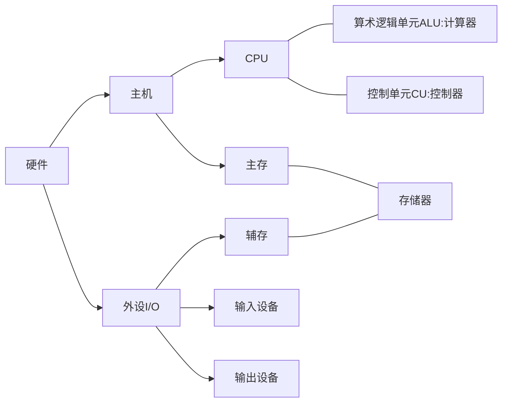

# 计算机组成原理 computer organization

[toc]

低电平0

高电平1

# 一、计算机系统概述

## 1.发展

第一台电子数字计算机：Eniac（1946）电子管

1947年，晶体管在贝尔实验室出现

CPU是大规模集成电路

| 发展 | 时间      | 逻辑元件                         | 速度（次/s） | 内存           | 外存                           |
| ---- | --------- | -------------------------------- | ------------ | -------------- | ------------------------------ |
| 1    | 1946-1957 | 电子管                           | 千 - 万      | 汞延迟线、磁鼓 | 穿孔卡片纸                     |
| 2    | 1958-1964 | 晶体管                           | 万 - 十万    | 磁芯存储器     | 磁带                           |
| 3    | 1964-1971 | 中小规模集成电路                 | 十万 - 百万  | 半导体存储器   | 磁带、磁盘                     |
| 4    | 1972-new  | 大规模集成电路、超大规模集成电路 | 千万 - 万亿  | 半导体存储器   | 磁带、磁盘、光盘、半导体存储器 |

---

### 1.1分类

电子计算机可分为**电子模拟计算机**和**电子数字计算机**。

数字计算机又可按用途分为**专用计算机**和**通用计算机**。

通用计算机又分为巨型机、大型机、中型机、小型机、微型机、单片机。


---

计算机按指令和数据流可分为：

1. 单指令流和单数据流系统（SISD），即传统冯诺依曼体系结构。
2. 单指令流和多数据流系统（SIMD），包括阵列处理器和向量处理器系统。
3. 多指令流和单数据流系统（MISD），这种计算机实际上不存在。
4. 多指令流和多数据流系统（MIMD），包括多处理器和多计算机系统。

计算机的**发展趋势**是“两级分化”：

1. **更微型、多途**：微型计算机向更微型化、网络化、高性能、多用途方向发展；
2. **更巨型、高速**：另一极是巨型机向更巨型化、超高速、并行处理、智能化方向发展。

---

摩尔定律：集成电路上可容纳的晶体管数目，每隔18个月便增加一倍（每三年翻两番）


## 2.层次结构


**硬件**系统和**软件**系统共同构成一个完整的计算机系统。

对某一功能来说，其既可以用软件实现，又可以用硬件实现，则称为软硬件在逻辑上是等效的。在计算机系统中，许多功能既能由硬件直接实现，又可在硬件的配合下由软件实现。（例如，乘法运算既可用专门的乘法器实现，也可由乘法程序实现）在设计计算机系统时，要进行软/硬件的功能分配。一个功能若使用较为频繁且用硬件实现的成本较为理想，则使用硬件解决可以提高效率。而用软件实现可以提高灵活性，但效率往往不如硬件实现高。

>e.g.：下列叙述中，正确的是（）
>  A.寄存器的设置对汇编语言是透明的
>  B.实际应用程序的测试结果能全面代表计算机的性能
>  C.系列机的基本特性是指令系统向后兼容
>  D.软件和硬件在逻辑上是等价的
>
>答案：C；向后兼容又称向下兼容（Backwards compatibility），指的是时间上向后兼容，即新机器兼容使用以前机器的指令系统，例如较高档的计算机可以运行较为低档计算机所开发的程序。对于B，全面代表计算机性能的是实际软件的运行情况。对于D，软件和硬件在逻辑上是等效的，但不是等价的。


### 2.1软件

软件是指在硬件上运行的程序和相关的数据及文档。


#### 2.1.1系统软件&应用软件

软件按功能可分为系统软件和应用软件。

- **系统软件**

**系统软件**又称为**系统程序**，是一组保证计算机系统高效、正确运行的基础软件，通常作为系统资源提供给用户使用。系统软件主要用来**管理整个计算机系统**，监视服务，使系统资源得到合理调度，高效运行。
系统软件主要有操作系统OS、数据库管理系统DBMS、语言处理程序（如汇编程序、编译程序）、分布式软件系统、网络软件系统、标准库程序、服务性程序（如诊断程序、调试程序、连接程序）等。

注意：数据库管理系统DBMS不同于数据库系统DBS。DBMS是位于用户和OS之间的一层数据管理软件，是系统软件；DBS是指计算机系统中引入数据库后的系统，一般由数据库、数据库管理系统、数据库管理员DBA和应用系统构成。

- **应用软件**

**应用软件**又称**应用程序**，是指用户为解决某个应用领域中的各类问题，**按任务需要编制而成的各种程序**，如各种科学计算类程序、工程设计类程序、数据统计与处理程序等。


### 2.2硬件

硬件是指有形的物理设备，是计算机系统中实际物理装置的总称。

冯·诺依曼提出**存储程序**。

第一台冯诺依曼结构计算机Edvac。

冯·诺依曼计算机特点：

1. 有**5**部分：**I/O设备（输入设备、输出设备）、存储器、运算器、控制器**。
2. **指令和数据以同等地位存储于存储器、可以按地址寻访**。
3. **指令和数据用二进制表示**。
4. **指令由操作码、地址码组成**。
5. **存储程序**：将指令以二进制代码的形式事先输入计算机的主存储器（内存）。
6. **以运算器为中心**（但是现代计算机是以**存储器为中心的**）。

---


不过现代计算机是以**存储器为中心的**，使I/O操作尽可能绕过CPU，直接在I/O设备和存储器之间完成，以提高系统的整体运行效率。

CPU = 运算器 + 控制器

硬盘属于辅存。


存储程序的概念是指将指令以代码形式事先输入计算机的主存储器，然后按其在存储器中的首地址执行程序的第一条指令，以后就按程序的规定顺序执行其他指令，直至程序执行结束。

CPU和主存之间通过一组**总线**相连，总线中有**地址、控制、数据**3组信号线。MAR中的地址信息会直接送到地址线上，用于指向读/写操作的主存存储单元；控制线中有读/写信号线，指出数据是从CPU写入主存还是从主存读出到CPU，根据是读操作还是写操作来控制将MDR中的数据是直接送到数据线上还是将数据线上的数据接收到MDR中。

>例题：冯诺依曼机的基本工作方式是：
>	A.控制流驱动方式  B.多指令多数据流方式
>	C.微程序控制方式  D.数据流驱动方式
>
>答案：A；冯·诺依曼机工作方式，可称为控制流(指令流)驱动方式。即按照指令的执行序列，依次读取指令，然后根据指令所含的控制信息，调用数据进行处理。B属于多处理机，冯诺依曼机是单指令流和单数据流系统；数据流驱动方式指：只有当一条或一组指令所需的操作数全部准备好时，才能激发相应指令的一次执行，执行结果又流向等待这一数据的下一条或一组指令，以驱动该条或该组指令的执行。因此，程序中各条指令的执行顺序仅仅是由指令间的数据依赖关系决定的。

> 例题：冯诺依曼计算机中指令和数据均以二进制形式存放在存储器中，CPU区分它们的依据是（）
>    	A.指令操作码的译码结果  B.指令和数据的寻址方式  
>    	C.指令周期的不同阶段 	 D.指令和数据所在的存储单元
>
> 答案：C；虽然指令和数据都以二进制存放在存储器中，但CPU可以根据指令周期的不同阶段来区分是指令还是数据，通常在取指阶段取出的是指令，在执行阶段取出的是数据。对于A，CPU只有在确定取出的是指令后，才会将其操作码送去译码，因此不可能依据译码的结果来区分指令和数据

> 例题：下列关于冯诺依曼结构计算机基本思想的叙述中，错误的是（）
>   A.程序的功能都通过中央处理器执行指令实现
>   B.指令和数据都用二进制数表示，形式上无差别
>   C.指令按地址访问，数据都在指令中直接给出
>   D.程序执行前，指令和数据需预先存放在存储器中
>
> 答案：C；程序的功能都通过中央处理器（运算器和控制器）执行指令实现。指令按地址访问，数据由指令的地址码指出，除立即寻址外，数据均存放在存储器内。


#### 2.2.1输入设备

输入设备的主要功能是将程序和数据以机器所能识别和接受的信息形式输入计算机。（常见的输入设备有键盘、鼠标、扫描仪、摄像机等）


#### 2.2.2输出设备

输出设备的任务是将计算机处理的结果以人们所能接受的形式或其他系统所要求的信息形式输出（常用的输出设备有显示器、打印机等）。计算机的I/O设备是计算机与外界联系的桥梁。


#### 2.2.3存储器

存储器是计算机的存储部件，用来存放程序和数据。

存储器分为**主存储器**（主存，内存储器，内存）和**辅助存储器**（辅存，外存储器，外存）。CPU能够直接访问的存储器是主存。辅存用于帮助主存记忆更多信息，辅存中的信息必须调入主存后，才能被CPU访问。

主存包括存储体M、各种逻辑部件及控制电路等。**存储体由许多存储单元组成**，每个存储单元包含若干**存储元件**（或称存储基元、存储元），每个存储元件**存储一位二进制代码 0 or 1**。因此存储单元可存储一串二进制代码，称这串代码为**存储字**，称这串代码的位数为存储字长，存储字长可以是1B或是字节的偶数倍。一个存储字既可代表数，也可代表一串字符，也可代表指令等。

- **存储体**

  - **存储单元**：存储单元可存储**一串二进制代码**，称这串代码为**存储字**，称这串代码的**位数为存储字长**。

    **存储字长**可以是1B或是字节的偶数倍。一个存储字既可代表数，也可代表一串字符，也可代表指令。

    - **存储元件**：每个存储元件**存储一位二进制代码 0 or 1**

> 如果把一个存储体看成一栋大楼，那么每个存储单元可看作大楼中的每个房间，每个存储元件可看作每个房间中的一张床位，床位有人相当于1，无人相当于0。床位数相当于存储字长。每个房间都需要一个房间编号，同样可以赋予每个存储单元一个编号，称为存储单元的地址号。


**主存**的工作方式为：**按存储单元的地址进行存取**，这种存取方式称为按地址存取方式，即**按地址访问存储器**（简称按地址寻访，访存）。

**关联存储器**（相联存储器），是一种不根据地址而是根据存储内容来进行存取的存储器，可以实现快速地查找块表。**相联存储器既可以按照地址寻址也可以按照内容寻址（通常是某些字段）**，为了与传统寄存器作区别，称为按内容寻址的存储器。


存储体存放二进制信息，

- **地址寄存器（MAR）存放访存地址**，经过地址译码后找到所选的存储单元。
- **数据寄存器（MDR）用于暂存要从存储器中读或写的信息**，时序控制逻辑用于产生存储器操作所需的各种时序信号。


- **MAR位数 = 存储单元的个数**，如MAR为**10位**，则有**2^10=1024=1K**个存储单元。MAR的长度 = PC的长度。
- **MDR的位数 = 存储字长**，一般为字节的二次幂的整数倍。

MAR和MDR虽然是存储器的一部分，但在现代CPU中，MAR、MDR现在也可能集成到CPU里面。

---

**位：比特bit，简写为b**。

**字节**：Byte，简写为B。1**B**yte = 8bit（1B = 8b）。

**存储字长**：每个**存储单元**中能够存储多少bit。如果每个存储单元可存放16bit，那么 1个字(word) = 16bit。


#### 2.2.4运算器

运算器是计算机的执行部件，用于进行算术运算和逻辑运算。算术运算是按算术运算规则进行的运算，如加、减、乘、除；逻辑运算包括与、或、非、异或、比较、移位等运算。

运算器的**核心是算术逻辑单元ALU**（Arithmetic and Logical Unit）运算器包含若干**通用寄存器**，用于暂存操作数和中间结果，如**累加器ACC**，**乘商寄存器MQ**，**操作数寄存器X**，**变址寄存器IX**，**基址寄存器BR**等，其中**ACC,MQ,X是必须有的**。


运算器内还有**程序状态寄存器PSW**，也称标志寄存器，用于存放ALU运算得到的一些标志信息或处理机的状态信息。


#### 2.2.5控制器

控制器是计算机的指挥中心，由其指挥各部件自动协调地进行工作。控制器由**程序计数器PC**、**指令寄存器IR**和**控制单元CU**组成。

- PC用于存放当前欲执行指令的地址，可自动+1以形成下一条指令的地址，与主存的MAR之间有一条直接通路。

- IR用来存放当前的指令，其内容来自主存的MDR。指令中的操作码OP（IR）送至**CU**，用以分析指令并发出各种微操作命令序列；地址码Ad(IR)送往MAR，用以取操作数。（操作码表示机器所执行的各种操作，地址码表示参加运算的数在存储器内的位置）


#### 2.2.6总线

CPU和主存之间通过一组**总线**相连，总线中有**地址、控制、数据**3组信号线。
MAR中的地址信息会直接送到**地址线**上，用于指向读/写操作的主存存储单元。

**控制线**中有读/写信号线，指出数据是从CPU写入主存还是从主存读出到CPU，根据是读操作还是写操作来控制将MDR中的数据是直接送到数据线上还是将数据线上的数据接收到MDR中。

总线判优控制的集中式方式有三种：**链式查询、计数器定时查询、独立请求方式**。


#### 2.2.7总结

一般将运算器和控制器集成到同一个芯片上，称为**中央处理器CPU**。CPU和主存共同构成主机，而除主机外的其他硬件装置（外存、I/O设备等）统称为外部设备，简称外设。现代计算机可以认为由CPU、I/O设备及存储器组成（或由主机和外部设备组成）




下图所示为冯诺依曼结构的模型机：


CPU包含ALU、通用寄存器组GPRs、标志寄存器、控制器、指令寄存器IR、程序计数器PC、存储器地址寄存器MAR和存储器数据寄存器MDR。

图中从控制器送出的虚线为控制信号，可控制如何修改PC以得到下一条指令的地址、ALU执行什么运算、主存是进行读操作还是写操作（读/写控制信号）。


> 例题：在运算器中，不包含（）
> 	A.状态寄存器  B.数据总线  C.ALU  D.地址寄存器
>
> 答案：D；地址寄存器位于CPU内，但并未集成到运算器与控制器中。运算器中包含PSW、CPU内部数据总线

> 例题：若一个8位的计算机系统以16位来表示地址，则该计算机系统有（）个地址空间
>
> 答案：2^16=65536；8位计算机表明计算机字长为8位，即一次可以处理8位的数据，而16位表示地址码的长度

> 例题:关于相联存储器，下列说法中正确的是（）
>   A.只可以按地址寻址
>   B.只可以按内容寻址
>   C.既可以按内容寻址又可按地址寻址
>   D.以上说法均不对
>
> 答案：C；相联存储器既可以按照地址寻址也可以按照内容寻址（通常是某些字段），为了与传统寄存器作区别，称为按内容寻址的存储器。

> 例题:设主存储器容量为64K x 32位，且指令字长、存储字长、机器字长三者相等。写出如下图所示各寄存器的位数，并指出哪些寄存器之间有信息通路
>
> 
>
> 答案：16位：MAR,PC；32位：MDR，IR,ACC,MQ,X；
>
> 寄存器之间的信息通路有：
> PC——>MAR,MDR——>IR,Ad（IR）——>MAR,MDR——>ACC（取数）
> ACC——>MDR（存数），MDR——>X（X为操作数寄存器）
>
> （各个子系统通过数据总线连接形成的数据传送路径称为数据通路。数据通路是对于子系统之间而言的，因此答案中没有ACC与MQ，ACC与X）


### ❗2.3工作过程

计算机的工作过程分为以下3个步骤：

1. 把程序和数据装入主存。
2. 将源程序转换成可执行文件。
3. 从可执行文件的首地址开始逐条执行指令。


#### 2.3.1从源程序到可执行文件

在计算机中编写的C语言程序，都必须被转换为一系列的低级机器指令，这些指令按照一种称为可执行目标文件的格式打好包，并以二进制磁盘文件的形式存放起来。

以UNIX中的GCC编译器程序为例，读取源程序文件hello.c，并把它翻译成一个可执行目标文件hello，整个翻译过程可分为4个阶段完成：


1. **预处理阶段**：预处理器cpp对源程序中以字符#开头的命令进行处理，例如将#include命令后面的.h文件内容插入程序文件。输出结果是一个以.i为扩展名的源文件hello.i
2. **编译阶段**：编译器ccl对预处理后的源程序进行编译，生成一个汇编语言源程序hello.s。汇编语言源程序中的每条语句都以一种文本格式描述了一条低级机器语言指令。
3. **汇编阶段**：汇编器as将hello.s翻译成机器语言指令，把这些指令打包成一个称为可重定位目标文件的hello.o，它是一种二进制文件
4. **链接阶段**：链接器Id将多个可重定位目标文件和标准库函数printf所在的可重定位目标模块printf.o合并，生成可执行文件hello。最终生成的可执行文件被保存在磁盘上。


#### 2.3.2指令执行过程的描述

以取数指令（将指令地址码指示的存储单元中的操作数取出后送ACC）为例，其信息流程如下：

1. 取指令：PC程序计数器——>MAR——>M——>MDR——>IR指令寄存器

2. 分析指令：OP（IR）——>CU控制单元

3. 执行指令：Ad（IR）——>MAR——>M——>MDR——>ACC累加器


- 此外，每取完一条指令，还须形成下一条指令的地址，即（PC）+1——>PC

Ad是address地址，取操作码。
OP是operation操作，取地址码。


注意：在（1）中，PC没加括号，表示的是PC中的值经过数据通路送到MAR，在表示数据通路时括号可省略（因为只是表示数据流经的途径，不强调数据本身的流动），但当题目中的括号未省时，最好不省，和题目中保持一致。在运算时括号不可省。

---

##### 过程演示

PC=0，执行第一条指令的被划分为9个**微指令**进行操作如下：


执行完毕之后，PC++后为1，再执行第二条指令。

当前PC=1，那么就执行第二条指令：


同理，之后PC再++，然后依次执行下面的指令，直到结束。


- **总结：**

M：主存中某存储单元。

ACC、MQ、X、MAR、MDR...：相应寄存器。

M(MAR)：取存储单元中的数据(ACC)...：取相应寄存器中的数据。

指令：

OP(IR)：取操作码

Ad(IR)：取地址码


- **一次指令的执行的标准流程：**

“取数”指令的执行:（从主存中指定地址处取数）

必经步骤：

1. (PC) -> MAR
2. M(MAR) -> MDR
3. (MDR) -> IR
4. 取指令结束(PC)+1 -> PC
5. OP(IR) -> CU
6. 分析指令结束

不同的指令具体步骤不同：

7. Ad(IR) -> MAR
8. M(MAR) -> MDR
9. (MDR) -> ACC
10. 执行指令结束

**根据指令周期的不同阶段，CPU区分指令和数据。**


##### 例题

> 问1.`ADD [1000H], Acc;`指令的运行过程。

ADD指令是用于将两个数相加的指令。这里的[1000H]是一个内存地址，表示要从内存地址1000H处取出一个数进行加法运算。

- 程序员角度运行过程如下：

将内存地址1000H中的数值取出，保存到一个临时寄存器中。将Accumulator寄存器中的数值取出，保存到另一个临时寄存器中。对两个临时寄存器中的数值进行相加，结果保存到Accumulator寄存器中。最后将Accumulator中的结果存回到内存地址1000H中。

示例代码，使用C语言来展示这个过程： 

```c
// 定义一个变量a，并赋值为内存地址1000H
int *a = (int *)0x1000;

// 定义一个变量b，并赋值为Accumulator寄存器的值
int b = Acc;

// 将内存地址1000H中的值取出，保存到临时变量c中
int c = *a;

// 将b和c相加，结果保存到Accumulator中
Acc = b + c;

// 将Accumulator中的结果存回到内存地址1000H中
*a = Acc;
```


- 物理层面：

1. 取指令：

   PC程序计数器——>MAR——>M——>MDR——>IR指令寄存器

   1. PC-->MAR。

   2. M(MAR)-->MDR，MDR = 该条指令。

   3. MDR-->IR，IR = 该条指令。

   4. PC++。

2. 分析指令：

   5. OP(IR)-->CU，将指令的**操作码**送到CU，CU分析这条指令。

3. 执行指令：

   Ad(IR)——>MAR——>M——>MDR——>X

   6. Ad(IR)-->MAR，将指令的**地址码**送到MAR。
   7. M(MAR)-->MDR。
   8. MDR-->X。
   9. CU-->ALU。
   10. ALU: ACC+X-->ACC。


> 问2.已知Acc=0010H；[1000H]=0020H（1000H地址中的内容为0020H）。该指令结束后，[1000H]中的值是多少？

指令执行过程如下：

1. 取指令：

   PC程序计数器——>MAR——>M——>MDR——>IR指令寄存器

   1. PC-->MAR。
   2. M(MAR)-->MDR，MDR = `ADD [1000H], Acc;`。
   3. MDR-->IR，IR = `ADD [1000H], Acc;`。
   4. PC++。

2. 分析指令：

   5. OP(IR)-->CU，将指令的**操作码**送到CU，CU分析这条指令。

3. 执行指令：

   Ad(IR)——>MAR——>M——>MDR——>X

   6. Ad(IR)-->MAR，将指令的**地址码**送到MAR，MAR=`[1000H]`。
   7. M(MAR)-->MDR，MDR=0020H。
   8. MDR-->X，X=0020H。
   9. CU-->ALU。
   10. ALU: ACC+X-->ACC，原本ACC=0010H，所以这里就是0010H + 0020H = 0030H。

所以，指令结束后，内存地址 1000H 中的值将是 0030H。


### 2.4计算机系统的多级层次结构

计算机系统的层次结构划分应用了一种处理系统复杂性的方法——**抽象**，这与计算机网络中的分层思想类似。

计算机系统的多级层次结构的作用，即根据从各种角度所看到的机器之间的有机联系，来分清彼此之间的界面，明确各自的功能。

#### 2.4.1五层结构

分层方式的一种（程序员角度的抽象）：


1. 第一级是**微程序机器层**，是一个实在的硬件层，由机器硬件直接执行微指令。机器M0是直接将机器M1中的每一条机器指令翻译成一组微指令，即构成一个微程序。机器M0每执行完对应于一条机器指令的一个微程序后，便由机器M1中的下一条机器指令使机器M0自动进入与其相对应的另一个微程序的执行。微程序机器M0可看作是对实际机器M1的分解，即用M0的微程序解释并执行M1的每一条机器指令。
2. 第二级是**传统机器语言层**，也是一个实际的机器层，由微程序解释机器指令系统。
3. 第三级是**操作系统层**，由操作系统程序实现。操作系统程序是由机器指令和广义指令组成的，这些广义指令是为了扩展机器功能而设置的，是由操作系统定义和解释的软件指令，所以这一层也称混合层。
4. 第四级是**汇编语言层**，它为用户提供一种符号化的语言，借此可编写汇编语言源程序。这一层由汇编程序支持和执行。
5. 第五级是**高级语言层**，是面向用户的，由各种高级语言编译程序支持和执行。

在高级语言层之上，还可以有应用层，它由解决实际问题和应用问题的处理程序组成，如文字处理软件、数据库软件等。

通常把没有配备软件的纯硬件系统称为裸机，第3~5层称为虚拟机，简单来说就是软件实现的机器。虚拟机只对该层的观察者存在。


#### 2.4.2三个级别的语言与四种程序

三个级别的语言：

计算机语言的发展：机器语言、汇编语言（面向机器）->高级语言（面向问题）

1. **机器语言**：又称二进制代码语言，是计算机唯一可以直接识别和执行的语言
2. **汇编语言**：使用汇编语言编辑的程序，必须经过一个称为汇编程序的系统软件的翻译，将其转换为计算机的机器语言后，才能在计算机的硬件系统上运行。汇编语言没有通用性，每台机器必须有一种与之相对应的汇编语言。
3. **高级语言**：通常高级语言需要经过编译程序编译成汇编语言程序，然后经过汇编操作得到机器语言程序，或直接由高级语言程序翻译成机器语言程序。

四种程序：

1. **翻译程序**：指把高级语言源程序翻译成机器语言程序（目标代码）的软件。
   翻译程序有两种：**编译程序**与**解释程序**。
2. **编译程序**：将高级语言源程序**一次全部翻译**成目标程序，每次执行程序时，**只需执行目标程序**。
   **因此只要源程序不变，则无须重新翻译。**
   同一种高级语言在不同体系结构下，编译成的目标程序是不一样的，目标程序与体系结构相关，但仍不是计算机硬件能直接执行的程序。
3. **解释程序**：将源程序的**一条语句翻译**成对应的机器目标代码，并**立即执行**，然后翻译下一条源程序语句并执行，直至所有源程序语句全部被翻译并执行完。
   所以解释程序的执行过程是翻译一句执行一句，并且不会生成目标程序。
4. **汇编程序**：把汇编语言源程序翻译成机器语言程序。


---

机器语言和汇编语言与机器指令对应，而高级语言不与指令直接对应，具有较好的可移植性。

---

编译程序与汇编程序的区别：

- **编译程序**：翻译的源语言是高级语言，目标语言是诸如汇编语言或机器语言之类的“低级语言”。
- **汇编程序**：翻译的源语言是汇编语言，目标语言是机器语言。


>例题:只有当程序执行时才将源程序翻译成机器语言，并且一次只能翻译一行语句，边翻译边执行的是（ ）程序，把汇编语言源程序转变为机器语言程序的过程是（ ）
>	1.编译  2.目标  3.汇编  4.解释
>
>答案：4,3

>例题:关于编译程序和解释程序，下列说法中错误的是（）
>  A.编译程序和解释程序的作用都是将高级语言程序转换成机器语言程序
>  B.编译程序编译时间较长，运行速度较快
>  C.解释程序方法较简单，运行速度也较快
>  D.解释程序将源程序翻译成机器语言，并且翻译一条以后，立即执行这条语句
>
>答案：C；由于解释程序要边翻译边执行，因此一般速度较编译程序慢。

>例题:计算机硬件能够直接执行的是（）
>  1.机器语言程序   2.汇编语言程序   3.硬件描述语言程序
>  A.1   B.1,2   C.1,3   D.1,2,3
>
>答案：A；硬件能直接执行的只能是机器语言（二进制编码），汇编语言经过汇编后才能被执行；硬件描述语言是电子系统硬件行为描述、结构描述、数据流描述的语言，是对电路系统的结构、行为的标准文本描述。


### 2.5计算机体系结构 vs 计算机组成原理

- 计算机体系结构：机器语言程序员所见到的计算机系统的属性概念性的结构与功能特性。（指令系统、数据类型、寻址技术、1/0机理）

探讨的是计算机的**指令系统**要如何设计，确定这个指令有没有。
比如**有无乘法指令**，没有乘法指令，那么程序员想要实现乘法就需要用加法指令来实现乘法。

探讨的是**如何设计硬件与软件之间的接口**。


- 计算机组成原理：实现计算机体系结构所体现的属性，对程序员“**透明**”。（具体指令的实现）

探讨的是如何实现某一个指令。
比如确定有乘法指令，那么要**如何实现乘法指令**。

探讨的是**如何用硬件实现所定义的接口**。


#### 2.5.1透明

在计算机领域中，站在某类用户的角度，若感觉不到某个事物或属性的存在，即**看不到某个事物或属性**，则称为“对该用户而言，某个事物或属性是**透明的**”。

例如，对于高级语言程序员来说，浮点数格式、乘法指令等指令的格式、数据如何在运算器中运算等都是透明的；而对于机器语言或汇编语言程序员来说，指令的格式、机器结构、数据格式等则是不透明的。

在CPU中，IR、MAR、MDR对各类程序员都是透明的。


## ❗3.性能指标

### 3.1存储器性能

#### 3.1.1存储单位

- **计算机的最小存储单位**

**位：比特bit**，简写为**b**。

存放一位二进制数，即 0 或 1，最小的存储单位。

- **计算机存储容量基本单位是字节**

**字节：Byte**，简写为**B**。1**B**yte = 8bit（1B = 8b）。

最常用的单位。 (我也常说一个字节占8位)

一个英文字母（不分大小写）占一个字节的空间，一个中文汉字占两个字节的空间。英文标点占一个字节，中文标点占两个字节。
例如：英文句号`.`占1个字节的大小，中文句号`。`占2个字节大小。

---

1MB/s = 8Mbps = 8Mbit/s 即兆比特每秒（Million bits per second的缩写）。

bps（bits per second），即比特率、比特/秒、位/秒、每秒传送位数，数据传输速率的常用单位。

---

- **换算关系**

1. 1B(Byte 字节)=8bit，
2. 1KB (Kilobyte 千字节)=1024B，其中1024=2^{10} ( 2 的10次方)，
3. 1MB (Megabyte 兆字节 简称“兆”)=1024KB = 2^{20}B，
4. 1GB (Gigabyte 吉字节 又称“千兆”)=1024MB，
5. 1TB (Trillionbyte 万亿字节 太字节)=1024GB，
6. 1PB（Petabyte 千万亿字节 拍字节）=1024TB，
7. 1EB（Exabyte 百亿亿字节 艾字节）=1024PB，
8. 1ZB (Zettabyte 十万亿亿字节 泽字节)= 1024 EB,
9. 1YB (Yottabyte 一亿亿亿字节 尧字节)= 1024 ZB,
10. 1BB (Brontobyte 一千亿亿亿字节)= 1024 YB.

注：“兆”为百万级数量单位。
　　 附：进制单位全称及译音
　　 yotta, [尧]它, Y. 10^21,
　　 zetta, [泽]它, Z. 10^18,
　　 exa, [艾]可萨, E. 10^15,
　　 peta, [拍]它, P. 10^12,
　　 tera, [太]拉, T. 10^9,
　　 giga, [级]咖, G. 10^6,
　　 mega, [兆]，M. 10^3


- **2的幂次方**

| 1    | 2    | 3    | 4    | 5    | 6    | 7    | 8    | 9    | 10   | 11   |
| ---- | ---- | ---- | ---- | ---- | ---- | ---- | ---- | ---- | ---- | ---- |
| 2    | 4    | 8    | 16   | 32   | 64   | 128  | 256  | 512  | 1024 | 2048 |


- **为什么计算机储存单位的进率是1024而不是1000？**

因为目前计算机都是二进制的，让它们计算单位，只有2的整数幂时才能非常方便计算机计算，因为电脑内部的电路工作有高电平和低电平两种状态.所以就用二进制来表示信号，(控制信号和数据)，以便计算机识别。而人习惯于使用10进制，所以存储器厂商们才用1000作进率。这样导致的后果就是实际容量要比标称容量少，不过这是合法的。1024是2的10次方，因为如果取大了，不接近10的整数次方，不方便人们计算；取小了，进率太低，单位要更多才能满足需求。所以取2的10次方正好。


#### 3.1.2存储器指标

- **MAR位数 = 存储单元的个数**，如MAR为**10位**，则有**2^10=1024=1K**个存储单元。
- **MDR的位数 = 存储字长 = 每个存储单元的大小**，一般为字节的二次幂的整数倍。

**存储字长**：每个**存储单元**中能够存储多少bit。如果每个存储单元可存放16bit，那么 1个字(word) = 16bit。

总容量 = 存储单元个数 × 存储字长（bit）

总容量 = 存储单元个数 × 存储字长/8（Byte）

> Eg: MAR为32位，MDR为8位。
>
> 总容量 = 2^{32}*8 bit = 4096MB = 4GB


### 3.2CPU性能

**CPU时钟周期**：通常为节拍脉冲或T周期，它是**CPU中最小的时间单位**，每个动作至少需要1个时钟周期。

**主频**（CPU时钟频率）：CPU内数字脉冲信号震荡的频率。机器内部主时钟的频率。
是衡量机器速度的重要参数。对于同一个型号的计算机，其**主频越高，完成指令的一个执行步骤所用的时间最短**，执行指令的速度越快。
主频通常以Hz为单位，1Hz即每s一次。
$$
CPU时钟周期(s)=\frac{1}{主频(CPU时钟频率Hz)}
$$
主频高的CPU不一定比主频低的CPU快，衡量CPU运算速度的指标有很多，不能以单独的某个指标判断CPU的好坏。CPU的运算速度还要看CPU的流水线的各方面的性能指标（架构、缓存、指令集、CPU的位数、Cache的大小等）。


**CPI（Clock cycle Per Instruction）**：执行一条指令需要的时钟周期数。

不同的指令，CPI不同。甚至相同的指令，CPI也可能有变化。因为系统结构、指令集、计算机组织都会影响CPI。
$$
执行一条指令耗时 = CPI * CPU时钟周期。
$$
**CPU执行时间**：指运行一个程序所花费的时间。
$$
\begin{equation}\begin{split} 
CPU执行时间&=\frac{CPU时钟周期}{主频}\\ 
&= \frac{指令条数 * CPI}{主频}\\ 
\end{split}\end{equation}
$$

上式表明，CPU的性能（CPU的执行时间）取决于：主频、CPI、指令条数。

主频、CPI和指令条数是相互制约的。例如：更改指令集可减少程序所含指令的条数，但同时可能引起CPU结构的调整，从而可能会增加时钟周期的宽度（降低主频）。


> Eg:某CPU主频为1000Hz,某程序包含100条指令,平均来看指令的CPI=3该程序在该CPU上执行需要多久？
> $$
> 耗时 = 100 * 3 *\frac1{1000} = 0.3s
> $$


**IPS（Instructions Per Second）**：每秒执行指令条数。
$$
CPU主频(时钟频率Hz)=CPI*IPS
$$
**FLOPS（Floating-point Operations Per Second）**：每秒执行多少次浮点运算。

这里的单位现在经常在之前加上K、M，如KIPS，KFLOPS。要注意，这里的K、M是数量单位，是10的幂次。

​	K = Kilo千 = 10^3

​	M = million百万 = 10^6

​	G = giga十亿 = 10^9

​	T = Tera万亿 = 10^12

> eg:2MIPS：该计算机每秒执行2百万条指令。


>例题:CPU的CPI与下列（）因素无关
>  A.时钟频率   B.系统结构   C.指令集   D.计算机组织
>
>答案：A； 系统结构、指令集、计算机组织都会影响CPI，时钟频率并不会影响CPI（只是决定每个CLOCK的时间），可影响指令的执行速度

> 例题:下列说法中，正确的是（）
>   1.在微型计算机的广泛应用中，会计电算化属于科学计算方面的应用
>   2.决定计算机计算精度的主要技术是计算机的字长
>   3.计算机“运算速度”指标的含义是每秒能执行多少条操作系统的命令
>   4.利用大规模集成电路技术把计算机的运算部件和控制部件做在一块集成电路芯片上，这样的一块芯片称为单片机
>   A.1,3   B.2,4   C.2   D.1,3,4
>
> 答案：C；计算机“运算速度”指标的含义是每秒能执行多少条指令；4中集成的芯片称为CPU

> 例题:假定基准程序A在某计算机上的运行时间为100s，其中90s为CPU时间，其余为I/O时间。若CPU速度提高50%，I/O速度不变，则运行基准程序A所耗费的时间为（）
>
> ​		A.55s   B.60s   C.65s   D.70s
> 答案：D;CPU速度提高50%，CPU速度是原来的1.5倍而不是2倍，90/1.5+10

> 例题:假定计算机M1和M2具有相同的指令集体系结构（ISA），主频分别为1.5GHz和1.2GHz。在M1和M2上运行某基准程序P，平均CPI分别为2和1，则程序P在M1和M2上运行时间的比值为（）
>
> 答案：1.6

> 例题:某台计算机只有Load/Store指令能对存储器进行读/写操作，其他指令只对寄存器进行操作。根据程序跟踪实验结果，已知每种指令所占的比例及CPI数如下
>
> 
>
> 求上述情况下的平均CPI。假设程序由M条指令组成。算逻运算中25%的指令的两个操作数中的一个已在寄存器中，另一个必须在算逻指令执行前用Load指令从存储器中取到寄存器中。因此有人建议增加另一种算逻指令，其特点是一个操作数取自寄存器，另一个操作数取自存储器，即寄存器——存储器类型，假设这种指令的CPI等于2。同时，转移指令的CPI变为3。求新指令系统的平均CPI。
>
> 答案：CPI=0.43 * 1+0.21 * 2+0.12 * 2+0.24 * 2=1.57
> 增加新算逻指令后，原来的LOAD指令数减少，因此总指令数减少。设原指令总数为M，新指令总数为M-0.25*0.43M=0.8925M，计算得新的CPI为1.9076


### 3.3整体性能

#### 3.3.1机器字长

**机器字长**是指计算机进行一次整数运算（即定点整数运算）所能处理的二进制数据的位数（一次能处理数据的位数）。机器字长一般等于内部寄存器的大小，字长越长，数的表示范围越大，计算精度越高。计算机字长通常为字节的整数倍。

---

机器字长、指令字长、存储字长的区别与联系：

- 机器字长：计算机能直接处理的二进制的位数，机器字长一般等于内部寄存器的大小，它决定了计算机的运算精度
- 指令字长：一个指令字中包含的二进制代码的位数
- 存储字长：一个存储单元存储的二进制代码的长度

它们都必须是字节的整数倍。指令字长一般取存储字长的整数倍，若指令字长等于存储字长的2倍，则需要2次访存来取出一条指令，因此取指周期为机器周期的2倍（机器周期是CPU操作的最基本单位）；若指令字长等于存储字长，则取指周期等于机器周期。

---

**数据通路带宽**：数据总线一次并行传送信息的二进制位数（bit）。这里所说的数据通路宽度是指外部数据总线的宽度，它与CPU内部的数据总线宽度（内部寄存器的大小）有可能不同。

**数据通路**：各个子系统通过数据总线连接形成的数据传送路径称为数据通路。

**吞吐量**：系统单位时间处理的请求数量。
它取决于信息能多快地输入内存，CPU能多快地取指令，数据能多快地从内存取出或存入，以及所得结果能多快地从内存送给一台外部设备。这些步骤中的每一步都关系到主存，因此，系统吞吐量主要取决于主存的存取周期。

**响应时间**：用户向计算机发送请求，到系统做出响应的时间。
通常包括CPU时间(运行一个程序所花费的时间)与等待时间(用于磁盘访问、存储器访问、/O操作、操作系统开销等时间)。


**基准程序**（跑分软件）：用来测量计算机处理速度的一种实用程序，以便于被测量的计算机性能可以与运行相同程序的其它计算机性能进行比较。

**系列机**：具有基本相同的体系结构，使用相同基本指令系统的多个不同型号的计算机组成的一个产品系列。

**兼容**：指计算机软件或硬件的通用性，即使用或运行在某个型号的计算机系统上的硬件/软件也能应用于另一个型号的计算机系统时，称这两台计算机在硬件或软件上具有兼容性。

**软件可移植性**：指把使用在某个系列计算机中的软件直接或进行很少的修改就能运行在另一个系列计算机中的可能性。

**固件**：将程序固定在ROM中组成的部件称为固件。固件是一种具有软件特性的硬件，是软/硬件结合的产物。例如，目前OS已实现了部分固化（把软件永恒地存储于只读存储器中）。

> 问:主频高的CPU一定比主频低的CPU快吗?
>
> 不一定，如两个CPU，A的主频为2GHz，平均CPI=10；B的主频1GHz，平均CPI=1，
>
> 执行一条指令的耗时 = 主频*CPI，那么A就是1/2\*10=5s，B是1/1\*1=1s。显然B快。

> 问:若A、B两个CPU的平均CPI相同，那么A一定更快吗?
>
> 不一定，还要看指令系统，如A不支持乘法指令，只能用多次加法实现乘法；而B支持乘法指令。


# 参考

[1.0_你好，我是计算机组成原理_哔哩哔哩_bilibili](https://www.bilibili.com/video/BV1ps4y1d73V?p=2)
