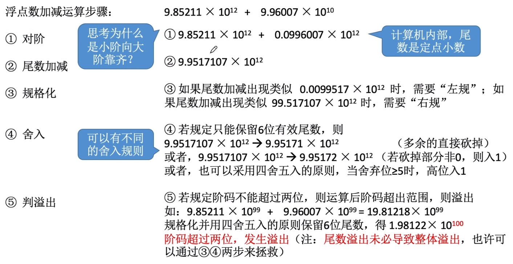
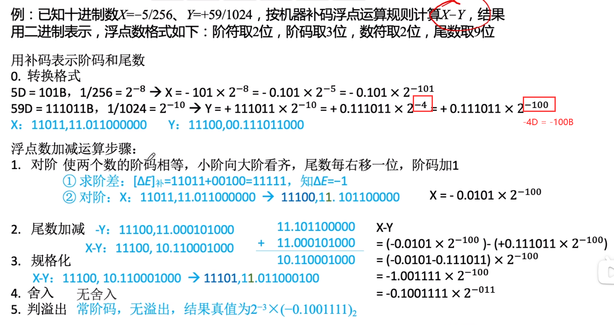
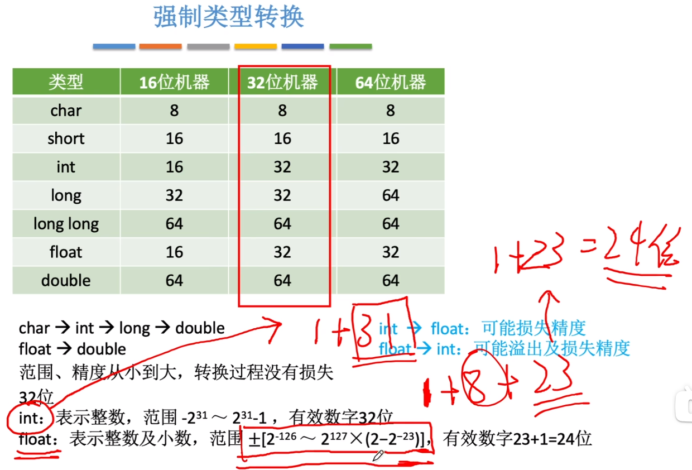

# 二、数据的表示和运算

[toc]

二进制**B**in
十进制**D**ec
八进制**O**ct
十六进制**H**ex（C语言中用`0x`表示）

## 1.数值与编码

#### ==【考点】二进制对照==

| 2^5^ | 2^4^ | 2^3^ | 2^2^ | 2^1^ | 2^0^ | 2^-1^      | 2^-2^      | 2^-3^      | 2^-4^         | 2^-5^         |
| ---- | ---- | ---- | ---- | ---- | ---- | ---------- | ---------- | ---------- | ------------- | ------------- |
| 32   | 16   | 8    | 4    | 2    | 1    | $\cfrac12$ | $\cfrac14$ | $\cfrac18$ | $\cfrac1{16}$ | $\cfrac1{32}$ |


### 1.1数据存储和排列

在计算机系统内部，所有的信息都是用二进制进行编码的，这样做的原因有：

1. 二进制只有两种状态，使用有两个稳定状态的物理器件就可以表示二进制数的每一位，制造成本较低。
2. 二进制位1和0正好与逻辑值真和假对应，为计算机实现逻辑运算和程序中的逻辑判断提供了便利条件。
3. 二进制的编码和运算规则都很简单，通过逻辑门电路能方便地实现算术运算。

字符串存储时有大、小端之分


边界对齐


- **进位计数法**：

在进位计数法中，每个数位所用到的不同数码的个数称为基数，如10进制的基数为10。每个数码所表示的数值等于该数码本身乘以一个与它所在数位有关的常数，这个常数称为位权。一个进位数的数值大小就是它的各位数码按权相加。

- **码的权值：**

有权码：例如BCD8421码、BCD2421码，每一位都有固定的权值
无权码：例如余三码，每一位的权值并不确定

> eg.二进制的基数是`2`，计数符号是`1`和`0`，位权是`2^n`。


下面为十进制和二进制之间相互转换的简易方法：

### ❗1.2十进制转换

十进制转换中整数部分和小数部分分开进行转换。

#### 1.2.1整数

- 下图演示了将十进制数字 36926 转换成八进制的过程：


从图中得知，十进制数字 36926 转换成八进制的结果为 110076。

- 下图演示了将十进制数字 42 转换成二进制的过程：


从图中得知，十进制数字 42 转换成二进制的结果为 101010。

#### 1.2.2小数

- 下图演示了将十进制小数 0.930908203125 转换成八进制小数的过程：


从图中得知，十进制小数 0.930908203125 转换成八进制小数的结果为 0.7345。

- 下图演示了将十进制小数 0.6875 转换成二进制小数的过程：


从图中得知，十进制小数 0.6875 转换成二进制小数的结果为 0.1011。


### 1.3二进制转换

#### 1.3.1 B->O

二进制整数转换为八进制整数时，每三位二进制数字转换为一位八进制数字，运算的顺序是从低位向高位依次进行，高位不足三位用零补齐。下图演示了如何将二进制整数 1110111100 转换为八进制：


#### 1.3.2 B->H

二进制整数转换为十六进制整数时，每四位二进制数字转换为一位十六进制数字，运算的顺序是从低位向高位依次进行，高位不足四位用零补齐。下图演示了如何将二进制整数 10 1101 0101 1100 转换为十六进制：


### 1.4真值&机器数

+15，-8这种带+或-符号的数称为**真值**，真值是**机器数**所代表的实际值。

在计算机中，通常采用数的符号与数值一起编码的方法来表示数据，常用的有**原码、补码、反码**表示法。这几种表示法都将数据的符号数字化，通常**用0表示正，用1表示负**。

==【注意】考试中，**机器数**一般都是**补码**。（**机器数 = 补码**）==

如0,101（逗号“，”并不实际存在，只是用来区分符号位与数值位，约定整数的数值位与符号位之间用逗号隔开，小数的符号位与数值位之间用小数点隔开）表示+5。这种把符号数字化的数称为机器数。


### 1.5 BCD码

binary-coded decimal，用二进制编码的十进制

- **8421**

用4bit表示1个十进制0\~9（0000\~1001）

冗余6位，比如5+8=13（1101）这种超出9（1001）的数，**再加6**（0110）进行修正，得到**0001 0011表示13**

- **2421**

0~4的第一位都是0
5~9的第一位都是1

原因：5（0101）（1011）两种都可表示，会出现歧义，所以只使用后者

- **余三码**

是一种无权码。在8421码的基础上加上3，即0（0011），1（0100）


### 1.6 ASCII码

ASCII（American Standard Code for Information Interchange，美国信息互换标准代码）是一套基于拉丁字母的字符编码，共收录了 128 个字符，用一个字节就可以存储，它等同于国际标准 ISO/IEC 646。

2^7=128。用7bit就可以表示完全，不过**1B（字节）**=8bit，所以还要在高位补0。最早是7位，后来扩充为8位，在7位时期，为满足被8整除条件，需加1位空位才能使用


**0~9的ASCII码值为48（011 0000）~57（011 1001），即去掉高3位，只保留低4位，正好是二进制形式的0~9。**


a-z（97-122）A-Z（65-90）

a-A = 32，而32是空格。


其中0-31和127是控制字符，其他的才是可显示字符

| 二进制   | 十进制 | 十六进制 | 字符/缩写                                    | 解释                               |
| -------- | ------ | -------- | -------------------------------------------- | ---------------------------------- |
| 00000000 | 0      | 00       | NUL (NULL)                                   | 空字符                             |
| 00000001 | 1      | 01       | SOH (Start Of Headling)                      | 标题开始                           |
| 00000010 | 2      | 02       | STX (Start Of Text)                          | 正文开始                           |
| 00000011 | 3      | 03       | ETX (End Of Text)                            | 正文结束                           |
| 00000100 | 4      | 04       | EOT (End Of Transmission)                    | 传输结束                           |
| 00000101 | 5      | 05       | ENQ (Enquiry)                                | 请求                               |
| 00000110 | 6      | 06       | ACK (Acknowledge)                            | 回应/响应/收到通知                 |
| 00000111 | 7      | 07       | BEL (Bell)                                   | 响铃                               |
| 00001000 | 8      | 08       | BS (Backspace)                               | 退格                               |
| 00001001 | 9      | 09       | HT (Horizontal Tab)                          | 水平制表符                         |
| 00001010 | 10     | 0A       | LF/NL(Line Feed/New Line)                    | 换行键                             |
| 00001011 | 11     | 0B       | VT (Vertical Tab)                            | 垂直制表符                         |
| 00001100 | 12     | 0C       | FF/NP (Form Feed/New Page)                   | 换页键                             |
| 00001101 | 13     | 0D       | CR (Carriage Return)                         | 回车键                             |
| 00001110 | 14     | 0E       | SO (Shift Out)                               | 不用切换                           |
| 00001111 | 15     | 0F       | SI (Shift In)                                | 启用切换                           |
| 00010000 | 16     | 10       | DLE (Data Link Escape)                       | 数据链路转义                       |
| 00010001 | 17     | 11       | DC1/XON (Device Control 1/Transmission On)   | 设备控制1/传输开始                 |
| 00010010 | 18     | 12       | DC2 (Device Control 2)                       | 设备控制2                          |
| 00010011 | 19     | 13       | DC3/XOFF (Device Control 3/Transmission Off) | 设备控制3/传输中断                 |
| 00010100 | 20     | 14       | DC4 (Device Control 4)                       | 设备控制4                          |
| 00010101 | 21     | 15       | NAK (Negative Acknowledge)                   | 无响应/非正常响应/拒绝接收         |
| 00010110 | 22     | 16       | SYN (Synchronous Idle)                       | 同步空闲                           |
| 00010111 | 23     | 17       | ETB (End of Transmission Block)              | 传输块结束/块传输终止              |
| 00011000 | 24     | 18       | CAN (Cancel)                                 | 取消                               |
| 00011001 | 25     | 19       | EM (End of Medium)                           | 已到介质末端/介质存储已满/介质中断 |
| 00011010 | 26     | 1A       | SUB (Substitute)                             | 替补/替换                          |
| 00011011 | 27     | 1B       | ESC (Escape)                                 | 逃离/取消                          |
| 00011100 | 28     | 1C       | FS (File Separator)                          | 文件分割符                         |
| 00011101 | 29     | 1D       | GS (Group Separator)                         | 组分隔符/分组符                    |
| 00011110 | 30     | 1E       | RS (Record Separator)                        | 记录分离符                         |
| 00011111 | 31     | 1F       | US (Unit Separator)                          | 单元分隔符                         |
| 00100000 | **32** | 20       | (Space)                                      | 空格                               |
| 00100001 | 33     | 21       | !                                            |                                    |
| 00100010 | 34     | 22       | "                                            |                                    |
| 00100011 | 35     | 23       | #                                            |                                    |
| 00100100 | 36     | 24       | $                                            |                                    |
| 00100101 | 37     | 25       | %                                            |                                    |
| 00100110 | 38     | 26       | &                                            |                                    |
| 00100111 | 39     | 27       | '                                            |                                    |
| 00101000 | 40     | 28       | (                                            |                                    |
| 00101001 | 41     | 29       | )                                            |                                    |
| 00101010 | 42     | 2A       | *                                            |                                    |
| 00101011 | 43     | 2B       | +                                            |                                    |
| 00101100 | 44     | 2C       | ,                                            |                                    |
| 00101101 | 45     | 2D       | -                                            |                                    |
| 00101110 | 46     | 2E       | .                                            |                                    |
| 00101111 | 47     | 2F       | /                                            |                                    |
| 00110000 | **48** | 30       | 0                                            |                                    |
| 00110001 | **49** | 31       | **1**                                        |                                    |
| 00110010 | 50     | 32       | 2                                            |                                    |
| 00110011 | 51     | 33       | 3                                            |                                    |
| 00110100 | 52     | 34       | 4                                            |                                    |
| 00110101 | 53     | 35       | 5                                            |                                    |
| 00110110 | 54     | 36       | 6                                            |                                    |
| 00110111 | 55     | 37       | 7                                            |                                    |
| 00111000 | 56     | 38       | 8                                            |                                    |
| 00111001 | 57     | 39       | 9                                            |                                    |
| 00111010 | 58     | 3A       | :                                            |                                    |
| 00111011 | 59     | 3B       | ;                                            |                                    |
| 00111100 | 60     | 3C       | <                                            |                                    |
| 00111101 | 61     | 3D       | =                                            |                                    |
| 00111110 | 62     | 3E       | >                                            |                                    |
| 00111111 | 63     | 3F       | ?                                            |                                    |
| 01000000 | 64     | 40       | @                                            |                                    |
| 01000001 | **65** | 41       | **A**                                        |                                    |
| 01000010 | 66     | 42       | B                                            |                                    |
| 01000011 | 67     | 43       | C                                            |                                    |
| 01000100 | 68     | 44       | D                                            |                                    |
| 01000101 | 69     | 45       | E                                            |                                    |
| 01000110 | 70     | 46       | F                                            |                                    |
| 01000111 | 71     | 47       | G                                            |                                    |
| 01001000 | 72     | 48       | H                                            |                                    |
| 01001001 | 73     | 49       | I                                            |                                    |
| 01001010 | 74     | 4A       | J                                            |                                    |
| 01001011 | 75     | 4B       | K                                            |                                    |
| 01001100 | 76     | 4C       | L                                            |                                    |
| 01001101 | 77     | 4D       | M                                            |                                    |
| 01001110 | 78     | 4E       | N                                            |                                    |
| 01001111 | 79     | 4F       | O                                            |                                    |
| 01010000 | 80     | 50       | P                                            |                                    |
| 01010001 | 81     | 51       | Q                                            |                                    |
| 01010010 | 82     | 52       | R                                            |                                    |
| 01010011 | 83     | 53       | S                                            |                                    |
| 01010100 | 84     | 54       | T                                            |                                    |
| 01010101 | 85     | 55       | U                                            |                                    |
| 01010110 | 86     | 56       | V                                            |                                    |
| 01010111 | 87     | 57       | W                                            |                                    |
| 01011000 | 88     | 58       | X                                            |                                    |
| 01011001 | 89     | 59       | Y                                            |                                    |
| 01011010 | 90     | 5A       | Z                                            |                                    |
| 01011011 | 91     | 5B       | [                                            |                                    |
| 01011100 | 92     | 5C       | \                                            |                                    |
| 01011101 | 93     | 5D       | ]                                            |                                    |
| 01011110 | 94     | 5E       | ^                                            |                                    |
| 01011111 | 95     | 5F       | _                                            |                                    |
| 01100000 | 96     | 60       | `                                            |                                    |
| 01100001 | **97** | 61       | **a**                                        |                                    |
| 01100010 | 98     | 62       | b                                            |                                    |
| 01100011 | 99     | 63       | c                                            |                                    |
| 01100100 | 100    | 64       | d                                            |                                    |
| 01100101 | 101    | 65       | e                                            |                                    |
| 01100110 | 102    | 66       | f                                            |                                    |
| 01100111 | 103    | 67       | g                                            |                                    |
| 01101000 | 104    | 68       | h                                            |                                    |
| 01101001 | 105    | 69       | i                                            |                                    |
| 01101010 | 106    | 6A       | j                                            |                                    |
| 01101011 | 107    | 6B       | k                                            |                                    |
| 01101100 | 108    | 6C       | l                                            |                                    |
| 01101101 | 109    | 6D       | m                                            |                                    |
| 01101110 | 110    | 6E       | n                                            |                                    |
| 01101111 | 111    | 6F       | o                                            |                                    |
| 01110000 | 112    | 70       | p                                            |                                    |
| 01110001 | 113    | 71       | q                                            |                                    |
| 01110010 | 114    | 72       | r                                            |                                    |
| 01110011 | 115    | 73       | s                                            |                                    |
| 01110100 | 116    | 74       | t                                            |                                    |
| 01110101 | 117    | 75       | u                                            |                                    |
| 01110110 | 118    | 76       | v                                            |                                    |
| 01110111 | 119    | 77       | w                                            |                                    |
| 01111000 | 120    | 78       | x                                            |                                    |
| 01111001 | 121    | 79       | y                                            |                                    |
| 01111010 | 122    | 7A       | z                                            |                                    |
| 01111011 | 123    | 7B       | {                                            |                                    |
| 01111100 | 124    | 7C       | \|                                           |                                    |
| 01111101 | 125    | 7D       | }                                            |                                    |
| 01111110 | 126    | 7E       | ~                                            |                                    |
| 01111111 | 127    | 7F       | DEL (Delete)                                 | 删除                               |

### 1.7汉字与GBK

汉字的表示和编码

汉字的编码包括汉字的**输入编码、汉字内码、汉字字形码**三种，它们是计算机中用于输入、内部处理和输出三种用途的编码。区位码用**2字节(Byte)表示一个汉字**，每字节用七位码。**区位码是4位十进制数**，前2位是区码，后2位是位码，所以称为区位码。

> 如汉字“学”的区位码为4907（十进制），用2个字节的二进制可以表示为00110001 00000111。

**国标码**将10进制的区位码转换为16进制数后，再在每字节上加上20H。国标码两字节的最高位都是0，ASCII码的最高位也为0。为了便于区分中文和英文字符，将国标码两字节的最高位都改为1，这就是汉字内码

区位码和国标码都是输入码，它们与汉字内码的关系（16进制）为：

国标码=（区位码）16+2020H  汉字内码=（国标码）16+8080H


最早制定的汉字编码是**GB2312**，包括6763个汉字和682个其它符号 95年重新修订了编码，命名GBK1.0，共收录了21886个符号。 之后又推出了GBK18030编码，共收录了27484个汉字，同时还收录了藏文、蒙文、维吾尔文等主要的少数民族文字，现在windows平台必需要支持GBK18030编码。

区内码->国标码->汉字机内码

### 1.8 UTF

(也就是unicode编码)：俗称万国码，致力于使用统一的编码准则表达各国的文字。 为表达更多的文字，utf-8采用2/3混编的方式。目前容纳的汉字范围小于gbk编码。并且以 3字节的方式处理中文，带来了兼容性的问题。

### 1.9检错码

校验码是指能够发现或能自动纠正错误的数据编码，也称检错纠错编码。校验码的原理是通过增加一些冗余码，来检验或纠错编码。

通常某种编码都由许多码字构成，任意两个合法码字之间最少变化的二进制位数（在一种编码系统中，任意两组合法代码之间的最少二进制位数的差异），称为数据校验码的码距（或称编码的最小距离）（如1100和1101之间的码距为1，因为只有最低位翻转了。而1001和0010之间的码距为3，因为只有1位没有变化）。对于码距不小于2的数据校验码，开始具有检错的能力。码距越大，检错、纠错的能力越强，而且检错能力总是大于等于纠错能力。

- 检错编码：只是发现有错误，不能纠错，只能重传。
  - 奇偶校验码
  - **循环冗余码CRC**
- 纠错编码 海明码：不仅能发现错误，还能知道是哪一个地方发生错误。


#### 1.9.1奇偶校验码

**前面加校验元1/0**

要发送的信息 D 有 d 个比特。

在**偶校验**方案中，发送方只需包含一个附加的比特，选择附加比特的值，使得这 d+1 个比特(初始信息加上一个校验比特)中 **1 的总数是偶数**。


接收方的操作也很简单。接收方只需要数一数接收的 d+1 比特中 1 的个数。
如果发现了奇数个值为 1 的比特，接收方知道了至少出现了一个比特差错。更确切的说法是，出现了奇数个差错比特。但是如果出现了偶数个比特差错，显然这种方法无法检测这种错误。

eg: 如果`1001101`有4个`1`，所以在前面加`0`，保持偶数个1：`0,1001101`。

如果`1001100`有3个`1`，所以在前面加`1`，变成`1,1001101`。

**奇校验**：

`1001101`有4个，所以在前面加`1`，变成奇数个1：`1,1001101`。


二维单比特奇偶校验方案中，D 中的 d 个比特被划分为 i 行 j 列。对每行和每列计算奇偶值。产生的 i+j+1 奇偶比特构成了链路层帧的差错检测比特。这种方法可以检测和纠正 1 比特的错误。

>用一位奇偶校验能检测出**一位**主存错误的百分比为（）
>  A.0   B.1   C.0.5   D.无法计算
>
>答案：B；
>若出现一位主存错误，一定能检测出


#### 1.9.2循环冗余检测CRC

在数据发送之前，按照某种关系附加上一定的冗余码，构成一个符合某一个规则的码字之后再发送。当发送的数据发生变化时，冗余码也发生变化，使其不再遵守规则。接收端通过检验是否符合规则判断是否出错。

CRC 编码也称为多项式编码，因为该编码将要发送的比特串看作是系数为 0 和 1 的一个 多项式，对比特串的操作被解释为多项式运算。

发送端：

| 要传的数据 |      | 生成多项式 |            | 冗余码/帧检验序列FCS |
| ---------- | ---- | ---------- | ---------- | -------------------- |
| 5          | %    | 2          | = 2 ...... | 1                    |

5%2=2...1

最终发送的数据是，**要发送的数据**+**真检测序列FCS**。这里就是5+1=6

接收端： 

6%2=3...0（余数是0，判定无错，就接受）

**计算冗余码FCS步骤**：

1. 在要传的数据后加0。
2. 模2除法。
3. 最终发送的数据：要发送的数据+FCS。


如果余数为0，判定这个帧没有差错。（接受）

如果余数不为0，判定这个帧有差错。（丢弃）

FCS的生成以及接收端CRC检验都是由硬件实现的，处理很迅速，不会产生延迟数据。


**只使用CRC**：凡是接收端数据链路层接受的帧均无差错。能够实现无比特差错的传输，但不是可靠传输（因为错误的帧丢弃了，接收端并没有收到）。

**可靠传输**：数据链路层发什么，接收端就接收什么。


>例题：在CRC中，接收端检测出某一位数据错误后，纠正的方法是（）
>  A.请求重发   B.删除数据   C.通过余数值自行纠正   D.以上均可
>
>答案：D；CRC可以纠正一位或多位错误（由多项式G（x）决定），而实际传输中纠正方法可以按需求进行选择，在计算机网络中，ABC三种方法都是很常见的

> 例题：说明CRC码的纠错原理和方法。对4位有效信息（1100）求循环校验码，选择生成多项式（1011）
>
> 答案：在CRC码中，选择适当的生成多项式G（x），在计算机二进制信息M（x）的长度确定时，余数与CRC出错位的对应关系是不变的，因此可以用余数作为判断出错位置的依据而纠正错码。CRC码的检错方法如下：接受数据时，将接收的CRC码与G（x）相除，若余数为0，则表明数据正确；若余数不为0，说明数据有错。若G（x）选择适当，余数还可以判断出错的位置，从而实现纠错。
>
> 1100的循环校验码为1100 010


#### 1.9.3海明（汉明）码

海明码实际上是一种多重奇偶校验码。其实现原理是在有效信息位中加入几个校验位形成海明码，并把海明码的每个二进制位分配到几个奇偶校验组中。当某一位出错后，就会引起有关的几个校验位的值发生变化，这不但可以发现错位，还能指出错位的位置。汉明码有一位纠错能力。

可以发现**双**比特错，但是只能纠正**单**比特错。

工作原理：动一发而牵全身：L-1=D+C且D>=C

工作流程：

1. 确认校验码位数r

   n为有效信息位数，k为校验位的位数，则n和k应满足海明不等式n+k<=2^k-1。

2. 确定校验码和数据的位置

3. 求出校验码的值

4. 检错并纠错


海明不等式：
$$
2^r \ge k+r+1
$$
r：冗余信息位（校验码位数）
k：信息位（原始数据的位数）

> 例子：数据D=101101
> ∴ 数据位数k=6
> ∵ 海明不等式
> ∴ 满足不等式的最小r=4
> ∴ D的海明码应该有6+4=10位
> 其中原数据6位，效验码4位

**校验码是插入原数据之中的**，而且，只能**放在2的几次方的位置**

设4位效验码依次是p1, p2, p3, p4，则它们放在

| 位数   | 1        | 2      | 3        | 4      | 5        | 6    | 7        | 8      | 9        | 10   |
| ------ | -------- | ------ | -------- | ------ | -------- | ---- | -------- | ------ | -------- | ---- |
| 二进制 | 000**1** | 0010   | 001**1** | 0100   | 010**1** | 0110 | 011**1** | 1000   | 100**1** | 1010 |
| 代码   | **p1**   | **p2** | d1       | **p3** | d2       | d3   | d4       | **p4** | d5       | d6   |
| 实际值 | 0        | 0      | 1        | 0      | 0        | 1    | 1        | 1      | 0        | 1    |

一个校验码可以校验多位数据：

p1的二进制位1在末尾，所以它可以效验1在末尾的数据。
求p1。令所有要校验的位**异或为0**：**p1⊕d1⊕d2⊕d4⊕d5=0**
将代码对应的实际值代入，得到p1=0

同理，p2的1在第二位，p2⊕d1⊕d3⊕d4⊕d6=0，p2=0

p3=0，p4=1

所以，D=101101的海明码就是0010011101

当接收方收到时候，就会重复上述异或过程，就会检查出那个比特出错了。


## 2.定点数

根据小数点的位置是否固定，在计算机中有两种数据格式：**定点表示**和**浮点表示**。定点表示的数称为**定点数**，浮点表示的数称**浮点数**。

采用定点数的机器称为定点机。

---

定点数：小数点位置固定

eg：12.003（常规计数）

### 2.1表示

#### 2.1.1无符号数

整个机器字长全部二进制都是数值位，没有符号位，相当于数的绝对值。

```c
unsigned short a=1;	//无符号整数短整型（短整型，2B字节）
unsigned int b=2;	//无符号整型，4B字节

int c=3;			//带符号整形
```

假设机器字长是8位，通用寄存器就存8位。

> 1B=8bit有2^8^=256种状态（0~255）

当然，现在机器大多数32位，64位。

> int是4字节（Byte），那么就有2^32^ = 4,294,967,296，因为是**带符号整数类型**，那么32位机器的int能表示的范围是-2^31^~2^31^-1。最大数字是2,147,483,647


#### 2.1.2有符号数

在定点机中，由于小数点的位置固定不变，故当机器处理的数不是纯小数或纯整数时，必须乘上一个比例因子，否则将**溢出**。

定点表示即约定机器数中**小数点位置是固定不变**的，小数点不再使用“.”表示，而是约定它的位置。通常采用两种约定，把把**整数**和**小数**分开，单独保存。==**0/1**对应**+/-**==：

- **定点整数**：将小数点的位置固定在数据的最低位之后。

定点整数是纯整数，
当x~0~=0，其余均为1时，x为最大正数2^n^-1。
当x~0~=1，其余均为1时，x为其（原码）所能表示的最大负数-（2^n^-1）。

- **定点小数**：将小数点的位置固定在数据的最高位之前。

定点小数是纯小数，约定小数点位置在符号位之后、有效数值部分最高位之前。若数据X的形式为X=x0.x1x2…xn（其中x0为符号位，x1~xn是数值的有效部分，也称尾数，x1为最高有效位），则在计算机中的表示形式为：（设机器字长为n+1位）。

当x~0~=0，其余均为1时，X为最大正数1-2^-n^。
当x~0~=1，其余均为1时，X为其（原码）所能表示的最大负数-（1-2^-n^）。


> eg：[x]原=1,0010011。则前面**1**表示**`-`**，后面0010011则是机器字，就是`-0010011`
>
> [x]原=1.0010011。则前面1表示`-`，后面0010011则是机器字，就是`-0.0010011`

注意：真值0也有**-0**和**+0**两种形式

##### ❗原反补移

- 原码：符号位不能参与运算。

范围：-2^n^-1\~2^n^-1（-127\~127）

 **[+127]原码=01111111**; **[-127]原码=11111111**
原码中有正0与负0，[+0]原码=0000000；[-0]原码=10000000

- 反码：由原码求补码的中间过渡。

范围：-2^n^-1\~2^n^-1（-127\~127）

**[+127]反码=01111111**；[-127]反码=10000000
反码中0也有正0和负0，[+0]反码=00000000；[-0]反码=**11111111**

- **补码**：符号位可以参与运算（所以都用这个）。

范围：-2^n^\~2^n^-1（-128\~127）

[+127]补码=**01111111**；[-127]补码=10000001

0的补码唯一，即[+0]补码=[-0]补码=00000000。我此刻可以发现，对比原码和反码，我们发现补码中少了一个0的编码，就是10000000（在原码和反码中表示-0）这个编码，因此在补码中，将这个多出来10000000进行扩充，用它来表示-128，因此补码的取值范围位-128\~127。

- 移码：补码的基础上将符号位取反，只能用于**整数**，不能表示小数。

范围：-2^n^\~2^n^-1（-128\~127）

移码和补码对比：


##### ==【考点】原反补移码的转换==


==【重点】补码是重点==


###### 范围：


##### 判断溢出

###### 方法一

一位符号位设A的符号为As，B的符号为Bs，运算结果的符号为Ss，则溢出逻辑表达式为：（S’表示S非）
$$
V=A_sB_sS_s'+A_s'B_s'S_s
$$

- V=0，表示无溢出。
- V=1，表示溢出。


###### 方法二

采用一位符号位，根据数据位进位情况判断溢出，符号位的进位Cs，最高数值位的进位C1。


Cs与C1**不同**时有溢出。溢出逻辑判断表达式为：
$$
V=C_s⊕C_1
$$

- V=0，相同，表示无溢出。
- V=1，不同，表示溢出。

###### 方法三

采用**双符号位**正数符号为00，负数符号为11。

eg.:[A+C]补=00,0001111+00,1111100=**01**,0001011发生上溢

记两个符号位为Ss1，Ss2
$$
V=S_{s1}⊕S_{s2}
$$

- V=0，相同，表示无溢出。
- V=1，不同，表示溢出。

###### 模4补码

补充：**双符号位**的异或运算又可以叫做**模4运算**（模4补码），双符号位的移位操作只有低符号位需要参加移位操作。每个模4补码存储时只需一个符号位。


#### 2.1.3==【考点】符号扩展==


==【2012年408真题】==假定编译器规定int和short类型长度分别为32位和16位，执行下列C语言语句：

```c
unsigned short x=65530;
unsigned int y=x;
```

得到y的机器数为（B）。

A. 0000 7FFAH 	B. 0000 FFFAH 	C. FFFF 7FFAH 	D. FFFF FFFAH

解：因为都是无符号数，16位变32位，**前面的16位全部补0**。16位能表示的最大数是65535，它的的十六进制为`FFFAH`，所以前面填0，变为`0000FFFAH`。

---

> 例题：对真值0表示形式唯一的机器数是（）
>
> 答案：补码和移码

> 例题：若定点整数为64位，含一位符号位，采用补码表示，所能表示的绝对值最大负数为（）
>
> 答案：-2^{63}
>

> 例题：5位二进制定点小数，用补码表示时，最小负数是（）
>   A.0.111  B.1.0001  C.1.111  D.1.0000
>
> 答案：D；
>

> 例题：下列关于补码和移码关系的叙述中，（）是不正确的
>   A.相同位数的补码和移码表示具有相同的数据表示范围
>   B.0的补码和移码表示相同
>   C.同一个数的补码和移码表示，其数值部分相同，而符号相反
>   D.一般用移码表示浮点数的阶，而补码表示定点整数
>
> 答案：B
>

> 例题：若[x]补=1,x_1x_2x_3x_4x_5x_6，其中xi取0 or 1，若要x>-32,应当满足
>   A.x1为0，其他各位任意
>   B.x1为1，其他各位任意
>   C.x1为1，x2…x6中至少有1位为1
>   D.x1为0，x2…x6中至少有1位为1
>
> 答案：C
>

> 例题：设x为整数，[x]补=1,x1x2x3x4x5，若要x<-16,应当满足
>   A.x1~x5至少有一个为1
>   B.x1为0，x2~x5至少有一个为1
>   C.x1为0，x2~x5任意
>   D.x1为1，x2~x5任意
>
> 答案：C
>

> 例题：设x为真值，x*为其绝对值，满足 [ -x * ]补=[ -x ]补，当且仅当（）
>   A.x任意  B.x为正数  C.x为负数  D.以上说法都不对
>
> 答案：D；当且仅当x为正数或0时
>

> 例题：关于模4补码，下列说法正确的是（）
>   A.模4补码和模2补码不同，它更容易检查乘除运算中的溢出问题
>   B.每个模4补码存储时只需一个符号位
>   C.存储每个模4补码需要两个符号位
>   D.模4补码，在算术与逻辑部件中为一个符号位
>
> 答案：B;模4补码具有模2补码的全部优点且更易检查加减运算中的溢出问题，而不是乘除运算；存储模4补码仅需一个符号位，因为任何一个正确的数值，模4补码的两个符号位总是相同的，只在把两个模4补码的数送往ALU完成加减运算时，才把每个数的符号位的值同时送到ALU的双符号位中，即只在ALU中采用双符号位
>

> 例题：若寄存器内容为10000000，若它等于-0，则为（）
>   A.原码  B.补码  C.反码  D.移码
>
> 答案：A；值等于-0说明只有可能是原码或反码（因为补码和移码表示0时是唯一的）
>

> 例题：在计算机中，通常用来表示主存地址的是（）
>   A.移码  B.补码  C.原码  D.无符号数
>
> 答案：D。
>

> 例题：由3个1和5个0组成的8位二进制补码，能表示的最小整数是（）
>
>   答案：-125，[1,000 0011]补 = [1,000 0010]反 = [1,111 1101]原，就是-125。


> 例题：证明：在定点小数表示中，[x]补+[y]补=2+（x+y）=[x+y]补
>
> 答案：分四种情况；（1）x>0,y>0:[x]补+[y]补=x+y=[x+y]补=2+x+y（mod 2）;
>   （2）x>0，y\<0:x+y有大于或小于0两种情况，[x]补+[y]补=2+x+y;若x+y\>0,进位2丢失,[x]补+[y]补=x+y,又[x+y]补=x+y，得证。若x+y<0，[x+y]补=2+x+y，得证。
>   （3）x<0，y>0，与（2）同，把xy互换即可
>   （4）x<0,y<0:[x]补+[y]补=2+（2+x+y），因为1<2+x+y<2，进位2丢失，[x]补+[y]补=2+x+y=[x+y]补
> 结论：在模2意义下，任意两数的补码之和等于两数之和的补码，对定点整数也成立。

> 例题：假设有2个整数x和y，x=-68,y=-80，采用补码形式（含1位符号位）表示，x和y分别存放在寄存器A和B中。另外，还有两个寄存器C和D。ABCD都是8位的寄存器。请回答下列问题（二进制序列要求用16进制表示）
>   （1）寄存器A和B中的内容分别是什么
>   （2）x和y相加后的结果存放在寄存器C中，寄存器C中的内容是什么？此时，溢出标志位OF是什么？符号标志位SF是什么？进位标志位CF是什么？
>   （3）x和y相减后的结果存放在寄存器D中，寄存器D中的内容是什么？此时，溢出标志位OF是什么？符号标志位SF是什么？进位标志位CF是什么？
>
> 答案：（1）A、B内容分别为BCH、B0H；（2）6CH，OF=1，SF=0，CF=1；（3）0CH，OF=0，SF=0，CF=1


### 2.2运算

#### 2.2.1标志位


**多路选择器**判断操作是加法还是减法。

标志位说明：

- **OF，overflow flag**

含义：有符号数的加减运算是否发生了溢出。OF=1时，说明发生了**溢出**。

硬件的计算方法：OF=最高位产生的进位 ⊕ 次高位产生的进位。
（进位：就是最高位和次高位竖着的两个数字相加之后向前进的那一个数字）

注意: OF位仅对**有符号数**的加减法有意义。

- **SF，sign flag**

含义：有符号数加减运算结果的正负性。SF=0表示运算结果为正数，SF=1表示运算结果为负数。

硬件的计算方法：SF=最高位的本位和（就是最高位的竖着的两个数字相加之后的和）。

注意：SF位仅对**有符号数**的加减法有意义。

- **ZF，zero flag**

含义：表示运算结果是否为0。ZF=1表示运算结果为0，ZF=0表示运算结果非0。

硬件的计算方法：两个数的运算结果为n bit，只有n bit全为0时，ZF=1。

- **CF，carry flag**

含义：进位/借位标志，表示无符号数的加减法是否发生了进位或借位。当CF=1时，说明无符号数的加减运算发生了**进位或借位**，也即发生了**溢出**。

硬件的计算方法：CF = 最高位产生的进位 ⊕ sub（这里的sub:）

- sub=0表示加法
- sub=1表示减法

注意：CF位仅对**无符号数**的加减法有意义。


#### 2.2.2==【考点】移位运算==

##### 算术移位

原码移位：符号保持不变，仅**数值进行移位**。

**右移**：高位加0，低位减0。相当于==**/ 2**==（因为是2进制）。但是若减去（移出去）的不是0（移出去1）就会丢失精度。

**左移**：高位减0，低位加0。相当于==**× 2**==。若减去的不是0就会严重误差。 


例如：0011<<2.
左移两位，变成1100

> 【2013年408真题】某字长为8 位的计算机中，已知整型变量 x、 y 的机器数分别为[x]补=1 1110100， [y]补=10110000。若整型变量 z=2*x+y/2，则 z 的机器数为（A）。
>
> A. 1 1000000			B. 0 0100100			C. 1 0101010			D. 溢出
>
> 解：最后计算虽然进了一位，但是符号位产生的进位为1，最高有效位产生的进位也为1，两者相同，则无溢出。 

【注意】并不是向前进位了就是溢出，要**最后的结果不在位数能表示的范围内**，才是溢出


##### 逻辑移位

对无符号数的移位，逻辑移位不管是左移还是右移，**都填0**。


##### 循环移位

用移除的位补上空缺的位。

**0**0110011循环左移，就把左边的0拿走放在最右边：0110011**0。**

带**进位位CF**循环左移，1,00110011这里多了一个1在最前面，循环时，把最前面的1直接放到最右面（后面），然后把前面第一位推进到CF位。


> 例题：一个8位寄存器内的数值为1100 1010，进位标志寄存器CF为0，若将此8位寄存器循环左移（不带进位位）1位，则该8位寄存器和标志寄存器内的数值分别为（）
>
> 答案：1001 0101 ； 1

> 例题：已知32位寄存器R1中存放的变量x的机器码为8000 0004H，当x为int类型时，乘除法采用移位操作。
> x的真值是多少？
> x/2的真值是多少？
> x/2存放在R1中的机器码是什么？
> 2x的真值是多少？
> 2x存放在R1中的机器码是多少？
>
> 答案：x为补码，x的真值为4-231，
> x/2的真值为2-230，
> x/2的机器码为C000 0002H，
> 2x的真值为8-232，发生溢出（能表示的最小数为-231），
> 2x的机器码为8000 0008H

> 例题：下列关于各种移位的说法正确的是（）
>   1.假设机器数采用反码表示，当机器数为**负**时，左移时最高数位丢0，结果出错；右移时最低数位丢0，影响精度
>   2.在算术移位的情况下，补码左移的前提条件是其原最高有效位与原符号位要相同
>   3.在算术移位的情况下，双符号位的移位操作只有低符号位需要参加移位操作
>   A.1,3  B.2  C.3  D.1,2,3
>
> 答案：D；双符号位的最高符号位代表真正的符号，而低位符号位用于参与移位操作以判断是否发生溢出


#### 2.2.3加减运算

##### 原码加减

**用加法代替减法**

在钟表12位内，10-7=3

12-3=9

那么，用10+9=19

19/12=1...7

即19mod12=7（模运算）


##### 补码加减

计算机系统中普遍采用补码加减运算。补码运算**符号位与数值位按同样规则一起参与运算，符号位运算产生的进位要丢掉，结果的符号位由运算得出**。公式：
$$
[A+B]_补 = [A]_补 + [B]_补(mod\ M) \\
[A-B]_补 = [A]_补 + [-B]_补(mod\ M)
$$

##### ==【技巧】补码的负数的补码==

- 已知 $[y]_补$ 求 $[-y]_补$。

==就是把 $[y]_补$ 连**同符号位**全部**取反**，然后**末位+1**，得到 $[-y]_补$。==

---

> 例1: 4bit补码, X=-8, Y=7。[X]补=1000, [Y]补=0111。
>
> [X+Y]补 = 1111B
>
> [-Y]补 = 1001B
>
> [X-Y]补 = 1000 + (1001) = <span style="text-decoration: line-through">1</span>0001B
> 运算结果只保留低四位，最高位进位丢弃(发生溢出)

>例2: 4bit补码, X=3, Y=4。 [X]补=0011, [Y]补=0100
>
>[X+Y]补 = 0111B
>
>[-Y] = 1011+1 = 1100B
>
>[X-Y]补 = 0011 + 1100 = 1111B

>例：机器字长为8位（含一位符号位），A=15，B=24，求[A+B]补和[A-B]补。
>
>[A]补=00001111，[B]补=00011000，**[-B]补=11101000**，
>
>[A+B]补=00100111，对应真值39，
>
>[A-B]补=11110111，对应真值-9
>
>注意：这里机器字长为8位，所以M=256，所以256-24=232，就是[-B]补，就是11101000


#### 2.2.4乘法运算

乘法操作由**累加**和**逻辑移位**操作实现。根据机器数的不同，可分为原码一位乘法和补码一位乘法（现在都用补码一位乘法）。


##### 乘法实现原理

手算乘法十进制：


手算乘法二进制：


##### ❗原码一位乘法

原码一位乘法的特点是**符号位与数值位是分开求的**，
1.乘积**符号**由两个数的符号位**异或**形成，
2.而乘积的**数值**部分是两个数的**绝对值相乘**之积。

考虑到运算时可能出现绝对值大于1的情况（进位时最高位改变的情况，但此刻并非溢出；若取单个符号位，最高位改变可能被当成溢出处理），所以部分积和被乘数取**双符号位**。

>例：设机器字长为8位，x = - 0.1101，y = 0.1011，采用原码一位乘法求p=[x*y]原。
>
>符号p_f是符号位异或1⊕0是1，就是负。
>|x|=00.1101，|y|=00.1011
1. 初始，（高位）部分积p与|x|长度一致，且p=0。
2. 判断y的最后一位y_n（这里是C4）：
   C4=1，p+|x|（这里的加其实就是**与**运算）
   C4=0，p+0
   y**逻辑右移**一位，左边补充的就是p计算出的结果最后一位。
3. 重复2的操作n次。

- x = - 0.1101，y = 0.1011，采用原码一位乘法求 p=[x*y]~原~。


> 得x * y = - 0.1000 1111


##### ❗补码一位乘法（Booth算法）

由**累加**和**算数移位**操作实现，但最后还要再来一次加法。符号位**参与运算**，[][][p]补=[x]补*[y]补。

x是被乘数，y是乘数。被乘数x采用**双符号位**。00为正，11为负，**01或10则可能溢出**。

>例：设机器字长为5位（含一位符号位，n=4)，x = - 0.1101，y = 0.1011，采用Booth算法求x*y。
>
>> [x]补是原码取反+1，
>> [-x]补是[x]补连同符号位都取反+1。
>>
>> 注意：正数原反补都一样。
>>
>> 在机器里面通常会有辅助电路来实现[-x]补的计算。
>
>[x]补=11.0011，[-x]补=00.1101，[y]补=0.1011

1. 初始，（高位）部分积p与|x|长度一致，且初始p=0。

2. 乘数y用单符号位，用来决定最后一位是否需要校正（是否加上[-x]补）。

3. y末尾增加附加位 $y_{n+1}$，初始值为0。

4. 根据 $(y_n，y_{n+1})$ 表来决定操作。


5. y**算数右移**一位，左边补充的就是p计算出的结果最后一位。
6. 重复4的操作n次。

[x]~补~ = - 0.1101，[y]~补~ = 0.1011，采用Booth算法求 [x*y]~补~。


最后加完不右移，最后一位也不要。

> 得[x * y]补 = 1.0111 0001，x * y = - 0.1000 1111


#### 2.2.5除法运算(考的不多)

除法运算可转换成累加为左移（逻辑左移），根据机器数的不同，可分为原码除法和补码除法（常用不恢复余数）。


##### 原码一位除法（不恢复余数法）

原码不恢复余数法，也称原码加减交替除法。特点是商符和商值分开进行，|x|<|y|
1.商符由两个操作数的符号位**异或**形成，
2.q=|x|/|y|。

>例：设机器字长为5位（含一位符号位，**n=4**），x=0.1011，y=0.1101,采用原码加减交替除法求x/y。
>
>|x|=0.1011，|y|=0.1101，[|y|]补=0.1101，[-|y|]补=1.0011

1. 初始余数r=被除数x，商q=0

2. **余数r = 被除数x - 除数y**
   1. r为正，商**q上1**，余数左移1位，**减去**除数（就是加上负的除数）
   
   2. r为负，商q上0，余数左移1位，加上除数
   
3. 重复n+1次（5次）步骤2的操作

4. 当n+1步余数是负，需要加上|y|，得到第n+1步的正确的余数，最后的余数是：

$$
r^n * 2^{-n}
$$


> Q=xf⊕yf=0，得q=x/y=+0.1101，余0.0111*2^-4^（r^n^=0.0111）


##### 补码一位除法（加减交替法）

特点是符号位与数值位一起参与运算，商符自然形成。除数与被除数都用双位补码表示。

>例：设机器字长为5位（含一位符号位，n=4），x=0.1000，y=-0.1011,采用补码加减交替除法求x/y。
>
>采用2位符号位，[x]原=00.1000，[x]补=00.1000，[y]原=11.1011，
>[y]补=11.0101，[-y]补=00.1011

1. 初始余数r=被除数x，商q=0
2. 比较被除数x，除数y（余数有关）
   1. 同号时，x-y
   2. 异号时，x+y
3. 比较余数r，除数y（商进位）
   1. 同号，商**q上1**，余数左移1位，**减去**除数（就是加上负的除数）
   2. 异号，商q上0，余数左移1位，加上除数
4. 采用校正法，包括符号位，重复操作3 的n+1次
5. 校正法则
   1. 商刚好能除尽（余数r=0）
      1. 除数为正，商不必校正
      2. 除数为负，商校正，加上2^-n
   2. 商不能除尽
      1. 商为正，商不必校正
      2. 商为负，商加上2^-n

6. 余数r与被除数x异号时（余数校正）
   1. 商为正，r+y
   2. 商为负，r-y


> 得[x/y]补=1.0101，余0.0111 x 2-4


### 2.3==【考点】C语言中的整数类型及类型转换==

**强制类型转换的结果保持位值不变，仅改变了解释这些位的方式。**

==在C语言中正数的**源码**即是**补码**==。

- **机器数不变，但是解释方式发生改变**。

```c
short x=-4321;
unsigned short y=(unsigned short)x;
printf("x=%d,y=%u\n",x,y);
```

> x=-4321,y=61215

因为x=（1110 1111 0001 1111）^2^，y=（1110 1111 0001 1111）^2^

x为补码表示，y为无符号的二进制真值，被解释为61215。将short int 强制转换成unsigned short 只改变数值，而两个变量对应的每一位都是一样的。


- **当长整型向短整型（int→short）强制类型转换时，系统把多余的高位字长部分直接截断，低位直接赋值**。

高位截断，低位保留。

```c
int a=0x FFFF FFF9;
short b=(short)a
```

因为 `short` 类型通常是 16 位的，所以 `x` 的值会被截断为 `0xFFF9`。


- **当短整型向长整型（short→int）强制类型转换时**

  - **无符号，前面直接补 0**

  - 有符号，进行符号位扩展：

    


==【2019年408真题】==考虑以下 C 语言代码：

```c
unsigned short usi = 65535; 
short si = usi; 
```

执行上述程序段后，si 的值是（A）

A. -1			B. -32767			C. -32768			D. -65535

unsigned short 65535的源码为：[1111 1111 1111 1111]~补~ ，在C语言中正数的源码即是补码。

short 65535表示上述补码中第一个1为符号位（负数），剩下的15个1按位取反+1得源码： 

[1000 0000 0000 0001]~原~ 即表示为：-1


## 3.浮点数

小数点位置不固定

eg：1.2003*10（科学计数法）

### 定点、浮点的区别

- 数值的表示范围
若定点数和浮点数的字长相同，则浮点表示法所能表示的数值范围将远远大于定点表示法。

- 精度
精度指一个数所含有效数值位的位数。对于字长相同的定点数和浮点数来说，浮点数虽然扩大了数的表示范围，但精度降低了（要用字长的一部分表示阶码，尾数部位的有效位数减少）。

- 数的运算
浮点数包括阶码和尾数两部分，运算时不仅要做尾数的运算，还要做阶码的运算，而且运算结果要求规格化。

- 溢出问题
在定点运算中，当运算结果超出数的表示范围时，发生溢出；浮点运算中，运算结果超出尾数表示范围时不一定溢出，只有规格化后阶码超出所能表示的范围时，才发生溢出。

### 3.1==【考点】表示==


阶符为正，小 数点就往后移。反则往前。

$$
浮点数的真值N=r^E*M
$$

阶码E：用补码、移码表示的定点整数

尾数M：用原码、补码表示的定点小数。反应浮点的精度
规格化浮点数的尾数M的绝对值应满足条件1/r<=|M|<=1。
若r=2,则有1/2<=|M|<=1。

阶码的底r：就是进制。通常是2


> eg：
>
> ```
> a= 0, 01; 1.1001
> ```
>
> 前面0, 01对应 $E=+1$，
>
> 后面1.1001是定点小数（补码）对应 $M= -0.0111$
>
> a的真值 = $N=r^E*M = 2^1*(-0.0111)=-0.111$

【技巧】\*2表示前移（左移），/2表示后移。

\*2^2^表示左移两位。


#### 规格化浮点数

为提高运算的精度，需充分利用尾数的有效数位，通常采取浮点数规格化形式，即规定**尾数的最高数位必须是一个有效值**。非规格化浮点数需要进行规格化操作才能变成规格化浮点数。

规格化操作：指通过调整一个非规格化浮点数的尾数和阶码的大小，使非0的浮点数在尾数的最高数位上保证是一个有效值。

**左规**：将尾数算术**左移**一位、阶码减1（基数为2时）的方法称为左规，**左规可能要进行多次**。

**右规**：当浮点数运算的结果尾数出现**溢出**（双符号位为01或10）**时**，将尾数算术**右移**一位，阶码加1（基数为2时）的方法称为右规。需要右规时，**只需进行一次**。

规格化表示的尾数形式如下：

- 原码规格化后

正数为0.1xx…x的形式，其最大值表示为0.11…1，最小值表示为0.100…0。尾数的表示范围为1/2<=M<=(1-2-n)。

负数为1.1xx…x的形式，其最大值表示为1.10…0，最小值表示为1.11…1。尾数的表示范围为-(1-2-n)<=M<=-1/2。

- 补码规格化后

正数为0.1xx…x的形式，其最大值表示为0.11…1，最小值表示为0.100…0。尾数的表示范围为1/2<=M<=(1-2-n)。

负数为1.0xx…x的形式，其最大值表示为1.01…1，最小值表示为1.00…0。尾数的表示范围为-1<=M<=-(1/2+2n)。

---

当浮点数尾数的基数为2时，原码规格化数的尾数最高位一定是1，补码规格化数的尾数最高位一定与尾数符号位相反。基数不同，浮点数的规格化形式也不同。

当基数为4时，原码规格化形式的尾数最高2位不全为0，规格化时，尾数左/右移2位，阶码减/加1；当基数为8时，原码规格化形式的尾数最高3位不全为0，规格化时，尾数左/右移3位，阶码减/加1。

>例题：采用规格化的浮点数最主要是为了（）
>  A.增加数据的表示范围  B.方便浮点运算
>  C.防止运算时数据溢出  D.增加数据的表示精度
>
> 答案：D；
>
>例题：设浮点数共12位。其中阶码含1位阶符共4位，以2为底，补码表示；尾数含1位数符共8位，补码表示，规格化。则该浮点数所能表示的最大正数是（）
>
>  答案：2^7-1;
>
>  例题：已知X=-0.875 x 21，Y=0.625 x 22，设浮点数格式为阶符1位，阶码2位，数符1位，尾数3位，通过补码求出Z=X-Y的二进制浮点数规格化结果是（）
>
>  答案：0111011；浮点数表示为：X=001 1001 Y=010 0101；
>  -Y=010 1011；X的尾数部分为11.001，右规后为11.100；-Y的尾数部分为11.011，X、-Y尾数相加（运算时采用双符号位，但存储时只存储一位符号位即可），得10.111,右规得11.011（双符号位的最高符号位代表真正的符号，而低位符号位用于参与移位操作以判断是否发生溢出。双符号位设置的意义就在于用低符号位容纳最高数位产生的进位，而用高符号位表示真正的符号。双符号位10右规符号位变成11，双符号位01右规符号位变成00，10表示负溢出，右规之后还是负数，即变成11），最后的结果为0111011
>
>例题：已知十进制数x=-5/256、y=+59/1024，按机器补码浮点运算规则计算x-y，结果用二进制表示，浮点数格式如下：阶符取2位，阶码取3位，数符取2位，尾数取9位
>
>  答案：11101,11.011000100
>
>  例题：设浮点数字长32位，其中阶码部分8位（含一位阶符），尾数部分24位（含1位数符），当阶码的基值分别是2和16时：
>  （1）说明基值2和16在浮点数中如何表示
>  （2）当阶码和尾数均用补码表示，且尾数采用规格化形式时，给出两种情况下所能表示的最大正数真值和非零最小正数真值
>  （3）在哪种基值情况下，数的表示范围大
>  （4）两种基值情况下，对阶和规格化操作有何不同
>
>  答案：（1）浮点机中一旦基值确定了就不会再改变，所以基值2和16在浮点数中是隐含表示的，并不出现在浮点数中；
>  （2）r=2时，最大正数真值2127 x （1-2-23），最小正数真值2-129
>  r=16时，最大正数真值16127 x （1-2-23），最小正数真值16-129（尾数数据位最高4位不全为0）
>  （3）r=16时，数的表示范围大
>  （4）对阶中，需要小阶向大阶看齐，基值为2的浮点数尾数右移一位，阶码加1，基值为16的浮点数尾数右移4位，阶码加1。规格化时，若为原码规格化，若基值为2的浮点数尾数最高有效位出现0，需尾数左移1位，阶码减1；当基数为16时，原码规格化形式的尾数最高4位若全为0，尾数左移4位，阶码减1
>
>例题：两个规格化浮点数进行加减法运算，最后对结果规格化时，能否确定需要右规的次数？能否确定需要左规的次数？
>
>  答案：两个n位数的加减运算，其和/差最多为n+1位，因此有可能需要右规，但右规最多一次。由于异号数相加或同号数相减，其和/差的最少位数无法确定，因此左规的次数也无法确定，但最多不会超过尾数的字长n位次（正数最多n-1次，负数最多n次）。

#### ==IEEE754标准==

- **数符**
- **阶码**
- **尾数**


IEEE754标准规定常用的浮点数格式有短浮点数（单精度、float型）、长浮点数（双精度、double型）、临时浮点数。


以短浮点数为例，

最高位为数符位，
其后是8位阶码，以2为底，用移码表示，阶码的偏置值为28-1-1=127；

其后23位是原码表示的尾数数值位。

对于规格化的2进制浮点数，**数值的最高位总是1，为了能使尾数多表示一位有效位，将这个1隐含**，因此尾数数值实际上是24位。隐含的1是一位整数。在浮点格式中表示的**23位尾数是纯小数**。

例如，12D=1100B，规格化后结果为1.1x2^3^，其中整数部分的1将不存储在23位尾数内。

短浮点数与长浮点数都采用隐含尾数最高数位的方法，临时浮点数又称扩展精度浮点数，无隐含位。

##### ==【考点】最大最小规格数==

[一文读懂 IEEE754 浮点数的表示方法_iee表示法-CSDN博客](https://blog.csdn.net/k346k346/article/details/50487127)

从上往下减小的坐标轴：

- ↑

- float型最**大正**数：1.0 × 2^127^
- float型最**小正**数：1.0 × 2^-126^
- 0
- float型最**大负**数：-1.0 × 2^-126^
- float型最**小负**数：-1.0 × 2^127^
- ↑

---

##### ==【考点】移码表示阶码==

- 为何要用**移码**表示阶码（中间那个，2的幂）

1. 移码比较大小更方便
2. 检验移码的特殊值时较容易

==**移码 = 真值 + 偏置值**==。

**==偏置值为127==（0111 1111B）**，而非128的原因是：指数可以为正数也可以为负数，为将负数转变为正数（为了不在阶码中引入阶符），实际的指数值要加上偏置值。

-127 ~ +127加上127即得到 0 ~ +254，然而阶码值E的范围为1~254，因为**阶码为0时表示指数为负无穷大，整个数无穷接近于0**，可将0用于表示0（尾数也为0时）或非规格化数（尾数不为0时）。

为什么不加128呢？因为255为8位全1，也有特殊用途，当阶码值为255时（指数为正无穷），**若尾数部分为0，则表示无穷大**；若尾数部分不为0，则认为这是一个“非数值”（浮点数运算错误）。

对于短浮点数，偏置值为127；对于长浮点数，偏置值为1023。存储浮点数阶码部分之前，偏置值要先加到阶码真值上。例如1.1x23，阶码值为3，在短浮点数中，移码表示的阶码为130（82H）；在长浮点数中，阶码为1026（402H）

---

==【2011年408真题】==float 型数据通常用 IEEE754 单精度浮点数格式表示。若编译器将 float 型变量 x 分配在一个 32 位浮点寄存器 FR1 中，且 x= -8.25，则 FR1 的内容是（A）。

A. C104 0000H      	  B. C242 0000H   	    C. C184 0000H  	    D. C1C2 0000H

解：

先转化 -8.25（D）= -1000.01（B）= -1.00001×2^3^（B）

此时得到：

- 数符：-1→1
- 阶码：3
- 尾数：0.**0000 1**（**前面的 1 省略**）

但是阶码一般用移码表示：**移码 = 真值 + 偏置值**，即 3+127 = 128 + 2 = 2^7^ + 2^1^

因为总位数32位（1+8+23），

可以写出规格化的浮点：1，1000 0010；**0000 1**000 0……

然后不在乎分段，混在一起当作机器码，改用16进制表示：

后面四组0000是为了补全32位：

1100 0001 0000 0100 0000 0000 0000 0000（B）= C104 0000（H）

---

- IEEE 754单精度浮点型能表示的最小绝对值、最大绝对值是多少?

**理论上可以表示 -128 ~ 127，但是 -128（11111111） 和 -127（00000000）有特殊的用途。**所以就最多到 -126。

最小绝对值：尾数全为0，阶码真值最小 -126，对应移码机器数0000 0001此时整体的真值为 $(1.0)_2 × 2^{-126}$

最大绝对值：尾数全为1，阶码真值最大127，对应移码机器数1111 1110此时整体的真值为 (1.111...11)~2~ ×2^127^


短浮点数（32位）例子：


>例题：按照IEEE754标准规定的32位浮点数（41A4C000）16对应的10进制数是（）
>   A.4.59375  B.-20.59375  C.-4.59375  D.20.59375
>
> 答案：D；
>
>   例题：假定采用IEEE754标准中的单精度浮点数格式表示一个数为45100000H，则该数的值是（）
>   A.（+1.125）10 x 210  B.（+1.125）10 x 211
>   C.（+0.125）10 x 211  D.（+0.125）10 x 210
>
>   答案：B；
>
>例题：已知两个实数x=-68，y=-8.25，它们在C语言中定义为float型变量，分别存放在寄存器A和B中。另外还有两个寄存器C和D。ABCD都是32位的寄存器。请问（要求用16进制表示2进制序列）x和y相减后的结果存放在D中，D中的内容是什么
>
>   答案：IEEE754标准，x的浮点数表示为
>   1 1000 0101 0001000 0000 0000 0000 0000
>   即x=-1.0001 x 26
>   y的浮点数表示为
>   1 1000 0010 000 0100 0000 0000 0000 0000，对阶后为：
>   1 1000 0101 001 0000 1000 0000 0000 0000，
>   即y=-0.00100001 x 26
>   进行尾数原码减法，得x-y=-0.11101111 x 26=-1.1101111 x 25，浮点表示为C26F0000H
>
>例题：对下列每个IEEE754单精度数值，解释它们所表示的是哪种数字类型（规格化数、非规格化数、无穷大、0）。当它们表示某个具体数值时，给出该数值。
>   （1）0b0000 0000 0000 0000 0000 0000 0000 0000
>   （2）0b0100 0010 0100 0000 0000 0000 0000 0000
>   （3）0b1000 0000 0100 0000 0000 0000 0000 0000
>   （4）0b1111 1111 1000 0000 0000 0000 0000 0000
>
>   答案：前面的0b意思是数字的表示形式为二进制
> （1）+0；（2）规格化数，25 x （1.1）2;
>   （3）非规格化数，尾数首位无隐藏的整数1，阶码全0时有特殊规定为
> 2-126 ，因此（3）表示2-126 x （-0.1）2;
>   （4）负无穷

#### 范围（大纲已删除）

设阶码和尾数均用补码表示，阶码部分共K+1位（含一位阶符），尾数部分共n+1位（含一位数符），浮点数表示范围如下：


### 3.2运算

阶码运算和尾数运算分开进行。浮点数的加减运算一律采用**补码**。

步骤如下：

#### 1）对阶

对阶的目的是使两个操作数的**小数点位置对齐**，即使得两个数的阶码相等。先求阶差，然后以**小阶向大阶看齐**的原则，将阶码小的尾数右移一位（基数为2），阶加1，直到两个数的阶码相等为止。尾数右移时，舍弃掉有效位会产生误差，影响精度。

#### 2）尾数求和

将对阶后的尾数按定点数加减运算规则计算。

#### 3）规格化

以双符号位为例，当尾数大于0时，其补码规格化形式为：
[S]补=00.1xx…x

当尾数小于0时，其补码规格化形式为：
[S]补=11.0xx…x

当尾数的最高数值位与符号位不同时，即为规格化形式。规格化分为左规和右规。

- 左规

  当尾数出现00.0xx…x或11.1xx…x时，需左规，尾数左移一位，阶码减1，直到尾数为00.1xx…x或11.0xx…x。

- 右规

  当尾数求和结果溢出（如尾数为10.xx…x或01.xx…x）时，需右规，尾数右移1位，阶码加1。

#### 4）舍入

在对阶和右规的过程中（进行了右移），可能会将尾数低位丢失，引起误差。常见的舍入方法有：**0舍1入法**和**恒置1法**。

- 0舍1入法
类似于4舍5入，尾数右移时，被移去的最高数值位为0，则舍去；被移去的最高数值位为1，则在尾数的末位加1。这样做可能会使尾数再一次溢出，此时需再做一次右规。

- 恒置1法
尾数右移时，都使右移后的尾数末位恒置1，此方法有使尾数变大和变小（尾数为负时）两种可能。

#### 5）溢出判断

当尾数之和（差）出现10.xx…x或01.xx…x时，并不表示溢出，需将此数右规后，根据阶码判断结果是否溢出。

浮点数溢出与否是由阶码的符号决定的。以双符号位补码为例，当阶码的符号位出现01时，即阶码大于最大阶码，表示上溢，进入中断处理；当阶码的符号位出现10时， 阶码小于最小阶码，表示下溢，按机器零处理。



[2.3_3_浮点数的运算_哔哩哔哩_bilibili](https://www.bilibili.com/video/BV1ps4y1d73V/?p=30&spm_id_from=pageDriver&vd_source=9d3c5a863c7c6dbd5152dd7c4e9dc492)



#### ==【考点】浮点数加减==

---

==【2009年408真题】==浮点数加、减运算过程一般包括对阶、尾数运算、规格化、舍入和判断溢出等步骤。设浮点数的阶码和尾数均采用补码表示，且位数分别为5和7（均含2位符号位）。若有两个数 X=2^7^ × 29/32 和 Y=2^5^ × 5/8，则用浮点加法计算 X+Y 的最终结果是（D）。

A.00111 1100010  B.00111 0100010  C.01000 0010001  **D.溢出**

计算步骤：

- 1.对阶

X是2^7^，所以Y也变成 2^7^ \*2^-2^ \* 5/8 = 2^7^ \* $\cfrac5{32}$.

- 2.尾数求和

把它们的尾数写出来：

$X = \cfrac{29}{32} = \cfrac{16+8+4+1}{32} = \cfrac{16}{32} +\cfrac 8{32} +\cfrac 4{32} +\cfrac 1{32} = 2^{-1}+2^{-2}+2^{-3}+2^{-5}$

X = 00.11101

$Y=\cfrac5{32} = \cfrac4{32} + \cfrac1{32} = 2^{-3} + 2^{-5}$

Y = 00.00101

X+Y = **01**.00010，可以看到双符号位是 01，溢出，需要右规。

- 3.规格化

尾数右移1位，阶码加1。


此时阶码+1 = 7+1 = 8。已经大于题干中给出的值（超出了可以表示的范围），发生了真正的溢出。

---


>
>
>  例题：下列关于对阶操作说法正确的是（）
>  A.在浮点加减运算的对阶操作中，若阶码减小，则尾数左移
>  B.在浮点加减运算的对阶操作中，若阶码增大，则尾数右移；若阶码减小，则尾数左移
>  C.在浮点加减运算的对阶操作中，若阶码增大，则尾数右移
>  D.以上都不对
>
>  答案：C；对阶操作，是将小的阶码调整到与大的阶码一致（小的向大的对齐），只可能尾数右移，因此不存在阶码减小，尾数左移的情况。
>
>  例题：下列关于舍入的说法，正确的是（）
>  1.不仅仅只有浮点数需要舍入，定点数在运算时也可能要舍入
>  2.在浮点数舍入中，只有左规时可能要舍入
>  3.在浮点数舍入中，只有右规时可能要舍入
>  4.在浮点数舍入中，左右规格化均可能要舍入
>  5.舍入不一定产生误差
>
>  答案：5；舍入是浮点数的概念，定点数没有舍入的概念；浮点数舍入的情况有2种：对阶（对阶时需要尾数右移）与右规；舍入不一定产生误差。

### 3.3C语言中的浮点数类型及类型转换

C语言中的float和double类型分别对应于IEEE754单精度浮点数和双精度浮点数。long double类型对应于扩展双精度浮点数，但其长度和格式随编译器和处理器类型的不同而不同。在C程序中等式的赋值和判断中会出现强制类型转换，以`char->int->long->double`和`float->double`最为常见，从前到后范围和精度都从小到大，转换过程中没有损失。



- 从int转换为float时，虽然不会发生溢出，但int可以保留32位，float保留24位（尾数+隐含位），可能有数据舍入，**损失精度**，若从int转换为double则不会出现。
- 从int或float转换为double时，由于double的有效位数更多，因此能保留精确值。
- 从double转换为float时，由于float表示范围更小，因此可能发生溢出，由于有效位数变少，可能被舍入，**损失精度**。
- 从float或double转换为int时，因为int没有小数部分，所以数据可能会向0方向被截断（仅保留整数部分），影响精度，由于int的表示范围更小，可能发生**溢出**。


## 4.运算器ALU

运算器由**算术逻辑单元ALU**和若干**通用寄存器**（用于暂存操作数和中间结果），如**累加器ACC**，**乘商寄存器MQ**，**操作数寄存器X**，**变址寄存器IX**，**基址寄存器BR**等组成。其中**ACC,MQ,X是必须有的**。

运算器的操作和操作种类由控制器决定。运算器处理的数据来自存储器；处理后的结果数据通常送回存储器，或暂存在运算器中。

### 4.1逻辑运算

命题联结词

|                      | 非                 | 与                     | 或                     | 同或       | 异或        |
| -------------------- | ------------------ | ---------------------- | ---------------------- | ---------- | ----------- |
| 其他名称             | **非**，反，逻辑否 | **与**，逻辑乘，逻辑积 | **或**，逻辑加，逻辑和 | 同或       | 异或，模2加 |
| 符号（数电）         | ¬A  Ā  A'  ~A      | ∧  ·  ×                | ∨  +                   | ⊙          | ⊕           |
| 符号（计算机位运算） | ~                  | &&                     | \|\|                   |            | ^           |
| 符号（离散）         | ¬                  | ∧                      | ∨                      | ↔          | ⊕           |
| 使用的联结词（离散） | 否定联结词         | 合取联结词             | 析取联结词             | 等价联结词 |             |

下面从表达式、真值表、门电路三个方法真是逻辑运算。

#### 非（NOT）

Y = A'

|  A   |  Y   |
| :--: | :--: |
|  1   |  0   |
|  0   |  1   |

#### 与（AND）

Y = A · B = AB

Y = A && B

A、B必须全部为真，Y才为真。

|   A   |   B   |   Y   |
| :---: | :---: | :---: |
|   0   |   0   |   0   |
|   0   |   1   |   0   |
|   1   |   0   |   0   |
| **1** | **1** | **1** |

#### 或（OR）

Y = A + B

Y = A || B

A、B只要有一个为真，Y就为真。

|   A   |   B   |   Y   |
| :---: | :---: | :---: |
|   0   |   0   |   0   |
|   0   | **1** | **1** |
| **1** |   0   | **1** |
| **1** | **1** | **1** |

#### 异或（XOR）

Y = A ⊕ B

**相异为一，相同为零**。AB不一样时结果为1，AB相同时结果为0。

|  A   |  B   |  Y   |
| :--: | :--: | :--: |
|  0   |  0   |  0   |
|  0   |  1   |  1   |
|  1   |  0   |  1   |
|  1   |  1   |  0   |

#### 同或（XNOR）

Y = A ⊙ B

**相同为一，相异为零**。AB相同时结果为1，AB不一样时结果为0。

|  A   |  B   |  Y   |
| :--: | :--: | :--: |
|  0   |  0   |  1   |
|  0   |  1   |  0   |
|  1   |  0   |  0   |
|  1   |  1   |  1   |


### 4.2加法器

加法器是由全加器再配以其他必要的逻辑电路组成的，根据组成加法器的全加器个数是单个还是多个，加法器有串行和并行之分。


#### 4.2.1一位全加器

全加器（FA）是最基本的加法单元，有加数Ai、加数Bi与低位传来的进位Ci-1共三个输入，有本位和Si与向高位的进位Ci共两个输出。

全加器的逻辑表达式如下：


一位全加器逻辑结构，逻辑单元：


#### 4.2.2串行加法器

在串行加法器中，只有一个全加器，数据逐位串行送入加法器中进行运算。若操作数长n位，则加法就要分n次进行，每次产生1位和，并且逐行地送回寄存器。进位触发器用来寄存进位信号，以便参与下一次运算。


#### 4.2.3并行加法器

**并行加法器由多个全加器组成**，其位数与机器的字长相同，各位数据同时运算。并行加法器可同时对数据的各位相加。虽然操作数的各位是同时提供的，但低位运算所产生的进位会影响高位的运算结果，**并行加法器的最长运算时间主要是由进位信号的传递时间决定的**，而每个全加器本身的求和延迟只是次要因素。


提高并行加法器速度的关键是尽量加快进位产生和传递的速度

并行加法器的进位产生和传递如下：

并行加法器中的每个全加器都有一个从低位送来的进位输入和一个传送给高位的进位输出。通常将传递进位信号的逻辑线路连接起来构成的进位网络称为**进位链**。

进位表达式为：
$$
C_i=G_i+P_iC_{i-1}(G_i=1或P_iC_{i-1}=1时，C_i=1)
$$
Gi是进位产生函数，Gi=Ai Bi
Pi是进位传递函数，Pi=Ai⨁Bi

当Ai与Bi都为1时，Ci=1，即有进位信号产生，所以将AiBi称为进位产生函数或本地进位，并以Gi表示。

Ai⨁Bi=1且Ci-1=1时，Ci=1。这种情况可视为第i-1位的进位信号Ci-1可通过本位向高位传送，因此，把Ai⨁Bi称为进位传递函数（进位传递条件），并以Pi表示。

**并行加法器的进位通常分为串行进位与并行进位。**


### 4.3ALU功能与结构

ALU的基本功能包括：

- 算术运算：加减乘除四则运算
- 逻辑运算：与或非，异或等
- 辅助功能：移位、求补等


- ALU基本结构：


Ai和Bi为输入变量；Ki为控制信号，Ki的不同取值可决定该电路做哪种算术运算或逻辑运算；Fi为输出函数。


- 典型的4位ALU芯片74181外特性如下：


CU解析完指令的含义（加减乘除逻辑运算）之后，发出一些信号，这里就是S~0~\~S~1~。M的值用来区分**算术运算（M=0）**和**逻辑运算（M=1）**，S~3~\~S~0~的不同取值可实现不同的操作。

机器字长的真面目：一般来说，ALU是多少位，那么寄存器一般也会设计为多少位，来适配ALU的位数。所以一般**ALU的位数就是机器字长**。

C、AB、G、P一般是用于和其他机器进行串联。

>例题：在串行进位的并行加法器中，影响加法器运算速度的关键因素是（）
> A.门电路的级延迟 B.元器件速度
>	C.进位传递延迟  D.各位加法器速度的不同
>
>答案：C。

>例题：组成一个运算器需要多个部件，但下面的（）不是组成运算器的部件。
> A.状态寄存器  B.数据总线 
>	C.ALU					D.地址寄存器
>
>答案：D；数据总线供ALU与外界交互数据使用，地址寄存器不属于运算器，而属于存储器。

