# 三、存储器层次结构（存储系统）

[toc]


MDR定义：全称 memory data register，主存数据寄存器，MDR用来保存要被写入地址单元或者从地址单元读入的数据。

MAR定义：全称memory address register，主存地址寄存器，MAR用来保存数据被传输到的位置的地址或者数据来源位置的地址。

MAR、MDR虽然逻辑上是存储器，但是是集成在CPU上的


## 1.存储器的分类

### 1.1按在计算机中的作用（层次）

1. **高速缓冲存储器**

    简称**Cache**，位于主存和CPU之间，用来存放正在执行的程序段和数据，以便CPU能高速地使用它们。Cache的存取速度可与CPU的速度相匹配，但存储容量小、价格高。目前的高档计算机通常将它们制作在CPU中。

2. **主存储器**
  
    简称主存，又称内存储器（**内存**），用来存放计算机运行期间所需的大量程序和数据，CPU可直接随机地对其进行访问，也可以和高速缓冲存储器（Cache）及辅助存储器交换数据。其特点是容量较小、存取速度较快、每位价格较高。
    
3. **辅助存储器**
  
    简称辅存，又称外存储器（**外存**），是主存的后援存储器，用来存放当前暂时不用的程序和数据，以及一些需要永久性保存的信息，它不能与CPU直接交换信息。其特点是容量极大、存取速度较慢、单位成本低。


### ❗多级存储结构（层次化结构）

> 看完整章再看会更透彻。


存储系统层次结构主要体现在**Cache-主存层次**和**主存-辅存层次**。

- **Cache-主存层次：解决CPU与主存速度不匹配的问题。**
- **主存-辅存层次：解决存储系统的容量问题（主存容量不够）。**

在存储体系中，Cache、主存能与CPU直接交换信息，辅存则要通过主存与CPU交换信息；主存与CPU、Cache、辅存都能交换信息。


主存与Cache之间的信息调度功能全部由硬件自动完成。而主存与辅存层次的调度目前广泛采用虚拟存储技术实现。


存储器层次结构的主要思想是：**上一层的存储器作为低一层存储器的高速缓存**。也即Cache（或主存）中的内容只是主存（或辅存）中内容的一部分。

从CPU角度看，Cache-主存层次速度接近于Cache，容量和价位却接近于主存。

从主存-辅存层次分析，其速度接近于主存，容量和价位却接近于辅存。

主存和Cache之间的数据调动是由硬件自动完成的，对所有程序员均是透明的；而主存和辅存之间的数据调动则是由硬件和OS共同完成的，对应用程序员是透明的。

在主存-辅存这一层次的不断发展中，逐渐形成了**虚拟存储系统**，在这个系统中程序员编程的地址范围与虚拟存储器的地址空间相对应。 对具有虚存的计算机系统而言，编程时可用的地址空间远大于主存空间。


### 1.2按存储介质

1. 磁表面存储器（外存硬盘，磁盘、磁带）、磁心存储器，
2. ==**半导体存储器**==（RAM，ROM，cache、MOS型存储器、双极型存储器），
3. 光存储器（光盘）。

### 1.3按存取方式

1. **随机存储器（RAM，random access memory）**

    存储器的任何一个存储单元的内容都可以随机存取，而且存取时间与存储单元的物理位置无关。

    主要用作主存或高速缓冲存储器。

    RAM又分为：

    1. 静态RAM（SRAM以触发器原理寄存信息）;
    2. 动态RAM（DRAM以电容充电原理寄存信息）。

2. **顺序存取存储器（SAM，sequential access memory）**

   顺序存取存储器的内容只能按某种顺序存取，读写一个存储单元所需时间取决于存储单元所在的物理位置。

   如磁带。

3. **直接存取存储器（DAM，direct access memory）**

   既有随机存取特性，也有顺序存取特性。存取信息时通常先寻找整个存储器中的某个小区域（如磁盘上的磁道），再在小区域内顺序方式查找。

   如机械硬盘。

   **速度：RAM>DAM>SAM**

---

以上的都是**串行访问存储器**。

- **串行访问存储器**

对存储单元进行读写操作时，需按其物理位置的先后顺序寻址，包括顺序存取存储器SAM（如磁带）与直接存取存储器DAM（如磁盘）。

- **相联存储器**（Associative Memory），即可以按内容访问的在储器（**CAM**，ContentAddressed Mamory）可以按照内容检索到存楮位置进行读写，“**快表**”就是一种相联存储器。

### 1.4按信息的可更改性

1. **读写存储器**（Read/Write Memory）

即可读、也可写。

如：磁盘、RAM，Cache。

2. **只读存储器（ROM，Read Only Memory）**

只能读，不能写。信息一旦写入存储器就固定不变，即使断电，内容也不会丢失。

通常用它存放固定不变的程序、常数和汉字字库，甚至用于OS的固化。它与随机存储器可共同作为主存的一部分，统一构成主存的地址域。

如：实体音乐专辑通常采用CD-ROM，实体电影采用蓝光光碟，BIOS通常写在ROM中。

由ROM派生出的存储器也包含可反复重写的类型，广义上的ROM已可通过电擦等方式进行写入，但其写入速度比读取速度慢得多。

### 1.5按信息的可保存性

1. **易失性存储器**

断电后，存储信息即消失的存储器，称为易失性存储器（RAM，即主存、cache）。

2. **非易失性存储器**

断电后信息仍然保持的存储器，称为非易失性存（ROM，磁表面存储器、光存储器）。

- **破坏性读出**

若某个存储单元所存储的信息被读出时，原存储信息被破坏，则称为**破坏性读出**（如DRAM芯片，读出数据之后要重写）。

具有破坏性读出性能的存储器，每次读出操作后，必须紧接一个再生的操作，以便恢复被破坏的信息。

- **非破坏性读出**

若读出时，被读单元原存储信息不被破坏，则称为**非破坏性读出**（如SRAM芯片，ROM，磁盘，光盘）。


## 2.存储器的性能指标

通常把存放一个二进制位的物理器件称为存储元，它是存储器的最基本的构件。地址码相同的多个存储元构成一个存储单元。若干存储单元的集合构成存储体。当对某个基本单元电路进行读/写操作时，必须被行、列地址共同选中。

存储器有3个主要性能指标，即存储容量、单位成本、存储速度。

**位**：**比特**bit（0/1）

**字节**byte, 就是简写为b：1**B**yte = 8Bit

1KB =2^10^B

8KB =2^10^ * 2^3^ = 2^13^B

1MB =2^10^ KB = 2^20^B


- **存储容量**
  $$
  存储容量=存储单元个数×存储字长\\
  如：1M × 8位
  $$
  MDR位数反应 存储字长。

- **单位成本**（每位价格）
  $$
  每位价格=\frac{总成本}{总容量}
  $$

- **存储速度**（数据传输率，主存带宽）
  $$
  数据传输率=\frac{数据的宽度}{存储周期}\\
  存储周期=存取时间+恢复时间
  $$
  
  - 存取时间（Ta）：存取时间又称存储器的访问时间（Memory Access Time），是指从启动一次存储器操作到完成该操作所经历的时间，分为读出时间和写入时间。（读出时间是指从主存接收到有效地址开始到数据稳定为止的时间，写入时间是指从主存接收到有效地址开始到数据写入被写单元为止的时间）
  - 存取周期（Tm）：存取周期又称读写周期或访问周期。它是指存储器进行一次完整的读写操作所需的全部时间，即连续两次独立访问存储器操作（读或写操作）之间所需的最小时间间隔 （存取周期=存取时间+恢复时间）
  - **主存带宽（Bm）**：**主存带宽**又**称数据传输率**，表示每秒从主存进出信息的最大数量，单位为字/秒、字节/秒（B/s）、位/秒（b/s）。

存取时间不等于存储周期，通常**存储周期大于存取时间**。这是因为对任何一种存储器，在读写操作之后，总要有一段恢复内部状态的复原时间。对于破坏性读出的存储器，存取周期往往比存取时间大得多，因为存储器中的信息读出后需要马上进行再生。


## 3.主存储器的基本组成

### 3.1半导体元件原理

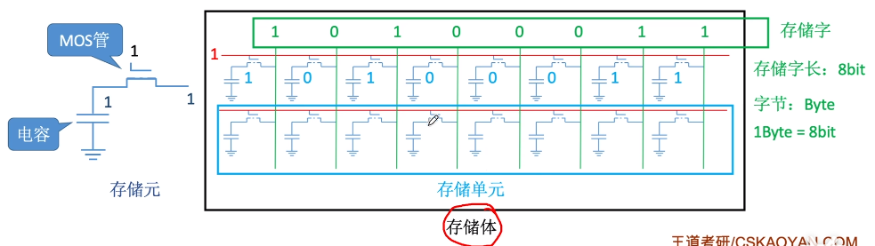

**MOS管**：可理解为一种电控开关，输入电压达到某个阈值时，MOS管就可以接通，如果达不到电压，那么就是绝缘体不导电。

**电容**：当输入电压，那么就产生电压差，给电容充电，存储电荷。

当多个存储元结合一起，那么就构成存储单元。

**存储元 → 存储单元 → 存储体**

### 3.2存储芯片基本原理

下面是**栅极电容**工作原理：

当MAR稳定之后，控制电路才打开译码器的开关，让译码器翻译地址，再控制MDR输出数据。

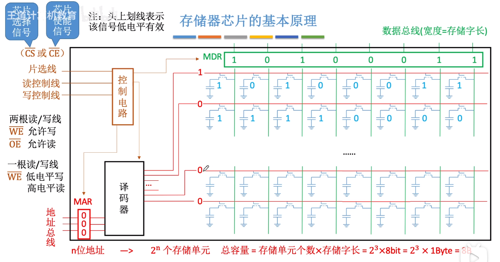

读写控制线**2根或1根**

地址线：n 个**地址线**可以片选译码出 2^n^ 个**存储单元**。
如果采用**地址复用技术**时，通过行通选和列通选分行、列两次传送地址信号，因此地址线减半**n/2**。

数据线：一个储单元存放m位数据通过**m根**数据线传输。

**数据总线带宽 = 存储字长**

总容量 = 存储单元个数 × 存储字长

> 例如：8KB × 8位
>
> 8KB：2^13^B个存储单元
>
> 8位：每个存储单元包含8个存储元（存储元件你）


封装为下面：


### 3.3如何实现不同的寻址方式

主存各存储单元的空间位置是由单元地址号来表示的，而地址总线是用来指出存储单元地址号的，根据该地址可读出或写入一个存储字。

通常计算机系统既可按字寻址，也可按字节寻址。按什么寻址就是按照什么大小寻址。


当寻址时，就把每一行开头的地址作为字地址。在下面一行中存放数据又分为大端、小端。


#### ==【考点】大端方式、小端方式存放数据==

有两种不同的地址指定方式：大端方式与小端方式。

- **大端方式**：指令中给出的地址是**操作数最高**有效字节所在的地址。

  

- **==小端方式==**：指令中给出的地址是**操作数最低**有效字节所在的地址。

  ==**【必考点】小段方式：低位的数据**存储在**低位的地址**==，

  ==**高位的数据（前面）**存储在**高位的地址（大的地址，后面）**==。


## 4,5半导体随机存取存储器

## 4.读写存储器RAM

RAM它们都属于**半导体随机存储器，易失性存储器**。

**静态RAM**（**SRAM**，Static Random Access Memory）

**动态RAM**（**DRAM**，Dynamic Random Access Memory）

| 类型特点                   | SRAM（静态RAM）        | DRAM（动态RAM）              |
| -------------------------- | ---------------------- | ---------------------------- |
| 存储类型                   | 触发器                 | 电容                         |
| 破坏性读出                 | 非                     | 是                           |
| 读出后需要重写（**刷新**） | 不用                   | 需要                         |
| 运行速度                   | 快                     | 慢                           |
| 集成度                     | 低                     | 高                           |
| 发热量（功耗）             | 大                     | 小                           |
| 存储成本                   | 高                     | 低                           |
| （非）易失性存储器         | 易失（断电后信息消失） | 易失（断电后信息消失）       |
| **送行列地址**             | **同时送**             | **分两次送**（地址复用技术） |
| 主要用途                   | 高速缓存（cache）      | 主机内存                     |

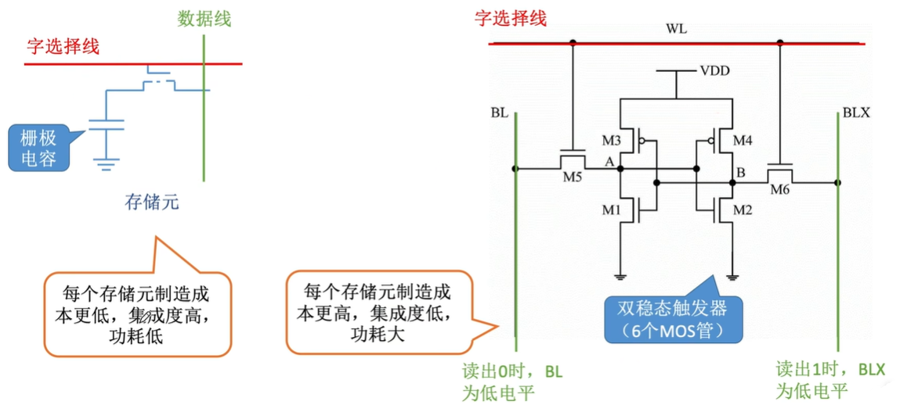

DRAM的每bit成本低于SRAM。


【高频考点】DRAM和SRAM的对比

核心区别：存储元不一样

- DRAM芯片：使用**栅极电容**存储信息
- SRAM芯片：使用**双稳态触发器**存储信息

### 4.1 SRAM

**静态随机存储器SRAM**的存储元是用**双稳态触发器**（六晶体管MOS）来记忆信息的，因此即使信息被读出后，它仍保持其原状态而不需要再生。只要不断电，触发器就不改变。（**非破坏性读出**)。


集成度需要6个逻辑元件。零件多，所以发热更多，成本也贵。

SRAM的存取速度快，但集成度低，功耗较大，所以一般用来组成高速缓冲存储器cache。

### 4.2 DRAM

**动态随机存储器DRAM**是利用存储元电路中**栅极电容**上的**电荷充放电**来存储信息的，DRAM的基本存储元通常只使用一个晶体管，所以它比SRAM的密度要高很多。DRAM采用**地址复用技术**，地址线是原来的1/2，且地址信号分行、列两次传送。

集成度需要1或3个逻辑元件。

DRAM读时，电荷放走了，之后需要重新充电维持。（**破坏性读出**）

DRAM电容上的电荷一般只能维持1~2ms，因此即使电源不断电，信息也会自动消失。为此，每隔一定时间必须刷新，通常取2ms，这个时间称为刷新周期。刷新的过程实质上是先将原存信息读出，再由刷新放大器形成原信息并重新写入的再生过程。

---

不过现在都采用SDRAM，如DDR3,DDR4都是这种芯片。

#### 4.2.1 DRAM刷新方式

刷新特点：

1. **DRAM刷新不依赖于CPU控制**。

2. 周期是**2ms**。电容内的电荷只能维持2ms。即便不断电，2ms后信息也会消失

3. 刷新类似于**读操作**，但又有所不同，刷新操作仅给栅极电容补充电荷，不需要信息输出。

4. 刷新时不需要选片，即整个存储器中的**所有芯片同时被刷新**。
   **2ms内刷新所有，每刷新一行所用的时间是一个读/写周期。**

5. DRAM的刷新单位是**行**，刷新操作仅需要行地址。

   ==采用**行列地址**，减少选通线的数量==：

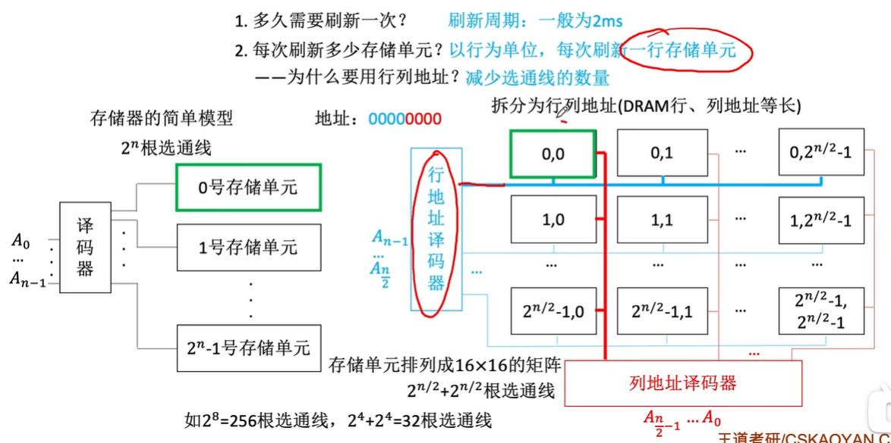

存储大小为：行*列

选通线数量为：行+列

---

常用的刷新方式有3种：**集中刷新、分散刷新、异步刷新**。

- **集中刷新**：指在一个刷新周期内，利用一段固定的时间，依次对存储器的所有行进行逐一再生，在此期间停止对存储器的读写操作，称为死时间，又称**访存死区**。

  集中刷新的优点是读写操作时不受刷新工作的影响，因此系统的存取速度较高；缺点是在集中刷新期间（死区）不能访存。

  

- **分散刷新**：把对每行的刷新分散到各个工作周期中。 一个存储器的系统工作周期分为两部分：前半部分用于正常读、写或保持；后半部分用于刷新某一行。这种刷新方式增加了系统的存取周期。分散刷新的优点是**没有死区**；缺点是加长了系统的存取周期。

  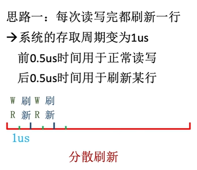

- **异步刷新**：*异步刷新是前两种方法的结合*，它既可以缩短死时间，又能充分利用最大刷新间隔为2ms的特点。具体做法是将刷新周期除以行数，得到两次刷新操作之间的时间间隔t，利用逻辑电路每隔时间t产生一次刷新请求。 这样可以避免使CPU连续等待过长时间，而且减少了刷新次数。

  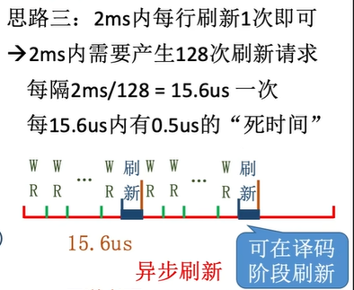

  计算异步刷新时间：

>已知：DRAM内部结构128*128
>读写周期0.5us
>
>所以2ms/128=15.6us
>每15.6us内有0.5us的死时间

若将刷新安排在不需要访问存储器的译码阶段，则既不会加长存取周期，又不会产生死时间，这是分散刷新方式的发展，也称**透明刷新**。

DRAM的存取速度比SRAM慢，一般用来组成大容量主存系统。

#### 4.2.2 DRAM地址复用技术

1.地址复用技术只适用于DRAM，不适合于SRAM。

2.地址复用技术的目的是为了减少地址线的数量，便于增加DRAM的集成度。

3.地址复用技术的本质是分**2次送行列地址**，因为半导体存储芯片的核心存储矩阵是采用行列地址交叉确定存储单元，所以既可以像SRAM那样一次同时取得行列地址，提高运行速度，也可像DRAM那样分两次取得行列地址，减少地址线的数量。

#### 4.2.3 周期

存取周期：可以连续读/写的最短时间间隔。

> 详细见[3.3_1_主存储器与CPU的连接_哔哩哔哩_bilibili](https://www.bilibili.com/video/BV1ps4y1d73V/?p=36&spm_id_from=pageDriver&vd_source=9d3c5a863c7c6dbd5152dd7c4e9dc492)最后几分钟


DRAM芯片的恢复时间比较长，有可能是存取时间的几倍。(SRAM的恢复时间较短)


### 4.3双端口RAM&多模块存储器

CPU的读写速度比主存快很多，而主存恢复时间太长怎么办？

引出下面的多端口RAM和多模块存储器。

为提高CPU访问存储器的速度，可采用双端口存储器、多模块存储器等技术，它们同属并行技术，前者为**空间并行**，后者为**时间并行**。

#### 4.3.1双端口RAM

> 408删除

空间并行

作用：优化多核CPU访问一根内存条的速度。

双端口RAM是指同一个存储器有左、右两个独立的端口，分别具有两组相互独立的地址线、数据线和读写控制线，允许两个独立的控制器同时异步地访问存储单元。 当两个端口的地址不相同时，在两个端口上进行读写操作一定不会发生冲突。

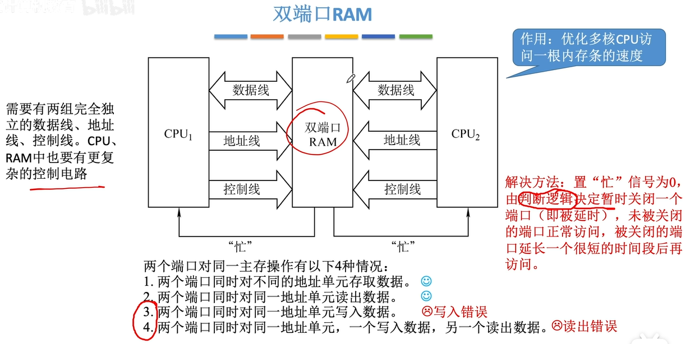

两个端口同时存取存储器的同一地址单元时，会因数据冲突造成数据存储或读取错误。两个端口对同一主存操作有以下4种情况：

1. 两个端口不同时对同一地址单元存取数据
2. 两个端口同时对同一地址单元读出数据
3. 两个端口同时对同一地址单元**写入**数据
4. 两个端口同时对同一地址单元操作，一个**写入**数据，另一个读出数据   

其中（1）和（2）不会出现错误；（3）会出现**写错误**；（4）会出现**读错误**

解决方法：置忙信号`BUSY`为0，由判断逻辑决定暂时关闭一个端口（即被延时），未被关闭的端口正常访问，被关闭的端口延长一个很短的时间段后再访问。


#### 4.3.2多模块存储器

时间并行

常用的有单体多字存储器和多体低位交叉存储器。

- 多模块存储器
  - 单体多字存储器
  - 多体并行存储器
    - 高位交叉编址
    - 低位交叉编址


##### 1）单体多字存储器

单体多字系统的特点是存储器中只有一个存储体，**只有一套读写控制电路、地址寄存器和数据寄存器**

每个存储单元存储m个字，
总线宽度也为m个字，
一次并行读出m个字。

**每次只能同时取m个字，不能单独取其中某个字**。指令和数据在主存内必须是连续存放的。地址必须顺序排列并处于同一存储单元。

单体多字系统在一个存取周期内，从同一地址取出m条指令，然后将指令逐条送至CPU执行，即每隔1/m存取周期，CPU向主存取一条指令。

单体多字系统的**缺点是：指令和数据在主存内必须是连续存放的**，一旦遇到转移指令或操作数不能连续存放，这种方法的效果不明显。


##### 2）多体并行存储器

多体并行存储器由**多体模块**组成。每个模块都有相同的容量和存取速度，各模块**都有独立的读写控制电路、地址寄存器和数据寄存器**。它们既能并行工作、又能交叉工作。

多体并行存储器分为高位交叉编址（顺序方式）和低位交叉编址（交叉方式）两种。


1. **高位交叉编址**

高位地址表示体号，低位地址为体内地址。 高位交叉编址主要用于存储器容量扩展。

高位交叉编址方式下，总是把低位的体内地址送到由高位体号确定的模块内进行译码。访问一个连续主存块时，总是先在一个模块内访问，等到该模块访问完才转到下一个模块访问，CPU总是按顺序访问存储模块，存储模块不能并行访问，因而不能提高存储器的吞吐率。高位交叉编址方式下易出现某一个存储体繁忙，其余空闲。

模块内的地址是连续的，存取方式仍是串行存取，因此这种存储器仍是顺序存储器。

2. **低位交叉编址**

低位地址为体号，高位地址为体内地址。低位交叉编址主要用于存储器带宽、访问速度的提高。

低位交叉编址方式下，总是把高位的体内地址送到由低位体号确定的模块内进行译码。**程序连续存放在相邻模块中，因此称采用此编址方式的存储器为交叉存储器**。采用低位交叉编址后，可在不改变每个模块存取周期的前提下，采用流水线的方式并行存取，提高存储器的带宽。

---

- 实际应用：

如何让你的电脑变成“双通道内存”。

如何插入内存条，实现**高位交叉**的多体存储器（相当于单纯的扩容）

如何插入内存条，实现**低位交叉**的多体存储器（俗称“**双通道**”）

Tips：实内存条时，可挑选相同主频（读写周期）、相同容量的两根来组成双通道。

---

==流水线计算题==

模块数m=4（有m个存储体），存储周期为T，字长w，数据总线宽度为w，总线传输周期为r（每隔r时间启动下一个存储体，即恢复时间），连续存取n个字，求交叉存储器的带宽（存储器的存取速率）。

>两种常见描述：
>
>1. 存取周期为T，**存取时间为r**，为了使流水线不间断，应保证模块数m≥T/r。
>2. 存取周期为T，**总线传输周期为r**，为了使流水线不间断，应保证模块数m≥T/r。


m<T/r 会有错误。
m>T/r 有空闲，存储体的利用率不够高。所以在设计的时候直接为**m=T/r**。
$$
带宽=\cfrac {n·W}{T+(n-1)·r}
$$
当n→∞，带宽→W/r：相当于m个存储体并行工作

当只有1个存储体，带宽→W/T


==【考点】宏观概念题==

**一个存储周期内，交叉存储器可以提供的数据量为单个模块的m倍。**

高性能存储芯片：

1. SDRAM（同步DRAM）：SDRAM与处理器的数据交换同步于系统的时钟信号，不需要插入等待状态（CPU无须等待）
2. RDRAM：主要解决存储器带宽的问题
3. 带Cache的DRAM（CDRAM）适合猝发式读取


>例题：双端口RAM在（）情况下会发生读/写冲突
>  A.左端口和右端口的地址码不同
>  B.左端口和右端口的地址码相同
>  C.左端口和右端口的数据码不同
>  D.左端口和右端口的数据码相同
>
>答案：B；
>
> 例题：下列说法中，正确的是（）
>  1.高位多体交叉存储器能很好地满足程序的局部性原理
>  2.高位四体交叉存储器可能在一个存储周期内连续访问4个模块
>  3.双端口存储器可以同时访问同一区间，同一单元
>  A.1,3  B.2,3  C.3  D.1
>
>  答案：B；高位多体交叉存储器若取了0，就不能继续取1，但可以取n，不满足程序的局部性原理；高位交叉存储器有可能一次连续读出彼此地址相差一个存储体容量的4个字；
>
>  例题：某计算机使用四体交叉编址寄存器，假定在存储器总线上出现的主存地址（10进制）序列为8005,8006,8007,8008,8001,8002,8003,8004,8000，则有可能发生访存冲突的地址对是：
>  A.8004,8008  B.8002,8007  C.8001,8008  D.8000,8004
>
>  答案：D；
>
>  例题：某计算机主存按字节编址，由4个64M x 8位的DRAM芯片采用交叉编址方式构成，并与宽度为32位的存储器总线相连，主存每次最多读写32位数据。若double型变量x的主存地址为804001AH，则读取x需要的存储周期数是（）
>
>  答案：3个存储周期；1个存储周期读4个B，double数据类型占8个字节。因为主存地址最低2位表示该字节存储的芯片编号，数据在从体2上开始，但是对于存储的读取是从体0开始的。所以在第一个周期结束，实际上读了体2，体3上的数据，第二轮周期把4个体都读一遍，现在还剩下体0和体1上的两个数据，然后第三个周期，才能读完8个字节。
>
>  例题：一个四体并行交叉存储器，每个模块容量是64K x 32位，存取周期为200ns
>  （1）在一个存取周期中，存储器能向CPU提供多少位二进制信息
>  （2）若存取周期为400ns,则在0.1μs内每个体可向CPU提供32位二进制信息，该说法对吗？为什么？
>
>  答案：（1）128位（流水线稳定后）；（2）不对，因为在0.1μs内整个存储器可向CPU提供32位二进制信息（流水线稳定），但每个存储体必须经过400ns才能向CPU提供32位二进制信息
>
>  例题：某计算机字长32位，存储体的存储周期为200ns
>  （1）采用四体交叉工作，用低2位的地址作为体地址，存储数据按地址顺序存放。主机最快多长时间可以读出一个数据字？存储器的带宽是多少？
>  （2）若4个体分别保存主存中前1/4、次1/4、再下个1/4、最后1/4这四段的数据，即选用高2位的地址作为体地址，可以提高存储器顺序读出数据的速度吗？为什么？
>  （3）若把存储器改成单体4字宽度，会带来什么好处和问题？
>  （4）比较采用四体低位地址交叉的存储器和四端口读出的存储器这两种方案的优缺点
>
>  答案：（1）理想情况是每个存取周期平均可读出4个数据字，即读出1个数据字时间为50ns，数据传输率32bit/50ns=80MB/s
>  （2）若对多体结构的存储器选用高位地址交叉，通常起不到提高存储器读写速度的作用，因为它不符合程序的局部性原理，一次连续读出彼此地址相差1个存储体的容量的4个字的机会太少。因此，通常只有1个存储模块在不停忙碌，其他存储模块是空闲的。
>  （3）若把存储器的字长扩大为原来的4倍，实现的则是一个单体4字结构的存储器，每次读可以同时读出4个字的内容，有利于提高存储器每个字的平均读写速度，但其灵活性不如多体单字结构的存储器，还会多用到几个缓冲寄存器。
>  （4）多端口存储器是对同一个存储体使用多套读写电路实现的，扩大存储容量的难度显然比多体结构的存储器要大，而且不能对多端口存储器的同一个存储单元同时执行多个写入操作，而多体结构的存储器则允许在同一个存储周期对几个存储体执行写入操作


## 5.只读存储器ROM

RAM芯片：易失性，断电后数据消失。

ROM芯片：**非易失性**，断电后数据不会丢失。

很多ROM也具有“随机存取”的特性。

分类：

- 掩模式只读存储器（MROM）
MROM的内容由制造厂按用户要求写入，之后任何人无法更改。

- 一次可编程只读存储器（PROM)
可实现一次性编程，写入一次后无法改变。

- 可擦除可编程只读存储器（EPROM）
  可对内容多次改写。需要修改EPROM的内容时，先将其全部内容擦除，然后编程。根据擦写方式不同，分为：

  - 紫外线擦除（UVEPROM）
    紫外线照射8~20分钟，擦除所有信息。
  - 电擦除（EEPROM）
    可以使用电擦除，擦去特定的字。

  EPROM不能取代RAM，因为修改次数有限，且写入时间太长。
  
- **闪速存储器**（Flash Memory）
  主要特点是既可在不加电的情况下长期保存信息，又能在线进行快速擦除和重写。例：u盘，SD卡。

  由于闪存需要先擦除在写入，因此闪存的**“写”速度要比“读”速度更慢**。
  
  每个存储元只需单个MOS管，位密度比RAM高。

- **固态硬盘**（Solid State Drives，SSD）

  基于闪存的固态硬盘是用固态电子存储芯片阵列制成的硬盘，由控制单元+存储单元（Flash芯片）组成。


### 5.1固态硬盘SSD

**固态硬盘**（Solid State Drives，SSD）

#### 5.1.1原理

基于**闪存**的固态硬盘是用固态电子存储芯片阵列制成的硬盘。属于电可擦除ROM，即EEPROM

#### 5.1.2组成

由控制单元+存储单元（Flash芯片）组成。

闪存翻译层（控制单元）：负责翻译逻辑块号，找到对应页(Page)。

存储介质（存储单元）：多个闪存芯片(Flash Chip)，每个芯片包含多个块(block)，每个块包含多个页(page)。

- 闪存芯片(Flash Chip)
  - 块(block)
    - 页(page)：（读写最小单位）


#### 5.1.3读写特性

1. 以**页(page)为单位读/写**。相当于磁盘的"扇区"。
2. 以**块(block)为单位"擦除"**，擦干净的块，其中的每页都可以写一次，读无限次。
3. 支持**随机访问**，系统给定一个逻辑地址，闪存翻译层可通过电路迅速定位到对应的物理地址。
4. **读快、写慢**。要写的页如果有数据，则不能写入，需要将块内其他页全部复制到一个新的（擦除过的）块中，再在新的块的那一页写入新的内容页。

#### 5.1.4与机械硬盘相比

1. SSD读写速度快，随机访问性能高，用电路控制访问位置。机械硬盘通过移动磁臂旋转磁盘控制访问位置，有寻道时间和旋转延迟。
2. SSD安静无噪音、耐摔抗震、能耗低、造价更贵。
3. SSD的一个**"块"被擦除次数过多（重复写同一个块）可能会坏掉**。而机械硬盘的扇区不会因为写的次数太多而坏掉。

#### 5.1.5磨损均衡技术

【思想】将"擦除"平均分布在各个块上，以提升使用寿命。

**动态磨损均衡**：写入数据时，优先选择累计擦除次数少的新闪存块

**静态磨损均衡**：SSD监测并自动进行数据分配、迁移，让老旧的闪仔块承担以读为主的储存任务，让较新的闪存块承担更多的写任务。


### 5.2计算机中的重要ROM：BIOS

主板上的**BIOS芯片**（ROM）存储了“**自举装入程序**”，负责引导装入操作系统（开机)。

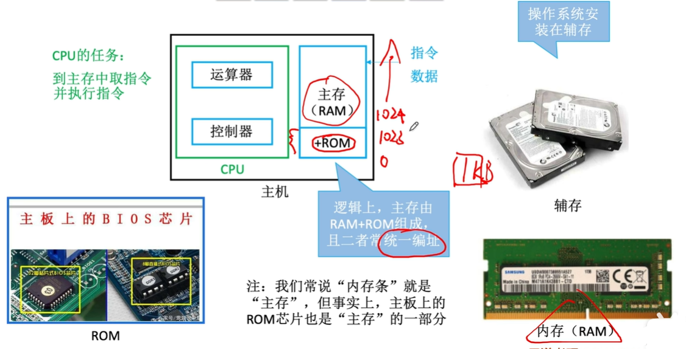


>例题：某一SRAM芯片，其容量为1024x8位，除电源和接地端外，该芯片的引脚的最小数目为：
>  A.21   B.22   C.23  D.24
>
>答案：A；地址线10根，数据线8根，加上片选线，读写控制线2根，共21根
>
>  例题：动态RAM采用下列哪种刷新方式时，不存在死时间
>  A.集中刷新   B.分散刷新   C.异步刷新   D.都不对
>
>  答案：B;异步刷新虽然缩短了死时间，但死时间依然存在
>
>  例题：某一DRAM芯片，采用地址复用技术，其容量为1024x8位，除电源和接地端外，该芯片的引脚数最少是（）（读写控制线为两根）
>
>  A.16   B.17   C.19   D.20
>
>  答案：B；采用地址复用技术时，通过行通选和列通选分行、列两次传送地址信号，因此地址线减半为5根，数据线8根，加上行通选和列通选及读写控制线共4根，总共为17根。DRAM采用地址复用技术，而SRAM不采用。
>  关于地址复用：1.地址复用技术只适用于DRAM，不适合于SRAM。2.地址复用技术的目的是为了减少地址线的数量，便于增加DRAM的集成度。3.地址复用技术的本质是分2次送行列地址，因为半导体存储芯片的核心存储矩阵是采用行列地址交叉确定存储单元，所以既可以像SRAM那样一次同时取得行列地址，提高运行速度，也可像DRAM那样分两次取得行列地址，减少地址线的数量。
>
>  例题：某容量为256MB的存储器由若干4Mx8位的DRAM芯片构成，该DRAM芯片的地址引脚和数据引脚总数是（）
>  A.19   B.22   C.30   D.36
>
>  答案：A；11+8
>
>  例题：下列关于闪存的叙述中，错误的是（）
>  A.信息可读可写，并且读、写速度一样快
>  B.存储元由MOS管组成，是一种半导体存储器
>  C.掉电后信息不丢失，是一种非易失性存储器
>  D.采用随机访问方式，可替代计算机外部存储器
>
>  答案：A；闪存依然是ROM的一种，写入时必须擦除原有数据，因此写速度比读速度慢。对于D，SSD固态硬盘即由Flash芯片组成
>
>  例题：U盘属于（）类型的存储器
>  A.高速缓存   B.主存   C.只读存储器   D.随机存取存储器
>
>  答案：C；随机存取和随机存储器（RAM）不同，只读存储器ROM也是随机存取的，因此，支持随机存取的存储器不一定是RAM
>
>  例题：在显示适配器中，用于存放显示信息的存储器称为刷新存储器，它的重要性能指标是带宽。具体工作中，显示适配器的多个功能部分要争用刷新存储器的带宽。设总带宽50%用于刷新屏幕，保留50%的带宽用于其他非刷新功能，且采用分辨率为1024x768像素、颜色深度为3B、刷新频率为72Hz的工作方式
>  （1）计算刷新存储器的总带宽
>  （2）为达到这样高的刷新存储器带宽，应采取何种技术措施
>
>  答案：（1）2x72x1024x768x3B/s=339.738MB/s
>  （2）要提高刷新存储器带宽，可采用：a.采用高速DRAM芯片；b.采用多体交叉存储结构；c.刷新存储器至显示控制器的内部总线宽度加倍；d.采用双端口存储器将刷新端口和更新端口分开
>
>  例题：一个1K x 4位的动态RAM芯片，若其内部结构排列成64x64形式，且存取周期为0.1μs
>  （1）若采用分散刷新和集中刷新（即异步刷新）相结合的方式，刷新信号周期应取多少
>  （2）若采用集中刷新，则对该存储芯片刷新一遍需多少时间？死时间率是多少
>
>  答案：（1）需在2ms时间内刷新64行，刷新信号的时间间隔为2ms/64=31.25 μs，可取刷新周期为31μs；
>  （2）刷新一遍需2ms，每次刷新一行需一个存取周期，死时间率为0.32%


## 6.主存储器与CPU连接

### 6.1单块存储芯片与CPU的连接

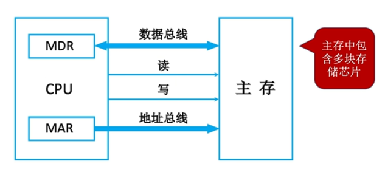


- A地址线（address）

- D数据线（data）

- CS（或CE）片选线，高电平有效（1工作）
  $\overline {CS}$ 片选线，低电平有效（0）

- WE（或WR）读写控制线，高电平有效（1）
  $\overline {WE}$ 读写控制线，低电平有效（0）

  也可能分开为$\overline {WE}$ 和 $\overline {OE}$ 两根读写线。

ROM存放系统程序、标准子程序和各类常数，
RAM则是为用户编程而设置的。


### ❗6.2==多块存储芯片与CPU的连接==

>详见《计算机组成原理》唐朔飞，高等教育出版社

总容量 = 存储单元个数 × 存储字长

> 例如：8KB × 8位
>
> 8KB：2^13^B个存储单元
>
> 8位：每个存储单元包含8个存储元（存储元件你）

#### 6.2.1位扩展法

增加存储器的位长（**数据线**）。

CPU的数据线数与存储芯片的数据位数不一定相等，此时必须对存储芯片扩位。例如用8片8K x 1位的RAM芯片组成8K x 8位的存储器。**片选信号CS要连接到所有芯片。**


#### 6.2.2字扩展法

分为：

- 线选法
- 片选法（线选法优化）


增加存储器的**寻址范围（地址线）**。

增加存储器中字的数量，而位数不变。**通过片选CS信号来区分各芯片的地址范围。**

不加译码器，n条线，n个选片，是**线选法**。

一般是要加译码器的，n条线，2^n个选片，是**译码片选法**。
表示方式就是用二进制来表示十进制的数，例如2条线：00-0，01-1，10-2，11-3可以表示4个选片。

| 线选法            | 译码片选法                       |
| ----------------- | -------------------------------- |
| n条线→n个片选信号 | n条线→2^n^个片选信号             |
| 电路简单          | 电路复杂                         |
| 地址空间不连续    | 地址空间可连续，可以增加逻辑设计 |

第1片，最低地址：00 0000 0000 0000 0000 00;最高地址：00 1111 1111 1111 1111 11（16位）

第2片，最低地址：01 0000 0000 0000 0000 00;最高地址：01 1111 1111 1111 1111 11（16位）

第3片，最低地址：10 0000 0000 0000 0000 00;最高地址：10 1111 1111 1111 1111 11（16位）

第4片，最低地址：11 0000 0000 0000 0000 00;最高地址：11 1111 1111 1111 1111 11（16位）


#### 6.2.3字位同时扩展法

字位同时扩展指既增加存储字的数量，又增加存储字长。

各芯片连接地址线A的方式相同，但连接数据线D的方式不同，而且需要通过片选信号CS或采用译码器设计连接到相应的芯片。


#### 6.2.4补充：译码器

译码器**74ls138**

要注意是低电平有效还是高电平有效。

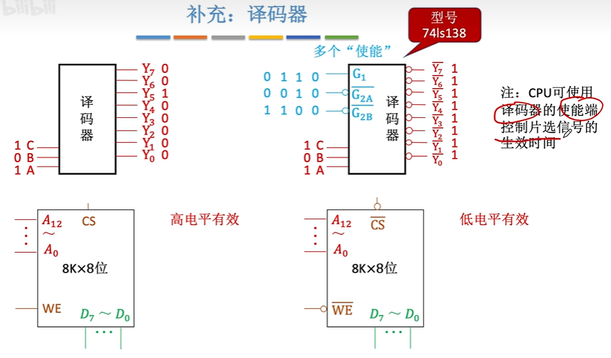

CPU可使用译码器的**使能端**控制片选信号的生效时间。

刚开始cpu连接不稳定，所以此时cpu控制使能端，让译码器不工作，等电流稳定，再发出主存请求信号，使得译码器正常工作。

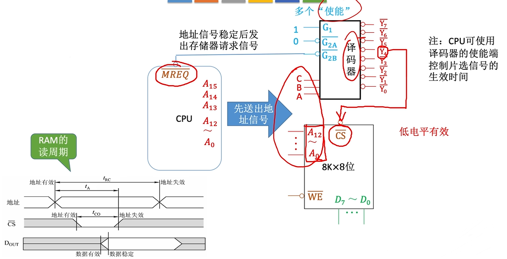


>例题：假定用若干2K x 4位的芯片组成一个8K x 8位的存储器，则地址0B1FH所在芯片的最小地址是（）
>  A.0000H  B.0600H  C.0700H  D.0800H
>
>答案：D；各组的地址分配：第一组：0000H~07FFH；
>  第二组：0800H ~0FFFH；第三组：1000H ~17FFH；
>  第四组：1800H~1FFFH；
>
>  例题：80386DX是32位系统，以4B为编址单位，当在该系统中用8KB（8K x 8位）的存储芯片构造32KB的存储体时，应完成存储器的（）设计
>  A.位扩展  B.字扩展  C.字位扩展  D.字位均不扩展
>
>  答案：A；
>
>  例题：地址总线A0（高位）~A15（低位），用4K x 4位的存储芯片组成16KB存储器，则产生片选信号的译码器的输入地址线应该是（）
>
>  答案：A；

大例题：

>
>
>这里CPU地址线总共有16根，所以下面也是16位的，
>后面11位10位分别表示地址，
>中间3位使用74LS138译码器（38译码器）来实现片选的控制
>前面2位永远都保持01，所以来作为译码器的使能端
>
>
>
>用户程序区中间3位和后10位之间还有1位，所以也要把A10计算在内。
>
>ROM的读写控制线是静态的状态，所以不需要连接CPU，保持工作就可以。
>
>


## 7.磁盘存储器（机械）

> 考点：磁盘存取时间的计算
>
> 与操作系统有重合，操作系侧重算法管理，计组侧重硬件
>
> 详：操作系统 - 4.文件管理 - 九、磁盘组织与管理

计算机的外存储器又称为辅助存储器，目前主要使用**磁表面存储器**。

所谓“磁表面存储”，是指把某些磁性材料薄薄地涂在金属铝或塑料表面上作为载磁体来存储信息。磁盘存储器、磁带存储器和磁鼓存储器均属于磁表面存储器。

- 磁表面存储器的**优点**：

①存储容量太，位价格低；

②记录介质可以重复使用；

③记录信息可以长期保存而不丢失，甚至可以脱机存档；

④非破坏性读出，读出时不需要再生。

- 磁表面存储器的**缺点**：

①存取速度慢；

②机械结构复杂；

③对工作环境要求较高。

---

### 7.1组成

**硬盘存储器**由磁盘驱动器，磁盘控制器和盘片组成。

- **磁盘驱动器**：核心部件是磁头组件和盘片组件，温彻斯特盘是一种可移动头固定盘片的硬盘存储器。


- **磁盘控制器**：是硬盘存储器和主机的接口（I/O控制器），主流的标准有IDE（ATA）、SCSI、SATA等。


- **盘片**：磁盘存储区域

一块硬盘含有若干个记录面，每个**记录面**划分为若干条**磁道**，而每条磁道又划分为若干个**扇区**，**扇区（也称块）是磁盘读写的最小单位**，也就是说磁盘按块存取。

- 盘片
  - 磁道
    - 扇区（读写最小单位）


一个盘片的正面反面都可以涂上磁性材质：


### 7.2磁盘性能指标

#### 7.2.1磁盘的容量

一个磁盘所能存储的字节总数称为磁盘容量。磁盘容量有非格式化容量和格式化容量之分。

1. **非格式化容量**：从物理上来看，磁盘可以记录的二进制bit位的上限。是指磁记录表面可以利用的磁化单元总数。
2. **格式化容量**：是指按照某种特定的记录格式所能存储信息的总量。进行格式化之后会预留下某些空间，等到使用的某些扇区坏了，那么备份的扇区就会出来顶替坏掉的扇区。

格式化容量 < 非格式化容量

#### 7.2.2记录密度

记录密度是指盘片单位面积上记录的二进制的信息量，通常以道密度、位密度和面密度表示。

1. **道密度**：是沿磁盘半径方向单位长度上的磁道数；

   如：60道/cm：就是1cm上60个磁道。

2. **位密度**：是磁道单位长度上能记录的二进制代码位数；

   如：600bit/cm：就是在这个磁道上，1cm可以存储600bit二进制位。

   

   【注意】虽然在扇区看起来，里层的更短，但是存储的数据量一样大，所以**越内侧的磁道位密度越大**。

3. **面密度**：是位密度和道密度的乘积。

#### 7.2.3==平均存取时间==

**平均存取时间 =**

**寻道时间(磁头移动到目的磁道) + **

**旋转延迟时间(磁头定位到所在扇区) + **

**传输时间(传输数据所花费的时间)**.


**【注意】**

1. 有的题目还会要求加上磁盘控制器延迟的时间。
2. 如果题目没有给出旋转延迟时间，那么就用**磁盘转半圈**的时间替代。

#### 7.2.4数据传输率

磁盘存储器在单位时间内向主机传送数据的字节数，称为数据传输率。

因为每次都可以读入一整条的磁道的数据。

假设磁盘转数为 r(转/秒），每条磁道容量为 N 个字节，则数据传输率为：
$$
D_r = rN
$$


### 7.3磁盘地址

主机向磁盘控制器发送寻址信息，磁盘的地址一般如图所示：

| 驱动器号               | 柱面（磁道）号     | 盘面号       | 扇区号                         |
| ---------------------- | ------------------ | ------------ | ------------------------------ |
| 一台电脑可能有多个硬盘 | 移动磁头臂（寻道） | 激活某个磁头 | 通过旋转将特定扇区划过磁头下方 |

例题：

> 若系统中有4个驱动器，每个驱动器带一个磁盘，每个磁盘256个磁道、16个盘面，每个盘面划分为16个扇区，则每个扇区地址要18位二进制代码：
>
> 驱动器号 (2bit)
> 柱面(磁道)号 (8bit)
> 盘面号 (4bit)
> 扇区号 (4bit)


### 7.4磁盘工作过程

硬盘的主要操作是寻址，读盘、写盘。每个操作都对应一个控制字，硬盘工作时，第一步是取控制字，第二步是执行控制字。

硬盘属于机械式部件，其读写操作是**串行**的，**每次读写1bit，且读写不能同时进行**（不可能在同一时刻既读又写，也不可能在同一时刻读两组数据或写两组数据）。


### 7.5磁盘阵列RAID

**RAID**（Redundant Array of Inexpensive Disks，廉价冗余磁盘阵列）是将多个独立的物理磁盘组成一个独立的逻辑盘，数据在多个物理盘上分割交叉存储、并行访问，具有更好的存储性能、可靠性和安全性。

**因为磁盘读写只能是串行的，所以把物理上相邻的两个磁盘，分为两个disk，那么在读出数据时如果要读A1、A2的数据，就可以做到某种程度上的并行。**

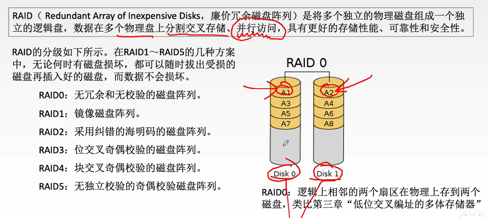

---

RAID的分级如下所示。在RAID1~RAID5的几种方案中，无论何时有磁盘损坏，都可以随时拔出受损的磁盘再插入好的磁盘，而数据不会损坏。（越往后，冗余信息的占比会越来越低，可靠性也更高）

RAIDO:无冗余和无校验的磁盘阵列。

RAID1:镜像磁盘阵列。

RAID2:采用纠错的海明码的磁盘阵列。

RAID3:位交叉奇偶校验的磁盘阵列。

RAID4:块交叉奇偶校验的磁盘阵列。

RAID5:无独立校验的奇偶校验磁盘阵列。

---

RAID0：把连续多个数据块交替地存放在不同物理磁盘的扇区中，几个磁盘交叉并行读写，不仅扩大了存储容量，而且提高了磁盘数据存取速度，但RAID0**没有容错能力**。

RAID1：**存放两份数据**。为了提高可靠性，使两个磁盘同时进行读写，互为备份，如果一个磁盘出现故障,可从另一磁盘中读出数据。两个磁盘当一个磁盘使用，意味着**容量减少一半**。

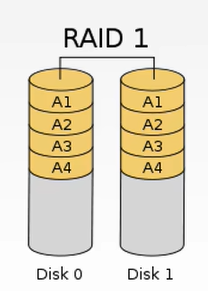

RAID2：逻辑上连续的几个bit物理上分散存储在各个盘中4bit信息位+3bit海明校验位――可纠正一位错。

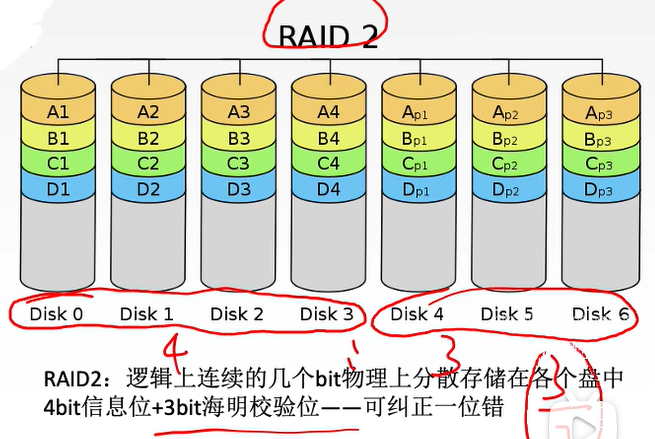


## 8.高速缓冲存储器Cache

高速缓冲存储器简称**Cache**，位于主存和CPU之间，用来存放正在执行的程序段和数据，以便CPU能高速地使用它们。

Cache的存取速度可与CPU的速度相匹配，但存储容量小、成本高、集成度低。

目前的计算机通常将它们制作集成在CPU中，用SRAM实现。


### 8.1局部性原理

**局部性原理**：cache能够有效工作的理论依据。

**高速缓冲技术**就是利用程序访问的局部性原理，把程序中正在使用的部分存放在一个高速的、容量较小的Cache中，使CPU的访存操作大多数针对Cache进行，从而大大提高程序的执行速度。

#### 8.1.1空间局部性

在最近的未来要用到的信息，很可能**与现在正在使用的信息在存储空间上是邻近的（相邻信息）**，因为指令通常是顺序存放、顺序执行的，数据一般也是以向量、数组等形式簇聚地存储在一起的。

#### 8.1.2时间局部性

在最近的未来要用到的信息，很可能是**现在正在使用的信息（同一个信息）**，因为程序中存在循环。


>例：假定数组元素按行优先方式存储，对于下面的两个函数：
>
>```c++
>程序A：
>int sumarrayrows( int a[M][N] )
>{
>	int i,j,sum=0;
>	for( i=0;i<M;i++ )
>		for( j=0;j<N;j++ )
>			sum+=a[i][j];
>	return sum;
>}
>程序B：
>int sumarraycols( int a[M][N] )
>{
>	int i,j,sum=0;
>	for( j=0;j<N;j++ )
>		for( i=0;i<M;i++ )
>			sum+=a[i][j];
>	return sum;
>}
>```
>
>（1）对于数组a的访问，哪个空间局部性更好？哪个时间局部性更好？
>（2）对于指令访问来说，for循环体的空间局部性和时间局部性如何？
>
>答案：（1）程序A对数组a的访问顺序与存放顺序是一致的，因此空间局部性好。程序B对数组a的访问顺序与存放顺序不一致，因而没有空间局部性。两个程序的时间局部性都很差，因为每个数组元素都只被访问一次。
>     （2）对于for循环体，程序A和程序B中的访问局部性是一样的。因为循环体内指令按序连续存放，所以空间局部性好；内循环体被连续重复执行，因此时间局部性也好。


### 8.2性能指标

- **命中率 H**：CPU想访问的信息已经在Cache比率。

$$
H=\frac {N_c}{N_c+N_m}
$$
一个程序执行中：
$N_c$：访问cache的总2次数。
$N_m$：访问主存的总次数。

- **缺失（未命中）率 M**：**M = 1 - H**
- **平均访问时间 T~a~**

有2种策略：

$t_c$：命中cache的访问时间
$t_m$：未命中的访问时间（这里的未命中而不是访问主存的时间）

1. 同时访问Cache和主存：

$$
T_a = H · t_c + (1-H) · t_m
$$
2. 先访问Cache，再访问主存：

$$
T_a = H · t_c + (1-H) · (t_c+t_m)
$$

- **系统的效率 e**

$$
e=\frac {t_c}{T_a}
$$


> 【例】假设Cache的速度是主存的5倍，且Cache的命中率为95%，则采用Cache后，存储器性能提高多少(设Cache和主存同时被访问，若Cache命中则中断访问主存）?
>
> 解：设Cache的存取周期为t，则主存的存取周期为5tCache和主存同时访问，不命中时访问时间为5t故系统的平均访问时间为Ta=0.95×t+0.05×5t = 1.2t
>
> 设每个周期可存取的数据量为S，则存储系统**带宽为S/1.2t** ，不采用cache时的带宽为S/5t
> $$
> \cfrac {\cfrac {S}{1.2t}}{\cfrac {S}{5t}}=\cfrac {5t}{1.2t}u≈4.17
> $$
> 因为是使用cache是不使用的4.17倍，所以要减去1，提高了3.17倍。


### ❗8.3主存映射（查策略）

> 详见《计算机组成原理》唐朔飞，高等教育出版社

| 存放方式               | 直接映射 | 全相联映射 |
| ---------------------- | -------- | ---------- |
| 命中率                 | 最低     | 最高       |
| 判断开销               | 最小     | 最大       |
| 所需时间               | 最短     | 最长       |
| 标记所占的额外空间开销 | 最少     | 最大       |


#### 8.3.1全相联映射

**空的位置随意放**

- 优点：Cache块的冲突概率低，空间利用率高，命中率高。
- 缺点：标记的比较速度较慢，实现成本较高，需采用昂贵的按内容寻址的相联存储器进行地址映射。

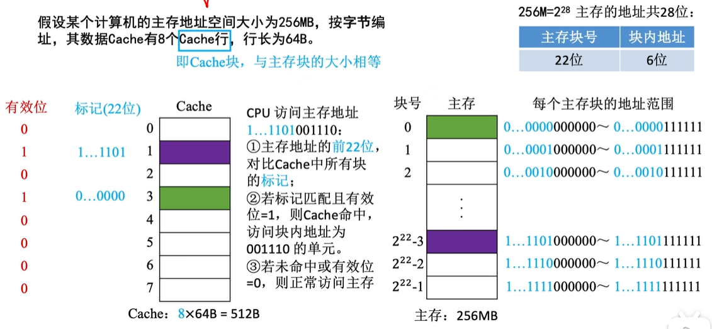

地址结构：

| 标记 | 块内地址 |
| ---- | -------- |


#### 8.3.2直接映射

**对号入座**：主存中的每一块只能装入Cache中的唯一位置。若这个位置已有内容，则产生块冲突，原来的块将无条件地被替换出去（无须使用替换算法）。

- 缺点：直接映射的块冲突概率最高，空间利用率最低。

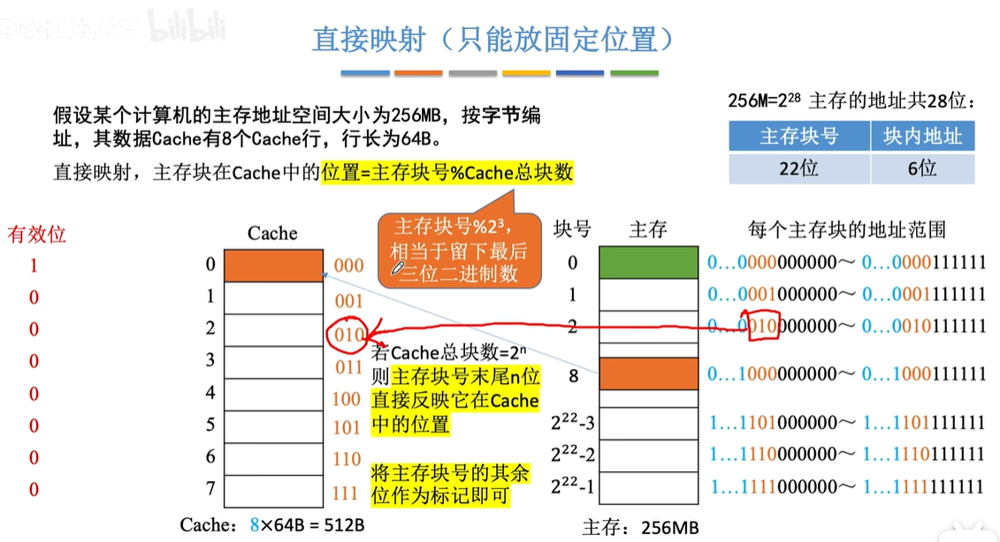

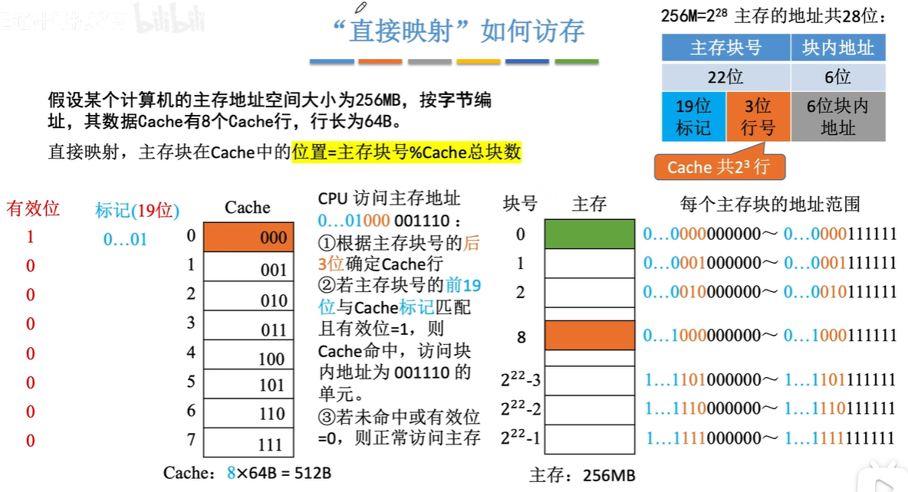

地址结构：

| 标记 | Cache行号 | 块内地址 |
| ---- | --------- | -------- |


#### 8.3.3组相联映射

**按号分组，在自己组内随便放**：将Cache空间分为大小相同的组，主存的一个数据块可以装入一组内的任何一个位置。

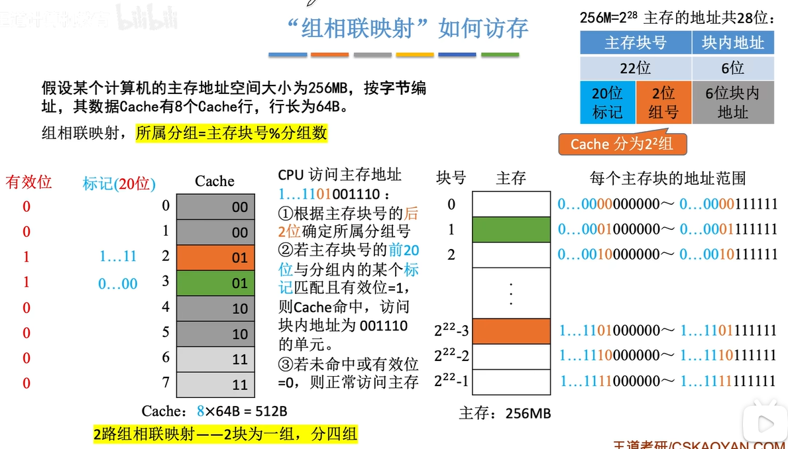

地址结构：

| 标记 | 组号 | 块内地址 |
| ---- | ---- | -------- |


##### CPU访存过程

**首先根据访存地址中间的组号找到对应的Cache组；将对应Cache组中每个行的标记与主存地址的高位标记进行比较；若有一个相等且有效位为1，则访问Cache命中，** 此时根据主存地址中的块内地址，在对应Cache行中存取信息；

若都不相等或相等但有效位为0，则不命中，此时CPU从主存中读出该地址所在的一块信息送到对应Cache组的任意一个空闲行中，将有效位置。


### 8.4替换算法

Cache很小，主存很大。如果Cache满了，那么就需要使用替换算法来替换数据。


#### 8.4.1随机算法(RAND)

**随机算法**（RAND, Random）：若cache已满，则随机选择一块替换。

实现简单，但**完全没考虑局部性原理，命中率低，实际效果很不稳定**。

#### 8.4.2先进先出算法(FIFO)

**先进先出算法**（**FIFO**, First In First Out）：若Cache已满，则替换最先被调入Cache的块。

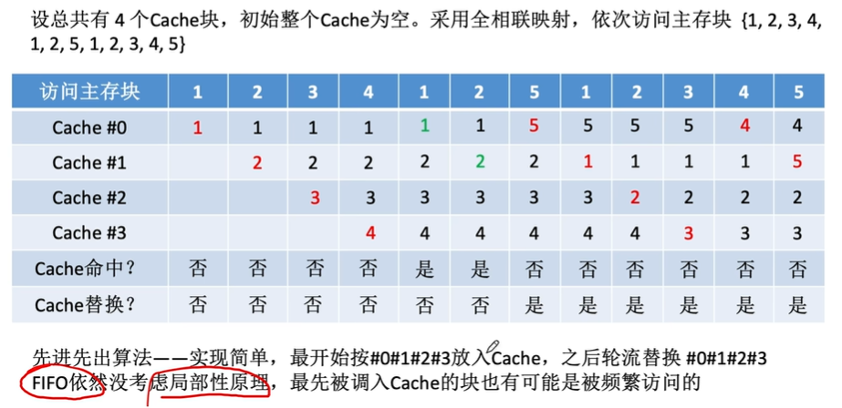

FIFO算法实现简单，最开始按#0#1#2#3放入cache，之后轮流替换#0#1#2#3。

**FIFO依然没考虑局部性原理，最先被调入Cache的块也有可能是被频繁访问的**。

**抖动现象**：频繁的换入换出现象（刚被替换的块很快又被调入）。

#### ❗8.4.3近期最少使用(LRU)

**近期最少使用算法**（**LRU**, Least Recently Used）：为每一个Cache块设置一个“计数器”，用于记录每个Cache块**已经有多久没被访问**了。当cache满后替换“计数器”最大的。

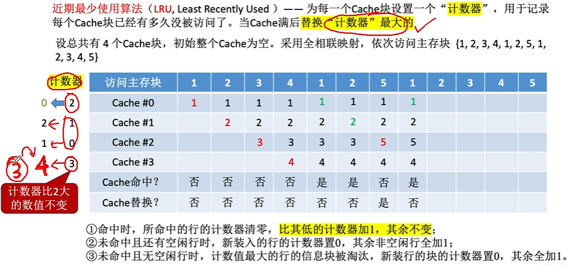

这里命中了，然后**比其低的计数器** +1，因为计数器的目的是用于寻找计数器最大的cache块。而这3已经是最大了，3+1=4也就没有意义，因为3足以判断找出计数器最大的cache块，所以3加1是没有意义的，所以这里不用加1。

**【总结】Cache块的总数=2^n^，则计数器只需 n 位。且Cache装满后所有计数器的值一定不重复**。

**LRU算波基于“局部性原理”**。近期被访问过的主存块，在不久的将来也很有可能被再次访间，因此淘汰最久没被访问过的块是合理的。LRU算法的实际运行效果优秀，Cache命中率高。

但是若被频繁访问的主存块数量 > Cache行的数量，则还是有可能发生“**抖动**”。
如：{1,2,3,4,5,1,2,3,4,5,1,2...}


【技巧】做题小妙招，可以看主存块前面的有哪些主存块，那么最后没有出现的那一个就是要替换的cache块。

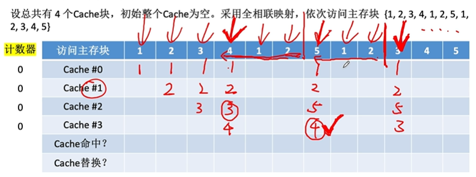

#### 8.4.4最近不经常使用(LFU)

**最不经常使用算法**（LFU, LeastErequentlyUsed）：为每一个Cache块设置一个“计数器”，用于记录每个cache块**被访问过几次**。当Cache满后替换“计数器”最小的。

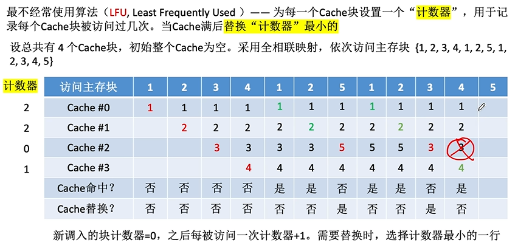

若有多个计数器最小的行，可按行号递增、或者FIFO策略进行选择。

LFU算法：曾经被经常访问的主存块在未来不一定会用到（如:微信视频聊天相关的块），并没有很好地遵循局部性原理，因此实际运行效果不如LRU。


### 8.5Cache写策略

读操作不会导致**cache和主存的数据不一致**，但是写操作会导致。

- 写命中
  - 写回法
  - 全写法
- 写不命中
  - 写分配法

  - 非写分配法

#### 8.5.1写命中

##### 1）写回法

**写回法**（write-back）：当CPU对Cache写命中时，只修改Cache的内容，而不立即写入主存，只有当此块被换出时才写回主存。

未修改的块不用写回。

减少了访存次数，但存在数据不一致的隐患。

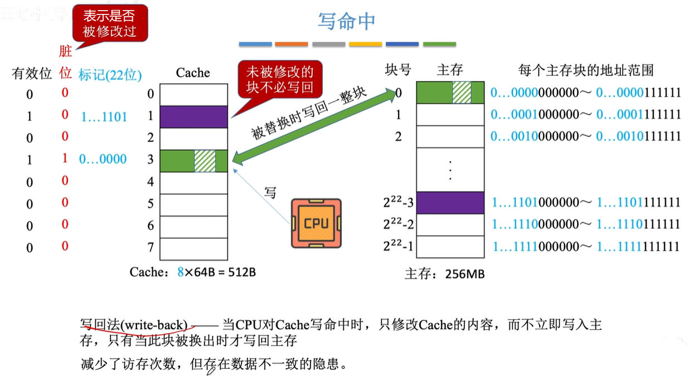

##### 2）全写法

**全写法**（写直通法，write-through）：当CPU对Cache写命中时，必须把数据同时写入Cache和主存，一般使用**写缓冲**(write buffer)。

访存次数增加，速度变慢，但更能保证数据一致性。

但如果使用**写缓冲**，CPU写的速度很快，若写操作不频繁，则效果很好。若写操作很频繁，可能会因为写缓冲饱和而发生阻塞。

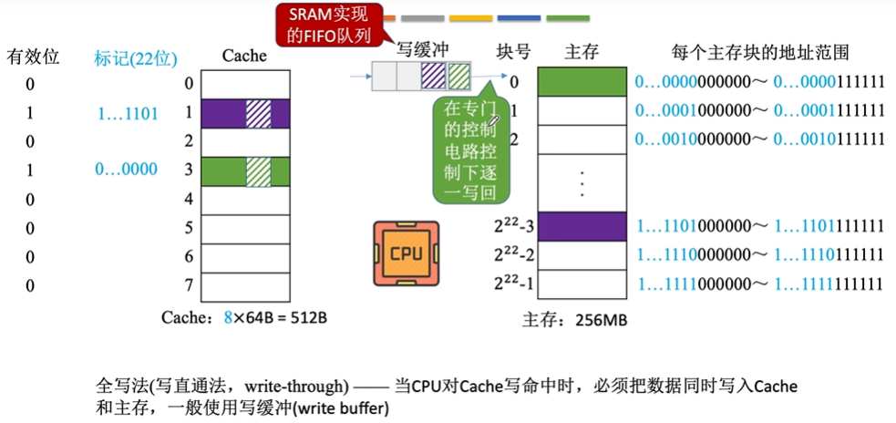

暂时放到写缓冲中，当CPU去做其他任务，这时候会有一个专门的电路把修改同步到主存。


#### 8.5.2写不命中

##### 1）写分配法

写分配法(write-allocate)：有CPU对Cache写不命中时，把主存中的块调入Cache，在Cache中修改。

通常搭配**写回法**使用。

##### 2）非写分配法

非写分配法(not-write-allocate)：当CPU对Cache写不命中时，直接写入主存，不调入Cache。

通常搭配**全写法**使用。

### 8.6多级Cache

现代计算机常采用**多级Cache**。

L1, L2, L3...

离CPU越近的速度越快，容量越小；
离CPU越远的速度越慢，容量越大。


## 9.页式存储器

> 详见 操作系统 3.内存管理 存储器管理 3.2.1分页存储管理

因为实际连续存放一段程序是不现实的，那样会使得利用率极低。所以，比如某程序4KB，就把4KB的程序分为4个“页”每个页面的大小和“物理块”的大小相同。

**页式存储系统**：一个程序(进程)在逻辑上被分为若干个大小相等的“页面”，“页面”大小与“块”的大小相同。每个页面可以离散地放入不同的主存块中。

---

- **逻辑**地址（**虚**地址）：程序员视看到的地址。

逻辑地址=逻辑页号+页内地址

（虚地址=虚页号+页内地址）

- **物理**地址（**实**地址）：实际在主存中的地址。

物理地址=主存块号+页内地址

（实地址=实页号+页内地址）

---

也就是程序给出逻辑地址，然后操作系统会将其转换为物理地址。这个转换的过程，是通过**页表**。

### 9.1页表

CPU执行的机器指令中，使用的是“逻辑地址”，因此需要通“**页表**”将逻辑地址转为物理地址。

**页表的作用**：记录了每个逻辑页面存放在哪个主存块中。

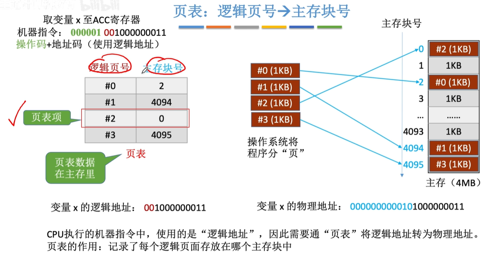

### 9.2地址变换过程

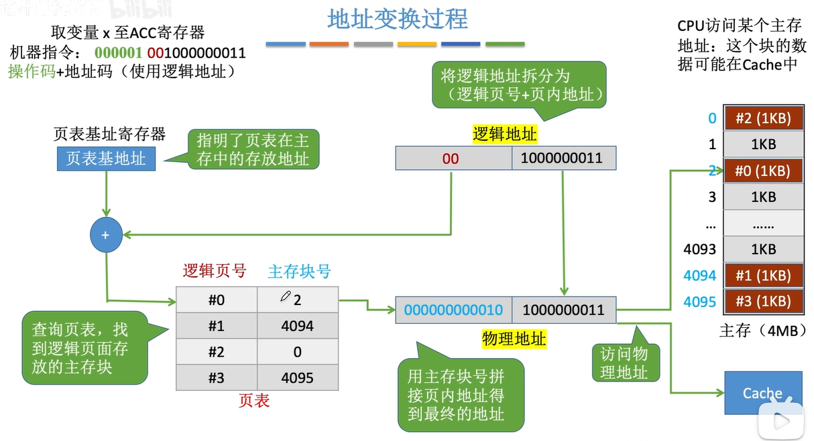

- 优化：

但是，因为程序的**局部性原理**，很有可以频繁访问这一个页表项，那么就可以**把近期访问的页表项放入更高速的存储器**，可加快地址变换的速度。

所以添加快表。

### 9.3快表TLB

快表是一种“相联存储器”可以按内容寻访。设计成本高，复杂。

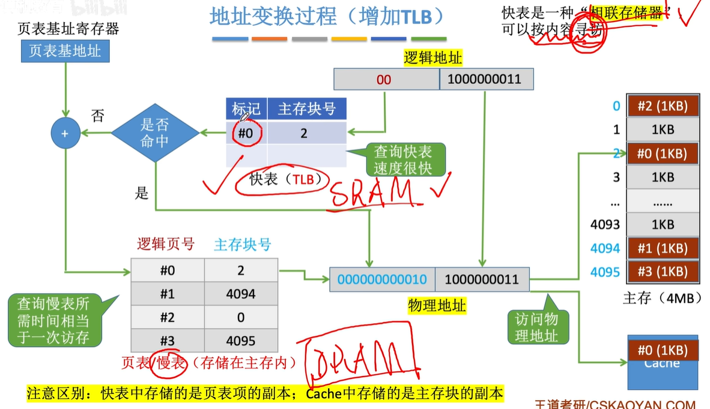


## 10.虚拟存储器

> 详见 操作系统 3.内存管理 七、虚拟内存管理

### 10.1页式虚拟存储器

虚拟存储系统，是内存和辅存之间的关系，有点类似cache和主存之间的关系，同样基于局部性原理、替换算法、页式存储。

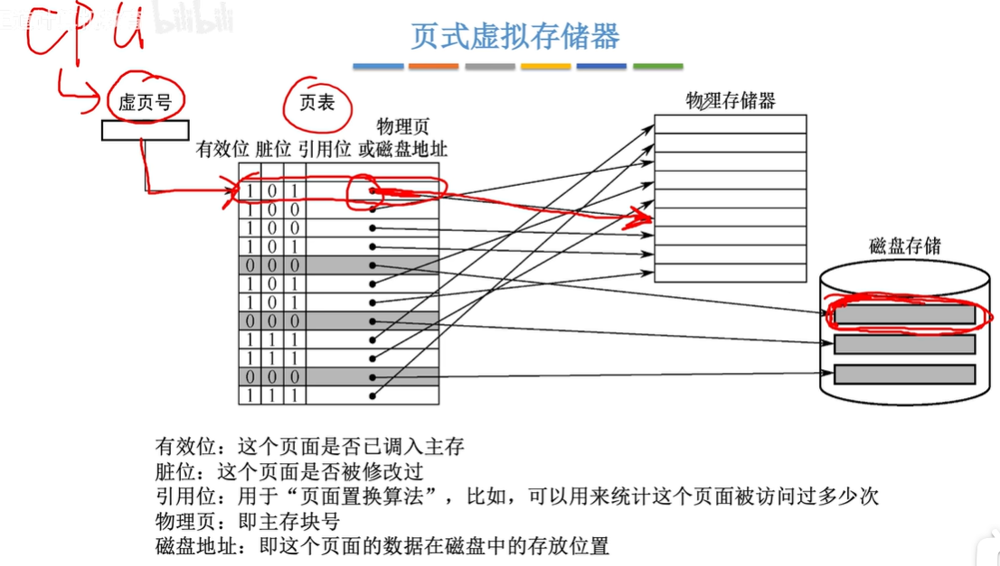

| 逻辑页号   | 有效位       | 脏位 | 引用位（访问位） | 主存块号（或外存块号） |
| ---------- | ------------ | ---- | ---------------- | ---------------------- |
| #0逻辑地址 | bool（1或0） | bool | 引用次数         |                        |

- **有效位**：这个页面是否已调入主存（物理存储器）。
- **脏位**：这个页面是否被修改过。
- **引用位**（访问位）：用于“页面置换算法”，比如，可以用来统计这个页面被访问过多少次。
- **物理页**：即**主存块号**。
- **磁盘地址**：即**外存块号**。这个页面的数据在磁盘中的存放位置。


### 10.2段式虚拟存储器

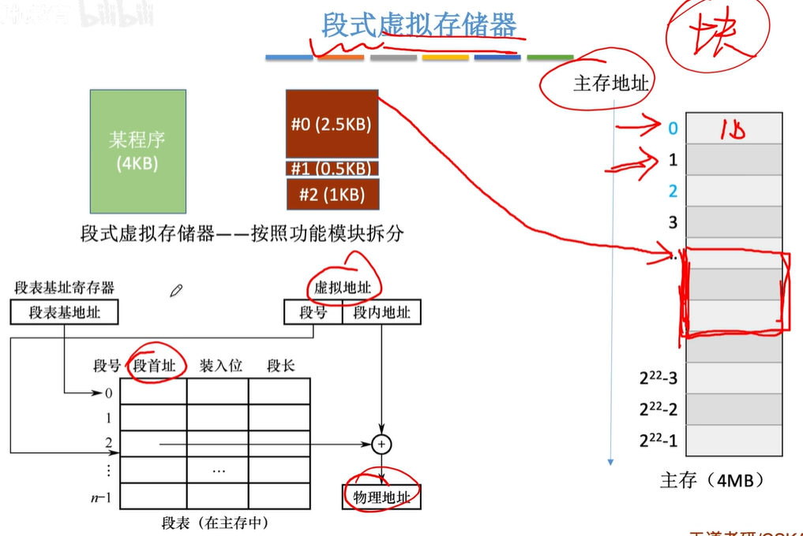


### 10.3段页式虚拟存储器

把程序按逻辑结构分段，每段再划分为固定大小的页，主存空间也划分为大小相等的页。

程序对主存的调入、调出仍以页为基本传送单位。

每个程序对应一个段表，每段对应一个页表。

虚拟地址 = 段号+段内页号+页内地址。

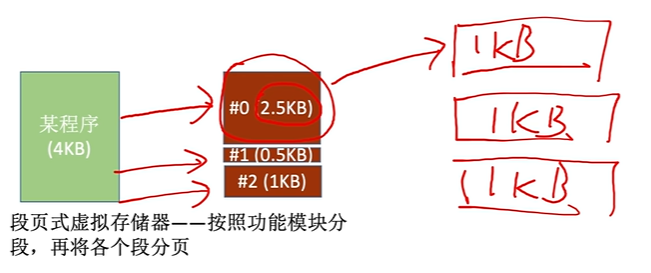
