# 四、指令系统

[toc]

## 1.指令格式

**指令**（又称机器指令）：是指示计算机执行某种操作的命令，是计算机运行的最小功能单位。

**指令集**：一台计算机的所有指令的集合构成该机的指令系统，也称为**指令集**。

【注意】一台计算机只能执行自己**指令系统**中的指令，不能执行其他系统的指令。

Eg：x86架构、ARM架构


一条指令就是机器语言的一个语句，它是一组有意义的二进制代码。

一条指令通常要包括**操作码**字段和**地址码**字段两部分：

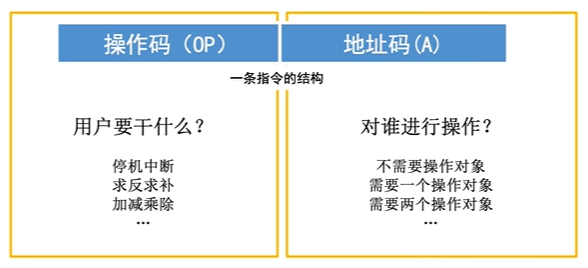

作用：

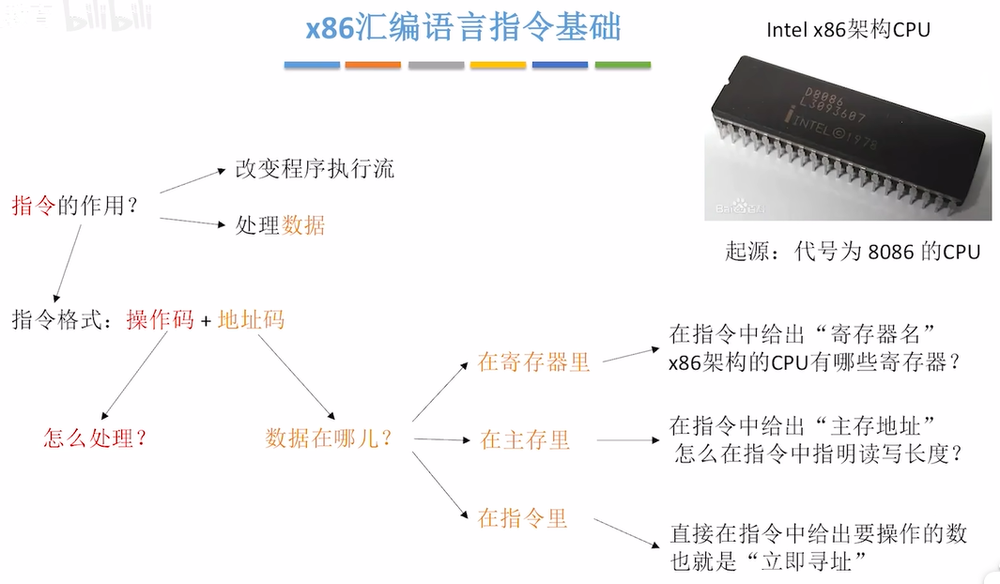

## 2.分类

### 2.1根据地址码数目不同

#### 2.1.1零地址指令

| OP   |
| ---- |

出现的情况：

1. **不需要操作数**，如空操作、停机、关中断等指令。
2. **堆栈计算机**，两个操作数隐含存放在栈顶和次栈顶，计算结果压回栈顶。

#### 2.1.2一地址指令

| OP   | A1   |
| ---- | ---- |

出现的情况：

1. **只需要单操作数**，如加1、减1、取反、求补等。

指令含义：**OP(A1)→A1**

完成一条指令需要3次访存：取指→读A1→写A1

2. **需要两个操作数**，但其中一个操作数隐含在某个寄存器（如隐含在ACC）。

指令含义：**(ACC)OP(A1)→ACC**

把ACC中存的数据与A1中存放的数据进行运算，然后把运算结果存到ACC。

完成一条指令需要2次访存：取指→读A1（因为ACC就是累加寄存器，不用取）。

**【注意】`A`指某个主存地址，`(A1)`表示A所指向的地址中的内容。**（类比c语言指针）

#### 2.1.3二地址指令

| OP   | A1（目的操作数） | A2（源操作数） |
| ---- | ---------------- | -------------- |

常用于需要两个操作数的算术运算、逻辑运算相关指令。

指令含义：**(A1)OP(A2)→A1**

完成一条指令需要访存4次：取指→读A1→读A2→写A1。

#### 2.1.4三地址指令

| OP   | A1   | A2   | A3（结果） |
| ---- | ---- | ---- | ---------- |

常用于需要两个操作数的算术运算、逻辑运算相关指令。

指令含义：**(A1)OP(A2)→A3**

完成一条指令需要访存4次：取指→读A1→读A2→写A3 。

#### 2.1.5四地址指令

| OP   | A1   | A2   | A3（结果） | A4（下一条指令） |
| ---- | ---- | ---- | ---------- | -------------|

指令含义：**(A1)OP(A2)→A3，A4=下一条将要执行指令的地址**

完成一条指令需要访存4次，取指→读A1→读A2→写A3

- 正常情况下：取指令之后PC+1，指向下一条指令。
- 四地址指令：执行指令后，将PC的值修改位A4所指地址。

若指令总长度固定不变，则地址码数量越多，寻址能力越差。所以有A4寻址能力更好。


### 2.2根据指令长度

**指令字长**：一条指令的总长度（可能会变)。

**机器字长**：CPU进行一次整数运算所能处理的二进制数据的位数（不变，通常和ALU直接相关）。

**存储字长**：一个存储单元中的二进制代码位数（不变，通常和MDR位数相同）


通常默认：**指令字长 = 机器字长 = 存储字长**

---

指令字长会影响取指令所需时间。

如：机器字长=存储字长=16bit，则取一条双字长指令需要两次访存。

根据**指令长度是机器字长的多少倍**：

1. **半字长指令**
2. **单字长指令**
3. **双字长指令**


- **定长指令字结构**：指令系统中所有指令的长度都相等。
- **变长指令字结构**：指令系统中各种指令的长度不等。


### 2.3根据操作码的长度不同

1. **定长操作码**：指令系统中所有指令的操作码长度都相同。

   n位→2^n^条指令（如果操作码固定是n位，那么这个系统最多支持2^n^条指令）

   控制器的译码电路设计简单，但灵活性较低。

2. **可变长操作码**：指令系统中各指令的操作码长度可变。

   控制器的译码电路设计复杂，但灵活性较高。

3. **扩展操作码**：指令总长度不变，但是操作码长度（占比）可以改变。

   不同地址数的指令使用不同长度的操作码。

#### 2.3.1==拓展操作码==

**定长指令字结构 + 可变长操作码**

指令总长度不变，但是操作码长度（占比）可以改变。不同地址数的指令使用不同长度的操作码。

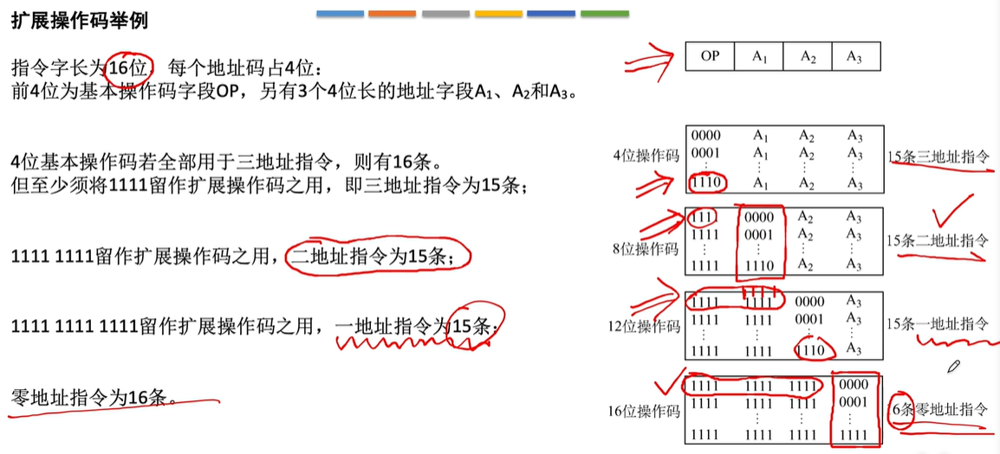

在设计扩展操作码指令格式时，必须注意以下两点：

1. **不允许短码是长码的前缀**，即短操作码不能与长操作码的前面部分的代码相同。（类似“哈夫曼编码”）
2. 各指令的操作码一定**不能重复**。

通常情况下，对使用频率较高的指令，分配较短的操作码；对使用频率较低的指令，分配较长的操作码，从而尽可能减少指令译码和分析的时间。

[4.1_2_扩展操作码指令格式_哔哩哔哩_bilibili](https://www.bilibili.com/video/BV1ps4y1d73V/?p=46&spm_id_from=pageDriver&vd_source=9d3c5a863c7c6dbd5152dd7c4e9dc492)

> eg.:
>
> 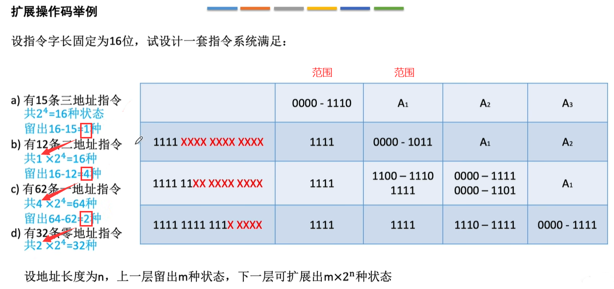


### 2.4根据操作类型

分为4种类型：

1. **数据传输类**：**数据传输**

2. **运算类**：**算术逻辑操作**、**移位操作**

3. **程序控制类**：**转移操作**

   改变程序执行流的顺序。

4. **输入输出类**（I/O）：**输入输出操作**

   进行CPU寄存器与IO端口之间的数据传送。

---

细分：

1. **数据传送**

   1. **LOAD**：把存储器中的数据放到寄存器中（存储器→寄存器）。
   2. **STORE**：把寄存器中的数据放到存储器中（寄存器→存储器）。

2. **算术逻辑操作**

   1. 算术：加、减、乘、除、增1、减1、求补、浮点运算、十进制运算。
   2. 逻辑：与、或、非、异或、位操作、位测试、位清除、位求反。

3. **移位操作**

   算术移位、逻辑移位、循环移位(带进位和不带进位)。

4. **转移操作**

   程序执行流的改变（如if else, 函数调用），会导致程序计数器PC的改变。

   1. 无条件转移 JMP
   2. 条件转移
      1. JZ：结果为0；
      2. JO：结果溢出；
      3. JC：结果有进位
   3. 调用和返回 CALL和RETURN
   4. 陷阱(Trap)与陷阱指令

5. **输入输出操作**

   CPU寄存器与IO端口之间的数据传送（端口即IO接口中的寄存器）。


## 3.指令寻址

指令寻址：确定下一条指令存放的地址。

**程序计数器PC**：指明一条指令的存放地址。

**【注意】Intel x86处理器中，程序计数器PC ( Program Counter）通常被称为IP（Instruction Pointer）。**


通常顺序存储的指令，下一条指令的地址：(PC)+1→PC

但是如果**按字节编址**、**采用变长指令字结构**则不行。


### 3.1顺序寻址

$$
(PC) + '1' →PC
$$

这里的1理解为1个指令字长，实际加的值会因指令长度、编址方式而不同。


- 该系统采用**==定长==指令字结构**
- **指令字长 = 存储字长** = 16bt = 2B（2字节）
- 主存**按==字==编址**

则：

**(PC) + 1 →PC**

---

- 该系统采用**==定长==指令字结构**
- **指令字长 = 存储字长** = 16bt = 2B（2字节）
- 主存**按==字节==编址**

则：

**(PC) + 2 →PC**

因为是2字节

---

- 该系统采用**==变长==指令字结构**
- **指令字长 != 存储字长** = 16bt = 2B（2字节）
- 主存**按==字节==编址**

则：


读入一个字，根据操作码判断这条**指令的总字节数n**，修改PC的值。

根据指令的类型，CPU可能还要进行多次访存，每次读入一个字。

**(PC) + n →PC**


### 3.2跳跃寻址

由**转移指令**指出。

取到#0指令之后，PC就加一了，#0执行完直接执行新的PC。

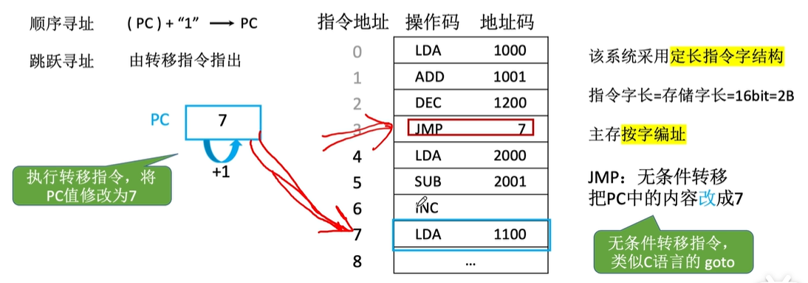


## 4.数据寻址

数据寻址：确定本条指令的地址码指明的**真实地址**。

因为指令存储不一定都是可以从0开始存储的，所以进行跳跃寻址，会跳到其他程序的指令。所以需要**对地址码进行解读**。

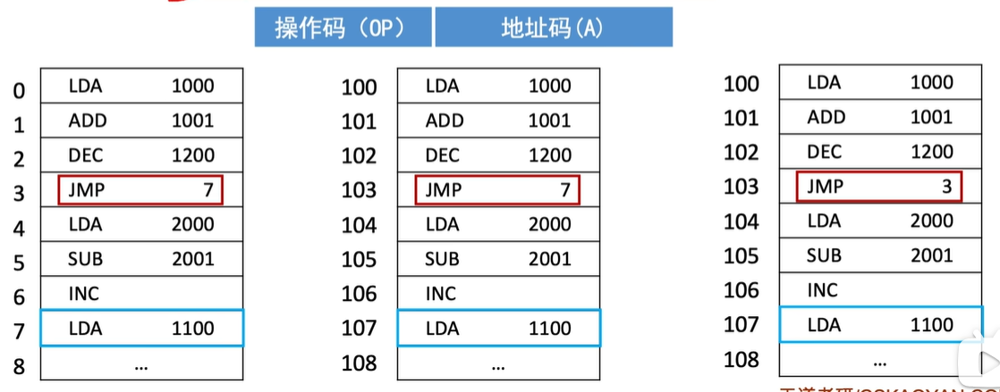

所以需要添加一个**寻址方式（寻址特征）**：


而且是每一个形式地址前都有一个寻址特征：


下面在 指令字长 = 机器字长 = 存储字长，操作数为3的情况下讨论：

EA一一effective address

### 4.1直接寻址

**EA = A**

访存次数（排除取指令）：1

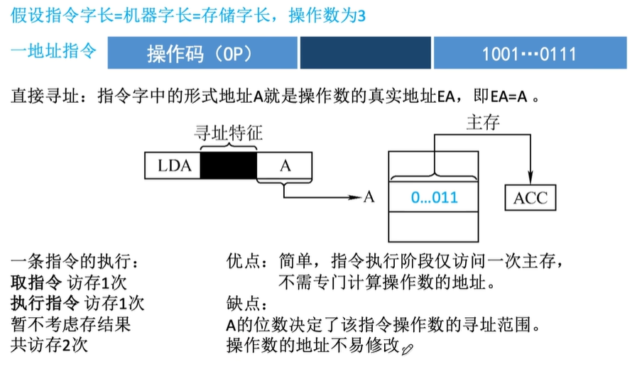

### 4.2间接寻址

**EA = (A)**

多次间接寻址，开始为0则表示EA = (A~n~)

访存次数（排除取指令）：2（一次间接寻址）...n

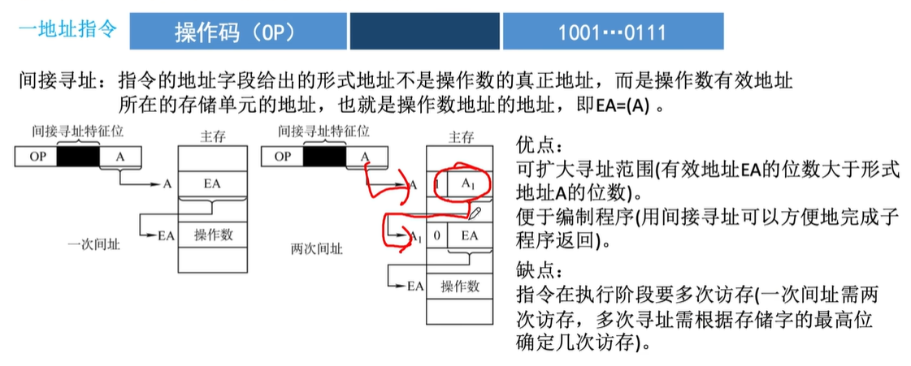

### 4.3寄存器寻址

**EA = R**

寄存器数量不会很多，所以字长较短且很快.

访存次数（排除取指令）：0

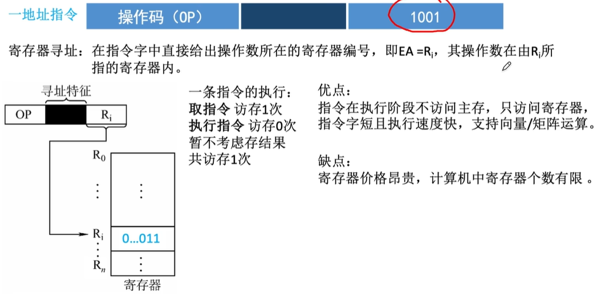

### 4.4寄存器间接寻址

**EA = (R)**

访存次数（排除取指令）：1...n-1

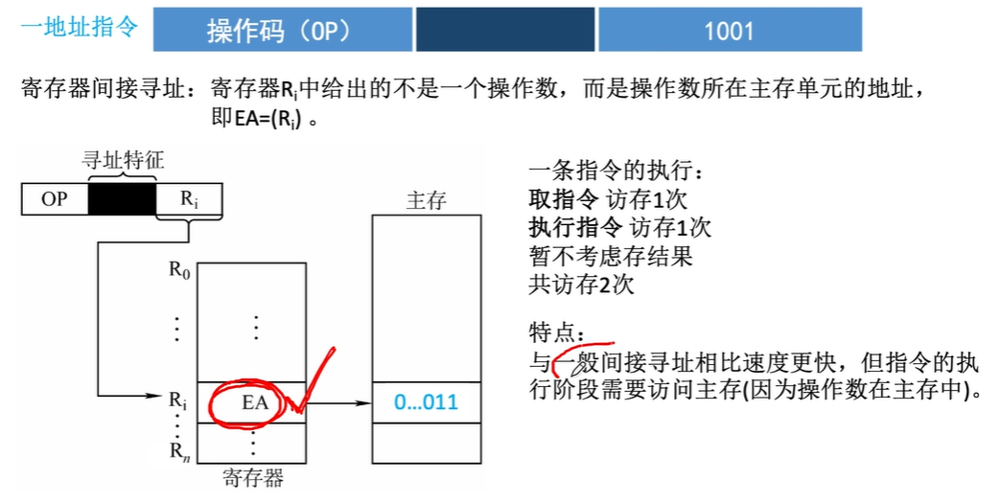

### 4.5隐含寻址

访存次数（排除取指令）：0

隐含寻址：不是明显地给出操作数的地址，而是在指令中隐含着操作数的地址。

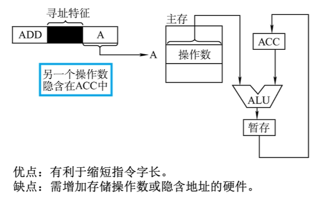

### 4.6立即寻址

访存次数（排除取指令）：0

立即寻址：形式地址A就是操作数本身，又称为**立即数**，一般采用补码形式。

`#`表示立即寻址特征。

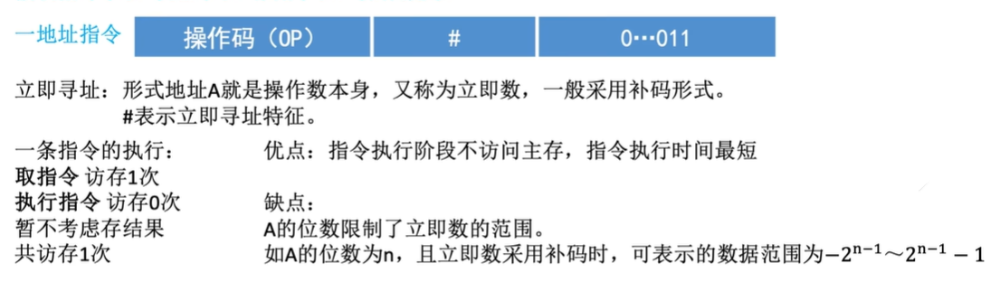


### 4.7偏移寻址

- **基址寻址**

**EA=(BR)+A**

以程序的起始存放地址作为“起点”。

在程序执行过程中，基址寄存器的内容BR不变（**BR作为基地址**），形式地址可变（**A作为偏移量**）。

- **变址寻址**

**EA=(IX)+A**

程序员自己决定从哪里作为“起点”。

在程序执行过程中，变址寄存器的内容可由用户改变（**IX作为偏移量**），形式地址A不变（**A作为基地址**）。

- **相对寻址**

**EA=(PC)+A**

以程序计数器PC所指地址作为“起点”。

其中**A是偏移量**，可正可负（前后都可以偏移），补码表示。


#### 4.7.1基址寻址

**EA=(BR)+A**

**基址寻址**：将CPU中基址寄存器（BR）的内容加上指令格式中的形式地址A，而形成操作数的有效地址，即EA=(BR)+A。

BR：base address register

**【注意】**基址寄存器是**面向操作系统**的，其内容由操作系统或管理程序确定。**程序员无法更改其内容**，当采用通用寄存器作为基址寄存器时，可由用户决定哪个寄存器作为基址寄存器，但其内容仍由操作系统确定。

在程序执行过程中，基址寄存器的内容BR不变（**BR作为基地址**），形式地址可变（**A作为偏移量**）。

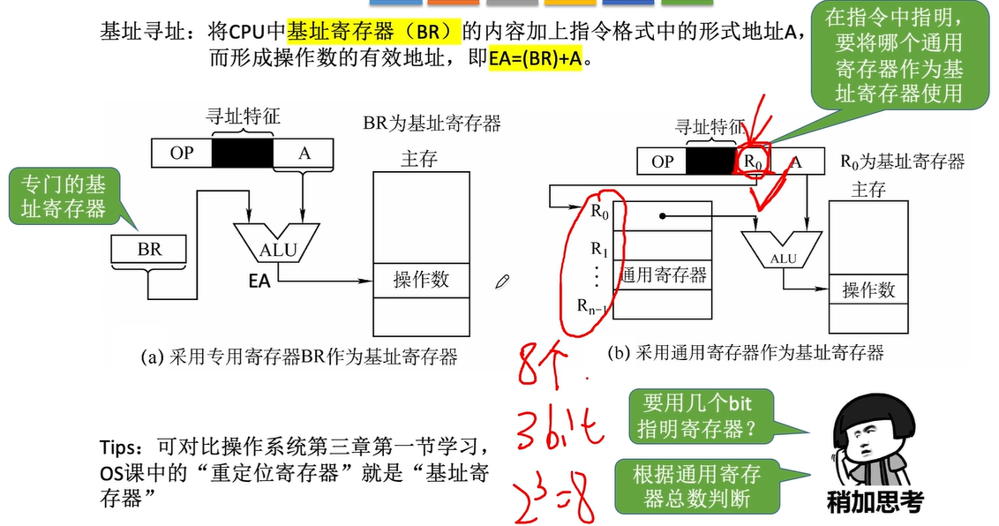

**如果有8个通用寄存器，那么R的大小就是3bit**。

**优点**：

1. 可扩大寻址范围（基址寄存器的位数大于形式地址A的位数）
2. 用户不必考虑自己的程序存于主存的哪一空间区域，便于**程序浮动**（整个程序在**内存**里边的浮动），方便实现多道程序并发运行。

【Tips】可对比操作系统第三章第一节学习，OS课中的“重定位寄存器”就是“基址寄存器”。


#### 4.7.2变址寻址

**EA=A+(IX)**

**变址寻址**：有效地址EA等于指令字中的形式地址A与变址寄存器IX的内容相加之和，即EA=(IX)+A，其中IX可为变址寄存器（专用），也可用通用寄存器作为变址寄存器。

IX：index register

**【注意】**变址寄存器是**面向用户**的，在程序执行过程中，变址寄存器的内容可由用户改变（**IX作为偏移量**），形式地址A不变（**A作为基地址**）。

（刚好和基址寻址相反）

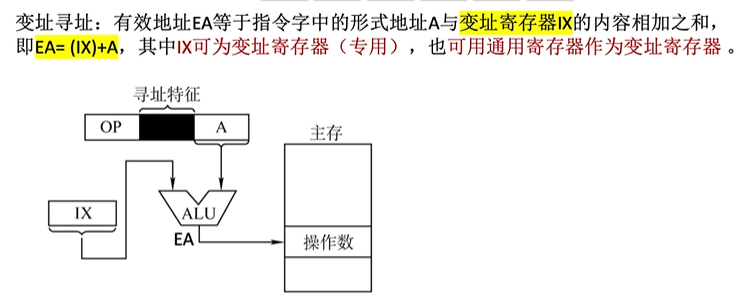

优点：在数组处理过程中，可设定A为数组的首地址，不断改变变址寄存器IX的内容，便可很容易形成数组中任一数据的地址，特别适合编制**循环程序**。

----

【注意】实际使用中往往需要多种寻址方式复合使用（可理解为复合函数）

如先基址寻址，再变址寻址。


#### 4.7.3相对寻址

**EA=(PC)+A**

**相对寻址**：把程序计数器pc的内容加上指令格式中的形式地址A而形成操作数的有效地址，即EA=(PC)+A，其中A是相对于PC所指地址的偏移量，可正可负（前后都可以偏移），补码表示。

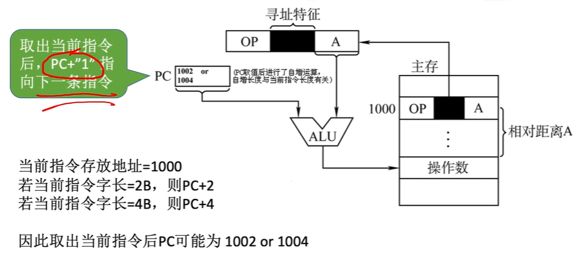

优点：操作数的地址不是固定的，它随着PC值的变化而变化，并且与指令地址之间总是相差一个固定值，因此便于**程序浮动**（一段代码在**程序内部**的浮动）。

相对寻址广泛应用于**转移指令**。


### 4.8堆栈寻址

**堆栈寻址**：操作数存放在堆栈中，隐含使用**堆栈指针**（SP，Stack Pointer）作为操作数地址。

堆栈是存储器（或专用寄存器组）中一块特定的按“后进先出(LIFO)”原则管理的存储区，该存储区中被读/写单元的地址是用一个特定的寄存器给出的，该寄存器称为**堆栈指针（SP）**。

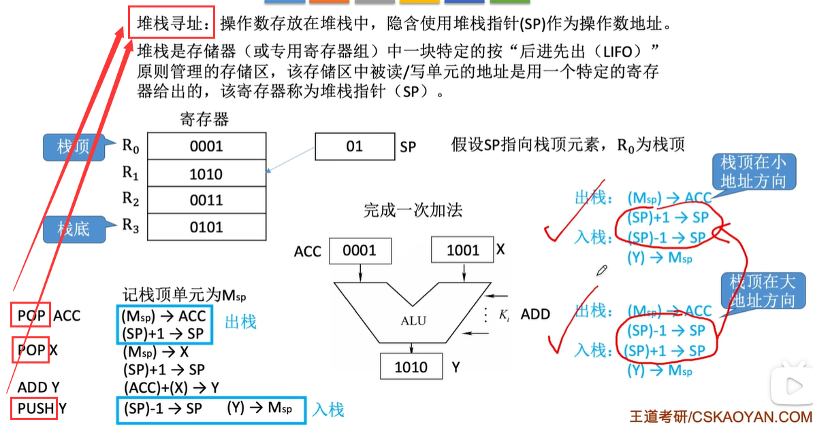

上图是硬堆栈。

- **硬堆栈**：专门用寄存器来实现堆栈存贮。

  因为堆栈不在内存，在寄存器。所以压入、弹出不需要访存，速度快，同时成本高。

- **软堆栈**：不使用专门的硬件，而是在内存之中划分出一片区域来作为“堆栈”使用。

  堆栈在内存，所以压入、弹出需要访存，速度慢，但是成本低。

实际一般用**软堆栈更多**。

堆栈可用函数调用时保存当前函数的相关信息。


## 5.==汇编语言==

高级语言与机器级代码之间的对应：

汇编语言和机器语言都是**机器级代码**，是一一对应的。

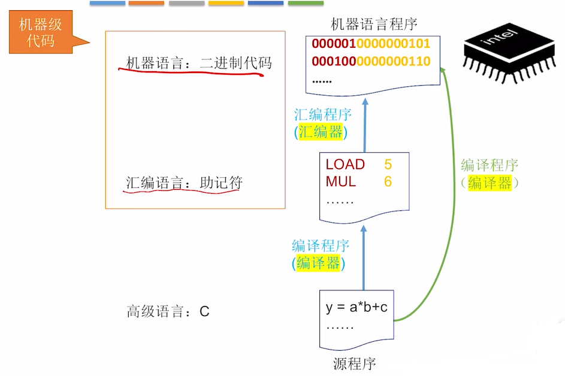

### 5.1考试要求

- 只需关注**x86**汇编语言；若考察其他汇编语言题目会详细注释。
- 题目给出某段简单程序的c语言、汇编语言、机器语言表示。能结合c语言看懂汇编语言的关键语句（看懂常见指令、选择结构、循环结构、函数调用）。
- 汇编语言、机器语言一一对应，要能结合汇编语言分析机器语言指令的格式、寻址方式。

不会考：将c语言人工翻译为汇编语言或机器语言。


### x86汇编语言

mov为例子：

```assembly
mov 要移动到的位置destination, 被移动的内容/位置source;

mov eax, ebx				#寄存器→寄存器
mov eax, dword ptr [af996h]	#主存→寄存器
mov eax, 5 					#立即数→寄存器

#将ebx所指主存地址的32bit复制到eax寄存器中（寄存器间接寻址）
mov eax, dword ptr [ebx]	
mov eax,[ebx]				#若未指明主存读写长度，默认32 bit

#将eax的内容复制到af996h所指的地址
mov [af996h], eax			#未指明长度默认32bit

#将eax的内容复制到ebx所指主存地址的32bit
mov dword ptr [ebx], eax

#将ebx所指的主存地址的8bit复制到eax
mov eax, byte ptr [ebx]

#将ebx+8所指主存地址的32bit 复制到eax寄存器中
mov eax, dword ptr [ebx+8]
#将af996-12所指主存地址的 32bit复制到eax寄存器中
mov eax, dword ptr [af996-12h]
```


### 5.2地址码

#### x86架构CPU，有哪些寄存器？

每个寄存器都是32bit，32bit = Extended = **E**。

都是**E**开头的，包含32bit数据。

1. 通用寄存器 X

   - **EAX**
   - **EBX**
   - **ECX**
   - **EDX**

2. 变址寄存器 I = index

   变址寄存器可用于**线性表**、**字符串**的处理。

   - **ESI**： source index（被移动的）
   - **EDI**： destination index（要移动到的目的）

3. 堆栈寄存器 P = pointer

   用于**函数调用**。

   - **EBP**： 堆栈**基**指针base pointer
   - **ESP**： 堆栈**顶**指针stack pointer 

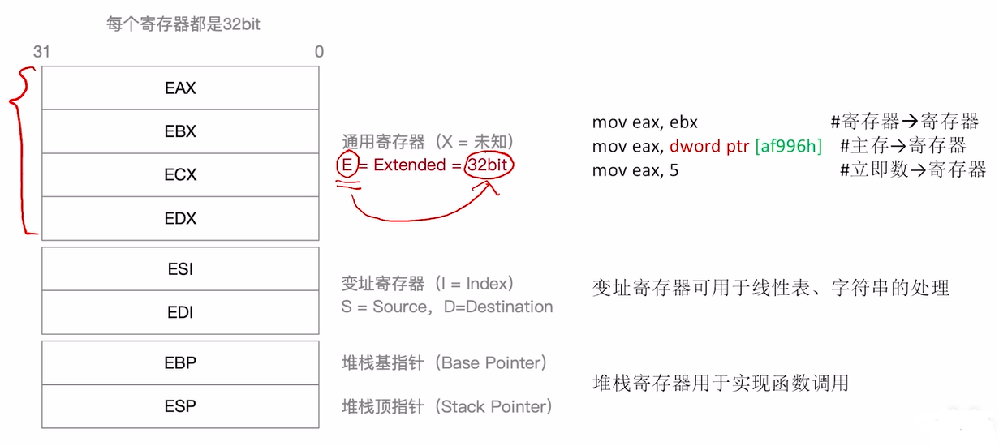

- 通用寄存器还可以使用一半寄存器（低16位）

AX, BX, CX, DX：1**6bit**

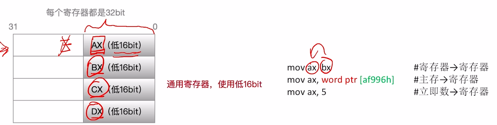

两个变址寄存器只能固定使用32bit；
两个堆栈寄存器只能固定使用32bit。

- 甚至还可以使用1/4=8bit：

AL, AH
BL, BH

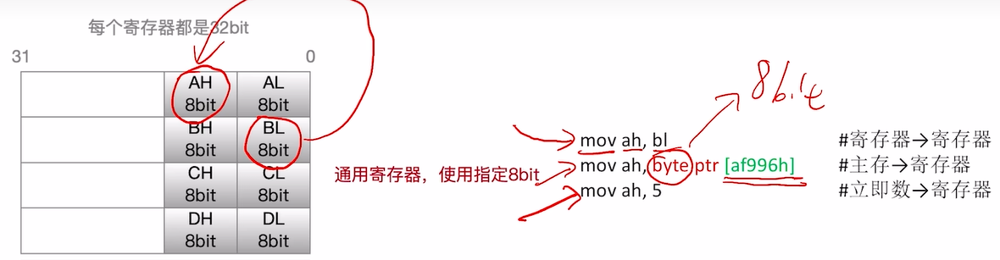

#### 总结

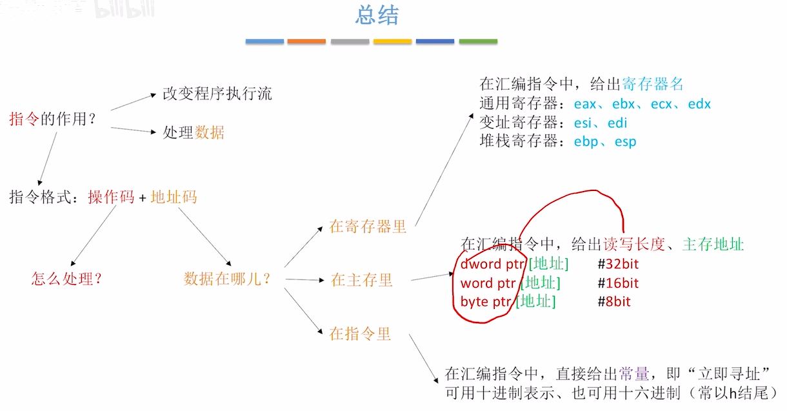

### 5.3操作码

```assembly
操作码 地址码
操作码 d, s

#王道书中:
add <reg>/<mem>, <reg>/<mem>/<con>
#要注意，一般不建议同时访问两个主存：
add <mem>, <mem>	# ×，访存太多是不可以的
```

- destination：目的地（d 目的操作数）
- source：来源地（s 源操作数）

目的操作数**d不可以是常量**，因为进行完操作之后还要把数据放到d的位置。

还有：

- `reg`：寄存器register
- `mem`：内存memory
- `con`：常数constant


#### 5.3.1算术运算

| 功能     | 英文     | 汇编指令                | 注释                                                         |
| -------- | -------- | ----------------------- | ------------------------------------------------------------ |
| 加       | add      | add d, s                | #计算d+s，结果存入d                                          |
| 减       | subtract | sub d, s                | #计算d-s，结果存入d                                          |
| 乘       | multiply | mul d, s<br />imul d, s | #无符号数d\*s，乘积存入d<br />#有符号数d\*s，乘积存入d       |
| 除       | divide   | div s<br />idiv s       | #无符号数除法：edx:eax/s，商存入eax，余数存入edx<br />#有符号数除法：edx:eax/s，商存入eax，余数存入edx |
| 取负数   | negative | neg d                   | #将d取负数，结果存入d                                        |
| 自增 ++  | increase | inc d                   | #将d++，结果存入d                                            |
| 自减 - - | decrease | dec d                   | #将d--，结果存入d                                            |

【注意】除法（被除数/除数）用到了隐含寻址，s是除数，而被除数提前放到了edx和eax。

**【注意！】add d, s在这里是(d)+(s)→(d)，**

**但是有的是写add s, d就是(d)+(s)→(d)**。


#### 5.3.2逻辑运算

| 功能 | 英文         | 汇编指令 | 注释                                    |
| ---- | ------------ | -------- | --------------------------------------- |
| 与   | and          | and d, s | #将d、s逐位相与，结果放回d              |
| 或   | or           | or d, s  | #将d、s 逐位相或，结果放回d             |
| 非   | not          | not d    | #将d逐位取反，结果放回d                 |
| 异或 | exclusive or | xor d, s | #将d、s逐位异或，结果放回d              |
| 左移 | shift left   | shl d, s | #将d逻辑左移s位，结果放回d(通常s是常量) |
| 右移 | shift right  | shr d, s | #将d逻辑右移s位，结果放回d(通常s是常量) |


#### 5.3.3其他

1. 用于实现**分支结构、循环结构**的指令：
   - `cmp`：比较。
   - `test`
   - `jmp`：直接跳转。
   - `jxxx`：条件跳转。
   - `loop`：封装循环。
2. 用于实现**函数调用**的指令：
   - `push`：放入函数调用栈。
   - `pop`：从函数调用栈出栈。
   - `call`：函数调用。
     - ①将**IP旧值**压栈保存（保存在函数的栈帧顶部）；
     - ②设置**IP新值**，无条件转移至被调用函数的第一条指令。
   - `ret`：函数返回。
     - 从函数的栈帧顶部找到**IP旧值**，将其出栈并恢复IP寄存器。
3. 用于实现**数据转移**的指令：`mov`

**【注意】Intel x86处理器中，程序计数器PC ( Program Counter）通常被称为IP（Instruction Pointer）。**


---

### 5.4循环分支

#### 5.4.1 jmp直接跳转指令

jmp（jump）

```assembly
jmp <address>

jmp 124
jmp eax
jmp [985]

#其中:
exa = 124
[985] = 124
```

这个地址可以是直接一个数字，也可以是寄存器或者主存

但是其实程序员其实是不知道指令在内存的位置，所以使用**`NEXT:`标号**来锚定位置。

（**标号**，有**冒号**就是，NEXT是名字，可以自己改）。

例如：

```assembly
mov eax, 1
mov ebx, 2
jmp BIAOHAO
add ebx, 2
BIAOHAO:
add ebx, exa
```


#### 5.4.2 jxxx条件跳转指令

先**比较`cmp`**两个数：

cmp本质上是进行a-b减法运算，并生成标志位OF、ZF、CF、SF，放入PSW程序状态字寄存器（Intel称其为“标志寄存器”）。

```assembly
cmp d, s
```

然后紧跟跳转指令：

```assembly
#jump when equal，若a==b则跳转
je <地址>

#jump when not equal，若a != b则跳转
jne <地址>

#jump when greater than，若a>b则跳转
jg <地址>

#jump when greater than or equal to，若a>=b则跳转
jge <地址>

#jump when less than，若a<b则跳转
jl <地址>

#jump when less than or equal to，若a<=b则跳转
jle <地址>
```

- **e**：等于equal
- **n**：不not
- **g**：大于greater
- **l**：小于less

例如：

```assembly
cmp eax, ebx
je NEXT
```


#### 分支C→汇编

那么就可以把c语言的代码翻译为汇编代码（机器级表示）

C：

```c
int a=7;
int b=6;

if(a>b){
	c=a;
}else{
	c=b;
}
```

assembly：

```assembly
mov eax,7		#假设变量a=7,存入eax
mov ebx,6		#假设变量b=6,存入ebx

cmp eax,ebx		#比较变量a和b
jg NEXT			#若a>b，转移到NEXT:

# 如果没有跳转，那么顺序执行，就是else

mov ecx ,ebx	#假设用ecx存储变量c，令c=b
jmp END			#无条件转移到END:
NEXT:
mov ecx ,eax	#假设用ecx存储变量c,令c=a
END:
```


#### 循环C→汇编

用条件转移指令实现循环，需要4个部分构成：

①循环前的初始化

②是否直接跳过循环?

③循环主体

④是否继续循环?

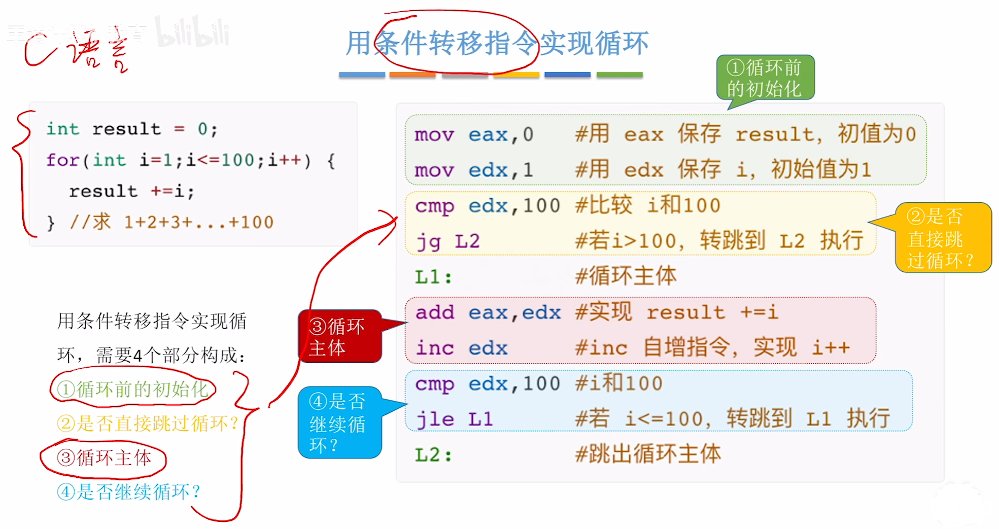

#### 用loop指令实现循环

**【注意】loop默认使用ECX作为循环计数器**（只能是ECX）。

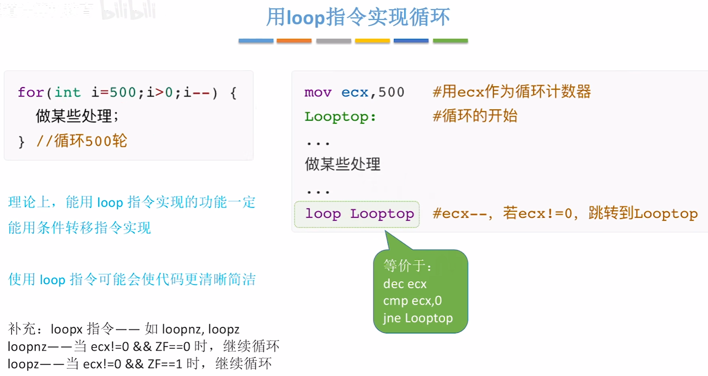


### 5.5==函数调用==

函数的**栈帧（ Stack Frame）**：保存函数大括号内定义的局部变量、保存函数调用相关的信息。

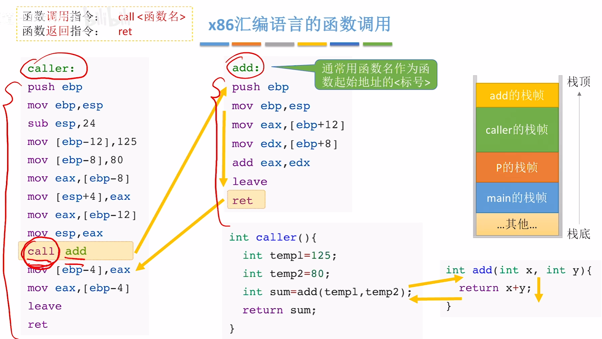


#### 5.5.1函数调用栈在内存中的位置


地址码中的堆栈寄存器（P，pointer）用于**函数调用**。

- **EBP**： 堆栈**基**指针base pointer，指向栈的**底部**。
- **ESP**： 堆栈**顶**指针stack pointer ，指向栈的**顶部（下面是“顶”，开口的）**。


#### 5.5.2两种方式访问栈帧数据

`push`、`pop`指令实现入栈、出栈操作，x86默认以**4字节为单位**。指令格式如：

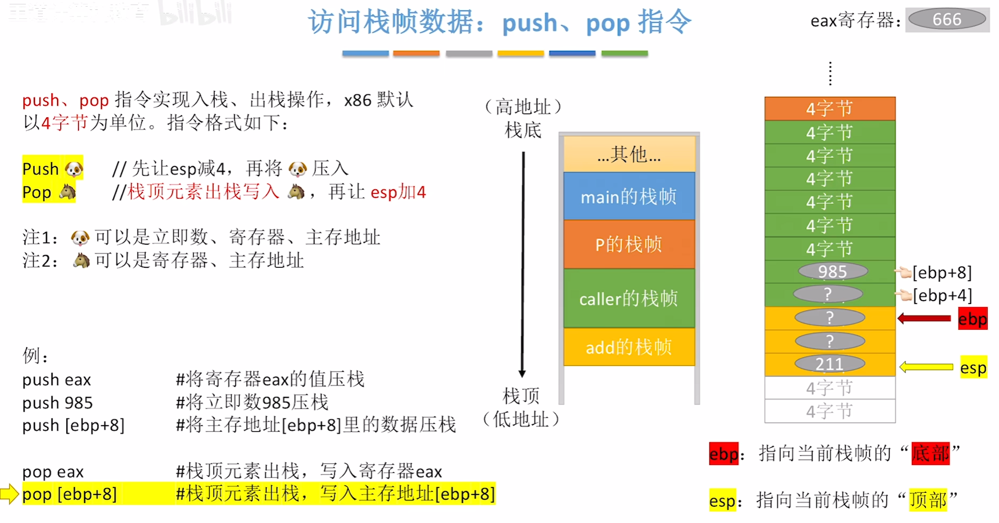

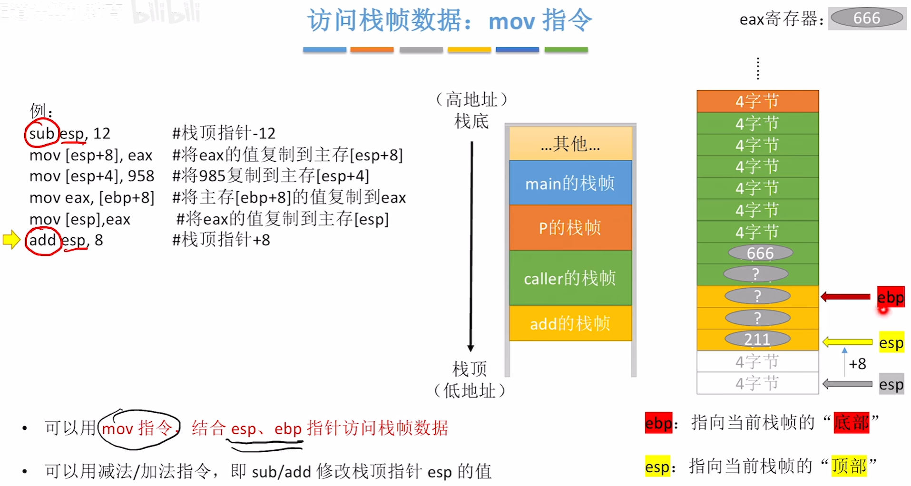


#### 5.5.3函数调用时，如何切换栈帧

在每一个函数**前**加上“例行处理”

```assembly
push ebp		#保存上一层函数的栈帧基址(ebp旧值)
mov ebp, esp	#设置当前函数的栈帧基址(ebp新值)

#等价于：
enter			#零地址指令，进入
```

在函数结束的时候，就移除函数栈，例行处理：

```assembly
mov esp, ebp	#让esp指向当前栈帧的底部
pop ebp			#将esp所指元素出栈，写入寄存器ebp

#等价于：
leave
```

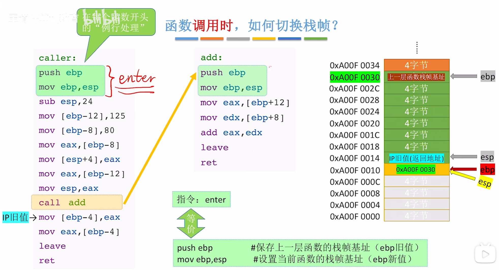


#### 5.5.4一个栈帧内可能包含哪些内容?

一个**函数栈**：

==0xFFFF FFFF==

==**栈底**==

==EBP==

==**向上（栈底）是加**==

==**向下（栈顶）是减**==

==ESP==

==**栈顶**==

==0x0000 0000==

【技巧】**栈**就是和**函数**有关，**堆**是和**数据**有关。

----

1. **上一层栈帧基址**：栈帧最**底**部一定是**上一层栈帧基址**（ebp旧值）。
2. **返回地址**：栈帧最**顶**部一定是**返回地址**（当前函数的栈帧除外）。
3. **局部变量**：保存在**栈底**，如果出现`[ebp-4]`（最后一个定义的变量）或`ebp-8`这种，一般是局部变量。
4. **调用参数**：保存在**栈顶**，`[ebp+8]`（第一个调用参数），`ebp+12`（第二个调用参数）...。
   为什么是+8，因为+4保存了IP(PC)返回地址。这里的ebp不是上面的ebp，而是调用参数的ebp，属于上面函数的esp。
5. **空闲**：gcc编译器将每个栈帧大小设置为16B的整数倍（当前函数的栈帧除外），因此栈帧内可能出现**空闲**未使用的区域。

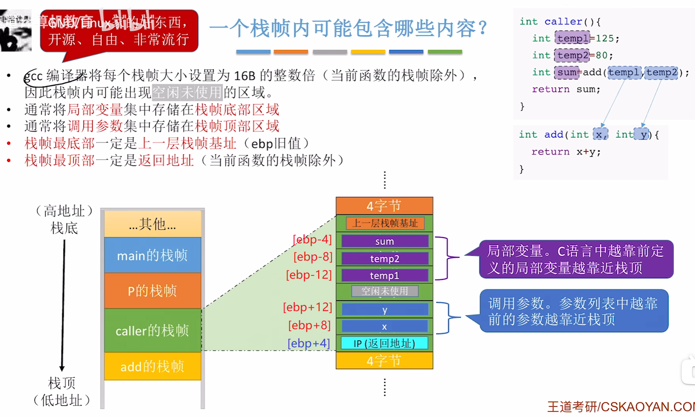

具体：

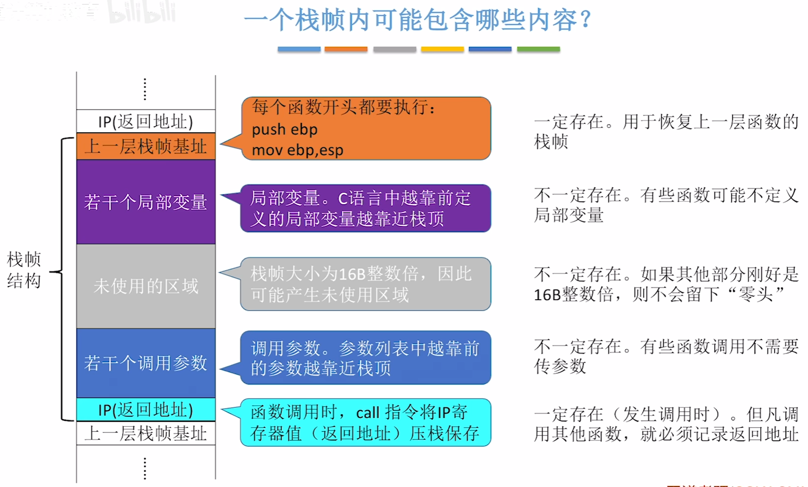

#### 5.5.5如何传递参数和返回值

[4.3_6_4_如何传递参数和返回值(函数调用的机器级表示)_哔哩哔哩_bilibili](https://www.bilibili.com/video/BV1ps4y1d73V/?p=59&spm_id_from=pageDriver&vd_source=9d3c5a863c7c6dbd5152dd7c4e9dc492)

相加之后，最终的结果存储在EAX，那么leave之后，caller函数只需要从EAX种就可以取到返回值。

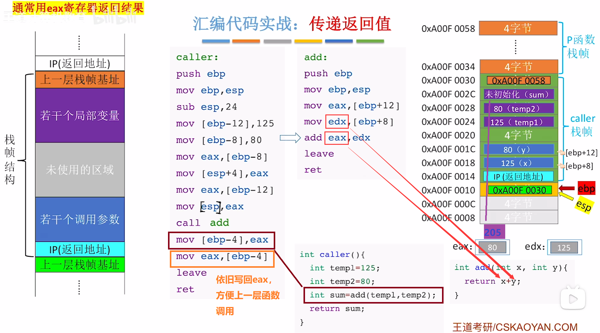

#### 总结

除了main函数，其他所有函数的汇编代码结构都一样！

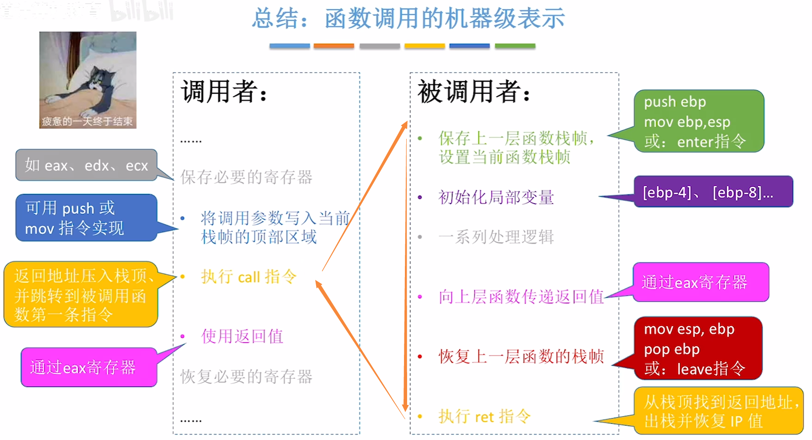


### 5.6汇编格式

**AT&T** 格式：Unix、Linux的常用格式。

**intel** 格式：Windows的常用格式。（**408常考，也是我们这里讲的**）

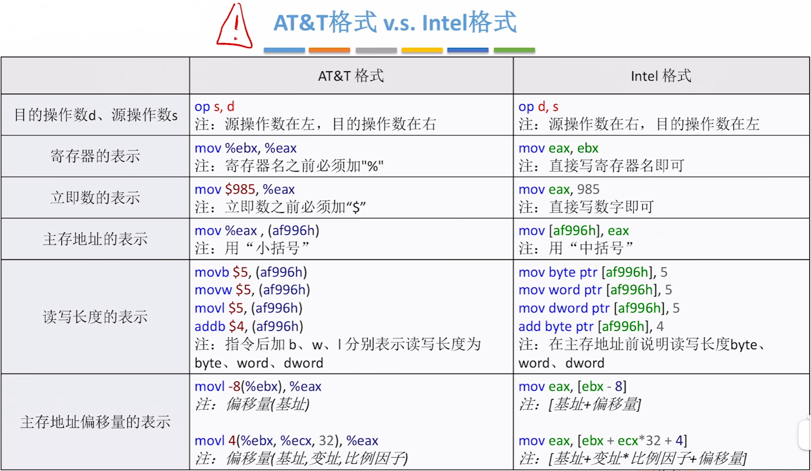


## 6.CISC和RISC

**CISC**： 复杂指令集计算机，Complex Instruction Set Computer

设计思路：一条指令完成一个复杂的基本功能。

一条指令可以由一个专门的电路完成。有简单的指令，有复杂的指令。有的复杂指令用纯硬件实现很困难，采用“存储程序”的设计思想，由一个比较通用的电路配合存储部件完成一条指令。

代表：**x86架构**，主要用笔记本、台式机等。


**80-20规律**：典型程序中80%的语句仅仅使用处理机中20%的指令。所以指令集不需要太过于复杂，所以有RISC。


**RISC**： 精简指令集计算机，Reduced lnstruction Set Computer

设计思路：一条指令完成一个基本“动作”。多条指令组合完成一个复杂的基本功能。

一条指令一个电路，电路设计相对简单，功耗更低

代表：**ARM架构**，主要用于手机、平板等。


- 对比：

|                  | CISC                                 | RISC                                 |
| ---------------- | ------------------------------------ | ------------------------------------ |
| 指令系统         | 复杂、庞大                           | 简单、精简                           |
| 指令数目         | 一般大于200条                        | 一般小于100条                        |
| 指令字长         | 不固定                               | 定长                                 |
| 可访问指令       | 不加限制                             | 只有load/store指令                   |
| 各种指令执行时间 | 相差较大                             | 绝大多数在一个周期完成               |
| 各种指令使用频率 | 相差很大                             | 都比较常用                           |
| 通用寄存器数量   | 较少                                 | 多                                   |
| 目标代码         | 难以用优化编译生成高效的目标代码程序 | 采用优化的编译程序，生成代码较为高效 |
| 控制方式         | 绝大多数为**微程序控制**（效率低）   | 绝大多数为**组合逻辑控制**（效率高） |
| 指令**流水线**   | 可以通过一定方式实现                 | 必须实现                             |


## 7.总结

1. 指令格式：如何用二进制代码表示指令
2. 指令寻址方式：
   1. 给出下一条指令的地址
   2. 给出要操作的对象的地址
3. CISC和RISC：两种设计方向
