# 五、中央处理器

[toc]

## 1.CPU的功能与结构


**存储程序**的概念是指将指令以代码形式事先输入计算机的主存储器，然后按其在存储器中的首地址执行程序的第一条指令，以后就按程序的规定顺序执行其他指令，直至程序执行结束。


CPU和主存之间通过一组**总线**相连，总线中有**地址、控制、数据**3组信号线。

MAR（主存地址寄存器）中的地址信息会直接送到地址线上，用于指向读/写操作的主存存储单元；

控制线中有读/写信号线，指出数据是从CPU写入主存还是从主存读出到CPU，根据是读操作还是写操作来控制将MDR中的数据是直接送到数据线上还是将数据线上的数据接收到MDR中。


### 1.1CPU寄存器、功能

#### 1.1.1功能

1. **指令控制**。完成取指令、分析指令和执行指令的操作，即程序的顺序控制。
2. **操作控制**。一条指令的功能往往是由若干操作信号的组合来实现的。CPU管理并产生由内存取出的每条指令的操作信号，把各种操作信号送往相应的部件，从而控制这些部件按指令的要求进行动作。
3. **时间控制**。对各种操作加以时间上的控制。时间控制要为每条指令按时间顺序提供应有的控制信号。
4. **数据加工**。对数据进行算术和逻辑运算。
5. **中断处理**。对计算机运行过程中出现的异常情况和特殊请求进行处理。

【注意】CPU不包含**地址译码器**。


#### 1.1.2==【考点】寄存器==

- <u>用户可以看到的寄存器</u>
  1. **通用寄存器**：用于暂存操作数和中间结果，如**累加器ACC**，**乘商寄存器MQ**，**操作数寄存器X**，**变址寄存器IX**，**基址寄存器(堆栈寄存器)BR**等，其中**ACC,MQ,X是必须有的**。
     - 字长取决于机器字长。
  2. **地址寄存器**
  3. **数据寄存器**
  4. **PC 程序寄存器（程序计数器）**：用于指出下一条指令在主存中的存放地址。CPU就是根据PC的内容去主存中取指令的。因程序中指令(通常）是顺序执行的，所以PC有自增功能。
     - PC用于存放当前欲执行指令的地址，可自动+1以形成下一条指令的地址，与主存的**MAR**之间有一条直接通路。
     - 大小（PC位数）：$\cfrac{空间大小}{字长}$.
  5. **PSW 程序状态字寄存器**：也称标志寄存器，用于存放ALU运算得到的一些标志信息或处理机的状态信息。保留由算术逻辑运算指令或测试指令的结果而建立的各种状态信息，如溢出标志（OP）、符号标志（SF）、零标志（ZF）、进位标志（CF）等。PSW中的这些位参与并决定微操作的形成。
  5. **虚拟存储器**（系统程序员可见，但是应用程序员透明）


- <u>控制和状态寄存器（用户看不到的寄存器，即“透明”）</u>

  > [【详解】计算机术语“透明”是什么意思？“对.....是透明的”怎样理解？_透明是可见还是不可见](https://blog.csdn.net/weixin_51350847/article/details/141818403)

  1. **MAR 存储器地址寄存器**：用于存放所要访问的主存单元的地址。
  - 长度：地址码长度
  2. **MDR 存储器数据寄存器**：用于存放向主存写入的信息或从主存中读出的信息。

     - 长度：存储字长
  3. **IR 指令寄存器**：用于保存当前正在执行的那条指令，就是一条**指令OP+Ad**。
     - IR用来存放当前的指令，其内容来自主存的MDR，所以大小取决于MDR的大小，也就是存储字长。
     - 指令中的操作码OP（IR）送至**CU**，用以分析指令并发出各种微操作命令序列。
     - 地址码Ad(IR)送往MAR，用以取操作数。（操作码表示机器所执行的各种操作，地址码表示参加运算的数在存储器内的位置）。
  4. **uIR 微程序寄存器**
  5. **cache**
  6. **中断标记寄存器**
  7. **DR 暂存寄存器**（应用程序员透明）


### 1.2运算器

运算器是计算机的执行部件，用于进行算术运算和逻辑运算。

算术运算是按算术运算规则进行的运算，如加、减、乘、除；
逻辑运算包括与、或、非、异或、比较、移位等运算。

#### 1.2.1基本结构

1. **算术逻辑单元ALU**（Arithmetic and Logical Unit），运算器的核心。
2. **通用寄存器组**，用于暂存操作数和中间结果，如**累加器ACC**，**乘商寄存器MQ**，**操作数寄存器X**，**变址寄存器IX**，**基址寄存器(堆栈寄存器)BR**等，其中**ACC,MQ,X是必须有的**。
   - **累加寄存器ACC**用于暂时存放ALU运算的结果信息，实现加法运算。
3. **暂存寄存器**：用于暂存从主存读来的数据，这个数据不能存放在通用寄存器中，否则会破坏其原有内容。
4. **程序状态字寄存器PSW**：也称标志寄存器，用于存放ALU运算得到的一些标志信息或处理机的状态信息。保留由算术逻辑运算指令或测试指令的结果而建立的各种状态信息，如溢出标志（OP）、符号标志（SF）、零标志（ZF）、进位标志（CF）等。PSW中的这些位参与并决定微操作的形成。
5. **移位器**：对运算结果进行移位运算。
6. **计数器**：控制乘除运算的操作步数。


---

#### 1.2.2 ALU和寄存器的数据通路

> 详见本章第三节 3.数据通路

1. **专用数据通路方式**：根据指令执行过程中的数据和地址的流动方向安排连接线路。
   性能较高，基本不存在数据冲突现象，但结构复杂，硬件量大，不易实现。

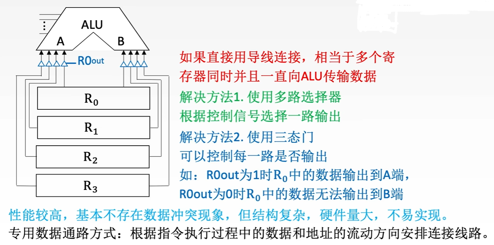

2. **CPU内部单总线方式**：将所有寄存器的输入端和输出端都连接到一条公共的通路上。
   结构简单，容易实现，但数据传输存在较多冲突的现象，性能较低。

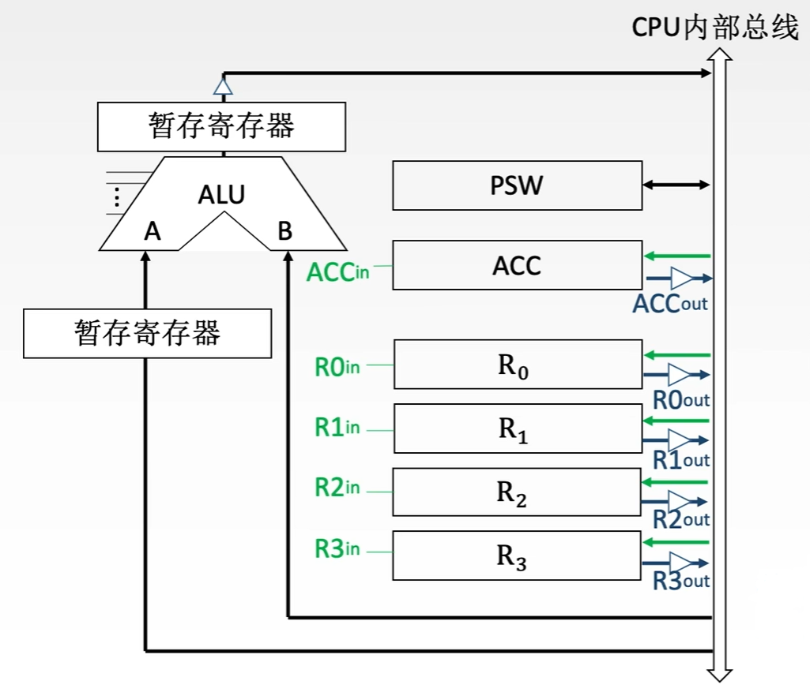

### 1.3控制器

控制器是计算机的指挥中心，协调并控制计算机各部件执行程序的指令序列。

控制器功能：**从主存储器取指令，分析指令，并产生有关的操作控制信号**。

**控制器**可以区分存储单元里面是**指令**还是**数据**。

#### 1.3.1基本结构

控制器由**程序计数器PC**、**指令寄存器IR**、**控制单元CU（control unit）**组成。

- **PC**用于存放当前欲执行指令的地址，可自动+1以形成下一条指令的地址，与主存的**MAR**之间有一条直接通路。
- **IR**用来存放当前的指令，其内容来自主存的MDR。指令中的操作码OP（IR）送至**CU**，用以分析指令并发出各种微操作命令序列；地址码Ad(IR)送往MAR，用以取操作数。（操作码表示机器所执行的各种操作，地址码表示参加运算的数在存储器内的位置）。

控制器CU又包含五大部件：

1. **指令译码器ID** instruction decoder
2. **操作控制器OC** operation controller
3. **时序发生器ST** sequence timer

上面3个也可以看作控制单元CU。

两个寄存器

4. **程序计数器PC** program count

5. **指令寄存器IR** instruction register

---

详细：

1. **程序计数器PC**（program count）。用于指出下一条指令在主存中的存放地址。CPU就是根据PC的内容去主存中取指令的。因程序中指令(通常）是顺序执行的，所以Pc有自增功能。
2. **指令寄存器IR**（instruction register）。用于保存当前正在执行的那条指令，就是一条**指令OP+Ad**。
3. **指令译码器ID**（instruction decoder）。**仅**对**操作码字段**进行译码，向控制器提供特定的操作信号。
   - 操作控制器OP，operation controller。
4. **微操作信号发生器**。根据IR的内容（指令）、PSW的内容（状态信息）及时序信号，产生控制整个计算机系统所需的各种控制信号，其结构有组合逻辑型和存储逻辑型两种。
5. **时序系统**。用于产生各种时序信号，它们都是由统一时钟（CLOCK）分频得到。
6. **存储器地址寄存器MAR**。用于存放所要访问的主存单元的地址。
   - 长度：地址码长度

7. **存储器数据寄存器MDR**。用于存放向主存写入的信息或从主存中读出的信息。
   - 长度：存储字长


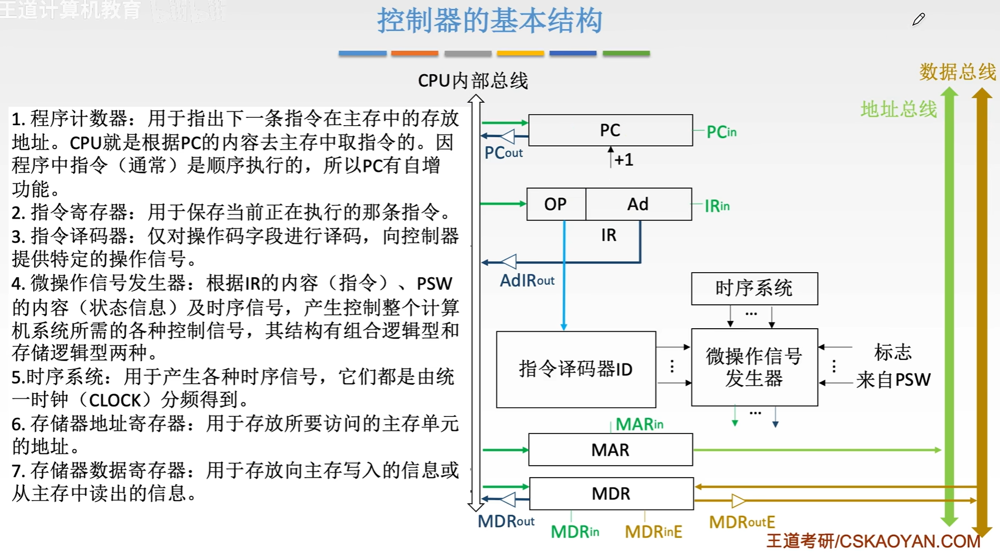

#### 1.3.2控制器功能

1. **取指令**。自动形成指令地址；自动发出取指令的命令。
2. **分析指令**。操作码译码(分析本条指令要完成什么操作)；产生操作数的有效地址。
3. **执行指令**。根据分析指令得到的“操作命令”和“操作数地址”，形成操作信号控制序列，控制运算器、存储器以及l/O设备完成相应的操作。
4. **中断处理**。管理总线及输入输出；处理异常情况(如掉电)和特殊请求(如打印机请求打印一行字符)。


### 1.4CPU的基本结构

橙色寄存器是对用户可见的，灰色不可见。


CPU就可以主要分为**ALU**、**CU**、**寄存器**、**中断系统**四大部分。

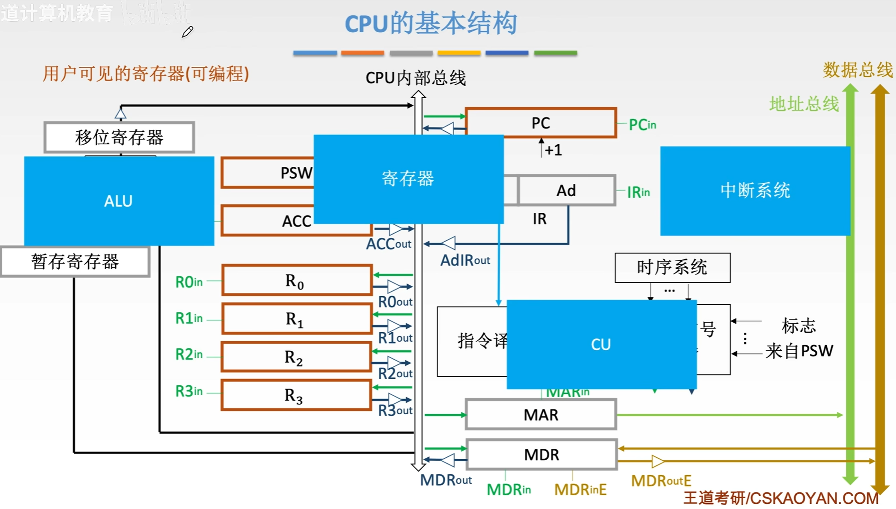


## 2.指令执行过程

### 2.1指令周期

**指令周期**：CPU从主存中每**取出并执行**一条指令所需的全部时间。

指令周期常常用若干**机器周期**（也叫**CPU周期**）来表示。

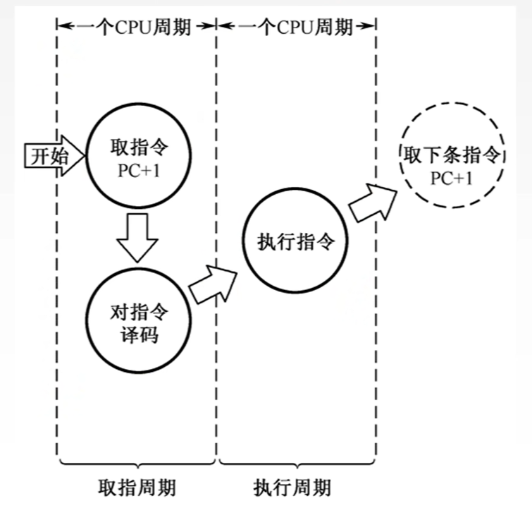

一个机器周期又包含若干**时钟周期**（也称为节拍、T周期或CPU时钟周期，它是**CPU操作的最基本单位**）。

> **CPU主频**：3.0GHz，就是1秒中CPU发出3G CPU内数字脉冲信号震荡。

#### ==【考点】周期：包含关系==

- **指令周期**：CPU从主存中每**取出并执行**一条指令所需的全部时间。
  - **机器周期（CPU周期）**：由存取周期决定大小。
    - **时钟周期（节拍、T周期、CPU时钟周期）**：最小时间周期。

> 谐音：知几时

**都可以不等**：每个指令周期内机器周期数可以不等，每个机器周期内的节拍数也可以不等。

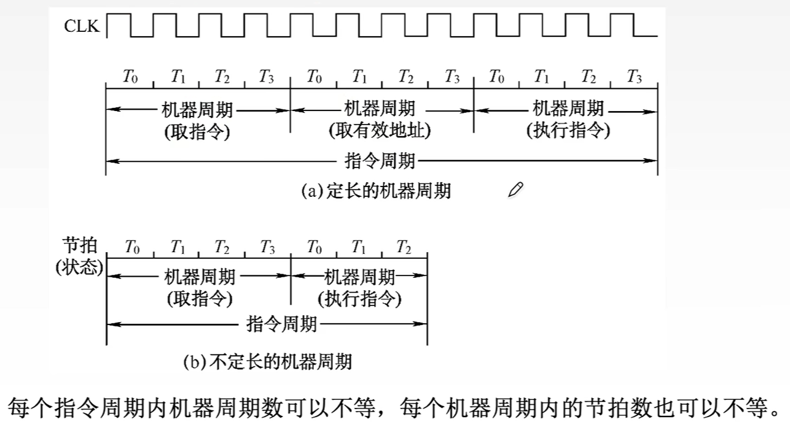

四个常见性质：

1. 一个节拍内可以**并行**完成多个“相容的”微操作。
2. 同一个微操作可能在不同指令的不同阶段被使用。
3. 不同指令的执行周期所需节拍数各不相同。为了简化设计，选择**定长的机器周期**，以可能出现的最大节拍数为准（通常以访存所需节拍数作为参考）。
4. 若实际所需节拍数较少，可将微操作安排在机器周期末尾几个节拍上进行。


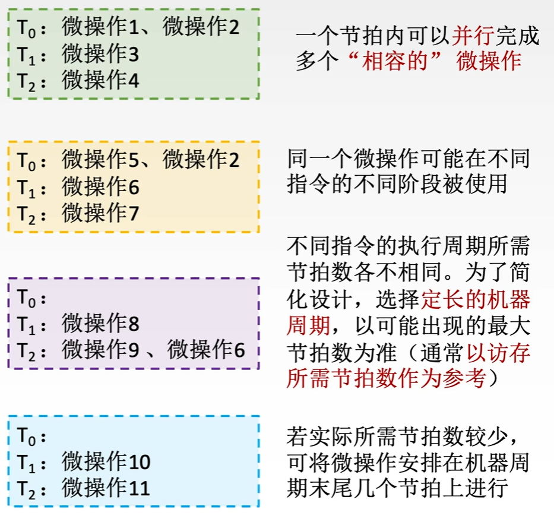

例子：

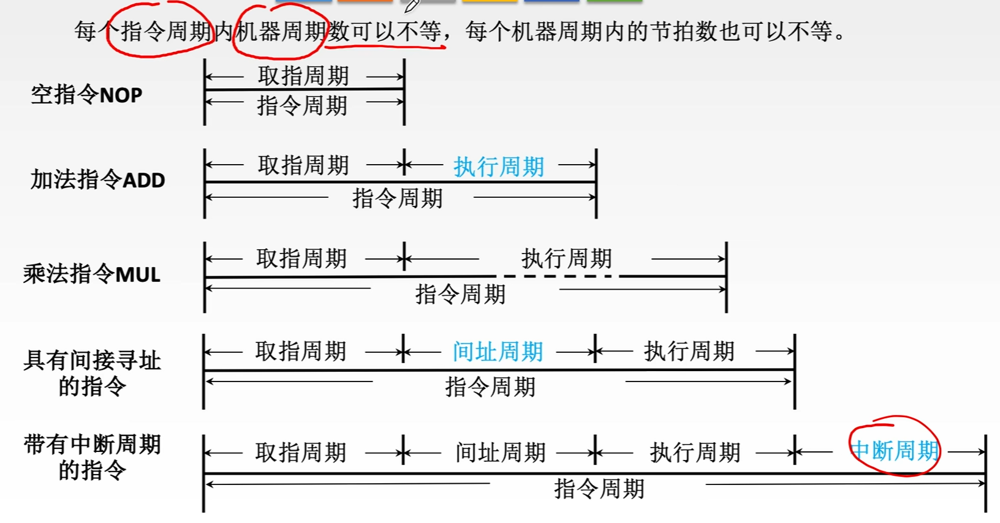

### 2.2==【考点】指令周期流程==

标志触发器：

1. **FE（取指周期）**
   - 取指操作结束，就自动进行PC+1，空操作指令也会PC+1。
   - 进行取指操作，是控制器固有的，控制器**不需要得到指令**允许，不需要在操作码控制下进行。
   - 不同指令的**取指操作可能是不同**的。
   - 取指，取的是**指令字**，不是地址。
2. **IND（间址周期）**
3. **EX（执行周期）**
4. **INT（终端周期）**

例：FE=1就代表取指周期。

【2009年408真题】通过**指令周期的不同阶段**，区分计算机中的指令、数据。

【2011年408真题】每个指令周期中CPU都会至少访存一次。（空指令也会访问PC+1）


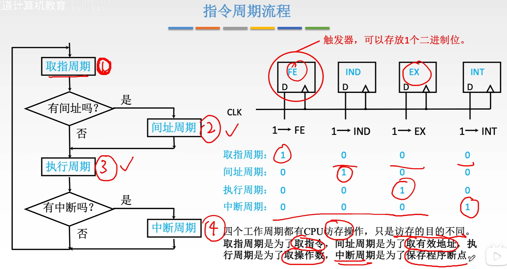

### 2.3数据流

流程中的4种数据流，不同阶段要求依次访问的数据序列。

[5.2_指令周期的数据流_哔哩哔哩_bilibili](https://www.bilibili.com/video/BV1ps4y1d73V/?p=63&spm_id_from=pageDriver&vd_source=9d3c5a863c7c6dbd5152dd7c4e9dc492)

- **1、取指周期**

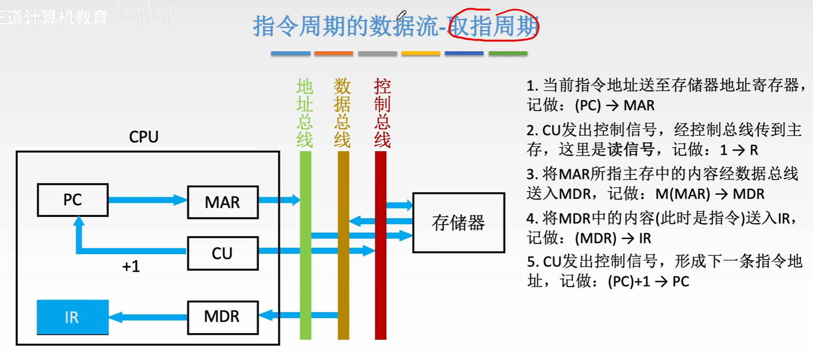

- **2、执行周期**的任务是根据IR中的指令字的操作码和操作数通过ALU操作产生执行结果。不同指令的执行周期操作不同，因此没有统一的数据流向。

- **3、中断周期**

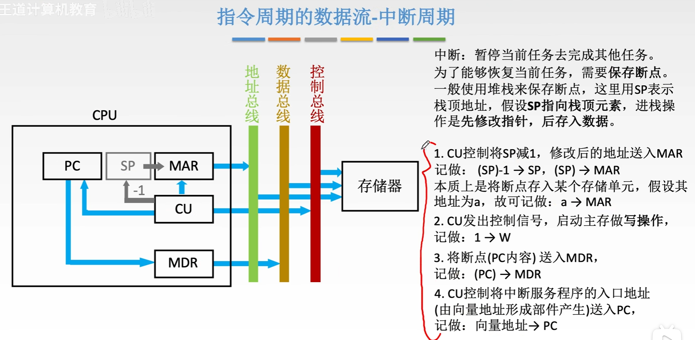

### 2.4指令执行方案：如何安排多条指令的执行?

有3种方案：

#### 2.4.1单指令周期

对所有指令都选用相同的执行时间来完成。

- 优点：指令之间串行执行；指令周期取决于执行时间最长的指令的执行时间。

- 缺点：对于那些本来可以在更短时间内完成的指令，要使用这个较长的周期来完成，会降低整个系统的运行速度。


#### 2.4.2多指令周期

对不同类型的指令选用不同的执行步骤来完成。

- 优点：指令之间串行执行；可选用不同个数的时钟周期来完成不同指令的执行过程。

- 缺点：需要更复杂的硬件设计。


#### 2.4.3流水线方案

在每一个时钟周期启动一条指令，尽量让多条指令同时运行，但各自处在不同的执行步骤中。指令之间并行执行。


## 3.==【大题❗考点】数据通路==

**数据通路**：指令、数据在执行过程中经过的路径称为**数据通路**。

**数据通路部件**：路径上的部件称为**数据通路部件**（数据通路部件也是数据通路的一部分。），如ALU、PC、通用寄存器、状态寄存器、多路选择器(MUX)、cache、MMU、浮点运算逻辑、异常中断处理逻辑。

【2017年408真题】指令流水线中，数据通路部件不包含控制部件（CU）。（因为它在路的外面）

【2021年408真题】数据通路中的**数据流动路径**==由**控制部件（CU）**控制==，控制部件根据每条指令功能的不同，生成对数据通路的控制信号。


作用：

1. 数据通路描述了信息从什么地方开始，中间经过哪个寄存器或多路开关，最后传送到哪个寄存器。
2. 数据通路中专门进行数据运算的部件称为**执行部件或功能部件**；
3. 数据通路的功能是实现 CPU 内部的运算器与寄存器及寄存器之间的数据交换。

数据通路的基本结构：

1. CPU内部**单总线**方式：将所有寄存器的输入端和输出端都连接到一条公共通路上，其优点是结构简单易于实现，缺点就是数据传输时存在较多的冲突现象。
2. CPU内部多总线方式：将所有寄存器的输入端和输出端都连接到多条公共通路上，像这种 CPU 内部不止一条总线的称为多总线结构，相比单总线结构，其好处就是可以同时传送不同的数据，从而提高效率。
3. 专用数据通路方式：根据指令执行过程中的数据和地址的流动方向安排连接线路，避免使用共享的总线，性能较高，缺点是硬件量大。


### 3.1==【考点】单总线结构==

将所有寄存器的输入端和输出端都连接到一条公共的通路上。

结构简单，容易实现，但数据传输存在较多冲突的现象，性能较低。

==单总线结构，同一时刻只有一个数据有效。所以需要**暂存寄存器**（下图是`Y`），如果没有暂存寄存器，那么ALU两端会同时获得两个相同数据，使得数据通路不能正常工作==。


1. **寄存器**与**寄存器**之间数据传输

一个out，一个in。

out：(PC)→Bus
in：Bus→MAR

或者简写：

**(PC)→Bus→MAR**

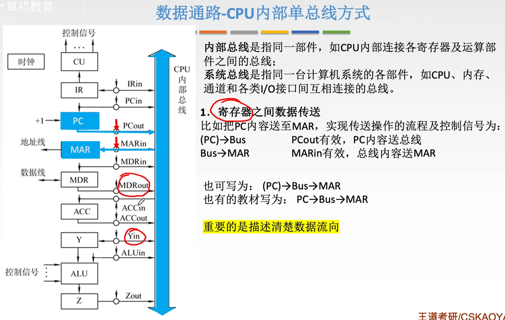

2. **主存**与**CPU**之间数据传输

**(PC)→Bus→MAR**

**1→R**

**MEM(MAR)→MDR**

**MDR→Bus→IR**

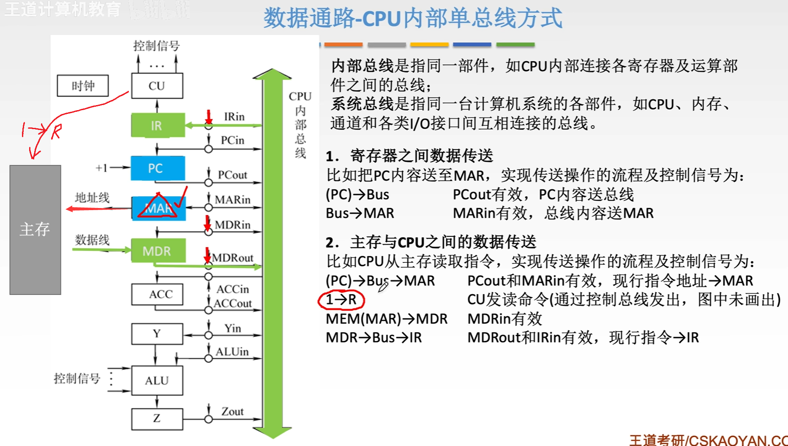

3. **执行**算数 / 逻辑**运算**

**Ad(IR)→Bus→MAR**

**1→R**

**MEM(MAR)→MDR**

**MDR→Bus→Y**

**(ACC)+(Y)→Z**

**Z→ACC**

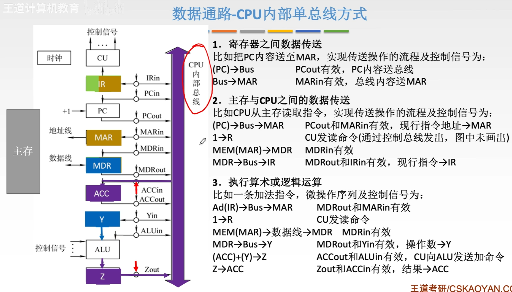

> 例题：
>
> ```assembly
> ADD (R0), R1
> ```
>
> (R0)是间接寻址，R1是直接寻址
>
> 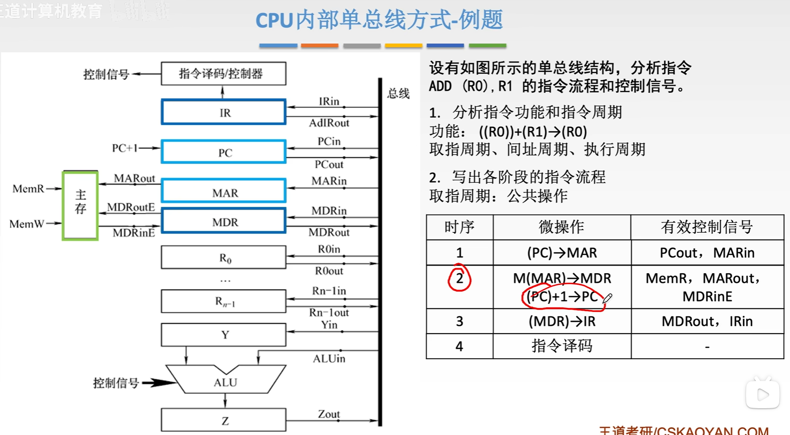
>
> 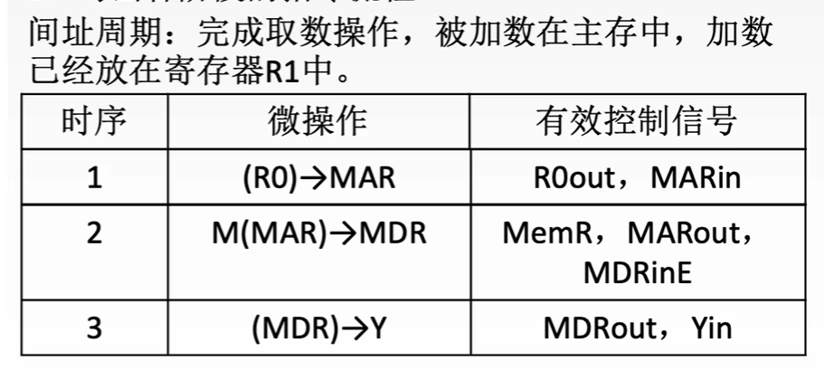
>
> 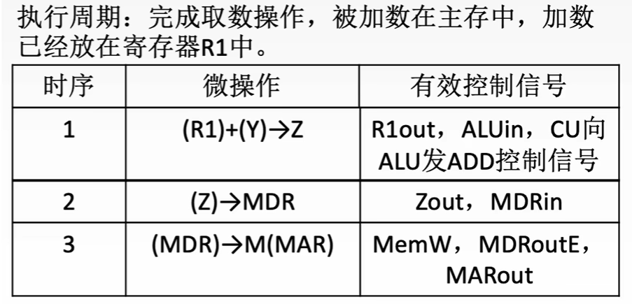

#### ==【考点】数据流==

```assembly
##最靠前的是核心操作
#1. 取指周期：公共操作

(PC)→MAR

	1→R(read)				#CU控制内存。R：读指令，W：写指令	

M(MAR)→MDR			#从内存memory取指令

	(PC)+1→PC		#执行完指令PC就自动加1

(MDR)→IR			#指令放入指令寄存器IR，instruction register

	OP(IR)→ID		#指令译码。指令译码器ID，instruction decoder
	OP(IR)→CU

#2. 间址周期：取R0

(R0)→MAR

M(MAR)→MDR

(MDR)→Y

#3. 执行周期

(R1)+(Y)→Z

(Z)→MDR

(MDR)→M(MAR)			#因为这里的MAR地址还是R0的地址
```


### 3.2专用数据通路

根据指令执行过程中的数据和地址的流动方向安排连接线路。

性能较高，基本不存在数据冲突现象，但结构复杂，硬件量大，不易实现。


取指周期

**(PC)→MAR**

(MAR)→MEM

1→R

**M(MAR)→MDR**

**(MDR)→IR**

(PC)+1→PC

OP(IR)→ID（译码）

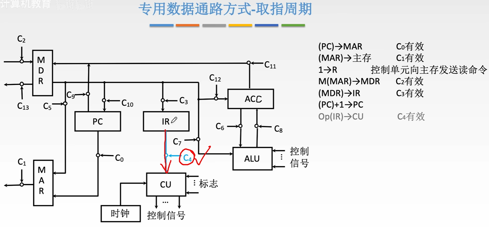

> 例题：
>
> [5.3.2_数据通路-专用通路结构_哔哩哔哩_bilibili](https://www.bilibili.com/video/BV1ps4y1d73V/?p=65&spm_id_from=pageDriver&vd_source=9d3c5a863c7c6dbd5152dd7c4e9dc492)
>
> 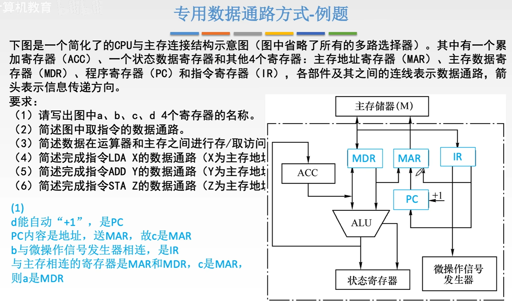
>
> （2）
>
> **(PC)→MAR**
>
> **M(MAR)→MDR**
>
> **(MDR)→IR**
>
> > 答案没写后面两个
>
> (PC)+1→PC
>
> OP(IR)→微操作信号发生器
>
> （3）
>
> 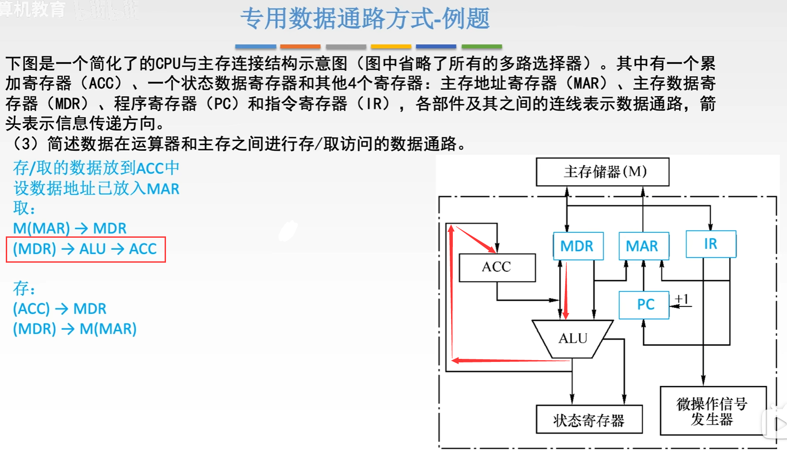
>
> （4）简述完成指令 LDA X 的数据通路（X为主存地址，LDA的功能为(X)→ACC）。
>
> X→MAR
>
> M(MAR)→MDR
>
> (MDR)→ALU→ACC
>
> （5）简述完成指令 ADD Y 的数据通路（Y为主存地址，ADD的功能为(ACC)+(Y)→ACC）。
>
> Y→MAR
>
> M(MAR)→MDR
>
> (ACC)→ALU, (MDR)→ALU
>
> ALU→ACC
>
> （6）简述完成指令 STA Z 的数据通路（Z为主存地址，STA的功能为(ACC)→Z）。
>
> Z→MAR
>
> (ACC)→MDR
>
> MDR→M(MAR)


## 4.控制器

控制器如何指挥整个系统的工作?

控制器的设计

- 硬布线控制器
- 微程序控制器
- 毫微程序控制器（套娃）
  - 微程序设计用微程序解释机器指令，毫微程序设计用毫微程序解释微程序。


### 4.1硬布线控制器

> 纯用硬件实现的。

微操作控制信号由组合逻辑电路根据**指令操作码、目前的机器周期、节拍信号、机器状态条件**，即可确定现在这个节拍下应该发出哪些“微命令”。而且是**即时产生**。

#### 4.1.1基本结构

标志触发器**FE（取指周期）、IND（间址周期）、EX（执行周期）、INT（终端周期）**。

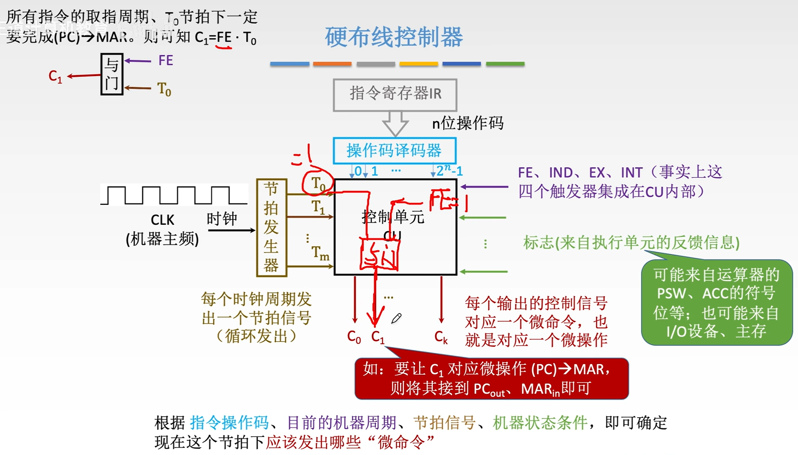

取指周期：

T0：		(PC)→MDR：		   C1 = DE · T0

T1：		M(MAR)→MDR		C2 = FE·T1 + IND·T1(ADD+STA+LDA+JMP+BAN) + EX·T1(ADD+LDA)

​	FE·T1表示FE（取指令）阶段的T1时钟周期；

​	IND·T1(ADD+STA+LDA+JMP+BAN)表示IND阶段的T1时钟周期在ADD等操作下进行；

​	EX·T1(ADD+LDA)表示在EX阶段的T1时钟周期在ADD等操作下进行。

---

#### 4.1.2设计步骤

1. 分析每个阶段的微操作序列(取值、间址、执行、中断四个阶段）

   - 确定哪些指令在什么阶段、在什么条件下会使用到的微操作？

2. 选择CPU的控制方式

   - 采用定长机器周期还是不定长机器周期？每个机器周期安排几个节拍？

     假设采用**同步控制方式（定长机器周期）**，一个机器周期内安排**3个节拍（T0, T1, T2）**。

3. 安排微操作时序

   - 如何用3个节拍完成整个机器周期内的所有微操作？

4. 电路设计

   确定每个微操作命令的逻辑表达式，并具体用电路实现。
   
   1. 列出操作时间表
      - 列出在取指、间址、执行、中断周期，TO、T1、T2节拍内有可能用到的所有微操作。
   2. 写出微操作命令的最简表达式
   3. 画出逻辑图


##### ==微操作总结==

##### 1）分析每个阶段的微操作序列

1. 取指周期：所有指令都相同

**(PC)→MAR**

1→R						#CU控制内存。R：读指令，W：写指令	

**M(MAR)→MDR**	#从内存memory取指令

(PC)+1→PC			#执行完指令PC就自动加1

**(MDR)→IR**			#指令放入指令寄存器IR，instruction register

OP(IR)→ID			#指令译码。指令译码器ID，instruction decoder

2. 间址周期：所有指令都类似

**Ad(IR)→MAR**

1→R

**M(MAR)→MDR**		#此时找到的地址是EA有效地址

**(MDR)→Ad(IR)**		#把原先的间接地址A换成新的EA

3. 执行周期：各不相同

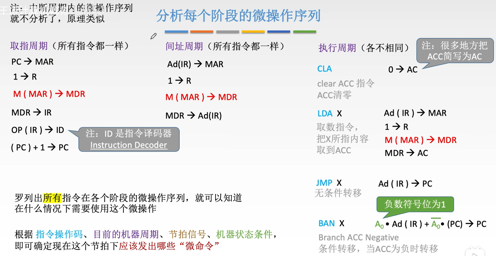


##### 2）安排微操作时序的原则

原则1：微操作的**先后顺序**不得随意更改。

原则2：**被控对象不同**的微操作，尽量安排**在一个节拍**内完成。因为被控对象（→右面的那个）不同，那么同时进行就不会相互影响。

原则3：占**用时间较短**的微操作尽量安排**在一个节拍**内完成，并**允许有先后顺序**。


==下面每一行就是一个**微操作**，每一个T执行一个**微指令**。==

1. 取指周期：所有指令都相同

```assembly
(PC)→MAR
1→R			#存储器空闲即可
M(MAR)→MDR	#因为前面有MAR，所以在（1）之后
(PC)+1→PC	#在（1）之后
(MDR)→IR	#在（3）之后
OP(IR)→ID	#在（4）之后
```

所以：

T0：1，2

T1：3，4

T2：5，6（因为虽然5，6有前后关系，但是执行时间都很短，根据原则3，把它们放到一个节拍）

【说明】M(MAR)→MDR从**主存**取数据，用时较长，因此必须一个时钟周期才能保证微操作的完成。

MDR→IR是**CPU内部寄存器**的数据传送，速度很快，因此在一个时钟周期内可以紧接着完成OP(IR)→ID，也就是可以一次同时发出两个微命令。


2. 间址周期：所有指令都类似

```assembly
Ad(IR)→MAR
1→R			#存储器空闲即可
M(MAR)→MDR	#在（1）之后
(MDR)→Ad(IR)#在（3）之后
```

T0：1，2

T1：3

T2：4


3. 执行周期：各不相同

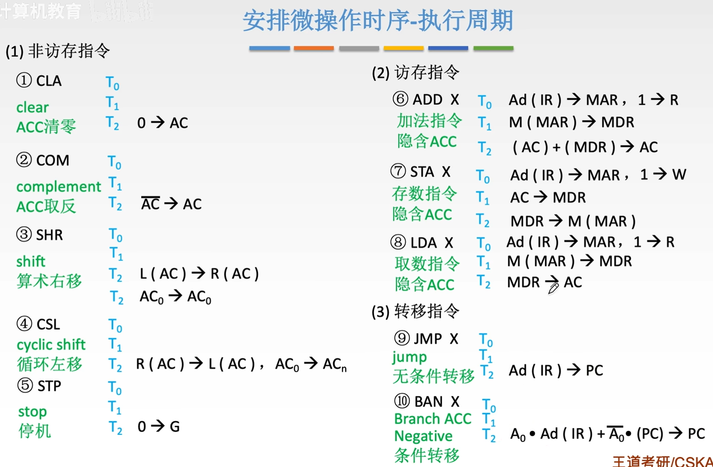

##### 3）电路设计

设计步骤：

1. 列出操作时间表
   - 列出在取指、间址、执行、中断周期，TO、T1、T2节拍内有可能用到的所有微操作。
2. 写出微操作命令的最简表达式
3. 画出逻辑图

【备注】操作时间表巨长，很麻烦。

#### 4.1.3特点

1. 指令越多，设计和实现就越复杂，因此一般用于**RISC**（精简指令集系统）。
2. 如果扩充一条新的指令，则控制器的设计就需要大改，因此扩充指令较困难。
3. 由于使用纯硬件实现控制，因此执行速度很快。微操作控制信号由组合逻辑电路即时产生。


### 4.2==【考点】微程序控制器==

> 硬件+软件实现

硬布线控制器采用硬件电路实现，但是难度大成本高。所以微程序控制器速度虽然慢，但是简单、灵活性高。

采用“存储程序”的思想，CPU出厂前将所有指令的“**微程序**”存入“**控制器存储器**”中。

- 分类：

1. 静态微程序设计：微程序无需改变，采用 ROM。
2. 动态微程序设计：通过改变微指令和微程序改变机器指令。有利于仿真，采用EPROM。


- **程序**：由指令序列组成。

- **微程序**：由微指令序列组成。

- **指令**：是对程序执行步骤的描述，**每一种指令对应一个微程序**。
  比如 LDA X，这样一条指令对应的取指、间址、执行、中断全部看作一个微程序。

- **微指令**：是对指令执行步骤的描述，是若干微命令的集合。

- **微命令**：控制部件(CU)向执行部件发出的控制信号。

  微命令执行的操作叫微操作。所以**微命令**与**微操作**一一对应。


#### ==【考点】微指令：包含关系==

- **指令（指令周期）**（4个微程序段部分构成一完整的微程序）
  - **微程序(段)（机器周期）**（取指周期微程序、间址周期微程序......）（若干微指令的有序集合）
    - **微指令**（一个节拍（T）内多行或一行微操作）（若干微命令的集合）
      - 微命令 = **微操作**（一行微操作）

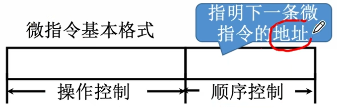

#### 4.2.1==【考点】基本结构（控制存储器）==

**控制存储器CM**（Memory Controller）：存放**微程序**，是微程序控制器的核心部件。

特点：

1. 是**CPU**的一部分；
2. 采用**ROM**组成。
3. 一条微指令，存放在控制器的一个控制存储器单元中。
4. 按**地址**访问。

**微指令计数器**决定了**微指令**执行的顺序。

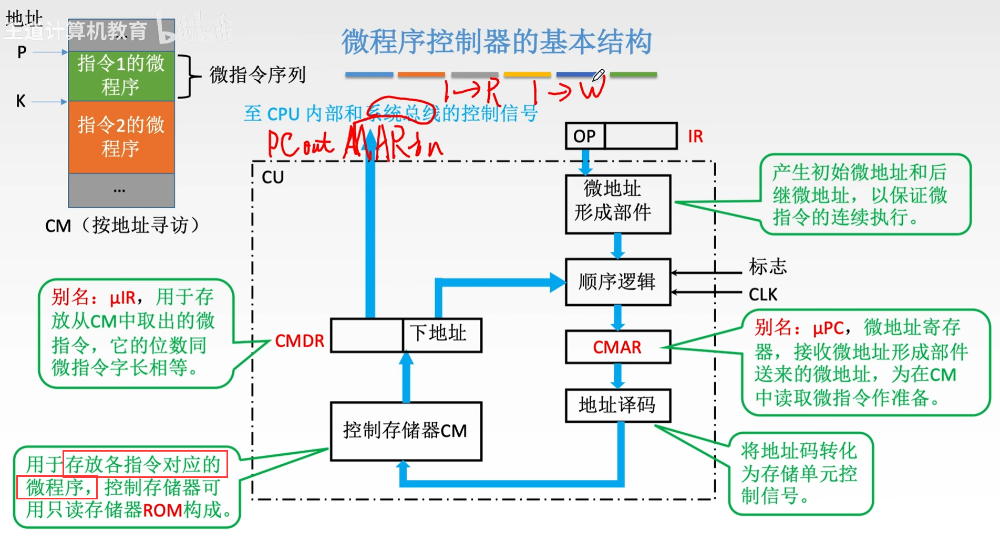

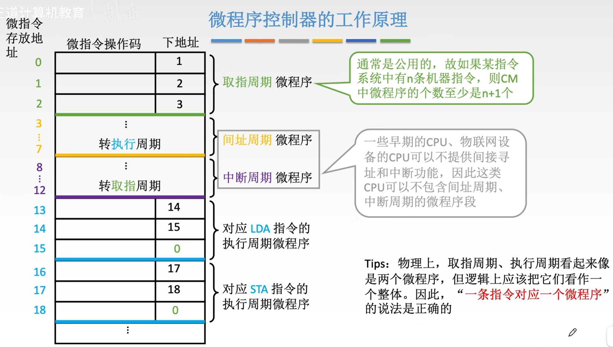

**取指周期**通常是公用的，故如果某指令系统中有**n条机器指令**（执行周期），则CM中**微程序(段)的个数**至少是**n+1**个。（因为 n条机器指令 是描述**执行周期**的微程序(段)，所以还要加上一个取指周期微程序(段)）

- 为什么是+1（只加取指周期，没有间址周期...）？

因为一些早期的CPU、物联网设备的CPU可以不提供间接寻址和中断功能,因此这类CPU可以不包含间址周期、中断周期的微程序段。


#### 4.2.2微指令格式

- **相容性微命令**：可以并行完成的微命令。
- **互斥性微命令**：不允许并行完成的微命令。

三种格式：

1. **水平型微指令**：进行多个并行操作。
2. **垂直型微指令**：一次只能完成一个基本操作。
   - 采用微操作码
3. 混合型微指令

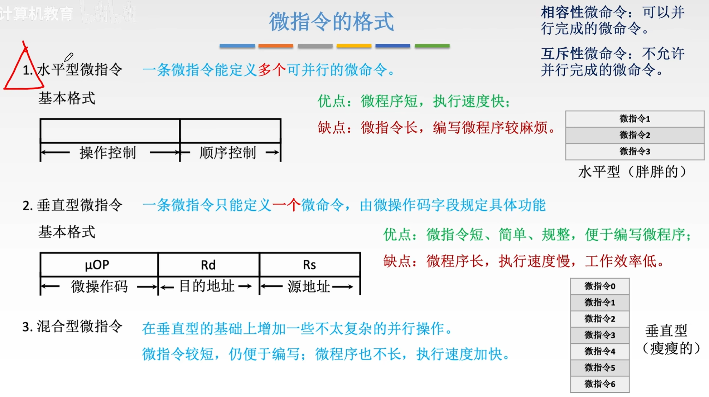

#### 4.2.3微指令编码方式

微指令的**编码方式**又称为微指令的**控制方式**，它是指如何对微指令的控制字段进行编码，以形成控制信号。编码的目标是在保证速度的情况下，尽量缩短微指令字长。

1. 直接编码（直接控制）方式
2. 字段直接编码方式
3. 字段间接编码方式（隐式编码）

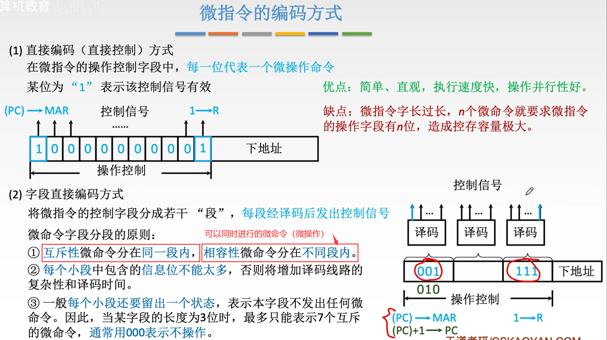

优点：可以缩短微指令字长。

缺点：要通过译码电路后再发出微命令，因此比直接编码方式慢。

> 例题：
>
> 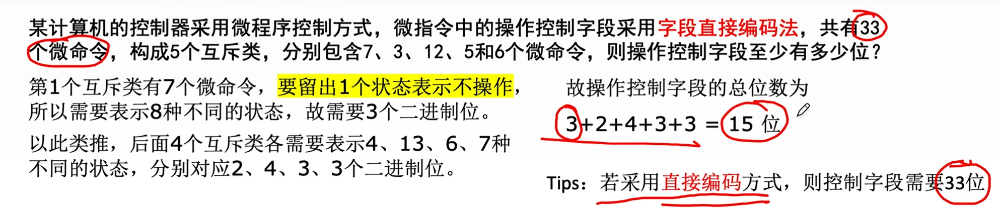

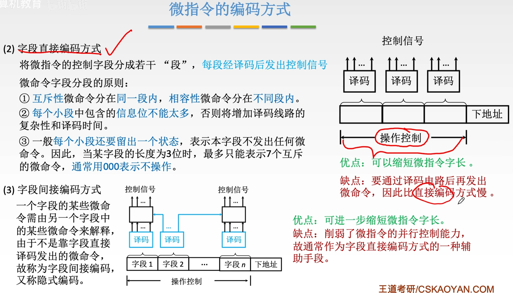

#### 4.2.4微指令的==【考点】地址形成方式==

就是下一条指令地址的形成

1. 微指令的**下地址**字段：指出微指令格式中设置一个**下地址字段**，由微指令的下地址字段直接指出后继微指令的地址，这种方式又称为==**断定方式（断定法）**==。

2. 根据机器指令的**操作码**，形成当机器指令取至指令寄存器后，微指令的地址由操作码经微地址形成部件形成。

3. 增量**计数器法**：(CMAR)+1→CMAR

   类似(PC)+1→PC

4. 分支转移。

   | 操作控制字段 | 转移方式 | 转移地址 |
   | ------------ | -------- | -------- |

   转移方式：指明判别条件；
   转移地址：指明转移成功后的去向。

5. 通过测试网络（顺序逻辑）

6. 由硬件产生微程序**入口地址**：**机器指令的操纵码字段**。

   **第一条微指令地址**，由专门**硬件**产生（用专门的硬件记录取指周期微程序首地址）。
   中断周期：由硬件产生中断周期微程序首地址（用专门的硬件记录）。

> 【2014年408真题】
>
> 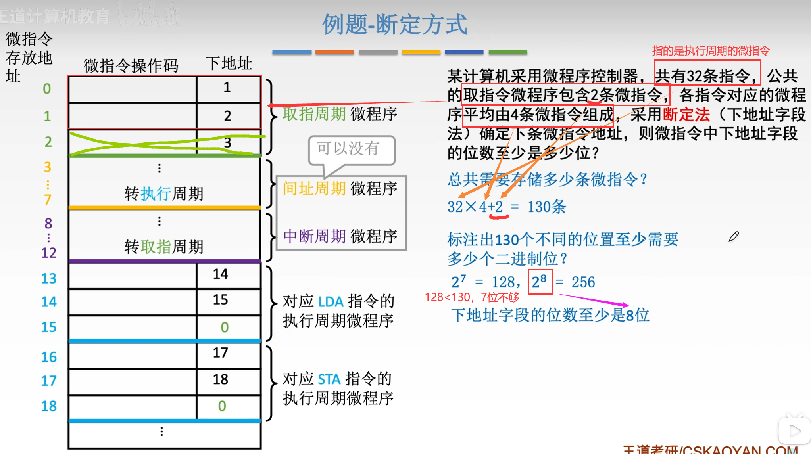

#### 4.2.5设计微程序控制单元

设计步骤：

1. 分析每个阶段的微操作序列
2. 写出对应机器指令的微操作命令及节拍安排
3. 确定微指令格式
   1. 根据微操作个数决定采用何种编码方式，以确定微指令的操作控制字段的位数。
   2. 根据CM中存储的微指令总数，确定微指令的顺序控制字段的位数。
   3. 最后按操作控制字段位数和顺序控制字段位数就可确定微指令字长。
4. 编写微指令码点
   - 根据操作控制字段每一位代表的微操作命令，编写每一条微指令的码点。


与前面硬布线控器类似，也需要微指令（节拍）安排，唯一不同的是最后一个微操作。

---

微指令a，T0： (PC)→MAR

微指令a，T0： 1→R

微指令b，T1： M(MAR)→MDR

微指令b，T1： (PC)+1→PC

微指令c，T2： (MDR)→IR

微指令c，T2： OP(IR)→为地址形成部件（硬布线：OP(IR)→ID）

---

取指周期的第**一条微指令a**地址由**硬件**自动给出，后面的指令由前面指令的**下地址**指出。

所以要加上下地址的一个微操作：

AD(CMDR)→CMAR

就变成了：

---

微指令a，T0： (PC)→MAR

微指令a，T0： 1→R

​				T1：**Ad(CMDR)→CMAR**

微指令b，T2： M(MAR)→MDR

微指令b，T2： (PC)+1→PC

​				T3：**Ad(CMDR)→CMAR**

微指令c，T4： (MDR)→IR

微指令c，T4： OP(IR)→为地址形成部件（硬布线：OP(IR)→ID）

​				T5：**微地址形成部件→CMAR**

取指周期的最后一条微指令完成后，要根据指令操作码确定其执行周期的微程序首地址。

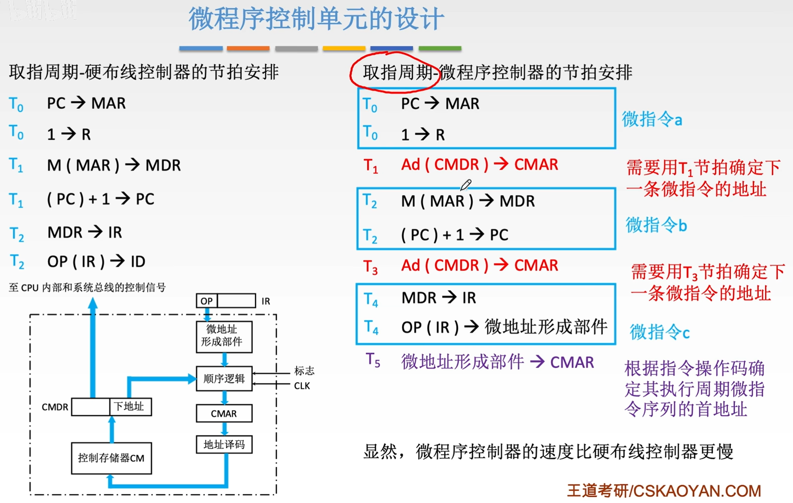

---


### 4.3硬布线vs微程序比较

| -                 - | 硬布线控制器                                                 | 微程序控制器                                                 |
| ------------------- | ------------------------------------------------------------ | ------------------------------------------------------------ |
| 工作原理            | 微操作控制信号由组合逻辑电路根据当前的指令码、状态和时序，即时产生。 | 微操作控制信号以微程序的形式存放在控制存储器中，执行指令时读出即可。 |
| 执行速度            | 快                                                           | 慢（因为增加了从**控制存储器**读取微指令的时间）             |
| 规整性              | 繁琐、不规整                                                 | 较规整                                                       |
| 应用场合            | RISC CPU（精简指令集计算机）                                 | CISC CPU（复杂指令集计算机）                                 |
| 易扩充性            | 困难                                                         | 易扩充修改                                                   |


## 5.==【大题❗考点】指令流水线==

> 对指令执行的优化

- 流水线技术：时间上并行
- 超标量技术：空间上并行。

### 5.1基本概念

一条指令的执行过程可以分成多个阶段或过程。根据计算机的不同，具体的分法也不同。

【注意】每个时钟周期只能有一条指令进入流水线。

| 取指 | 分析 | 执行 |
| ---- | ---- | ---- |

**取指**：根据PC内容访问主存储器，取出一条指令送到IR中。

**分析**：对指令操作码进行译码，按照给定的寻址方式和地址字段中的内容形成操作数的有效地址EA，并从有效地址EA中取出操作数。

**执行**：根据操作码字段，完成指令规定的功能，即把运算结果写到通用寄存器或主存中。

---

设取指、分析、执行3个阶段的时间都相等，用t表示，按以下几种执行方式分析n条指令的执行时间：

1. 顺序执行

   优点：控制简单，硬件代价小。
   缺点：执行指令的速度较慢，在任何时刻，处理机中只有一条指令在执行，各功能部件的利用率很低。

2. 一次重叠执行

   优点：程序的执行时间缩短了1/3，各功能部件的利用率明显提高。
   缺点：需要付出硬件上较大开销的代价，控制过程也比顺序执行复杂了。

3. 两次重叠执行

   与顺序执行方式相比，指令的执行时间缩短近2/3。这是一种理想的指令执行方式，在正常情况下，处理机中同时有3条指令在执行。

后两者就是使用了**流水线**的方法。

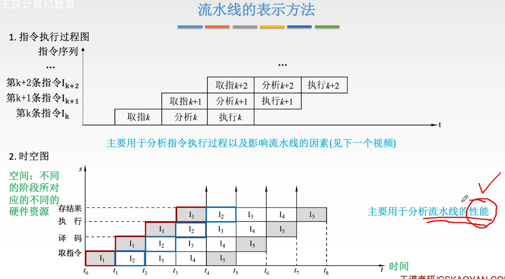

### 5.2==【考点】性能指标==

1. **==吞叶率==**：吞吐率是指在单位时间内流水线所**完成的任务数量**，或是输出结果的数量。

$$
流水线吞吐率(TP)=\frac n {T_k}
$$

- n：任务数量；
- T~k~：处理完成n个任务所用的时间。

> 比如，100条指令，采用4级流水线，使用了103个时钟周期，所以吞吐量就是 100/103。

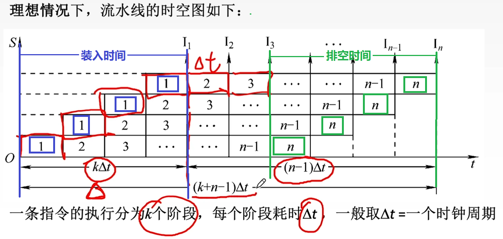

第一条指令可以类比加特林启动，耗时 k·△t。当完全启动之后，后续每个指令只需要耗时一个 △t。所以：
$$
T_k=(k+n-1)△t\\
TP = \frac n {(k+n-1)△t}
$$
当连续输入的任务n→∞时，得最大吞吐率为TP~max~=1/△t。


2. **加速比**：完成同样一批任务，不使用流水线所用的时间与使用流水线所用的时间之比。

$$
流水线加速比(S)=\frac{T_0}{T_k}
$$

- T~0~表示不使用流水线时的执行时间，即顺序执行所用的时间；
- T~k~表示使用流水线时的执行时间。

再以上图为例子：
$$
T_0=kn△t\\
T_k=(k+n-1)△t\\\\
TP = \frac {kn} {k+n-1}
$$
当连续输入的任务n→∞时，得最大加速比为S~max~=k。就意味着比之前快了k倍。


3. **效率**：流水线的设备利用率称为流水线的效率。设备处于忙碌的时间占总时间的比例。

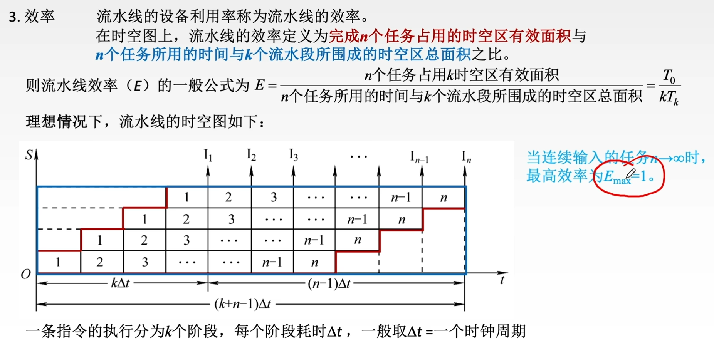

### 5.3指令流水线==【考点】影响因素==

MIPS架构下，把一条指令的执行划分为5个机器周期：（大部分RISC都是）

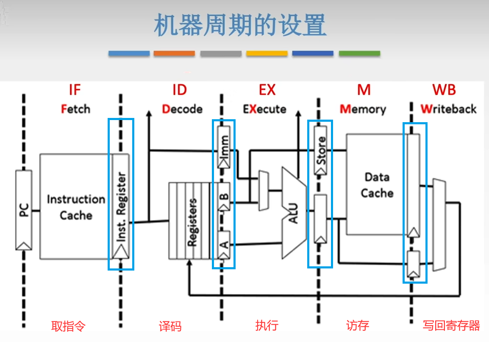

实际情况下，可以各部件的耗时都不一样。但是为方便流水线的设计，将每个阶段的耗时取成一样，以**最长耗时为准**。

流水线每一个功能段部件后面都要有一个**缓冲寄存器**，或称为**锁存器**，其作用是保存本流水段的执行结果，提供给下一流水段使用。

---

影响因素：

#### 5.3.1结构相关（**资源冲突**）：**互斥**

由于多条指令在同一时刻争用同一资源而形成的冲突称为结构相关。

**当两个指令同时访问一个主存或者寄存器，就会发生冲突**。


- **方案一：让后面的指令暂停一个周期再执行**。

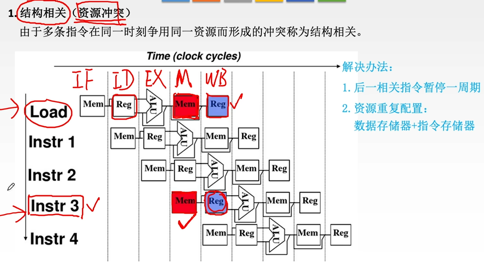


- **方案二：换用不同的存储器**。

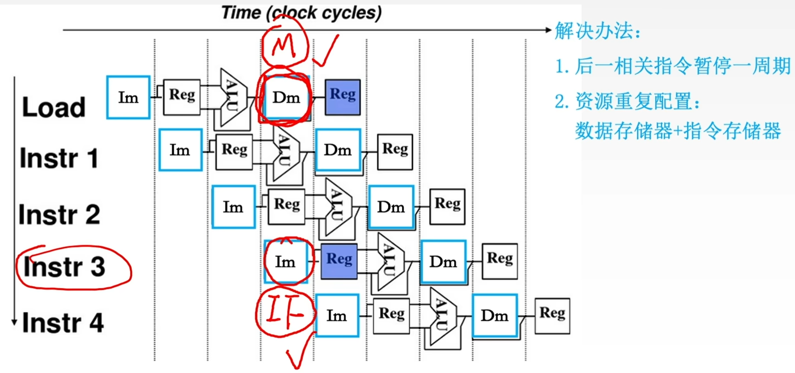

【2014年408真题】指令cache和数据cache分离的目的就是减少流水线资源冲突。


#### 5.3.2==数据相关（**数据冲突**）==：**同步**

数据相关指在一个程序中，存在必须等前一条指令执行完才能执行后一条指令的情况，则这两条指令即为数据相关。

**两个指令用到的数据有前后关系**。

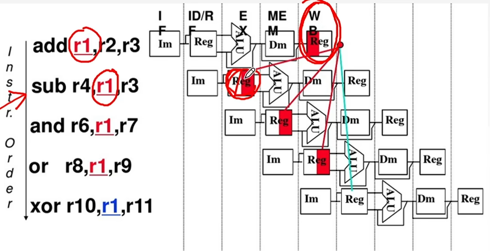

解决方法：

- **方案一：把要用到是指令暂停执行，直到前面数据处理完成**。可分为硬件、软件两种实现方式。

1. 硬件阻塞（stall）

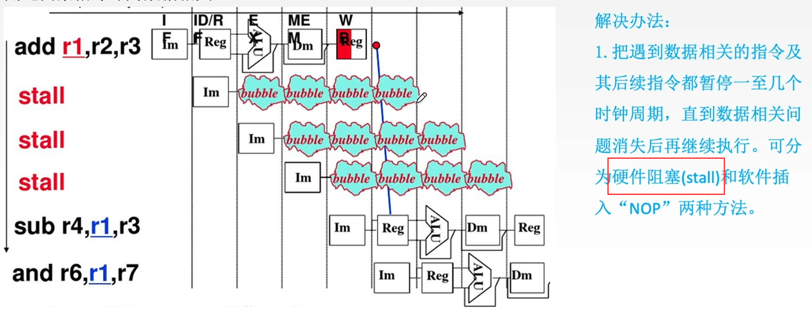

2. 软件插入NOP空指令

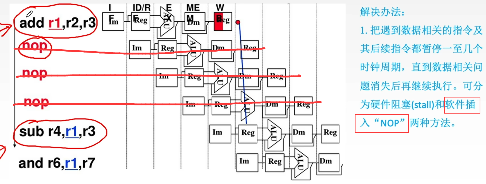


- **方案二：数据旁路技术**：就是当前一条指令执行完之后，不等这条指令全部执行结束，提前把要用到是数据传递给下一条指令。

- **方案三：编译优化**：通过编译器调整指令顺序来解决数据相关。

  就是把用不到这个数据的下面的指令先拿到前面来。

  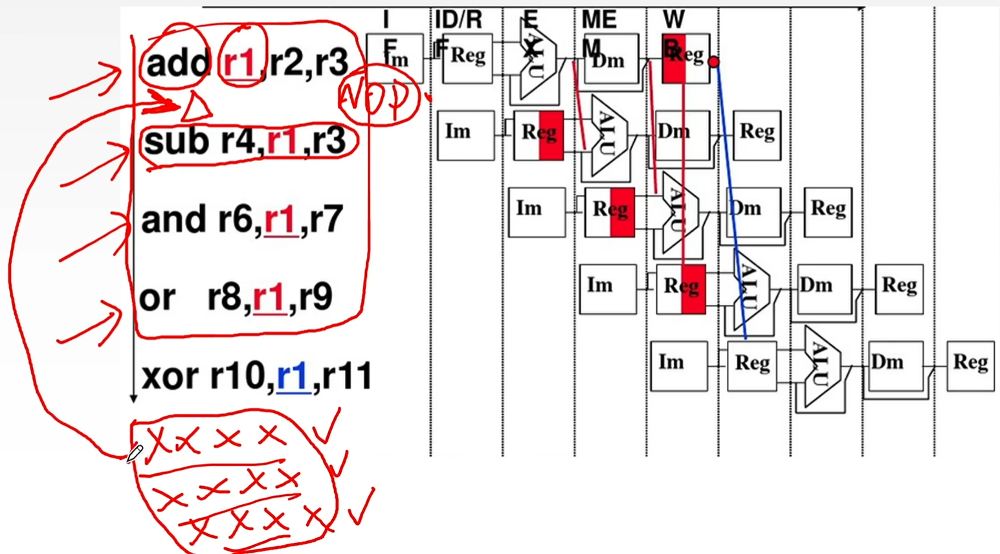

#### 5.3.3控制相关（**控制冲突**)

当流水线遇到**转移指令**和其他改变PC值的指令而造成**断流**时，会引起控制相关。

**出现转移指令、函数调用等，使当前指令和跳转之间的指令不被执行了**。

- 方案一：转移指令分支预测。简单预测(永远猜ture或false)、动态预测（根据历史情况动态调）。
- 方案二：预取转移成功和不成功两个控制流方向上的目标指。
- 方案三：加快和提前形成条件码。
- 方案四：提高转移方向的猜准率。


### 5.4流水线分类

> 套娃

【2020年408真题】理想条件下，CPI为 1 的有：

1. 单周期CPU；
2. 基本流水线CPU。


根据流水线**使用的级别**的不同，流水线可分为**部件功能级流水线**、**处理机级流水线**和**处理机间流水线**。

1. **部件功能级**流水：就是将复杂的算术逻辑运算组成流水线工作方式。例如，可将浮点加法操作分成求阶差、对阶、尾数相加以及结果规格化等4个子过程。
2. **处理机级**流水：是把一条指令解释过程分成多个子过程，如前面提到的取指、译码、执行、访存及写回5个子过程。
3. **处理机间**流水：是一种宏流水，其中每一个处理机完成某一专门任务，各个处理机所得到的结果需存放在与下一个处理机所共享的存储器中。

按流水线**可以完成的功能**，流水线可分为**单功能流水线**和**多功能流水线**。

1. **单功能**流水线指只能实现一种固定的专门功能的流水线。
2. **多功能**流水线指通过各段间的不同连接方式可以同时或不同时地实现多种功能的流水线。

按同一时间内**各段之间的连接方式**，流水线可分为**静态流水线**和**动态流水线**。

1. **静态**流水线指在同一时间内，流水线的各段只能按同一种功能的连接方式工作。
2. **动态**流水线指在同一时间内，当某些段正在实现某种运算时，另一些段却正在进行另一种运算。这样对提高流水线的效率很有好处，但会使流水线控制变得很复杂。

按流水线的各个**功能段之间是否有反馈信号**，流水线可分为**线性流水线**与**非线性流水线**。

1. **线性**流水线中，从输入到输出，每个功能段只允许经过一次，**不存在反馈回路**。
2. **非线性**流水线存在反馈回路，从输入到输出过程中，某些功能段将数次通过流水线，这种流水线适合进行线性递归的运算。


### 5.5流水线的多发技术

1. 超标量技术
2. 超流水技术
3. 超长指令字


#### 5.5.1超标量技术

空分复用

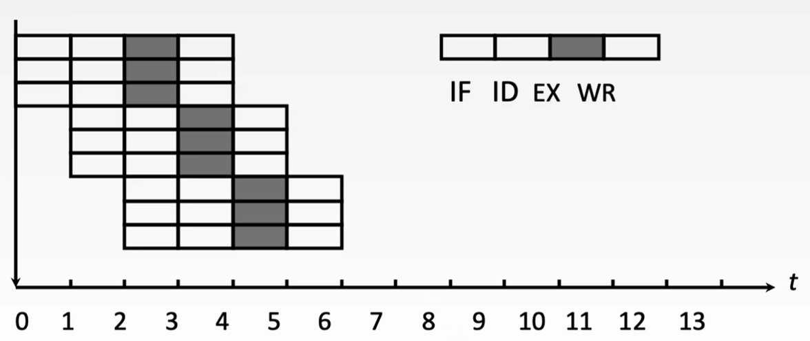

每个时钟周期内可**并发多条独立指令**。

要配置多个功能部件。（硬件要求）

**不能调整指令的执行顺序**。通过编译优化技术，把可并行执行的指令搭配起来。


#### 5.5.2超流水技术

时分复用

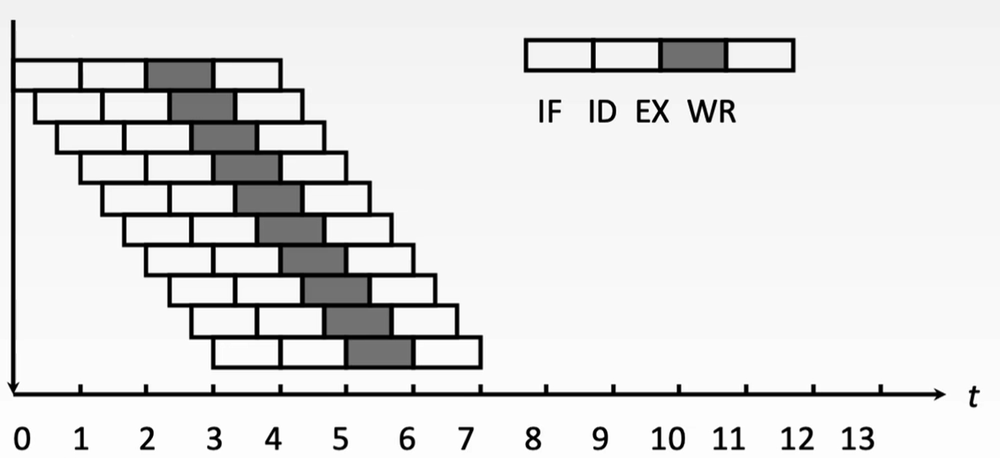

在一个时钟周期内**再分段**。

在一个时钟周期内一个功能部件使用多次。

**不能调整指令的执行顺序**。靠编译程序解决优化问题


#### 5.5.3超长指令字

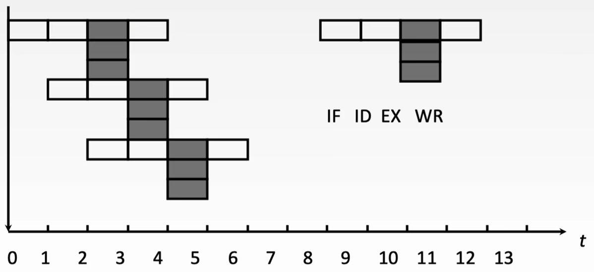

由**编译程序**挖掘出指令间**潜在的并行性**，将多条能并行操作的指令组合成一条。

具有多个操作码字段的**超长指令字**（可达几百位），采用多个处理部件。指令更长，一次可以进行的处理更多。


### 5.6==【大题❗考点】五段式流水线==

MIPS架构下，把一条指令的执行划分为5个机器周期：（大部分RISC都是）


①IF取指→②ID译码&取数→③EX执行→④M访存→⑤WB写回寄存器


==考试==中常见的五类指令：

**运算类指令、LOAD指令、STRE指令、条件转移指令、无条件转移指令**


- **运算类指令**

1. lF：根据PC从指令Cache取指令至IF段的锁存器；
2. ID：取出操作数至ID段锁存器；
3. EX：运算，将结果存入EX段锁存器；
4. M：空段；
5. WB：将运算结果写回指定寄存器。


**【注意】**关于主存M，通常，RISC处理器只有“取数LOAD”和“存数STORE”指令才能访问主存。


- **LOAD指令**

LOAD Rd, 996(Rs)
(996+(Rs))→Rd

1. lF：根据PC从指令Cache取指令至IF段的锁存器；
2. ID：将基址寄存器的值放到锁存器A，将偏移量的值放到Imm；
3. EX：运算，得到有效地址EA，将结果存入EX段锁存器；
4. M：从数据Cache中取数并放入锁存器；
5. WB：将取出的数写回寄存器。


- **STORE指令**

STORE Rs, 997(Rd)
Rs→(997+(Rd))

1. lF：根据PC从指令Cache取指令至IF段的锁存器；
2. ID：将基址寄存器的值放到锁存器A，将偏移量的值放到Imm。将要存的数放到B；
3. EX：运算，得到有效地址。并将锁存器B的内容放到锁存器Store。
4. M：写入数据Cache；
5. WB：空段。


- **条件转移指令**

beq Rs, Rt, #偏移量
若(Rs)==(Rt)，则(PC)+指令字长+(偏移量×指令字长)→PC；否则(PC)+指令字长→PC。

这里的+指令字长相当于+1

1. IF：根据PC从指令Cache取指令至IF段的锁存器；
2. ID：进行比较的两个数放入锁存器A、B，偏移量放入lmm；
3. EX：运算，比较两个数；
4. M：将目标PC值**写回PC**；
5. WB：空段。

【注意】很多教材把**写回PC**的功能段称为“WrPC段（writePC）”，其耗时比M段更短，可安排在M段时间内完成。


- **无条件转移指令**

jmp #偏移量
(PC)+指令字长+(偏移量×指令字长)→PC

1. lF：根据PC从指令Cache取指令至IF段的锁存器；
2. ID：偏移量放入Imm；
3. EX：将目标PC值写回PC；
4. M：空段；
5. WB：空段。

【注意】“WrPC段”耗时比EX段更短，可安排在EX段时间内完成（**尽量靠前**）。WrPC段越早完成，就越能避免控制冲突。当然，也有的地方会在WB段时间内才修改PC的值。


## 6.多处理器

> 大纲只要求掌握“基本概念”，意味着一定只考选择题。
>
> [5.7_1_多处理器系统的基本概念_哔哩哔哩_bilibili](https://www.bilibili.com/video/BV1ps4y1d73V/?p=73&spm_id_from=pageDriver&vd_source=9d3c5a863c7c6dbd5152dd7c4e9dc492)

### 6.1SISD、SIMD、MIMD、向量处理机

- **SISD**（**单**指令流**单**数据流）

eg: 计组课程一直在学的就是SISD，每条指令可以处理一两个数据

特性：

1. 各指令序列**只能并发、不能并行（一时刻内只能进行一个线程的指令）**，每条指令处理一两个数据；
2. **不是**数据级并行技术。

硬件组成：

1. 一个处理器＋一个主存储器；
2. 一若采用指令流水线，需设置多个功能部件，采用**多模块交叉存储器**。


- **SIMD**（**单**指令流**多**数据流）

特性：

1. 各指令序列**只能并发、不能并行（一时刻内只能进行一个线程的指令）**，但每条指令可同时处理很多个具有相同特征的数据（同一时刻操作不同的执行部件ALU）；
2. 是一种**数据级并行技术**。

硬件组成：

1. 一个指令控制部件(CU) +多个处理单元/执行单元（如ALU)＋多个局部存储器＋一个主存储器；
2. 每个执行单元有各自的寄存器组、局部存储器、地址寄存器；
3. 不同执行单元执行同一条指令，处理不同的数据。


- **MISD**（**多**指令流**单**数据流）

多条指令并行执行，处理同一个数据。现实中**不存在**这种计算机。


- **MIMD**（**多**指令流**多**数据流）共享存储多处理器系统

特性：

1. **各指令序列并行执行，分别处理多个不同的数据；**
2. **是一种线程级并行、甚至是线程级以上并行技术。**

进一步分类：

- **多处理器**系统
  - 特性：各处理器之间，可以通过LOAD/STORE指令，访问同一个主存储器，可通过主存相互传送数据。
  - 硬件组成：一台计算机内，包含多个处理器+一个主存储器；多个处理器共享单一的物理地址空间。
- **多计算机**系统
  - 特性：各计算机之间**独立**，不能通过LOAD/STORE指令直接访问对方的存储器，只能通过“消息传递”相互传送数据。
  - 硬件组成：由多台计算机组成，因此拥有多个处理器+多个主存储器；台计算机拥有各自的私有存储器，物理地址空间相互独立。


- **向量处理机**（SIMD思想的进阶应用）

特性：

1. 一条指令的处理对象是“向量”；
2. 擅长对向量型数据并行计算、浮点数运算，常被用于超级计算机中，处理科学研究中巨大运算量。

硬件组成：

1. 多个处理单元，多组“向量寄存器”；
2. 主存储器应采用“多个端口同时读取”的交叉多模块存储器；
3. 主存储器大小限定了机器的解题规模，因此要有大容量的、集中式的主存储器。


### 6.2多核处理器&共享内存多处理器

多核处理器&共享内存多处理器其实，就是一个东西，命名角度不同。


- **共享内存多处理器**（SMP，Shared MemorymultiProcessor）

**就是 MIMD 的多处理器系统**。

1. 多个处理器共享一个主存储器；
2. 多个处理器共享单一的地址空间，都可以通过LOAD、STORE指令访问共享的主存储器


【注意】多计算机系统：

1. 多个计算节点都有各自私有的主存储器；
2. 各计算结点的地址空间相互独立，不能通过LOAD、STORE指令访问另一个计算结点的主存储器。


- **多核处理器**（multi-core）

1. 一个CPU芯片中包含多个处理器，即多个核(core)，因此通常也称为片级多处理器(Chip-Level MultiProcessing，CMP)。意思是:一块芯片上集成了多个处理器；
2. 所有核共享一个LLC (Last-Level Cache)，并共享主存储器。


## 7.硬件多线程

> 大纲只要求掌握“基本概念”，意味着一定只考选择题。
>
> [5.7_2硬件多线程的基本概念_哔哩哔哩_bilibili](https://www.bilibili.com/video/BV1ps4y1d73V/?p=74&spm_id_from=pageDriver&vd_source=9d3c5a863c7c6dbd5152dd7c4e9dc492)

进程是资源分配的基本单位，而线程是任务调度和执行的基本单位。 一个进程可以包含多个线程，这些线程共享进程的资源。 

- 进程（任务调度和执行的基本单位）
  - 线程（资源分配的基本单位）

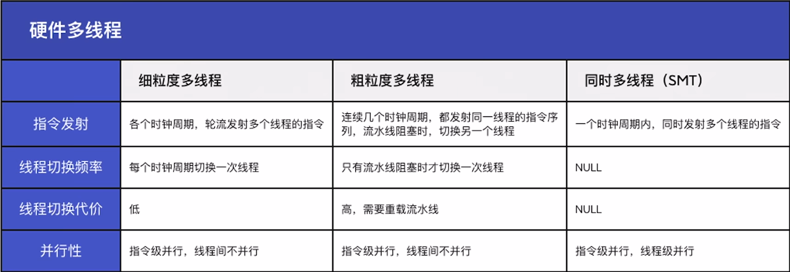

