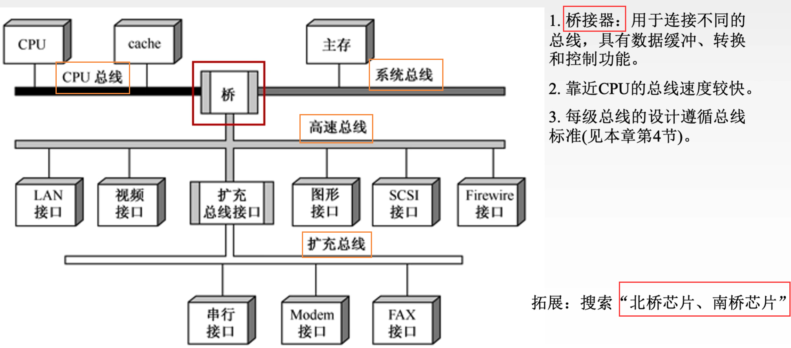
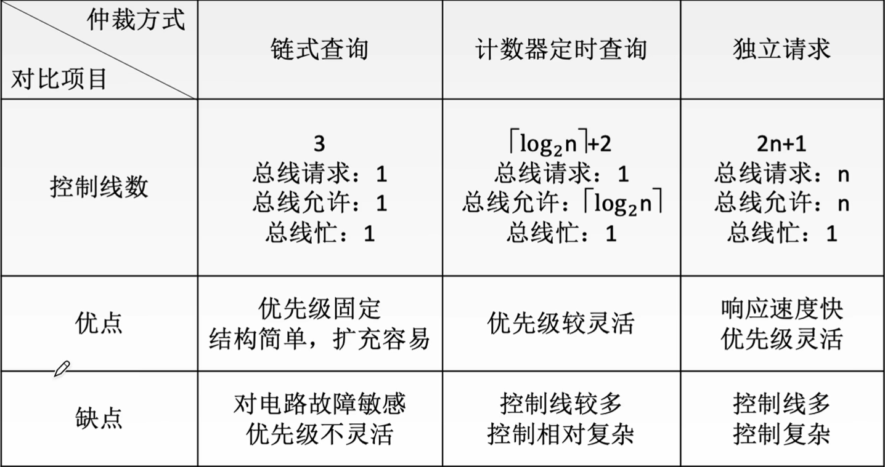
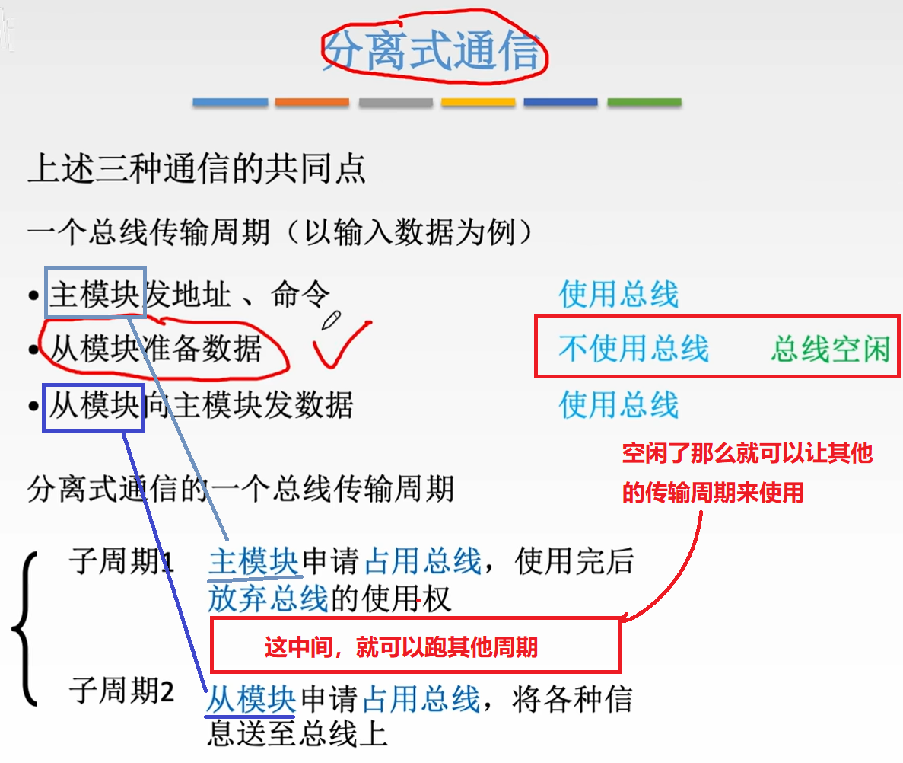
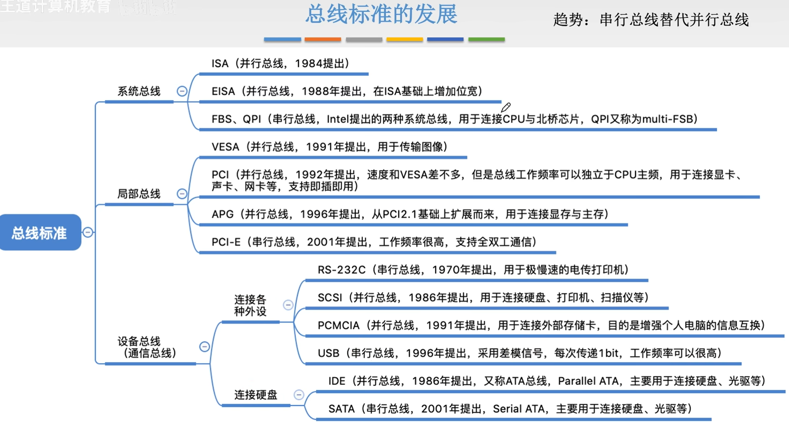

# 六、总线

[toc]

## 1.总线概论

> 总线被刻蚀在主板上

总线是一组能为多个部件**分时、共享**的公共信息传送线路，是各部件的**传输介质**。

1. **共享**是指总线上可以挂接多个部件，各个部件之间互相交换的信息都可以通过这组线路分时共享。
2. **分时**是指同一时刻只允许有一个部件向总线发送信息,如果系统中有多个部件，则它们只能分时地向总线发送信息。

CPU和主存、硬盘、外部设备之间通过一组**总线**相连，总线中有**地址（AB）、控制（CB）、数据（DB）**3组信号线。

**一根总线可能由很多根信号线组成，同一时刻只能有一个部件发送数据，但是可有多个部件接受数据（一对多）**。


MAR中的地址信息会直接送到**地址线**上，用于指向读/写操作的主存存储单元。

**控制线**中有读/写信号线，指出数据是从CPU写入主存还是从主存读出到CPU，根据是读操作还是写操作来控制将MDR中的数据是直接送到数据线上还是将数据线上的数据接收到MDR中。


特性：

1. 机械特性：尺寸、形状、管脚数、排列顺序
2. 电气特性：传输方向和有效的电平范围
3. 功能特性：每根传输线的功能（地址、数据、控制）
4. 时间特性：信号的时序关系


## 2.分类

**数据通路**表示的是数据流经的路径；

**数据总线**是承载的媒介。

### 2.1按数据传输格式

【2016年408真题】并行不一定总比串行快。


1. **串行总线**：一次可以传输**一位bit**

  USB

  - 优点：只需要一条传输线。成本低廉，广泛应用于长距离传输;应用于计算机内部时，可以节省布线空间。
  - 缺点：在数据发送和接收的时候要进行拆卸和装配，要考虑串行-并行转换的问题。

2. **并行总线**：一次可以传输**多位bit**

  主存→CPU

  - 优点：总线的逻辑时序比较简单,电路实现起来比较容易。
  - 缺点：信号线数量多，占用更多的布线空间；远距离传输成本高昂；由于工作频率较高时，并行的信号线之间会产生严重干扰，对每条线等长的要求也越高，所以无法持续提升工作频率。

### 2.2==【考点】按总线功能(连接的部件)==

1. **片内总线**

片内总线是**CPU芯片内部**的总线。

它是CPU芯片内部寄存器与寄存器之间、寄存器与ALU之间的公共连接线。

2. ==**系统总线**==

系统总线是**计算机系统内各功能部件**（CPU、主存、I/O接口）之间相互连接的总线。

按系统总线传输信息内容的不同，又可分为3类：**数据总线（DB）**、**地址总线（AB）**和**控制总线（CB）**。

- **==数据总线（DB）==**：
  - **双向**；
  - 传输各功能部件之间的数据信息，包括指令和操作数；
  - 位数(根数)与**机器字长、存储字长**有关，一般是 8 的倍数，如8位、16位、32位。
  - 数据总线的位数又称为：数据总线**宽度**。
- **==地址总线（AB）==**：
  - **单向**；
  - 传输地址信息，包括主存单元或I/O端口的地址；
  - 位数(根数)与主存地址空间大小及设备数量有关。
- **==控制总线（CB）==**：
  - 对一根控制总线来说是**单向**的，但是对应控制总线整体来说是**双向**传输控制信息。
  - 一根控制线传输一个信号；
  - 有出：CPU送出的控制命令；
  - 有入：主存(或外设）返回CPU的反馈信号。

3. **通信总线**（网线）
   1. 串行通信
   2. 并行通信


通信总线是用于**计算机系统之间**或计算机系统与其他系统（如远程通信设备、测试设备）之间信息传送的总线，通信总线也称为外部总线。

### 2.3按时序控制方式

1. **同步总线**
2. **异步总线**

---


### 2.2延伸：系统总线的结构

1. **单总线结构**

- 结构：CPU、主存、IO设备（通过I/O接口）都连接在**一组总线（数地控3根）**上，允许IO设备之间、I/O设备和CPU之间或I/O设备与主存之间直接交换信息。
- 优点：结构简单，成本低，易于接入新的设备。
- 缺点：带宽低、负载重，多个部件只能争用唯一的总线，且不支持并发（并行）送操作。外设的速度比内部慢很多，但是都接在一根总上，所以效率很低。


#### ==【考点】突发(猝发)传送==

2. **双总线结构**

- 结构：双总线结构有两条总线，一条是**主存总线**，用于CPU、主存和通道之间进行数据传送；另一条是**I/O总线**，用于多个外部设备与通道之间进行数据传送。

  相当于快车道慢车道。

  - 主存总线中添加**通道**，用于控制I/O总线及其设备。**通道**是具有特殊功能的处理器CPU，能对I/O设备进行统一管理。通道程序放在主存中。
  - 主存总线支持**==突发(猝发)传送==**：**送出一个地址，收到多个地址连续的数据**。
    【2012，2014年408考过】<u>也就是传一次地址，剩下的都可以是数据</u>。

- 优点：将较低速的I/O设备从单总线上分离出来，实现存储器总线和I/O总线分离。

- 缺点：需要增加通道等硬件设备。


3. **三总线结构**

- 结构：三总线结构是在计算机系统各部件之间采用3条各自独立的总线来构成信息通路，这3条总线分别为**主存总线**、**I/O总线**和直接内存访问**DMA总线**。
  - **DMA**：Direct Memory Access，直接内存访问。因为I/O设备中磁盘的速度明显比其他输入输出设备要快，所以之间将磁盘与内存使用DMA总线连接。
- 优点：提高了I/O设备的性能，使其更快地响应命令，提高系统吞吐量。
- 缺点：系统工作效率较低。因为这3根总线在同一时刻只能有一根工作。

4. **四总线结构**

> 408不考，但是这是现代计算机的结构




## 3.==【考点】性能指标==

1. 总线的传输周期（**总线周期**）

**一次总线操作所需的时间**（包括申请阶段、寻址阶段、传输阶段和结束阶段），通常由若干个总线时钟周期构成。


2. 总线**时钟周期**

即**机器（CPU、桥接器）的时钟周期**。计算机有一个统一的时钟，以控制整个计算机的各个部件，总线也要受此时钟的控制。


总线周期与总线时钟周期的关系比较魔幻：

一对多，一对一，多对一。

大多数情况下，一个总线周期包含多个总线时钟周期；

有的时候，一个总线周期就是一个总线时钟周期；

有的时候，一个总线时钟周期可包含多个总线周期。


3. 总线的**工作频率**

总线上各种操作的频率，为**总线周期的倒数**。实际上指**一秒内传送几次数据**。
$$
工作频率=\frac 1{总线周期}\\\\
若总线周期 = N个时钟周期，\\则总线的工作频率 = \frac{时钟频率}{总线周期个数N}。
$$

4. 总线的**时钟频率**

即**机器的时钟频率**，为时钟周期的倒数。实际上指**一秒内有多少个时钟周期**。
$$
时钟频率=\frac 1{时钟周期}
$$

5. 总线**宽度**

又称为总线**位宽**，它是总线上同时能够传输的数据位数，通常是指**数据总线的==根数==**。

如**32根称为32位（bit）**总线。
**32 / 8 = 4B（字节）**


6. 总线**==带宽（数据传输率）==**

可理解为总线的**数据传输率**，即单位时间内总线上可传输数据的位数，通常用每秒钟传送信息的字节数来衡量，单位可用字节/秒（B/s）表示。
$$
\begin{split} 
总线带宽
&= 总线工作频率×总线宽度\ (bit/s)\\ 
&= 总线工作频率×(总线宽度/8)\ (B/s)\\[1em]
&=\frac {宽度}{总线周期}\ (bit/s)\\ 
&=\frac {宽度/8}{总线周期}\ (B/s)\\[1em]
&\color{red}=宽度(字节B)·\frac {时钟频率(Hz)}{总线周期个数N}\ (bit/s)\\[1em]
\end{split}
$$
【注意】总线带宽是指总线本身所能达到的**最高传输速率**。在计算实际的有效数据传输率时，要用**实际传输的数据量（如果有冗余位、校验位，要减去这些）**除以耗时。

>例：某同步总线采用**数据线和地址线复用方式**，其中地址/数据线有**32根**，总线时钟频率为**66MHz**，**每个时钟周期传送两次数据**(上升沿和下降沿各传送一次数据)。
>1）该总线的最大数据传输率（总线带宽）是多少?
>2）若该总线支持突发（猝发）传输方式，**传输一个地址占用一个时钟周期**，则一次
>“主存写”总线事务传输**128位**数据所需要的时间至少是多少?
>
>解：
>
>1）**每个时钟周期传送两次数据→1个时钟周期包含2个总线周期→总线工作频率是时钟频率的两倍**。
>
>总线工作频率=2×66MHz =132MHz
>总线宽度= 32bit = 4B
>总线带宽=总线工作频率×总线宽度=132×4 MB/s = 528 MB/s
>
>2）突发(猝发)传输方式：一次总线事务中，主设备只需给出一个首地址从设备就能从首地址开始的若干连续单元读出或写入多个数据。
>
>发送首地址占用**1个**时钟周期，传送数据128位数据需传输4次，占用**2个**时钟周期。
>
>一个时钟周期=1/66MHz  = 15ns
>总耗时=(1+2) × 15ns = 45ns


7. **总线复用**

总线复用是指一种信号线在不同的时间传输不同的信息。可以使用较少的线传输更多的信息，从而节省了空间和成本。

**一根总线即使地址总线，也是数据总线**。


8. **信号线数**

地址总线、数据总线和控制总线3种总线数的总和称为信号线数。


## 4.仲裁

> 解决多个设备争用总线的问？

同一时刻只能有**一个设备控制**总线传输操作，可以有一个或**多个设备接收**数据。

将总线上所连接的各类设备按其对总线有无控制功能分为：

- **主设备**：获得总线控制权的设备。
- **从设备**：被主设备访问的设备，只能响应从主设备发来的各种总线命令。


- 为什么要仲裁？

总线作为一种共享设备，不可避免地会出现同一时刻有多个主设备竞争总线控制权的问题。

- 总线仲裁的定义：

多个主设备同时竞争主线控制权时，以某种方式选择一个主设备优先获得总线控制权称为总线仲裁。总线判优控制。

- 总线仲裁分类：
  1. **集中**仲裁方式
     1. **链式查询**方式
     2. **计数器定时查询**方式
     3. **独立请求方式**
  2. **分布**仲裁方式

---

工作流程：

1. 主设备发出**请求**信号；
2. 若多个主设备同时要使用总线，则由**总线控制器**的判优、仲裁逻辑按一定的**优先等级**顺序确定哪个主设备能使用总线；
3. 获得总线使用权的主设备开始传送数据。


### 4.1集中仲裁方式

【注意】“**总线忙**”信号的建立者是**获得总线控制权的设备**。

#### 4.1.1链式查询方式

在控制总线中，有3根信号线：

**BG**：总线允许；
**BR**：总线请求；
**BS**：总线忙。

用来控制仲裁。

**BR→BS→BG**


优先级：离总线控制器越近的部件，其优先级越高；离总线控制器越远的部件，其优先级越低。

优点：链式查询方式**优先级固定**。只需很少几根控制线就能按一定优先次序实现总线控制，结构简单，扩充容易。

缺点：对破件电路的**故障敏感**，并且**优先级不能改变**，容易出现“饥饿”。当优先级高的部件频繁请求使用总线时，会使优先级较低的部件长期不能使用总线。


#### 4.1.2计数器定时查询方式

结构特点：用一个**计数器**控制总线使用权，相对链式查询方式多了**一组设备地址线**，少了一根总线响应线BG；它仍共用一根总线请求线。


优点：

1. 计数初始值可以**改变优先次序**；
   - 计数每次从“0”开始，设备的优先级就按顺序排列，固定不变；
   - 计数从上一次的终点开始，此时设备使用总线的优先级相等；
   - 计数器的初值还可以由程序设置。

2. 对电路的故障没有链式敏感。

缺点：

1. 增加了控制线数。若设备有n个，则需 ⌈ log~2~n ⌉ + 2 条控制线。
2. 控制相对比链式查询相对复杂。


#### 4.1.3独立请求方式

结构特点：每一个设备均有一对总线请求线 BR~i~ 和总线允许线 BG~i~。


优点：

1. 响应速度快，总线允许信号BG直接从控制器发送到有关设备，不必在设备间传递或者查询。
2. 对优先次序的控制相当灵活。

缺点：

1. 控制线数量多；

   - 若设备有n个，则需要2n+1条控制线。

     其中 +1为BS线，用于设备向总线控制部件反馈已经是否正在使用总线。

2. 总线的控制逻辑更加复杂。





### 4.2分布仲裁方式

特点：不需要中央仲裁器，每个潜在的主模块都有自己的**仲裁器**和**仲裁号**，多个仲裁器竞争使用总线。

1. 当设备有总线请求时，它们就把各自唯一的**仲裁号**发送到**共享的仲裁总线**上；
2. 每个仲裁器将从仲裁总线上得到的仲裁号与自己的仲裁号进行比较；
3. 如果仲裁总线上的号优先级高，则它的总线请求不予响应，并撤销它的仲裁号；
4. 最后，获胜者的仲裁号保留在仲裁总线上。


## 5.操作和定时（操作、协议）

在 2.3按时序控制方式 中的两种：

1. **同步总线**
2. **异步总线**


### 5.1总线传输的四个阶段

总线周期：

1. **申请分配阶段**：由需要使用总线的主模块（或主设备）提出申请，经总线仲裁机构决定将下一传输周期的总线使用权授予某一申请者。也可将此阶段细分为**传输请求**和**总线仲裁**两个阶段。

   1. 总线请求
   2. 总线仲裁

   

   实际进行3阶段：

2. **寻址**阶段：获得使用权的主模块通过总线**发出**本次要访问的从模块的**地址**及有关**命令**，启动参与本次传输的从模块。

3. **传输**阶段：主模块和从模块进行**数据交换**，可单向或双向进行数据传送。

4. **结束**阶段：主模块的**有关信息**均从系统总线上**撤除**，让出总线使用权。


### 5.2==【考点】总线定时（总线控制方式）==

**总线定时**：是指总线在双方交换数据的过程（4个周期内）中需要**时间上配合关系**的控制，这种控制称为总线定时，它的实质是一种**协议**或**规则**。这里介绍4种：

1. **同步**通信（同步定时方式）：由**统一时钟**控制数据传送。
2. **异步**通信（异步定时方式）：采用**应答方式**，没有公共时钟标准。
3. **半同步**通信：**同步、异步结合**。
4. **分离式**通信：充分挖掘系统总线每瞬间的潜力。


#### 5.2.1同步通信

总线控制器采用一个**统一**的时钟信号来协调发送和接收双方的传送定时关系。

若干个时钟产生相等的时间间隔，每个间隔构成一个总线周期。

在一个总线周期中，发送方和接收方可进行一次数据传送。

因为采用统一的时钟，每个部件或设备发送或接收信息都在**固定的总线传送周期**中，一个总线的传送周期结束,下一个总线传送周期开始。**因为固定，那么当一个模块慢了也没人等他，那么就会出问题**。

- 优点：传送速度快，具有较高的传输速率；总线控制逻辑简单。
- 缺点：主从设备属于强制性同步；不能及时进行数据通信的有效性检验，可靠性较差。

同步通信适用于：**总线长度较短**及总线**所接部件的存取时间比较接近**的系统。


#### 5.2.2异步通信

在异步定时方式中，**没有统一**的时钟，也**没有固定的时间间隔**，完全依靠传送双方相互制约的“握手”信号来实现定时控制。

主设备提出交换信息的“请求”信号，经接口传送到从设备；从设备接到主设备的请求后，通过接口向主设备发出“回答”信号。

---

根据**“请求”和“回答”信号的撤销是否受到对方的制约**（互锁），分为以下3种：

1. **不互锁**方式（**速度最快、可靠性最差**）

主设备发出“请求”信号后，不必等到接到从设备的“回答”信号，而是经过一段时间，便自动撤销“请求”信号。

从设备在接到“请求”信号后，发出“回答”信号，并经过一段时间，自动撤销“回答”信号。

**双方不存在互锁关系**。

2. **半互锁**方式

主设备发出“请求”信号后，必须待接到从设备的“回答”信号后，才撤销“请求”信号，有互锁的关系。

从设备在接到“请求”信号后，发出“回答”信号，但不必等待获知主设备的“请求”信号已经撤销，而是隔一段时间后自动撤销“回答”信号，不存在互锁关系。

**主设备的“请求”信号受到制约，从设备“回答”不受制约**。

3. **全互锁**方式（**速度最慢、最可靠**）

主设备发出“请求”信号后，必须待从设备“回答”后，才撤销“请求”信号。

从设备发出“回答”信号，必须待获知主设备“请求”信号已撤销后，再撤销其“回答”信号。

**双方存在互锁关系**。

---

- 优点：总线周期长度可变，能保证两个工作速度相差很大的部件或设备之间可靠地进行信息交换，自动适应时间的配合。
- 缺点：比同步控制方式稍复杂一些，速度比同步定时方式慢。


#### 5.2.3半同步通信

半同步通信：统一时钟（同步通信）的基础上，增加一个“等待”响应信号WAIT。

同步：发送方用系统时钟前沿发信号；接收方用系统时钟后沿判断、识别。

异步：**允许不同速度的模块和谐工作**。

当有快慢区别之时，可以通过WAIT等待来调控各个模块之间的速度差异。


#### 5.2.4分离式通信




## 6.总线标准

什么数据传输格式？并行?串行?

几根数据线?几根地址线?

用哪种总线仲裁方式?

用哪种总线定时方式?

总线工作频率?

电气特性?

...

---

**总线标准**是国际上公布或推荐的互连各个模块的标准，它是把各种不同的模块组成计算机系统时必须遵守的规范。按总线标准设计的接口可视为通用接口，在接口的两端，任何一方只需根据总线标准的要求完成自身方面的功能要求，而无须了解对方接口的要求。

根据总线在**计算机系统中的位置**，可分为：

### 6.1系统总线

**系统总线**：通常与CPU直接相连，用于连接CPU与北桥芯片、或CPU与主存等。

并行传输：

==**ISA**、**EISA**==、**FBS**（前端总线）、**QPI**


### 6.2局部总线

**局部总线**：没有直接与CPU连接，通常是连接高速的**北桥芯片**，用于连接了很多重要的硬件部件（如**显卡**、声卡等）。

并行：

**VESA**（依附于CPU）、==**PCI**==（不受CPU控制）、**AGP**（PCI二代）、

2001改为串行传输：

【2017年考过】==**PCI-E**==（**串行**传输、PCI三代）


### 6.3设备总线、通信总线

**设备总线**、**通信总线**：通常由**南桥芯片**控制，用于连接计算机与计算机，或连接计算机与外部I/O设备。

**RS-232C**（串行，通信总线）、

**SCSI**（并行，智能通用接口）

**PCMCIA**（存储卡，便携设备接口）

#### ==【考点】USB==

==**USB**==（串行，Universal Serial  Bus）：

USB接口定义：

```
红 - 白 - 绿 - 黑
VCC  -D  +D   GND
1    2    3    4
```

1、4供电。

**差模信号**：根据2、3的压差来确定1bit数据，差模信号的抗干扰能力很强，因此工作频率可以很高。

但是**USB每次只能传输1bit数据**。

---

连接硬盘的总线标准：

**IDE(ATA、PATA)**（并行，硬盘光驱接口）

**SATA**（串行硬盘接口）



### 6.4为何串行总线取代并行总线？

**并行总线**：用m根线每次传送m个比特，用**高/低电平表示1/0**。
通常采用同步定时方式，由于线间信号扰，因此总线**工作频率不能太高**。

另外，各条线不能有长度差，长距离并行传输时工艺难度大。


**串行总线**：用两根线每次传送一个比特，采用**“差模信号”表示1/0**。
通常采用异步定时方式，总线**工作频率可以很高**。

现在的串行总线通常基于包传输，如80bit为一个数据包，包与包之间有先后关系，因此可以用多个数据通路分别串行传输多个数据包。因此某种程度上现在的串行总线也**有“并行”的特点**。

