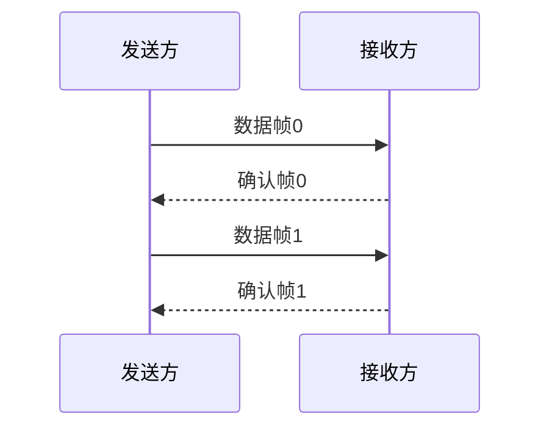

# 划重点

> 考前冲刺看这一个就够了

[toc]

## 0.计算机网络体系结构

### 0.1性能指标（特别是转发时延）

考试要关注的内容关键词（**KEY**）：

- **带宽**：在计算机网络中，指的是网络设备所支持的最高速度，单位同速率，是理想条件下**最高数据率**。相当于一个**发送速率**。

  物理网络设备所能支撑的最高速度。

- **时延**：数据从网络的一段传送到另一端所需的时间。
- **分组首部(头)**大小，**数据部分**大小。
- **分组大小**。

计算：

- 报文分成多少个分组 = 文件大小 / 一个分组大小。
- 传一次一个分组需要的时间 = 传输速率 / 分组大小。

| 名称              | 描述                                 | 计算                                          |
| :---------------- | :----------------------------------- | --------------------------------------------- |
| 发送时延/传输时延 | 数据从主机到信道上所用的时间         | **发送的数据帧长度(bit)/发送速率(bit/s)**     |
| 传播时延          | 数据在信道上传播所花费的时间         | **信道长度(m)/电磁波在信道上传播的速率(m/s)** |
| 排队时延          | 数据在路由器前等待前面数据处理的时间 | \                                             |
| 处理时延          | 数据在路由器中处理需求的时间         | \                                             |

总时延就是这四者之和。

使用**高速链路**仅提高网速（发送速率），只能减小发送时延，无法减少其他三个时延，不一定更快。

#### 交换方式

- **报文交换**：直接发。
- **分组交换**：一次传不开，要分多个组传。

【注意】但是要注意发送交换了**多少次**。

#### 时延带宽积

以比特为单位的链路长度。意思是链路此时此刻有多少比特的数据。

**时延带宽积（bit） = 传播时延(s) x 带宽(b/s)**

#### 往返时延RTT

发送端发送数据开始，到发送端收到来自接收端的确认（接收端收到数据后便立即发送确认），总共经历的时延（一个来回，去掉发送时延）。

**RTT = 传播时延x2 + 处理时延**(有时可能直接忽略)

RTP越大，在收到确认之前，可以发送的数据越多，因为等回复的时间长。

### 0.2计网分层模型

> 物联网淑慧适用

#### 1）物理层

1. 设备：**Hub集线器，中继器**
2. 单位：bit
2. 功能
   1. 定义接口和媒体的物理特性
   2. 定义比特的表示、数据传输速率、信号的传输模式
      1. 单工
      2. 半双工
      3. 全双工
   3. 定义网络物理拓扑
      1. 网状
      2. 星型
      3. 环型
      4. 总线型等拓扑
4. 作用：负责把逐个的比特从一跳（结点）移动到另一跳（结点）

#### 2）数据链路层

1. 设备：**switch交换机，网桥**
1. 单位：帧
1. 协议：以太网协议
2. **MAC**：介质访问控制：802.3
   - MAC地址有48位（48bit），通常被表示为点分十六进制数。
3. LLC子层：逻辑链路控制：802.2
4. 作用
   - 在不可靠的物理链路上，提供**可靠的数据传输**服务，把帧从一跳（结点）移动到另一跳（结点）。
   - **组帧、物理编址、流量控制、差错控制、接入控制**。
   - 作用细分：
     1. 同网段的数据通信；
     2. 识别网络层协议，通过TYPE字段；
     3. 为IP模块发送、接收数据；
     4. 为ARP模块发送ARP请求和接收ARP应答；
     5. 为RARP模块发送RARP请求和接收RARP应答。

#### 3）❗网络层

1. 设备：**路由器**
   1. 广播、组播隔绝
   2. 寻址及转发，选择到达目的网络的最佳路径
   3. 流量管理
   4. 连接广域网(WAN)

2. 单位：IP数据报
3. 协议
   1. IP协议
   2. APR协议（地址解析协议）
   3. ICMP

4. 逻辑地址
   - IP地址：32bit
5. 作用
   - 为网络设备提供**逻辑地址**（三层地址）；
   - 进行**路由选择**、**维护路由表**；
   - 负责将分组数据从源端传输到目的端。
   - 作用细分：
     1. 实现不同网段数据通信
     2. 进行包分片
        1. 数据包
        2. MTU
     3. 识别传输层协议（协议号）
        1. TCP:6
        2. UDP:17

#### 4）传输层

1. 每个进程通过一个端口来标识，具有复用和分用功能：
   1. **复用**指多个应用进程同时使用传输层传输；
   2. **分用**指传输层把收到的信息分别交给上层不同的进程。
2. 传输层为资源子网屏蔽了下层的通信子网。
3. 协议
   1. **TCP协议**：保证文件传输的完整性以及准确性，对每个发送的数据包确认，只有真的收到了,才算发送成功。
   2. **UDP协议**：视频聊天时，可以接受数据包的丢失（画质不清晰）但不能接受延迟，不对所有数据包确认。
4. 作用
   1. 负责建立**端到端**的连接，保证报文在端到端之间的传输。
   2. **服务点编址、分段与重组、连接控制、流量控制、 差错控制**。

#### 5）会话层

1. 通信的三种方式
   1. 单工
   2. 半双工
   3. 全双工
2. 作用
   1. 负责建立、管理和终止表示层实体之间的**会话连接**。
   2. 在设各或节点之间提供**会话控制**。

#### 6）表示层

1. 标准
   1. ASCII
   2. JPEG
2. 作用
   1. 数据的**解码和编码**
   2. 数据的**加密和解密**
   3. 数据的**压缩和解压缩**

#### 7）应用层

1. 协议
   1. SSH（安全远程登录）
   2. http（超文本传输协议）
      - 端口号：80
   3. FTP（文件传输协议）
      - 端口号：21、20
   4. SMTP（简单邮件传输协议）
      - 端口号：25
   5. POP3（邮局协议）
      - 端口号：110
   6. telnet（远程登录）
      - 端口号：23
   7. DNS（域名解析协议）
      - udp53
2. 作用
   1. **产生数据**（PDU协议数据单元）。
   2. 为**应用软件提供接口**，使应用程序能够使用网络服务。

五层参考模型中，把TCP/IP模型中的网络接口层分为**数据链路层**和**物理层**

#### OSI与TCP/IP对比

面向连接：需要建立连接

无连接：可以直接进行数据传输

|            | IOS/OSI参考模型                              | TCP/IP模型                             |
| ---------- | -------------------------------------------- | -------------------------------------- |
| **网络层** | 无连接+面向连接                              | 无连接（不可靠）                       |
| **传输层** | 面向连接                                     | 无连接+面向连接                        |
| 设计理念   | 自上而下，首先设计理想化的模型，然后尝试使用 | 自下而上，从实际的技术应用出发进行设计 |

## 1.物理层

### 1.1❗信道数据传输速率

#### 1.1.1奈氏准则

奈奎斯特定理：在理想低通（没有噪声、带宽有限）的信道中，为了避免码间串扰，极限码元传输率（**波特率**）为2W Baud。则极限**数据传输率** （单位：b/s）为：

$$
理想低通信道下的极限数据传输率=2W*log_2V
$$

- `W`是理想低通信道的**带宽**，单位为Hz。
- `2W`是波特率。
- `V`表示每个码元离散电平的**数目**，即**信号状态数**。（如4个相位，4个振幅，就有16种基本波形）。

#### 1.1.2信噪比

信号的平均功率与噪声的平均功率之比，S/N，单位是dB分贝。
$$
信噪比(dB)=10*log_{10}(\frac SN)
$$
例如：S/N=10，信噪比=10dB
			S/N=1000，信噪比=30dB

#### 1.1.3香农公式

考虑**噪声**干扰的信道的极限、无差错的信息传输速率，单位是bit/s。信道的**最大信息传输速率 C** 可表达为 ：
$$
C = W*log_2(1+\frac SN)
$$

- `W`为信道的**带宽**，单位为Hz。
- `S`为信道内所传信号的平均功率。
- `N`为信道内部的高斯噪声功率。

### 1.2调制

### 1.3编码

### 1.4接口特性

确定与传输媒体的接口有关的一定特性：

- 机械特性：定义物理连接特性，指明接口所用的**接线器的形状、尺寸、引脚数目、排列**等规格。
- 电气特性：规定传输二进制时，线路上信号的**电压范围、阻抗匹配、传输速率、距离限制**等。
- 功能特性：指明某条线上出现的某一电平的**电压的意义，线的功能**。
- 过程特性：定义各条物理路线的工作**规程和时序**（可能事件出现的**顺序**）。

## 2.数据链路层

### 2.1❗流量控制&可靠传输机制

限制发送方（数据链路层和**传输层**都有）

| 层         | 类型   | 控制手段                                     |
| ---------- | ------ | -------------------------------------------- |
| 数据链路层 | 点到点 | 接收端收不下就不回复                         |
| 传输层     | 端到端 | 接收端给发送端发送窗口公告（缓冲区还有多大） |

同帧序号位数下，三者的最大信道利用率排序：停止等待 > SR > GBN。

#### 2.1.1停止-等待协议（流量控制）

每次发送一个帧，等发送方收到接收方确认帧之后，再发下一个帧。

因为**超时计时器**（重传时间比平均时延长）的存在，所以要满足下面

- 发送完一个帧之后，保留它的副本，以便下一次发送。（超时重发）
- 数据帧、确认帧必须编号。

##### 信道利用率

- $T_D$：数据帧的发送时延（比特数越长时延就越长）$T_D$=帧长度/数据传输速率C。

- $T_A$：确认帧的发送时延。

- RTT：**往返**时延（注意看是单向还是往返）。

> 
>
> 没有说$T_A$，所以不用加上。2\*30ms是RTT。

#### 2.1.2后退N帧协议(GBN)（可靠传输机制）

重点：

- 积累确认
- 接收方只接收顺序帧，无序直接丢弃
- 确认序号最是大的、按序到达的帧
- 发送窗口大小
  - 1<发送窗口大小<2^n^ -1。
  - 接受窗口大小=1。

回退到第一个出问题的地方，全部重传。

缺点：一个帧出错，后面没有出错的帧也要重传，批量重传。

#### 2.1.3选择重传协议(SR)（可靠传输机制）

对每个帧都进行确认，当超时（超时间隔），就只发送丢失的帧。

发送窗口大小>1，接受窗口大小>1。发送窗口最好=接收窗口。
$$
1 \le 窗口大小W \le 2^{n-1}
$$

### 2.2CSMA协议

> 链路管理 - 介质访问控制 - 随机访问介质访问控制。

|                                      | CSMA/CD                                                      | CSMA/CA                                                      |
| ------------------------------------ | ------------------------------------------------------------ | ------------------------------------------------------------ |
| 相同                                 | 1. 都属于CSMA思路，核心是先监听信道，再发送数据              | 2. 冲突之后都会进行重传                                      |
| 传输介质不同                         | 总线式以太网（有线）                                         | 无线局域网（无线）                                           |
| 载波检测方式不同（传输介质不同导致） | 通过电缆电压变化检测。数据发生碰撞时，电缆中的电压会随之发生变化。 | 结合能量检测（ED）、载波检测（CS）、能量载波混合检测三种检测信道是否空闲。 |
|                                      | 检测冲突                                                     | 避免冲突                                                     |

#### 2.2.1❗CSMA/CD协议

CSMA/CD（载波监听多路访问/冲突检测）协议是CSMA协议的改进。

CD：**碰撞检测**（冲突检测，只能检测不能避免）：**边发送，边监听**（半双工）总线式以太网。

2τ（2涛）时间是一个来回（传输时延，也叫**争用期**）。

确定碰撞后的重传时机：**截断二进制指数规避算法**。

1. 确定基本退避（推迟）时间为争用期2τ。
2. 确定参数k，但k不超过10，即k=min[重传次数，10]。
   1. 当重传次数<10时，k=重传次数；
   2. 当大于10时，k=10。
3. 从离散的整数集合[0, 1, ..., 2^k^-1]随机取出一个**随机数r**。
   - 重传所需的退避时间就是r倍的基本退避时间，即**2τ*r**。
4. 当重传达**16次**仍然不成功，说明网络太拥挤，认为此帧永远无法正确发出，抛弃此帧并向高层报告出错。

**最小帧长度**：帧的传输时延至少2倍于τ（信号在总线中的传播时延）。
$$
争用期2τ = 2*\frac{传输距离}{信号传播速率} \\[1em]
最小帧长 = 2τ*数据传输速率 \\
↓反过来\\
帧的传播时延=\frac {最小帧长}{数据传输速率} \ge 2τ \\[3em]
退避时间 = 2τ*随机数r
$$

【注意：隐含的条件】

1. 以太网规定，最短帧长（最小帧长）为**64B**，凡是小于64B的帧都是由于冲突而异常终止的无效帧。

2. 设备**100Base-T**的意思：

   1. 数据传输速率为**100Mb/s**。

   2. **base**：基带信号传输

   3. **T**：双绞线。采用无屏蔽双绞线（UTP），每段双绞线最长100m（集线器到PC）。

   4. 如果后面是**F**：光纤。

   5. 物理上：星型拓扑；

      逻辑上：总线型拓扑；

      编码：曼彻斯特编码；

      介质访问控制：CSMA/CD。

#### 2.2.1 CSMA/CA协议

CA：**碰撞避免**（只能避免不能检测）：适用于无线局域网。

CSMA/CA允许发送方先对信道进行预约，引入了两种控制帧：（注意，预约信道并不是强制的，可以选择不预约）

- **RTS**帧包括源地址、目的地址、本次通信所需持续时间（用于虚拟载波侦听）。
- **CTS**帧包括本次通信所需时间（用于虚拟载波侦听）。

【2011年】能对正确收到的数据帧进行确认。

---

在发送数据之前，先检测信道是否空闲，切实发送之前还会再等一会，防止碰撞

- 空闲就发送**RTS**
  1. 接收方收到RTS之后回复**CTS**
  2. 发送方收到CTS之后，开始发送**数据帧**，同时**预约信道**（告知其他站点自己要发送多久数据）
  3. 接收端收到数据帧之后，用CRC来检验数据是否正确，正确就回复**ACK**
  4. 发送方收到ACK就进行下一个数据帧的发送/没有收到就使用**二进制退避算法**一直重传

### 2.3信道复用技术

复用：有三个单独的通道，使用三个信道，但在发送端使用复用器，接收方使用分用器，把合起来传输的信息分别送到相应的终点。

1. **频分复用**（FDM）
   - 各路信号分别使用**不同的频率位置**，使得彼此不产生干扰。
   - 各路信号在同样的时间占用不同的带宽资源。
2. **时分复用**（TDM）
   - 每一路占用的**时隙周期性出现**。也称等时信号
   - 时分复用的所有用户是在不同的时间占用同样的频带宽度。若每个时分复用的帧长度是不变的125μs，有1000个用户，则每一个用户分配到的时隙宽度就是0.125μs。
3. **波分复用**（WDM）
   - 一根光纤中复用2路光载波信号。
   - 通信是由光来运载信号进行传输的方式。在光通信领域，人们习惯按波长而不是按频率来命名。因此，所谓的波分复用其本质上也是**光的频分复用**。
4. **密集波分复用技术**（DWDM）
   - 一根光纤中复用几十路甚至更多路光载波信号。
5. ❗**码分复用**（CDM）

   - 不同的站点之间，当使用码分复用技术，不同站点之间的码片序列是**==正交==（两两相乘和为0）**的。
   - 当码分复用信道为多个不同的地址的用户所共享时，就称**码分多址（CDMA）**。

### 2.4 IEEE802标准

IEEE 802 LAN/MAN 标准委员会（1980.2月成立）定义了局域网标准。

IEEE802标准描述的数据链路层分为：

1. 逻辑链路控制子层（LLC）：服务网络层
2. 介质访问控制子层（MAC）：服务物理层
   - 【2012年】以太网MAC协议提供：无连接的不可靠服务。

802.11标准数据帧的地址关系：

|            | 地址1    | 地址2            | 地址3            |
| ---------- | -------- | ---------------- | ---------------- |
| 发往AP     | 目的地址 | AP               | 源地址（一开始） |
| 从AP发出来 | AP       | 源地址（一开始） | 目的地址         |

**【技巧】AP右边的地址是源地址**。

### 2.5差错检测

简单来说，传输中的差错是由噪声引起的。

- 随机噪声：线路本身的电气特性造成，信道固有的。所以我们提高**信噪比**来避免干扰。
- 冲击噪声：外界特定的短暂的原因造成，也是产生差错的**主要原因**。

差错分类

- 位错：比特位出错，1变成0，0变成1.
- 帧错[#1]-[#2]-[#3]（下面3种都是出现**传输差错**，但不是**比特差错**）
  - 丢失：数据中某一帧丢掉了[#1]-[#3]
  - 重复：某一帧重发发送了一次[#1]-[#2]-[#2]-[#3]
  - 失序：接收端收到的顺序变了[#1]-[#3]-[#2]

误码率BER（Bit Error Rate）：传输错误的的比特占传输比特总数的比率。

bit错,差错控制

- **检错**编码：只是发现有错误。
  - 奇偶校验码
  - **循环冗余码CRC**
- **纠错**编码：不仅能发现错误，还能知道是哪一个地方发生错误。
  - 海明码

在数据传输中检测差错的3种技术：

#### 2.5.1奇偶校验

**前面**加校验元1/0。

假设，要发送的信息 D 有 d 个比特。

在偶校验方案中，发送方只需包含一个附加的比特，选择附加比特的值，使得这 d+1 个比特（初始信息加上一个校验比特）中 **1 的总数是偶数**。

接收方的操作也很简单。接收方只需要数一数接收的 d+1 比特中 1 的个数。

如果发现了奇数个值为 1 的比特，接收方知道了至少出现了一个比特差错。更确切的说法是，出现了奇数个差错比特。但是如果出现了偶数个比特差错，显然这种方法无法检测这种错误。

二维单比特奇偶校验方案中，D 中的 d 个比特被划分为 i 行 j 列。对每行和每列计算奇偶值。产生的 i+j+1 奇偶比特构成了链路层帧的差错检测比特。这种方法可以检测和纠正 1 比特的错误。

>如发了一串数10101101
>
>- 采用奇校验，奇数个1，前面补0，（偶数个1，前面补1）010101101，
>- 采用偶校验，奇数个1，前面补1，（偶数个1，前面补0）
>
>判断发送是否正确，数数1的个数

#### 2.5.2循环冗余检测CRC

在数据发送之前，按照某种关系附加上一定的冗余码，构成一个符合某一个规则的码字之后再发送。当发送的数据发生变化时，冗余码也发生变化，使其不再遵守规则。接收端通过检验是否符合规则判断是否出错。

CRC 编码也称为**多项式编码**，因为该编码将要发送的比特串看作是系数为 0 和 1 的一个 多项式，对比特串的操作被解释为多项式运算。

---

如，发送端：

| 要传的数据 |      | 生成多项式 |            | 冗余码/帧检验序列FCS |
| ---------- | ---- | ---------- | ---------- | -------------------- |
| 5          | %    | 2          | = 2 ...... | 1                    |

5%2=2...1

最终发送的数据是，**要发送的数据**+**真检测序列FCS**。这里就是5+1=6

接收端： 

6%2=3...0（余数是0，判定无错，就接受）

---

**计算冗余码FCS步骤**：

1. 在要传的数据后加0。
2. 模2除法。
3. 最终发送的数据：要发送的数据+FCS。

- 如果余数为0，判定这个帧没有差错。（接受）

- 如果余数不为0，判定这个帧有差错。（丢弃）

FCS的生成以及接收端CRC检验都是由**硬件实现**的，处理很迅速，不会产生延迟数据。

**只使用CRC**：凡是接收端数据链路层接受的帧均无差错。能够实现无比特差错的传输，但不是可靠传输（因为错误的帧丢弃了，接收端并没有收到）。

**可靠传输**：数据链路层发什么，接收端就接收什么。

#### 2.5.3海明码

可以发现**双**比特错，但是只能纠正**单**比特错。

工作原理：动一发而牵全身

工作流程：

1. 确认校验码位数R
2. 确定校验码和数据的位置
3. 求出校验码的值
4. 检错并纠错

海明不等式：
$$
2^r \ge k+r+1
$$
r：冗余信息位（校验码位数）

k：信息位（原始数据的位数）

> 例子：数据D=101101
> ∴ 数据位数k=6
> ∵ 海明不等式
> ∴ 满足不等式的最小r=4
> ∴ D的海明码应该有6+4=10位
> 其中原数据6位，效验码4位

校验码是插入原数据之中的，而且，只能放在**2的几次方的位置**

设4位效验码依次是p1, p2, p3, p4，则它们放在

| 位数           | 1        | 2      | 3        | 4      | 5        | 6    | 7        | 8      | 9        | 10   |
| -------------- | -------- | ------ | -------- | ------ | -------- | ---- | -------- | ------ | -------- | ---- |
| 位数的二进制   | 000**1** | 0010   | 001**1** | 0100   | 010**1** | 0110 | 011**1** | 1000   | 100**1** | 1010 |
| 代码           | **p1**   | **p2** | d1       | **p3** | d2       | d3   | d4       | **p4** | d5       | d6   |
| 实际值（内容） | 0        | 0      | 1        | 0      | 0        | 1    | 1        | 1      | 0        | 1    |
| 原数据         |          |        | 0        |        | 0        | 1    | 1        |        | 0        | 1    |

一个校验码可以校验多位数据：

p1的二进制位1在末尾（在上图标黑），所以它可以效验1在末尾的数据。

求p1：p1的值要满足，**要校验的所有数据中第一位是1的数据值<u>异或（不同为1）</u>为0**：**p1⊕d1⊕d2⊕d4⊕d5=0**。
将代码对应的实际值代入，得到p1=0

同理，p2的1在第二位，p2⊕d1⊕d3⊕d4⊕d6=0，p2=0。

p3=0，p4=1。

所以，D=101101的海明码就是0010011101。

当接收方收到时候，就会重复上述异或过程，就会检查出那个比特出错了。

### 2.6交换机switch

以太网交换机实质上就是一个多端口的**网桥**，通常都有十几个或更多的端口。

1. **交换机自学习**：

   - **转发表**里面没有目标端口，那么就**广播（所有的线都发一遍）**。
   - 哪个机器发送了数据，就在转发表记录这个机器与发送数据使用的端口进行对应。

2. **碰撞域**：以太网交换机的每个端口都直接与一个单台主机或另一个以太网交换机相连，并且，每一个端口和连接到端口的主机构成了一个**碰撞域**：

   - **n个端口就有n个碰撞域**。
   - 交换机有隔离冲突域的能力。

3. **繁忙时缓存**：以太网交换机的端口还有存储器，能在输出端口繁忙时把到来的帧进行缓存。
   如果连接在以太网交换机上的两台主机，同时向另一台主机发送帧，那么当这台主机的端口繁忙时，发送帧的这两台主机的端口会把收到的帧暂存一下，以后再发送出去。

4. **并行性**：以太网交换机还具有并行性，即能同时连通多对端口，使多对主机能同时通信。

   例如带宽有10Mbit/s：

   - 对于传统的**共享式以太网**，若共有10个用户，则每个用户占有的平均带宽只有**1Mbit/s**，即1/10。

   - 若使用**以太网交换机**来连接这些主机，由于一个用户在通信时是独占而不是和其他网络用户共享传输媒体的带宽，所有大家都是**10Mbit/s**。

5. 【2009年】进行转发决策时候使用的PDU地址是目的物理地址。

6. 【2013年】直接交换的大小是6B。

## 3.❗网络层

### 3.1 IP地址

### 3.2 IP分组转发

### 3.3 数据报格式

### 3.4 DHCP

### 3.5 NAT

# TCP：传输控制协议

​	协议号：6
​	TCP头部
​		端口号：传输层端口号识别应用层协议
​			HHTP：80
​			FTP：20，21
​			......
​		标志位
​			ACK（确认位）
​			SYN（请求位）
​			FIN（结束位）
​		窗口大小Windows
​	面向链接：传送数据之前建立连接（可靠）
​	可靠的原因
​		传输数据之前：TCP三次握手
​			1.主机sent SYN
​			2.服务器sent SYN,ACK
​			3.主机sent ACK
​		传输数据过程中：
​			确认号确认机制（丢包重传机制）
​			滑动窗口机制（流量控制机制）
​		传输数据之后：TCP四次分手
​			1.主机sent FIN,ACK
​			2.服务器sent ACK
​			3.服务器sent FIN,ACK
​			4.主机sent ACK
