# 划重点

> 考前冲刺看这一个就够了

[toc]

## 0.计算机网络体系结构

### 0.1性能指标（特别是转发时延）

考试要关注的内容关键词（**KEY**）：

- **带宽**：在计算机网络中，指的是网络设备所支持的最高速度，单位同速率，是理想条件下**最高数据率**。相当于一个**发送速率**。

  物理网络设备所能支撑的最高速度。

- **时延**：数据从网络的一段传送到另一端所需的时间。
- **分组首部(头)**大小，**数据部分**大小。
- **分组大小**。

计算：

- 报文分成多少个分组 = 文件大小 / 一个分组大小。
- 传一次一个分组需要的时间 = 传输速率 / 分组大小。

| 名称              | 描述                                 | 计算                                          |
| :---------------- | :----------------------------------- | --------------------------------------------- |
| 发送时延/传输时延 | 数据从主机到信道上所用的时间         | **发送的数据帧长度(bit)/发送速率(bit/s)**     |
| 传播时延          | 数据在信道上传播所花费的时间         | **信道长度(m)/电磁波在信道上传播的速率(m/s)** |
| 排队时延          | 数据在路由器前等待前面数据处理的时间 | \                                             |
| 处理时延          | 数据在路由器中处理需求的时间         | \                                             |

总时延就是这四者之和。

使用**高速链路**仅提高网速（发送速率），只能减小发送时延，无法减少其他三个时延，不一定更快。

#### 交换方式

- **报文交换**：直接发。
- **分组交换**：一次传不开，要分多个组传。

【注意】但是要注意发送交换了**多少次**。

#### 时延带宽积

以比特为单位的链路长度。意思是链路此时此刻有多少比特的数据。

**时延带宽积（bit） = 传播时延(s) x 带宽(b/s)**

#### 往返时延RTT

发送端发送数据开始，到发送端收到来自接收端的确认（接收端收到数据后便立即发送确认），总共经历的时延（一个来回，去掉发送时延）。

**RTT = 传播时延x2 + 处理时延**(有时可能直接忽略)

RTP越大，在收到确认之前，可以发送的数据越多，因为等回复的时间长。

### 0.2计网分层模型

> 物联网淑慧适用

#### 0.2.1报文段之间的联系

- 应用层：应用层数据

- 传输层：报文段、数据段
	| TCP首部 / UDP首部 | 应用层数据 |
    | ----------------- | ---------- |

- 网络层：
	| 报文段 | IP首部 |
  | ------ | ------ |

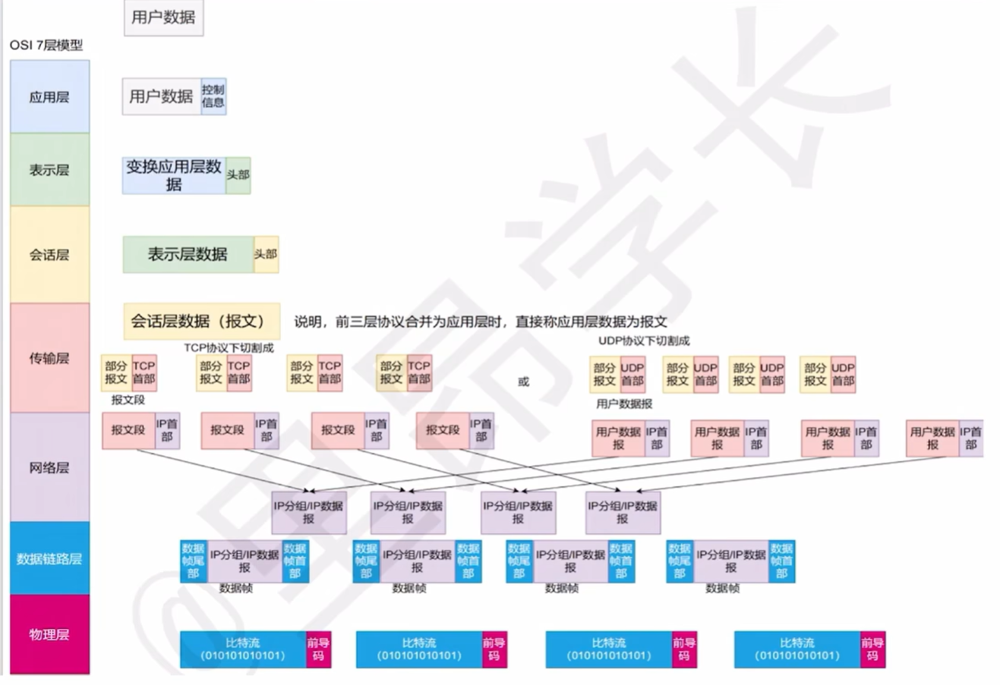

#### 1）物理层

1. 设备：**Hub集线器，中继器**
2. 单位：bit
2. 功能
   1. 定义接口和媒体的物理特性
   2. 定义比特的表示、数据传输速率、信号的传输模式
      1. 单工
      2. 半双工
      3. 全双工
   3. 定义网络物理拓扑
      1. 网状
      2. 星型
      3. 环型
      4. 总线型等拓扑
4. 作用：负责把逐个的比特从一跳（结点）移动到另一跳（结点）

#### 2）数据链路层

1. 设备：**switch交换机，网桥**
1. 单位：帧
3. 协议：
   - 以太网协议
   - PPP协议

4. **MAC**：介质访问控制：802.3
   - MAC地址有48位（48bit），通常被表示为点分十六进制数。
5. LLC子层：逻辑链路控制：802.2
6. 作用
   - 在不可靠的物理链路上，提供**可靠的数据传输**服务，把帧从一跳（结点）移动到另一跳（结点）。
   - **组帧、物理编址、流量控制、差错控制、接入控制**。
   - 作用细分：
     1. 同网段的数据通信；
     2. 识别网络层协议，通过TYPE字段；
     3. 为IP模块发送、接收数据；
     4. 为ARP模块发送ARP请求和接收ARP应答；
     5. 为RARP模块发送RARP请求和接收RARP应答。

#### 3）❗网络层

1. 设备：**Router路由器**（有时候叫**网关**）
   1. 广播、组播隔绝
   2. 寻址及转发，选择到达目的网络的最佳路径
   3. 流量管理
   4. 连接广域网(WAN)
2. 单位：IP数据报
3. 协议
   1. IP协议：0X0800
   2. APR协议（地址解析协议）：0X0806
   3. ICMP：
      - 封装在IP分组。
      - ping这个ICMP的数据包。
4. 逻辑地址
   - IP地址：32bit
5. 作用
   - 为网络设备提供**逻辑地址**（三层地址）；
   - 进行**路由选择**、**维护路由表**；
   - 负责将分组数据从源端传输到目的端。
   - 作用细分：
     1. 实现不同网段数据通信
     2. 进行包分片
        1. 数据包
        2. MTU
     3. 识别传输层协议（协议号）
        1. TCP:6
        2. UDP:17

#### 4）传输层

1. 每个进程通过一个端口来标识，具有复用和分用功能：
   1. **复用**指多个应用进程同时使用传输层传输；
   2. **分用**指传输层把收到的信息分别交给上层不同的进程。
2. 传输层为资源子网屏蔽了下层的通信子网。
3. 协议
   1. **TCP协议**：保证文件传输的完整性以及准确性，对每个发送的数据包确认，只有真的收到了,才算发送成功。
   2. **UDP协议**：视频聊天时，可以接受数据包的丢失（画质不清晰）但不能接受延迟，不对所有数据包确认。
4. 作用
   1. 负责建立**端到端**的连接，保证报文在端到端之间的传输。
   2. **服务点编址、分段与重组、连接控制、流量控制、 差错控制**。

#### 5）会话层

1. 通信的三种方式
   1. 单工
   2. 半双工
   3. 全双工
2. 作用
   1. 负责建立、管理和终止表示层实体之间的**会话连接**。
   2. 在设各或节点之间提供**会话控制**。

#### 6）表示层

1. 标准
   1. ASCII
   2. JPEG
2. 作用
   1. 数据的**解码和编码**
   2. 数据的**加密和解密**
   3. 数据的**压缩和解压缩**

#### 7）应用层

1. 协议
   1. SSH（安全远程登录）
   2. HTTP（超文本传输协议）
      - **端口号：80**
   3. FTP（文件传输协议）
      - 端口号：21、20
   4. SMTP（简单邮件传输协议）
      - 端口号：25
   5. POP3（邮局协议）
      - 端口号：110
   6. telnet（远程登录）
      - 端口号：23
   7. DNS（域名解析协议）
      - udp53
2. 作用
   1. **产生数据**（PDU协议数据单元）。
   2. 为**应用软件提供接口**，使应用程序能够使用网络服务。

五层参考模型中，把TCP/IP模型中的网络接口层分为**数据链路层**和**物理层**

#### OSI与TCP/IP对比

面向连接：需要建立连接

无连接：可以直接进行数据传输

|            | IOS/OSI参考模型                              | TCP/IP模型                             |
| ---------- | -------------------------------------------- | -------------------------------------- |
| **网络层** | 无连接+面向连接                              | 无连接（不可靠）                       |
| **传输层** | 面向连接                                     | 无连接+面向连接                        |
| 设计理念   | 自上而下，首先设计理想化的模型，然后尝试使用 | 自下而上，从实际的技术应用出发进行设计 |

## 1.物理层

### 1.1❗信道数据传输速率

#### 1.1.1奈氏准则

奈奎斯特定理：在理想低通（没有噪声、带宽有限）的信道中，为了避免码间串扰，极限码元传输率（**波特率**）为2W Baud。则极限**数据传输率** （单位：b/s）为：

$$
理想低通信道下的极限数据传输率=2W*log_2V
$$

- `W`是理想低通信道的**带宽**，单位为Hz。
- `2W`是波特率。
- `V`表示每个码元离散电平的**数目**，即**信号状态数**。（如4个相位，4个振幅，就有16种基本波形）。

#### 1.1.2信噪比

信号的平均功率与噪声的平均功率之比，S/N，单位是dB分贝。
$$
信噪比(dB)=10*log_{10}(\frac SN)
$$
例如：S/N=10，信噪比=10dB
			S/N=1000，信噪比=30dB

#### 1.1.3香农公式

考虑**噪声**干扰的信道的极限、无差错的信息传输速率，单位是bit/s。信道的**最大信息传输速率 C** 可表达为 ：
$$
C = W*log_2(1+\frac SN)
$$

- `W`为信道的**带宽**，单位为Hz。
- `S`为信道内所传信号的平均功率。
- `N`为信道内部的高斯噪声功率。

### 1.2调制

### 1.3编码

### 1.4接口特性

确定与传输媒体的接口有关的一定特性：

- 机械特性：定义物理连接特性，指明接口所用的**接线器的形状、尺寸、引脚数目、排列**等规格。
- 电气特性：规定传输二进制时，线路上信号的**电压范围、阻抗匹配、传输速率、距离限制**等。
- 功能特性：指明某条线上出现的某一电平的**电压的意义，线的功能**。
- 过程特性：定义各条物理路线的工作**规程和时序**（可能事件出现的**顺序**）。

## 2.数据链路层

### 2.1❗流量控制&可靠传输机制

限制发送方（数据链路层和**传输层**都有）

| 层         | 类型   | 控制手段                                     |
| ---------- | ------ | -------------------------------------------- |
| 数据链路层 | 点到点 | 接收端收不下就不回复                         |
| 传输层     | 端到端 | 接收端给发送端发送窗口公告（缓冲区还有多大） |

同帧序号位数下，三者的最大信道利用率排序：停止等待 > SR > GBN。

#### 2.1.1停止-等待协议（流量控制）

每次发送一个帧，等发送方收到接收方确认帧之后，再发下一个帧。

因为**超时计时器**（重传时间比平均时延长）的存在，所以要满足下面

- 发送完一个帧之后，保留它的副本，以便下一次发送。（超时重发）
- 数据帧、确认帧必须编号。

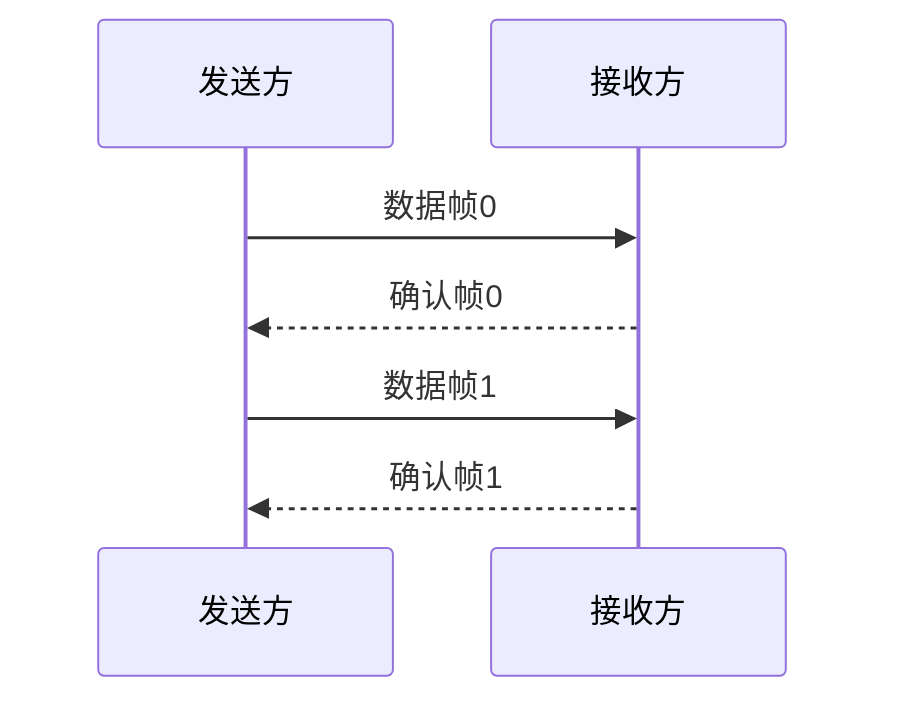

##### 信道利用率

- $T_D$：数据帧的发送时延（比特数越长时延就越长）$T_D$=帧长度/数据传输速率C。

- $T_A$：确认帧的发送时延。

- RTT：**往返**时延（注意看是单向还是往返）。

> 
>
> 没有说$T_A$，所以不用加上。2\*30ms是RTT。

#### 2.1.2后退N帧协议(GBN)（可靠传输机制）

重点：

- 积累确认
- 接收方只接收顺序帧，无序直接丢弃
- 确认序号最是大的、按序到达的帧
- 发送窗口大小
  - 1<发送窗口大小<2^n^ -1。
  - 接受窗口大小=1。

回退到第一个出问题的地方，全部重传。

缺点：一个帧出错，后面没有出错的帧也要重传，批量重传。

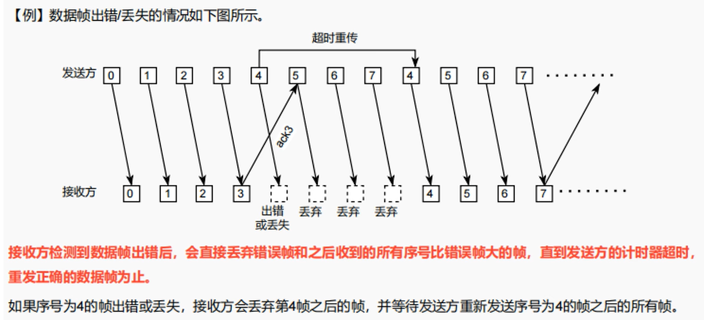

#### 2.1.3选择重传协议(SR)（可靠传输机制）

对每个帧都进行确认，当超时（超时间隔），就只发送丢失的帧。

发送窗口大小>1，接受窗口大小>1。发送窗口最好=接收窗口。
$$
1 \le 窗口大小W \le 2^{n-1}
$$

### 2.2CSMA协议

> 链路管理 - 介质访问控制 - 随机访问介质访问控制。

|                                      | CSMA/CD                                                      | CSMA/CA                                                      |
| ------------------------------------ | ------------------------------------------------------------ | ------------------------------------------------------------ |
| 相同                                 | 1. 都属于CSMA思路，核心是先监听信道，再发送数据              | 2. 冲突之后都会进行重传                                      |
| 传输介质不同                         | 总线式以太网（有线）                                         | 无线局域网（无线）                                           |
| 载波检测方式不同（传输介质不同导致） | 通过电缆电压变化检测。数据发生碰撞时，电缆中的电压会随之发生变化。 | 结合能量检测（ED）、载波检测（CS）、能量载波混合检测三种检测信道是否空闲。 |
|                                      | 检测冲突                                                     | 避免冲突                                                     |

#### 2.2.1❗CSMA/CD协议

CSMA/CD（载波监听多路访问/冲突检测）协议是CSMA协议的改进。

CD：**碰撞检测**（冲突检测，只能检测不能避免）：**边发送，边监听**（半双工）总线式以太网。

2τ（2涛）时间是一个来回（传输时延，也叫**争用期**）。

确定碰撞后的重传时机：**截断二进制指数规避算法**。

1. 确定基本退避（推迟）时间为争用期2τ。
2. 确定参数k，但k不超过10，即k=min[重传次数，10]。
   1. 当重传次数<10时，k=重传次数；
   2. 当大于10时，k=10。
3. 从离散的整数集合[0, 1, ..., 2^k^-1]随机取出一个**随机数r**。
   - 重传所需的退避时间就是r倍的基本退避时间，即**2τ*r**。
4. 当重传达**16次**仍然不成功，说明网络太拥挤，认为此帧永远无法正确发出，抛弃此帧并向高层报告出错。

**最小帧长度**：帧的传输时延至少2倍于τ（信号在总线中的传播时延）。
$$
争用期2τ = 2*\frac{传输距离}{信号传播速率} \\[1em]
最小帧长 = 2τ*数据传输速率 \\
↓反过来\\
帧的传播时延=\frac {最小帧长}{数据传输速率} \ge 2τ \\[3em]
退避时间 = 2τ*随机数r
$$

【注意：隐含的条件】

1. 以太网规定，最短帧长（最小帧长）为**64B**，凡是小于64B的帧都是由于冲突而异常终止的无效帧。

2. 设备**100Base-T**的意思：

   1. 数据传输速率为**100Mb/s**。

   2. **base**：基带信号传输

   3. **T**：双绞线。采用无屏蔽双绞线（UTP），每段双绞线最长100m（集线器到PC）。

   4. 如果后面是**F**：光纤。

   5. 物理上：星型拓扑；

      逻辑上：总线型拓扑；

      编码：曼彻斯特编码；

      介质访问控制：CSMA/CD。

#### 2.2.1 CSMA/CA协议

CA：**碰撞避免**（只能避免不能检测）：适用于无线局域网。

CSMA/CA允许发送方先对信道进行预约，引入了两种控制帧：（注意，预约信道并不是强制的，可以选择不预约）

- **RTS**帧包括源地址、目的地址、本次通信所需持续时间（用于虚拟载波侦听）。
- **CTS**帧包括本次通信所需时间（用于虚拟载波侦听）。

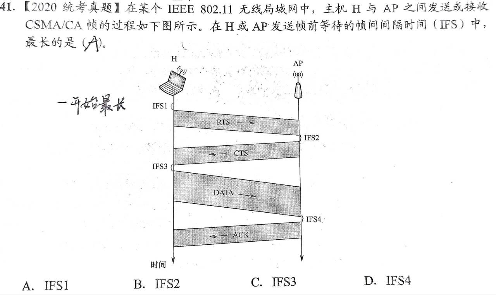

【2011年】能对正确收到的数据帧进行确认。

---

在发送数据之前，先检测信道是否空闲，切实发送之前还会再等一会，防止碰撞

- 空闲就发送**RTS**
  1. 接收方收到RTS之后回复**CTS**
  2. 发送方收到CTS之后，开始发送**数据帧**，同时**预约信道**（告知其他站点自己要发送多久数据）
  3. 接收端收到数据帧之后，用CRC来检验数据是否正确，正确就回复**ACK**
  4. 发送方收到ACK就进行下一个数据帧的发送/没有收到就使用**二进制退避算法**一直重传

### 2.3信道复用技术

复用：有三个单独的通道，使用三个信道，但在发送端使用复用器，接收方使用分用器，把合起来传输的信息分别送到相应的终点。

1. **频分复用**（FDM）
   - 各路信号分别使用**不同的频率位置**，使得彼此不产生干扰。
   - 各路信号在同样的时间占用不同的带宽资源。
2. **时分复用**（TDM）
   - 每一路占用的**时隙周期性出现**。也称等时信号
   - 时分复用的所有用户是在不同的时间占用同样的频带宽度。若每个时分复用的帧长度是不变的125μs，有1000个用户，则每一个用户分配到的时隙宽度就是0.125μs。
3. **波分复用**（WDM）
   - 一根光纤中复用2路光载波信号。
   - 通信是由光来运载信号进行传输的方式。在光通信领域，人们习惯按波长而不是按频率来命名。因此，所谓的波分复用其本质上也是**光的频分复用**。
4. **密集波分复用技术**（DWDM）
   - 一根光纤中复用几十路甚至更多路光载波信号。
5. ❗**码分复用**（CDM）

   - 不同的站点之间，当使用码分复用技术，不同站点之间的码片序列是**==正交==（两两相乘和为0）**的。
   - 当码分复用信道为多个不同的地址的用户所共享时，就称**码分多址（CDMA）**。

### 2.4 IEEE802标准

IEEE 802 LAN/MAN 标准委员会（1980.2月成立）定义了局域网标准。

IEEE802标准描述的数据链路层分为：

1. 逻辑链路控制子层（LLC）：服务网络层
2. 介质访问控制子层（MAC）：服务物理层
   - 【2012年】以太网MAC协议提供：无连接的不可靠服务。

802.11标准数据帧的地址关系：

|            | 地址1    | 地址2            | 地址3            |
| ---------- | -------- | ---------------- | ---------------- |
| 发往AP     | 目的地址 | AP               | 源地址（一开始） |
| 从AP发出来 | AP       | 源地址（一开始） | 目的地址         |

**【技巧】AP右边的地址是源地址**。

### 2.5差错检测

简单来说，传输中的差错是由噪声引起的。

- 随机噪声：线路本身的电气特性造成，信道固有的。所以我们提高**信噪比**来避免干扰。
- 冲击噪声：外界特定的短暂的原因造成，也是产生差错的**主要原因**。

差错分类

- 位错：比特位出错，1变成0，0变成1.
- 帧错[#1]-[#2]-[#3]（下面3种都是出现**传输差错**，但不是**比特差错**）
  - 丢失：数据中某一帧丢掉了[#1]-[#3]
  - 重复：某一帧重发发送了一次[#1]-[#2]-[#2]-[#3]
  - 失序：接收端收到的顺序变了[#1]-[#3]-[#2]

误码率BER（Bit Error Rate）：传输错误的的比特占传输比特总数的比率。

bit错,差错控制

- **检错**编码：只是发现有错误。
  - 奇偶校验码
  - **循环冗余码CRC**
- **纠错**编码：不仅能发现错误，还能知道是哪一个地方发生错误。
  - 海明码

在数据传输中检测差错的3种技术：

#### 2.5.1奇偶校验

**前面**加校验元1/0。

假设，要发送的信息 D 有 d 个比特。

在偶校验方案中，发送方只需包含一个附加的比特，选择附加比特的值，使得这 d+1 个比特（初始信息加上一个校验比特）中 **1 的总数是偶数**。

接收方的操作也很简单。接收方只需要数一数接收的 d+1 比特中 1 的个数。

如果发现了奇数个值为 1 的比特，接收方知道了至少出现了一个比特差错。更确切的说法是，出现了奇数个差错比特。但是如果出现了偶数个比特差错，显然这种方法无法检测这种错误。

二维单比特奇偶校验方案中，D 中的 d 个比特被划分为 i 行 j 列。对每行和每列计算奇偶值。产生的 i+j+1 奇偶比特构成了链路层帧的差错检测比特。这种方法可以检测和纠正 1 比特的错误。

>如发了一串数10101101
>
>- 采用奇校验，奇数个1，前面补0，（偶数个1，前面补1）010101101，
>- 采用偶校验，奇数个1，前面补1，（偶数个1，前面补0）
>
>判断发送是否正确，数数1的个数

#### 2.5.2循环冗余检测CRC

在数据发送之前，按照某种关系附加上一定的冗余码，构成一个符合某一个规则的码字之后再发送。当发送的数据发生变化时，冗余码也发生变化，使其不再遵守规则。接收端通过检验是否符合规则判断是否出错。

CRC 编码也称为**多项式编码**，因为该编码将要发送的比特串看作是系数为 0 和 1 的一个 多项式，对比特串的操作被解释为多项式运算。

---

如，发送端：

| 要传的数据 |      | 生成多项式 |            | 冗余码/帧检验序列FCS |
| ---------- | ---- | ---------- | ---------- | -------------------- |
| 5          | %    | 2          | = 2 ...... | 1                    |

5%2=2...1

最终发送的数据是，**要发送的数据**+**真检测序列FCS**。这里就是5+1=6

接收端： 

6%2=3...0（余数是0，判定无错，就接受）

---

**计算冗余码FCS步骤**：

1. 在要传的数据后加0。
2. 模2除法。
3. 最终发送的数据：要发送的数据+FCS。

- 如果余数为0，判定这个帧没有差错。（接受）

- 如果余数不为0，判定这个帧有差错。（丢弃）

FCS的生成以及接收端CRC检验都是由**硬件实现**的，处理很迅速，不会产生延迟数据。

**只使用CRC**：凡是接收端数据链路层接受的帧均无差错。能够实现无比特差错的传输，但不是可靠传输（因为错误的帧丢弃了，接收端并没有收到）。

**可靠传输**：数据链路层发什么，接收端就接收什么。

#### 2.5.3海明码

可以发现**双**比特错，但是只能纠正**单**比特错。

工作原理：动一发而牵全身

工作流程：

1. 确认校验码位数R
2. 确定校验码和数据的位置
3. 求出校验码的值
4. 检错并纠错

海明不等式：
$$
2^r \ge k+r+1
$$
r：冗余信息位（校验码位数）

k：信息位（原始数据的位数）

> 例子：数据D=101101
> ∴ 数据位数k=6
> ∵ 海明不等式
> ∴ 满足不等式的最小r=4
> ∴ D的海明码应该有6+4=10位
> 其中原数据6位，效验码4位

校验码是插入原数据之中的，而且，只能放在**2的几次方的位置**

设4位效验码依次是p1, p2, p3, p4，则它们放在

| 位数           | 1        | 2      | 3        | 4      | 5        | 6    | 7        | 8      | 9        | 10   |
| -------------- | -------- | ------ | -------- | ------ | -------- | ---- | -------- | ------ | -------- | ---- |
| 位数的二进制   | 000**1** | 0010   | 001**1** | 0100   | 010**1** | 0110 | 011**1** | 1000   | 100**1** | 1010 |
| 代码           | **p1**   | **p2** | d1       | **p3** | d2       | d3   | d4       | **p4** | d5       | d6   |
| 实际值（内容） | 0        | 0      | 1        | 0      | 0        | 1    | 1        | 1      | 0        | 1    |
| 原数据         |          |        | 0        |        | 0        | 1    | 1        |        | 0        | 1    |

一个校验码可以校验多位数据：

p1的二进制位1在末尾（在上图标黑），所以它可以效验1在末尾的数据。

求p1：p1的值要满足，**要校验的所有数据中第一位是1的数据值<u>异或（不同为1）</u>为0**：**p1⊕d1⊕d2⊕d4⊕d5=0**。
将代码对应的实际值代入，得到p1=0

同理，p2的1在第二位，p2⊕d1⊕d3⊕d4⊕d6=0，p2=0。

p3=0，p4=1。

所以，D=101101的海明码就是0010011101。

当接收方收到时候，就会重复上述异或过程，就会检查出那个比特出错了。

### 2.6交换机switch

以太网交换机实质上就是一个多端口的**网桥**，通常都有十几个或更多的端口。

1. **交换机自学习**：

   - **转发表**里面没有目标端口，那么就**广播（所有的线都发一遍）**。
   - 哪个机器发送了数据，就在转发表记录这个机器与发送数据使用的端口进行对应。

2. **碰撞域**：以太网交换机的每个端口都直接与一个单台主机或另一个以太网交换机相连，并且，每一个端口和连接到端口的主机构成了一个**碰撞域**：

   - **n个端口就有n个碰撞域**。
   - 交换机有隔离冲突域的能力。

3. **繁忙时缓存**：以太网交换机的端口还有存储器，能在输出端口繁忙时把到来的帧进行缓存。
   如果连接在以太网交换机上的两台主机，同时向另一台主机发送帧，那么当这台主机的端口繁忙时，发送帧的这两台主机的端口会把收到的帧暂存一下，以后再发送出去。

4. **并行性**：以太网交换机还具有并行性，即能同时连通多对端口，使多对主机能同时通信。

   例如带宽有10Mbit/s：

   - 对于传统的**共享式以太网**，若共有10个用户，则每个用户占有的平均带宽只有**1Mbit/s**，即1/10。

   - 若使用**以太网交换机**来连接这些主机，由于一个用户在通信时是独占而不是和其他网络用户共享传输媒体的带宽，所有大家都是**10Mbit/s**。

5. 【2009年】进行转发决策时候使用的PDU地址是目的物理地址。

6. 【2013年】直接交换的大小是6B。

## 3.❗网络层

### 3.1❗IP地址

IPv4地址由**32bit（32位）**（4\*8），分为两部分组成。

- **网络位（网络号）**
- **主机位（主机号）**

> 192.168.1.1/**16**

- `16`是子网掩码，是`255.255.0.0`的缩写。用于区别网络位、主机位。
- `192.168`一共是16位，就是网络位。
- `1.1`是主机位。

> 例如192.168.1.0/24下：
> 192.168.1.000 00000/27
> 192.168.1.001 00000/27
> 192.168.1.010 00000/27
> ...

不可分配给主机的主机号：

- **网络地址**：网络位不变，主机位**全为0**（二进制）；

  例如：

  - 192.168.1.**000 00000**就是192.160.1.0。
  - 192.168.1.**001 00000**就是192.168.1.32。

- **广播地址**：网络位不变，主机位**全为1**（二进制）。

  例如：

  - 192.168.1.000 00000就是192.168.1.000 **11111**->192.160.1.31
  - 192.168.1.001 00000就是192.168.1.001 **11111**->192.168.1.63

>例：网络位前24位，主机位后8位。问：主机数多少？主机IP地址范围，有多少？
>
>8位所以是：2^8^=256。就是00000000-11111111：0\~255。
>
>网络地址和广播地址不可用（0和255不可用），可用：2^8^ -2=254个。

【总结】主机位位数为n，可用的IP地址数数有2^n^ -2。

#### 3.1.0 CIDR无类别编址（网络 = 网络地址/子网掩码）

地址块数一定是 2 的整数次幂。

如果一家公司需要超过254台但少于65534台的设备，按照传统的分配方式，他们只能申请一个类B网络。即使他们只使用了其中的一部分IP地址，剩余的IP地址也不能被其他人使用，这就导致了大量IP地址的浪费。

而CIDR通过变长**子网掩码**（VLSM）可以更灵活地分配IP地址，从而减少了IP地址的浪费。例如，对于需要超过254台但少于65534台设备的公司，可以将一个类B网络分成多个小网络，每个小网络的大小刚好满足公司的需求，剩余的IP地址可以分配给其他需要的人，从而实现IP地址的有效利用。

#### 3.1.1 IP地址划分

划分子网的原则：划分出的子网IP地址空间不重叠，原来的IP地址空间不遗漏。

[划分子网例子](https://github.com/suhan42/cs-408/blob/main/计算机网络CN25'/划分子网.md)

- **子网个数**

看网络号、子网掩码。网络号后面，子网掩码固定的。几位，就是2^n^个子网。

- **主机数、地址个数**

IPv4共32位，看子网掩码多少位，剩下的就是用于主机划分的位数n。2^n^ -2个主机。

【注意】要减去网络地址、广播地址两个。

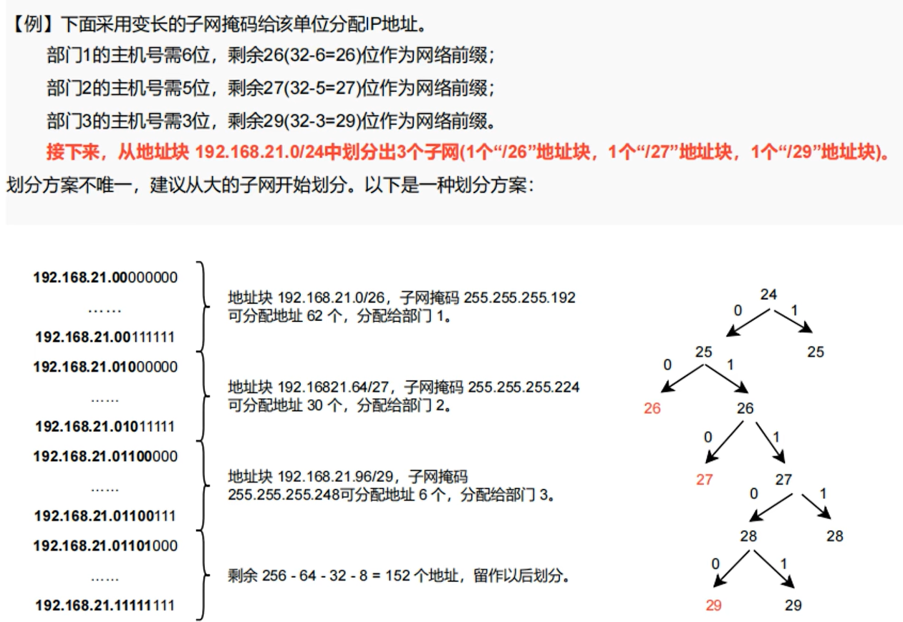

一个掩码24的IP地址可以分成两个（第25位是1、0）掩码为25的IP地址。

#### 3.1.2 特殊IP地址

- **不能用于源地址：广播：主机号全1**。
- **不能用于目的地址：网络号全0**。

| 网络位（主机号） | 主机位（主机号）       | 源地址使用？ | 目的地址使用？ | 含义                                      |
| ---------------- | ---------------------- | ------------ | -------------- | ----------------------------------------- |
| 0                | 0                      | √            | ×              | 全0，在本网络上的本主机（DHCP协议）。     |
| 0                | x                      | √            | ×              | 在本网络上的，主机号为x的主机。           |
| 全1              | 全1                    | ×            | √              | 全1，在本网络上广播（路由器不转发）。     |
| y                | 全1                    | ×            | √              | 对网络号为y，的网络上的所有主机进行广播。 |
| 127              | 非全0，全1的其他任何数 | √            | √              | 本地环回测试。                            |

- **127.0.0.1**

127是一个保留地址，该地址是指电脑本身，主要作用是预留下作为测试使用。该地址还有 一个别名叫“localhost”，无论是哪个程序，一旦使用该地址发送数据，协议软件会立即返回，不进行任何网络传输，除非出错，包含该网络号的分组是不能够出现在任何网络上的。

- **0.0.0.0**

严格意义上来说，0.0.0.0已经不是真正意义上的ip地址了。

它表示的是这样一个集合，所有不清楚的主机和目的网络。这里的不清楚是指在本机的路由表里没有特定条目指明如何到达。对本机来说，它就是一个收容所，所有不认识的三无人员，一律送进去。

如果你在网络设置中设置了缺省网关，那么windows 系统就会自动产生一个目的地址为0.0.0.0的缺省路由。

- **255.255.255.255**

受限制的广播地址，对本机来说，这个地址指**本网段内（同一个广播域）的所有主机**，该地址用于主机配置过程中IP数据包的目的地址，这时主机可能还不知道它所在网络的网络掩码，甚至连它的IP地址也还不知道。

在任何情况下，路由器都会禁止转发目的地址为受限的广播地址的数据包，这样的数据包仅会出现在本地网络中。

- **224.0.0.0—239.255.255.255**

  这是一组组播地址，需要注意它与广播地址的区别，其中：

  - 224.0.0.1特指所有的主机，

  - 224.0.0.2特指所有的路由器，

  - 224.0.0.5指所有 的OSPF路由器地址，

  - 224.0.0.13指PIMV2路由器的地址。

  - 224.0.0.0――224.0.0.255只能用于局域网中路由器是不会转发的，

  - 239.0.0.0――239.255.255.255是私有地址 (与192.168. *.*功能一样)，

  - 224.0.1.0—238.255.255.255可以用于Internet上。如果你的主机开启了IRDP(Internet路由发现协议，使用组播功能)功能，那么你的主机路由表中应该会有这样的一条路由。

- **169.254.x.x**

如果主机使用了DHCP功能自动获得一个ip地址，那么当你的DHCP服务器发生故障或响应时间太长而超出系统规定的一个时间，windows系统会为你分配这样一个地址。如果你发现你的主机ip地址是个诸如此类的地址，很不幸，十有八九是你的网络不能正常运行了。

- 10.X.X.X、172.16.X.X～172.31.X.X、192.168.X.X

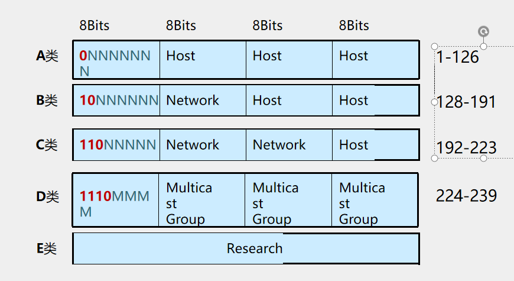

私有地址，这些地址被大量用于企业内部网络中。一些宽带路由器，也往往使用192.168.1.1作为缺省地址。私有网络由于不与外部互连，因而可能使用随意的IP地址。保留这样的地址供其使用是为了避免以后接入公网时引起地址混乱。使用私有地址的私有网络在接入Internet时，要使用地址翻译(NAT)，将私有地址翻译成公用合法地址。在Internet上，这类地址是不能出现的。对一台网络上的主机来说，它可以正常接收的合法目的网络地址有三种：本机的IP地址、广播地址以及组播地址。

#### 3.1.3 路由聚合

**找最长的公共前缀**，就是路由聚合。

#### 3.1.4 ARP地址解析协议

根据IP地址**寻找MAC地址**。

#### 3.1.5 ICMP网际控制报文协议

让主机、路由器报告差错、异常情况。有5种差错报告报文：

1. **终点不可达**：路由器、主机不能交付数据。
2. **源点抑制**：**拥塞、丢弃数据报**。
3. **时间超过**：生存时间**（TTL）为0**。
4. **参数问题**：**首部中字段值**不正确。
5. **改变路由**（重定向）：发现还有更好的路线，就会把**改变路由**报文发送给主机，要求退回去换另一条路。

常用的应用程序`ping`就是使用了ICMP的回送请求、回答报文。

ping这个icmp的数据包。

### 3.2❗IP分组转发

- **默认网关**（地址）

连接两个不同的网络的设备都可以叫**网关设备**；网关的作用就是实现两个网络之间进行通讯与控制。

网关设备可以是交互机（三层及以上才能跨网络）、路由器、启用了路由协议的服务器、代理服务器、防火墙等。

**网关地址**就是网关设备的IP地址。

假设我们有两个网络：

网络A的IP地址范围为“192.168.1.1~192.168.1.254”，子网掩码为255.255.255.0

网络B的IP地址范围为“192.168.2.1~192.168.2.254”，子网掩码为255.255.255.0

**要实现这两个网络之间的通信，则必须通过网关。**

**如果网络A中的主机发现数据包的目的主机不在本地网络中，就把数据包转发给它自己的网关，再由网关转发给网络B的网关，网络B的网关再转发给网络B的某个主机（如附图所示）。网络A向网络B转发数据包的过程。**

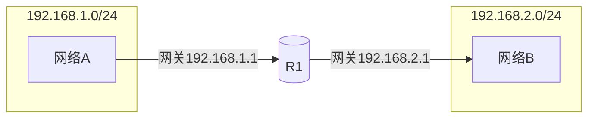

一台主机可以有多个网关。默认网关的意思是一台主机如果找不到可用的网关，就把数据包发给默认指定的网关，由这个网关来处理数据包。现在主机使用的网关，一般指的是默认网关。

> 扩展：自动设置默认网关
>
> 自动设置就是利用DHCP（动态主机配置协议）服务器来自动给网络中的计算机分配IP地址、子网掩码和默认网关。
>
> 一旦网络的默认网关发生了变化时，只要更改了DHCP服务器中默认网关的设置，那么网络中所有的计算机均获得了新的默认网关的IP地址。这种方法适用于网络规模较大、TCP/IP参数有可能变动的网络。

- 下一跳

是指IP路由表中去往目的地址的下一个站点（IP地址），它告诉路由器应该向哪一个设备的IP地址发送该数据包。

物理直连对端设备的接口IP地址

#### 路由表

| 目的网络 | 子网掩码                                 | 下一跳                           | 接口           |
| -------- | ---------------------------------------- | -------------------------------- | -------------- |
|          | 当有多个网段，那么就路由聚合为范围最大的 | 物理**直连对端**设备的接口IP地址 | 本路由上的接口 |

1. 转发时，先找**最长网络前缀（子网掩码大的）**匹配。
   - 就是当多个都可以匹配，找其中子网掩码（如`/24`）最大的。

2. **主机路由**（服务器）
   - 目的网络IP地址：就是服务器的IP
   - **子网掩码：32（255.255.255.255）**
3. **默认路由**（Internet路由）
   - 目的网络IP地址：0.0.0.0
   - **子网掩码：0（0.0.0.0）**

|          | 目的网络 | 子网掩码        |
| -------- | -------- | --------------- |
| 主机路由 | 主机的IP | 255.255.255.255 |
| 默认路由 | 0.0.0.0  | 0.0.0.0         |

【考点】

1. 单个局域网转发
2. 跨局域网转发

### 3.3❗数据报格式

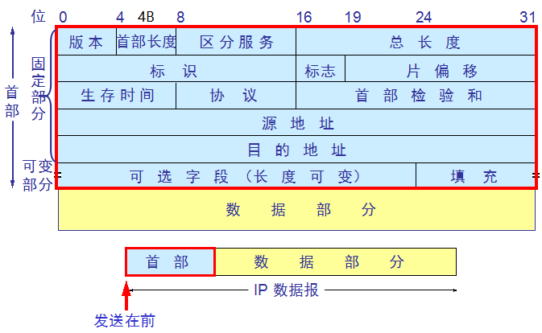

- 一个IP数据报由**首部**和**数据**两个部分组成。首部的前部分属于**固定部分，占20个字节**；后面部分属于可变部分，长度时可变的。
- 1、版本
  - 从图中可以看到，版本字段占4位。记录着通信双方使用的IP协议版本，比如IPv4、IPv6，目前广泛使用的是IPv4。
- 2、**首部长度 4位(bit)**
  - **单位：4字节**(Byte)
    - 【注意】也就是以4字节的**整数倍**划分，不足则填充。
  - 比如1111（十进制的15），乘上单位4B，就代表**首部长度**为60字节（15*4=60）。
  - 因为首部固定长度是20B，所以首部长度至少是5（0101）。同时最常用的首部长度也就是0101（20字节）。
- 3、区分服务
  - 占8位，用以获得更好的服务。实际中未使用。
- 4、**总长度 16b**
  - 即首部长度和数据长度之和。占16位。因此，最大长度可知为16位都是1，就是65535字节。
  - 在IP层下层数据链路层存在自己的帧格式，帧格式的数据字段最大传送单元（MTU）是1500字节。尽可能长的数据报能够提高传输效率，实际中数据报长度很少大于1500字节。所以，IP标准规定：所有主机和路由器的IP数据报长度不能小于576字节。
  - 如果数据报长度超过MTU，则将进行分片后再传送，与后面的片偏移相关。然后总长度就成了分片后每个分片的首部和数据的长度之和。
- 5、**标识**
  - 占16位。在实际IP中，维持了一个计数器，**每产生一个数据报，计数其加1，存放到该字段**。
  - IP是无连接服务，不存在按序接收问题，该标识不是序号，而是在进行分片之后对相同的数据报进行标识，属于同一个数据报的标识相同，以便到达目的后被重新封装为原来的数据报。
- 6、标志
  - 占3位。目前使用2两位有意义的。
  - 最低位：MF（More Fragment）还有分片，**MF=0时说明是最后一个分片**。
  - 中间位：DF（Don‘t Fragment）不能分片，**DF=0时才能分片，1时才可以分片**。
- 7、**片偏移 13b**
  - **单位：4字节**
  - 占13位。用于记录较长分组中，一个分片在原数据报中的相对位置。片偏移以8字节为单位，长度是8字节的整数倍。

> 假设一个数据报总长度为3820字节。首部20字节和数据3800字节。现在要求长度不超过1420字节，那么它的每个分片为多少呢？

我们简单分析一下，数据部分尽可能长的可以分为1400,1400,1000三个分片，这样再加上首部满足小于1420字节。

分片一：0-1399字节，因此片偏移=0/8=0

分片二：1400-2799字节，片偏移=1400/8=175

分片三：2800-3800字节，片偏移=2800/8=350

很容易就计算出每个分片的片偏移。

- 8、生存时间

  - **TTL**（Time To Live）占8位。最大值255。
  - 每个数据报都有TTL，防止被错误路由在网络中不断循环，消耗网络资源。
  - 在实际中，TTL表示的是**跳数**而不是时间，指明数据报在网络中最多可经过**多少个路由器**。
    - **经过一个路由器就 -1**，不管如OSPF的链路值。
    - **如果TTL=1，那么就不会被转发**。

- 9、协议

  - 占8位。指明数据报携带的数据是使用什么协议，方便目的主机的IP层将数据交给对应的程序处理，这里列举几个。

  - | 协议   | ICMP | IGMP | TCP  | UDP  | OSPF |
    | ------ | ---- | ---- | ---- | ---- | ---- |
    | 字段值 | 1    | 2    | 6    | 17   | 89   |

- 10、首部检验和

  - 占16位。只校验数据报首部，不包括数据部分。这样可以减少计算量，同时不采用复杂的CRC检验码，而是使用简单的反码算术运算。
  - 反码算术运算：将数据报首部划分为多个16位的序列，16位序列相加之和取反码，写入检验和。接收方再将首部16位序列（包含检验和的16位）相加之和取反码，**结果为0则说明数据报正确**，否则丢弃。

### 3.4❗DHCP动态主机配置协议

客户会在PC上装**DHCP客户端**。

DHCP使用客户服务器方式，基本原理如：

- 1、需要IP地址的主机在启动时，就向**DHCP服务器广播**发送**DHCP发现报文**(DHCP DISCOVER)，将目的IP地址置为全1，即255.255.255.255，这时该主机就成为DHCP客户。

  - 发送广播报文是因为现在还不知道DHCP服务器在什么地方，因此要发现DHCP服务器的IP地址。由于当前主机目前还没有IP地址，因此它将IP数据报的源IP地址设为全0。
  - 这样，在本地网络上的所有主机都能够收到这个广播报文，但只有DHCP服务器才对此广播报文进行回答。
  - 因为DHCP允许网络上配置多台DHCP服务器，所以当DHCP客户发出DHCP"发现"报文后，有可能收到多个响应报文。这时，DHCP客户只会挑选其中的一个，通常挑选最先到达的。
- 2、DHCP服务器先在其数据库中查找该计算机的配置信息。
  - 若找到，则返回找到的信息。
  - 若找不到，则从服务器的IP地址池中取一个地址分配给该计算机。
    - DHCP服务器广播发送**DHCP提供报文**(DHCP OFFER)。
      - “提供”了IP地址等配置信息，目的地址为255.255.255.255（广播，因为也不知道是谁发的）。

- 3、DHCP客户收到"**DHCP提供**”消息，若接受该IP地址，则广播"DHCP请求"消息向DHCP服务器请求提供IP地址。
  - 源地址为0.0.0.0，目的地址为255.255.255.255。
- 4、DHCP服务器广播"**DHCP确认**”消息，将IP地址分配给DHCP客户。
  - 源地址为DHCP服务器地址，目的地址为255.255.255.255。

**【技巧】目的地址始终是全1**。

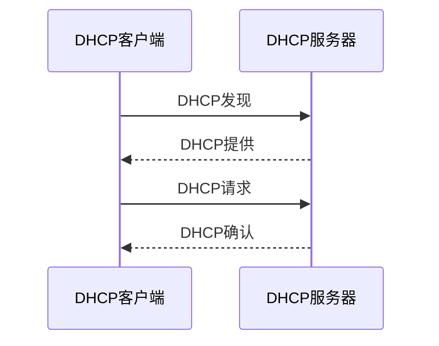

【注意】DHCP报文只是UDP用户数据报的数据，它还要加UDP首部、IP数据报首部等。因此，DHCP是基于UDP的。

### 3.5❗NAT网络地址转换

> 若在专用网内部的一些主机本来已经分配到了本地IP地址(专用地址)，但现在又想和互联网上的主机通信，那么应当采取什么措施呢?
>
> 使用用**网络地址转换**来解决这个问题。

网络地址转换NAT (Network Address Translation）需要在专用网连接到互联网的路由器上安装NAT软件。装有NAT软件的路由器叫作NAT路由器，它具有全球IP地址。当使用本地地址的主机在和外界通信时，**NAT路由器**会将其本地地址转换成全球IP地址。

NAT 3种分类：**静态、动态、端口复用**（NAPT）

---

IP分组**源地址**会改变：**从原本的内网地址，换成NAT路由器==另一面==的IP地址**。

【注意】另一面的IP地址，要分析那些IP地址可以用。

### 3.6 路由选择协议

互联网中有两大类路由选择协议，他们分别是：

- 内部网关协议 IGP：在路由器的小团体之间进行通信所使用的协议，如 **RIP** 和 **OSPF** 等。
- 外部网关协议 EGP：小团体与小团体之间交流所使用的协议，目前使用的协议就是 **BGP**。

#### 3.6.1 RIP路由信息协议

基于UDP，是应用层协议。

- 从一个路由器到直接连接的网络的距离定义为 1。

- 从一个路由器到非直接连接的网络的距离定义为所经过的路由器数加 1。
- “距离” 也称为 “跳数”，因为**每经过一个路由器，跳数就加 1**。

这里的“距离”实际上指的是“最短距离”，RIP 认为一个好的路由就是它通过的**路由器的数目少，即“距离短”**，会优先选择。

RIP 允许一条路径最多只能包含 15 个路由器，所以**“距离”=16时，网络不可达**。

RIP交换特点：

1. 交换方式：仅和**直接相邻路由器**交换信息，不相邻不行。
2. 交换内容：交换的信息是当前本路由器所知道的**全部信息**，即自己的路由表。
3. 交换时间：**按固定的时间间隔**交换路由信息，例如：每隔 30 秒。

【注意】**坏消息传得慢**。

#### 3.6.2 OSPF开放最短路径优先

基于IP数据报，网络层协议。

- 工作原理：
  1. 发送hello报文，建立邻居关系。
  2. **洪泛法 LSA**，形成 **LSDB（链路状态数据库）**。向水一样，向所有的路由器交换信息。
     - **只有链路发生变化的时候**，路由器才洪泛，并且更新过程收敛很快。没有“坏消息传得慢”。
     - 所以，所有的路由器都是链路状态。
     - 直连网络`0.0.0.0`的费用（metric）是 **10**。
  3. 运行SPF算法，找最有路由。
     - 不同路径可以设置不同的代价，最后会选择最佳路径（迪杰斯特拉算法）。
- 分区：OSPF 使用层次结构的区域划分。
  - 在上层的区域叫作**主干区域** area0。
    - 主干区域的标识符规定为`0.0.0.0`。主干区域的作用是用来连通其他在下层的区域。
  - **非主干区域** area1，area2。
  - 通信时，主干区域、非主干区域必须相连。

#### 3.6.3 BGP边界网关协议

基于TCP，应用层协议。

一个**自治系统（AS）**里面有两种不同功能的路由器：

1. 边界路由器（边界网关，**BGP发言人**）
2. 内部路由器

一个 **BGP发言人**与**其他自治系统**中的 BGP 发言人要交换路由信息，就要先建立 TCP 连接（这种TCP连接称为，半永久性连接），然后在此连接上交换 BGP 报文以建立 BGP 会话(session)，利用 BGP 会话交换路由信息。

路由选择：

- 1、优选协议**首选值**（pref val）最高的值。
- 2、优选**本地优先**级（local_pref）最高的路由。
- 3、依次优选手动**聚合路由**，自动聚合路由，network命令引入的路由，import-route命令引入的路由，从对等体学到的路由。
- 4、优选**AS_PATH最短（AS跳出最短）**的路由。
- 5、依次优选origin类型为IGP，EGP，incomplete的路由。
- 6、对于来自同一AS的路由，优选MED值最低的路由。
- 7、依次优选EBGP路由、IBGP路由、local cross路由、remote cross路由。
- 8、优选BGP下一跳IGP度量值metric最小的路由。
- 9、优选cluster_list最短的路由。
- 10、优选router ID最小的设备发布的路由（如果路由携带originator_ID属性，选路过程中将比较（riginator_ID的大小，不再比较router ID，并优选originator_ID最小的路由）。
- 11、优选从具有最小IP address的对等体学来的路由。

### 3.7 SDN网络体系结构

**上北下南左西右东**。

数据向上发：北向接口。

数据向下发：南向接口。

数据平层传输：东西接口。

### 3.8 IPv6

IPv4：32位。IPv6：**128位**，是IPv4的**2^96^倍**。（【注意】不是96倍）

IPv6基本报头：

- Version 版本
- Traffic Class 流类别
- Flow Label 流标签
  - 区分实时流量，为数据流指定网络中的转发路径，提高数据处理效率
  - 比如是 视频、图片
- Payload Length 有效载荷长度
  - ipv6基本报头的后面的 TCP和Data
- Next Header 下一个报头
  - 定义紧跟在ipv6中基本报头之后的第一个扩展报头的类型
- Hop limit 跳数限制
  - 类似ipv4中的TTL
- 源IP地址
- 目的IP地址
- 不同的扩展报头提供不同的功能

|                      | IPv6                                         | IPv4             |
| -------------------- | -------------------------------------------- | ---------------- |
| 大小                 | 128位                                        | 32位             |
| 首部长度             | 40B，不可变                                  | 4B的整数倍，可变 |
| 过渡                 | IPv4使用**双协议栈、隧道技术**可以过渡为IPv6 |                  |
| 生存时间（限制跳数） | hop limit                                    | TTL              |
| 配置协议             | 不需要配置                                   | DHCP             |
| 分片                 | 端到端，不分片                               | 路由分片         |
| 地址解析协议ARP      | 不需要                                       | ARP              |

### 3.9 网络设备

- 物理层
  - **中继器** hub
  - **集线器**
- 数据链路层
  - **交换机** switch：隔离**冲突域**
- 网络层
  - **路由器** Router：区分**广播域**

## 4.传输层

产生原因：由于数据具有不同的需求，需要封装不同的传输层协议。

传输单位：**报文段segment**。

作用：

1. 负责建立**端到端**的连接，保证报文在端到端之间的传输。
1. 传输层为资源子网屏蔽了下层的通信子网。
1. 根据数据需求，使用TCP协议、UDP协议，封装应用层数据。
2. 数据分段：传输层的数据被称为**数据段**。

| TCP首部 / UDP首部 | 应用层数据 |
| ----------------- | ---------- |

- TCP首部：20B
- UDP首部：8B

> 【2021年408真题】例如：有一个应用层数据12B，问TCP、UDP传输的效率。
>
> 因为TCP首部 20B，所以加上12B的应用层数据，报文段是32B，所以传输效率：12 / 32 = 37.5%。
>
> 而UDP首部 8B，所以加上12B的应用层数据，报文段是20B，所以传输效率：12 / 20 = 60%。

### 4.1❗TCP传输控制协议

协议号：6

- TCP头部包含：
  - 端口号：传输层端口号识别应用层协议
    - HHTP：80
    - FTP：20，21
  - 标志位
    - **ACK（确认位）**
    - **SYN（请求位）**
    - **FIN（结束位）**
  - 窗口大小Windows
- 面向链接：传送数据之前建立连接（可靠）

#### 4.1.1可靠的原因（三次握手、四次分手）

- **1、**传输数据之前：**TCP三次握手**
  - 1.主机sent SYN
  - 2.服务器sent SYN,ACK
  - 3.主机sent ACK

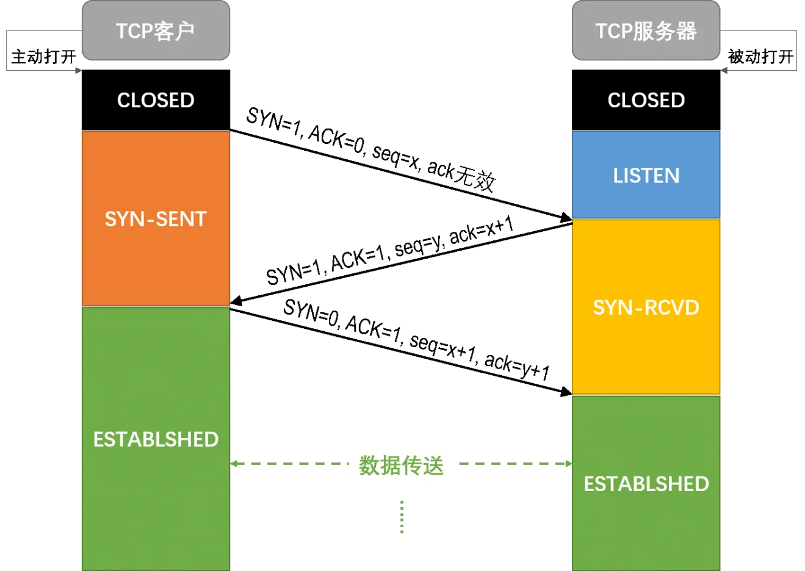

【注意】

1. 前两次握手消耗序号。
2. **ack**记录的是**期待的序号**，也就是希望下一个收到的序号。

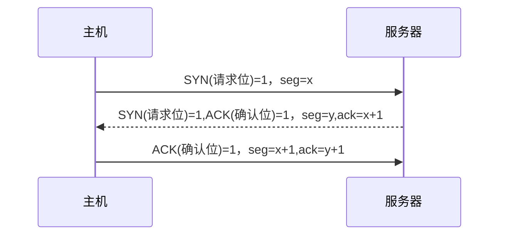

- **2、**传输数据过程中：
  - 确认号确认机制（丢包重传机制）
  - 滑动窗口机制（流量控制机制）

- **3、**传输数据之后：**TCP四次分手**
  - 1.主机sent FIN,ACK
  - 2.服务器sent ACK
  - 3.服务器sent FIN,ACK
  - 4.主机sent ACK

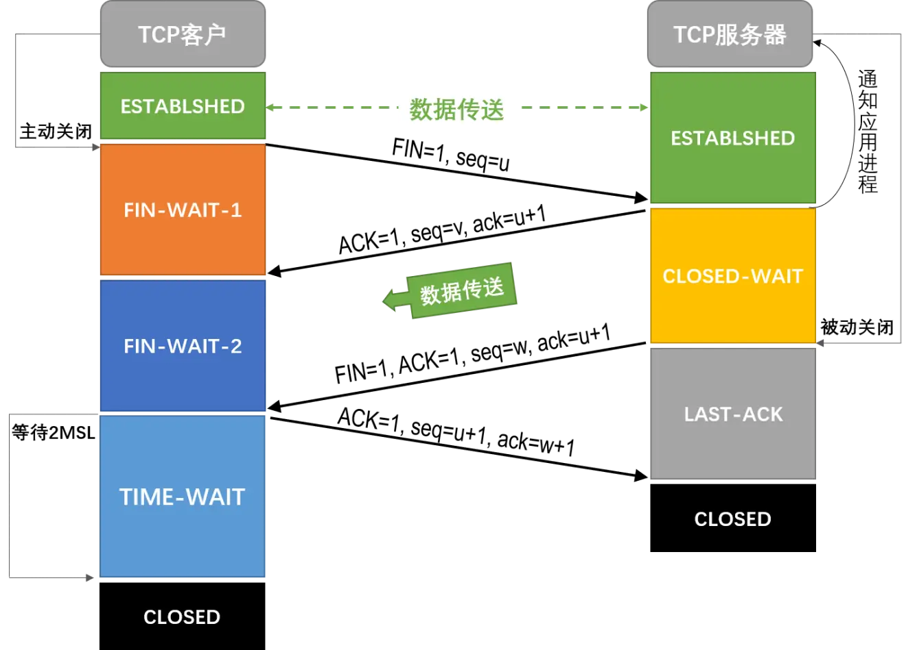

【注意】服务器第二次和第三次几乎可以同时发送。

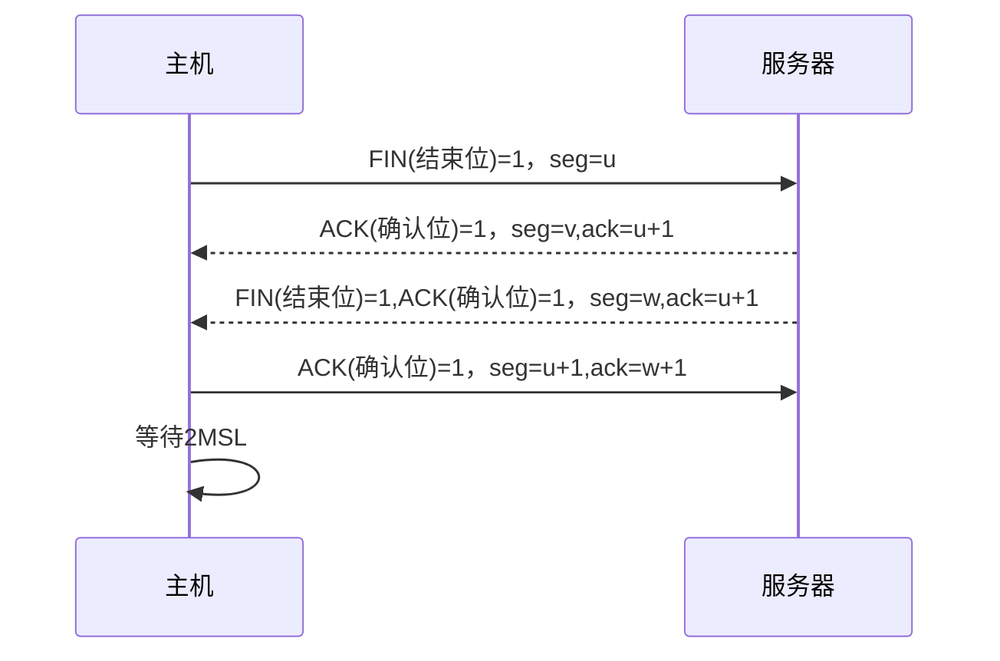

#### 4.1.2拥塞控制算法

1. 慢开始
   - 一开始报文段少，测试网络阻塞情况。
2. 拥塞避免
   - 拥塞窗口cwnd按线性加法增大。
3. 快重传
   - 发送方（主机）收到3个冗余的ACK（共1+3=4个ACK），就立刻开始重传相应的报文段。
4. 快恢复
   - 把cwnd调整为之前的一半。

【考点：计算RTT】一开始如果超时，那么就把**拥塞窗口减为一半a**。从一开始的最大段（MSS=1KB）增长。**两倍两倍得增长**，直到为这个一半的拥塞窗口a，再线性加法（**加一加一**）增大。

#### 4.1.3 TCP报文首部格式

**TCP首部**大小最小是：**20B**。

**数据偏移**：占4位，单位是4B。

它指出TCP报文段的数据起始处距离TCP报文段的起始处有多远。这个字段实际上是指出TCP报文段的首部长度。

### 4.2 UDP用户数据包协议

协议号：17

**UDP首部**大小是：**8B**。

1. UDP是**无连接的**。即发送数据之前不需要建立连接，因此减少了开销和发送数据之前的时延。
2. UDP**不保证可靠交付**。
3. UDP**没有拥塞控制**，因此网络出现的拥塞不会使源主机的发送速率降低。

所以**快**，但是不如TCP安全。

常用于IP电话、视频聊天时，可以接受数据包的丢失（画质不清晰）但不能接受延迟，不对所有数据包确认。

4. 每个进程通过一个端口来标识，具有复用和分用功能：
   - **复用**指多个应用进程同时使用传输层传输；
   - **分用**指传输层把收到的信息分别交给上层不同的进程。
     - 分用依据：**目的端口号**。
5. UDP支持一对一、多对一和多对多的交互通信。

